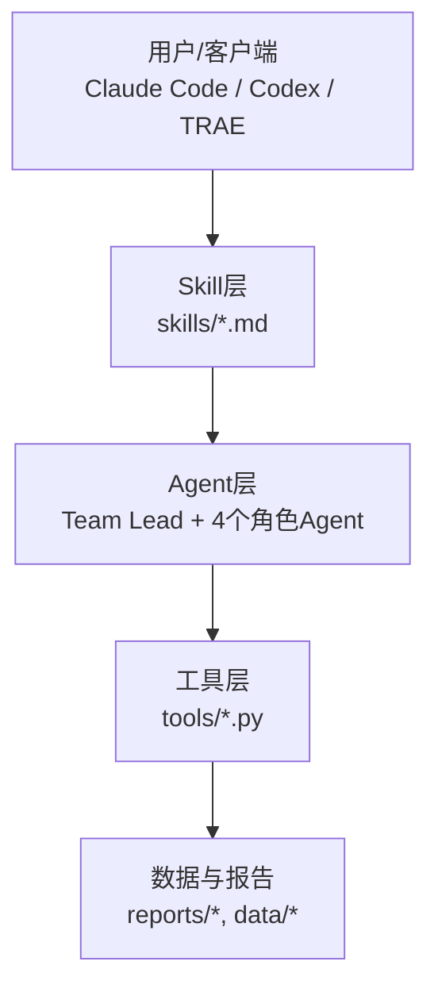
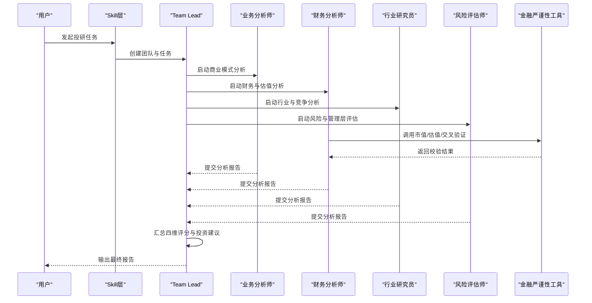
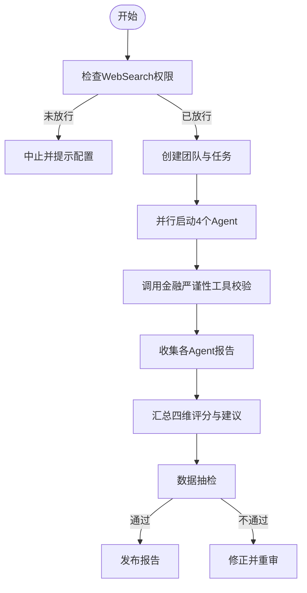
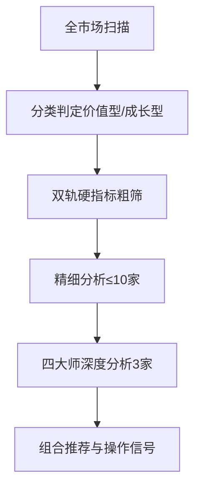
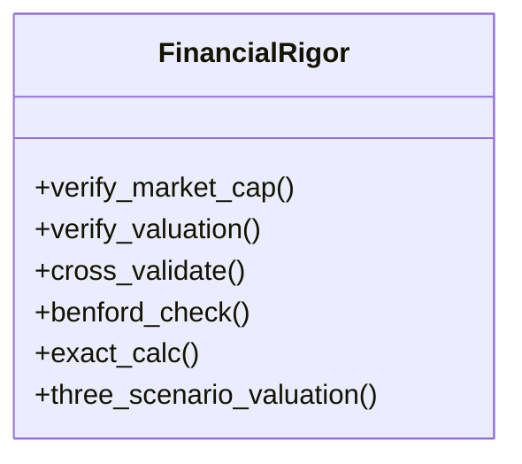
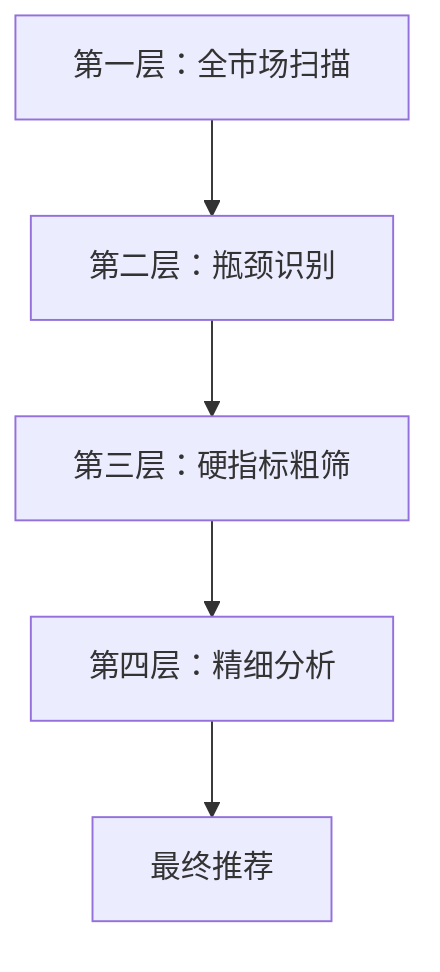
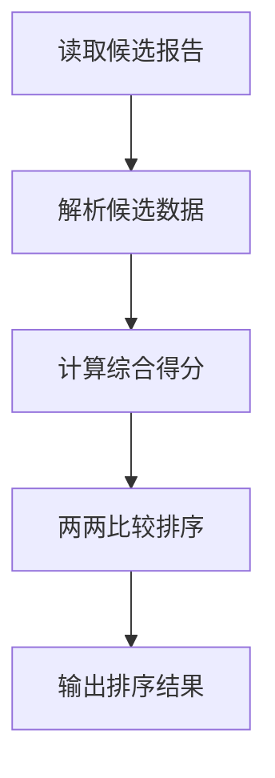
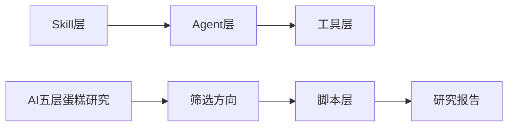

# AI产业分析框架

<cite>
**本文引用的文件**   
- [README.md](file://README.md)
- [CONTEXT.md](file://CONTEXT.md)
- [AGENTS.md](file://AGENTS.md)
- [skills/investment-team.md](file://skills/investment-team.md)
- [skills/industry-funnel.md](file://skills/industry-funnel.md)
- [tools/financial_rigor.py](file://tools/financial_rigor.py)
- [scripts/funnel_analysis.py](file://scripts/funnel_analysis.py)
- [tools/candidate_ranker.py](file://tools/candidate_ranker.py)
- [reports/AI产业研究/AI五层蛋糕-产业全景研究-20260605.md](file://reports/AI产业研究/AI五层蛋糕-产业全景研究-20260605.md)
- [reports/AI产业研究/AI五层蛋糕-公众号-20260605.md](file://reports/AI产业研究/AI五层蛋糕-公众号-20260605.md)
</cite>

## 目录
1. [引言](#引言)
2. [项目结构](#项目结构)
3. [核心组件](#核心组件)
4. [架构总览](#架构总览)
5. [详细组件分析](#详细组件分析)
6. [依赖关系分析](#依赖关系分析)
7. [性能与可扩展性](#性能与可扩展性)
8. [故障排查指南](#故障排查指南)
9. [结论](#结论)
10. [附录](#附录)

## 引言
本仓库是一套面向AI产业投资研究的系统化框架，将“四大师”（段永平、巴菲特、芒格、李录）方法论结构化，并通过多Agent并行、工具链校验与漏斗式筛选，形成从行业扫描到个股终选的完整投研流程。其目标是在AI时代以更高效率与更严谨的数据纪律完成产业与公司级研究，输出可复现、可审计的投资研究报告。

## 项目结构
仓库采用“Skill + Agent + Tools”的三层设计：
- Skill层：定义投研入口与流程（如投资团队、行业漏斗、财报精读等）。
- Agent层：通过Team Lead调度多个角色Agent并行执行研究任务。
- 工具层：提供精确计算、数据交叉验证、报告抽检等能力。

图表来源
- [README.md:161-172](file://README.md#L161-L172)
- [AGENTS.md:7-53](file://AGENTS.md#L7-L53)

章节来源
- [README.md:161-172](file://README.md#L161-L172)
- [AGENTS.md:7-53](file://AGENTS.md#L7-L53)

## 核心组件
- 投研团队（investment-team）：四角色并行分析（商业模式、财务估值、行业竞争、风险与管理层），强制数据交叉验证与金融严谨性工具调用。
- 行业漏斗（industry-funnel）：全市场扫描→双轨粗筛→精细分析→四大师深度分析→组合推荐。
- 金融严谨性工具（financial_rigor.py）：市值验算、估值指标验算、多源交叉验证、Benford检测、三情景估值、精确计算器。
- 行业漏斗脚本（funnel_analysis.py）：美股科技子行业扫描、瓶颈识别、粗筛与精选。
- 候选排序器（candidate_ranker.py）：汇总各报告候选，进行两两比较与综合评分排序。
- AI五层蛋糕研究：基于黄仁勋“五层蛋糕”框架的产业全景与卡脖子环节定位。

章节来源
- [skills/investment-team.md:1-234](file://skills/investment-team.md#L1-L234)
- [skills/industry-funnel.md:1-334](file://skills/industry-funnel.md#L1-L334)
- [tools/financial_rigor.py:1-466](file://tools/financial_rigor.py#L1-L466)
- [scripts/funnel_analysis.py:1-202](file://scripts/funnel_analysis.py#L1-L202)
- [tools/candidate_ranker.py:1-101](file://tools/candidate_ranker.py#L1-L101)
- [reports/AI产业研究/AI五层蛋糕-产业全景研究-20260605.md:1-40](file://reports/AI产业研究/AI五层蛋糕-产业全景研究-20260605.md#L1-L40)

## 架构总览
整体工作流由Skill驱动，Agent并行执行，工具保障数据质量，最终产出标准化报告并进入抽检流程。

图表来源
- [skills/investment-team.md:49-158](file://skills/investment-team.md#L49-L158)
- [tools/financial_rigor.py:74-173](file://tools/financial_rigor.py#L74-L173)

章节来源
- [skills/investment-team.md:49-158](file://skills/investment-team.md#L49-L158)
- [tools/financial_rigor.py:74-173](file://tools/financial_rigor.py#L74-L173)

## 详细组件分析

### 投研团队（investment-team）
- 角色分工：team-lead统筹；business-analyst（段永平视角）、financial-analyst（巴菲特视角）、industry-researcher（芒格视角）、risk-assessor（李录视角）。
- 关键机制：
  - WebSearch权限预检，避免后台Agent静默退化。
  - 信息丰富度评级（A/B/C）影响研究策略。
  - 强制使用金融严谨性工具进行市值、估值、交叉验证与三情景估值。
  - 输出包含一句话结论、四维评分、看多/看空论点、分层操作建议与关键催化剂。
- 准出流程：报告生成后执行数据抽检，通过方可发布。

图表来源
- [skills/investment-team.md:34-48](file://skills/investment-team.md#L34-L48)
- [skills/investment-team.md:113-158](file://skills/investment-team.md#L113-L158)
- [skills/investment-team.md:203-218](file://skills/investment-team.md#L203-L218)

章节来源
- [skills/investment-team.md:1-234](file://skills/investment-team.md#L1-L234)

### 行业漏斗（industry-funnel）
- 漏斗结构：全市场扫描（活跃度+涨幅+市值前30并集）→双轨粗筛（价值型/成长型）→精细分析（每家300-500字）→四大师深度分析（3家）→组合推荐。
- 偏见自觉：龙头偏好、英文偏好、故事偏好、当下偏好、上市偏见的识别与应对。
- 输出要求：每层淘汰记录、信息来源标注、估计值标注、正反两面论证。

图表来源
- [skills/industry-funnel.md:21-35](file://skills/industry-funnel.md#L21-L35)
- [skills/industry-funnel.md:279-322](file://skills/industry-funnel.md#L279-L322)

章节来源
- [skills/industry-funnel.md:1-334](file://skills/industry-funnel.md#L1-L334)

### 金融严谨性工具（financial_rigor.py）
- 功能模块：
  - 市值验算：股价×总股本 vs 报告市值，偏差阈值告警。
  - 估值指标验算：PE/PB/ROE/FCF Yield/PS/股息率等精确计算。
  - 多源交叉验证：中位数共识值与容差检测。
  - Benford定律检测：财务数据首位数字分布异常预警。
  - 精确计算器：安全表达式求值，避免浮点误差。
  - 三情景估值：乐观/中性/悲观目标价与涨跌幅。
- 设计原则：全部使用Decimal精确十进制运算，确保可审计与可复现。

图表来源
- [tools/financial_rigor.py:74-173](file://tools/financial_rigor.py#L74-L173)
- [tools/financial_rigor.py:180-294](file://tools/financial_rigor.py#L180-L294)
- [tools/financial_rigor.py:301-373](file://tools/financial_rigor.py#L301-L373)

章节来源
- [tools/financial_rigor.py:1-466](file://tools/financial_rigor.py#L1-L466)

### 行业漏斗脚本（funnel_analysis.py）
- 覆盖范围：美股科技子行业（半导体、存储、设备、云、SaaS、网络安全、数据中心电力/冷却等）。
- 流程：
  - 第一层：按子行业统计行情与距高点回撤。
  - 第二层：瓶颈猎手识别（液冷、HBM、CoWoS、定制ASIC、光通信、配电等）。
  - 第三层：5条硬指标粗筛（PASS/HOLD/FAIL）。
  - 第四层：Top候选精细分析与最终推荐。
- 输出：逐层筛选记录与最终唯二标的建议。

图表来源
- [scripts/funnel_analysis.py:83-142](file://scripts/funnel_analysis.py#L83-L142)
- [scripts/funnel_analysis.py:144-196](file://scripts/funnel_analysis.py#L144-L196)

章节来源
- [scripts/funnel_analysis.py:1-202](file://scripts/funnel_analysis.py#L1-L202)

### 候选排序器（candidate_ranker.py）
- 输入：各行业漏斗/瓶颈报告中的候选股。
- 方法：两两比较（冒泡排序），权重包括上行空间、估值、护城河、催化临近、财务健康。
- 输出：综合评分排序与明细，辅助最终决策。

图表来源
- [tools/candidate_ranker.py:31-75](file://tools/candidate_ranker.py#L31-L75)
- [tools/candidate_ranker.py:78-101](file://tools/candidate_ranker.py#L78-L101)

章节来源
- [tools/candidate_ranker.py:1-101](file://tools/candidate_ranker.py#L1-L101)

### AI五层蛋糕研究
- 框架：应用层、模型层、基础设施层、芯片层、能源层。
- 观点：越底层越物理、越不可替代，确定性越高；卖铲子的确定性高于淘金者。
- 中国对比：列出每层最强公司与全球差距，强调商业化能力差异。

章节来源
- [reports/AI产业研究/AI五层蛋糕-产业全景研究-20260605.md:1-40](file://reports/AI产业研究/AI五层蛋糕-产业全景研究-20260605.md#L1-L40)
- [reports/AI产业研究/AI五层蛋糕-公众号-20260605.md:1-114](file://reports/AI产业研究/AI五层蛋糕-公众号-20260605.md#L1-L114)

## 依赖关系分析
- Skill与Agent：Skill定义流程，Agent执行具体任务，Team Lead协调。
- Agent与工具：财务分析师调用金融严谨性工具进行数据校验。
- 脚本与报告：funnel_analysis.py生成筛选结果，candidate_ranker.py汇总排序。
- 研究与输出：AI五层蛋糕研究作为产业框架指导筛选方向。

图表来源
- [README.md:161-172](file://README.md#L161-L172)
- [skills/investment-team.md:113-158](file://skills/investment-team.md#L113-L158)
- [scripts/funnel_analysis.py:83-142](file://scripts/funnel_analysis.py#L83-L142)

章节来源
- [README.md:161-172](file://README.md#L161-L172)
- [skills/investment-team.md:113-158](file://skills/investment-team.md#L113-L158)
- [scripts/funnel_analysis.py:83-142](file://scripts/funnel_analysis.py#L83-L142)

## 性能与可扩展性
- 并行化：4个Agent同时运行，提升研究深度与信息量。
- 工具复用：金融严谨性工具被多Skill共享，保证一致性。
- 扩展点：新增Skill或子行业可通过现有模板快速接入。
- 成本与模型：深度研究消耗较高，建议在高风险高重要性判断时使用更强模型。

[本节为通用指导，无需特定文件引用]

## 故障排查指南
- WebSearch权限问题：后台Agent无法联网会导致研究降级，需在权限白名单中放行。
- 数据不一致：使用交叉验证工具检测来源偏差，优先采用公司年报/交易所数据。
- 报告质量：执行数据抽检，未通过需修正重审。
- 计算精度：所有财务计算使用Decimal，避免浮点误差。

章节来源
- [skills/investment-team.md:34-48](file://skills/investment-team.md#L34-L48)
- [tools/financial_rigor.py:180-217](file://tools/financial_rigor.py#L180-L217)
- [skills/investment-team.md:203-218](file://skills/investment-team.md#L203-L218)

## 结论
本框架通过结构化Skill、多Agent并行与严格工具链，实现了AI产业与公司级投资的系统化研究。其核心价值在于：
- 可复现的研究流程与数据校验。
- 多维度对抗分析（四大师视角）。
- 从产业全景到个股终选的完整漏斗。
- 明确的偏见自觉与留白原则。

[本节为总结性内容，无需特定文件引用]

## 附录
- 快速开始：安装客户端与Skills，调用对应命令或自然语言指令。
- 实战报告：查看reports目录下真实研究案例。
- 未来方向：历史回测、宏观经济周期分析、实时数据接入。

章节来源
- [README.md:230-403](file://README.md#L230-L403)
- [README.md:667-679](file://README.md#L667-L679)
- [README.md:712-717](file://README.md#L712-L717)