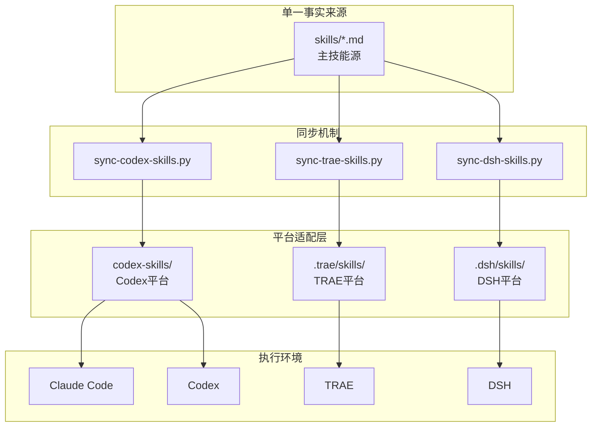
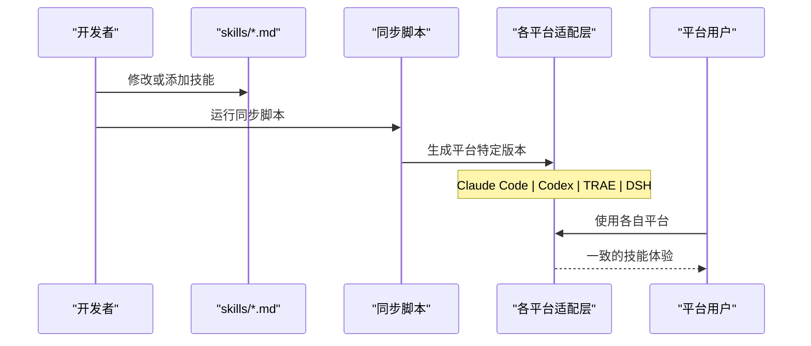
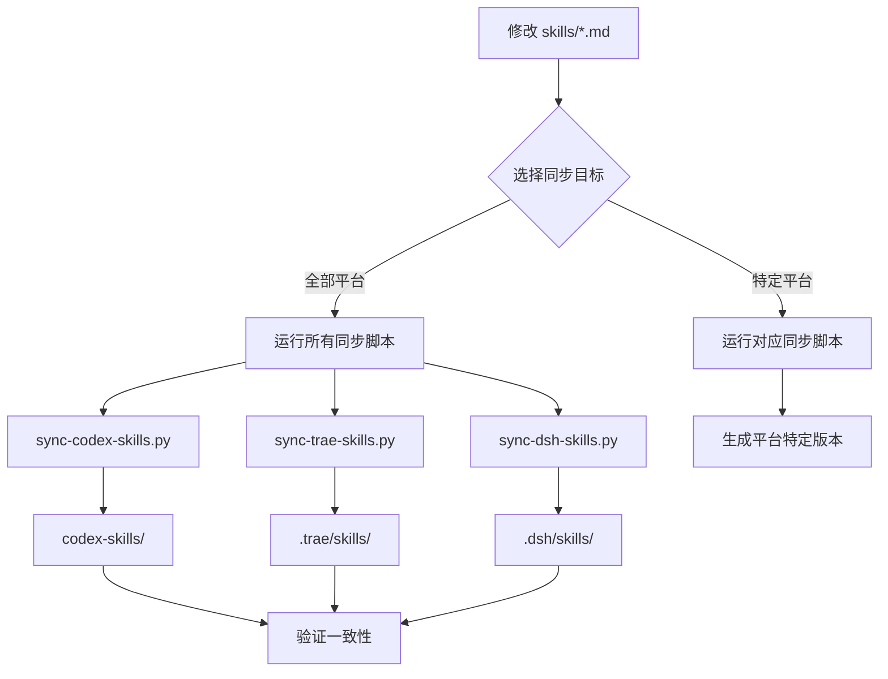
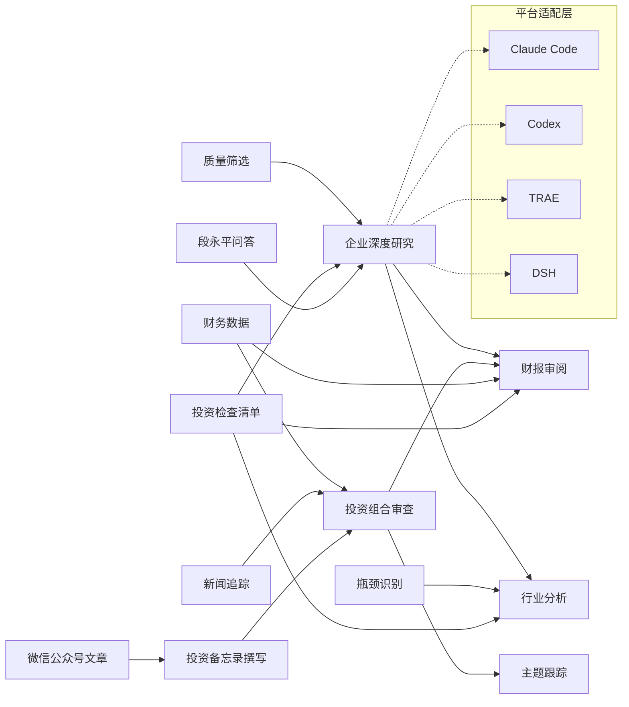

# AI技能系统

<cite>
**本文引用的文件**   
- [README_EN.md](file://README_EN.md)
- [AGENTS.md](file://AGENTS.md)
- [scripts/sync-dsh-skills.py](file://scripts/sync-dsh-skills.py)
- [scripts/sync-trae-skills.py](file://scripts/sync-trae-skills.py)
- [scripts/sync-codex-skills.py](file://scripts/sync-codex-skills.py)
- [.dsh/skills/deep-company-series/SKILL.md](file://.dsh/skills/deep-company-series/SKILL.md)
- [.trae/skills/deep-company-series/SKILL.md](file://.trae/skills/deep-company-series/SKILL.md)
- [.dsh/skills/earnings-review/SKILL.md](file://.dsh/skills/earnings-review/SKILL.md)
- [.trae/skills/earnings-review/SKILL.md](file://.trae/skills/earnings-review/SKILL.md)
- [codex-skills/deep-company-series/SKILL.md](file://codex-skills/deep-company-series/SKILL.md)
- [codex-skills/earnings-review/SKILL.md](file://codex-skills/earnings-review/SKILL.md)
- [codex-skills/industry-research/SKILL.md](file://codex-skills/industry-research/SKILL.md)
- [codex-skills/portfolio-review/SKILL.md](file://codex-skills/portfolio-review/SKILL.md)
- [codex-skills/investment-team/SKILL.md](file://codex-skills/investment-team/SKILL.md)
- [codex-skills/financial-data/SKILL.md](file://codex-skills/financial-data/SKILL.md)
- [codex-skills/bottleneck-hunter/SKILL.md](file://codex-skills/bottleneck-hunter/SKILL.md)
- [codex-skills/quality-screen/SKILL.md](file://codex-skills/quality-screen/SKILL.md)
- [codex-skills/private-company-research/SKILL.md](file://codex-skills/private-company-research/SKILL.md)
- [codex-skills/news-pulse/SKILL.md](file://codex-skills/news-pulse/SKILL.md)
- [codex-skills/thesis-tracker/SKILL.md](file://codex-skills/thesis-tracker/SKILL.md)
- [codex-skills/thesis-drift/SKILL.md](file://codex-skills/thesis-drift/SKILL.md)
- [codex-skills/investment-checklist/SKILL.md](file://codex-skills/investment-checklist/SKILL.md)
- [codex-skills/investment-memo-craft/SKILL.md](file://codex-skills/investment-memo-craft/SKILL.md)
- [codex-skills/dyp-ask/SKILL.md](file://codex-skills/dyp-ask/SKILL.md)
- [codex-skills/wechat-article/SKILL.md](file://codex-skills/wechat-article/SKILL.md)
- [scripts/install-codex-skills.sh](file://scripts/install-codex-skills.sh)
- [tools/stock_screener.py](file://tools/stock_screener.py)
- [tools/morningstar_fair_value.py](file://tools/morningstar_fair_value.py)
- [tools/report_audit.py](file://tools/report_audit.py)
</cite>

## 更新摘要
**所做更改**
- 新增DSH（DeepSeek Harness）平台完整支持章节，包含20个项目级技能
- 更新多平台同步架构说明，涵盖Claude Code、Codex、TRAE和DSH四大平台
- 增强平台特定适配器机制说明，包括工具映射和权限管理
- 更新技能分发与同步流程，实现统一的工作流管理
- 补充各平台工具映射差异和最佳实践指南

## 目录
1. [简介](#简介)
2. [项目结构](#项目结构)
3. [核心组件](#核心组件)
4. [多平台支持架构](#多平台支持架构)
5. [详细组件分析](#详细组件分析)
6. [依赖关系分析](#依赖关系分析)
7. [性能与扩展性](#性能与扩展性)
8. [故障排查指南](#故障排查指南)
9. [结论](#结论)
10. [附录](#附录)

## 简介
本仓库围绕"AI技能系统"构建，将投资研究流程拆解为可复用、可组合的"技能（Skill）"。每个技能以声明式描述（SKILL.md）定义其目标、输入参数、处理步骤与输出规范；通过安装脚本与同步工具进行注册与分发；在运行时由调度器按任务需求选择并编排多个技能协作完成复杂投研工作流。现有20+个专业投资研究技能覆盖企业深度研究、财报审阅、行业分析、投资组合审查等关键场景，并提供质量筛选、瓶颈识别、主题跟踪、新闻追踪等辅助能力。

**最新更新**：系统现已全面支持DSH（DeepSeek Harness）平台，实现了Claude Code、Codex、TRAE和DSH四大平台的统一技能管理，所有20个项目级技能在各平台间保持完全同步，提供一致的投资研究体验。

## 项目结构
- **技能定义**：位于 `skills/*.md`，作为单一事实来源（Single Source of Truth），采用统一的结构化格式描述技能元数据、参数、步骤与输出。
- **平台适配层**：
  - `codex-skills/*/SKILL.md`：Codex平台专用技能包
  - `.trae/skills/*/SKILL.md`：TRAE平台项目级技能
  - `.dsh/skills/*/SKILL.md`：DSH平台项目级技能（最高优先级100）
- **提示词模板**：位于 `codex-prompts/`，提供面向不同角色的对话与报告生成模板。
- **同步脚本**：`scripts/` 下包含各平台专用的安装与同步脚本。
- **工具集**：`tools/` 提供选股、估值、审计等实用工具，供技能在执行阶段调用。
- **示例与产出**：`reports/` 展示基于技能产出的研究报告样例。

**图表来源**
- [AGENTS.md:7-25](file://AGENTS.md#L7-L25)
- [scripts/sync-dsh-skills.py:1-15](file://scripts/sync-dsh-skills.py#L1-L15)
- [scripts/sync-trae-skills.py:1-10](file://scripts/sync-trae-skills.py#L1-L10)
- [scripts/sync-codex-skills.py:1-15](file://scripts/sync-codex-skills.py#L1-L15)

## 核心组件
- **技能定义（SKILL.md）**
  - 职责：声明技能名称、版本、描述、输入参数、执行步骤、输出格式与依赖项。
  - 特点：结构化、可解析、可组合；支持多语言与角色视角切换。
- **平台适配器**
  - 职责：将通用技能转换为特定平台可用的格式，处理平台特定的工具映射。
  - 特性：自动检测平台差异，生成平台特定的使用说明。
- **同步机制**
  - 职责：确保所有平台间的技能保持一致，支持增量更新和版本控制。
  - 功能：支持检查模式（--check）、批量生成、冲突解决。
- **工具集（tools）**
  - 职责：提供选股、估值、审计等计算与分析能力，被技能在执行阶段调用。

**章节来源**
- [AGENTS.md:33-56](file://AGENTS.md#L33-L56)
- [scripts/sync-dsh-skills.py:176-226](file://scripts/sync-dsh-skills.py#L176-L226)
- [scripts/sync-trae-skills.py:173-222](file://scripts/sync-trae-skills.py#L173-L222)
- [scripts/sync-codex-skills.py:92-134](file://scripts/sync-codex-skills.py#L92-L134)

## 多平台支持架构

### 架构概览
AI技能系统采用"单一事实来源 + 多平台适配"的架构模式，确保20+个投资研究技能在Claude Code、Codex、TRAE和DSH四个平台上保持一致的功能和行为。

**图表来源**
- [AGENTS.md:33-49](file://AGENTS.md#L33-L49)
- [scripts/sync-dsh-skills.py:176-226](file://scripts/sync-dsh-skills.py#L176-L226)

### DSH（DeepSeek Harness）平台支持
DSH平台通过项目级技能发现机制实现最高优先级的本地技能加载（rank 100），提供以下特性：

#### 工具映射适配
DSH将Claude平台特有的工具映射到对应的DSH工具：
- `Task` → `subagent`（后台子代理）
- `TaskCreate` → 并行启动多个 `subagent`
- `WebSearch/WebFetch` → `web_search`（始终可用，无需白名单）
- `Bash` → `bash`
- `Read/Write/Edit/Glob/Grep` → 同名工具
- `Skill` → `skill`（调用其他ai-berkshire技能）
- `TodoWrite` → `todo_write`

#### 平台特定优势
- **无权限限制**：WebSearch功能始终可用，无需配置白名单
- **项目级部署**：工具路径相对项目根直接生效
- **高优先级发现**：rank 100确保本地技能优先于远程技能
- **20个专业技能**：涵盖从企业深度研究到投资组合管理的完整投研流程

**章节来源**
- [scripts/sync-dsh-skills.py:31-116](file://scripts/sync-dsh-skills.py#L31-L116)
- [.dsh/skills/deep-company-series/SKILL.md:6-23](file://.dsh/skills/deep-company-series/SKILL.md#L6-L23)
- [.dsh/skills/earnings-review/SKILL.md:6-23](file://.dsh/skills/earnings-review/SKILL.md#L6-L23)

### TRAE平台支持
TRAE平台通过PowerShell命令执行和内置Web搜索功能提供支持：

#### 工具映射适配
- `Bash/shell命令` → `RunCommand`（PowerShell）
- `TeamCreate/TaskCreate/TaskUpdate` → `Task`工具（支持general_purpose_task, Explore, Plan类型）
- `WebSearch` → 始终可用，无需权限预检查
- `python tools/xxx.py` → 从仓库根目录执行

#### 平台特性
- **简化权限管理**：WebSearch功能无需配置，开箱即用
- **跨平台兼容**：支持Windows PowerShell环境
- **原生工具集成**：与TRAE生态系统无缝集成

**章节来源**
- [scripts/sync-trae-skills.py:26-107](file://scripts/sync-trae-skills.py#L26-L107)
- [.trae/skills/deep-company-series/SKILL.md:6-23](file://.trae/skills/deep-company-series/SKILL.md#L6-L23)

### 平台同步机制
所有平台共享统一的同步流程，确保技能一致性：

**图表来源**
- [AGENTS.md:35-43](file://AGENTS.md#L35-L43)
- [scripts/sync-dsh-skills.py:176-226](file://scripts/sync-dsh-skills.py#L176-L226)

## 详细组件分析

### 企业深度研究（deep-company-series）
- **功能特性**：围绕单一公司开展商业模式、护城河、竞争格局、风险与估值的系统性研究，支持多视角（如段永平、巴菲特、芒格、李录）对比。
- **多平台支持**：在所有四个平台（Claude Code、Codex、TRAE、DSH）上提供一致的3-8篇深度系列写作能力。
- **使用方法**：指定公司名称与关注维度，触发多模块并行分析，输出结构化报告与子报告。
- **输出规范**：包含摘要、业务拆解、财务与估值、风险治理、对标公司与结论建议。
- **协作模式**：可与财报审阅、行业分析、投资组合审查组合，形成端到端研究闭环。

**章节来源**
- [.dsh/skills/deep-company-series/SKILL.md:24-82](file://.dsh/skills/deep-company-series/SKILL.md#L24-L82)
- [.trae/skills/deep-company-series/SKILL.md:24-82](file://.trae/skills/deep-company-series/SKILL.md#L24-L82)
- [codex-skills/deep-company-series/SKILL.md](file://codex-skills/deep-company-series/SKILL.md)

### 财报审阅（earnings-review）
- **功能特性**：对季度/年度财报进行要点提取、异常检测、趋势分析与风险提示。
- **多平台适配**：各平台根据工具能力调整执行方式，但保持分析逻辑和输出标准一致。
- **使用方法**：传入财报文本或链接，设定审阅深度与关注指标。
- **输出规范**：关键指标表、管理层讨论要点、风险信号与建议。
- **协作模式**：与企业深度研究与投资组合审查联动，支撑投资决策。

**章节来源**
- [.dsh/skills/earnings-review/SKILL.md:24-242](file://.dsh/skills/earnings-review/SKILL.md#L24-L242)
- [.trae/skills/earnings-review/SKILL.md:24-242](file://.trae/skills/earnings-review/SKILL.md#L24-L242)
- [codex-skills/earnings-review/SKILL.md](file://codex-skills/earnings-review/SKILL.md)

### 行业分析（industry-research）
- **功能特性**：从产业链全景、竞争格局、增长驱动与政策影响等多维度展开行业研究。
- **多平台支持**：利用各平台的Web搜索和数据获取能力，提供一致的行业分析体验。
- **使用方法**：指定行业范围与时间窗口，结合市场数据与研报模板生成报告。
- **输出规范**：产业地图、关键玩家、进入壁垒、估值基准与机会清单。
- **协作模式**：与企业深度研究、瓶颈识别、质量筛选协同，形成自上而下与自下而上结合的投研体系。

**章节来源**
- [codex-skills/industry-research/SKILL.md](file://codex-skills/industry-research/SKILL.md)

### 投资组合审查（portfolio-review）
- **功能特性**：对持仓组合进行集中度、相关性、风险暴露与收益归因分析，提出调仓建议。
- **多平台适配**：根据平台工具能力调整数据处理和分析方法。
- **使用方法**：导入持仓清单与权重，设定审查周期与风险偏好。
- **输出规范**：组合画像、风险热力图、再平衡策略与情景分析。
- **协作模式**：与财报审阅、行业分析、主题跟踪配合，实现动态风险管理。

**章节来源**
- [codex-skills/portfolio-review/SKILL.md](file://codex-skills/portfolio-review/SKILL.md)

### 投研团队（investment-team）
- **功能特性**：模拟多角色团队协作，分工完成商业、财务、行业与风控模块，提升研究效率与质量。
- **多平台支持**：在各平台实现并行Agent协作，充分利用平台并发能力。
- **使用方法**：配置团队成员角色与任务分配，设置评审与汇总流程。
- **输出规范**：分角色报告、交叉评审意见、综合结论与行动项。
- **协作模式**：作为编排中心，串联其他技能形成流水线作业。

**章节来源**
- [codex-skills/investment-team/SKILL.md](file://codex-skills/investment-team/SKILL.md)

### 财务数据（financial-data）
- **功能特性**：提供财务指标抽取、清洗与可视化能力，支持跨期对比与同业基准。
- **多平台兼容**：使用统一的工具接口，确保数据获取和处理的一致性。
- **使用方法**：指定公司与指标集合，输出标准化数据集与图表。
- **输出规范**：指标表、趋势图、异常标注与数据来源说明。
- **协作模式**：为财报审阅、投资组合审查与估值模型提供数据基础。

**章节来源**
- [codex-skills/financial-data/SKILL.md](file://codex-skills/financial-data/SKILL.md)

### 瓶颈识别（bottleneck-hunter）
- **功能特性**：识别产业链关键环节的供给约束与技术卡点，评估其对价格与利润的影响。
- **多平台支持**：利用各平台的数据搜索和分析能力进行瓶颈识别。
- **使用方法**：输入行业与公司清单，设定约束类型与时间跨度。
- **输出规范**：瓶颈清单、影响评估、替代路径与投资建议。
- **协作模式**：与行业分析、企业深度研究联动，聚焦高弹性环节。

**章节来源**
- [codex-skills/bottleneck-hunter/SKILL.md](file://codex-skills/bottleneck-hunter/SKILL.md)

### 质量筛选（quality-screen）
- **功能特性**：基于财务质量与经营稳健性指标进行初筛，降低后续研究成本。
- **多平台适配**：根据平台数据处理能力优化筛选算法。
- **使用方法**：设定筛选阈值与指标权重，批量扫描标的池。
- **输出规范**：候选名单、评分明细与排除原因。
- **协作模式**：作为上游入口，为行业分析与企业深度研究提供高质量样本。

**章节来源**
- [codex-skills/quality-screen/SKILL.md](file://codex-skills/quality-screen/SKILL.md)

### 非上市公司研究（private-company-research）
- **功能特性**：针对未上市企业进行商业模式、融资历史、竞品与合规风险评估。
- **多平台支持**：利用各平台的网络搜索和信息聚合能力。
- **使用方法**：提供公司信息、融资轮次与公开资料链接。
- **输出规范**：公司概况、估值区间、风险矩阵与尽调清单。
- **协作模式**：与财报审阅、行业分析配合，弥补信息不对称。

**章节来源**
- [codex-skills/private-company-research/SKILL.md](file://codex-skills/private-company-research/SKILL.md)

### 新闻追踪（news-pulse）
- **功能特性**：实时抓取与聚合相关新闻，提炼事件影响与情绪变化。
- **多平台适配**：根据平台Web搜索能力调整新闻获取策略。
- **使用方法**：设定关键词与时间窗口，输出事件清单与影响评估。
- **输出规范**：事件摘要、来源链接、影响等级与跟进建议。
- **协作模式**：为投资组合审查与主题跟踪提供时效信息。

**章节来源**
- [codex-skills/news-pulse/SKILL.md](file://codex-skills/news-pulse/SKILL.md)

### 主题跟踪（thesis-tracker）
- **功能特性**：维护投资主题假设与证据链，定期更新进展与偏离度。
- **多平台支持**：在各平台实现持续监控和自动更新。
- **使用方法**：创建主题条目，绑定相关公司与指标，设置更新频率。
- **输出规范**：主题状态、证据更新、偏离预警与修正建议。
- **协作模式**：与投资组合审查、财报审阅联动，实现动态决策。

**章节来源**
- [codex-skills/thesis-tracker/SKILL.md](file://codex-skills/thesis-tracker/SKILL.md)

### 主题漂移（thesis-drift）
- **功能特性**：检测主题假设与实际表现的偏差，量化漂移程度并给出调整方案。
- **多平台兼容**：使用统一的分析算法确保结果一致性。
- **使用方法**：输入主题基线与最新表现数据，设定容忍阈值。
- **输出规范**：漂移度量、根因分析与再平衡建议。
- **协作模式**：与投资组合审查、主题跟踪协同，控制策略风险。

**章节来源**
- [codex-skills/thesis-drift/SKILL.md](file://codex-skills/thesis-drift/SKILL.md)

### 投资检查清单（investment-checklist）
- **功能特性**：标准化尽调与复核流程，确保关键风险与机会不被遗漏。
- **多平台支持**：在各平台提供标准化的检查流程和输出格式。
- **使用方法**：选择行业与公司类型，逐项核对并记录结论。
- **输出规范**：检查项、证据、结论与待办事项。
- **协作模式**：贯穿所有研究流程，作为质量控制节点。

**章节来源**
- [codex-skills/investment-checklist/SKILL.md](file://codex-skills/investment-checklist/SKILL.md)

### 投资备忘录撰写（investment-memo-craft）
- **功能特性**：将研究成果整合为结构化备忘录，便于内部评审与归档。
- **多平台适配**：根据平台文档生成能力优化输出格式。
- **使用方法**：输入各模块报告与结论，自动生成备忘录草稿。
- **输出规范**：摘要、背景、分析、结论与附件清单。
- **协作模式**：作为下游汇聚点，统一输出风格与格式。

**章节来源**
- [codex-skills/investment-memo-craft/SKILL.md](file://codex-skills/investment-memo-craft/SKILL.md)

### 段永平问答（dyp-ask）
- **功能特性**：基于段永平投资哲学与公开言论，回答特定问题与观点解读。
- **多平台支持**：在各平台提供一致的投资理念问答体验。
- **使用方法**：提出问题或情境，获取理念对齐的分析与建议。
- **输出规范**：观点摘要、依据引用与适用边界。
- **协作模式**：与其他技能互补，提供价值投资视角。

**章节来源**
- [codex-skills/dyp-ask/SKILL.md](file://codex-skills/dyp-ask/SKILL.md)

### 微信公众号文章（wechat-article）
- **功能特性**：将研究报告转化为公众号文章，适配读者阅读习惯与传播需求。
- **多平台兼容**：使用统一的排版和内容转换逻辑。
- **使用方法**：输入研究报告与受众定位，生成文章草稿。
- **输出规范**：标题、导语、正文、配图建议与标签。
- **协作模式**：作为对外输出的最后一公里，提升影响力。

**章节来源**
- [codex-skills/wechat-article/SKILL.md](file://codex-skills/wechat-article/SKILL.md)

### 自定义技能开发指南
- **SKILL.md 结构建议**
  - 元数据：名称、版本、描述、作者与维护者。
  - 参数：输入字段、类型、默认值与约束条件。
  - 步骤：顺序或并行处理流程，明确每步输入输出。
  - 输出：结构化字段、文件格式与命名约定。
  - 依赖：外部工具、API 与权限要求。
- **多平台开发最佳实践**
  - 使用最小必要参数，避免过度耦合。
  - 提供合理默认值与可选开关，增强灵活性。
  - 对敏感参数进行脱敏与加密处理。
  - 考虑各平台工具差异，提供降级方案。
- **输出格式规范**
  - 优先使用 JSON/YAML 等机器可读格式，辅以 Markdown 人类可读版本。
  - 明确字段语义与单位，附带数据来源与时间戳。
  - 建立版本化的 schema，保证向后兼容。
- **代码示例路径**
  - 参考现有技能的 SKILL.md 结构与注释风格，保持一致性。
  - 在 tools/ 中新增工具函数，并在 SKILL.md 中声明依赖。

**章节来源**
- [.dsh/skills/deep-company-series/SKILL.md:108-167](file://.dsh/skills/deep-company-series/SKILL.md#L108-L167)
- [.trae/skills/deep-company-series/SKILL.md:108-167](file://.trae/skills/deep-company-series/SKILL.md#L108-L167)

### 技能协作与组合使用
- **典型工作流**
  - 自上而下：行业分析 → 瓶颈识别 → 企业深度研究 → 财报审阅 → 投资组合审查 → 投资备忘录。
  - 自下而上：质量筛选 → 企业深度研究 → 财报审阅 → 投资组合审查 → 主题跟踪。
- **多平台编排原则**
  - 明确上下游契约，避免循环依赖。
  - 使用中间产物（JSON/Markdown）解耦，便于重试与回滚。
  - 引入检查清单与审计工具，保障质量。
  - 考虑各平台并发能力和工具限制。
- **组合示例**
  - "AI五层蛋糕"系列：行业分析 + 瓶颈识别 + 企业深度研究 + 财报审阅 + 投资组合审查，形成完整产业链研究闭环。
  - "晨星公允价值"专题：财务数据 + 估值工具 + 投资组合审查，输出低估标的与再平衡建议。

**章节来源**
- [codex-skills/industry-research/SKILL.md](file://codex-skills/industry-research/SKILL.md)
- [codex-skills/bottleneck-hunter/SKILL.md](file://codex-skills/bottleneck-hunter/SKILL.md)
- [codex-skills/deep-company-series/SKILL.md](file://codex-skills/deep-company-series/SKILL.md)
- [codex-skills/earnings-review/SKILL.md](file://codex-skills/earnings-review/SKILL.md)
- [codex-skills/portfolio-review/SKILL.md](file://codex-skills/portfolio-review/SKILL.md)
- [codex-skills/financial-data/SKILL.md](file://codex-skills/financial-data/SKILL.md)
- [tools/morningstar_fair_value.py](file://tools/morningstar_fair_value.py)

## 依赖关系分析
- **内部依赖**
  - 技能之间通过中间产物与共享模板解耦，减少直接耦合。
  - 工具集被多个技能复用，提高一致性与可维护性。
  - 平台适配层屏蔽底层差异，向上提供统一接口。
- **外部依赖**
  - 数据源与 API 需通过环境变量或配置文件管理，避免硬编码。
  - 第三方库的版本锁定与兼容性测试应纳入发布流程。
  - 各平台特定的工具和权限配置需要单独管理。

**图表来源**
- [codex-skills/deep-company-series/SKILL.md](file://codex-skills/deep-company-series/SKILL.md)
- [codex-skills/earnings-review/SKILL.md](file://codex-skills/earnings-review/SKILL.md)
- [codex-skills/industry-research/SKILL.md](file://codex-skills/industry-research/SKILL.md)
- [codex-skills/portfolio-review/SKILL.md](file://codex-skills/portfolio-review/SKILL.md)
- [codex-skills/quality-screen/SKILL.md](file://codex-skills/quality-screen/SKILL.md)
- [codex-skills/bottleneck-hunter/SKILL.md](file://codex-skills/bottleneck-hunter/SKILL.md)
- [codex-skills/financial-data/SKILL.md](file://codex-skills/financial-data/SKILL.md)
- [codex-skills/news-pulse/SKILL.md](file://codex-skills/news-pulse/SKILL.md)
- [codex-skills/investment-checklist/SKILL.md](file://codex-skills/investment-checklist/SKILL.md)
- [codex-skills/investment-memo-craft/SKILL.md](file://codex-skills/investment-memo-craft/SKILL.md)
- [codex-skills/dyp-ask/SKILL.md](file://codex-skills/dyp-ask/SKILL.md)
- [codex-skills/wechat-article/SKILL.md](file://codex-skills/wechat-article/SKILL.md)

## 性能与扩展性
- **并发与批处理**
  - 对独立技能并行执行，缩短整体耗时。
  - 对大规模标的进行批处理，利用缓存与增量更新。
  - 各平台根据自身能力优化并发策略（如DSH的subagent并行）。
- **资源管理**
  - 限制并发度与超时时间，防止资源耗尽。
  - 对大文件与长文本进行分块处理与流式输出。
  - 平台特定的资源限制和配额管理。
- **可扩展性**
  - 通过插件机制接入新工具与数据源。
  - 使用版本化的 SKILL.md 与 schema，保证向后兼容。
  - 支持新平台接入，只需实现相应的适配器。

## 故障排查指南
- **常见问题**
  - 技能未注册：检查安装脚本是否成功执行，确认技能清单与路径。
  - 参数错误：核对 SKILL.md 中的参数定义与默认值，确保输入符合约束。
  - 工具失败：查看工具日志与返回值，确认依赖库与权限配置。
  - 输出不一致：比对模板与 schema，修复字段缺失或类型不匹配。
  - 平台同步问题：检查同步脚本执行状态，验证各平台技能版本一致性。
- **调试建议**
  - 启用详细日志与中间产物保存，便于回溯。
  - 使用最小复现用例隔离问题，逐步定位根因。
  - 对关键路径增加断言与校验，提前发现异常。
  - 使用 `--check` 模式验证同步状态而不修改文件。

**章节来源**
- [scripts/sync-dsh-skills.py:176-226](file://scripts/sync-dsh-skills.py#L176-L226)
- [scripts/sync-trae-skills.py:173-222](file://scripts/sync-trae-skills.py#L173-L222)
- [scripts/sync-codex-skills.py:92-134](file://scripts/sync-codex-skills.py#L92-L134)
- [tools/report_audit.py](file://tools/report_audit.py)

## 结论
AI技能系统将复杂的投资研究流程模块化、标准化与自动化，显著提升研究效率与质量。通过统一的 SKILL.md 定义、模板驱动的生成与工具集的支持，开发者可以快速扩展新的专业能力，并以组合方式构建端到端的投研工作流。

**最新更新亮点**：
- **多平台统一**：实现了Claude Code、Codex、TRAE和DSH四大平台的完全兼容
- **20+专业技能**：所有投资研究技能在各平台间保持功能一致性
- **智能同步**：自动化同步机制确保平台间技能版本同步
- **平台优化**：针对各平台特性提供最优的工具映射和执行策略
- **DSH平台支持**：新增DeepSeek Harness平台支持，提供最高优先级的本地技能发现

建议在持续迭代中完善版本管理与质量门禁，确保系统的稳定性与可维护性。

## 附录
- **快速上手**
  - 安装技能：执行安装脚本，将技能注册到本地环境。
  - 同步更新：使用同步脚本拉取最新技能与模板，保持版本一致。
  - 运行示例：选择一个或多个技能，传入必要参数，观察输出产物。
- **多平台部署**
  - Claude Code：直接使用 `skills/*.md` 源文件
  - Codex：运行 `python3 scripts/sync-codex-skills.py`
  - TRAE：运行 `python3 scripts/sync-trae-skills.py`
  - DSH：运行 `python3 scripts/sync-dsh-skills.py`
- **参考路径**
  - 同步脚本：`scripts/sync-dsh-skills.py`, `scripts/sync-trae-skills.py`, `scripts/sync-codex-skills.py`
  - 选股工具：`tools/stock_screener.py`
  - 估值工具：`tools/morningstar_fair_value.py`
  - 审计工具：`tools/report_audit.py`

**章节来源**
- [AGENTS.md:35-43](file://AGENTS.md#L35-L43)
- [scripts/sync-dsh-skills.py:176-226](file://scripts/sync-dsh-skills.py#L176-L226)
- [scripts/sync-trae-skills.py:173-222](file://scripts/sync-trae-skills.py#L173-L222)
- [scripts/sync-codex-skills.py:92-134](file://scripts/sync-codex-skills.py#L92-L134)
- [tools/stock_screener.py](file://tools/stock_screener.py)
- [tools/morningstar_fair_value.py](file://tools/morningstar_fair_value.py)
- [tools/report_audit.py](file://tools/report_audit.py)