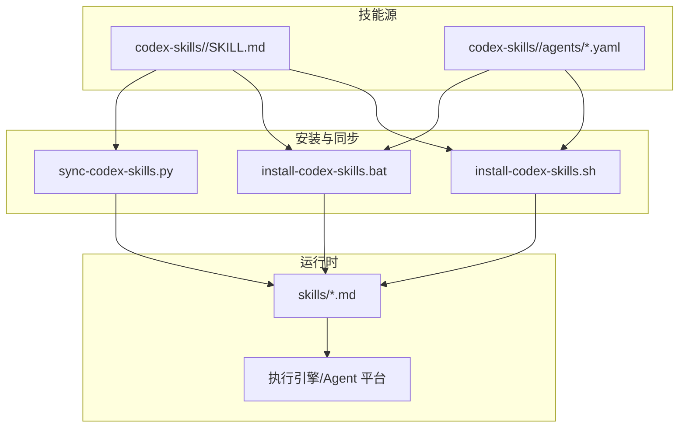
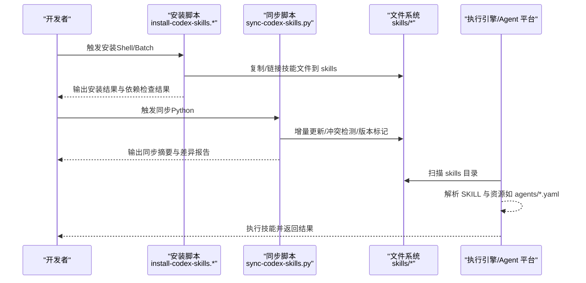
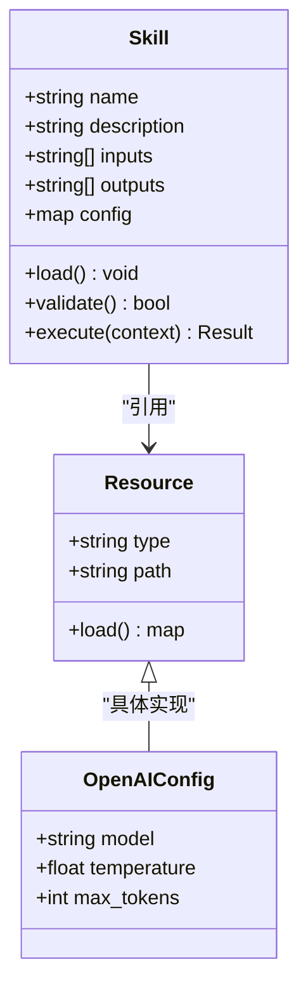
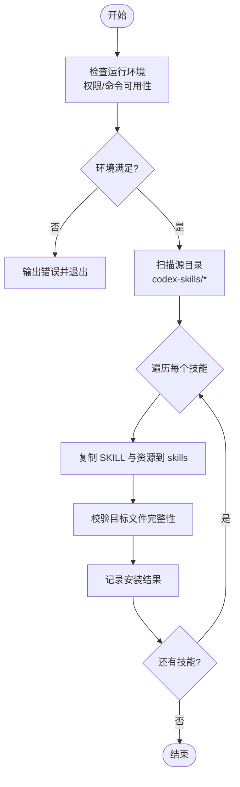
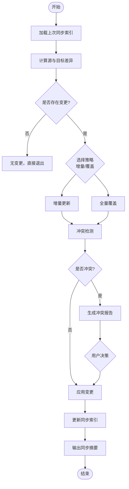
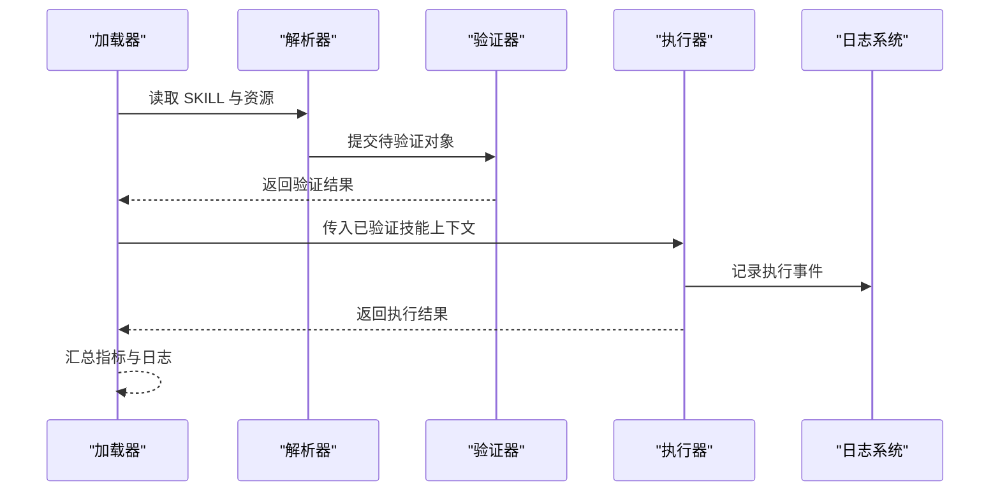
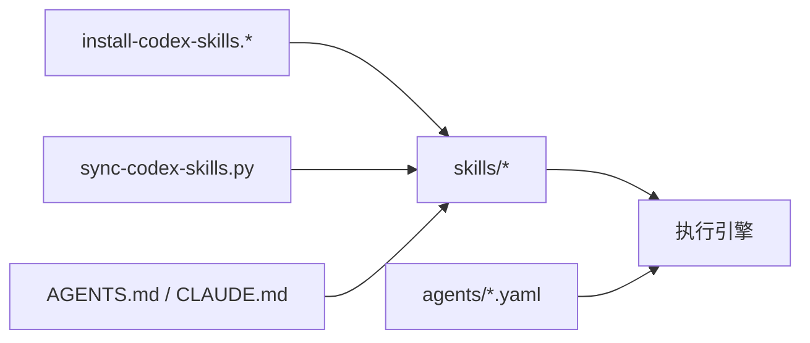

# 技能执行引擎

<cite>
**本文引用的文件**
- [scripts/install-codex-skills.sh](file://scripts/install-codex-skills.sh)
- [scripts/install-codex-skills.bat](file://scripts/install-codex-skills.bat)
- [scripts/sync-codex-skills.py](file://scripts/sync-codex-skills.py)
- [codex-skills/bottleneck-hunter/SKILL.md](file://codex-skills/bottleneck-hunter/SKILL.md)
- [codex-skills/investment-memo-craft/agents/openai.yaml](file://codex-skills/investment-memo-craft/agents/openai.yaml)
- [skills/deep-company-series.md](file://skills/deep-company-series.md)
- [AGENTS.md](file://AGENTS.md)
- [CLAUDE.md](file://CLAUDE.md)
</cite>

## 目录
1. [简介](#简介)
2. [项目结构](#项目结构)
3. [核心组件](#核心组件)
4. [架构总览](#架构总览)
5. [详细组件分析](#详细组件分析)
6. [依赖关系分析](#依赖关系分析)
7. [性能考量](#性能考量)
8. [故障排除指南](#故障排除指南)
9. [结论](#结论)
10. [附录](#附录)

## 简介
本技术文档围绕“技能执行引擎”的加载、解析、验证与执行机制展开，重点说明：
- 技能的来源与组织方式（SKILL 规范、元数据与资源）
- 安装脚本如何管理技能路径、依赖检查与环境配置
- 同步脚本的版本控制、冲突解决与增量更新策略
- 执行引擎的监控、日志记录、错误追踪与调试工具使用建议
- 常见问题排查与优化建议

该文档面向开发者与维护者，帮助构建稳定、可观测、可扩展的技能执行环境。

## 项目结构
仓库采用“多源技能 + 安装/同步脚本 + 运行时约定”的组织方式：
- codex-skills：以目录为单位的技能集合，每个技能包含 SKILL 描述与可选资源（如 agents 配置）
- skills：运行时或平台侧约定的技能清单/入口（Markdown 形式）
- scripts：安装与同步脚本（Shell/Batch/Python），负责路径管理、依赖校验、增量同步
- AGENTS.md / CLAUDE.md：平台集成与运行约定参考

图表来源
- [scripts/install-codex-skills.sh](file://scripts/install-codex-skills.sh)
- [scripts/install-codex-skills.bat](file://scripts/install-codex-skills.bat)
- [scripts/sync-codex-skills.py](file://scripts/sync-codex-skills.py)
- [codex-skills/bottleneck-hunter/SKILL.md](file://codex-skills/bottleneck-hunter/SKILL.md)
- [codex-skills/investment-memo-craft/agents/openai.yaml](file://codex-skills/investment-memo-craft/agents/openai.yaml)
- [skills/deep-company-series.md](file://skills/deep-company-series.md)

章节来源
- [AGENTS.md](file://AGENTS.md)
- [CLAUDE.md](file://CLAUDE.md)

## 核心组件
- 技能定义与资源
  - 每个技能以目录为单位，包含 SKILL 描述文件与可选资源（如 agents 配置）。
  - 示例：bottleneck-hunter 技能与其 SKILL 描述；investment-memo-craft 技能附带 openai.yaml 配置。
- 安装脚本
  - Shell 与 Batch 双实现，负责将 codex-skills 下的技能复制到运行时 skills 目录，并进行基础依赖检查与环境配置。
- 同步脚本
  - Python 实现，提供版本化与增量更新能力，支持冲突检测与合并策略。
- 运行时约定
  - 通过 AGENTS.md / CLAUDE.md 等约定文件，指导 Agent 平台如何发现、加载与执行技能。

章节来源
- [codex-skills/bottleneck-hunter/SKILL.md](file://codex-skills/bottleneck-hunter/SKILL.md)
- [codex-skills/investment-memo-craft/agents/openai.yaml](file://codex-skills/investment-memo-craft/agents/openai.yaml)
- [scripts/install-codex-skills.sh](file://scripts/install-codex-skills.sh)
- [scripts/install-codex-skills.bat](file://scripts/install-codex-skills.bat)
- [scripts/sync-codex-skills.py](file://scripts/sync-codex-skills.py)
- [AGENTS.md](file://AGENTS.md)
- [CLAUDE.md](file://CLAUDE.md)

## 架构总览
技能从源码目录（codex-skills）经安装/同步流程进入运行时目录（skills），由执行引擎按约定加载并执行。

图表来源
- [scripts/install-codex-skills.sh](file://scripts/install-codex-skills.sh)
- [scripts/install-codex-skills.bat](file://scripts/install-codex-skills.bat)
- [scripts/sync-codex-skills.py](file://scripts/sync-codex-skills.py)
- [skills/deep-company-series.md](file://skills/deep-company-series.md)

## 详细组件分析

### 技能定义与资源模型
- 技能目录结构
  - 根目录包含 SKILL 描述文件，用于声明技能名称、用途、输入输出、约束与提示模板等。
  - 可选子目录存放资源，例如 agents 目录中的模型或平台配置（openai.yaml）。
- 资源引用与加载
  - 执行引擎在加载技能时，除解析 SKILL 外，还会按需加载 agents 等资源，完成参数注入与上下文准备。
- 示例参考
  - bottleneck-hunter 技能：展示标准 SKILL 文件的组织方式。
  - investment-memo-craft 技能：展示 agents 资源配置的使用场景。

图表来源
- [codex-skills/bottleneck-hunter/SKILL.md](file://codex-skills/bottleneck-hunter/SKILL.md)
- [codex-skills/investment-memo-craft/agents/openai.yaml](file://codex-skills/investment-memo-craft/agents/openai.yaml)

章节来源
- [codex-skills/bottleneck-hunter/SKILL.md](file://codex-skills/bottleneck-hunter/SKILL.md)
- [codex-skills/investment-memo-craft/agents/openai.yaml](file://codex-skills/investment-memo-craft/agents/openai.yaml)

### 安装脚本工作原理（Shell/Batch）
- 职责范围
  - 遍历 codex-skills 下各技能目录，将 SKILL 与必要资源复制到运行时 skills 目录。
  - 进行基础依赖检查（如目标目录权限、必需命令存在性）。
  - 生成安装日志与简要统计（新增/覆盖/跳过数量）。
- 路径管理
  - 统一维护源目录与目标目录常量，避免硬编码分散。
  - 支持相对路径与绝对路径两种模式，便于跨平台使用。
- 环境配置
  - 根据平台差异设置环境变量（如 PATH、LANG、编码等），确保后续执行一致。
- 错误处理
  - 对缺失目录、权限不足、复制失败等情况给出明确错误码与提示信息。

图表来源
- [scripts/install-codex-skills.sh](file://scripts/install-codex-skills.sh)
- [scripts/install-codex-skills.bat](file://scripts/install-codex-skills.bat)

章节来源
- [scripts/install-codex-skills.sh](file://scripts/install-codex-skills.sh)
- [scripts/install-codex-skills.bat](file://scripts/install-codex-skills.bat)

### 同步脚本实现逻辑（Python）
- 版本控制
  - 基于文件哈希或时间戳建立版本索引，记录上次同步状态。
  - 支持标签化版本（如 v1.0.0）以便回滚与审计。
- 冲突解决
  - 当本地修改与远程/源变更发生冲突时，优先保留本地工作副本，并提供差异报告供人工决策。
  - 支持“强制覆盖”与“仅增量更新”两种策略。
- 增量更新
  - 对比源与目标的差异，仅复制变更文件，减少 I/O 开销。
  - 清理不再存在的冗余文件，保持目标目录整洁。
- 日志与可观测性
  - 输出结构化日志（JSON 或行格式），包含操作类型、文件路径、耗时与状态码。
  - 支持导出差异报告与变更摘要，便于审查与回溯。

图表来源
- [scripts/sync-codex-skills.py](file://scripts/sync-codex-skills.py)

章节来源
- [scripts/sync-codex-skills.py](file://scripts/sync-codex-skills.py)

### 执行引擎加载、解析、验证与执行
- 加载
  - 扫描 skills 目录，识别所有 SKILL 文件与关联资源。
  - 依据 AGENTS.md / CLAUDE.md 的约定，确定加载顺序与优先级。
- 解析
  - 解析 SKILL 元数据（名称、描述、输入输出、约束、模板等）。
  - 加载 agents 等资源配置文件，注入运行时上下文。
- 验证
  - 校验必填字段、依赖项与外部服务可达性（如模型 API 密钥）。
  - 对资源文件进行格式校验（如 YAML 语法）。
- 执行
  - 根据输入参数与上下文，调用相应工具链或外部服务。
  - 收集执行结果与指标，写入日志与报告目录。

图表来源
- [skills/deep-company-series.md](file://skills/deep-company-series.md)
- [AGENTS.md](file://AGENTS.md)
- [CLAUDE.md](file://CLAUDE.md)

章节来源
- [skills/deep-company-series.md](file://skills/deep-company-series.md)
- [AGENTS.md](file://AGENTS.md)
- [CLAUDE.md](file://CLAUDE.md)

## 依赖关系分析
- 组件耦合
  - 安装脚本与同步脚本均依赖文件系统与平台命令，彼此独立但共享目标目录约定。
  - 执行引擎依赖 skills 目录结构与资源文件格式，遵循 AGENTS.md / CLAUDE.md 约定。
- 外部依赖
  - 模型与服务配置（如 openai.yaml）决定执行时的外部调用行为。
- 潜在风险
  - 路径不一致导致加载失败
  - 资源文件版本不匹配导致解析异常
  - 权限问题导致复制/写入失败

图表来源
- [scripts/install-codex-skills.sh](file://scripts/install-codex-skills.sh)
- [scripts/install-codex-skills.bat](file://scripts/install-codex-skills.bat)
- [scripts/sync-codex-skills.py](file://scripts/sync-codex-skills.py)
- [AGENTS.md](file://AGENTS.md)
- [CLAUDE.md](file://CLAUDE.md)
- [codex-skills/investment-memo-craft/agents/openai.yaml](file://codex-skills/investment-memo-craft/agents/openai.yaml)

章节来源
- [scripts/install-codex-skills.sh](file://scripts/install-codex-skills.sh)
- [scripts/install-codex-skills.bat](file://scripts/install-codex-skills.bat)
- [scripts/sync-codex-skills.py](file://scripts/sync-codex-skills.py)
- [AGENTS.md](file://AGENTS.md)
- [CLAUDE.md](file://CLAUDE.md)
- [codex-skills/investment-memo-craft/agents/openai.yaml](file://codex-skills/investment-memo-craft/agents/openai.yaml)

## 性能考量
- 增量同步优先：利用差异计算与选择性复制，降低 I/O 与网络开销。
- 批量处理：对大量小文件采用批处理策略，减少系统调用次数。
- 缓存与索引：维护同步索引与哈希表，避免重复扫描。
- 并发控制：在安全前提下并行处理不同技能，注意锁与竞态条件。
- 日志级别：生产环境降低日志粒度，关键路径保留结构化日志。

[本节为通用指导，无需特定文件来源]

## 故障排除指南
- 安装失败
  - 现象：复制失败、权限不足、命令不可用
  - 排查：检查目标目录权限、确认平台命令可用、查看安装日志
  - 参考：安装脚本的错误分支与输出
- 同步冲突
  - 现象：本地修改与源变更冲突
  - 排查：查看冲突报告，选择“保留本地”或“覆盖”策略
  - 参考：同步脚本的冲突检测与报告生成
- 执行异常
  - 现象：解析失败、资源缺失、外部服务不可达
  - 排查：校验 SKILL 元数据与资源格式，检查模型配置与密钥
  - 参考：执行引擎的验证与日志记录
- 性能问题
  - 现象：同步/执行耗时过长
  - 排查：启用增量模式、调整并发度、优化日志级别
  - 参考：同步脚本与执行引擎的可观测性输出

章节来源
- [scripts/install-codex-skills.sh](file://scripts/install-codex-skills.sh)
- [scripts/install-codex-skills.bat](file://scripts/install-codex-skills.bat)
- [scripts/sync-codex-skills.py](file://scripts/sync-codex-skills.py)
- [AGENTS.md](file://AGENTS.md)
- [CLAUDE.md](file://CLAUDE.md)

## 结论
本引擎通过清晰的技能定义、稳健的安装与同步流程、以及可观测的执行机制，实现了技能的高效管理与可靠执行。建议在团队中统一遵循 SKILL 规范与平台约定，结合增量同步与结构化日志，持续提升稳定性与可维护性。

[本节为总结性内容，无需特定文件来源]

## 附录
- 最佳实践
  - 为每个技能编写清晰的 SKILL 描述与资源说明
  - 在 CI/CD 中集成安装与同步步骤，确保环境一致性
  - 定期审计同步索引与版本标签，便于回滚与追溯
- 参考约定
  - AGENTS.md / CLAUDE.md 中的加载与执行约定
  - agents 目录的资源配置示例

章节来源
- [AGENTS.md](file://AGENTS.md)
- [CLAUDE.md](file://CLAUDE.md)
- [codex-skills/investment-memo-craft/agents/openai.yaml](file://codex-skills/investment-memo-craft/agents/openai.yaml)