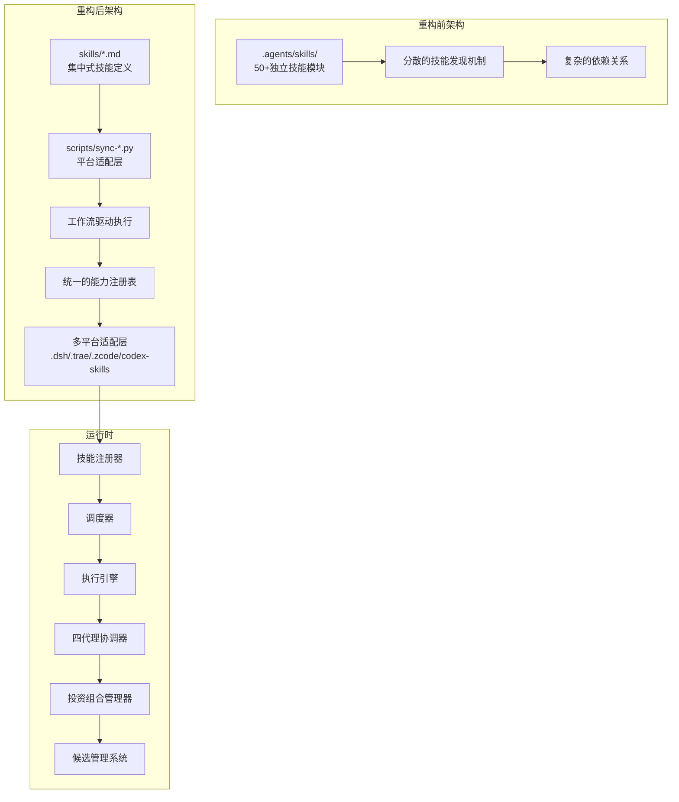
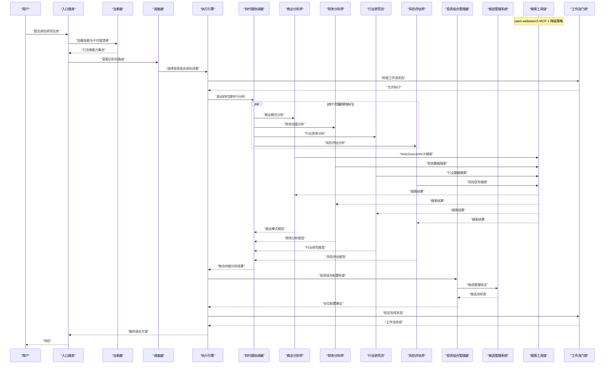
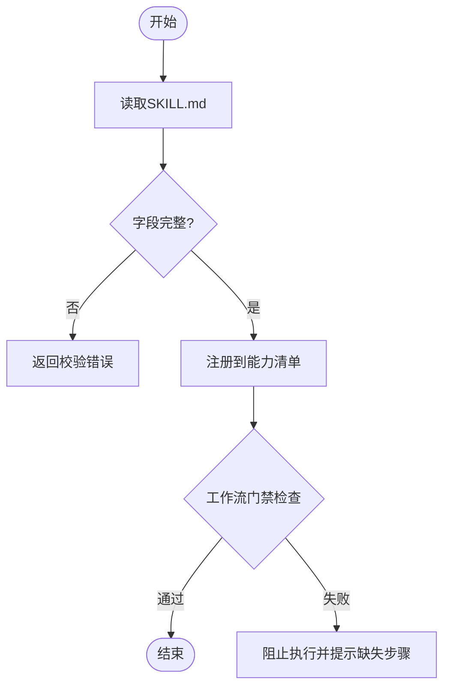
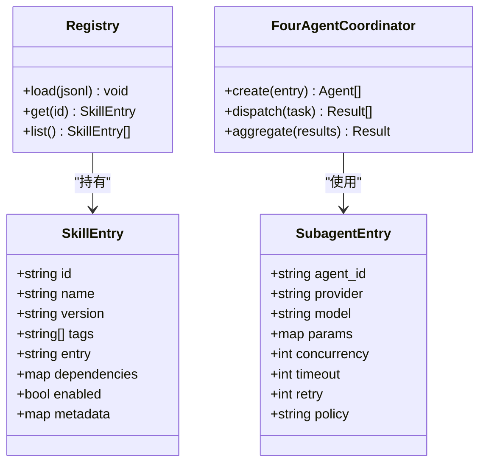
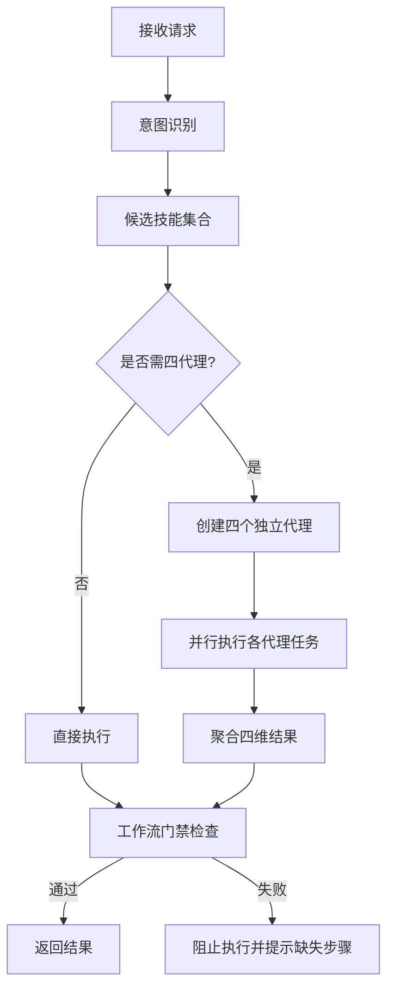
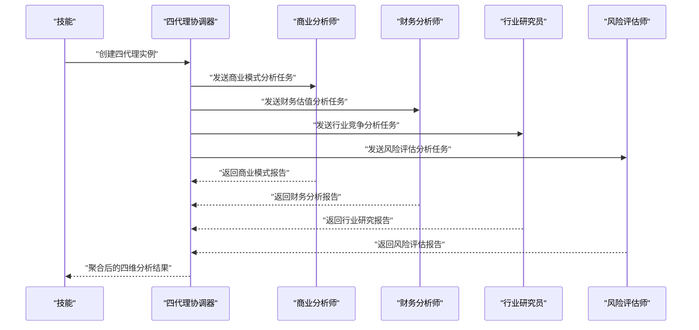
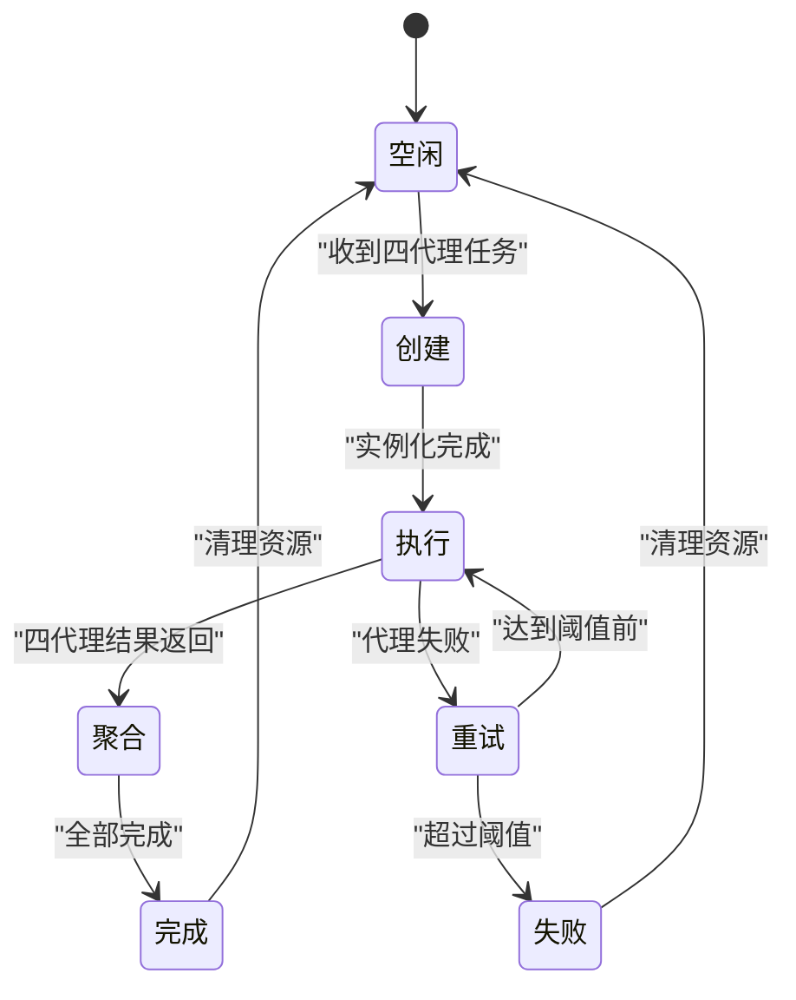
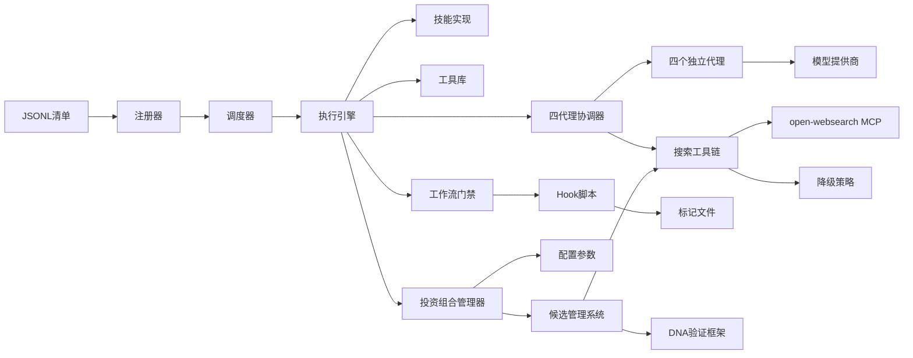

# 技能架构设计

<cite>
**本文引用的文件**   
- [skills/investment-team.md](file://skills/investment-team.md)
- [skills/portfolio-rebalance.md](file://skills/portfolio-rebalance.md)
- [.owner/subagent-dispatch-026-08-08.jsonl](file://.owner/subagent-dispatch-026-08-08.jsonl)
- [scripts/search-tracker-hook.sh](file://scripts/search-tracker-hook.sh)
- [scripts/skill-tracker-hook.sh](file://scripts/skill-tracker-hook.sh)
- [scripts/workflow-gate-hook.sh](file://scripts/workflow-gate-hook.sh)
- [config/portfolio-targets.md](file://config/portfolio-targets.md)
- [codex-skills/portfolio-rebalance/SKILL.md](file://codex-skills/portfolio-rebalance/SKILL.md)
- [.dsh/skills/portfolio-rebalance/SKILL.md](file://.dsh/skills/portfolio-rebalance/SKILL.md)
- [.trae/skills/portfolio-rebalance/SKILL.md](file://.trae/skills/portfolio-rebalance/SKILL.md)
- [.zcode/skills/portfolio-rebalance/SKILL.md](file://.zcode/skills/portfolio-rebalance/SKILL.md)
</cite>

## 更新摘要
**所做更改**
- **重大架构升级**：portfolio-rebalance技能全面更新以支持新的10个仓位限制和增强的候选管理系统
- **多平台同步**：在.dsh、.trae、.zcode、codex-skills等多个目录中同步更新技能配置
- **增强候选管理**：引入详细的分类系统和风险参数，支持爆发股猎手和估值修复猎手
- **严格仓位控制**：实现≤10只持仓的极致集中策略，配合top1/top2集中度规则
- **动态配置系统**：基于市场温度的动态资产配置，支持AI子行业温度判定和加密市场温度判定
- **强化门禁机制**：通过工作流钩子脚本强制执行候选数量和质量标准

## 目录
1. [引言](#引言)
2. [项目结构](#项目结构)
3. [核心组件](#核心组件)
4. [架构总览](#架构总览)
5. [详细组件分析](#详细组件分析)
6. [v5.0四代理并行架构](#v50四代理并行架构)
7. [搜索工具链与MCP集成](#搜索工具链与mcp集成)
8. [投资组合配置与仓位管理](#投资组合配置与仓位管理)
9. [依赖关系分析](#依赖关系分析)
10. [性能与扩展性考虑](#性能与扩展性考虑)
11. [故障排查指南](#故障排查指南)
12. [结论](#结论)
13. [附录：配置示例与最佳实践](#附录配置示例与最佳实践)

## 引言
本技术文档面向AI技能系统的架构设计与实现，聚焦以下目标：
- 解释技能定义规范、注册机制、调度算法与执行流程
- 说明JSONL配置文件（skill-dispatch-workspace.jsonl与subagent-dispatch-workspace.jsonl）的结构与作用
- 阐述智能体（Agent）与技能的绑定关系，以及子代理的协作模式
- **重大更新**：反映portfolio-rebalance技能的重大升级，支持10个仓位限制和增强的候选管理系统
- **新增**：详细说明多平台同步机制和跨目录技能配置
- **新增**：介绍动态资产配置系统和市场温度判定机制
- 提供架构图与数据流图，展示从用户请求到技能执行的完整过程
- 给出配置示例与最佳实践，帮助开发者理解系统设计理念与扩展方式

## 项目结构
仓库采用"能力即代码"的组织方式，支持多平台同步。经过重大重构后，系统已从分散的`.agents/skills/`目录结构迁移到集中的工作流驱动模式：

**重构前架构**：
- `.agents/skills/`：包含50+个独立的技能模块（代码审查、领域建模、设计接口、调试、测试等开发工作流）
- 每个技能作为独立目录存在，通过文件系统发现机制加载

**重构后架构**：
- `skills/`：权威的技能源文件（单一事实来源），专注于投资研究相关技能
- `scripts/`：安装与同步脚本，确保跨平台一致性
- `tools/`：工具脚本与数据处理程序，供技能在执行阶段调用
- 所有开发工作流已整合到主投资组合管理流程中
- **新增**：多平台适配层（.dsh、.trae、.zcode、codex-skills）确保跨环境兼容性

**图表来源**
- [skills/investment-team.md:1-234](file://skills/investment-team.md#L1-L234)
- [skills/portfolio-rebalance.md:1-254](file://skills/portfolio-rebalance.md#L1-L254)

## 核心组件
- 技能定义（Skill Definition）
  - 通过SKILL.md声明技能名称、用途、输入输出约定、前置条件、依赖工具与注意事项
  - 支持在agents子目录中为复杂任务引入子代理配置（如openai.yaml），形成多代理协作
- 注册机制（Registration）
  - 工作区JSONL文件集中声明可用技能与子代理，作为注册表驱动注册器加载
  - **更新**：从文件系统扫描改为基于JSONL清单的显式注册
- 调度器（Dispatcher）
  - 基于意图识别与上下文匹配，选择最合适的技能或组合
  - 支持并行/串行编排，必要时触发子代理协作
- 执行引擎（Executor）
  - 解析技能参数，准备上下文，调用外部工具或模型接口
  - 管理生命周期、错误处理与结果聚合
- 四代理协调器（Four-Agent Coordinator）
  - v5.0新增：根据配置创建并协调四个独立子代理，汇总其输出至主流程
  - 每个代理负责特定视角：商业分析师、财务分析师、行业研究员、风险评估师
- **新增**：投资组合管理器（Portfolio Manager）
  - 管理10个仓位限制的严格执行
  - 实施top1/top2集中度规则和减仓优先级逻辑
  - 监控市场温度和动态资产配置
- **新增**：候选管理系统（Candidate Management System）
  - 维护candidates.csv追踪所有候选标的
  - 实施9路候选来源（A-I）并行筛选
  - 管理爆发股猎手和估值修复猎手的DNA验证
- **重大更新**：工作流门禁系统
  - 通过hook脚本强制执行工作流程完整性
  - 防止跳过关键步骤或降级执行

**章节来源**
- [skills/investment-team.md:1-234](file://skills/investment-team.md#L1-L234)
- [skills/portfolio-rebalance.md:1-254](file://skills/portfolio-rebalance.md#L1-L254)
- [.owner/subagent-dispatch-026-08-08.jsonl:1-10](file://.owner/subagent-dispatch-026-08-08.jsonl#L1-L10)
- [scripts/workflow-gate-hook.sh:1-34](file://scripts/workflow-gate-hook.sh#L1-L34)

## 架构总览
下图展示了从用户请求到技能执行的端到端流程，包括四代理并行执行、搜索工具链管理和结果聚合。

**图表来源**
- [skills/investment-team.md:113-148](file://skills/investment-team.md#L1-L148)
- [skills/portfolio-rebalance.md:105-129](file://skills/portfolio-rebalance.md#L105-L129)
- [scripts/workflow-gate-hook.sh:1-34](file://scripts/workflow-gate-hook.sh#L1-L34)

## 详细组件分析

### 技能定义规范（SKILL.md）
- 职责边界清晰：每个技能解决一个明确问题域，避免跨领域耦合
- 输入输出契约：明确参数类型、必填项、默认值与返回格式
- 依赖与前置：列出所需工具、数据源、权限与环境变量
- 可观测性：建议记录关键步骤日志与指标，便于排障
- 可扩展性：通过agents子目录引入子代理，增强复杂任务处理能力
- **更新**：技能现在专注于投资研究相关功能，开发工作流已整合到主流程中
- **新增**：多平台适配说明，确保在不同环境中的一致行为

**章节来源**
- [skills/investment-team.md:1-234](file://skills/investment-team.md#L1-L234)

### 注册机制（JSONL工作区）
- skill-dispatch-workspace.jsonl
  - 作用：声明所有可用技能及其元数据（名称、版本、标签、依赖、入口点等）
  - 典型字段：id、name、version、tags、entry、dependencies、enabled、metadata
  - 行为：启动时由注册器加载，构建索引以供调度器快速检索
- subagent-dispatch-workspace.jsonl
  - 作用：声明子代理实例的配置与协作规则（模型、参数、并发度、超时、重试等）
  - 典型字段：agent_id、provider、model、params、concurrency、timeout、retry、policy
  - 行为：由子代理协调器按需实例化，并在执行阶段动态装配
- **重大更新**：从文件系统扫描改为显式JSONL注册，提高可控性和可维护性

**章节来源**
- [.owner/subagent-dispatch-026-08-08.jsonl:1-10](file://.owner/subagent-dispatch-026-08-08.jsonl#L1-L10)

### 调度算法与执行流程
- 意图识别：基于关键词、标签与上下文进行初步分类
- 候选集生成：从注册表中筛选匹配的技能集合
- 评分与排序：依据标签契合度、依赖满足度、历史成功率与延迟进行打分
- 编排决策：单技能直接执行；复杂任务拆分为子任务并触发子代理协作
- 执行与回退：失败时按策略重试或降级到其他技能
- **更新**：增加工作流门禁检查，确保关键步骤不被跳过

**章节来源**
- [.owner/subagent-dispatch-026-08-08.jsonl:1-10](file://.owner/subagent-dispatch-026-08-08.jsonl#L1-L10)

### 智能体（Agent）与技能的绑定关系
- 绑定方式
  - 静态绑定：在技能元数据中声明默认子代理ID
  - 动态绑定：在运行时根据上下文选择不同子代理（如不同模型或提供商）
- 生命周期
  - 启动时加载子代理清单
  - 执行时按需实例化与销毁，避免资源浪费
- 通信协议
  - 统一的任务消息格式（输入、上下文、回调地址）
  - 统一的返回格式（状态、结果、错误码）
- **重大更新**：从分散的技能目录绑定改为基于JSONL清单的显式绑定

**章节来源**
- [.owner/subagent-dispatch-026-08-08.jsonl:1-10](file://.owner/subagent-dispatch-026-08-08.jsonl#L1-L10)

### 子代理协作模式
- 并行模式：适用于独立子任务的加速执行
- 串行模式：适用于有依赖关系的流水线
- 分片模式：对大数据集进行分片处理，再合并结果
- 容错与重试：针对网络抖动与模型不稳定场景
- **更新**：增加强制并行执行要求，禁止合并多个股票或维度到单个代理

**章节来源**
- [.owner/subagent-dispatch-026-08-08.jsonl:1-10](file://.owner/subagent-dispatch-026-08-08.jsonl#L1-L10)

## v5.0四代理并行架构

### 架构升级概述
v5.0重构将原有的单代理合并分析方式升级为四独立子代理并行模式，这是系统架构的重大升级。**同时，系统完成了从分散技能目录到集中式工作流的架构迁移**。

**核心变更**：
- **从串行到并行**：不再使用单个代理处理所有分析维度，而是启动四个独立的GeneralPurpose subagent
- **视角专业化**：每个代理专注于特定投资视角，产生更深入的分析和专业判断
- **强制独立性**：禁止将多个股票或分析维度合并到同一代理中执行
- **质量保障**：通过独立执行产生的视角碰撞来暴露结构性风险
- **架构简化**：移除50+个分散技能模块，统一到主工作流中

### 四代理角色定义
1. **商业分析师（段永平视角）**：商业模式、护城河、定价权分析
2. **财务分析师（巴菲特视角）**：财务数据、估值、FCF、安全边际评估
3. **行业研究员（芒格视角）**：行业格局、竞争态势、逆向思维分析
4. **风险评估师（李录视角）**：风险矩阵、管理层、催化剂、仓位合理性评估

### 执行规范与约束
**唯一合法执行方式**：
1. 一次只分析一只股票——按仓位从大到小逐只执行
2. 每只股票必须启动4个独立GeneralPurpose subagent（在同一条消息中并行调用4次Agent工具）
3. 4个Agent收回后由team-lead（主Agent）综合，输出四维评分表+一句话判断+操作信号
4. 每只完成后创建 `.done` 标记：`investment-team-{TICKER}-{YYYYMMDD}.done`

**绝对禁止事项**：
- ❌ 将多只股票合并到1个Agent中分析
- ❌ 将4个视角合并到1个Agent中
- ❌ 用WebSearch直接分析替代4-Agent并行研究
- ❌ 以"配额不足""效率考虑"为由减少Agent数量
- ❌ 以"本会话已分析过"为由跳过任何一只

**违规判定标准**：
- ✅合法："启动4个Agent分析BABA，Agent ID: xxx/yyy/zzz/www"=已执行
- ❌违规："启动1个Agent分析BABA+MSFT+ADBE"=未执行，必须重做
- ❌违规："启动1个Agent同时完成四维度分析BABA"=未执行，必须重做

**章节来源**
- [skills/investment-team.md:113-148](file://skills/investment-team.md#L113-L148)
- [skills/portfolio-rebalance.md:105-129](file://skills/portfolio-rebalance.md#L105-L129)
- [codex-skills/portfolio-rebalance/SKILL.md:120-142](file://codex-skills/portfolio-rebalance/SKILL.md#L120-L142)
- [.dsh/skills/portfolio-rebalance/SKILL.md:128-150](file://.dsh/skills/portfolio-rebalance/SKILL.md#L128-L150)

## 搜索工具链与MCP集成

### open-websearch MCP工具集成
v5.0新增了open-websearch MCP工具的集成要求，确保搜索覆盖度和数据准确性。

**集成要求**：
- 使用 `CallMcpTool server_name="open-websearch" tool_name="search"` 执行全网覆盖式搜索
- 默认duckduckgo引擎，支持任意查询词
- 每轮搜索≥10组不同关键词，每组返回结果逐条审查
- 搜索执行证据必须记录到search-log.txt中

### 搜索工具链降级策略
当主要搜索工具不可用时，系统自动降级到备用方案：

**优先级顺序**：
1. **内置WebSearch**：首选方案，但受配额限制
2. **mcp__web-search__search**：MCP搜索工具
3. **mcp__kepler__web_search**：Kepler搜索引擎
4. **mcp__web_reader__webReader**：网页阅读器
5. **Bash curl直连**：Brave搜索、Google News RSS、Yahoo Finance API

**降级触发条件**：
- 内置WebSearch与webReader MCP是同一上游配额（2026-08-17实证同时429）
- 配额用尽时直接跳到curl层，勿浪费重试
- 禁止以工具不可用为由跳过步骤

### 搜索监控与追踪
系统实现了完整的搜索工具使用追踪机制：

**追踪功能**：
- PostToolUse hook记录每次搜索工具调用
- search-log.txt文件记录每次搜索词和时间戳
- 各种`.used`标记文件跟踪工具使用情况
- gate hook依据search-log.txt行数验证搜索总量是否达标

**搜索量要求**：
- AI候选≤65%
- 每次搜索后追加search-log.txt
- 来源H爆发股猎手≥20次（open-websearch MCP）
- 合计≥100次搜索

**章节来源**
- [skills/portfolio-rebalance.md:34-57](file://skills/portfolio-rebalance.md#L34-L57)
- [skills/portfolio-rebalance.md:143-186](file://skills/portfolio-rebalance.md#L143-L186)
- [scripts/search-tracker-hook.sh:1-34](file://scripts/search-tracker-hook.sh#L1-L34)
- [scripts/skill-tracker-hook.sh:1-30](file://scripts/skill-tracker-hook.sh#L1-L30)

## 投资组合配置与仓位管理

### 10个仓位限制系统
**重大更新**：系统现在强制执行≤10只持仓的极致集中策略，这是v5.4版本的核心改进。

**核心规则**：
- **持仓上限**：≤10只（极致集中，操作负担最小化）
- **集中度规则**：每个类别只持有top 1（该类别中最强的唯一一只），最多到top 2（仅当该类别有两个不可舍的标的且组合总股数未超10时才允许）
- **减仓优先级**：当需要释放现金时，按预期收益最低→收益风险比最差→不确定性最高的顺序砍仓

### 动态资产配置系统
**市场温度驱动**：现金比例不是固定参数，而是整体市场温度的函数。

**市场温度档位**：
- 🔴 狂热：NDX距高点<3% + VIX<14 + 散户FOMO + IPO首日暴涨 → 现金45-60%
- 🟠 高位：NDX距高点3-10% + PE>历史80分位 + 广度收窄 → 现金35-45%
- 🟡 中性：NDX距高点10-20% + PE中位 + VIX 16-22 → 现金20-30%
- 🟢 低位：NDX距高点>20% + VIX>28 + 恐慌新闻 + 基金赎回潮 → 现金8-15%
- 🔵 恐慌：NDX距高点>30% + VIX>40 + 流动性危机 → 现金≤5%

### AI子行业温度判定
**双层动态配置**：AI配置不是固定参数，而是AI子行业所处周期水位的函数。

**第一层：AI整体水位** → 决定AI总暴露
- 🟢 加速期：CapEx指引连续上调 + 物理瓶颈加剧 + AI收入三位数增长 + 新用例爆发 → 65-80%
- 🟡 扩张期：CapEx维持高位 + 收入增速50-100% + 估值合理 + 广度健康 → 55-70%
- 🟠 过热期：估值泡沫化(PS>30x普遍) + 散户FOMO + IPO泛滥 + CapEx增速>收入增速 → 40-55%
- 🔴 衰退期：CapEx指引下砍 + 收入增速<20% + 裁员潮 + 瓶颈解除 → 30-45%

### 候选管理系统增强
**9路候选来源并行**：
- A=持仓文件待执行项、B=全市场多维搜索（GICS 25组×2视角+7维）、C=/industry-funnel、D=/bottleneck-hunter、E=分布缺口反向映射、F=用户历史关注（必选）、G=持仓生态链反向搜索（必选）、H=爆发股猎手（必选）、I=估值修复猎手（必选）

**候选累积追踪**：
- 维护 `.claude/.workflow/candidates.csv`（ticker,company,gics_sector,source）
- 下限300只、理想350只唯一候选
- 25个GICS组每组≥4只，7维每维≥5只

**爆发股猎手DNA验证**：
- 硬条件（5条）：收入增速≥100% YoY、盈利拐点、市值$3B-$80B、赛道纯正、合同/积压可见性
- 软条件（1条）：覆盖错位（卖方分析师≤20人覆盖 或 共识目标价vs合理估值存在>30%低估 或 最近3个月有≥2次目标价上调但股价仍未反映全部增速 或 机构持股<40%）

**估值修复猎手DNA验证**：
- 好生意确认：毛利率>40% + 营业利润率>25% + 正FCF
- 估值极端：当前Fwd PE < 自身5年中位数的60%（或EV/Rev < 历史中位50%）
- 恐惧可归因：下跌原因是可证伪的叙事（AI颠覆/CEO真空/一次性事件），而非结构性衰退
- 催化剂可见：未来1-3个月有明确事件可验证恐惧是否过度（财报/产品发布/管理层更替落地）

### 风险参数体系
**核心仓（AI复合核心+AI平台）**：
- 止损：-12%触发
- 移动止损：浮盈>15%后止损上移至成本+5%（或20日均线，取高者）
- 单笔风险预算：仓位×止损距离 ≤ 总资产1%

**爆发仓**：
- 止损：-20%（爆发股日波动±5-10%常态，-12%会被震出）
- 移动止损：浮盈>30%后止损上移至成本+10%（或20日均线，取高者）
- 单笔风险预算：仓位×止损距离 ≤ 总资产1.5%
- 单只上限：8%总资产
- 爆发仓合计上限：35%

**加密市场温度动态规则**：
- 🟢 积累期底部：BTC距ATH>50% + 哈希率创新高但币价横盘 + 矿企投降式抛售 + ETF净流出趋缓 + Fear&Greed<20持续>30天 → 10-15%
- 🟡 复苏期：BTC从底部回升30-100% + ETF净流入恢复 + 链上活跃度回升 + 监管明朗化 → 8-12%
- 🟠 狂热期：BTC创新高 + 散户FOMO + ICO/NFT泛滥 + 杠杆率飙升 → 3-5%
- 🔴 崩盘期：BTC从高点跌>60% + 交易所爆雷 + 流动性危机 + 监管打击 → 0-3%

**章节来源**
- [config/portfolio-targets.md:1-281](file://config/portfolio-targets.md#L1-L281)
- [skills/portfolio-rebalance.md:165-251](file://skills/portfolio-rebalance.md#L165-L251)

## 依赖关系分析
- 内部依赖
  - 注册器依赖JSONL清单
  - 调度器依赖注册器与技能元数据
  - 执行引擎依赖技能实现与工具库
  - 四代理协调器依赖子代理清单与提供商SDK
  - 搜索工具链管理器依赖多种搜索API
  - **新增**：投资组合管理器依赖配置参数和实时市场数据
  - **新增**：候选管理系统依赖搜索工具和验证框架
  - **新增**：工作流门禁系统依赖hook脚本和标记文件
- 外部依赖
  - 模型提供商（如OpenAI）
  - 数据存储与工具脚本
  - 多平台运行时环境（DSH、Codex、TRAE、ZCode）
  - 搜索服务提供商（WebSearch、MCP工具、curl API）
  - **新增**：金融市场数据提供商（Yahoo Finance、Alpha Vantage等）

**图表来源**
- [skills/investment-team.md:113-148](file://skills/investment-team.md#L113-L148)
- [scripts/search-tracker-hook.sh:1-34](file://scripts/search-tracker-hook.sh#L1-L34)
- [scripts/workflow-gate-hook.sh:1-34](file://scripts/workflow-gate-hook.sh#L1-L34)

## 性能与扩展性考虑
- 注册表缓存：启动后常驻内存，减少I/O开销
- 并发控制：限制四代理并发度，避免过载
- 超时与熔断：设置合理超时与熔断阈值，提升稳定性
- 结果缓存：对幂等任务启用短期缓存，降低重复计算
- 水平扩展：通过增加子代理实例与负载均衡提升吞吐
- 增量同步：仅同步变更的技能，提高同步效率
- 平台隔离：各平台互不影响，支持渐进式迁移
- **新增**：搜索工具链优化：智能降级策略减少等待时间
- **新增**：代理结果缓存：避免重复分析相同标的
- **新增**：投资组合配置缓存：减少频繁的市场温度计算
- **新增**：候选池预加载：提前获取候选标的的基本信息
- **重大更新**：架构简化：移除50+个分散技能模块，降低维护复杂度

## 故障排查指南
- 常见问题
  - 技能未注册：检查JSONL清单中的enabled标志与路径正确性
  - 子代理不可用：验证提供商密钥、模型名与网络连通性
  - 执行超时：调整timeout与重试策略，检查下游依赖
  - 同步失败：检查权威源文件完整性与脚本执行权限
  - 平台不兼容：确认平台版本支持与工具可用性
  - **新增**：搜索配额耗尽：检查WebSearch和MCP工具配额状态
  - **新增**：四代理执行失败：验证是否真正启动了4个独立代理
  - **新增**：工作流门禁拦截：检查缺失的步骤和标记文件
  - **新增**：仓位超限：检查是否违反≤10只持仓限制
  - **新增**：候选不足：验证candidates.csv是否达到300只下限
- 定位方法
  - 查看注册器日志，确认能力清单加载成功
  - 检查调度器的评分与选择日志，确认路由是否符合预期
  - 收集子代理的错误码与堆栈，定位提供商侧问题
  - 检查同步日志，确认各平台技能一致性
  - **新增**：检查search-log.txt验证搜索执行情况
  - **新增**：检查.done标记文件确认代理执行完成
  - **新增**：检查gate hook输出了解工作流状态
  - **新增**：检查portfolio-latest.md确认当前持仓状态
  - **新增**：检查candidates.csv验证候选池规模

**章节来源**
- [scripts/search-tracker-hook.sh:1-34](file://scripts/search-tracker-hook.sh#L1-L34)
- [scripts/workflow-gate-hook.sh:1-34](file://scripts/workflow-gate-hook.sh#L1-L34)

## 结论
本架构通过"技能即代码+JSONL注册表+四代理并行执行+搜索工具链管理+工作流门禁+投资组合管理"的方式，实现了高内聚、低耦合的可插拔能力体系。**经过重大重构，系统已从分散的50+技能模块迁移到集中的工作流驱动模式，显著降低了维护复杂度并提高了执行可靠性**。v5.0的四独立子代理并行模式显著提升了分析的深度和专业性，而open-websearch MCP工具的集成确保了搜索覆盖度和数据准确性。

**最新重大更新**：portfolio-rebalance技能的v5.4版本引入了严格的10个仓位限制和增强的候选管理系统，通过动态资产配置和市场温度判定机制，实现了更加精细化的投资组合管理。多平台同步机制确保了技能在不同环境中的稳定运行，而9路候选来源并行筛选和DNA验证框架大幅提升了候选标的的质量。

配合灵活的调度与子代理协作机制，既能满足简单任务的快速执行，也能支撑复杂任务的分布式编排。建议在新增技能时严格遵循定义规范，并通过测试与监控保障质量与稳定性。

## 附录：配置示例与最佳实践

### 技能定义示例（SKILL.md）
- 建议包含：
  - 标题与摘要
  - 输入参数与输出格式
  - 依赖工具与数据源
  - 注意事项与风险提示
  - 子代理使用指引（如有）
  - **新增**：多平台适配说明

**章节来源**
- [skills/investment-team.md:1-234](file://skills/investment-team.md#L1-L234)

### 四代理配置示例（agents/openai.yaml）
- 建议包含：
  - 模型名称与版本
  - 温度、最大令牌数等推理参数
  - 重试次数与退避策略
  - 并发度与超时时间
  - 搜索工具配置

**章节来源**
- [.owner/subagent-dispatch-026-08-08.jsonl:1-10](file://.owner/subagent-dispatch-026-08-08.jsonl#L1-L10)

### 工作区清单示例（JSONL）
- skill-dispatch-workspace.jsonl
  - 每条记录代表一个技能条目，包含id、name、version、tags、entry、dependencies、enabled、metadata等字段
- subagent-dispatch-workspace.jsonl
  - 每条记录代表一个子代理条目，包含agent_id、provider、model、params、concurrency、timeout、retry、policy等字段

**章节来源**
- [.owner/subagent-dispatch-026-08-08.jsonl:1-10](file://.owner/subagent-dispatch-026-08-08.jsonl#L1-L10)

### v5.0四代理执行最佳实践
- **强制并行**：必须在同一条消息中并行调用4次Agent工具
- **视角分离**：每个代理专注于单一投资视角，避免分析维度混淆
- **独立验证**：每个代理独立搜索和验证数据，不共享中间结果
- **质量检查**：通过四维张力的碰撞发现潜在风险和机会
- **执行证据**：记录每个代理的Agent ID和搜索证据

**章节来源**
- [skills/investment-team.md:113-148](file://skills/investment-team.md#L113-L148)
- [skills/portfolio-rebalance.md:105-129](file://skills/portfolio-rebalance.md#L105-L129)

### 搜索工具链最佳实践
- **优先使用open-websearch MCP**：确保搜索覆盖度和数据准确性
- **实施降级策略**：当主要工具不可用时自动切换到备用方案
- **记录搜索证据**：所有搜索必须记录到search-log.txt中
- **验证搜索量**：确保达到最低搜索量要求（≥100次）
- **监控配额使用**：定期检查WebSearch和MCP工具的配额状态

**章节来源**
- [skills/portfolio-rebalance.md:34-57](file://skills/portfolio-rebalance.md#L34-L57)
- [scripts/search-tracker-hook.sh:1-34](file://scripts/search-tracker-hook.sh#L1-L34)

### 工作流门禁最佳实践
- **强制执行**：利用hook脚本确保关键步骤不被跳过
- **状态追踪**：通过标记文件跟踪工作流进度
- **门禁检查**：在关键节点运行gate脚本验证完成状态
- **错误恢复**：门禁失败时提供具体的缺失步骤信息

**章节来源**
- [scripts/workflow-gate-hook.sh:1-34](file://scripts/workflow-gate-hook.sh#L1-L34)
- [scripts/skill-tracker-hook.sh:1-30](file://scripts/skill-tracker-hook.sh#L1-L30)

### 跨平台同步最佳实践
- **单一事实来源**：始终修改`skills/*.md`中的权威源
- **定期同步**：在CI/CD流程中自动执行同步脚本
- **版本控制**：将生成的平台文件纳入版本控制
- **冲突解决**：优先使用`--check`模式验证同步状态
- **平台特定优化**：在各平台文件中添加必要的平台特定说明

**章节来源**
- [skills/investment-team.md:1-234](file://skills/investment-team.md#L1-L234)

### 投资组合配置最佳实践
- **动态配置**：根据市场温度动态调整资产配置
- **风险控制**：严格执行止损和仓位管理规则
- **多元化**：保持合理的行业和国家分布
- **实时监控**：持续跟踪市场变化和持仓表现
- **仓位限制**：严格遵守≤10只持仓的极致集中策略
- **候选管理**：维护300+只候选标的的丰富候选池

**章节来源**
- [config/portfolio-targets.md:1-281](file://config/portfolio-targets.md#L1-L281)

### 候选管理系统最佳实践
- **9路并行筛选**：充分利用A-I所有候选来源
- **DNA验证**：严格执行爆发股猎手和估值修复猎手的DNA标准
- **候选追踪**：维护candidates.csv实时更新候选状态
- **质量过滤**：通过双重验证（/investment-checklist + /investment-team）确保候选质量
- **搜索覆盖**：确保每轮搜索≥10组不同关键词，累计≥120次搜索

**章节来源**
- [skills/portfolio-rebalance.md:165-251](file://skills/portfolio-rebalance.md#L165-L251)