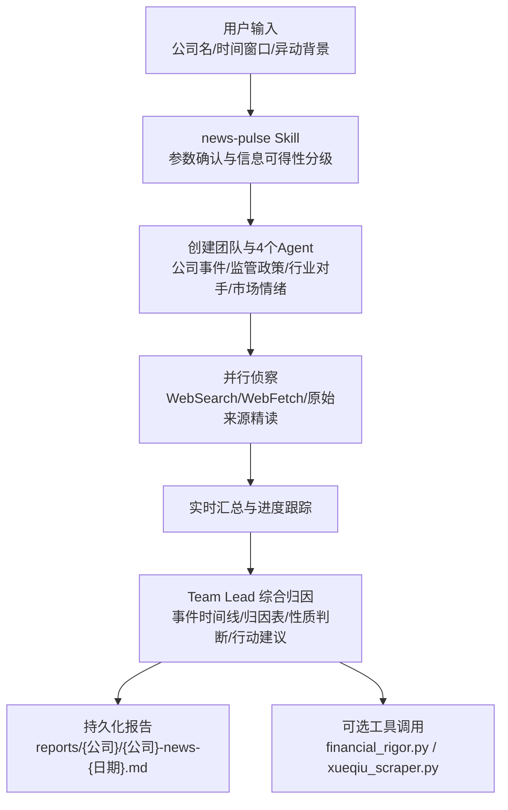
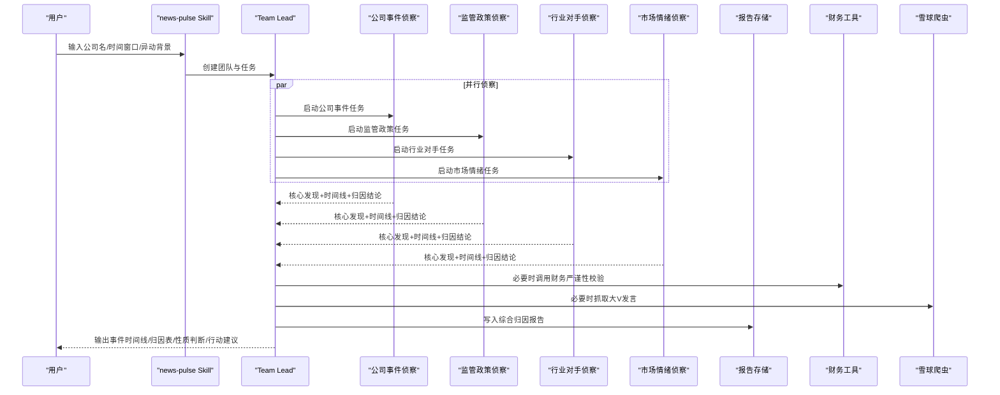
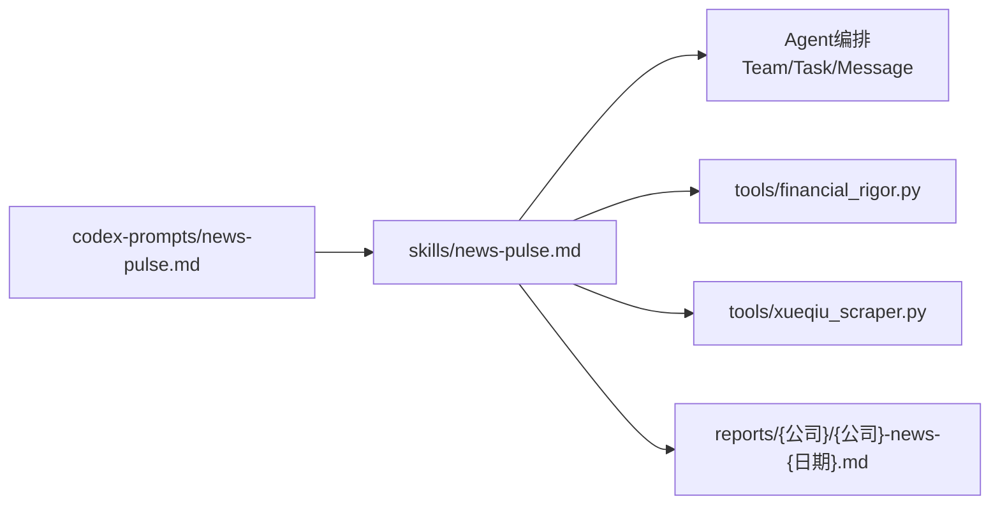

# 新闻脉冲归因系统增强

<cite>
**本文引用的文件**
- [README.md](file://README.md)
- [skills/news-pulse.md](file://skills/news-pulse.md)
- [codex-prompts/news-pulse.md](file://codex-prompts/news-pulse.md)
- [tools/financial_rigor.py](file://tools/financial_rigor.py)
- [tools/xueqiu_scraper.py](file://tools/xueqiu_scraper.py)
- [reports/腾讯/腾讯-news-20260501.md](file://reports/腾讯/腾讯-news-20260501.md)
</cite>

## 目录
1. [简介](#简介)
2. [项目结构](#项目结构)
3. [核心组件](#核心组件)
4. [架构总览](#架构总览)
5. [详细组件分析](#详细组件分析)
6. [依赖关系分析](#依赖关系分析)
7. [性能与可扩展性](#性能与可扩展性)
8. [故障排查指南](#故障排查指南)
9. [结论](#结论)
10. [附录](#附录)

## 简介
本文件面向“新闻脉冲归因系统增强”的目标，围绕 AI Berkshire 中的 news-pulse 能力进行系统化说明。news-pulse 是一个面向股价异动的快速归因技能：通过四个并行 Agent（公司事件、监管政策、行业对手、市场情绪）在 10-15 分钟内完成事件采集、交叉验证与主因判断，输出事件时间线、异动归因表、性质判断与行动建议，并持久化到 reports 目录，便于后续追踪与复盘。

该能力强调“快胜过全、归因优先于罗列、诚实面对不明”，并通过信息可得性分级（A/B/C）适配不同公司的信息密度，避免噪音干扰或误判。

## 项目结构
与新闻脉冲归因相关的代码与文档主要分布在以下位置：
- skills/news-pulse.md：定义 skill 的完整执行流程、任务模板、输出规范与原则
- codex-prompts/news-pulse.md：为 Codex 提供 slash prompt 入口，转发到已安装的 news-pulse skill
- tools/financial_rigor.py：金融数据严谨性工具（市值验算、估值指标验算等），用于支撑报告中的数据校验
- tools/xueqiu_scraper.py：雪球用户时间线爬虫，支持段永平等大 V 发言抓取，辅助情绪面侦察
- reports/腾讯/腾讯-news-20260501.md：一份完整的 news-pulse 实战报告样例，展示输出结构与归因方法
- README.md：整体框架介绍，包含 news-pulse 的定位、使用方式与其他 skill 的关系

图表来源
- [skills/news-pulse.md:17-223](file://skills/news-pulse.md#L17-L223)
- [codex-prompts/news-pulse.md:1-12](file://codex-prompts/news-pulse.md#L1-L12)
- [tools/financial_rigor.py:70-104](file://tools/financial_rigor.py#L70-L104)
- [tools/xueqiu_scraper.py:1-434](file://tools/xueqiu_scraper.py#L1-L434)
- [reports/腾讯/腾讯-news-20260501.md:1-179](file://reports/腾讯/腾讯-news-20260501.md#L1-L179)

章节来源
- [skills/news-pulse.md:17-223](file://skills/news-pulse.md#L17-L223)
- [codex-prompts/news-pulse.md:1-12](file://codex-prompts/news-pulse.md#L1-L12)
- [README.md:618-665](file://README.md#L618-L665)

## 核心组件
- 参数确认与信息可得性分级：明确时间窗口、异动背景与关注侧重；按 A/B/C 级调整侦察策略，避免信息过载或扫盲失败
- 四维度并行侦察：
  - 公司事件：公告、财报指引、管理层动作、业务事件、资本运作、诉讼合规
  - 监管政策：行业监管、跨境政策、税收、反垄断、特殊行业政策、货币与外汇
  - 行业与竞争对手：直接对手、上下游、行业景气、替代品威胁、指数表现
  - 市场情绪与卖方/大V：评级变动、机构持仓、做空数据、大V观点、传言与技术信号
- Team Lead 综合归因：合并时间线、构建归因表、性质判断（价值事件/情绪波动/真因不明/混合）、行动建议与跟踪清单
- 工具集成：
  - financial_rigor.py：精确计算与多源交叉验证，确保关键数据不出现单位或精度错误
  - xueqiu_scraper.py：抓取指定用户的时间线并按关键词筛选原发言，辅助情绪面情报

章节来源
- [skills/news-pulse.md:19-146](file://skills/news-pulse.md#L19-L146)
- [tools/financial_rigor.py:70-104](file://tools/financial_rigor.py#L70-L104)
- [tools/xueqiu_scraper.py:1-434](file://tools/xueqiu_scraper.py#L1-L434)

## 架构总览
news-pulse 采用“Skill + Agent + Tool”三层设计：
- Skill 层：标准化输入、流程控制、输出模板与原则约束
- Agent 层：四角色并行侦察，各自独立搜索与验证，最终由 Team Lead 综合
- 工具层：财务严谨性校验与大 V 发言抓取，提升数据质量与情绪面洞察

图表来源
- [skills/news-pulse.md:44-146](file://skills/news-pulse.md#L44-L146)
- [tools/financial_rigor.py:70-104](file://tools/financial_rigor.py#L70-L104)
- [tools/xueqiu_scraper.py:1-434](file://tools/xueqiu_scraper.py#L1-L434)
- [reports/腾讯/腾讯-news-20260501.md:1-179](file://reports/腾讯/腾讯-news-20260501.md#L1-L179)

## 详细组件分析

### 参数确认与信息可得性分级
- 参数澄清：公司名、时间窗口（默认14天，财报季可缩至7天）、异动幅度与时间、关注侧重（公司/监管/行业/情绪）
- 信息可得性分级：
  - A 级（信息充裕）：降噪与归因为主，过滤重复转述
  - B 级（信息适中）：标准模式，每条关键事件附独立信源
  - C 级（信息稀缺）：扫盲模式，找不到解释异动的新闻本身即有价值（可能技术性/资金面驱动）

章节来源
- [skills/news-pulse.md:19-42](file://skills/news-pulse.md#L19-L42)

### 四维度并行侦察
- 公司事件：官方公告、财报指引、管理层动作、重大业务事件、资本运作、诉讼合规
- 监管政策：行业监管、跨境政策、税收、反垄断、特殊行业政策、货币与外汇
- 行业与竞争对手：直接对手、上下游、行业景气、替代品威胁、指数表现
- 市场情绪与卖方/大V：评级变动、机构持仓、做空数据、大V观点、传言与技术信号

每个 Agent 的输出要求包括：核心发现、完整事件时间线表格、本维度归因结论、数据缺口声明，严格区分事实与推测。

章节来源
- [skills/news-pulse.md:50-146](file://skills/news-pulse.md#L50-L146)

### Team Lead 综合归因
- 一句话归因：主因+次因+性质判断（价值事件/情绪波动/真因不明/混合）
- 完整事件时间线：合并四维度，标注权重（高/中/低）
- 异动归因表：候选解释、证据、反证、置信度、持续性
- 性质判断：打勾其一，并给出详细判断与关键反证
- 各维度侦察摘要：每维度3-5条最重要发现与贡献度
- 行动建议：是否触发论文重审、财报深读、管理层重审、调仓提示或仅观察
- 跟踪清单：未来7-30天待披露事件、指标与关键信号
- 信息缺口声明：诚实列出未解决的疑点与需等待的事项

章节来源
- [skills/news-pulse.md:154-223](file://skills/news-pulse.md#L154-L223)

### 工具集成与数据严谨性
- financial_rigor.py：
  - 市值验算：股价×总股本与报告市值对比，偏差阈值告警
  - 估值指标验算：PE/PB/ROE/FCF Yield 等精确十进制计算
  - 多源交叉验证：N个来源比对，超容差告警
- xueqiu_scraper.py：
  - 登录态复用与断点续爬
  - 双通道 fetch（页面JS fetch回退context.request）
  - 反限流与进度保存
  - 按关键词筛选本人原发言，输出Markdown供情绪面分析

章节来源
- [tools/financial_rigor.py:70-104](file://tools/financial_rigor.py#L70-L104)
- [tools/xueqiu_scraper.py:1-434](file://tools/xueqiu_scraper.py#L1-L434)

### 实战报告样例解析
以腾讯为例，报告展示了：
- 信息可得性等级为 A 级（大盘股，信息充裕）
- 事件时间线合并四维度，标注权重
- 异动归因表拆解回购静默期、南向资金、AI叙事、板块beta等贡献
- 性质判断为“混合”，并给出关键反证（卖方共识、段永平看多信号、网易逆市涨）
- 行动建议与跟踪清单明确后续验证节点（财报、回购重启、南向资金转向、AI竞争跟踪）

章节来源
- [reports/腾讯/腾讯-news-20260501.md:1-179](file://reports/腾讯/腾讯-news-20260501.md#L1-L179)

## 依赖关系分析
- Skill 依赖 Agent 编排：TeamCreate/TaskCreate/TaskUpdate/SendMessage/TeamDelete
- 工具依赖：
  - financial_rigor.py：用于关键数据的精确计算与交叉验证
  - xueqiu_scraper.py：用于情绪面情报（段永平等大V发言）
- 输出依赖：reports 目录结构化存储，便于检索与回溯

图表来源
- [skills/news-pulse.md:44-223](file://skills/news-pulse.md#L44-L223)
- [codex-prompts/news-pulse.md:1-12](file://codex-prompts/news-pulse.md#L1-L12)
- [tools/financial_rigor.py:70-104](file://tools/financial_rigor.py#L70-L104)
- [tools/xueqiu_scraper.py:1-434](file://tools/xueqiu_scraper.py#L1-L434)

章节来源
- [skills/news-pulse.md:44-223](file://skills/news-pulse.md#L44-L223)
- [codex-prompts/news-pulse.md:1-12](file://codex-prompts/news-pulse.md#L1-L12)

## 性能与可扩展性
- 并发优势：四维度并行侦察显著缩短响应时间，适合盘中或盘后快速决策
- 可扩展方向：
  - 接入更多数据源（Wind/Bloomberg/Yahoo Finance）以提升覆盖度
  - 增加自动化校验规则（如异常波动检测、舆情热度评分）
  - 扩展大V与机构观点库（更多用户ID与关键词组合）
- 成本与模型选择：
  - 深度投研类 Skill 消耗较高，news-pulse 作为快速归因更适合轻量模型初筛
  - 当结果值得深入时再切换到 investment-team 或 earnings-review

章节来源
- [README.md:232-239](file://README.md#L232-L239)
- [skills/news-pulse.md:225-235](file://skills/news-pulse.md#L225-L235)

## 故障排查指南
- 联网失败：若 WebSearch 被拦截或不可用，需在报告顶部醒目标注“未能联网，基于训练知识”，并降级置信度
- 数据不一致：使用 financial_rigor.py 进行市值与估值指标验算，偏差超阈值需检查单位与股本变化
- 登录态失效：xueqiu_scraper.py 首次运行需 headful 手动登录，状态缓存过期需重新登录
- 信息稀缺：C 级公司可能找不到解释异动的新闻，应如实声明“扫盲模式”结论的价值（技术性/资金面驱动）

章节来源
- [skills/investment-team.md:123-154](file://skills/investment-team.md#L123-L154)
- [tools/financial_rigor.py:70-104](file://tools/financial_rigor.py#L70-L104)
- [tools/xueqiu_scraper.py:111-151](file://tools/xueqiu_scraper.py#L111-L151)

## 结论
news-pulse 将“快速归因”与“严谨数据”结合，通过四维度并行侦察与 Team Lead 综合判断，帮助投资者在股价异动时迅速定位主因、评估性质并制定下一步行动。其核心价值在于：
- 快：10-15分钟产出可操作的归因结论
- 准：多源交叉验证与精确计算降低误判风险
- 实：诚实面对“不明”，避免硬凑因果链
- 可复现：标准化流程与结构化输出便于复盘与迭代

## 附录
- 使用示例：
  - /news-pulse 腾讯
  - /news-pulse 拼多多 跌12% 一周内
  - /news-pulse 米哈游
- 相关 Skill 搭配：
  - 完整投研：investment-team 或 investment-research
  - 财报深读：earnings-review
  - 长期论文跟踪：thesis-tracker

章节来源
- [README.md:618-665](file://README.md#L618-L665)
- [skills/news-pulse.md:10-16](file://skills/news-pulse.md#L10-L16)