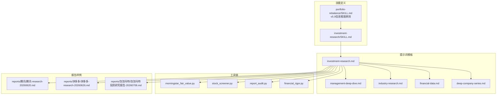
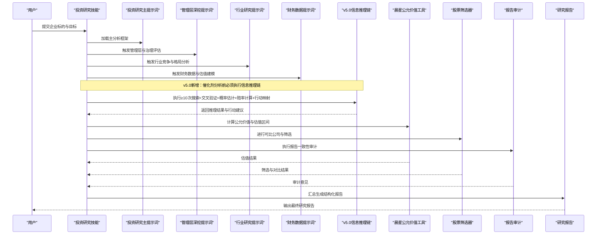
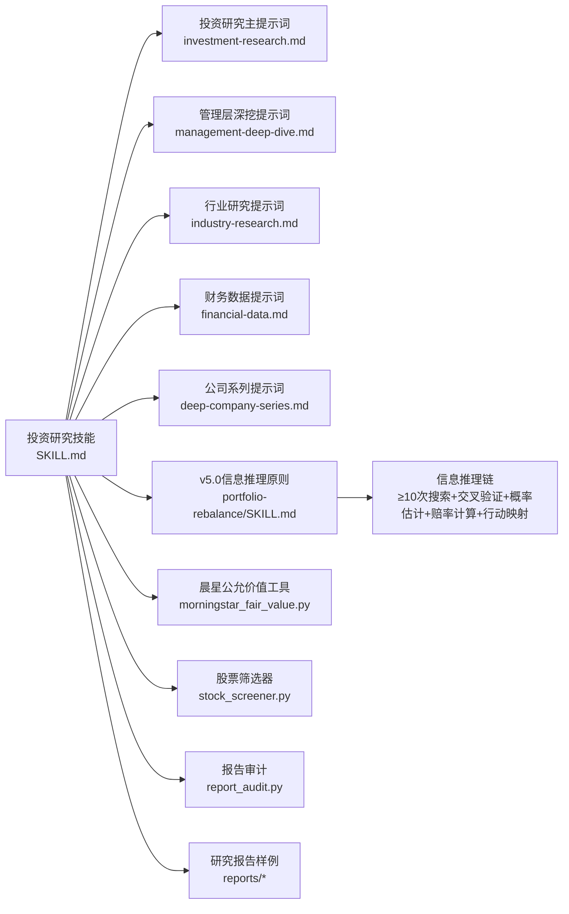
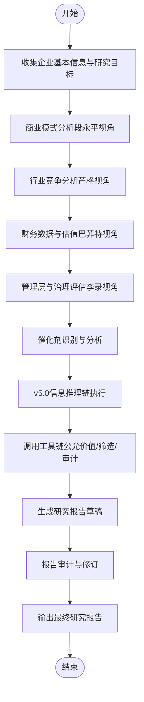

# 企业深度研究技能

<cite>
**本文引用的文件**   
- [codex-skills/investment-research/SKILL.md](file://codex-skills/investment-research/SKILL.md)
- [codex-prompts/investment-research.md](file://codex-prompts/investment-research.md)
- [codex-prompts/management-deep-dive.md](file://codex-prompts/management-deep-dive.md)
- [codex-prompts/industry-research.md](file://codex-prompts/industry-research.md)
- [codex-prompts/financial-data.md](file://codex-prompts/financial-data.md)
- [codex-prompts/deep-company-series.md](file://codex-prompts/deep-company-series.md)
- [codex-skills/portfolio-rebalance/SKILL.md](file://codex-skills/portfolio-rebalance/SKILL.md)
- [tools/morningstar_fair_value.py](file://tools/morningstar_fair_value.py)
- [tools/stock_screener.py](file://tools/stock_screener.py)
- [tools/report_audit.py](file://tools/report_audit.py)
- [reports/腾讯/腾讯-research-20260620.md](file://reports/腾讯/腾讯-research-20260620.md)
- [reports/拼多多/拼多多-research-20260626.md](file://reports/拼多多/拼多多-research-20260626.md)
- [reports/泡泡玛特/泡泡玛特投资研究报告-20260706.md](file://reports/泡泡玛特/泡泡玛特投资研究报告-20260706.md)
</cite>

## 更新摘要
**变更内容**   
- 新增v5.0信息推理原则章节，详细说明催化剂分析的新要求
- 更新核心组件部分，增加信息推理链的强制要求
- 修改详细组件分析，融入信息推理原则到各个分析阶段
- 更新调用示例与最佳实践，展示信息推理链的实际应用
- 增强故障排查指南，包含信息推理链执行问题的解决方案

## 目录
1. [简介](#简介)
2. [项目结构](#项目结构)
3. [核心组件](#核心组件)
4. [架构总览](#架构总览)
5. [详细组件分析](#详细组件分析)
6. [依赖关系分析](#依赖关系分析)
7. [性能与可扩展性](#性能与可扩展性)
8. [故障排查指南](#故障排查指南)
9. [结论](#结论)
10. [附录：调用示例与最佳实践](#附录调用示例与最佳实践)

## 简介
本文件为企业级"投资研究"技能的权威功能文档，聚焦于将四大师分析法（巴菲特、芒格、段永平、李录）整合到统一的研究流程中。**v5.0版本新增了严格的信息推理原则**，禁止将催化剂视为二元事件被动等待，要求每个催化剂前执行完整的信息推理链（≥10次搜索、交叉验证、概率估计、赔率计算、行动映射）。该技能面向复杂企业的多维度研究，覆盖商业模式分析、财务估值评估、行业竞争分析与风险管理层评估，并提供标准化输入参数、配置选项、分析框架与输出格式说明，以及完整调用示例和最佳实践，帮助投研团队高效产出高质量研究报告。

## 项目结构
围绕"投资研究"技能，仓库采用"技能定义 + 提示词模板 + 工具链 + 报告样例"的分层组织方式：
- 技能定义：位于 codex-skills/investment-research/SKILL.md，描述能力边界、输入输出、工作流与质量要求。
- 提示词模板：位于 codex-prompts 下，按主题拆分（如管理深挖、行业研究、财务数据、公司系列等），为不同视角提供结构化引导。
- 工具链：位于 tools 下，提供晨星公允价值计算、股票筛选、报告审计等辅助脚本。
- 报告样例：位于 reports 下，包含多家公司基于该技能产出的研究报告，便于对照学习。

**图表来源**
- [codex-skills/investment-research/SKILL.md](file://codex-skills/investment-research/SKILL.md)
- [codex-skills/portfolio-rebalance/SKILL.md](file://codex-skills/portfolio-rebalance/SKILL.md)
- [codex-prompts/investment-research.md](file://codex-prompts/investment-research.md)
- [codex-prompts/management-deep-dive.md](file://codex-prompts/management-deep-dive.md)
- [codex-prompts/industry-research.md](file://codex-prompts/industry-research.md)
- [codex-prompts/financial-data.md](file://codex-prompts/financial-data.md)
- [codex-prompts/deep-company-series.md](file://codex-prompts/deep-company-series.md)
- [tools/morningstar_fair_value.py](file://tools/morningstar_fair_value.py)
- [tools/stock_screener.py](file://tools/stock_screener.py)
- [tools/report_audit.py](file://tools/report_audit.py)

## 核心组件
- **技能入口与编排**：由 investment-research 技能定义驱动，串联各子模块（商业模式、财务估值、行业竞争、管理层风险）。
- **四大师视角模板**：
  - 巴菲特视角：强调护城河、自由现金流折现与安全边际。
  - 芒格视角：强调行业结构与竞争格局、逆向思维与能力圈。
  - 段永平视角：强调商业本质、用户价值与长期主义。
  - 李录视角：强调治理结构、资本配置与风险定价。
- **v5.0信息推理原则**：**新增核心组件**，禁止将催化剂视为二元事件被动等待，要求每个催化剂前执行完整的信息推理链：
  - 全网搜集（≥10次搜索）
  - 交叉验证推理
  - 概率估计
  - 赔率计算
  - 行动映射
- **工具链集成**：
  - 晨星公允价值估算：用于内在价值锚定与估值区间判断。
  - 股票筛选器：用于初筛候选标的与对比基准。
  - 报告审计：用于一致性、完整性与逻辑自洽校验。
  - 金融严谨性工具：用于精确计算和数据验证。
- **输出规范**：结构化报告（含执行摘要、关键假设、敏感性分析、风险提示与投资建议）。

**章节来源**
- [codex-skills/investment-research/SKILL.md](file://codex-skills/investment-research/SKILL.md)
- [codex-skills/portfolio-rebalance/SKILL.md:49-71](file://codex-skills/portfolio-rebalance/SKILL.md#L49-L71)
- [codex-prompts/investment-research.md](file://codex-prompts/investment-research.md)
- [codex-prompts/management-deep-dive.md](file://codex-prompts/management-deep-dive.md)
- [codex-prompts/industry-research.md](file://codex-prompts/industry-research.md)
- [codex-prompts/financial-data.md](file://codex-prompts/financial-data.md)
- [codex-prompts/deep-company-series.md](file://codex-prompts/deep-company-series.md)
- [tools/morningstar_fair_value.py](file://tools/morningstar_fair_value.py)
- [tools/stock_screener.py](file://tools/stock_screener.py)
- [tools/report_audit.py](file://tools/report_audit.py)

## 架构总览
投资研究技能的整体架构以"技能编排"为核心，通过提示词模板驱动分析维度，借助工具链完成数据获取与量化验证，最终生成标准化研究报告。**v5.0版本在催化剂分析环节增加了强制性的信息推理链**。

**图表来源**
- [codex-skills/investment-research/SKILL.md](file://codex-skills/investment-research/SKILL.md)
- [codex-skills/portfolio-rebalance/SKILL.md:49-71](file://codex-skills/portfolio-rebalance/SKILL.md#L49-L71)
- [codex-prompts/investment-research.md](file://codex-prompts/investment-research.md)
- [codex-prompts/management-deep-dive.md](file://codex-prompts/management-deep-dive.md)
- [codex-prompts/industry-research.md](file://codex-prompts/industry-research.md)
- [codex-prompts/financial-data.md](file://codex-prompts/financial-data.md)
- [tools/morningstar_fair_value.py](file://tools/morningstar_fair_value.py)
- [tools/stock_screener.py](file://tools/stock_screener.py)
- [tools/report_audit.py](file://tools/report_audit.py)

## 详细组件分析

### 投资研究主技能（四大师整合）
- **职责**：定义端到端研究流程，协调四大视角与工具链，确保输出一致性与可追溯性。
- **关键要素**：
  - 输入参数：企业名称/代码、研究范围（业务/财务/行业/治理）、时间窗口、估值方法偏好。
  - 配置选项：是否启用晨星公允价值、是否进行可比公司筛选、是否执行报告审计。
  - 输出格式：结构化报告（摘要、假设、模型、敏感性、风险与建议）。
- **质量控制**：通过报告审计工具进行完整性与逻辑校验，减少遗漏与矛盾。
- **v5.0增强**：在催化剂分析环节强制要求执行信息推理链，禁止被动等待二元事件。

**章节来源**
- [codex-skills/investment-research/SKILL.md](file://codex-skills/investment-research/SKILL.md)
- [codex-prompts/investment-research.md](file://codex-prompts/investment-research.md)
- [tools/report_audit.py](file://tools/report_audit.py)

### 管理层深挖（李录视角）
- **职责**：从公司治理、资本配置、激励约束、历史决策复盘等角度评估管理层质量与风险。
- **关键要点**：
  - 治理结构：股权结构、董事会独立性、信息披露透明度。
  - 资本配置：分红回购、并购重组、研发投入与效率。
  - 风险定价：对重大风险的识别与对冲策略。
- **v5.0增强**：管理层相关催化剂必须执行信息推理链，包括内部人交易、管理层发言措辞变化等信号收集。
- **输出**：管理层评分与风险清单，作为投资决策的重要权重因子。

**章节来源**
- [codex-prompts/management-deep-dive.md](file://codex-prompts/management-deep-dive.md)
- [codex-skills/portfolio-rebalance/SKILL.md:54-61](file://codex-skills/portfolio-rebalance/SKILL.md#L54-L61)

### 行业竞争分析（芒格视角）
- **职责**：构建行业全景图，识别进入壁垒、替代威胁、上下游议价能力与竞争均衡。
- **关键要点**：
  - 五力模型与生态位定位。
  - 技术/监管/需求变化对竞争格局的影响。
  - 头部公司份额演变与盈利弹性。
- **v5.0增强**：行业催化剂分析必须包含竞品数据反推、供应商/客户链信号等多源信息交叉验证。
- **输出**：行业竞争矩阵与趋势判断，支撑商业模式与估值假设。

**章节来源**
- [codex-prompts/industry-research.md](file://codex-prompts/industry-research.md)
- [codex-skills/portfolio-rebalance/SKILL.md:55-57](file://codex-skills/portfolio-rebalance/SKILL.md#L55-L57)

### 财务数据与估值（巴菲特视角）
- **职责**：基于财务报表与现金流，构建估值模型并给出安全边际。
- **关键要点**：
  - 自由现金流折现（DCF）与相对估值（PE/PB/EV/EBITDA）。
  - 资产质量与利润质量检验（应计项、非经常性损益）。
  - 情景分析与敏感性测试。
- **v5.0增强**：估值相关的催化剂（如财报发布、分析师修正）必须执行信息推理链，包括期权隐含波动率、put-call ratio等市场情绪指标。
- **输出**：估值区间、关键假设与敏感性表。

**章节来源**
- [codex-prompts/financial-data.md](file://codex-prompts/financial-data.md)
- [codex-skills/portfolio-rebalance/SKILL.md:58-61](file://codex-skills/portfolio-rebalance/SKILL.md#L58-L61)
- [tools/morningstar_fair_value.py](file://tools/morningstar_fair_value.py)

### 公司系列研究（段永平视角）
- **职责**：从商业本质出发，聚焦用户价值、产品力与长期复利。
- **关键要点**：
  - 商业模式拆解与单位经济模型。
  - 品牌心智与网络效应。
  - 长期增长路径与护城河演化。
- **v5.0增强**：产品发布、合作伙伴公告等商业催化剂必须执行信息推理链，通过≥10次搜索验证市场反应。
- **输出**：商业模式图谱与长期竞争力评估。

**章节来源**
- [codex-prompts/deep-company-series.md](file://codex-prompts/deep-company-series.md)
- [codex-skills/portfolio-rebalance/SKILL.md:55-56](file://codex-skills/portfolio-rebalance/SKILL.md#L55-L56)

### v5.0信息推理原则（新增核心组件）
- **核心要求**：禁止将任何催化剂标记为"二元事件"然后等待。
- **执行标准**：每个催化剂/事件前必须执行"信息推理链"：
  1. **全网搜集**（≥10次搜索，用open-websearch MCP）：
     - 公司近30天产品发布/招聘动向/合作伙伴公告
     - 竞品同期数据反推（如用竞品增速推算目标公司增速）
     - 供应商/客户链信号（如TSM出货数据反推下游需求）
     - 期权隐含波动率/put-call ratio（市场定价了多少波动）
     - 内部人交易/机构持仓变动（13F/insider buy/sell）
     - 管理层近30天公开发言措辞变化（乐观/保守/回避）
     - 行业分析师最新修正（上调/下调目标价）
  2. **交叉验证推理**：将多源信息交叉印证，得出概率估计（如"云收入>35%的概率=72%"）
  3. **赔率计算**：概率×上行 vs (1-概率)×下行 = 风险回报比
  4. **行动映射**：
     - 赔率>3:1 → 重仓（事件前建仓/加仓）
     - 赔率 1.5-3:1 → 标准仓位
     - 赔率<1.5:1 → 不赌（减仓或观望）
- **核心信念**：市场定价的是"共识概率"，我们的超额收益来自"比共识更准确的概率估计"。
- **执行证据**：每只持仓的催化剂分析必须展示"搜集了哪些信息→推理链→概率估计→赔率→行动"，禁止只写"等待财报"或"二元事件"。

**章节来源**
- [codex-skills/portfolio-rebalance/SKILL.md:49-71](file://codex-skills/portfolio-rebalance/SKILL.md#L49-L71)

### 工具链集成
- **晨星公允价值工具**：提供公允价值估算与估值区间参考，增强内在价值锚定。
- **股票筛选器**：支持多维指标筛选与可比公司对比，提升研究效率。
- **报告审计**：检查报告结构、数据一致性与逻辑闭环，提高交付质量。
- **金融严谨性工具**：用于精确计算和数据验证，确保分析的准确性。

**章节来源**
- [tools/morningstar_fair_value.py](file://tools/morningstar_fair_value.py)
- [tools/stock_screener.py](file://tools/stock_screener.py)
- [tools/report_audit.py](file://tools/report_audit.py)

## 依赖关系分析
投资研究技能与各组件的依赖关系如下：

**图表来源**
- [codex-skills/investment-research/SKILL.md](file://codex-skills/investment-research/SKILL.md)
- [codex-skills/portfolio-rebalance/SKILL.md:49-71](file://codex-skills/portfolio-rebalance/SKILL.md#L49-L71)
- [codex-prompts/investment-research.md](file://codex-prompts/investment-research.md)
- [codex-prompts/management-deep-dive.md](file://codex-prompts/management-deep-dive.md)
- [codex-prompts/industry-research.md](file://codex-prompts/industry-research.md)
- [codex-prompts/financial-data.md](file://codex-prompts/financial-data.md)
- [codex-prompts/deep-company-series.md](file://codex-prompts/deep-company-series.md)
- [tools/morningstar_fair_value.py](file://tools/morningstar_fair_value.py)
- [tools/stock_screener.py](file://tools/stock_screener.py)
- [tools/report_audit.py](file://tools/report_audit.py)

## 性能与可扩展性
- **并行化建议**：在合规前提下，可对行业研究与财务数据两个分支并行处理，缩短整体耗时。
- **缓存策略**：对高频使用的可比公司列表与行业基准数据进行缓存，避免重复计算。
- **模块化扩展**：新增视角或工具时，遵循"提示词+工具"的解耦模式，保持技能编排稳定。
- **质量门禁**：引入自动化审计与抽样人工复核，平衡效率与准确性。
- **v5.0优化**：信息推理链的执行需要更多搜索资源，建议批量处理多个催化剂以提高效率。

## 故障排查指南
- **数据缺失或不一致**：优先使用报告审计工具定位问题；核对财务数据提示词中的字段映射与时间窗口。
- **估值异常**：检查晨星公允价值工具的输入参数与假设合理性；进行敏感性分析以识别关键驱动因素。
- **行业信息滞后**：更新行业研究提示词的数据源与时间范围；必要时引入外部数据接口。
- **报告不完整**：根据审计报告反馈逐项补齐；强化管理层深挖与公司系列研究的交叉验证。
- **v5.0信息推理链问题**：
  - **搜索不足**：确保每个催化剂执行≥10次搜索，使用open-websearch MCP工具
  - **交叉验证缺失**：必须从多个独立来源验证信息，不能仅依赖单一信源
  - **概率估计主观**：使用客观数据支撑概率判断，避免纯主观推测
  - **赔率计算错误**：使用金融严谨性工具进行精确计算，禁止心算
  - **行动映射模糊**：明确具体的仓位调整策略和触发条件

**章节来源**
- [tools/report_audit.py](file://tools/report_audit.py)
- [tools/morningstar_fair_value.py](file://tools/morningstar_fair_value.py)
- [codex-prompts/financial-data.md](file://codex-prompts/financial-data.md)
- [codex-prompts/industry-research.md](file://codex-prompts/industry-research.md)
- [codex-skills/portfolio-rebalance/SKILL.md:49-71](file://codex-skills/portfolio-rebalance/SKILL.md#L49-L71)

## 结论
本技能将四大师的投资哲学转化为可执行的模块化流程，结合工具链实现数据驱动的严谨研究。**v5.0版本的信息推理原则进一步强化了研究的科学性和纪律性**，通过强制性的信息搜集、交叉验证、概率估计和行动映射，显著提升了催化剂分析的准确性和可操作性。通过标准化输入输出与质量门禁，显著提升复杂企业研究的效率与一致性，为投资决策提供可靠依据。

## 附录：调用示例与最佳实践

### 典型调用流程（复杂企业多维度分析）

### 输入参数与配置选项
- **输入参数**
  - 企业标识：名称/股票代码/上市地
  - 研究范围：商业模式、财务估值、行业竞争、管理层治理
  - 时间窗口：历史财务周期与前瞻预测期
  - 估值方法偏好：DCF、相对估值、组合方法
- **配置选项**
  - 启用晨星公允价值估算
  - 启用可比公司筛选与对比
  - 启用报告审计与自动修订建议
  - 启用v5.0信息推理原则（默认开启）
  - 输出语言与格式（中文/英文，Markdown/PDF）

**章节来源**
- [codex-skills/investment-research/SKILL.md](file://codex-skills/investment-research/SKILL.md)
- [codex-prompts/investment-research.md](file://codex-prompts/investment-research.md)

### 输出格式规范
- **执行摘要**：核心结论、关键假设、投资建议
- **商业模式分析**：收入结构、客户画像、单位经济模型
- **行业竞争分析**：市场格局、进入壁垒、竞争动态
- **财务估值评估**：利润与现金流预测、估值区间、敏感性分析
- **管理层与治理评估**：治理结构、资本配置、风险清单
- **催化剂分析**（v5.0新增）：信息推理链执行记录、概率估计、赔率计算、行动映射
- **风险提示与监控指标**：政策、技术、需求与流动性风险

**章节来源**
- [codex-skills/investment-research/SKILL.md](file://codex-skills/investment-research/SKILL.md)
- [codex-prompts/financial-data.md](file://codex-prompts/financial-data.md)
- [codex-prompts/industry-research.md](file://codex-prompts/industry-research.md)
- [codex-prompts/management-deep-dive.md](file://codex-prompts/management-deep-dive.md)
- [codex-prompts/deep-company-series.md](file://codex-prompts/deep-company-series.md)
- [codex-skills/portfolio-rebalance/SKILL.md:49-71](file://codex-skills/portfolio-rebalance/SKILL.md#L49-L71)

### v5.0信息推理链实战示例
**案例：某科技公司财报发布前的催化剂分析**

**步骤1：全网搜集（≥10次搜索）**
- 搜索公司近30天产品发布、招聘动向、合作伙伴公告
- 搜索竞品同期数据，反推目标公司可能表现
- 搜索供应商/客户链信号，验证需求情况
- 搜索期权隐含波动率和put-call ratio，了解市场预期
- 搜索内部人交易记录和机构持仓变动
- 搜索管理层近30天公开发言，分析措辞变化
- 搜索行业分析师最新评级和目标价修正

**步骤2：交叉验证推理**
- 综合多方信息，得出"云收入超过35%的概率=72%"
- 对比历史类似情况的实际表现，校准概率估计

**步骤3：赔率计算**
- 上行空间：如果业绩超预期，股价可能上涨20%
- 下行风险：如果业绩不及预期，股价可能下跌15%
- 赔率 = 72% × 20% / (28% × 15%) = 3.4:1

**步骤4：行动映射**
- 赔率>3:1 → 决定在财报前建仓/加仓
- 设定明确的止损和止盈条件

**执行证据**：展示完整的搜索记录、推理过程、概率估计、赔率计算和行动决策。

### 实战案例参考
- **腾讯**：综合研究报告样例，展示四大师视角整合与工具链应用。
- **拼多多**：多维度深度研究，体现行业竞争与管理层风险评估。
- **泡泡玛特**：商业模式与估值结合的完整案例。

**章节来源**
- [reports/腾讯/腾讯-research-20260620.md](file://reports/腾讯/腾讯-research-20260620.md)
- [reports/拼多多/拼多多-research-20260626.md](file://reports/拼多多/拼多多-research-20260626.md)
- [reports/泡泡玛特/泡泡玛特投资研究报告-20260706.md](file://reports/泡泡玛特/泡泡玛特投资研究报告-20260706.md)