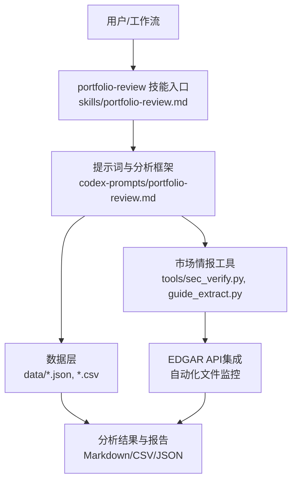
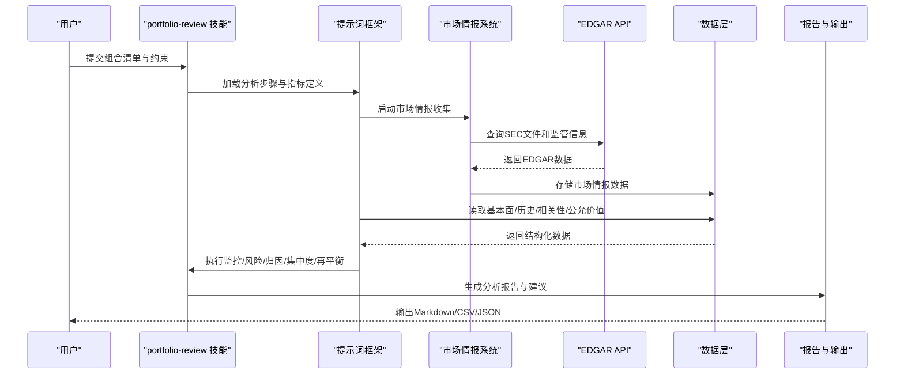
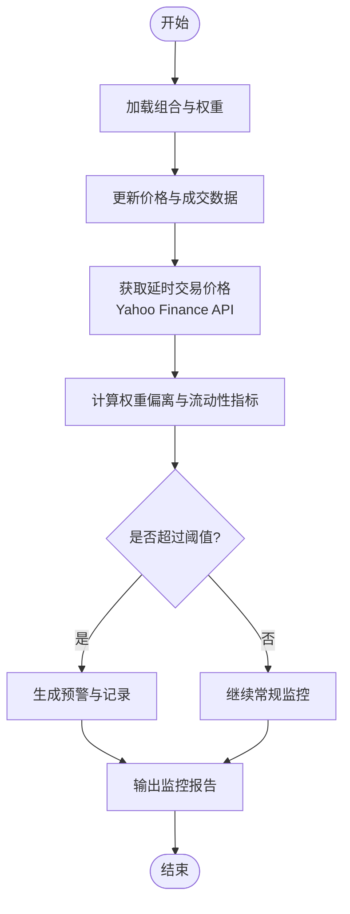
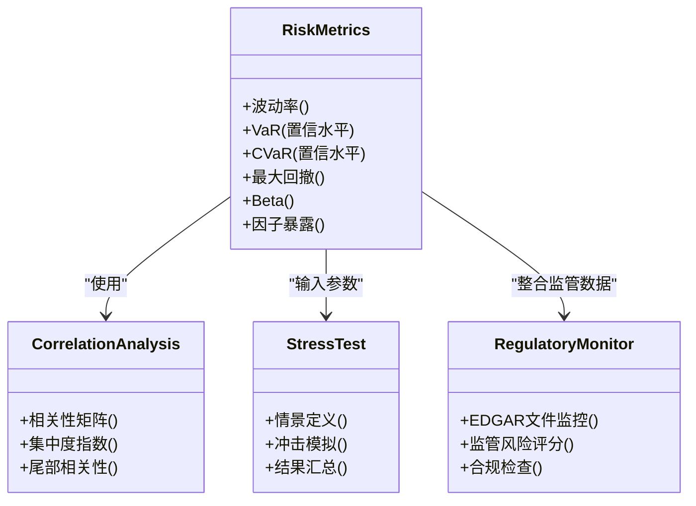
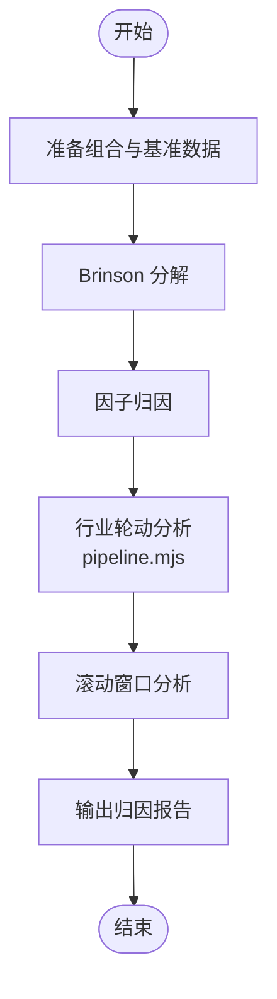
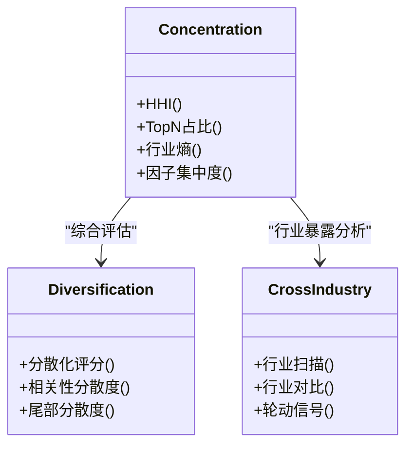
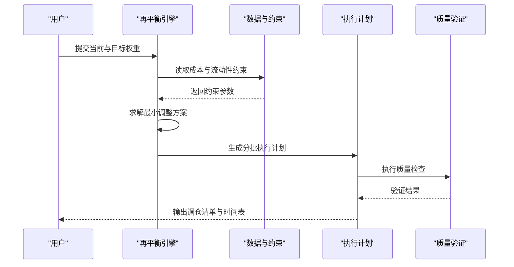
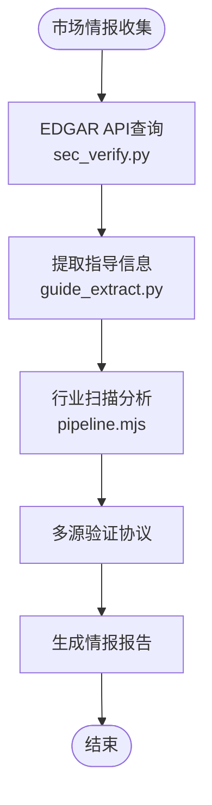
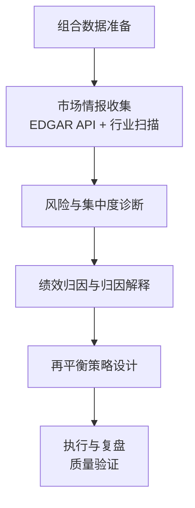
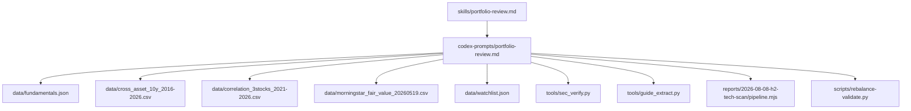

# 投资组合审查技能

<cite>
**本文引用的文件**   
- [portfolio-review.md](file://skills/portfolio-review.md)
- [portfolio-review.md](file://codex-prompts/portfolio-review.md)
- [sec_verify.py](file://tools/sec_verify.py)
- [guide_extract.py](file://tools/guide_extract.py)
- [pipeline.mjs](file://reports/2026-08-08-h2-tech-scan/pipeline.mjs)
- [tournament2.mjs](file://reports/2026-08-08-h2-tech-scan/tournament2.mjs)
- [portfolio-action-20260820.md](file://reports/portfolio-action-20260820.md)
- [rebalance-validate.py](file://scripts/rebalance-validate.py)
</cite>

## 更新摘要
**变更内容**   
- 增强了市场情报收集功能，涵盖行业分析、监管监控和市场情绪跟踪
- 集成了EDGAR API自动化文件监控系统，支持多源验证协议
- 扩展了跨行业分析能力，特别关注技术、金融服务和能源行业
- 增加了实时市场数据获取和延时交易价格监控
- 完善了组合执行质量验证和工作流管理

## 目录
1. [简介](#简介)
2. [项目结构](#项目结构)
3. [核心组件](#核心组件)
4. [架构总览](#架构总览)
5. [详细组件分析](#详细组件分析)
6. [依赖关系分析](#依赖关系分析)
7. [性能与可扩展性](#性能与可扩展性)
8. [故障排查指南](#故障排查指南)
9. [结论](#结论)
10. [附录](#附录)

## 简介
本文件为"投资组合审查技能"（portfolio-review）的完整功能文档，面向投资经理、研究员与量化分析师。该技能围绕以下目标展开：
- 持仓监控：跟踪组合内标的价格、权重与流动性变化，识别异常波动与偏离。
- 风险评估：从个股风险到组合层面进行风险度量，包括波动率、相关性、集中度与尾部风险。
- 绩效归因：将组合收益分解至资产配置、行业配置与个股权重选择等维度。
- 集中度分析：评估单一标的、行业、区域与因子暴露的集中程度。
- 再平衡建议：基于风险预算与约束条件生成可执行的调仓建议。

**最新更新**：增强了市场情报收集能力，包括行业分析、监管监控、市场情绪跟踪和多源验证协议，通过EDGAR API集成实现自动化文件监控。

## 项目结构
本项目采用"技能+提示词+数据"的组织方式：
- codex-prompts/portfolio-review.md：定义投资组合审查技能的提示词模板与分析框架，指导大模型按步骤完成组合诊断与优化建议。
- skills/portfolio-review.md：技能入口说明，描述如何调用该技能、输入参数、输出产物与使用场景。
- data/：包含用于分析与演示的数据集，涵盖基本面、跨资产历史、相关性与公允价值等。
- tools/：包含EDGAR API集成工具、财务验证工具和行业分析脚本。
- reports/：包含实际的投资组合操作报告和行业扫描结果。

**图表来源**
- [portfolio-review.md](file://skills/portfolio-review.md)
- [portfolio-review.md](file://codex-prompts/portfolio-review.md)
- [sec_verify.py](file://tools/sec_verify.py)
- [guide_extract.py](file://tools/guide_extract.py)

## 核心组件
- 技能入口与编排：通过 skills/portfolio-review.md 定义调用方式、输入输出与任务编排；由 codex-prompts/portfolio-review.md 提供结构化提示词与分析步骤。
- 数据接入：
  - fundamentals.json：公司基本面快照或筛选结果，用于估值与质量评估。
  - cross_asset_10y_2016-2026.csv：多资产长期序列，支持宏观与大类资产配置视角的风险与归因。
  - correlation_3stocks_2021-2026.csv：股票间相关性矩阵，用于集中度与分散化评估。
  - morningstar_fair_value_20260519.csv：公允价值参考，辅助估值与再平衡决策。
  - watchlist.json：观察池/候选标的清单，便于组合扩展与替换。
- **新增市场情报组件**：
  - EDGAR API集成：通过 sec_verify.py 和 guide_extract.py 实现SEC文件自动化监控
  - 行业分析工具：pipeline.mjs 和 tournament2.mjs 支持跨行业扫描和分析
  - 实时数据获取：延时交易价格和盘前盘后市场数据监控
- 分析模块：
  - 持仓监控：权重、流动性、价格变动与事件驱动信号。
  - 风险评估：波动率、VaR/ES、相关性、贝塔与因子暴露。
  - 绩效归因：Brinson 风格（资产类别/行业/个股）与贡献度分解。
  - 集中度分析：赫芬达尔指数、前N占比、行业/区域/因子暴露。
  - 再平衡建议：基于风险预算、约束与交易成本的最小化调整方案。

**章节来源**
- [portfolio-review.md](file://skills/portfolio-review.md)
- [portfolio-review.md](file://codex-prompts/portfolio-review.md)
- [sec_verify.py](file://tools/sec_verify.py)
- [guide_extract.py](file://tools/guide_extract.py)
- [pipeline.mjs](file://reports/2026-08-08-h2-tech-scan/pipeline.mjs)

## 架构总览
下图展示从输入到输出的端到端流程，强调数据、提示词与技能编排之间的协作关系，以及新增的市场情报收集功能。

**图表来源**
- [portfolio-review.md](file://skills/portfolio-review.md)
- [sec_verify.py](file://tools/sec_verify.py)
- [guide_extract.py](file://tools/guide_extract.py)

## 详细组件分析

### 组件A：持仓监控与预警（增强版）
- 功能要点
  - 权重追踪：实时/日频更新各标的权重，计算偏离基准或目标的偏差。
  - 流动性监测：结合成交量与买卖价差，识别流动性不足带来的冲击成本。
  - 事件驱动：财报、分红、回购、监管公告等触发阈值预警。
  - **新增延时交易监控**：支持夜盘和盘前价格的实时跟踪，通过Yahoo Finance v8 chart API获取includePrePost=true数据。
- 输入输出
  - 输入：组合清单、权重、基准、阈值规则。
  - 输出：监控看板、预警清单、偏离度报表。
- 关键指标
  - 权重偏离度、换手率、流动性比率、事件影响评分、延时交易变动幅度。

**章节来源**
- [portfolio-review.md:37-54](file://skills/portfolio-review.md#L37-L54)

### 组件B：风险评估与压力测试（增强版）
- 功能要点
  - 风险度量：波动率、VaR、CVaR、最大回撤、Beta与因子暴露。
  - 相关性分析：利用相关性矩阵评估分散化效果与尾部联动风险。
  - 压力测试：对极端情景（利率上行、信用利差扩大、流动性枯竭）进行冲击模拟。
  - **新增监管风险监控**：通过EDGAR API监控监管文件变化，识别潜在监管风险。
- 输入输出
  - 输入：历史收益率序列、相关性矩阵、风险参数、监管文件数据。
  - 输出：风险仪表盘、压力测试结果、风险贡献分解、监管风险警报。
- 关键指标
  - 组合波动率、VaR/CVaR、风险贡献度、相关性集中度、监管风险评分。

**图表来源**
- [sec_verify.py:1-111](file://tools/sec_verify.py#L1-L111)
- [guide_extract.py:1-105](file://tools/guide_extract.py#L1-L105)

**章节来源**
- [sec_verify.py](file://tools/sec_verify.py)
- [guide_extract.py](file://tools/guide_extract.py)

### 组件C：绩效归因与贡献度分解（增强版）
- 功能要点
  - Brinson 归因：将超额收益分解为资产配置效应、行业配置效应与个股权重选择效应。
  - 因子归因：规模、价值、动量、质量等因子对收益的贡献。
  - 滚动归因：时间窗口内的动态归因趋势。
  - **新增行业轮动分析**：通过pipeline.mjs实现全市场行业扫描，识别行业轮动机会。
- 输入输出
  - 输入：组合与基准的权重、收益率、行业分类、因子载荷、行业轮动数据。
  - 输出：归因报表、贡献度图、滚动趋势、行业轮动信号。
- 关键指标
  - 配置效应、选择效应、交互效应、因子贡献度、行业轮动评分。

**图表来源**
- [pipeline.mjs:1-106](file://reports/2026-08-08-h2-tech-scan/pipeline.mjs#L1-L106)

**章节来源**
- [pipeline.mjs](file://reports/2026-08-08-h2-tech-scan/pipeline.mjs)

### 组件D：集中度分析与分散化评估（增强版）
- 功能要点
  - 单一标的集中度：前N占比、赫芬达尔指数。
  - 行业/区域集中度：行业权重分布与区域暴露。
  - 因子暴露集中度：风格因子的集中程度与潜在漂移。
  - **新增跨行业分析**：支持技术、金融服务、能源等多行业深度扫描。
- 输入输出
  - 输入：组合权重、行业/区域映射、因子载荷、行业扫描数据。
  - 输出：集中度报表、热力图、分散化评分、行业暴露分析。
- 关键指标
  - HHI、Top-N占比、行业熵、因子集中度、行业暴露度。

**图表来源**
- [tournament2.mjs:13-24](file://reports/2026-08-08-h2-tech-scan/tournament2.mjs#L13-L24)

**章节来源**
- [tournament2.mjs](file://reports/2026-08-08-h2-tech-scan/tournament2.mjs)

### 组件E：再平衡建议与执行路径（增强版）
- 功能要点
  - 目标权重设定：基于风险预算、约束与偏好确定目标配置。
  - 最小化调整：在交易成本与冲击成本约束下，求解最小调整幅度。
  - 分批执行：根据流动性与波动环境制定分批调仓计划。
  - **新增执行质量验证**：通过rebalance-validate.py确保调仓执行符合规范。
- 输入输出
  - 输入：当前权重、目标权重、交易成本、流动性约束、执行质量要求。
  - 输出：调仓清单、执行时间表、预期风险改善、执行质量报告。
- 关键指标
  - 调整幅度、交易成本、风险改善度、跟踪误差、执行质量评分。

**图表来源**
- [rebalance-validate.py:1-45](file://scripts/rebalance-validate.py#L1-L45)

**章节来源**
- [rebalance-validate.py](file://scripts/rebalance-validate.py)

### 组件F：市场情报收集系统（新增）
- 功能要点
  - **EDGAR API集成**：通过sec_verify.py和guide_extract.py实现SEC文件自动化监控
  - **行业分析扫描**：通过pipeline.mjs进行全市场行业扫描，支持技术、金融、能源等行业
  - **监管风险监控**：实时监控监管文件变化，识别潜在合规风险
  - **多源验证协议**：交叉验证不同数据源的信息一致性
- 输入输出
  - 输入：股票代码、行业分类、监管关注点
  - 输出：监管风险报告、行业分析结果、多源验证报告
- 关键指标
  - 监管风险评分、行业景气度、信息一致性评分、文件更新频率

**图表来源**
- [sec_verify.py:46-111](file://tools/sec_verify.py#L46-L111)
- [guide_extract.py:21-105](file://tools/guide_extract.py#L21-L105)
- [pipeline.mjs:10-106](file://reports/2026-08-08-h2-tech-scan/pipeline.mjs#L10-L106)

**章节来源**
- [sec_verify.py](file://tools/sec_verify.py)
- [guide_extract.py](file://tools/guide_extract.py)
- [pipeline.mjs](file://reports/2026-08-08-h2-tech-scan/pipeline.mjs)

### 概念总览
以下为不绑定具体代码的概念性工作流，帮助理解整体思路与最佳实践。

## 依赖关系分析
- 技能与提示词
  - skills/portfolio-review.md 作为入口，负责编排任务与输出格式。
  - codex-prompts/portfolio-review.md 提供结构化分析步骤与指标定义。
- 数据依赖
  - fundamentals.json：用于基本面与估值参考。
  - cross_asset_10y_2016-2026.csv：用于宏观与跨资产风险与归因。
  - correlation_3stocks_2021-2026.csv：用于相关性分析与集中度评估。
  - morningstar_fair_value_20260519.csv：用于公允价值对比与再平衡依据。
  - watchlist.json：用于候选标的管理与组合扩展。
- **新增工具依赖**
  - sec_verify.py：EDGAR XBRL数据验证
  - guide_extract.py：SEC文件指导信息提取
  - pipeline.mjs：全市场行业扫描流水线
  - rebalance-validate.py：执行质量验证

**图表来源**
- [portfolio-review.md](file://skills/portfolio-review.md)
- [sec_verify.py](file://tools/sec_verify.py)
- [guide_extract.py](file://tools/guide_extract.py)
- [pipeline.mjs](file://reports/2026-08-08-h2-tech-scan/pipeline.mjs)
- [rebalance-validate.py](file://scripts/rebalance-validate.py)

**章节来源**
- [portfolio-review.md](file://skills/portfolio-review.md)
- [sec_verify.py](file://tools/sec_verify.py)
- [guide_extract.py](file://tools/guide_extract.py)
- [pipeline.mjs](file://reports/2026-08-08-h2-tech-scan/pipeline.mjs)
- [rebalance-validate.py](file://scripts/rebalance-validate.py)

## 性能与可扩展性
- 数据规模与频率
  - 长序列数据（如跨资产10年）适合离线批处理与滚动窗口分析；高频数据需考虑存储与计算开销。
  - EDGAR API调用有速率限制，需要合理设置请求间隔和重试机制。
- 计算复杂度
  - 相关性矩阵与风险协方差估计随标的数量呈平方级增长，建议采用降维或稀疏化技术。
  - 全市场扫描（pipeline.mjs）支持大规模数据处理，但需要考虑API限流和数据缓存。
- 可扩展方向
  - 引入更多因子库与另类数据源（新闻情绪、供应链数据）。
  - 增加自动化回测与在线学习机制，提升再平衡策略的动态适应性。
  - 扩展EDGAR API支持更多类型的监管文件和披露信息。

## 故障排查指南
- 数据缺失与不一致
  - 检查 fundamentals.json、watchlist.json 字段完整性与一致性。
  - 核对 CSV 的时间戳对齐与缺失值填充策略。
  - **新增**：检查EDGAR API连接状态和文件格式解析是否正确。
- 指标异常
  - 相关性矩阵出现奇异值时，检查样本期与去噪方法。
  - VaR/CVaR 对尾部敏感，需确认置信水平与分布假设。
  - **新增**：行业扫描数据不完整时，检查Nasdaq API和Finviz数据源可用性。
- 报告生成失败
  - 确认提示词框架中输出模板与数据字段匹配。
  - 校验权限与路径，确保输出目录可写。
  - **新增**：执行质量验证失败时，检查workflow配置文件和执行环境。

**章节来源**
- [portfolio-review.md](file://skills/portfolio-review.md)
- [sec_verify.py](file://tools/sec_verify.py)
- [pipeline.mjs](file://reports/2026-08-08-h2-tech-scan/pipeline.mjs)

## 结论
投资组合审查技能以"技能入口+提示词框架+数据层+市场情报系统"为核心架构，覆盖持仓监控、风险评估、绩效归因、集中度分析与再平衡建议五大能力。**最新增强**包括EDGAR API集成、行业扫描分析和执行质量验证，为投资组合管理提供了更全面的市场情报支持和更可靠的执行保障。通过标准化的输入输出与模块化分析，能够快速生成高质量的投资组合诊断与优化报告，并为后续执行与复盘提供坚实基础。

## 附录
- 使用示例
  - 输入：组合清单、权重、基准、约束与阈值。
  - 过程：加载数据→市场情报收集→执行监控/风险/归因/集中度/再平衡→生成报告。
  - 输出：Markdown/CSV/JSON 报告与可视化图表。
- 数据字典
  - fundamentals.json：公司基本面快照与筛选结果。
  - cross_asset_10y_2016-2026.csv：多资产长期序列。
  - correlation_3stocks_2021-2026.csv：股票相关性矩阵。
  - morningstar_fair_value_20260519.csv：公允价值参考。
  - watchlist.json：观察池/候选标的清单。
- **新增工具说明**
  - sec_verify.py：SEC EDGAR XBRL数据验证工具
  - guide_extract.py：SEC文件指导信息提取工具
  - pipeline.mjs：全市场行业扫描流水线
  - rebalance-validate.py：执行质量验证脚本

**章节来源**
- [portfolio-review.md](file://skills/portfolio-review.md)
- [sec_verify.py](file://tools/sec_verify.py)
- [guide_extract.py](file://tools/guide_extract.py)
- [pipeline.mjs](file://reports/2026-08-08-h2-tech-scan/pipeline.mjs)
- [rebalance-validate.py](file://scripts/rebalance-validate.py)