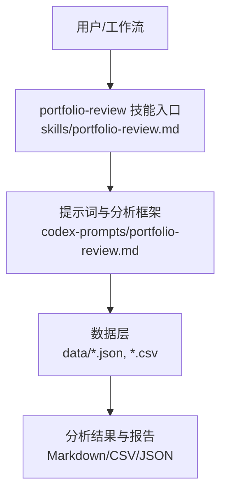
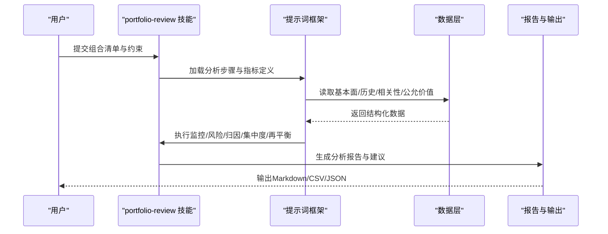
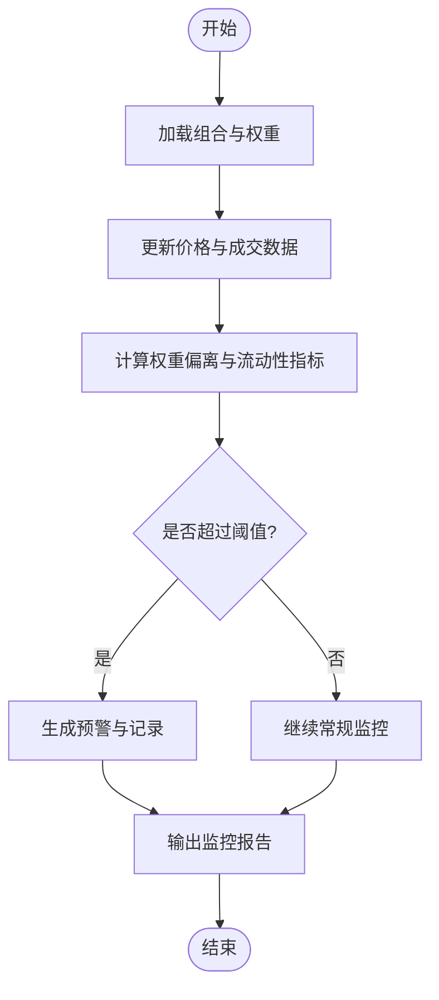
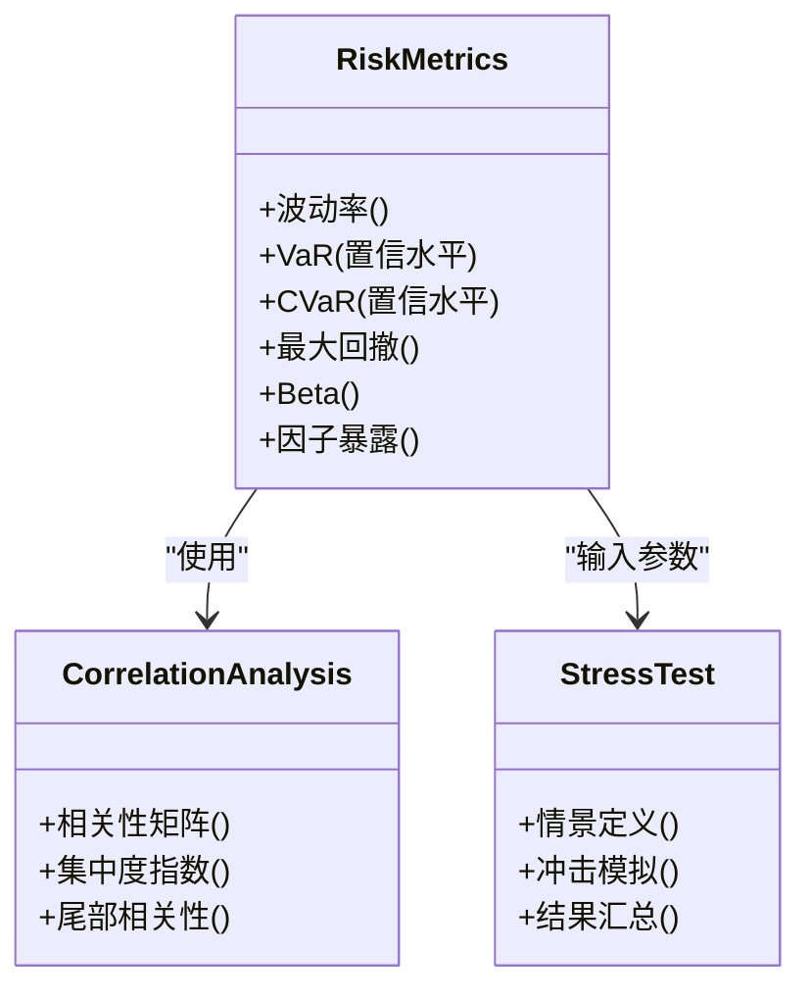
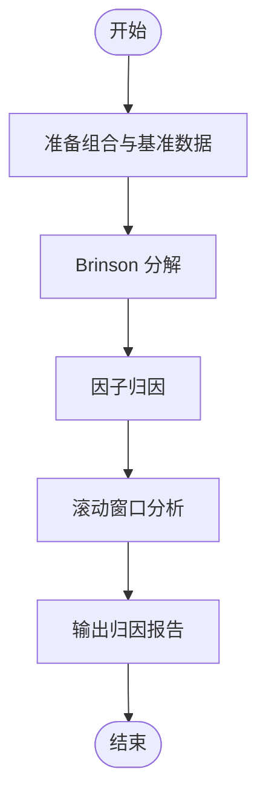
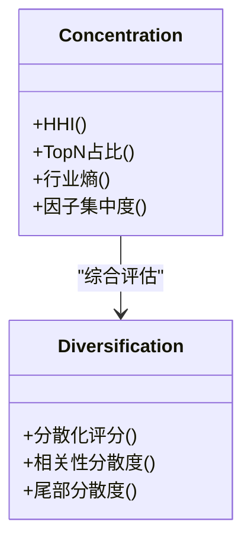
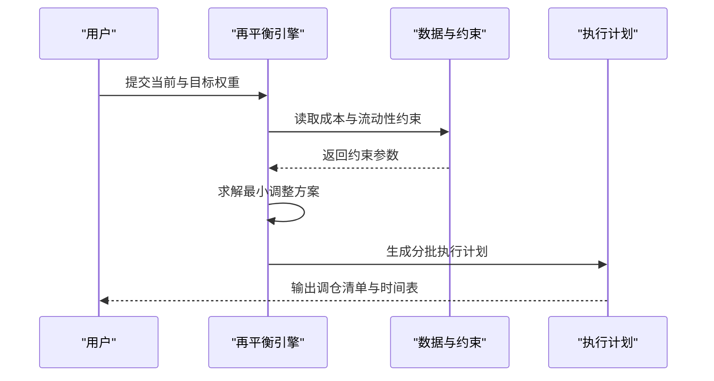
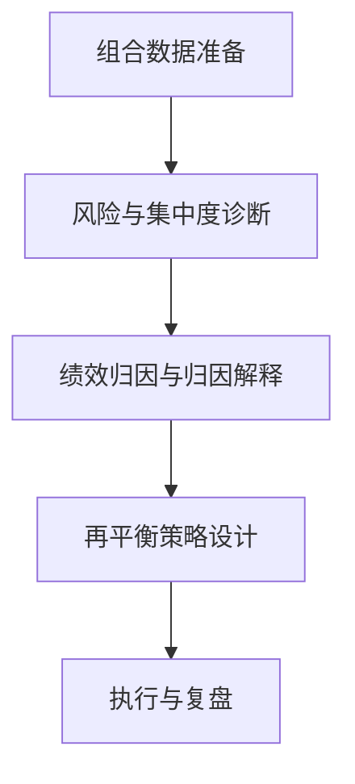
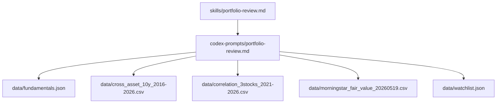

# 投资组合审查技能

<cite>
**本文引用的文件**   
- [portfolio-review.md](file://codex-prompts/portfolio-review.md)
- [portfolio-review.md](file://skills/portfolio-review.md)
- [fundamentals.json](file://data/fundamentals.json)
- [cross_asset_10y_2016-2026.csv](file://data/cross_asset_10y_2016-2026.csv)
- [correlation_3stocks_2021-2026.csv](file://data/correlation_3stocks_2021-2026.csv)
- [morningstar_fair_value_20260519.csv](file://data/morningstar_fair_value_20260519.csv)
- [watchlist.json](file://data/watchlist.json)
</cite>

## 目录
1. [简介](#简介)
2. [项目结构](#项目结构)
3. [核心组件](#核心组件)
4. [架构总览](#架构总览)
5. [详细组件分析](#详细组件分析)
6. [依赖关系分析](#依赖关系分析)
7. [性能与可扩展性](#性能与可扩展性)
8. [故障排查指南](#故障排查指南)
9. [结论](#结论)
10. [附录](#附录)

## 简介
本文件为“投资组合审查技能”（portfolio-review）的完整功能文档，面向投资经理、研究员与量化分析师。该技能围绕以下目标展开：
- 持仓监控：跟踪组合内标的价格、权重与流动性变化，识别异常波动与偏离。
- 风险评估：从个股风险到组合层面进行风险度量，包括波动率、相关性、集中度与尾部风险。
- 绩效归因：将组合收益分解至资产配置、行业配置与个股权重选择等维度。
- 集中度分析：评估单一标的、行业、区域与因子暴露的集中程度。
- 再平衡建议：基于风险预算与约束条件生成可执行的调仓建议。

此外，文档提供端到端的工作流、数据输入输出规范、可视化图示以及实际示例与报告生成流程，帮助读者快速上手并落地应用。

## 项目结构
本项目采用“技能+提示词+数据”的组织方式：
- codex-prompts/portfolio-review.md：定义投资组合审查技能的提示词模板与分析框架，指导大模型按步骤完成组合诊断与优化建议。
- skills/portfolio-review.md：技能入口说明，描述如何调用该技能、输入参数、输出产物与使用场景。
- data/：包含用于分析与演示的数据集，涵盖基本面、跨资产历史、相关性与公允价值等。

图表来源
- [portfolio-review.md](file://skills/portfolio-review.md)
- [portfolio-review.md](file://codex-prompts/portfolio-review.md)
- [fundamentals.json](file://data/fundamentals.json)
- [cross_asset_10y_2016-2026.csv](file://data/cross_asset_10y_2016-2026.csv)
- [correlation_3stocks_2021-2026.csv](file://data/correlation_3stocks_2021-2026.csv)
- [morningstar_fair_value_20260519.csv](file://data/morningstar_fair_value_20260519.csv)

章节来源
- [portfolio-review.md](file://skills/portfolio-review.md)
- [portfolio-review.md](file://codex-prompts/portfolio-review.md)

## 核心组件
- 技能入口与编排：通过 skills/portfolio-review.md 定义调用方式、输入输出与任务编排；由 codex-prompts/portfolio-review.md 提供结构化提示词与分析步骤。
- 数据接入：
  - fundamentals.json：公司基本面快照或筛选结果，用于估值与质量评估。
  - cross_asset_10y_2016-2026.csv：多资产长期序列，支持宏观与大类资产配置视角的风险与归因。
  - correlation_3stocks_2021-2026.csv：股票间相关性矩阵，用于集中度与分散化评估。
  - morningstar_fair_value_20260519.csv：公允价值参考，辅助估值与再平衡决策。
  - watchlist.json：观察池/候选标的清单，便于组合扩展与替换。
- 分析模块：
  - 持仓监控：权重、流动性、价格变动与事件驱动信号。
  - 风险评估：波动率、VaR/ES、相关性、贝塔与因子暴露。
  - 绩效归因：Brinson 风格（资产类别/行业/个股）与贡献度分解。
  - 集中度分析：赫芬达尔指数、前N占比、行业/区域/因子暴露。
  - 再平衡建议：基于风险预算、约束与交易成本的最小化调整方案。

章节来源
- [portfolio-review.md](file://skills/portfolio-review.md)
- [portfolio-review.md](file://codex-prompts/portfolio-review.md)
- [fundamentals.json](file://data/fundamentals.json)
- [cross_asset_10y_2016-2026.csv](file://data/cross_asset_10y_2016-2026.csv)
- [correlation_3stocks_2021-2026.csv](file://data/correlation_3stocks_2021-2026.csv)
- [morningstar_fair_value_20260519.csv](file://data/morningstar_fair_value_20260519.csv)
- [watchlist.json](file://data/watchlist.json)

## 架构总览
下图展示从输入到输出的端到端流程，强调数据、提示词与技能编排之间的协作关系。

图表来源
- [portfolio-review.md](file://skills/portfolio-review.md)
- [portfolio-review.md](file://codex-prompts/portfolio-review.md)
- [fundamentals.json](file://data/fundamentals.json)
- [cross_asset_10y_2016-2026.csv](file://data/cross_asset_10y_2016-2026.csv)
- [correlation_3stocks_2021-2026.csv](file://data/correlation_3stocks_2021-2026.csv)
- [morningstar_fair_value_20260519.csv](file://data/morningstar_fair_value_20260519.csv)

## 详细组件分析

### 组件A：持仓监控与预警
- 功能要点
  - 权重追踪：实时/日频更新各标的权重，计算偏离基准或目标的偏差。
  - 流动性监测：结合成交量与买卖价差，识别流动性不足带来的冲击成本。
  - 事件驱动：财报、分红、回购、监管公告等触发阈值预警。
- 输入输出
  - 输入：组合清单、权重、基准、阈值规则。
  - 输出：监控看板、预警清单、偏离度报表。
- 关键指标
  - 权重偏离度、换手率、流动性比率、事件影响评分。

章节来源
- [portfolio-review.md](file://skills/portfolio-review.md)
- [portfolio-review.md](file://codex-prompts/portfolio-review.md)

### 组件B：风险评估与压力测试
- 功能要点
  - 风险度量：波动率、VaR、CVaR、最大回撤、Beta与因子暴露。
  - 相关性分析：利用相关性矩阵评估分散化效果与尾部联动风险。
  - 压力测试：对极端情景（利率上行、信用利差扩大、流动性枯竭）进行冲击模拟。
- 输入输出
  - 输入：历史收益率序列、相关性矩阵、风险参数。
  - 输出：风险仪表盘、压力测试结果、风险贡献分解。
- 关键指标
  - 组合波动率、VaR/CVaR、风险贡献度、相关性集中度。

图表来源
- [cross_asset_10y_2016-2026.csv](file://data/cross_asset_10y_2016-2026.csv)
- [correlation_3stocks_2021-2026.csv](file://data/correlation_3stocks_2021-2026.csv)

章节来源
- [portfolio-review.md](file://skills/portfolio-review.md)
- [portfolio-review.md](file://codex-prompts/portfolio-review.md)
- [cross_asset_10y_2016-2026.csv](file://data/cross_asset_10y_2016-2026.csv)
- [correlation_3stocks_2021-2026.csv](file://data/correlation_3stocks_2021-2026.csv)

### 组件C：绩效归因与贡献度分解
- 功能要点
  - Brinson 归因：将超额收益分解为资产配置效应、行业配置效应与个股权重选择效应。
  - 因子归因：规模、价值、动量、质量等因子对收益的贡献。
  - 滚动归因：时间窗口内的动态归因趋势。
- 输入输出
  - 输入：组合与基准的权重、收益率、行业分类、因子载荷。
  - 输出：归因报表、贡献度图、滚动趋势。
- 关键指标
  - 配置效应、选择效应、交互效应、因子贡献度。

章节来源
- [portfolio-review.md](file://skills/portfolio-review.md)
- [portfolio-review.md](file://codex-prompts/portfolio-review.md)

### 组件D：集中度分析与分散化评估
- 功能要点
  - 单一标的集中度：前N占比、赫芬达尔指数。
  - 行业/区域集中度：行业权重分布与区域暴露。
  - 因子暴露集中度：风格因子的集中程度与潜在漂移。
- 输入输出
  - 输入：组合权重、行业/区域映射、因子载荷。
  - 输出：集中度报表、热力图、分散化评分。
- 关键指标
  - HHI、Top-N占比、行业熵、因子集中度。

图表来源
- [correlation_3stocks_2021-2026.csv](file://data/correlation_3stocks_2021-2026.csv)

章节来源
- [portfolio-review.md](file://skills/portfolio-review.md)
- [portfolio-review.md](file://codex-prompts/portfolio-review.md)
- [correlation_3stocks_2021-2026.csv](file://data/correlation_3stocks_2021-2026.csv)

### 组件E：再平衡建议与执行路径
- 功能要点
  - 目标权重设定：基于风险预算、约束与偏好确定目标配置。
  - 最小化调整：在交易成本与冲击成本约束下，求解最小调整幅度。
  - 分批执行：根据流动性与波动环境制定分批调仓计划。
- 输入输出
  - 输入：当前权重、目标权重、交易成本、流动性约束。
  - 输出：调仓清单、执行时间表、预期风险改善。
- 关键指标
  - 调整幅度、交易成本、风险改善度、跟踪误差。

图表来源
- [portfolio-review.md](file://skills/portfolio-review.md)
- [portfolio-review.md](file://codex-prompts/portfolio-review.md)

章节来源
- [portfolio-review.md](file://skills/portfolio-review.md)
- [portfolio-review.md](file://codex-prompts/portfolio-review.md)

### 概念总览
以下为不绑定具体代码的概念性工作流，帮助理解整体思路与最佳实践。

[此图为概念性流程图，无需图表来源]

## 依赖关系分析
- 技能与提示词
  - skills/portfolio-review.md 作为入口，负责编排任务与输出格式。
  - codex-prompts/portfolio-review.md 提供结构化分析步骤与指标定义。
- 数据依赖
  - fundamentals.json：用于基本面与估值参考。
  - cross_asset_10y_2016-2026.csv：用于宏观与跨资产风险与归因。
  - correlation_3stocks_2021-2026.csv：用于相关性分析与集中度评估。
  - morningstar_fair_value_20260519.csv：用于公允价值对比与再平衡依据。
  - watchlist.json：用于候选标的管理与组合扩展。

图表来源
- [portfolio-review.md](file://skills/portfolio-review.md)
- [portfolio-review.md](file://codex-prompts/portfolio-review.md)
- [fundamentals.json](file://data/fundamentals.json)
- [cross_asset_10y_2016-2026.csv](file://data/cross_asset_10y_2016-2026.csv)
- [correlation_3stocks_2021-2026.csv](file://data/correlation_3stocks_2021-2026.csv)
- [morningstar_fair_value_20260519.csv](file://data/morningstar_fair_value_20260519.csv)
- [watchlist.json](file://data/watchlist.json)

章节来源
- [portfolio-review.md](file://skills/portfolio-review.md)
- [portfolio-review.md](file://codex-prompts/portfolio-review.md)
- [fundamentals.json](file://data/fundamentals.json)
- [cross_asset_10y_2016-2026.csv](file://data/cross_asset_10y_2016-2026.csv)
- [correlation_3stocks_2021-2026.csv](file://data/correlation_3stocks_2021-2026.csv)
- [morningstar_fair_value_20260519.csv](file://data/morningstar_fair_value_20260519.csv)
- [watchlist.json](file://data/watchlist.json)

## 性能与可扩展性
- 数据规模与频率
  - 长序列数据（如跨资产10年）适合离线批处理与滚动窗口分析；高频数据需考虑存储与计算开销。
- 计算复杂度
  - 相关性矩阵与风险协方差估计随标的数量呈平方级增长，建议采用降维或稀疏化技术。
- 可扩展方向
  - 引入更多因子库与另类数据源（新闻情绪、供应链数据）。
  - 增加自动化回测与在线学习机制，提升再平衡策略的动态适应性。

[本节为通用指导，无需章节来源]

## 故障排查指南
- 数据缺失与不一致
  - 检查 fundamentals.json、watchlist.json 字段完整性与一致性。
  - 核对 CSV 的时间戳对齐与缺失值填充策略。
- 指标异常
  - 相关性矩阵出现奇异值时，检查样本期与去噪方法。
  - VaR/CVaR 对尾部敏感，需确认置信水平与分布假设。
- 报告生成失败
  - 确认提示词框架中输出模板与数据字段匹配。
  - 校验权限与路径，确保输出目录可写。

章节来源
- [portfolio-review.md](file://skills/portfolio-review.md)
- [portfolio-review.md](file://codex-prompts/portfolio-review.md)

## 结论
投资组合审查技能以“技能入口+提示词框架+数据层”为核心架构，覆盖持仓监控、风险评估、绩效归因、集中度分析与再平衡建议五大能力。通过标准化的输入输出与模块化分析，能够快速生成高质量的投资组合诊断与优化报告，并为后续执行与复盘提供坚实基础。

[本节为总结性内容，无需章节来源]

## 附录
- 使用示例
  - 输入：组合清单、权重、基准、约束与阈值。
  - 过程：加载数据→执行监控/风险/归因/集中度/再平衡→生成报告。
  - 输出：Markdown/CSV/JSON 报告与可视化图表。
- 数据字典
  - fundamentals.json：公司基本面快照与筛选结果。
  - cross_asset_10y_2016-2026.csv：多资产长期序列。
  - correlation_3stocks_2021-2026.csv：股票相关性矩阵。
  - morningstar_fair_value_20260519.csv：公允价值参考。
  - watchlist.json：观察池/候选标的清单。

章节来源
- [portfolio-review.md](file://skills/portfolio-review.md)
- [portfolio-review.md](file://codex-prompts/portfolio-review.md)
- [fundamentals.json](file://data/fundamentals.json)
- [cross_asset_10y_2016-2026.csv](file://data/cross_asset_10y_2016-2026.csv)
- [correlation_3stocks_2021-2026.csv](file://data/correlation_3stocks_2021-2026.csv)
- [morningstar_fair_value_20260519.csv](file://data/morningstar_fair_value_20260519.csv)
- [watchlist.json](file://data/watchlist.json)