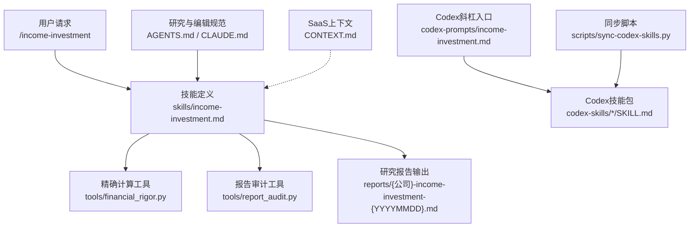
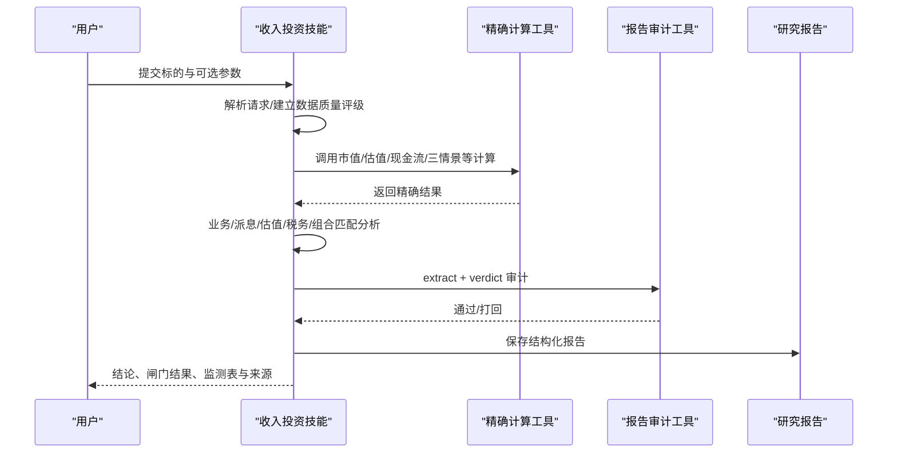
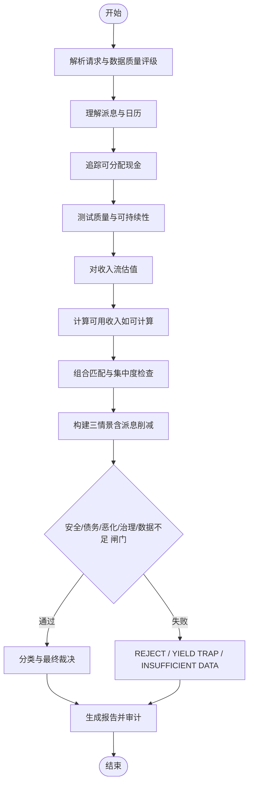
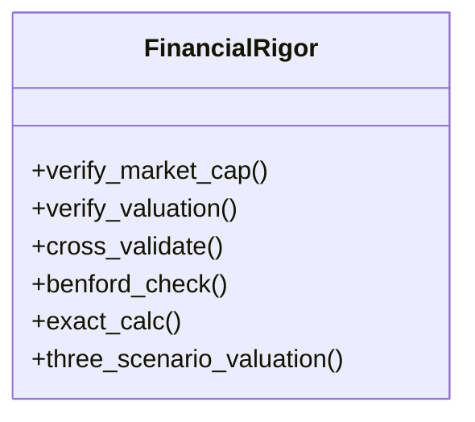
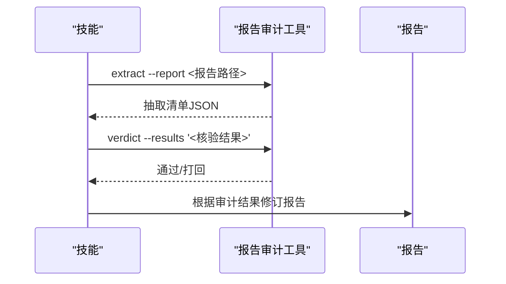
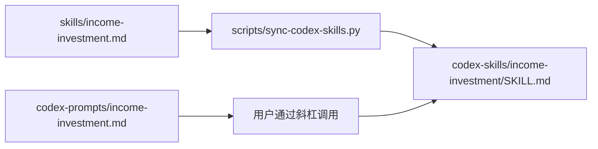
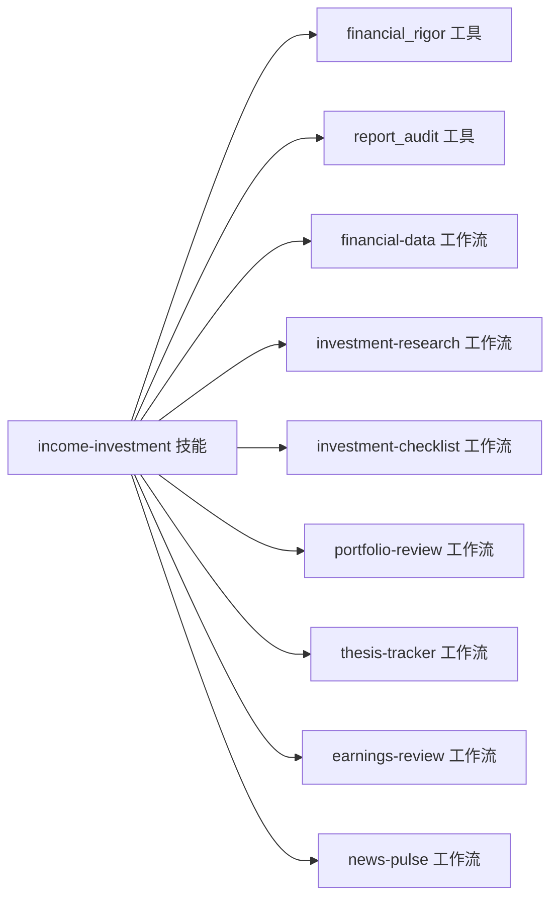

# 收入投资技能

<cite>
**本文引用的文件**
- [README_EN.md](file://README_EN.md)
- [CONTEXT.md](file://CONTEXT.md)
- [AGENTS.md](file://AGENTS.md)
- [CLAUDE.md](file://CLAUDE.md)
- [skills/income-investment.md](file://skills/income-investment.md)
- [codex-prompts/income-investment.md](file://codex-prompts/income-investment.md)
- [scripts/sync-codex-skills.py](file://scripts/sync-codex-skills.py)
- [tools/financial_rigor.py](file://tools/financial_rigor.py)
- [tools/report_audit.py](file://tools/report_audit.py)
</cite>

## 目录
1. [简介](#简介)
2. [项目结构](#项目结构)
3. [核心组件](#核心组件)
4. [架构总览](#架构总览)
5. [详细组件分析](#详细组件分析)
6. [依赖关系分析](#依赖关系分析)
7. [性能与成本考量](#性能与成本考量)
8. [故障排查指南](#故障排查指南)
9. [结论](#结论)
10. [附录](#附录)

## 简介
本文件聚焦“收入投资技能”（income-investment），该技能用于评估标的是否具备可持续、可配置的派息能力，并据此决定其在组合中的角色（核心收入、机会性收益或回避）。它强调：
- 不将高显示收益率等同于好机会；
- 严格区分“已验证事实、估计、假设与分析判断”；
- 使用精确计算工具进行派息、收益率、估值与税务等关键算术；
- 通过报告审计流程确保数据可追溯、可复核。

该技能是AI Berkshire投研框架的一部分，与财务数据核验、组合审视、买入检查、财报审阅、新闻归因等工作流协同工作。

**章节来源**
- [skills/income-investment.md:1-188](file://skills/income-investment.md#L1-L188)
- [README_EN.md:165-210](file://README_EN.md#L165-L210)

## 项目结构
围绕收入投资技能的相关结构与职责如下：
- skills/income-investment.md：技能的权威定义与执行流程（输入、研究纪律、步骤、评分卡、闸门、输出格式、审计命令）。
- codex-prompts/income-investment.md：Codex斜杠入口的适配层，指向已安装的Codex技能。
- scripts/sync-codex-skills.py：从skills生成Codex技能包的脚本，保证Claude Code与Codex共享同一工作流源。
- tools/financial_rigor.py：精确计算与交叉验证工具（市值验算、估值指标、多源校验、Benford检测、三情景估值、精确计算器）。
- tools/report_audit.py：报告抽检与准出工具，抽取报告中财务数据点并与可靠信源比对，给出通过/打回判决。
- AGENTS.md / CLAUDE.md：研究与编辑规范、报告命名与目录约定、质量规则。
- CONTEXT.md：面向SaaS化的术语与编排概念（密钥、配额扣减、Worker引擎等），为上层产品化提供上下文。

**图表来源**
- [skills/income-investment.md:1-188](file://skills/income-investment.md#L1-L188)
- [codex-prompts/income-investment.md:1-12](file://codex-prompts/income-investment.md#L1-L12)
- [scripts/sync-codex-skills.py:92-134](file://scripts/sync-codex-skills.py#L92-L134)
- [tools/financial_rigor.py:1-466](file://tools/financial_rigor.py#L1-L466)
- [tools/report_audit.py:1-200](file://tools/report_audit.py#L1-L200)
- [AGENTS.md:25-70](file://AGENTS.md#L25-L70)
- [CLAUDE.md:17-55](file://CLAUDE.md#L17-L55)
- [CONTEXT.md:1-30](file://CONTEXT.md#L1-L30)

**章节来源**
- [skills/income-investment.md:1-188](file://skills/income-investment.md#L1-L188)
- [codex-prompts/income-investment.md:1-12](file://codex-prompts/income-investment.md#L1-L12)
- [scripts/sync-codex-skills.py:92-134](file://scripts/sync-codex-skills.py#L92-L134)
- [tools/financial_rigor.py:1-466](file://tools/financial_rigor.py#L1-L466)
- [tools/report_audit.py:1-200](file://tools/report_audit.py#L1-L200)
- [AGENTS.md:25-70](file://AGENTS.md#L25-L70)
- [CLAUDE.md:17-55](file://CLAUDE.md#L17-L55)
- [CONTEXT.md:1-30](file://CONTEXT.md#L1-L30)

## 核心组件
- 收入投资技能（skills/income-investment.md）：定义输入参数、研究纪律、八步执行流程、分类与闸门、评分卡、报告结构与发布审计。
- 精确计算工具（tools/financial_rigor.py）：提供市值验算、估值指标、多源交叉验证、Benford检测、三情景估值与精确计算器，全部基于Decimal避免浮点误差。
- 报告审计工具（tools/report_audit.py）：从Markdown中抽取财务数据点，抽样核验并给出准出/打回判决。
- Codex适配层（codex-prompts/income-investment.md + scripts/sync-codex-skills.py）：将技能以Codex技能包形式分发，保持与Claude Code一致的工作流。
- 研究与编辑规范（AGENTS.md / CLAUDE.md）：统一日期基准、数据来源要求、报告命名与目录结构、质量规则。
- SaaS上下文（CONTEXT.md）：描述密钥、配额扣减、编排与Worker引擎等概念，便于产品化集成。

**章节来源**
- [skills/income-investment.md:1-188](file://skills/income-investment.md#L1-L188)
- [tools/financial_rigor.py:1-466](file://tools/financial_rigor.py#L1-L466)
- [tools/report_audit.py:1-200](file://tools/report_audit.py#L1-L200)
- [codex-prompts/income-investment.md:1-12](file://codex-prompts/income-investment.md#L1-L12)
- [scripts/sync-codex-skills.py:92-134](file://scripts/sync-codex-skills.py#L92-L134)
- [AGENTS.md:25-70](file://AGENTS.md#L25-L70)
- [CLAUDE.md:17-55](file://CLAUDE.md#L17-L55)
- [CONTEXT.md:1-30](file://CONTEXT.md#L1-L30)

## 架构总览
收入投资技能在AI Berkshire三层架构中的位置：
- 技能层：明确“做什么”（收入型权益分析），提供标准化输入与输出。
- 代理层：如需并行研究，可调用investment-team等多Agent工作流；收入技能本身专注收入维度决策，不覆盖其他维度的最终结论。
- 工具层：通过financial_rigor与report_audit保障数据严谨性与可审计性。

**图表来源**
- [skills/income-investment.md:44-188](file://skills/income-investment.md#L44-L188)
- [tools/financial_rigor.py:70-375](file://tools/financial_rigor.py#L70-L375)
- [tools/report_audit.py:1-200](file://tools/report_audit.py#L1-L200)

## 详细组件分析

### 收入投资技能（skills/income-investment.md）
- 输入与模式：支持新仓/现有持仓、角色定位（核心收入/机会性收入）、数量/成本/权重/目标收益率/税务居民/组合文件/持有期等可选参数；缺失信息需标注Unknown/不可计算并说明影响。
- 研究纪律：先确认日期；优先年报/中报/监管文件；关键财务数据至少两源交叉验证；所有敏感数字用精确工具计算；完成后执行报告审计。
- 执行流程：
  1) 解析请求与数据质量评级（A/B/C）；
  2) 理解派息（频率、普通/特别/可变、币种、历史、CAGR、日历）；
  3) 追踪可分配现金（净利润/自由现金流/必要投资后现金流、利息覆盖、净债、到期、再融资、维护与增长CapEx、表外承诺、回购竞争）；
  4) 测试质量与可持续性（商业模式、护城河、定价权、周期性、利率/汇率/商品敏感度、可预测性、资本配置、管理层质量、下行情景维持派息能力）；
  5) 对收入流估值（当前/历史收益率、合理倍数、FCF收益率、内在价值区间、安全边际、价格下跌+降息的联合情景）；
  6) 计算可用收入（当输入允许时：年度总额、按支付频率拆分、预提税、税后收入、组合贡献、交易后年收入；否则仅展示税前并说明原因）；
  7) 组合匹配（权重、行业/地域集中度、重复风险、收入依赖单一行业、结合最新portfolio-review）；
  8) 构建三情景（基础/不利/严重），必须测试派息削减而非假定固定；
  9) 分类与闸门（ conviction/opportunistic/yield trap/unsuitable；安全/债务/恶化/治理/数据不足等闸门失败直接否决）；
  10) 输出报告（固定标题顺序，含月度收入日历、监测表、来源与数据质量）。
- 与相关流程协作：引用financial-data、investment-research、investment-checklist、portfolio-review、thesis-tracker、earnings-review、news-pulse，但不覆盖其结论。

**图表来源**
- [skills/income-investment.md:44-188](file://skills/income-investment.md#L44-L188)

**章节来源**
- [skills/income-investment.md:1-188](file://skills/income-investment.md#L1-L188)

### 精确计算工具（tools/financial_rigor.py）
- 设计原则：全部使用Python Decimal进行精确十进制运算，避免浮点误差；提供格式化输出与UTF-8兼容。
- 主要功能：
  - 市值验算：股价×总股本 vs 报告市值，偏差阈值提示；
  - 估值指标：PE/PB/ROE/P/FCF/股息率/PS等；
  - 多源交叉验证：比较多个来源的中位数与偏差；
  - Benford定律检测：快速识别异常分布；
  - 精确计算器：受限表达式求值；
  - 三情景估值：乐观/中性/悲观下目标价与涨跌幅。
- 使用方式：由技能在执行关键节点调用，输出嵌入报告作为验证记录。

**图表来源**
- [tools/financial_rigor.py:70-375](file://tools/financial_rigor.py#L70-L375)

**章节来源**
- [tools/financial_rigor.py:1-466](file://tools/financial_rigor.py#L1-L466)

### 报告审计工具（tools/report_audit.py）
- 作用：从Markdown报告中抽取财务数据点，随机抽样并与可靠信源比对，给出通过/打回判决。
- 流程：extract（抽取清单）→ 人工/系统回填fetched_value → verdict（判定）。
- 特点：支持多种数字格式与单位，过滤噪声标签，表格/KV行/加粗数字均能识别。

**图表来源**
- [tools/report_audit.py:1-200](file://tools/report_audit.py#L1-L200)
- [skills/income-investment.md:179-188](file://skills/income-investment.md#L179-L188)

**章节来源**
- [tools/report_audit.py:1-200](file://tools/report_audit.py#L1-L200)
- [skills/income-investment.md:179-188](file://skills/income-investment.md#L179-L188)

### Codex适配层与同步机制
- codex-prompts/income-investment.md：提供斜杠入口，指示使用已安装的Codex技能。
- scripts/sync-codex-skills.py：从skills/*.md生成codex-skills/*/SKILL.md，确保双端一致性；支持--check校验。

**图表来源**
- [scripts/sync-codex-skills.py:92-134](file://scripts/sync-codex-skills.py#L92-L134)
- [codex-prompts/income-investment.md:1-12](file://codex-prompts/income-investment.md#L1-L12)

**章节来源**
- [scripts/sync-codex-skills.py:92-134](file://scripts/sync-codex-skills.py#L92-L134)
- [codex-prompts/income-investment.md:1-12](file://codex-prompts/income-investment.md#L1-L12)

### 研究与编辑规范（AGENTS.md / CLAUDE.md）
- 研究质量规则：运行date确认日期；财务数据至少两源；使用精确工具；报告审计后再视为可发布；明确标注不确定性与数据缺口。
- 报告命名与目录：按公司名建文件夹，不同Skill对应不同命名约定；团队报告包含四视角与最终报告。
- 常用命令与Git操作：推送前拉取rebase、commit message中文、只推最终报告。

**章节来源**
- [AGENTS.md:25-70](file://AGENTS.md#L25-L70)
- [CLAUDE.md:17-55](file://CLAUDE.md#L17-L55)

### SaaS上下文（CONTEXT.md）
- 术语：研报套餐、密钥、报告生成、编排、Worker引擎、配额扣减。
- 编排思路：先做行业预判断，然后investment-team与industry-research并行，最后串行investment-checklist引用前两份结论。
- 配额策略：提交即扣减，成功确认、失败自动退款，防止并发超额。

**章节来源**
- [CONTEXT.md:1-30](file://CONTEXT.md#L1-L30)

## 依赖关系分析
- 技能依赖工具：
  - financial_rigor.py：用于市值、估值、现金流、三情景与精确计算；
  - report_audit.py：用于报告抽取与核验。
- 技能与其他工作流：
  - financial-data：数据获取与交叉验证；
  - investment-research：全面基本面研究；
  - investment-checklist：最终买入前检查；
  - portfolio-review：组合匹配与集中度；
  - thesis-tracker：投后跟踪；
  - earnings-review：财报更新；
  - news-pulse：事件归因。
- 平台适配：
  - Claude Code：通过skills/*.md直接调用；
  - Codex：通过sync脚本生成SKILL.md，并由斜杠入口加载。

**图表来源**
- [skills/income-investment.md:19-33](file://skills/income-investment.md#L19-L33)
- [tools/financial_rigor.py:1-466](file://tools/financial_rigor.py#L1-L466)
- [tools/report_audit.py:1-200](file://tools/report_audit.py#L1-L200)

**章节来源**
- [skills/income-investment.md:19-33](file://skills/income-investment.md#L19-L33)
- [tools/financial_rigor.py:1-466](file://tools/financial_rigor.py#L1-L466)
- [tools/report_audit.py:1-200](file://tools/report_audit.py#L1-L200)

## 性能与成本考量
- 深度研究技能通常消耗较多Token，因其涉及多次检索、交叉验证与多Agent合成。收入技能虽更聚焦，但仍可能触发多轮计算与审计。
- 成本控制建议：
  - 先用quality-screen或news-pulse做轻量筛选与归因；
  - 仅在值得深入时才运行investment-research或investment-team；
  - 对收入技能，若税务/账户信息不全，仅输出税前收入并说明限制，减少不必要计算。
- 工具层优化：
  - 使用精确计算工具避免反复修正；
  - 报告审计一次性抽取与核验，减少返工。

[本节为通用指导，无需特定文件引用]

## 故障排查指南
- 数据不一致：
  - 使用cross-validate对比多源数据，关注偏差>1%的字段；
  - 使用verify-market-cap核对市值，警惕股本变化与货币单位混淆。
- 报告未通过审计：
  - 根据report_audit verdict反馈逐项修复；
  - 保留无法解决的缺口并降低置信度，不填充假设。
- 权限与联网：
  - 若涉及联网搜索（在其他技能中），需确保WebSearch权限放行；收入技能本身侧重本地计算与文件处理，但若引用外部数据仍需网络。
- 税务与货币：
  - 缺少税务居民/账户类型/预提税率时，不得估算税后收入；明确标注未知项及影响。

**章节来源**
- [tools/financial_rigor.py:70-375](file://tools/financial_rigor.py#L70-L375)
- [tools/report_audit.py:1-200](file://tools/report_audit.py#L1-L200)
- [skills/income-investment.md:44-188](file://skills/income-investment.md#L44-L188)

## 结论
收入投资技能以“派息质量与可持续性”为核心，通过严格的输入约束、分步分析、量化验证与报告审计，产出可审计、可复现的收入型投资决策。它与AI Berkshire的其他工作流形成互补：既能在组合层面定位收入资产的角色，也能在事件驱动或财报更新后快速校准预期。对于信息不足或存在结构性风险的标的，技能通过闸门机制给出明确的拒绝或观望结论，避免被表面高收益误导。

[本节为总结性内容，无需特定文件引用]

## 附录
- 快速参考：
  - 输入示例：/income-investment "<公司或代码>" mode=new|existing role=core-income|opportunistic-income quantity=... cost_basis=... portfolio_weight=... target_yield=... tax_residence=... portfolio_file=... horizon=...
  - 报告命名：reports/{公司}-income-investment-{YYYYMMDD}.md
  - 审计命令：
    - python3 tools/report_audit.py extract --report reports/{公司}-income-investment-{YYYYMMDD}.md
    - python3 tools/report_audit.py verdict --results '<核验JSON>' --report {公司}-income-investment-{YYYYMMDD}.md

**章节来源**
- [skills/income-investment.md:11-17](file://skills/income-investment.md#L11-L17)
- [skills/income-investment.md:179-188](file://skills/income-investment.md#L179-L188)
- [CLAUDE.md:40-55](file://CLAUDE.md#L40-L55)