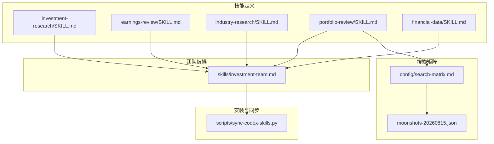
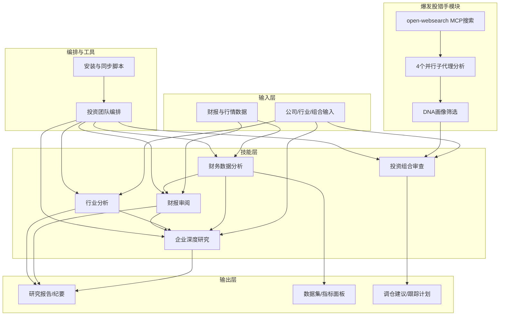
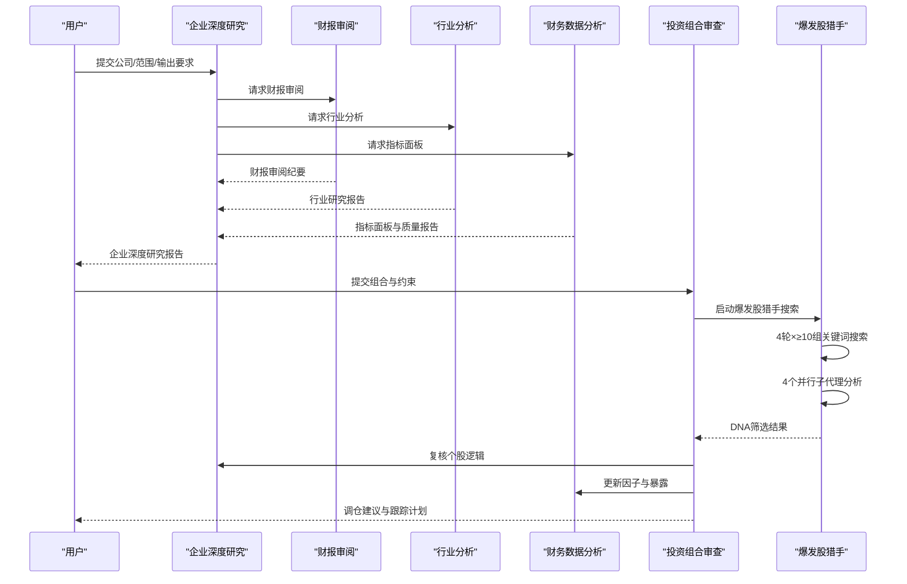
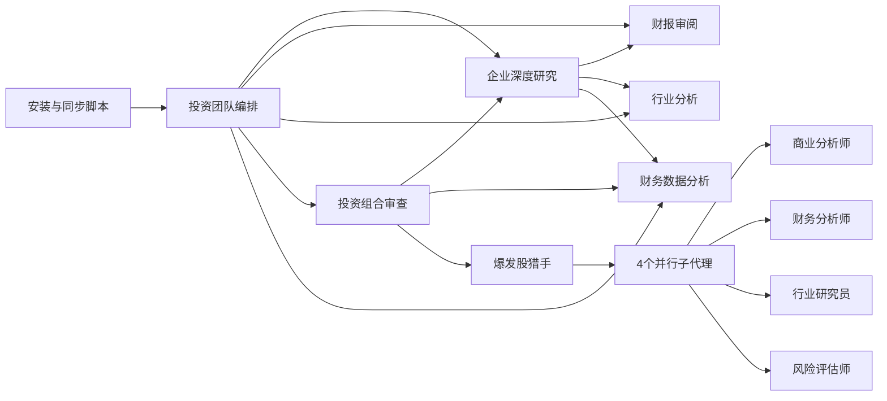

# 核心投资研究技能

<cite>
**本文引用的文件**   
- [codex-skills/investment-research/SKILL.md](file://codex-skills/investment-research/SKILL.md)
- [codex-skills/earnings-review/SKILL.md](file://codex-skills/earnings-review/SKILL.md)
- [codex-skills/industry-research/SKILL.md](file://codex-skills/industry-research/SKILL.md)
- [codex-skills/portfolio-review/SKILL.md](file://codex-skills/portfolio-review/SKILL.md)
- [codex-skills/financial-data/SKILL.md](file://codex-skills/financial-data/SKILL.md)
- [skills/investment-team.md](file://skills/investment-team.md)
- [scripts/sync-codex-skills.py](file://scripts/sync-codex-skills.py)
- [config/search-matrix.md](file://config/search-matrix.md)
- [data/local/moonshots-20260815.json](file://data/local/moonshots-20260815.json)
</cite>

## 更新摘要
**变更内容**   
- 新增爆发股猎手模块（来源H）的完整功能说明与执行规范
- 更新投资组合审查技能中的4个并行子代理分析机制
- 强化open-websearch MCP搜索要求（≥100次搜索，每只持仓4个独立子代理）
- 新增爆发股DNA画像筛选标准与扫描矩阵
- 更新v5.0重构后的工作流架构与协作模式

## 目录
1. [简介](#简介)
2. [项目结构](#项目结构)
3. [核心组件](#核心组件)
4. [架构总览](#架构总览)
5. [详细组件分析](#详细组件分析)
6. [依赖分析](#依赖分析)
7. [性能考虑](#性能考虑)
8. [故障排查指南](#故障排查指南)
9. [结论](#结论)
10. [附录](#附录)

## 简介
本文件面向投资研究与资产管理从业者，系统化梳理并文档化仓库中的"核心投资研究技能"，覆盖企业深度研究、财报审阅、行业分析、投资组合审查与财务数据分析五大关键能力。**v5.0重构后新增爆发股猎手模块**，通过open-websearch MCP执行大规模搜索和4个独立子代理并行分析，显著提升早期爆发标的的发现能力。文档聚焦每个技能的功能特性、参数说明、输入输出格式、使用示例与最佳实践，并提供技能协作模式与组合工作流，帮助读者快速落地高质量投研流程。

## 项目结构
仓库采用"技能即文档"的组织方式：每个技能以独立目录存放 SKILL.md 定义，配套 prompts 与脚本用于安装与同步；reports 目录沉淀大量实战案例，tools 提供数据与回测工具，scripts 提供安装与同步脚本。

**图表来源**
- [codex-skills/investment-research/SKILL.md](file://codex-skills/investment-research/SKILL.md)
- [codex-skills/earnings-review/SKILL.md](file://codex-skills/earnings-review/SKILL.md)
- [codex-skills/industry-research/SKILL.md](file://codex-skills/industry-research/SKILL.md)
- [codex-skills/portfolio-review/SKILL.md](file://codex-skills/portfolio-review/SKILL.md)
- [codex-skills/financial-data/SKILL.md](file://codex-skills/financial-data/SKILL.md)
- [skills/investment-team.md](file://skills/investment-team.md)
- [scripts/sync-codex-skills.py](file://scripts/sync-codex-skills.py)
- [config/search-matrix.md](file://config/search-matrix.md)
- [data/local/moonshots-20260815.json](file://data/local/moonshots-20260815.json)

章节来源
- [codex-skills/investment-research/SKILL.md](file://codex-skills/investment-research/SKILL.md)
- [codex-skills/earnings-review/SKILL.md](file://codex-skills/earnings-review/SKILL.md)
- [codex-skills/industry-research/SKILL.md](file://codex-skills/industry-research/SKILL.md)
- [codex-skills/portfolio-review/SKILL.md](file://codex-skills/portfolio-review/SKILL.md)
- [codex-skills/financial-data/SKILL.md](file://codex-skills/financial-data/SKILL.md)
- [skills/investment-team.md](file://skills/investment-team.md)
- [scripts/sync-codex-skills.py](file://scripts/sync-codex-skills.py)
- [config/search-matrix.md](file://config/search-matrix.md)
- [data/local/moonshots-20260815.json](file://data/local/moonshots-20260815.json)

## 核心组件
本节对五个核心技能逐一展开，包含功能要点、典型参数、输入输出约定、使用示例与最佳实践。为避免泄露具体实现细节，本节仅给出结构化说明与路径引用，便于读者在对应文件中查阅完整规范。

### 企业深度研究（investment-research）
- 功能要点
  - 围绕公司商业模式、护城河、管理层、竞争格局、风险与估值进行系统性研究，形成可归档的研究报告。
- 典型参数
  - 公司名称/代码、研究范围（业务/财务/治理/风险/估值）、时间窗口、对比公司列表、报告风格与受众。
- 输入
  - 公司标识、可选历史研究摘要、关键假设清单、关注问题清单。
- 输出
  - 结构化研究报告（含执行摘要、业务拆解、财务质量、估值与安全边际、风险与情景、结论与建议）。
- 使用示例
  - 输入目标公司与关注点，指定输出结构与深度，生成初稿后进入评审与迭代。
- 最佳实践
  - 先明确研究边界与关键问题，再调用相关子技能（如财报审阅、行业分析、财务数据），最后由团队编排整合。

章节来源
- [codex-skills/investment-research/SKILL.md](file://codex-skills/investment-research/SKILL.md)

### 财报审阅（earnings-review）
- 功能要点
  - 针对单期或连续多期财报进行质量评估、异常识别、驱动因素拆解与前瞻指引解读。
- 典型参数
  - 财报期间、报表类型（利润表/资产负债表/现金流量表/附注）、重点科目、同业基准、审计意见与风险提示。
- 输入
  - 财报原文或结构化数据、可比公司指标、分析师预期与一致预期差异。
- 输出
  - 财报审阅纪要（关键指标趋势、异常项核查、盈利质量、现金流健康度、前瞻指引评估）。
- 使用示例
  - 输入最新季报与上季对比，要求输出异常项与可能原因，并给出后续验证清单。
- 最佳实践
  - 结合财务数据技能拉取历史序列，配合行业研究理解周期位置，避免孤立判断。

章节来源
- [codex-skills/earnings-review/SKILL.md](file://codex-skills/earnings-review/SKILL.md)

### 行业分析（industry-research）
- 功能要点
  - 构建行业全景图，识别产业链关键环节、竞争格局、技术路线与政策影响，定位高价值节点。
- 典型参数
  - 行业范围、细分赛道、地理区域、时间跨度、关键变量（价格/产能/渗透率/监管）。
- 输入
  - 行业关键词、上下游公司清单、宏观与政策背景、竞品动态。
- 输出
  - 行业研究报告（市场规模与增速、价值链与利润分配、竞争态势、进入壁垒、未来演进路径）。
- 使用示例
  - 给定AI算力基础设施，要求输出三层结构（芯片/光模块/服务器）及代表公司对比。
- 最佳实践
  - 用漏斗式筛选将宽行业收敛到少数高确定性标的，再与企业深度研究衔接。

章节来源
- [codex-skills/industry-research/SKILL.md](file://codex-skills/industry-research/SKILL.md)

### 投资组合审查（portfolio-review）
- 功能要点
  - 对现有持仓进行归因分析、风险暴露检视、集中度与相关性评估，提出调仓建议与跟踪计划。
- 典型参数
  - 组合清单、权重、基准指数、风险预算、回撤容忍度、流动性约束、税务与交易成本假设。
- 输入
  - 持仓明细、历史收益序列、因子暴露、行业/风格分布、事件日历。
- 输出
  - 组合体检报告（收益归因、风险敞口、集中度与相关性、压力测试、调仓建议与执行节奏）。
- 使用示例
  - 输入当前组合与基准，要求输出超额收益来源与潜在尾部风险，并给出减仓/换仓优先级。
- 最佳实践
  - 与财务数据分析技能联动，确保因子与基本面信号一致；与企业深度研究闭环，验证逻辑是否漂移。

章节来源
- [codex-skills/portfolio-review/SKILL.md](file://codex-skills/portfolio-review/SKILL.md)

### 财务数据分析（financial-data）
- 功能要点
  - 提供标准化财务指标计算、时序对齐、缺失值处理、异常检测与可视化准备，支撑其他技能的数据需求。
- 典型参数
  - 公司/行业范围、指标集合、频率（年/季/月）、口径调整（非经常性损益、会计变更）、样本区间。
- 输入
  - 原始财务报表或接口数据、公司元数据（上市地、会计准则）、清洗规则。
- 输出
  - 清洗后的面板数据集、指标字典、质量报告（覆盖率、异常标记、对齐校验）。
- 使用示例
  - 批量拉取候选池公司的ROIC、FCF、净负债率等指标，输出统一格式供筛选与建模使用。
- 最佳实践
  - 建立指标口径与版本控制，保证跨技能复用一致性；对异常值进行可追溯标注。

章节来源
- [codex-skills/financial-data/SKILL.md](file://codex-skills/financial-data/SKILL.md)

## 架构总览
以下图示展示五大核心技能与团队编排、安装同步的关系，以及常见数据流向。**v5.0重构后新增爆发股猎手模块和4个并行子代理分析机制**。

**图表来源**
- [codex-skills/investment-research/SKILL.md](file://codex-skills/investment-research/SKILL.md)
- [codex-skills/earnings-review/SKILL.md](file://codex-skills/earnings-review/SKILL.md)
- [codex-skills/industry-research/SKILL.md](file://codex-skills/industry-research/SKILL.md)
- [codex-skills/portfolio-review/SKILL.md](file://codex-skills/portfolio-review/SKILL.md)
- [codex-skills/financial-data/SKILL.md](file://codex-skills/financial-data/SKILL.md)
- [skills/investment-team.md](file://skills/investment-team.md)
- [scripts/sync-codex-skills.py](file://scripts/sync-codex-skills.py)
- [config/search-matrix.md](file://config/search-matrix.md)

## 详细组件分析

### 企业深度研究（investment-research）
- 职责边界
  - 作为"主研究器"，聚合财报审阅、行业分析与财务数据结果，形成最终投资决策材料。
- 关键流程
  - 明确研究问题 → 收集数据与证据 → 多维分析（商业/财务/治理/风险/估值）→ 输出报告与行动建议。
- 与其他技能的协作
  - 调用财报审阅获取盈利质量与现金流健康度；调用行业分析理解竞争与技术演进；调用财务数据分析完成指标对齐与异常检测。
- 使用示例
  - 输入目标公司与研究范围，指定输出模板与深度，自动触发子技能并行作业，汇总为终稿。
- 最佳实践
  - 设置"反证清单"与"关键假设检验"，避免确认偏误；对估值方法做敏感性分析。

章节来源
- [codex-skills/investment-research/SKILL.md](file://codex-skills/investment-research/SKILL.md)

### 财报审阅（earnings-review）
- 职责边界
  - 聚焦单期/多期财报的质量与变化，识别异常与驱动因素，为深度研究提供事实基础。
- 关键流程
  - 数据接入与对齐 → 指标计算与同比环比 → 异常检测与解释 → 前瞻指引评估。
- 与其他技能的协作
  - 依赖财务数据分析提供标准化指标；为投资组合审查提供个股层面的质量信号。
- 使用示例
  - 输入最近两期财报与一致预期，输出超预期/不及预期项、可能原因与后续验证步骤。
- 最佳实践
  - 区分一次性事项与结构性变化；结合附注与管理层讨论交叉验证。

章节来源
- [codex-skills/earnings-review/SKILL.md](file://codex-skills/earnings-review/SKILL.md)

### 行业分析（industry-research）
- 职责边界
  - 从产业视角识别机会与风险，为选股与组合配置提供方向性依据。
- 关键流程
  - 界定行业边界 → 绘制产业链与价值链 → 量化规模与增速 → 评估竞争与壁垒 → 输出策略建议。
- 与其他技能的协作
  - 为企业深度研究提供赛道选择与公司对标；为投资组合审查提供行业暴露与轮动参考。
- 使用示例
  - 输入行业关键词与时间窗口，输出产业链图谱、关键变量与代表性公司矩阵。
- 最佳实践
  - 用"漏斗法"逐步收敛：大行业→细分赛道→核心环节→头部公司。

章节来源
- [codex-skills/industry-research/SKILL.md](file://codex-skills/industry-research/SKILL.md)

### 投资组合审查（portfolio-review）
- 职责边界
  - 对组合进行体检与归因，识别风险集中与逻辑漂移，提出可执行的调仓方案。
- 关键流程
  - 组合数据接入 → 收益归因与风险暴露 → 集中度与相关性分析 → 压力测试与情景分析 → 调仓建议。
- 与其他技能的协作
  - 基于企业深度研究与财报审阅更新个股逻辑；借助财务数据分析维护因子与指标一致性。
- 使用示例
  - 输入组合与基准，输出超额来源、尾部风险与调仓优先级，附带执行约束与跟踪指标。
- 最佳实践
  - 将"研究结论—组合暴露—交易执行"打通，形成闭环管理。

章节来源
- [codex-skills/portfolio-review/SKILL.md](file://codex-skills/portfolio-review/SKILL.md)

### 财务数据分析（financial-data）
- 职责边界
  - 提供高质量、可复用的财务数据与指标面板，保障其他技能的分析可靠性。
- 关键流程
  - 数据源接入 → 清洗与对齐 → 指标计算与校验 → 质量报告与版本管理。
- 与其他技能的协作
  - 为财报审阅、企业深度研究与投资组合审查提供统一数据底座。
- 使用示例
  - 批量生成候选池的面板数据，输出指标字典与缺失/异常标记，供下游直接消费。
- 最佳实践
  - 建立指标口径手册与变更记录；对重大会计变更进行回溯调整。

章节来源
- [codex-skills/financial-data/SKILL.md](file://codex-skills/financial-data/SKILL.md)

### 爆发股猎手模块（v5.0新增）
- 功能要点
  - **来源H必选模块**：通过open-websearch MCP执行全网覆盖式搜索，寻找"NBIS@$70"级早期爆发股，传统价值筛选器无法发现三位数增速股。
- 核心机制
  - **搜索要求**：使用open-websearch MCP（`CallMcpTool server_name="open-websearch" tool_name="search"`），默认duckduckgo引擎，每轮搜索≥10组不同关键词，每组返回结果逐条审查。
  - **搜索总量**：合计≥100次搜索（GICS 25组×2视角≥50次 + AI 17赛道×2视角≥34次 + 非AI主题≥8次 + 爆发股猎手≥20次）。
  - **4轮搜索矩阵**：
    - 第1轮·增速发现：按收入增速横切全市场
    - 第2轮·拐点发现：按盈利拐点+积压筛选
    - 第3轮·赛道纯正：按赛道纯正度筛选
    - 第4轮·被忽视发现：按覆盖不足/被忽视筛选
- DNA画像筛选标准（6条全满足才入池）
  1. **收入增速≥100% YoY**（最近一季，非预测）
  2. **盈利拐点**：EBITDA/净利润刚转正或即将转正（≤2个季度）
  3. **市值$3B-$50B**（太小=流动性风险；太大=弹性不足）
  4. **赛道纯正**：主业收入≥70%来自单一高增长主题（AI Cloud/AI网络/HBM/光互连/机器人等）
  5. **合同/积压可见性**：backlog≥年收入1.5x 或 大额合同公告（>$1B）
  6. **卖方覆盖不足**：分析师≤15人 或 最近3个月新增覆盖≤3家
- 4个并行子代理分析机制
  - **商业分析师**：商业模式、竞争优势、增长驱动力
  - **财务分析师**：财务质量、估值水平、现金流状况
  - **行业研究员**：行业地位、竞争格局、技术趋势
  - **风险评估师**：投资风险、管理层质量、监管环境
- 执行流程
  1. 4轮搜索汇总所有出现的ticker（去重）
  2. 对每只候选用Yahoo v8 API获取现价/市值，过滤市值不在$3-50B区间的
  3. 对剩余候选逐一验证6条DNA（搜索"{ticker} revenue growth Q2 2026"确认增速）
  4. 6条全满足 → 写入candidates.csv（source列标注"H-爆发股"）
  5. 从H来源候选中选Top 3-5 → 进入双重验证（/investment-checklist + /investment-team）
- 输出要求
  - 报告末尾输出"爆发股猎手扫描矩阵"——4轮×搜索词×结果数×入池数
  - 标注哪些ticker通过了6条DNA、哪些被哪条拦截
  - 必须展示"4轮搜索词原文→每轮返回结果数→入池ticker清单→6条DNA验证表"

**章节来源**
- [config/search-matrix.md:124-146](file://config/search-matrix.md#L124-L146)
- [codex-skills/portfolio-rebalance/SKILL.md:160-200](file://codex-skills/portfolio-rebalance/SKILL.md#L160-L200)

### 投资团队编排（4个并行Agent）
- 职责边界
  - 协调4个专业角色同时进行分析，提升研究效率与全面性。
- 关键流程
  - 任务分解 → 并行启动Agent → 实时进度跟踪 → 报告汇总 → 最终决策。
- 4个并行Agent配置
  - `business-analyst`：商业分析师，专注商业模式与竞争优势
  - `financial-analyst`：财务分析师，专注财务质量与估值
  - `industry-researcher`：行业研究员，专注行业格局与技术趋势
  - `risk-assessor`：风险评估师，专注投资风险与管理层质量
- 执行要求
  - **必须在同一条消息中并行调用**4个Agent
  - 每个Agent通过SendMessage汇报，不是文件协作
  - 等待全部4份报告到齐后进行汇总
- 输出结构
  - 一句话结论、四维评分总表、核心数据速览、各维度分析摘要、投资论点（Bull vs Bear）、巴菲特买入前Checklist、最终投资建议、总结段落

**章节来源**
- [skills/investment-team.md:113-159](file://skills/investment-team.md#L113-L159)
- [skills/investment-team.md:160-234](file://skills/investment-team.md#L160-L234)

### 协作与工作流示例
- 端到端工作流（企业深度研究为主）
  - 启动企业深度研究 → 并行调用财报审阅与行业分析 → 通过财务数据分析补齐指标 → 汇总输出研究报告 → 进入投资组合审查评估配置影响。
- 组合再平衡工作流（v5.0增强版）
  - 投资组合审查发现风险集中 → 调用爆发股猎手模块进行全网扫描 → 4个并行子代理分析候选标的 → 企业深度研究与财报审阅复核逻辑 → 财务数据分析更新因子暴露 → 输出调仓清单与执行计划。

**图表来源**
- [codex-skills/investment-research/SKILL.md](file://codex-skills/investment-research/SKILL.md)
- [codex-skills/earnings-review/SKILL.md](file://codex-skills/earnings-review/SKILL.md)
- [codex-skills/industry-research/SKILL.md](file://codex-skills/industry-research/SKILL.md)
- [codex-skills/portfolio-review/SKILL.md](file://codex-skills/portfolio-review/SKILL.md)
- [codex-skills/financial-data/SKILL.md](file://codex-skills/financial-data/SKILL.md)
- [skills/investment-team.md](file://skills/investment-team.md)
- [config/search-matrix.md](file://config/search-matrix.md)

## 依赖分析
- 内部依赖
  - 企业深度研究依赖财报审阅、行业分析与财务数据分析的输出。
  - 投资组合审查依赖企业深度研究与财务数据分析的结果进行归因与风控。
  - **爆发股猎手模块依赖open-websearch MCP和4个并行子代理**。
  - 团队编排文件协调各技能顺序与输入输出契约。
- 外部依赖
  - 安装与同步脚本负责技能定义的部署与环境初始化。
  - Yahoo Finance API用于行情数据获取。
- 耦合与内聚
  - 技能间通过明确的输入输出契约解耦，提升内聚性与可替换性。
- 循环依赖
  - 通过"主研究器+数据底座"的模式避免循环依赖。

**图表来源**
- [codex-skills/investment-research/SKILL.md](file://codex-skills/investment-research/SKILL.md)
- [codex-skills/earnings-review/SKILL.md](file://codex-skills/earnings-review/SKILL.md)
- [codex-skills/industry-research/SKILL.md](file://codex-skills/industry-research/SKILL.md)
- [codex-skills/portfolio-review/SKILL.md](file://codex-skills/portfolio-review/SKILL.md)
- [codex-skills/financial-data/SKILL.md](file://codex-skills/financial-data/SKILL.md)
- [skills/investment-team.md](file://skills/investment-team.md)
- [scripts/sync-codex-skills.py](file://scripts/sync-codex-skills.py)
- [config/search-matrix.md](file://config/search-matrix.md)

章节来源
- [skills/investment-team.md](file://skills/investment-team.md)
- [scripts/sync-codex-skills.py](file://scripts/sync-codex-skills.py)
- [config/search-matrix.md](file://config/search-matrix.md)

## 性能考虑
- 数据层面
  - 优先使用增量更新与缓存机制，减少重复计算与I/O开销。
  - 对大规模面板数据进行分片与并行处理，提高吞吐。
  - **爆发股猎手模块需优化搜索API调用频率，避免配额限制**。
- 模型与推理
  - 合理拆分任务粒度，避免单次提示过长导致延迟上升。
  - 对高频指标采用批处理与异步调用，降低端到端时延。
  - **4个并行子代理需合理分配资源，避免并发过高导致超时**。
- 存储与版本
  - 对中间结果与最终报告进行版本化管理，支持快速回溯与对比。
  - **搜索日志（search-log.txt）需持续追加，确保可追溯性**。
- 资源规划
  - 根据并发任务数与数据规模预估计算与内存需求，预留缓冲。
  - **v5.0重构后搜索量增加至≥100次，需相应扩展API配额**。

[本节为通用指导，不直接分析具体文件]

## 故障排查指南
- 常见问题
  - 数据缺失或口径不一致：检查财务数据分析的质量报告与指标字典，确认会计变更与回溯调整。
  - 输出不完整或超时：拆分任务、增加重试与断点续传；检查并发限制与资源配额。
  - **搜索结果不足**：检查open-websearch MCP连接状态，确认搜索词多样性，避免重复查询。
  - **子代理分析失败**：检查Agent配置、网络连接、API配额，必要时降级为串行执行。
  - 结果不可复现：核对输入版本、参数快照与随机种子；记录环境依赖。
- 定位步骤
  - 从最终输出反向追踪至最近一次数据更新与模型调用；查看错误日志与中间产物。
  - 使用最小可复现用例隔离问题，逐步恢复上游依赖。
  - **检查search-log.txt确认搜索执行情况，验证DNA筛选逻辑**。
- 恢复策略
  - 启用降级模式（如仅使用已缓存数据）；必要时回滚到上一稳定版本。
  - **对于搜索配额耗尽，切换到备用搜索引擎（Brave/GNews）**。

[本节为通用指导，不直接分析具体文件]

## 结论
五大核心技能构成完整的投资研究闭环：**v5.0重构后新增的爆发股猎手模块显著提升了早期爆发标的的发现能力**。财务数据分析提供可靠数据底座，财报审阅与企业深度研究夯实个股认知，行业分析把握产业趋势，投资组合审查实现策略落地与风险控制。通过清晰的输入输出契约、4个并行子代理分析和open-websearch MCP的大规模搜索能力，可实现高效、可复现、可扩展的研究流水线。

[本节为总结性内容，不直接分析具体文件]

## 附录
- 术语表
  - 安全边际：内在价值与市场价格之间的折扣空间。
  - 归因分析：将组合收益分解为资产配置、个股选择与交互效应等来源。
  - 面板数据：横截面与时间维度交织的结构化数据集。
  - **爆发股猎手**：通过大规模搜索和DNA画像筛选发现早期高增长标的的新模块。
  - **4个并行子代理**：商业分析师、财务分析师、行业研究员、风险评估师的专业化分析团队。
- 参考路径
  - 企业深度研究：[codex-skills/investment-research/SKILL.md](file://codex-skills/investment-research/SKILL.md)
  - 财报审阅：[codex-skills/earnings-review/SKILL.md](file://codex-skills/earnings-review/SKILL.md)
  - 行业分析：[codex-skills/industry-research/SKILL.md](file://codex-skills/industry-research/SKILL.md)
  - 投资组合审查：[codex-skills/portfolio-review/SKILL.md](file://codex-skills/portfolio-review/SKILL.md)
  - 财务数据分析：[codex-skills/financial-data/SKILL.md](file://codex-skills/financial-data/SKILL.md)
  - 团队编排：[skills/investment-team.md](file://skills/investment-team.md)
  - 安装与同步：[scripts/sync-codex-skills.py](file://scripts/sync-codex-skills.py)
  - **搜索矩阵**：[config/search-matrix.md](file://config/search-matrix.md)
  - **候选数据**：[data/local/moonshots-20260815.json](file://data/local/moonshots-20260815.json)