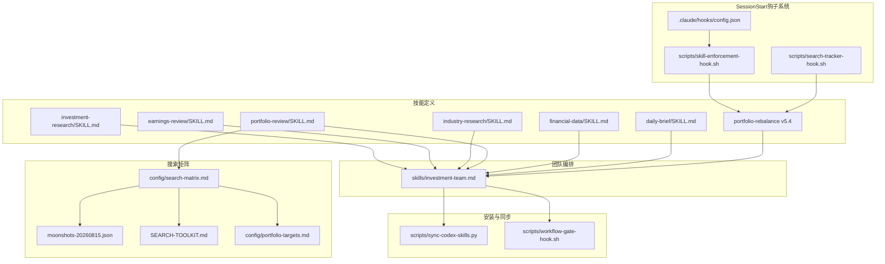
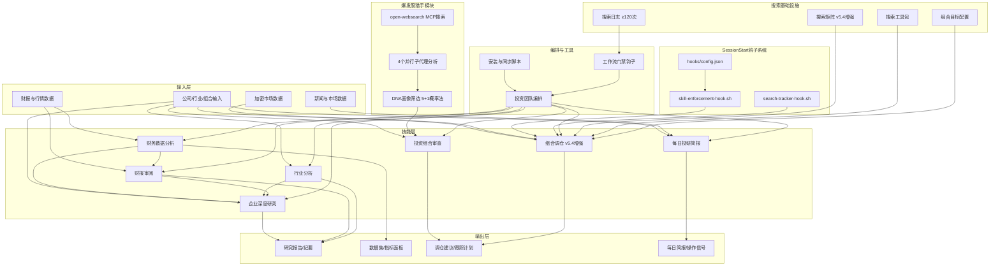
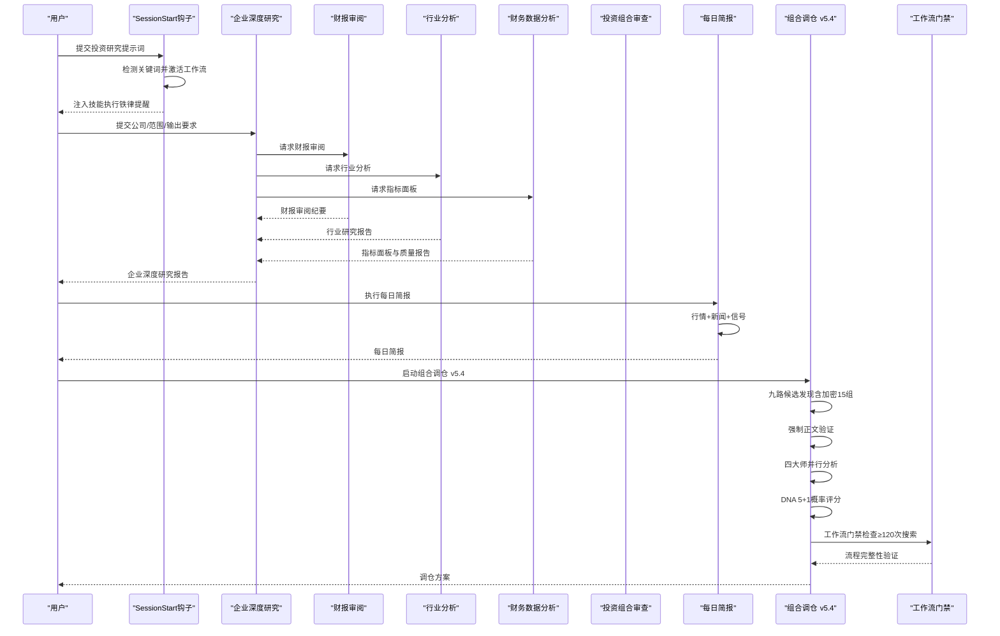
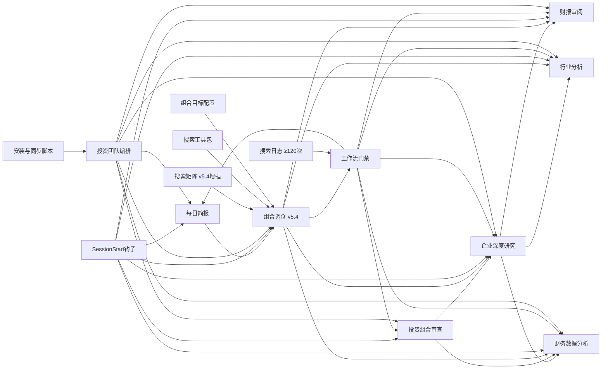

# 核心投资研究技能

<cite>
**本文引用的文件**   
- [codex-skills/investment-research/SKILL.md](file://codex-skills/investment-research/SKILL.md)
- [codex-skills/earnings-review/SKILL.md](file://codex-skills/earnings-review/SKILL.md)
- [codex-skills/industry-research/SKILL.md](file://codex-skills/industry-research/SKILL.md)
- [codex-skills/portfolio-review/SKILL.md](file://codex-skills/portfolio-review/SKILL.md)
- [codex-skills/financial-data/SKILL.md](file://codex-skills/financial-data/SKILL.md)
- [codex-skills/daily-brief/SKILL.md](file://codex-skills/daily-brief/SKILL.md)
- [codex-skills/portfolio-rebalance/SKILL.md](file://codex-skills/portfolio-rebalance/SKILL.md)
- [skills/investment-team.md](file://skills/investment-team.md)
- [scripts/sync-codex-skills.py](file://scripts/sync-codex-skills.py)
- [config/search-matrix.md](file://config/search-matrix.md)
- [data/local/moonshots-20260815.json](file://data/local/moonshots-20260815.json)
- [scripts/workflow-gate-hook.sh](file://scripts/workflow-gate-hook.sh)
- [.claude/.workflow/SEARCH-TOOLKIT.md](file://.claude/.workflow/SEARCH-TOOLKIT.md)
- [config/portfolio-targets.md](file://config/portfolio-targets.md)
- [.claude/hooks/config.json](file://.claude/hooks/config.json)
- [scripts/skill-enforcement-hook.sh](file://scripts/skill-enforcement-hook.sh)
- [scripts/search-tracker-hook.sh](file://scripts/search-tracker-hook.sh)
- [reports/portfolio-action-20260814.md](file://reports/portfolio-action-20260814.md)
</cite>

## 更新摘要
**变更内容**   
- **组合调仓技能重大增强（v5.4）**：引入SessionStart钩子自动化验证基础设施，通过质量合约强制防退化措施
- **工作流门禁机制升级**：从静态检查升级为SessionStart自动触发，确保每轮工作流都强制执行四大师并行协议
- **搜索矩阵加密扩展**：Source I加密修复搜索矩阵从5组扩展到15组关键词，全面覆盖加密资产生态
- **自动化质量合约**：通过hook系统在工作流启动时自动注入技能执行铁律提醒和验证要求
- **搜索追踪基础设施**：新增PostToolUse钩子自动记录搜索工具使用情况和搜索词日志
- **防退化措施强化**：强制4-Agent验证、质量一致性要求、违规判定标准等防退化条款

## 目录
1. [简介](#简介)
2. [项目结构](#项目结构)
3. [核心组件](#核心组件)
4. [架构总览](#架构总览)
5. [详细组件分析](#详细组件分析)
6. [依赖分析](#依赖分析)
7. [性能考虑](#性能考虑)
8. [故障排查指南](#故障排查指南)
9. [结论](#结论)
10. [附录](#附录)

## 简介
本文件面向投资研究与资产管理从业者，系统化梳理并文档化仓库中的"核心投资研究技能"，覆盖企业深度研究、财报审阅、行业分析、投资组合审查与财务数据分析五大关键能力。**v5.4版本通过SessionStart钩子自动化验证基础设施和组合调仓技能的防退化增强**，显著提升了研究数据的准确性和可靠性。特别是通过强制性的四大师并行执行协议和多维度验证机制，确保了高质量的投资决策支持。文档聚焦每个技能的功能特性、参数说明、输入输出格式、使用示例与最佳实践，并提供技能协作模式与组合工作流，帮助读者快速落地高质量投研流程。

## 项目结构
仓库采用"技能即文档"的组织方式：每个技能以独立目录存放 SKILL.md 定义，配套 prompts 与脚本用于安装与同步；reports 目录沉淀大量实战案例，tools 提供数据与回测工具，scripts 提供安装与同步脚本。**v5.4版本新增了SessionStart钩子和自动化验证基础设施**。

**图表来源**
- [codex-skills/investment-research/SKILL.md](file://codex-skills/investment-research/SKILL.md)
- [codex-skills/earnings-review/SKILL.md](file://codex-skills/earnings-review/SKILL.md)
- [codex-skills/industry-research/SKILL.md](file://codex-skills/industry-research/SKILL.md)
- [codex-skills/portfolio-review/SKILL.md](file://codex-skills/portfolio-review/SKILL.md)
- [codex-skills/financial-data/SKILL.md](file://codex-skills/financial-data/SKILL.md)
- [codex-skills/daily-brief/SKILL.md](file://codex-skills/daily-brief/SKILL.md)
- [codex-skills/portfolio-rebalance/SKILL.md](file://codex-skills/portfolio-rebalance/SKILL.md)
- [skills/investment-team.md](file://skills/investment-team.md)
- [scripts/sync-codex-skills.py](file://scripts/sync-codex-skills.py)
- [scripts/workflow-gate-hook.sh](file://scripts/workflow-gate-hook.sh)
- [scripts/skill-enforcement-hook.sh](file://scripts/skill-enforcement-hook.sh)
- [scripts/search-tracker-hook.sh](file://scripts/search-tracker-hook.sh)
- [.claude/hooks/config.json](file://.claude/hooks/config.json)
- [config/search-matrix.md](file://config/search-matrix.md)
- [data/local/moonshots-20260815.json](file://data/local/moonshots-20260815.json)
- [.claude/.workflow/SEARCH-TOOLKIT.md](file://.claude/.workflow/SEARCH-TOOLKIT.md)
- [config/portfolio-targets.md](file://config/portfolio-targets.md)

章节来源
- [codex-skills/investment-research/SKILL.md](file://codex-skills/investment-research/SKILL.md)
- [codex-skills/earnings-review/SKILL.md](file://codex-skills/earnings-review/SKILL.md)
- [codex-skills/industry-research/SKILL.md](file://codex-skills/industry-research/SKILL.md)
- [codex-skills/portfolio-review/SKILL.md](file://codex-skills/portfolio-review/SKILL.md)
- [codex-skills/financial-data/SKILL.md](file://codex-skills/financial-data/SKILL.md)
- [codex-skills/daily-brief/SKILL.md](file://codex-skills/daily-brief/SKILL.md)
- [codex-skills/portfolio-rebalance/SKILL.md](file://codex-skills/portfolio-rebalance/SKILL.md)
- [skills/investment-team.md](file://skills/investment-team.md)
- [scripts/sync-codex-skills.py](file://scripts/sync-codex-skills.py)
- [scripts/workflow-gate-hook.sh](file://scripts/workflow-gate-hook.sh)
- [scripts/skill-enforcement-hook.sh](file://scripts/skill-enforcement-hook.sh)
- [scripts/search-tracker-hook.sh](file://scripts/search-tracker-hook.sh)
- [.claude/hooks/config.json](file://.claude/hooks/config.json)
- [config/search-matrix.md](file://config/search-matrix.md)
- [data/local/moonshots-20260815.json](file://data/local/moonshots-20260815.json)
- [.claude/.workflow/SEARCH-TOOLKIT.md](file://.claude/.workflow/SEARCH-TOOLKIT.md)
- [config/portfolio-targets.md](file://config/portfolio-targets.md)

## 核心组件
本节对六个核心技能逐一展开，包含功能要点、典型参数、输入输出约定、使用示例与最佳实践。为避免泄露具体实现细节，本节仅给出结构化说明与路径引用，便于读者在对应文件中查阅完整规范。

### 企业深度研究（investment-research）
- 功能要点
  - 围绕公司商业模式、护城河、管理层、竞争格局、风险与估值进行系统性研究，形成可归档的研究报告。
- 典型参数
  - 公司名称/代码、研究范围（业务/财务/治理/风险/估值）、时间窗口、对比公司列表、报告风格与受众。
- 输入
  - 公司标识、可选历史研究摘要、关键假设清单、关注问题清单。
- 输出
  - 结构化研究报告（含执行摘要、业务拆解、财务质量、估值与安全边际、风险与情景、结论与建议）。
- 使用示例
  - 输入目标公司与关注点，指定输出结构与深度，生成初稿后进入评审与迭代。
- 最佳实践
  - 先明确研究边界与关键问题，再调用相关子技能（如财报审阅、行业分析、财务数据），最后由团队编排整合。

章节来源
- [codex-skills/investment-research/SKILL.md](file://codex-skills/investment-research/SKILL.md)

### 财报审阅（earnings-review）
- 功能要点
  - 针对单期或连续多期财报进行质量评估、异常识别、驱动因素拆解与前瞻指引解读。
- 典型参数
  - 财报期间、报表类型（利润表/资产负债表/现金流量表/附注）、重点科目、同业基准、审计意见与风险提示。
- 输入
  - 财报原文或结构化数据、可比公司指标、分析师预期与一致预期差异。
- 输出
  - 财报审阅纪要（关键指标趋势、异常项核查、盈利质量、现金流健康度、前瞻指引评估）。
- 使用示例
  - 输入最新季报与上季对比，要求输出异常项与可能原因，并给出后续验证清单。
- 最佳实践
  - 结合财务数据技能拉取历史序列，配合行业研究理解周期位置，避免孤立判断。

章节来源
- [codex-skills/earnings-review/SKILL.md](file://codex-skills/earnings-review/SKILL.md)

### 行业分析（industry-research）
- 功能要点
  - 构建行业全景图，识别产业链关键环节、竞争格局、技术路线与政策影响，定位高价值节点。
- 典型参数
  - 行业范围、细分赛道、地理区域、时间跨度、关键变量（价格/产能/渗透率/监管）。
- 输入
  - 行业关键词、上下游公司清单、宏观与政策背景、竞品动态。
- 输出
  - 行业研究报告（市场规模与增速、价值链与利润分配、竞争态势、进入壁垒、未来演进路径）。
- 使用示例
  - 给定AI算力基础设施，要求输出三层结构（芯片/光模块/服务器）及代表公司对比。
- 最佳实践
  - 用漏斗式筛选将宽行业收敛到少数高确定性标的，再与企业深度研究衔接。

章节来源
- [codex-skills/industry-research/SKILL.md](file://codex-skills/industry-research/SKILL.md)

### 投资组合审查（portfolio-review）
- 功能要点
  - 对现有持仓进行归因分析、风险暴露检视、集中度与相关性评估，提出调仓建议与跟踪计划。
- 典型参数
  - 组合清单、权重、基准指数、风险预算、回撤容忍度、流动性约束、税务与交易成本假设。
- 输入
  - 持仓明细、历史收益序列、因子暴露、行业/风格分布、事件日历。
- 输出
  - 组合体检报告（收益归因、风险敞口、集中度与相关性、压力测试、调仓建议与执行节奏）。
- 使用示例
  - 输入当前组合与基准，要求输出超额收益来源与潜在尾部风险，并给出减仓/换仓优先级。
- 最佳实践
  - 与财务数据分析技能联动，确保因子与基本面信号一致；与企业深度研究闭环，验证逻辑是否漂移。

章节来源
- [codex-skills/portfolio-review/SKILL.md](file://codex-skills/portfolio-review/SKILL.md)

### 财务数据分析（financial-data）
- 功能要点
  - 提供标准化财务指标计算、时序对齐、缺失值处理、异常检测与可视化准备，支撑其他技能的数据需求。
- 典型参数
  - 公司/行业范围、指标集合、频率（年/季/月）、口径调整（非经常性损益、会计变更）、样本区间。
- 输入
  - 原始财务报表或接口数据、公司元数据（上市地、会计准则）、清洗规则。
- 输出
  - 清洗后的面板数据集、指标字典、质量报告（覆盖率、异常标记、对齐校验）。
- 使用示例
  - 批量拉取候选池公司的ROIC、FCF、净负债率等指标，输出统一格式供筛选与建模使用。
- 最佳实践
  - 建立指标口径与版本控制，保证跨技能复用一致性；对异常值进行可追溯标注。

章节来源
- [codex-skills/financial-data/SKILL.md](file://codex-skills/financial-data/SKILL.md)

### 每日投研简报（daily-brief）
- 功能要点
  - 执行每日投研工作流，涵盖行情监控、新闻脉搏、组合健康检查与操作信号生成。
- 典型参数
  - 持仓清单、关注股票、市场范围、时间窗口、触发阈值。
- 输入
  - 投资组合信息、市场数据、新闻源、催化剂日历。
- 输出
  - 每日简报（组合快照、新闻摘要、异动信号、操作建议、温度判定）。
- 使用示例
  - 自动读取持仓文件，并行获取行情与新闻，生成结构化日报并标注关键信号。
- 最佳实践
  - 严格执行零复用铁律，每次执行都重新获取最新数据；重点关注延时交易异动和催化剂到期。

章节来源
- [codex-skills/daily-brief/SKILL.md](file://codex-skills/daily-brief/SKILL.md)

### 组合调仓（portfolio-rebalance）- v5.4重大增强版
- 功能要点
  - 全流程调仓研究与操作信号生成，支持全量、轻量与子集三种模式。**v5.4版本进行了重大增强，引入了SessionStart钩子自动化验证基础设施**。
- 典型参数
  - 调仓模式（full/lite/subset）、目标分布、风险约束、时间窗口。
- 输入
  - 当前持仓、目标配置、市场环境、候选标的池。
- 输出
  - 调仓方案（行业分布对比、执行清单、风险管理、预期回报）。
- 使用示例
  - 启动全量模式，执行九路候选发现、双重验证冒泡排序，输出最终调仓建议。
- 最佳实践
  - 严格遵守搜索正文获取铁律，确保所有关键数据都有正文验证；严格执行四大师并行分析规范。

**v5.4重大增强详情**

#### SessionStart钩子自动化验证基础设施
- **自动触发机制**：通过`.claude/hooks/config.json`配置sessionStart钩子，在工作流启动时自动执行技能执行铁律检查
- **质量合约强制**：当用户输入包含投资研究关键词时，自动激活工作流并注入强制性技能调用提醒
- **防退化保障**：确保每只股票都经过4个独立Agent的专业分析，防止质量退化和偷懒模式
- **违规自动阻断**：任何违反技能执行铁律的行为都会被工作流门禁阻止

#### 四大师并行执行协议的防退化措施
- **强制4-Agent验证**：每只股票必须启动4个独立的GeneralPurpose subagent，分别对应商业分析师、财务分析师、行业研究员、风险评估师四个专业视角
- **质量一致性要求**：第10只股票和第1只股票的分析质量必须完全一致，不允许任何退化
- **反退化条款**：如果任何一只股票的Agent数量<4，该股票分析自动无效，必须立即重做
- **违规判定标准**：合并多只股票到同一Agent、将4个视角压缩到1个Agent、用WebSearch直接分析替代4-Agent并行研究等均视为未执行

#### 扩展搜索矩阵加密（Source I增强）
- **从5组扩展到15组关键词**，全面覆盖加密资产生态：
  - 交易所：COIN等加密货币交易平台
  - 稳定币：CRCL等USDC发行商
  - 矿企（估值）：CLSK, HUT, IREN, MARA, RIOT等传统矿企
  - 矿企（转型）：BTBT, HUT, IREN等转向AI/HPC的矿企
  - BTC代理：MSTR等企业比特币持有者
  - 支付/金融科技：PYPL crypto, SQ, HOOD等支付平台
  - DeFi基础设施：去中心化金融协议上市公司
  - RWA代币化：现实世界资产代币化概念
  - 区块链基础设施：公链/基础设施项目
  - 托管/合规：机构级托管服务商
  - ETF/资金流：比特币以太坊ETF受益股
  - 监管催化：监管政策受益标的
  - 硬件/算力：矿机硬件制造商
  - 游戏/NFT：区块链游戏和NFT平台
  - 综合扫描：全行业底部扫描

#### DNA评分标准更新
- **从严格6条件AND门改为5+1概率方法**：
  - 5条硬条件必须全部满足（收入增速≥100%、盈利拐点、市值$3-80B、赛道纯正、合同积压可见）
  - 1条软条件采用概率方法（覆盖错位）：
    - 卖方分析师≤20人覆盖
    - 共识目标价vs合理估值存在>30%低估
    - 最近3个月有≥2次目标价上调但股价未反映
    - 机构持股<40%
  - 灰色判定：若差距<20%仍可入池但仓位减半

#### 搜索频率要求提升
- **最低搜索次数从80次提升至≥120次**：
  - GICS 25组×2视角=50次
  - AI赛道17×2=34次  
  - 非AI主题≥8次
  - 7维补充≥10次
  - 来源H爆发股猎手≥20次
  - 来源I估值修复猎手≥20次（AI修复≥5+加密修复≥15）

#### 标准化源分类
- **统一A-I来源的分类标准**：
  - A: portfolio-latest.md待执行项
  - B: 全市场多维搜索
  - C: /industry-funnel
  - D: /bottleneck-hunter
  - E: 分布缺口反向映射
  - F: 用户历史关注（必选）
  - G: 持仓生态链反向搜索（必选）
  - H: 爆发股猎手（必选）
  - I: 估值修复猎手（必选，v5.2新增）

#### 八类验证检查
- **新增八-category validation checks**确保候选质量：
  - 好生意确认（毛利率>40% + 营业利润率>25% + 正FCF）
  - 估值极端（Fwd PE < 自身5年中位数60%）
  - 恐惧可归因（下跌原因是可证伪叙事）
  - 催化剂可见（未来1-3个月有明确事件）
  - 收入增速验证
  - 盈利拐点确认
  - 市值区间过滤
  - 赛道纯正度检查

#### 增强集中度检查
- **改进concentration checks**防止过度集中风险：
  - 每个类别是否超过top 2？超过则标注🔴并在第五步给出减仓建议
  - 单一非美国家敞口≤15%（硬上限20%）
  - AI总暴露50-75%/cap 80
  - 非AI对冲10-15%/cap 20

章节来源
- [codex-skills/portfolio-rebalance/SKILL.md](file://codex-skills/portfolio-rebalance/SKILL.md)
- [config/search-matrix.md](file://config/search-matrix.md)
- [config/portfolio-targets.md](file://config/portfolio-targets.md)
- [.claude/hooks/config.json](file://.claude/hooks/config.json)
- [scripts/skill-enforcement-hook.sh](file://scripts/skill-enforcement-hook.sh)

## 架构总览
以下图示展示六大核心技能与团队编排、安装同步的关系，以及常见数据流向。**v5.4版本强化了SessionStart钩子自动化验证基础设施和工作流门禁机制**，特别是组合调仓技能的加密资产搜索能力得到大幅增强，同时引入了强制性的四大师并行执行协议来确保分析质量。

**图表来源**
- [codex-skills/investment-research/SKILL.md](file://codex-skills/investment-research/SKILL.md)
- [codex-skills/earnings-review/SKILL.md](file://codex-skills/earnings-review/SKILL.md)
- [codex-skills/industry-research/SKILL.md](file://codex-skills/industry-research/SKILL.md)
- [codex-skills/portfolio-review/SKILL.md](file://codex-skills/portfolio-review/SKILL.md)
- [codex-skills/financial-data/SKILL.md](file://codex-skills/financial-data/SKILL.md)
- [codex-skills/daily-brief/SKILL.md](file://codex-skills/daily-brief/SKILL.md)
- [codex-skills/portfolio-rebalance/SKILL.md](file://codex-skills/portfolio-rebalance/SKILL.md)
- [skills/investment-team.md](file://skills/investment-team.md)
- [scripts/sync-codex-skills.py](file://scripts/sync-codex-skills.py)
- [scripts/workflow-gate-hook.sh](file://scripts/workflow-gate-hook.sh)
- [scripts/skill-enforcement-hook.sh](file://scripts/skill-enforcement-hook.sh)
- [scripts/search-tracker-hook.sh](file://scripts/search-tracker-hook.sh)
- [.claude/hooks/config.json](file://.claude/hooks/config.json)
- [config/search-matrix.md](file://config/search-matrix.md)
- [.claude/.workflow/SEARCH-TOOLKIT.md](file://.claude/.workflow/SEARCH-TOOLKIT.md)
- [config/portfolio-targets.md](file://config/portfolio-targets.md)

## 详细组件分析

### 企业深度研究（investment-research）
- 职责边界
  - 作为"主研究器"，聚合财报审阅、行业分析与财务数据结果，形成最终投资决策材料。
- 关键流程
  - 明确研究问题 → 收集数据与证据 → 多维分析（商业/财务/治理/风险/估值）→ 输出报告与行动建议。
- 与其他技能的协作
  - 调用财报审阅获取盈利质量与现金流健康度；调用行业分析理解竞争与技术演进；调用财务数据分析完成指标对齐与异常检测。
- 使用示例
  - 输入目标公司与研究范围，指定输出模板与深度，自动触发子技能并行作业，汇总为终稿。
- 最佳实践
  - 设置"反证清单"与"关键假设检验"，避免确认偏误；对估值方法做敏感性分析。

章节来源
- [codex-skills/investment-research/SKILL.md](file://codex-skills/investment-research/SKILL.md)

### 财报审阅（earnings-review）
- 职责边界
  - 聚焦单期/多期财报的质量与变化，识别异常与驱动因素，为深度研究提供事实基础。
- 关键流程
  - 数据接入与对齐 → 指标计算与同比环比 → 异常检测与解释 → 前瞻指引评估。
- 与其他技能的协作
  - 依赖财务数据分析提供标准化指标；为投资组合审查提供个股层面的质量信号。
- 使用示例
  - 输入最近两期财报与一致预期，输出超预期/不及预期项、可能原因与后续验证步骤。
- 最佳实践
  - 区分一次性事项与结构性变化；结合附注与管理层讨论交叉验证。

章节来源
- [codex-skills/earnings-review/SKILL.md](file://codex-skills/earnings-review/SKILL.md)

### 行业分析（industry-research）
- 职责边界
  - 从产业视角识别机会与风险，为选股与组合配置提供方向性依据。
- 关键流程
  - 界定行业边界 → 绘制产业链与价值链 → 量化规模与增速 → 评估竞争与壁垒 → 输出策略建议。
- 与其他技能的协作
  - 为企业深度研究提供赛道选择与公司对标；为投资组合审查提供行业暴露与轮动参考。
- 使用示例
  - 输入行业关键词与时间窗口，输出产业链图谱、关键变量与代表性公司矩阵。
- 最佳实践
  - 用"漏斗法"逐步收敛：大行业→细分赛道→核心环节→头部公司。

章节来源
- [codex-skills/industry-research/SKILL.md](file://codex-skills/industry-research/SKILL.md)

### 投资组合审查（portfolio-review）
- 职责边界
  - 对组合进行体检与归因，识别风险集中与逻辑漂移，提出可执行的调仓方案。
- 关键流程
  - 组合数据接入 → 收益归因与风险暴露 → 集中度与相关性分析 → 压力测试与情景分析 → 调仓建议。
- 与其他技能的协作
  - 基于企业深度研究与财报审阅更新个股逻辑；借助财务数据分析维护因子与指标一致性。
- 使用示例
  - 输入组合与基准，输出超额来源、尾部风险与调仓优先级，附带执行约束与跟踪指标。
- 最佳实践
  - 将"研究结论—组合暴露—交易执行"打通，形成闭环管理。

章节来源
- [codex-skills/portfolio-review/SKILL.md](file://codex-skills/portfolio-review/SKILL.md)

### 财务数据分析（financial-data）
- 职责边界
  - 提供高质量、可复用的财务数据与指标面板，保障其他技能的分析可靠性。
- 关键流程
  - 数据源接入 → 清洗与对齐 → 指标计算与校验 → 质量报告与版本管理。
- 与其他技能的协作
  - 为财报审阅、企业深度研究与投资组合审查提供统一数据底座。
- 使用示例
  - 批量生成候选池的面板数据，输出指标字典与缺失/异常标记，供下游直接消费。
- 最佳实践
  - 建立指标口径手册与变更记录；对重大会计变更进行回溯调整。

章节来源
- [codex-skills/financial-data/SKILL.md](file://codex-skills/financial-data/SKILL.md)

### 每日投研简报（daily-brief）
- 职责边界
  - 执行标准化的每日投研工作流，提供市场监控、新闻追踪与操作信号。
- 关键流程
  - 行情核对 → 新闻脉搏扫描 → 异动检测 → 信号生成 → 简报输出。
- 与其他技能的协作
  - 为组合调仓提供实时市场信号；为投资组合审查提供日常监控数据。
- 使用示例
  - 自动读取持仓，并行获取行情与新闻，生成结构化日报并标注关键信号。
- 最佳实践
  - 严格执行零复用铁律；重点关注延时交易异动和催化剂到期；只给明确信号。

章节来源
- [codex-skills/daily-brief/SKILL.md](file://codex-skills/daily-brief/SKILL.md)

### 组合调仓（portfolio-rebalance）- v5.4重大增强版
- 职责边界
  - 执行全流程调仓研究，支持多种模式和严格的准入验证。**v5.4版本进行了重大增强，引入了SessionStart钩子自动化验证基础设施**。
- 关键流程
  - 市场温度判定 → 持仓核实 → 九路候选发现 → 双重验证 → 冒泡排序 → 方案输出。
- 与其他技能的协作
  - 依赖企业深度研究和财报审阅进行个股验证；使用财务数据分析维护指标一致性。
- 使用示例
  - 启动全量模式，执行完整的候选发现和验证流程，输出详细的调仓方案。
- 最佳实践
  - 严格遵守搜索正文获取铁律；执行四大师并行分析；确保候选数量和质量达标。

**v5.4重大增强详情**

#### SessionStart钩子自动化验证基础设施
- **自动触发机制**：通过`.claude/hooks/config.json`配置sessionStart钩子，在工作流启动时自动执行技能执行铁律检查
- **质量合约强制**：当用户输入包含投资研究关键词时，自动激活工作流并注入强制性技能调用提醒
- **防退化保障**：确保每只股票都经过4个独立Agent的专业分析，防止质量退化和偷懒模式
- **违规自动阻断**：任何违反技能执行铁律的行为都会被工作流门禁阻止

#### 四大师并行执行协议的防退化措施
- **强制4-Agent验证**：每只股票必须启动4个独立的GeneralPurpose subagent，分别对应商业分析师、财务分析师、行业研究员、风险评估师四个专业视角
- **质量一致性要求**：第10只股票和第1只股票的分析质量必须完全一致，不允许任何退化
- **反退化条款**：如果任何一只股票的Agent数量<4，该股票分析自动无效，必须立即重做
- **违规判定标准**：合并多只股票到同一Agent、将4个视角压缩到1个Agent、用WebSearch直接分析替代4-Agent并行研究等均视为未执行

#### 扩展搜索矩阵加密（Source I增强）
- **从5组扩展到15组关键词**，全面覆盖加密资产生态：
  - 交易所：COIN等加密货币交易平台
  - 稳定币：CRCL等USDC发行商
  - 矿企（估值）：CLSK, HUT, IREN, MARA, RIOT等传统矿企
  - 矿企（转型）：BTBT, HUT, IREN等转向AI/HPC的矿企
  - BTC代理：MSTR等企业比特币持有者
  - 支付/金融科技：PYPL crypto, SQ, HOOD等支付平台
  - DeFi基础设施：去中心化金融协议上市公司
  - RWA代币化：现实世界资产代币化概念
  - 区块链基础设施：公链/基础设施项目
  - 托管/合规：机构级托管服务商
  - ETF/资金流：比特币以太坊ETF受益股
  - 监管催化：监管政策受益标的
  - 硬件/算力：矿机硬件制造商
  - 游戏/NFT：区块链游戏和NFT平台
  - 综合扫描：全行业底部扫描

#### DNA评分标准更新
- **从严格6条件AND门改为5+1概率方法**：
  - 5条硬条件必须全部满足（收入增速≥100%、盈利拐点、市值$3-80B、赛道纯正、合同积压可见）
  - 1条软条件采用概率方法（覆盖错位）：
    - 卖方分析师≤20人覆盖
    - 共识目标价vs合理估值存在>30%低估
    - 最近3个月有≥2次目标价上调但股价未反映
    - 机构持股<40%
  - 灰色判定：若差距<20%仍可入池但仓位减半

#### 搜索频率要求提升
- **最低搜索次数从80次提升至≥120次**：
  - GICS 25组×2视角=50次
  - AI赛道17×2=34次  
  - 非AI主题≥8次
  - 7维补充≥10次
  - 来源H爆发股猎手≥20次
  - 来源I估值修复猎手≥20次（AI修复≥5+加密修复≥15）

#### 标准化源分类
- **统一A-I来源的分类标准**：
  - A: portfolio-latest.md待执行项
  - B: 全市场多维搜索
  - C: /industry-funnel
  - D: /bottleneck-hunter
  - E: 分布缺口反向映射
  - F: 用户历史关注（必选）
  - G: 持仓生态链反向搜索（必选）
  - H: 爆发股猎手（必选）
  - I: 估值修复猎手（必选，v5.2新增）

#### 八类验证检查
- **新增八-category validation checks**确保候选质量：
  - 好生意确认（毛利率>40% + 营业利润率>25% + 正FCF）
  - 估值极端（Fwd PE < 自身5年中位数60%）
  - 恐惧可归因（下跌原因是可证伪叙事）
  - 催化剂可见（未来1-3个月有明确事件）
  - 收入增速验证
  - 盈利拐点确认
  - 市值区间过滤
  - 赛道纯正度检查

#### 增强集中度检查
- **改进concentration checks**防止过度集中风险：
  - 每个类别是否超过top 2？超过则标注🔴并在第五步给出减仓建议
  - 单一非美国家敞口≤15%（硬上限20%）
  - AI总暴露50-75%/cap 80
  - 非AI对冲10-15%/cap 20

章节来源
- [codex-skills/portfolio-rebalance/SKILL.md](file://codex-skills/portfolio-rebalance/SKILL.md)
- [config/search-matrix.md](file://config/search-matrix.md)
- [config/portfolio-targets.md](file://config/portfolio-targets.md)
- [.claude/hooks/config.json](file://.claude/hooks/config.json)
- [scripts/skill-enforcement-hook.sh](file://scripts/skill-enforcement-hook.sh)

### SessionStart钩子自动化验证基础设施（v5.4新增）
- 功能要点
  - **自动触发机制**：通过SessionStart钩子在工作流启动时自动执行技能执行铁律检查
- 核心配置
  - **hooks配置**：在`.claude/hooks/config.json`中启用sessionStart钩子，设置超时时间和优先级
  - **自动激活**：当检测到投资研究相关关键词时，自动创建active标记并注入技能执行提醒
  - **质量合约**：强制要求所有投资研究任务必须通过Skill工具调用，禁止直接使用WebSearch分析
- 执行流程
  - **提示词拦截**：检测用户输入是否包含投资研究关键词
  - **工作流激活**：创建`.claude/.workflow/active`文件标记工作流状态
  - **技能提醒**：注入详细的技能执行要求和违规定义
  - **持续监控**：通过PostToolUse钩子追踪搜索工具使用情况
- 质量控制
  - 每个工作流都必须通过技能执行铁律检查
  - 搜索工具使用必须被记录和验证
  - 违规操作会被自动阻止并返回具体反馈

**章节来源**
- [.claude/hooks/config.json:11-21](file://.claude/hooks/config.json#L11-L21)
- [scripts/skill-enforcement-hook.sh:8-17](file://scripts/skill-enforcement-hook.sh#L8-L17)
- [scripts/search-tracker-hook.sh:1-34](file://scripts/search-tracker-hook.sh#L1-L34)

### 工作流门禁机制（v5.4增强）
- 功能要点
  - **强制流程完整性**：通过workflow-gate-hook.sh确保所有必需步骤完成。
- 检查项目
  - **投资团队分析**：至少1个investment-team .done文件。
  - **候选准入验证**：至少1个investment-checklist .done文件。
  - **行业漏斗扫描**：industry-funnel .done文件。
  - **瓶颈扫描**：bottleneck-hunter .done文件。
  - **搜索工具使用**：mcp-web-search.used或其他搜索工具标记。
  - **候选数量**：candidates.csv中至少300只候选。
  - **推荐标的验证**：recommended-buys.txt中每个ticker必须有对应checklist .done。
  - **搜索总量**：search-log.txt中至少120次搜索记录（v5.4从80次提升）。
- 阻断机制
  - 任何检查失败都会阻止工作流停止，并返回具体的缺失项。
  - 提供详细的修复指导，确保流程完整性。

**章节来源**
- [scripts/workflow-gate-hook.sh:23-107](file://scripts/workflow-gate-hook.sh#L23-L107)

### 协作与工作流示例
- 端到端工作流（企业深度研究为主）
  - 启动企业深度研究 → 并行调用财报审阅与行业分析 → 通过财务数据分析补齐指标 → 汇总输出研究报告 → 进入投资组合审查评估配置影响。
- 组合调仓工作流（v5.4增强版）
  - **SessionStart钩子激活** → 投资组合审查发现风险集中 → 启动组合调仓 → 执行九路候选发现 → 强制正文验证 → 四大师并行分析 → 双重验证 → 输出调仓方案。

**图表来源**
- [codex-skills/investment-research/SKILL.md](file://codex-skills/investment-research/SKILL.md)
- [codex-skills/earnings-review/SKILL.md](file://codex-skills/earnings-review/SKILL.md)
- [codex-skills/industry-research/SKILL.md](file://codex-skills/industry-research/SKILL.md)
- [codex-skills/portfolio-review/SKILL.md](file://codex-skills/portfolio-review/SKILL.md)
- [codex-skills/financial-data/SKILL.md](file://codex-skills/financial-data/SKILL.md)
- [codex-skills/daily-brief/SKILL.md](file://codex-skills/daily-brief/SKILL.md)
- [codex-skills/portfolio-rebalance/SKILL.md](file://codex-skills/portfolio-rebalance/SKILL.md)
- [scripts/workflow-gate-hook.sh](file://scripts/workflow-gate-hook.sh)
- [scripts/skill-enforcement-hook.sh](file://scripts/skill-enforcement-hook.sh)

## 依赖分析
- 内部依赖
  - 企业深度研究依赖财报审阅、行业分析与财务数据分析的输出。
  - 投资组合审查依赖企业深度研究与财务数据分析的结果进行归因与风控。
  - **每日简报与组合调仓现在完全同步执行**，确保所有环境的一致性。
  - 团队编排文件协调各技能顺序与输入输出契约。
  - **工作流门禁钩子确保所有必需步骤完成**。
  - **SessionStart钩子自动化验证基础设施确保每轮工作流都强制执行技能执行铁律**。
- 外部依赖
  - 安装与同步脚本负责技能定义的部署与环境初始化。
  - Yahoo Finance API用于行情数据获取。
  - **open-websearch MCP用于搜索和正文获取**。
- 耦合与内聚
  - 技能间通过明确的输入输出契约解耦，提升内聚性与可替换性。
  - **搜索基础设施（矩阵、工具包、日志）为所有技能提供统一支持**。
  - **SessionStart钩子系统为所有投资研究工作流提供统一的自动化验证**。
- 循环依赖
  - 通过"主研究器+数据底座"的模式避免循环依赖。

**图表来源**
- [codex-skills/investment-research/SKILL.md](file://codex-skills/investment-research/SKILL.md)
- [codex-skills/earnings-review/SKILL.md](file://codex-skills/earnings-review/SKILL.md)
- [codex-skills/industry-research/SKILL.md](file://codex-skills/industry-research/SKILL.md)
- [codex-skills/portfolio-review/SKILL.md](file://codex-skills/portfolio-review/SKILL.md)
- [codex-skills/financial-data/SKILL.md](file://codex-skills/financial-data/SKILL.md)
- [codex-skills/daily-brief/SKILL.md](file://codex-skills/daily-brief/SKILL.md)
- [codex-skills/portfolio-rebalance/SKILL.md](file://codex-skills/portfolio-rebalance/SKILL.md)
- [skills/investment-team.md](file://skills/investment-team.md)
- [scripts/sync-codex-skills.py](file://scripts/sync-codex-skills.py)
- [scripts/workflow-gate-hook.sh](file://scripts/workflow-gate-hook.sh)
- [scripts/skill-enforcement-hook.sh](file://scripts/skill-enforcement-hook.sh)
- [scripts/search-tracker-hook.sh](file://scripts/search-tracker-hook.sh)
- [.claude/hooks/config.json](file://.claude/hooks/config.json)
- [config/search-matrix.md](file://config/search-matrix.md)
- [.claude/.workflow/SEARCH-TOOLKIT.md](file://.claude/.workflow/SEARCH-TOOLKIT.md)
- [config/portfolio-targets.md](file://config/portfolio-targets.md)

章节来源
- [skills/investment-team.md](file://skills/investment-team.md)
- [scripts/sync-codex-skills.py](file://scripts/sync-codex-skills.py)
- [scripts/workflow-gate-hook.sh](file://scripts/workflow-gate-hook.sh)
- [scripts/skill-enforcement-hook.sh](file://scripts/skill-enforcement-hook.sh)
- [scripts/search-tracker-hook.sh](file://scripts/search-tracker-hook.sh)
- [.claude/hooks/config.json](file://.claude/hooks/config.json)
- [config/search-matrix.md](file://config/search-matrix.md)
- [.claude/.workflow/SEARCH-TOOLKIT.md](file://.claude/.workflow/SEARCH-TOOLKIT.md)
- [config/portfolio-targets.md](file://config/portfolio-targets.md)

## 性能考虑
- 数据层面
  - 优先使用增量更新与缓存机制，减少重复计算与I/O开销。
  - 对大规模面板数据进行分片与并行处理，提高吞吐。
  - **搜索正文获取需要优化API调用频率，避免配额限制**。
- 模型与推理
  - 合理拆分任务粒度，避免单次提示过长导致延迟上升。
  - 对高频指标采用批处理与异步调用，降低端到端时延。
  - **四大师并行分析需合理分配资源，避免并发过高导致超时**。
  - **SessionStart钩子会增加工作流启动时的处理时间，但能显著提升整体质量**。
- 存储与版本
  - 对中间结果与最终报告进行版本化管理，支持快速回溯与对比。
  - **搜索日志（search-log.txt）需持续追加，确保可追溯性**。
  - **工作流门禁检查结果需持久化，支持断点续跑**。
  - **钩子配置文件需要版本管理，确保环境一致性**。
- 资源规划
  - 根据并发任务数与数据规模预估计算与内存需求，预留缓冲。
  - **v5.4版本搜索量增加至≥120次，需相应扩展API配额**。
  - **正文获取会增加网络I/O开销，需预留带宽和时间**。
  - **加密资产搜索矩阵扩大3倍，需更多搜索资源和时间**。
  - **SessionStart钩子的自动验证会增加初始处理开销，但能避免后续质量问题**。

## 故障排查指南
- 常见问题
  - 数据缺失或口径不一致：检查财务数据分析的质量报告与指标字典，确认会计变更与回溯调整。
  - 输出不完整或超时：拆分任务、增加重试与断点续传；检查并发限制与资源配额。
  - **搜索结果不足**：检查open-websearch MCP连接状态，确认搜索词多样性，避免重复查询。
  - **正文获取失败**：检查fetchWebContent/WebFetch可用性，必要时降级到Bash curl工具。
  - **工作流门禁失败**：查看具体的缺失项，按提示补全必需步骤。
  - **SessionStart钩子未触发**：检查`.claude/hooks/config.json`配置是否正确，确认sessionStart钩子已启用。
  - **技能执行提醒未显示**：检查skill-enforcement-hook.sh脚本权限和执行状态。
  - **搜索追踪失效**：检查search-tracker-hook.sh是否正确记录搜索工具和搜索词。
- 定位步骤
  - 从最终输出反向追踪至最近一次数据更新与模型调用；查看错误日志与中间产物。
  - 使用最小可复现用例隔离问题，逐步恢复上游依赖。
  - **检查search-log.txt确认搜索执行情况，验证正文获取记录**。
  - **查看工作流门禁输出，了解具体缺失的必需步骤**。
  - **检查`.claude/.workflow/active`文件确认工作流状态**。
  - **查看钩子配置文件确认SessionStart钩子已正确配置**。
- 恢复策略
  - 启用降级模式（如仅使用已缓存数据）；必要时回滚到上一稳定版本。
  - **对于搜索配额耗尽，切换到备用搜索引擎（Brave/GNews）**。
  - **正文获取失败时，使用curl工具链作为备用方案**。
  - **v5.4版本搜索量增加，如遇配额限制需优先保证核心搜索词**。
  - **SessionStart钩子故障时，可手动创建active文件并继续工作流**。

## 结论
六大核心技能构成完整的投资研究闭环：**v5.4版本通过SessionStart钩子自动化验证基础设施和组合调仓技能的防退化增强显著提升了研究质量和流程可靠性**。特别是通过强制性的四大师并行执行协议，确保了每只股票都经过四个专业视角的独立分析，避免了常见的"偷懒模式"和"质量退化"问题。Source I加密搜索矩阵从5组扩展到15组，DNA评分标准从严格6条件AND门改为更灵活的5+1概率方法，搜索频率要求从80次提升至≥120次，这些增强使得系统能够更全面地捕捉加密资产投资机会，同时保持研究的严谨性和可靠性。

**SessionStart钩子自动化验证基础设施是v5.4版本的核心创新**，它通过在工作流启动时自动执行技能执行铁律检查，确保了所有投资研究工作都遵循统一的质量标准。这种自动化的质量合约机制不仅提高了研究的可信度，还大大降低了人为失误的风险。财务数据分析提供可靠数据底座，财报审阅与企业深度研究夯实个股认知，行业分析把握产业趋势，投资组合审查实现策略落地与风险控制，每日简报提供实时监控，组合调仓执行策略转换。通过强制性的正文验证、统一的工作流执行标准和完善的门禁机制，可实现高效、可复现、可扩展的研究流水线。

## 附录
- 术语表
  - 安全边际：内在价值与市场价格之间的折扣空间。
  - 归因分析：将组合收益分解为资产配置、个股选择与交互效应等来源。
  - 面板数据：横截面与时间维度交织的结构化数据集。
  - **搜索正文获取铁律**：v5.4新增的强制规则，要求关键数据必须通过正文验证而非仅凭搜索结果片段。
  - **工作流门禁**：确保所有必需步骤完成的检查机制，防止流程不完整。
  - **四大师并行分析**：商业分析师、财务分析师、行业研究员、风险评估师的专业化分析团队。
  - **DNA 5+1概率方法**：v5.4更新的爆发股筛选标准，5条硬条件+1条软条件的概率方法。
  - **加密搜索矩阵**：v5.4增强的15组关键词覆盖交易所、稳定币、矿企、BTC代理、支付系统、DeFi协议、RWA代币、区块链基础设施、托管解决方案、ETF、监管发展、硬件制造商、区块链游戏平台等全面加密类别。
  - **防退化措施**：v5.4新增的四大师并行执行协议质量保证机制，确保多股票分析中的质量一致性。
  - **SessionStart钩子**：v5.4新增的自动化验证基础设施，在工作流启动时自动执行技能执行铁律检查。
  - **质量合约**：通过钩子系统强制执行的技能调用标准，确保研究质量一致性。
- 参考路径
  - 企业深度研究：[codex-skills/investment-research/SKILL.md](file://codex-skills/investment-research/SKILL.md)
  - 财报审阅：[codex-skills/earnings-review/SKILL.md](file://codex-skills/earnings-review/SKILL.md)
  - 行业分析：[codex-skills/industry-research/SKILL.md](file://codex-skills/industry-research/SKILL.md)
  - 投资组合审查：[codex-skills/portfolio-review/SKILL.md](file://codex-skills/portfolio-review/SKILL.md)
  - 财务数据分析：[codex-skills/financial-data/SKILL.md](file://codex-skills/financial-data/SKILL.md)
  - 每日投研简报：[codex-skills/daily-brief/SKILL.md](file://codex-skills/daily-brief/SKILL.md)
  - 组合调仓：[codex-skills/portfolio-rebalance/SKILL.md](file://codex-skills/portfolio-rebalance/SKILL.md)
  - 团队编排：[skills/investment-team.md](file://skills/investment-team.md)
  - 安装与同步：[scripts/sync-codex-skills.py](file://scripts/sync-codex-skills.py)
  - 工作流门禁：[scripts/workflow-gate-hook.sh](file://scripts/workflow-gate-hook.sh)
  - SessionStart钩子配置：[.claude/hooks/config.json](file://.claude/hooks/config.json)
  - 技能执行钩子：[scripts/skill-enforcement-hook.sh](file://scripts/skill-enforcement-hook.sh)
  - 搜索追踪钩子：[scripts/search-tracker-hook.sh](file://scripts/search-tracker-hook.sh)
  - 搜索矩阵：[config/search-matrix.md](file://config/search-matrix.md)
  - 搜索工具包：[.claude/.workflow/SEARCH-TOOLKIT.md](file://.claude/.workflow/SEARCH-TOOLKIT.md)
  - 候选数据：[data/local/moonshots-20260815.json](file://data/local/moonshots-20260815.json)
  - 组合目标：[config/portfolio-targets.md](file://config/portfolio-targets.md)
  - 实际案例：[reports/portfolio-action-20260814.md](file://reports/portfolio-action-20260814.md)