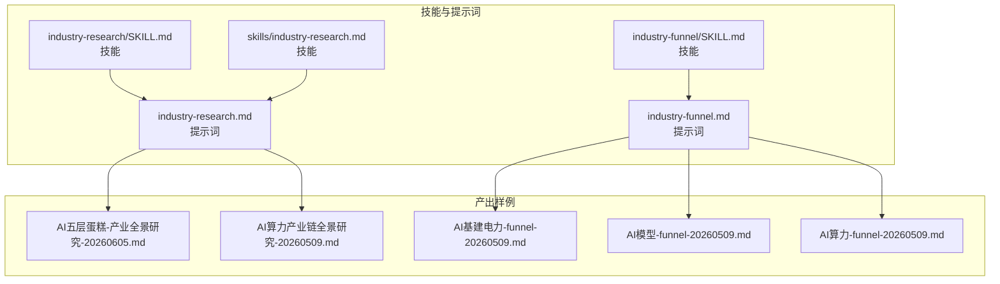
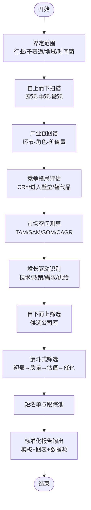
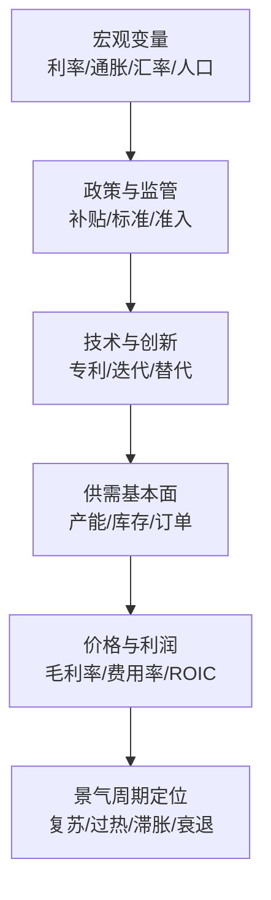
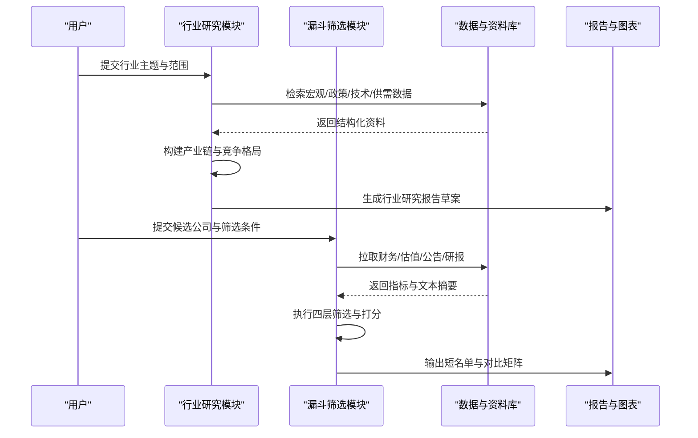
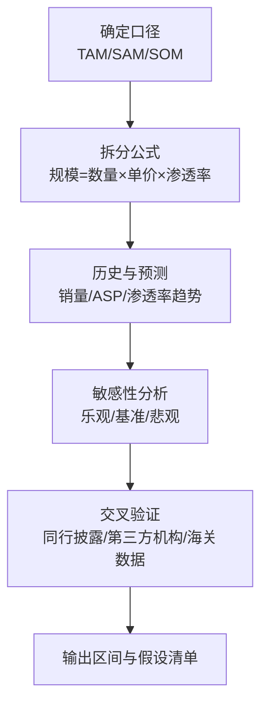
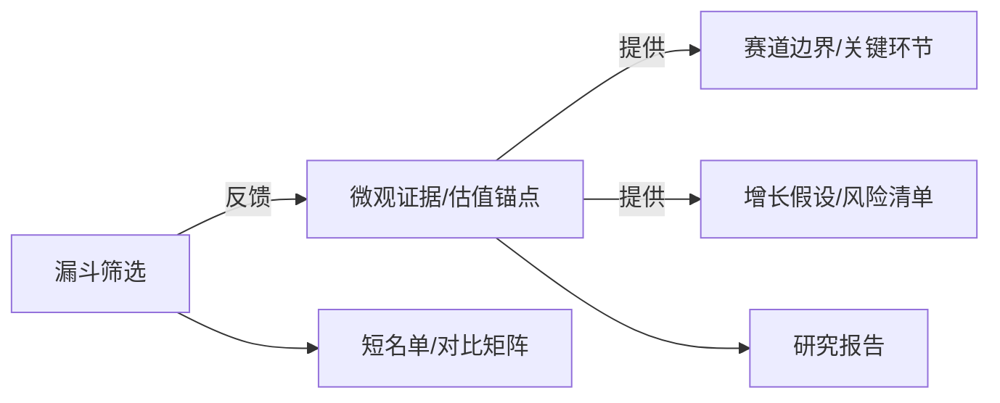

# 行业分析技能

<cite>
**本文引用的文件**   
- [codex-prompts/industry-research.md](file://codex-prompts/industry-research.md)
- [codex-prompts/industry-funnel.md](file://codex-prompts/industry-funnel.md)
- [skills/industry-research.md](file://skills/industry-research.md)
- [codex-skills/industry-research/SKILL.md](file://codex-skills/industry-research/SKILL.md)
- [codex-skills/industry-funnel/SKILL.md](file://codex-skills/industry-funnel/SKILL.md)
- [AI五层蛋糕-产业全景研究-20260605.md](file://AI五层蛋糕-产业全景研究-20260605.md)
- [AI算力产业链全景研究-20260509.md](file://AI算力产业链全景研究-20260509.md)
- [AI基建电力-funnel-20260509.md](file://AI基建电力-funnel-20260509.md)
- [AI模型-funnel-20260509.md](file://AI模型-funnel-20260509.md)
- [AI算力-funnel-20260509.md](file://AI算力-funnel-20260509.md)
</cite>

## 目录
1. [简介](#简介)
2. [项目结构](#项目结构)
3. [核心组件](#核心组件)
4. [架构总览](#架构总览)
5. [详细组件分析](#详细组件分析)
6. [依赖关系分析](#依赖关系分析)
7. [性能与效率考量](#性能与效率考量)
8. [故障排查指南](#故障排查指南)
9. [结论](#结论)
10. [附录](#附录)

## 简介
本文件为“行业分析技能”提供系统化、可操作的功能文档，覆盖 industry-research（行业研究）与 industry-funnel（行业漏斗筛选）两大能力。重点阐述：
- 产业链分析与竞争格局评估方法
- 市场空间测算与增长驱动因素识别
- 自上而下的行业扫描与自下而上的公司筛选
- 漏斗式筛选流程的具体实现
- 行业研究报告模板与标准化输出格式

目标是帮助使用者快速掌握从宏观到微观的完整研究闭环，形成高质量、可复用的行业研究与标的筛选成果。

## 项目结构
围绕行业分析的核心资产主要分布在以下位置：
- 技能定义与提示词：codex-prompts 与 codex-skills 目录
- 实战报告样例：reports 与根目录示例报告，用于对照输出规范与内容深度

图示来源
- [codex-prompts/industry-research.md](file://codex-prompts/industry-research.md)
- [codex-prompts/industry-funnel.md](file://codex-prompts/industry-funnel.md)
- [codex-skills/industry-research/SKILL.md](file://codex-skills/industry-research/SKILL.md)
- [codex-skills/industry-funnel/SKILL.md](file://codex-skills/industry-funnel/SKILL.md)
- [skills/industry-research.md](file://skills/industry-research.md)
- [AI五层蛋糕-产业全景研究-20260605.md](file://AI五层蛋糕-产业全景研究-20260605.md)
- [AI算力产业链全景研究-20260509.md](file://AI算力产业链全景研究-20260509.md)
- [AI基建电力-funnel-20260509.md](file://AI基建电力-funnel-20260509.md)
- [AI模型-funnel-20260509.md](file://AI模型-funnel-20260509.md)
- [AI算力-funnel-20260509.md](file://AI算力-funnel-20260509.md)

章节来源
- [codex-prompts/industry-research.md](file://codex-prompts/industry-research.md)
- [codex-prompts/industry-funnel.md](file://codex-prompts/industry-funnel.md)
- [codex-skills/industry-research/SKILL.md](file://codex-skills/industry-research/SKILL.md)
- [codex-skills/industry-funnel/SKILL.md](file://codex-skills/industry-funnel/SKILL.md)
- [skills/industry-research.md](file://skills/industry-research.md)
- [AI五层蛋糕-产业全景研究-20260605.md](file://AI五层蛋糕-产业全景研究-20260605.md)
- [AI算力产业链全景研究-20260509.md](file://AI算力产业链全景研究-20260509.md)
- [AI基建电力-funnel-20260509.md](file://AI基建电力-funnel-20260509.md)
- [AI模型-funnel-20260509.md](file://AI模型-funnel-20260509.md)
- [AI算力-funnel-20260509.md](file://AI算力-funnel-20260509.md)

## 核心组件
- 行业研究（industry-research）
  - 目标：完成自上而下的行业扫描，构建产业链图谱，评估竞争格局，测算市场空间，识别增长驱动因素，并输出结构化研究报告。
  - 关键能力：
    - 产业链分层与环节拆解
    - 供需结构与价格弹性分析
    - 竞争格局（集中度、进入壁垒、替代威胁）
    - 市场规模与增速测算（TAM/SAM/SOM、CAGR）
    - 政策与技术双轮驱动识别
    - 风险清单与情景假设
- 行业漏斗（industry-funnel）
  - 目标：在明确行业与子赛道后，通过多层筛选将候选公司逐步收敛至投资级标的池。
  - 关键能力：
    - 初筛（赛道匹配、市值/流动性门槛）
    - 质量筛选（盈利质量、现金流、杠杆、治理）
    - 估值与安全边际（相对/绝对估值、折价率）
    - 催化剂与时间维度（事件、周期、业绩拐点）
    - 组合视角（相关性、分散度、权重建议）

章节来源
- [codex-prompts/industry-research.md](file://codex-prompts/industry-research.md)
- [codex-prompts/industry-funnel.md](file://codex-prompts/industry-funnel.md)
- [codex-skills/industry-research/SKILL.md](file://codex-skills/industry-research/SKILL.md)
- [codex-skills/industry-funnel/SKILL.md](file://codex-skills/industry-funnel/SKILL.md)
- [skills/industry-research.md](file://skills/industry-research.md)

## 架构总览
行业分析工作流由“研究—筛选—验证—输出”四阶段构成，贯穿自上而下与自下而上两条主线，并通过标准化模板确保一致性。

图示来源
- [codex-prompts/industry-research.md](file://codex-prompts/industry-research.md)
- [codex-prompts/industry-funnel.md](file://codex-prompts/industry-funnel.md)

## 详细组件分析

### 行业研究（industry-research）
- 输入
  - 行业主题或细分赛道
  - 关注地域与市场（A股/港股/美股等）
  - 时间窗口与研究深度要求
- 处理逻辑
  - 自上而下：宏观环境→产业政策→技术演进→供需变化
  - 产业链拆解：上游资源/材料→中游制造/集成→下游应用/渠道
  - 竞争格局：头部份额、区域差异、客户粘性、转换成本
  - 市场空间：总量规模、渗透率、单价趋势、增量来源
  - 驱动因素：政策补贴、技术突破、成本曲线、海外对标
  - 风险与不确定性：监管、供应链、汇率、技术路线分歧
- 输出
  - 结构化研究报告（见“标准化输出格式”）
  - 关键图表：产业链图、竞争矩阵、市场空间柱状/折线图、驱动因子树
- 参考样例
  - AI五层蛋糕产业全景研究
  - AI算力产业链全景研究

章节来源
- [codex-prompts/industry-research.md](file://codex-prompts/industry-research.md)
- [codex-skills/industry-research/SKILL.md](file://codex-skills/industry-research/SKILL.md)
- [AI五层蛋糕-产业全景研究-20260605.md](file://AI五层蛋糕-产业全景研究-20260605.md)
- [AI算力产业链全景研究-20260509.md](file://AI算力产业链全景研究-20260509.md)

#### 自上而下行业扫描流程图

图示来源
- [codex-prompts/industry-research.md](file://codex-prompts/industry-research.md)

### 行业漏斗（industry-funnel）
- 输入
  - 已确定的行业/子赛道与初步候选公司列表
  - 筛选阈值与偏好（如市值、流动性、财务质量、估值区间）
- 处理逻辑（漏斗四层）
  - 初筛：赛道契合度、上市状态、流动性、基础合规
  - 质量：盈利能力、现金流、负债结构、治理与透明度
  - 估值：PE/PB/EV/EBITDA、DCF/可比法、安全边际
  - 催化：财报季、产品发布、产能投放、政策落地、并购重组
- 输出
  - 短名单与跟踪池（含理由、风险、下一步验证点）
  - 对比矩阵与可视化（雷达图/散点图/热力图）
- 参考样例
  - AI基建电力-funnel
  - AI模型-funnel
  - AI算力-funnel

章节来源
- [codex-prompts/industry-funnel.md](file://codex-prompts/industry-funnel.md)
- [codex-skills/industry-funnel/SKILL.md](file://codex-skills/industry-funnel/SKILL.md)
- [AI基建电力-funnel-20260509.md](file://AI基建电力-funnel-20260509.md)
- [AI模型-funnel-20260509.md](file://AI模型-funnel-20260509.md)
- [AI算力-funnel-20260509.md](file://AI算力-funnel-20260509.md)

#### 漏斗式筛选序列图

图示来源
- [codex-prompts/industry-research.md](file://codex-prompts/industry-research.md)
- [codex-prompts/industry-funnel.md](file://codex-prompts/industry-funnel.md)

#### 复杂逻辑：市场空间测算流程

图示来源
- [codex-prompts/industry-research.md](file://codex-prompts/industry-research.md)

## 依赖关系分析
- 内部依赖
  - 行业研究为漏斗筛选提供“赛道边界、关键环节、核心玩家、增长假设”
  - 漏斗筛选为行业研究提供“微观证据、估值锚点、催化时间表”
- 外部依赖
  - 公开信息：公司公告、年报/季报、招股书、券商研报、行业协会数据
  - 数据源：交易所、监管机构、统计部门、第三方数据库
- 耦合与内聚
  - 研究模块强调“框架与假设”，筛选模块强调“指标与阈值”，二者通过统一模板与术语对齐降低耦合风险

图示来源
- [codex-prompts/industry-research.md](file://codex-prompts/industry-research.md)
- [codex-prompts/industry-funnel.md](file://codex-prompts/industry-funnel.md)

## 性能与效率考量
- 并行化采集：宏观、政策、技术、供需四类数据可并行抓取与清洗
- 模板化输出：固定章节与图表类型减少重复劳动，提升一致性
- 阈值前置：在初筛阶段设置硬性门槛，避免后续高成本计算
- 假设驱动：以少量关键假设为核心进行敏感性分析，提高决策效率
- 版本管理：对数据源、假设与结论建立版本记录，便于回溯与复盘

## 故障排查指南
- 数据缺失或不一致
  - 现象：关键指标缺失、口径不一致导致结果波动
  - 处置：标注数据来源与口径；采用多源交叉验证；必要时剔除异常值
- 假设过于乐观/悲观
  - 现象：市场空间或利润预测偏离实际
  - 处置：引入保守/中性/乐观三情景；对核心变量做敏感性分析
- 筛选阈值过严/过宽
  - 现象：短名单为空或过多
  - 处置：动态调整阈值；按“必须满足/加分项/扣分项”分级
- 报告质量不稳定
  - 现象：章节缺失、图表不规范、结论不清晰
  - 处置：严格遵循模板；增加自检清单；双人复核关键结论

## 结论
行业分析技能通过“研究—筛选—验证—输出”的闭环，结合自上而下与自下而上两种路径，能够高效产出高质量的行业研究与标的筛选成果。依托标准化模板与清晰的漏斗流程，团队可在不同行业与市场中复用方法论，持续提升研究与投资决策的效率与质量。

## 附录

### 标准化输出格式（模板）
- 封面与摘要
  - 标题、日期、作者、关键词
  - 核心结论与投资建议（1页以内）
- 目录与图表清单
- 一、研究背景与范围
  - 行业定义、边界与分类
  - 研究目的、方法与数据来源
- 二、宏观与政策环境
  - 经济周期、利率与汇率
  - 产业政策、监管与标准
- 三、产业链与价值链
  - 环节划分、上下游关系
  - 价值分布与议价能力
- 四、竞争格局与护城河
  - 市场份额与集中度
  - 进入壁垒、替代威胁、客户粘性
- 五、市场空间与增长驱动
  - TAM/SAM/SOM测算与假设
  - 驱动因素：技术/政策/需求/供给
  - 情景分析与敏感性
- 六、关键公司画像（可选）
  - 商业模式、产品矩阵、客户结构
  - 财务质量与估值锚点
- 七、风险与不确定性
  - 政策/技术/供应链/汇率/公司治理
- 八、结论与行动建议
  - 投资要点、观察信号、触发条件
  - 组合配置建议与跟踪计划
- 附录
  - 数据表、原始假设、参考文献与链接

章节来源
- [codex-prompts/industry-research.md](file://codex-prompts/industry-research.md)
- [codex-prompts/industry-funnel.md](file://codex-prompts/industry-funnel.md)

### 常用图表清单
- 产业链结构图（节点-边-权重）
- 竞争格局矩阵（份额/增长率/利润率）
- 市场空间柱状/折线图（分情景）
- 驱动因子树（政策/技术/需求/供给）
- 漏斗筛选桑基图（候选→短名单）
- 估值对比散点图（横轴：成长性，纵轴：估值）

章节来源
- [AI五层蛋糕-产业全景研究-20260605.md](file://AI五层蛋糕-产业全景研究-20260605.md)
- [AI算力产业链全景研究-20260509.md](file://AI算力产业链全景研究-20260509.md)
- [AI基建电力-funnel-20260509.md](file://AI基建电力-funnel-20260509.md)
- [AI模型-funnel-20260509.md](file://AI模型-funnel-20260509.md)
- [AI算力-funnel-20260509.md](file://AI算力-funnel-20260509.md)