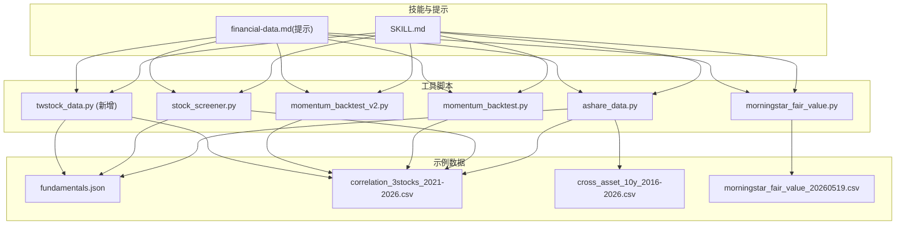
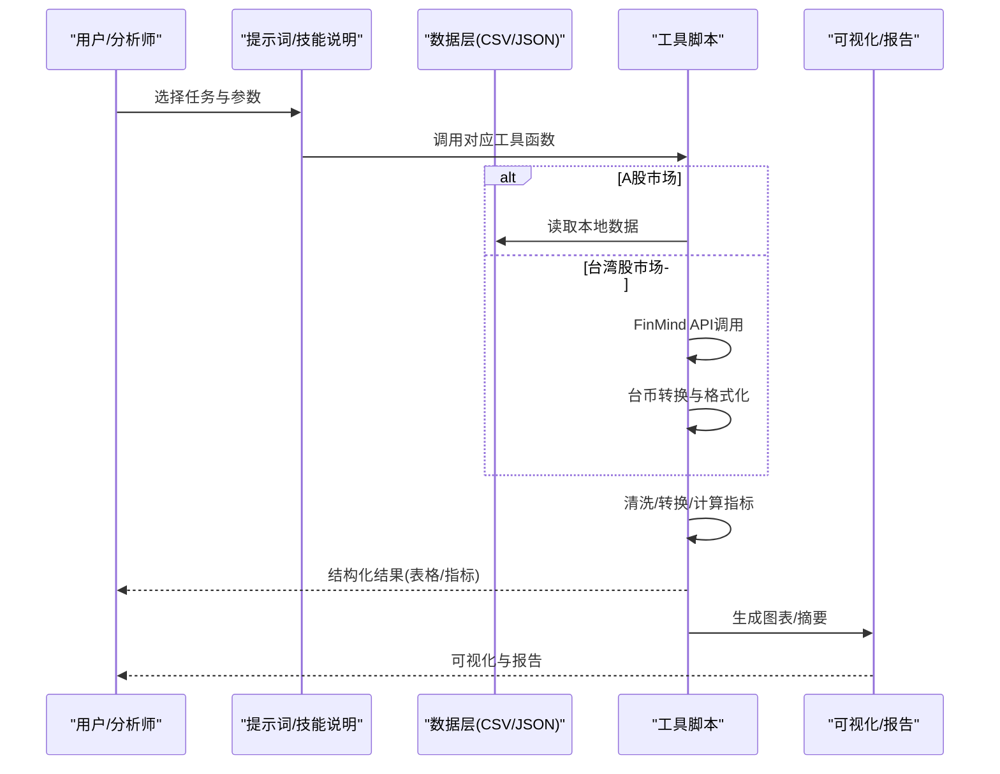
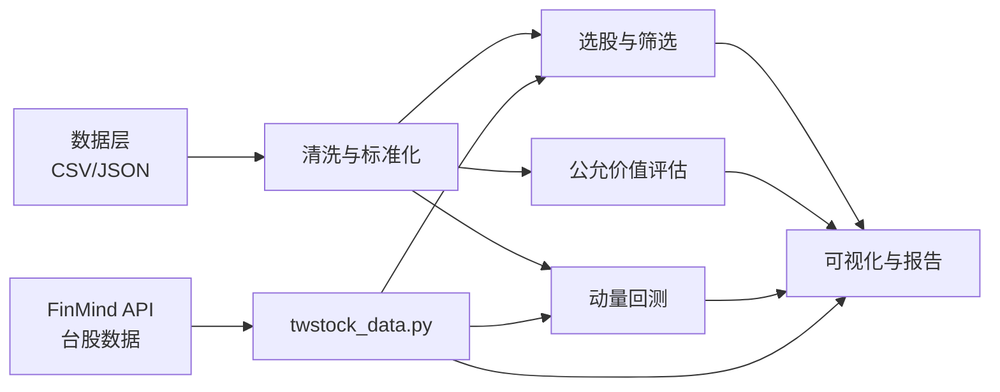

# 财务数据分析技能

<cite>
**本文引用的文件**   
- [SKILL.md](file://codex-skills/financial-data/SKILL.md)
- [financial-data.md](file://skills/financial-data.md)
- [financial-data.md](file://codex-prompts/financial-data.md)
- [ashare_data.py](file://tools/ashare_data.py)
- [stock_screener.py](file://tools/stock_screener.py)
- [morningstar_fair_value.py](file://tools/morningstar_fair_value.py)
- [momentum_backtest.py](file://tools/momentum_backtest.py)
- [momentum_backtest_v2.py](file://tools/momentum_backtest_v2.py)
- [twstock_data.py](file://tools/twstock_data.py)
- [fundamentals.json](file://data/fundamentals.json)
- [correlation_3stocks_2021-2026.csv](file://data/correlation_3stocks_2021-2026.csv)
- [cross_asset_10y_2016-2026.csv](file://data/cross_asset_10y_2016-2026.csv)
- [morningstar_fair_value_20260519.csv](file://data/morningstar_fair_value_20260519.csv)
</cite>

## 更新摘要
**所做更改**
- 新增台湾股市数据源支持，集成FinMind API工具
- 增加台币转换和月度营收披露功能说明
- 更新数据源优先级表格，包含台股专用数据源
- 扩展多市场对比分析能力，支持跨币种数据处理
- 增强财务指标计算，涵盖台股特有指标如殖利率、月营收等

## 目录
1. [引言](#引言)
2. [项目结构](#项目结构)
3. [核心组件](#核心组件)
4. [架构总览](#架构总览)
5. [详细组件分析](#详细组件分析)
6. [依赖关系分析](#依赖关系分析)
7. [性能考虑](#性能考虑)
8. [故障排查指南](#故障排查指南)
9. [结论](#结论)
10. [附录](#附录)

## 引言
本文件为"财务数据分析技能"的权威功能文档，聚焦于数据处理与分析能力，包括：
- 财务指标计算与历史数据查询
- 数据清洗与转换
- 可视化图表生成
- 多公司对比、时间序列分析与异常检测
- 支持的数据源、数据格式与处理管道
- 最佳实践与性能优化建议

该技能通过可复用的工具脚本与示例数据集，帮助投研团队快速完成从原始数据到洞察输出的端到端流程。**最新更新**：新增台湾股市作为主要数据源，支持FinMind API集成、台币转换、月度营收披露等特色功能。

## 项目结构
围绕财务数据分析的核心资源分布在以下位置：
- 技能定义与提示词：codex-skills/financial-data/SKILL.md、skills/financial-data.md、codex-prompts/financial-data.md
- 数据处理与分析工具：tools/ashare_data.py、tools/stock_screener.py、tools/morningstar_fair_value.py、tools/momentum_backtest.py、tools/momentum_backtest_v2.py、**tools/twstock_data.py（新增）**
- 示例数据：data/fundamentals.json、data/correlation_3stocks_2021-2026.csv、data/cross_asset_10y_2016-2026.csv、data/morningstar_fair_value_20260519.csv



图示来源
- [SKILL.md](file://codex-skills/financial-data/SKILL.md)
- [financial-data.md](file://skills/financial-data.md)
- [financial-data.md](file://codex-prompts/financial-data.md)
- [ashare_data.py](file://tools/ashare_data.py)
- [stock_screener.py](file://tools/stock_screener.py)
- [morningstar_fair_value.py](file://tools/morningstar_fair_value.py)
- [momentum_backtest.py](file://tools/momentum_backtest.py)
- [momentum_backtest_v2.py](file://tools/momentum_backtest_v2.py)
- [twstock_data.py](file://tools/twstock_data.py)
- [fundamentals.json](file://data/fundamentals.json)
- [correlation_3stocks_2021-2026.csv](file://data/correlation_3stocks_2021-2026.csv)
- [cross_asset_10y_2016-2026.csv](file://data/cross_asset_10y_2016-2026.csv)
- [morningstar_fair_value_20260519.csv](file://data/morningstar_fair_value_20260519.csv)

章节来源
- [SKILL.md](file://codex-skills/financial-data/SKILL.md)
- [financial-data.md](file://skills/financial-data.md)
- [financial-data.md](file://codex-prompts/financial-data.md)

## 核心组件
- 数据接入与清洗（A股）：提供统一接口读取本地CSV/JSON等数据，进行缺失值处理、单位对齐、字段标准化与去重。
- **台湾股市数据接入（新增）**：基于FinMind API的零依赖脚本，支持行情、估值、财务、月营收、股利等完整数据获取。
- 选股与筛选：基于基本面与估值指标进行条件筛选与排序，输出候选池与关键指标表。
- 公允价值评估：结合外部公允价值数据，计算折溢价与安全边际，辅助投资决策。
- 动量回测：对多资产或单标的进行动量策略回测，输出收益曲线、回撤与换手统计。
- 可视化与报告：将关键结果以图表形式输出，便于汇报与归档。

章节来源
- [ashare_data.py](file://tools/ashare_data.py)
- [twstock_data.py](file://tools/twstock_data.py)
- [stock_screener.py](file://tools/stock_screener.py)
- [morningstar_fair_value.py](file://tools/morningstar_fair_value.py)
- [momentum_backtest.py](file://tools/momentum_backtest.py)
- [momentum_backtest_v2.py](file://tools/momentum_backtest_v2.py)

## 架构总览
整体处理管道遵循"输入→清洗→计算→输出"的流水线模式，各工具之间通过标准数据格式（CSV/JSON）解耦，便于扩展与替换。**新增台股数据流**：通过FinMind API直接获取实时数据，支持多币种统一处理。



图示来源
- [financial-data.md](file://codex-prompts/financial-data.md)
- [ashare_data.py](file://tools/ashare_data.py)
- [twstock_data.py](file://tools/twstock_data.py)
- [stock_screener.py](file://tools/stock_screener.py)
- [morningstar_fair_value.py](file://tools/morningstar_fair_value.py)
- [momentum_backtest.py](file://tools/momentum_backtest.py)
- [momentum_backtest_v2.py](file://tools/momentum_backtest_v2.py)

## 详细组件分析

### 数据接入与清洗（A股）
- 职责
  - 读取本地CSV/JSON数据，建立统一DataFrame结构
  - 缺失值填充、异常值裁剪、单位与币种对齐
  - 字段命名规范化、时间戳解析与索引设置
  - 去重与一致性校验（如代码、日期唯一性）
- 典型输入/输出
  - 输入：行情CSV、财报JSON、指数权重CSV
  - 输出：标准化后的时序面板数据、质量检查报告
- 适用场景
  - 多公司横截面+时间序列混合分析
  - 跨市场数据合并前的预处理

章节来源
- [ashare_data.py](file://tools/ashare_data.py)
- [fundamentals.json](file://data/fundamentals.json)
- [correlation_3stocks_2021-2026.csv](file://data/correlation_3stocks_2021-2026.csv)
- [cross_asset_10y_2016-2026.csv](file://data/cross_asset_10y_2016-2026.csv)

### 台湾股市数据接入（新增）
- 职责
  - 基于FinMind API的零依赖脚本，支持台股上市柜全部股票
  - 自动处理API token管理（环境变量优先，本地文件备用）
  - 提供行情快照、估值指标、财务报表、月营收、股利政策等完整数据
  - 内置新台币金额格式化（亿/万单位转换）
- 核心功能
  - `quote`：最新行情 + PER/PBR/殖利率 + 市值验算
  - `valuation`：估值指标 + PER一年区间 + 52周高低
  - `financials`：近5年年度核心财务（营收/毛利率/归母净利/EPS/ROE）
  - `revenue`：近13个月月营收及同比（台股独有优势）
  - `dividend`：近年股利政策（现金/股票股利、除息日）
  - `search`：按名称/代码搜索台股（支持繁体中文）
- 技术特点
  - 零外部依赖，仅使用Python标准库
  - 自动季度加总：FinMind损益表为单季值，工具已自动加总为年度值
  - 市值验算：收盘价 × 发行股数，确保数据准确性
  - 错误处理：完善的HTTP错误处理和token验证机制

章节来源
- [twstock_data.py](file://tools/twstock_data.py)
- [SKILL.md](file://codex-skills/financial-data/SKILL.md)
- [financial-data.md](file://skills/financial-data.md)

### 选股与筛选
- 职责
  - 根据预设规则（如PE/PB/ROE/营收增速/股息率）筛选标的
  - 多维度打分与排序，输出候选清单与解释性指标
  - 支持行业/市值/流动性等约束条件
- 典型输入/输出
  - 输入：标准化后的基本面与价格数据
  - 输出：筛选结果CSV、关键指标表、可视化雷达图/柱状图
- 适用场景
  - 初筛宽基股票池
  - 风格因子暴露控制下的组合构建前准备

章节来源
- [stock_screener.py](file://tools/stock_screener.py)
- [fundamentals.json](file://data/fundamentals.json)
- [correlation_3stocks_2021-2026.csv](file://data/correlation_3stocks_2021-2026.csv)

### 公允价值评估（晨星）
- 职责
  - 读取晨星公允价值CSV，与公司当前价格匹配
  - 计算折溢价率与安全边际，按低估程度排序
  - 输出可视化对比与风险提示
- 典型输入/输出
  - 输入：morningstar_fair_value_YYYYMMDD.csv、个股价格序列
  - 输出：折溢价表、安全边际排名、可视化图表
- 适用场景
  - 价值型初筛与跟踪
  - 与内部模型交叉验证

章节来源
- [morningstar_fair_value.py](file://tools/morningstar_fair_value.py)
- [morningstar_fair_value_20260519.csv](file://data/morningstar_fair_value_20260519.csv)

### 动量回测
- 职责
  - 实现多资产/单标的动量策略回测
  - 计算持有期收益、年化收益、最大回撤、夏普比率、换手率
  - 输出净值曲线、月度热力图与交易明细
- 典型输入/输出
  - 输入：多资产收益率矩阵或价格序列
  - 输出：回测指标汇总、净值曲线、交易记录
- 适用场景
  - 趋势跟踪策略验证
  - 多资产轮动策略探索

章节来源
- [momentum_backtest.py](file://tools/momentum_backtest.py)
- [momentum_backtest_v2.py](file://tools/momentum_backtest_v2.py)
- [correlation_3stocks_2021-2026.csv](file://data/correlation_3stocks_2021-2026.csv)
- [cross_asset_10y_2016-2026.csv](file://data/cross_asset_10y_2016-2026.csv)

### 可视化与报告
- 职责
  - 将关键指标与回测结果以图表呈现
  - 生成可归档的报告（含数据来源、假设与限制）
- 典型输出
  - 净值曲线、相关性热力图、折线/柱状/散点图
  - PDF/HTML/图片等多格式导出

章节来源
- [ashare_data.py](file://tools/ashare_data.py)
- [twstock_data.py](file://tools/twstock_data.py)
- [stock_screener.py](file://tools/stock_screener.py)
- [morningstar_fair_value.py](file://tools/morningstar_fair_value.py)
- [momentum_backtest.py](file://tools/momentum_backtest.py)
- [momentum_backtest_v2.py](file://tools/momentum_backtest_v2.py)

## 依赖关系分析
- 模块内聚与耦合
  - 数据接入与清洗作为底层依赖，被选股、公允价值、回测等上层模块复用
  - **新增台股模块独立运行**：twstock_data.py完全独立，不依赖其他工具模块
  - 工具间通过CSV/JSON解耦，降低直接耦合度
- 外部依赖
  - 数据源：本地CSV/JSON；可扩展至数据库或API
  - **FinMind API**：台股数据的主要外部依赖，支持匿名访问和token认证
  - 可视化：常用绘图库（如matplotlib/seaborn/plotly）
- 潜在循环依赖
  - 当前设计无循环导入风险，所有上层模块仅依赖数据层与通用工具



图示来源
- [ashare_data.py](file://tools/ashare_data.py)
- [twstock_data.py](file://tools/twstock_data.py)
- [stock_screener.py](file://tools/stock_screener.py)
- [morningstar_fair_value.py](file://tools/morningstar_fair_value.py)
- [momentum_backtest.py](file://tools/momentum_backtest.py)
- [momentum_backtest_v2.py](file://tools/momentum_backtest_v2.py)

## 性能考虑
- 数据规模
  - 大表优先使用向量化操作与内存映射，避免逐行循环
  - 分块读取与增量更新，减少I/O压力
- 计算复杂度
  - 滚动窗口计算采用滑动聚合，避免重复全量扫描
  - 多公司对比时，先做降采样与特征压缩再进入复杂模型
- I/O与缓存
  - 中间结果落盘缓存，避免重复计算
  - 批量写入与异步IO提升吞吐
- 并行化
  - 多进程/多线程用于独立标的的回测与指标计算
- 可视化
  - 大数据集下使用抽样或聚合视图，避免渲染瓶颈
- **台股API优化**
  - FinMind API请求限流处理，支持token认证提升配额
  - 本地缓存机制减少重复API调用
  - 错误重试和超时处理确保稳定性

[本节为通用指导，不直接分析具体文件]

## 故障排查指南
- 常见问题
  - 数据缺失与不一致：检查时间戳格式、货币单位、复权方式
  - 指标异常：核对计算公式与口径（TTM/静态/动态）
  - 回测偏差：确认滑点、手续费、涨跌停与停牌处理
- **台股特定问题**
  - FinMind API连接失败：检查网络连接、token有效性、请求频率限制
  - 股票代码识别错误：确认使用正确的4位数字代码（如2330代表台积电）
  - 繁体中文搜索：台股公司名称多为繁体字，需使用正确字符
  - 汇率换算问题：台币与其他货币混用时需显式标注和换算
- 定位方法
  - 打印中间结果分布与统计量
  - 逐步关闭过滤条件，缩小问题范围
  - 使用最小可复现样本验证逻辑
- 恢复策略
  - 保留原始数据快照与版本标签
  - 对关键步骤增加断言与日志埋点

章节来源
- [ashare_data.py](file://tools/ashare_data.py)
- [twstock_data.py](file://tools/twstock_data.py)
- [stock_screener.py](file://tools/stock_screener.py)
- [morningstar_fair_value.py](file://tools/morningstar_fair_value.py)
- [momentum_backtest.py](file://tools/momentum_backtest.py)
- [momentum_backtest_v2.py](file://tools/momentum_backtest_v2.py)

## 结论
财务数据分析技能以"数据接入→清洗→计算→可视化"的清晰管道为核心，覆盖多公司对比、时间序列分析与异常检测等高频需求。**最新更新**：新增台湾股市作为主要数据源，通过FinMind API集成实现了完整的台股数据获取能力，包括行情、估值、财务、月营收、股利等全方位数据支持。系统具备良好的可扩展性与可维护性，建议在工程实践中强化数据治理、版本管理与性能监控，以提升产出质量与效率。

[本节为总结性内容，不直接分析具体文件]

## 附录

### 支持的数据源与格式
- 本地CSV/JSON：行情、基本面、公允价值、相关性矩阵等
- **FinMind API（新增）**：台股上市柜股票完整数据，支持匿名访问和token认证
- 可扩展数据源：数据库、API、爬虫采集（需遵循合规要求）

章节来源
- [fundamentals.json](file://data/fundamentals.json)
- [correlation_3stocks_2021-2026.csv](file://data/correlation_3stocks_2021-2026.csv)
- [cross_asset_10y_2016-2026.csv](file://data/cross_asset_10y_2016-2026.csv)
- [morningstar_fair_value_20260519.csv](file://data/morningstar_fair_value_20260519.csv)
- [twstock_data.py](file://tools/twstock_data.py)

### 多公司对比分析要点
- 统一口径：收入、利润、现金流、估值指标需一致口径与复权
- 可比性：剔除一次性损益、会计变更影响
- **跨市场对比（新增）**：台币与其他货币混排时必须显式标注，跨市场对比先统一换算
- 可视化：雷达图/堆叠柱/双轴折线展示相对强弱

章节来源
- [stock_screener.py](file://tools/stock_screener.py)
- [ashare_data.py](file://tools/ashare_data.py)
- [twstock_data.py](file://tools/twstock_data.py)

### 时间序列分析与异常检测
- 时间序列：移动平均、季节性分解、自相关/偏自相关分析
- 异常检测：Z-score、IQR、孤立森林等方法识别异常波动
- 稳健性：对极端值进行Winsorize或截尾处理

章节来源
- [ashare_data.py](file://tools/ashare_data.py)
- [momentum_backtest.py](file://tools/momentum_backtest.py)
- [momentum_backtest_v2.py](file://tools/momentum_backtest_v2.py)

### 数据处理最佳实践
- 数据契约：明确字段名、单位、频率、时区与复权约定
- 版本管理：数据与代码同步版本化，确保可复现
- 质量门禁：在入库前执行完整性、一致性与合理性校验
- 审计追踪：记录关键假设、参数与中间结果
- **台股数据处理（新增）**
  - 货币单位统一：台币（TWD）与其他货币区分处理
  - 月度营收利用：充分利用台股每月10日前强制披露的上月营收数据
  - API使用规范：合理控制请求频率，避免触发限流
  - Token安全管理：API token只存本机，严禁提交到git

章节来源
- [ashare_data.py](file://tools/ashare_data.py)
- [twstock_data.py](file://tools/twstock_data.py)
- [stock_screener.py](file://tools/stock_screener.py)
- [morningstar_fair_value.py](file://tools/morningstar_fair_value.py)
- [momentum_backtest.py](file://tools/momentum_backtest.py)
- [momentum_backtest_v2.py](file://tools/momentum_backtest_v2.py)

### 台股数据使用指南（新增）
- **基本用法**
  ```bash
  python3 tools/twstock_data.py quote 2330        # 最新行情 + PER/PBR/殖利率 + 市值验算
  python3 tools/twstock_data.py valuation 2330    # 估值指标 + PER一年区间 + 52周高低
  python3 tools/twstock_data.py financials 2330   # 近5年年度核心财务
  python3 tools/twstock_data.py revenue 2330      # 近13个月月营收及同比
  python3 tools/twstock_data.py dividend 2330     # 近年股利政策
  python3 tools/twstock_data.py search 台積       # 搜索股票代码
  ```
- **API配置**
  - 环境变量：`export FINMIND_TOKEN=your_token`
  - 本地文件：创建`local/finmind_token.txt`文件
  - 匿名访问：无需配置即可使用（有小时级限额）
- **特色功能**
  - 月营收分析：台股独有的月度披露数据，是跟踪基本面拐点最快的公开信号
  - 市值验算：自动计算收盘价×发行股数，确保数据准确性
  - 季度加总：自动将单季财务数据加总为年度数据
  - 繁体支持：支持繁体中文公司名称搜索

章节来源
- [twstock_data.py](file://tools/twstock_data.py)
- [SKILL.md](file://codex-skills/financial-data/SKILL.md)
- [financial-data.md](file://skills/financial-data.md)