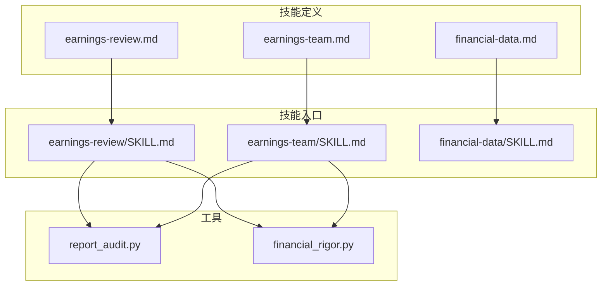
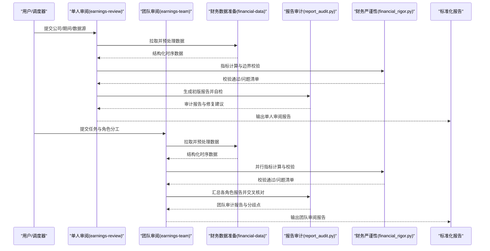
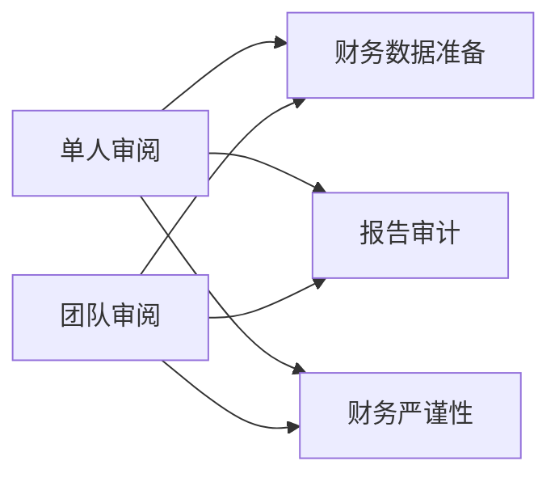

# 财报审阅技能

<cite>
**本文引用的文件**   
- [earnings-review.md](file://codex-prompts/earnings-review.md)
- [earnings-team.md](file://codex-prompts/earnings-team.md)
- [SKILL.md](file://codex-skills/earnings-review/SKILL.md)
- [SKILL.md](file://codex-skills/earnings-team/SKILL.md)
- [financial-data.md](file://codex-prompts/financial-data.md)
- [financial-data.md](file://codex-skills/financial-data/SKILL.md)
- [report_audit.py](file://tools/report_audit.py)
- [financial_rigor.py](file://tools/financial_rigor.py)
</cite>

## 目录
1. [简介](#简介)
2. [项目结构](#项目结构)
3. [核心组件](#核心组件)
4. [架构总览](#架构总览)
5. [详细组件分析](#详细组件分析)
6. [依赖关系分析](#依赖关系分析)
7. [性能与可扩展性](#性能与可扩展性)
8. [故障排查指南](#故障排查指南)
9. [结论](#结论)
10. [附录：使用示例与参数配置](#附录使用示例与参数配置)

## 简介
本文件为“财报审阅技能”的完整功能文档，聚焦两个相关技能：
- earnings-review（单人深度审阅）
- earnings-team（团队协作审阅）

目标能力包括：财务报表分析、关键指标提取、异常检测、趋势分析与同行对比；支持解析多种格式的财报数据；识别财务风险信号；输出标准化的财报分析报告。文档同时提供使用示例、参数配置与结果解读指南，帮助非技术用户也能快速上手。

## 项目结构
围绕财报审阅的核心资产主要分布在以下位置：
- codex-prompts：技能提示词与流程定义（earnings-review.md、earnings-team.md、financial-data.md）
- codex-skills：技能的标准化描述与入口（earnings-review/SKILL.md、earnings-team/SKILL.md、financial-data/SKILL.md）
- tools：辅助工具脚本（report_audit.py、financial_rigor.py）

图表来源
- [earnings-review.md](file://codex-prompts/earnings-review.md)
- [earnings-team.md](file://codex-prompts/earnings-team.md)
- [financial-data.md](file://codex-prompts/financial-data.md)
- [SKILL.md](file://codex-skills/earnings-review/SKILL.md)
- [SKILL.md](file://codex-skills/earnings-team/SKILL.md)
- [SKILL.md](file://codex-skills/financial-data/SKILL.md)
- [report_audit.py](file://tools/report_audit.py)
- [financial_rigor.py](file://tools/financial_rigor.py)

章节来源
- [earnings-review.md](file://codex-prompts/earnings-review.md)
- [earnings-team.md](file://codex-prompts/earnings-team.md)
- [financial-data.md](file://codex-prompts/financial-data.md)
- [SKILL.md](file://codex-skills/earnings-review/SKILL.md)
- [SKILL.md](file://codex-skills/earnings-team/SKILL.md)
- [SKILL.md](file://codex-skills/financial-data/SKILL.md)
- [report_audit.py](file://tools/report_audit.py)
- [financial_rigor.py](file://tools/financial_rigor.py)

## 核心组件
- 单人审阅（earnings-review）
  - 面向单分析师或独立研究场景，强调端到端闭环：数据接入→清洗对齐→指标计算→异常检测→趋势与同行对比→报告生成。
- 团队审阅（earnings-team）
  - 面向多人协作：角色分工（主审、复核、行业专家等）、并行校验、分歧仲裁、版本化产出与审计追踪。
- 财务数据准备（financial-data）
  - 统一数据接入与预处理规范，涵盖多格式解析、口径对齐、缺失值处理、时间序列对齐、单位与币种归一化。
- 质量与严谨性工具
  - report_audit.py：报告一致性、完整性与可追溯性检查。
  - financial_rigor.py：财务指标计算的严谨性校验与边界条件检查。

章节来源
- [earnings-review.md](file://codex-prompts/earnings-review.md)
- [earnings-team.md](file://codex-prompts/earnings-team.md)
- [financial-data.md](file://codex-prompts/financial-data.md)
- [SKILL.md](file://codex-skills/earnings-review/SKILL.md)
- [SKILL.md](file://codex-skills/earnings-team/SKILL.md)
- [SKILL.md](file://codex-skills/financial-data/SKILL.md)
- [report_audit.py](file://tools/report_audit.py)
- [financial_rigor.py](file://tools/financial_rigor.py)

## 架构总览
整体工作流由“输入→处理→校验→输出”构成，单人审阅与团队审阅共享底层数据处理与校验能力。

图表来源
- [earnings-review.md](file://codex-prompts/earnings-review.md)
- [earnings-team.md](file://codex-prompts/earnings-team.md)
- [financial-data.md](file://codex-prompts/financial-data.md)
- [report_audit.py](file://tools/report_audit.py)
- [financial_rigor.py](file://tools/financial_rigor.py)

## 详细组件分析

### 单人审阅（earnings-review）
- 职责范围
  - 数据接入与清洗：支持PDF/Excel/CSV/HTML等多格式财报，自动识别报表结构与科目映射。
  - 关键指标提取：利润表、资产负债表、现金流量表核心比率与衍生指标。
  - 异常检测：基于阈值、同比/环比、同业分位与统计离群点识别。
  - 趋势分析：滚动窗口、季节性调整、拐点识别与驱动因素拆解。
  - 同行对比：同口径可比公司筛选、指标雷达图与排名。
  - 报告生成：结构化模板、证据链引用、风险提示与建议。
- 质量控制
  - 内置财务严谨性检查（如勾稽关系、单位一致性、缺失值与异常值）。
  - 报告审计：完整性、一致性与可追溯性核查。
- 适用场景
  - 快速审阅单家公司单期或多期财报，形成可直接归档的标准报告。

章节来源
- [earnings-review.md](file://codex-prompts/earnings-review.md)
- [SKILL.md](file://codex-skills/earnings-review/SKILL.md)
- [financial-data.md](file://codex-prompts/financial-data.md)
- [financial_rigor.py](file://tools/financial_rigor.py)
- [report_audit.py](file://tools/report_audit.py)

### 团队审阅（earnings-team）
- 职责范围
  - 角色分工：主审（统筹与定稿）、复核（逻辑与数据校验）、行业专家（业务与同业视角）。
  - 并行作业：按模块拆分（数据、指标、同业、风险），减少串行瓶颈。
  - 分歧仲裁：冲突点记录、投票/加权决策、版本留痕。
  - 协同产出：合并多角色意见，生成团队审阅报告与审计轨迹。
- 质量控制
  - 交叉校验与双人复核机制。
  - 报告审计覆盖团队级一致性、引用溯源与变更历史。
- 适用场景
  - 重要标的、复杂业务结构或高风险公司的深度审阅。

章节来源
- [earnings-team.md](file://codex-prompts/earnings-team.md)
- [SKILL.md](file://codex-skills/earnings-team/SKILL.md)
- [report_audit.py](file://tools/report_audit.py)

### 财务数据准备（financial-data）
- 数据接入
  - 多格式解析：PDF（OCR+表格还原）、Excel/CSV（列名映射）、HTML（网页披露页抓取）。
  - 字段映射：通用科目字典与本地化扩展，支持不同会计准则差异。
- 数据治理
  - 缺失值插补策略、异常值回滚、单位与币种归一化、会计期间对齐。
  - 时间序列构建：季度/年度滚动窗口、同比/环比基线。
- 输出契约
  - 结构化时序对象（公司、期间、科目、数值、单位、来源、置信度）。
  - 元数据：数据来源、版本号、处理日志、校验结果。

章节来源
- [financial-data.md](file://codex-prompts/financial-data.md)
- [SKILL.md](file://codex-skills/financial-data/SKILL.md)

### 质量与严谨性工具
- report_audit.py
  - 报告完整性检查：必填项、图表、附件、引用是否齐全。
  - 一致性检查：前后文数字一致、口径一致、单位一致。
  - 可追溯性：数据来源链接、处理步骤、版本信息。
- financial_rigor.py
  - 勾稽关系校验：三表平衡、现金流与利润表衔接、权益变动表匹配。
  - 边界条件：负数合理性、极端值回退、除零保护。
  - 指标稳健性：窗口长度、平滑方法、敏感性分析。

章节来源
- [report_audit.py](file://tools/report_audit.py)
- [financial_rigor.py](file://tools/financial_rigor.py)

## 依赖关系分析
- 技能层依赖
  - earnings-review 与 earnings-team 均依赖 financial-data 的数据处理能力。
  - 两者均调用 report_audit.py 与 financial_rigor.py 进行质量保障。
- 外部依赖
  - 数据源：公司披露文件、第三方数据库、公开网页。
  - 解析库：PDF/Excel/CSV/HTML解析工具（具体实现以工程代码为准）。
- 耦合与内聚
  - 数据准备与校验模块高内聚，被多个技能复用，降低重复实现。
  - 报告模板与审计规则集中管理，便于统一升级。

图表来源
- [earnings-review.md](file://codex-prompts/earnings-review.md)
- [earnings-team.md](file://codex-prompts/earnings-team.md)
- [financial-data.md](file://codex-prompts/financial-data.md)
- [report_audit.py](file://tools/report_audit.py)
- [financial_rigor.py](file://tools/financial_rigor.py)

章节来源
- [earnings-review.md](file://codex-prompts/earnings-review.md)
- [earnings-team.md](file://codex-prompts/earnings-team.md)
- [financial-data.md](file://codex-prompts/financial-data.md)
- [report_audit.py](file://tools/report_audit.py)
- [financial_rigor.py](file://tools/financial_rigor.py)

## 性能与可扩展性
- 性能优化建议
  - 数据缓存：对高频访问的同业基准与科目字典做缓存。
  - 增量计算：仅重算变化期间的指标与报告片段。
  - 并行化：团队审阅中按模块并行执行，结合异步I/O提升吞吐。
- 可扩展性
  - 插件式指标库：新增指标无需改动核心流程。
  - 多准则适配：通过科目映射表扩展新会计准则。
  - 报告模板引擎：支持Markdown/HTML/PDF多格式导出。

[本节为通用指导，不直接分析具体文件]

## 故障排查指南
- 常见问题定位
  - 数据解析失败：确认文件格式、编码、表格结构是否符合预期；查看解析日志与字段映射。
  - 指标计算异常：检查单位/币种一致性、除零保护、缺失值插补策略。
  - 报告不一致：运行报告审计，定位缺失项、前后矛盾与引用断链。
- 调试步骤
  - 启用详细日志：记录数据接入、清洗、计算、审计各环节。
  - 最小复现：抽取单期单表数据进行隔离测试。
  - 回归验证：在修复后重新跑通全流程并比对差异。

章节来源
- [report_audit.py](file://tools/report_audit.py)
- [financial_rigor.py](file://tools/financial_rigor.py)

## 结论
earnings-review 与 earnings-team 共同构建了从数据到报告的完整审阅体系。前者适合高效单人作业，后者适合复杂标的的多角色协作。借助统一的财务数据准备与质量工具，系统实现了标准化、可审计、可追溯的财报审阅流程，满足高质量投研需求。

[本节为总结性内容，不直接分析具体文件]

## 附录：使用示例与参数配置

### 单人审阅（earnings-review）典型流程
- 输入
  - 公司标识、报告期、数据源路径或URL、输出目录。
- 处理
  - 数据接入与清洗→指标计算→异常检测→趋势与同行对比→报告生成。
- 输出
  - 标准化报告（含摘要、指标表、图表、风险提示、参考来源）。

章节来源
- [earnings-review.md](file://codex-prompts/earnings-review.md)
- [SKILL.md](file://codex-skills/earnings-review/SKILL.md)

### 团队审阅（earnings-team）典型流程
- 输入
  - 公司标识、报告期、数据源、角色分工、协作规则。
- 处理
  - 并行模块作业→交叉校验→分歧仲裁→合并定稿。
- 输出
  - 团队审阅报告（含角色意见、分歧点、最终结论与审计轨迹）。

章节来源
- [earnings-team.md](file://codex-prompts/earnings-team.md)
- [SKILL.md](file://codex-skills/earnings-team/SKILL.md)

### 财务数据准备（financial-data）关键参数
- 数据源类型：PDF/Excel/CSV/HTML
- 字段映射：科目字典、会计准则、币种/单位
- 时间窗口：滚动窗口长度、季节性调整开关
- 缺失值策略：前向填充/线性插值/剔除
- 异常值处理：Z-score/IQR阈值、回滚策略

章节来源
- [financial-data.md](file://codex-prompts/financial-data.md)
- [SKILL.md](file://codex-skills/financial-data/SKILL.md)

### 结果解读指南
- 关键指标
  - 盈利能力：毛利率、净利率、ROE/ROA
  - 成长能力：营收/利润同比/环比、复合增速
  - 偿债能力：资产负债率、流动/速动比率、利息保障倍数
  - 运营效率：存货周转、应收周转、现金转换周期
- 异常信号
  - 利润与经营现金流背离、应收账款激增、费用率异常波动、非经常性损益占比过高。
- 趋势与同行
  - 关注拐点与持续性；与同业分位比较，识别相对优势/劣势。
- 报告要点
  - 结论先行、证据支撑、风险提示明确、可追溯来源清晰。

章节来源
- [earnings-review.md](file://codex-prompts/earnings-review.md)
- [earnings-team.md](file://codex-prompts/earnings-team.md)
- [financial-data.md](file://codex-prompts/financial-data.md)