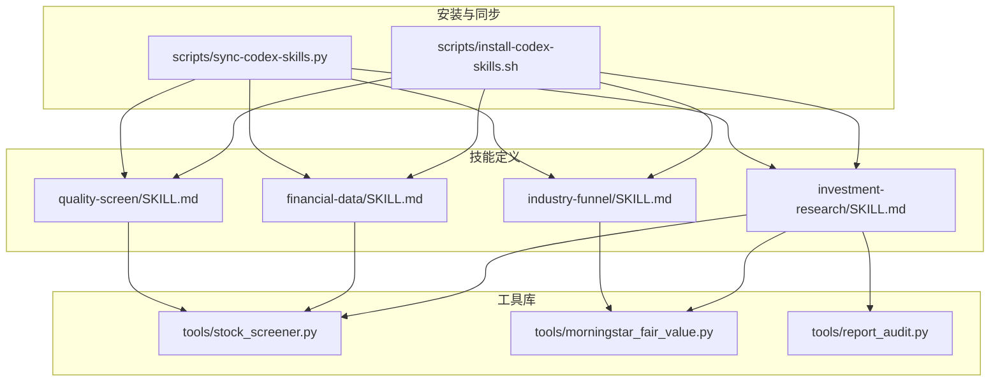
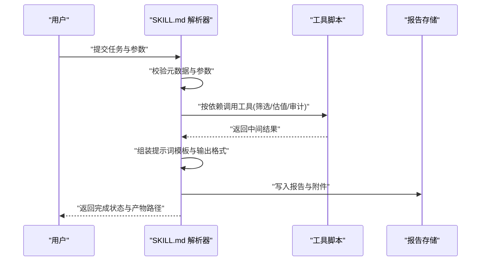
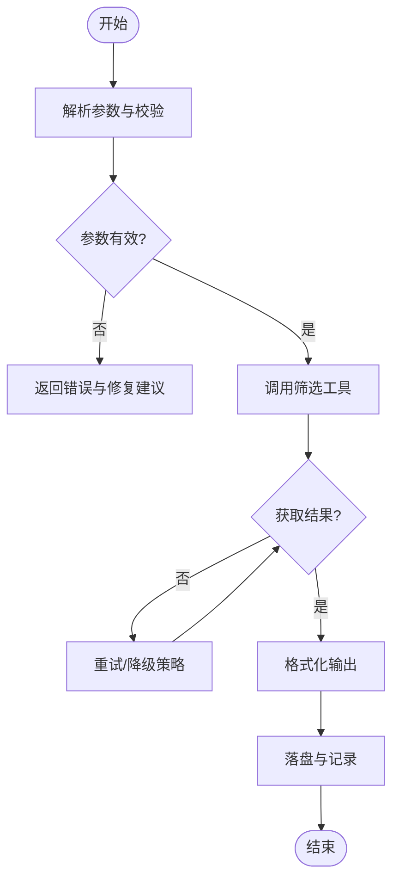
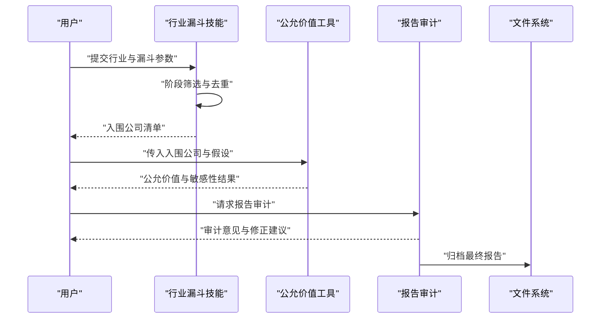
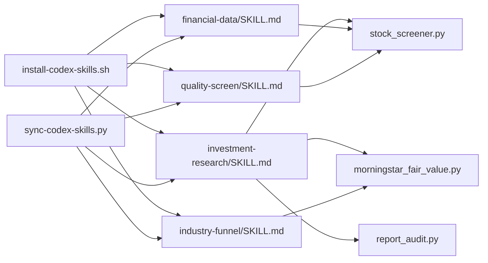

# 自定义技能开发

<cite>
**本文引用的文件**   
- [AGENTS.md](file://AGENTS.md)
- [CLAUDE.md](file://CLAUDE.md)
- [install-codex-skills.sh](file://scripts/install-codex-skills.sh)
- [sync-codex-skills.py](file://scripts/sync-codex-skills.py)
- [investment-research/SKILL.md](file://codex-skills/investment-research/SKILL.md)
- [financial-data/SKILL.md](file://codex-skills/financial-data/SKILL.md)
- [quality-screen/SKILL.md](file://codex-skills/quality-screen/SKILL.md)
- [industry-funnel/SKILL.md](file://codex-skills/industry-funnel/SKILL.md)
- [stock_screener.py](file://tools/stock_screener.py)
- [morningstar_fair_value.py](file://tools/morningstar_fair_value.py)
- [report_audit.py](file://tools/report_audit.py)
</cite>

## 目录
1. [简介](#简介)
2. [项目结构](#项目结构)
3. [核心组件](#核心组件)
4. [架构总览](#架构总览)
5. [详细组件分析](#详细组件分析)
6. [依赖关系分析](#依赖关系分析)
7. [性能考虑](#性能考虑)
8. [故障排查指南](#故障排查指南)
9. [结论](#结论)
10. [附录](#附录)

## 简介
本指南面向希望在本项目中创建“自定义投资研究技能”的开发者。内容围绕 SKILL.md 的结构与语法规范展开，涵盖元数据定义、参数配置、提示词模板与输出格式设置；并提供从需求分析到设计、实现、测试、集成与部署维护的全流程实践建议。文档同时给出简单数据处理技能与复杂多步骤分析技能的示例路径，并包含调试技巧、性能优化与错误处理策略。

## 项目结构
本项目采用“以技能为中心”的组织方式：
- codex-skills：每个子目录代表一个技能，内含 SKILL.md（技能描述与执行约定）及可选 agents 等扩展资源。
- skills：集中存放常用技能清单或索引（便于快速发现）。
- tools：可复用的工具脚本（如筛选器、估值计算、报告审计），供技能在执行时调用。
- scripts：安装与同步脚本，用于将技能注册到工作区或分发到目标环境。
- reports：历史产出物（研究报告、图表等），可作为技能输出的参考样例。

图示来源
- [investment-research/SKILL.md](file://codex-skills/investment-research/SKILL.md)
- [financial-data/SKILL.md](file://codex-skills/financial-data/SKILL.md)
- [quality-screen/SKILL.md](file://codex-skills/quality-screen/SKILL.md)
- [industry-funnel/SKILL.md](file://codex-skills/industry-funnel/SKILL.md)
- [stock_screener.py](file://tools/stock_screener.py)
- [morningstar_fair_value.py](file://tools/morningstar_fair_value.py)
- [report_audit.py](file://tools/report_audit.py)
- [install-codex-skills.sh](file://scripts/install-codex-skills.sh)
- [sync-codex-skills.py](file://scripts/sync-codex-skills.py)

章节来源
- [AGENTS.md](file://AGENTS.md)
- [CLAUDE.md](file://CLAUDE.md)

## 核心组件
- SKILL.md 规范
  - 元数据：技能名称、版本、作者、适用场景、输入参数说明、输出格式约定、依赖工具列表、注意事项等。
  - 参数配置：必填/选填、类型、默认值、取值范围、校验规则。
  - 提示词模板：角色设定、任务拆解、约束条件、风格与语气、引用规范。
  - 输出格式：结构化字段、表格/图表要求、文件命名与落盘路径、版本与时间戳。
- 工具脚本
  - stock_screener.py：通用股票筛选能力，支持多维度指标组合与结果导出。
  - morningstar_fair_value.py：晨星公允价值估算辅助，提供关键假设与敏感性分析。
  - report_audit.py：报告质量审计，检查一致性、完整性与合规性。
- 安装与同步
  - install-codex-skills.sh：一键安装技能到工作区，建立软链接或复制必要文件。
  - sync-codex-skills.py：增量同步远程/本地技能变更，保持多环境一致。

章节来源
- [investment-research/SKILL.md](file://codex-skills/investment-research/SKILL.md)
- [financial-data/SKILL.md](file://codex-skills/financial-data/SKILL.md)
- [quality-screen/SKILL.md](file://codex-skills/quality-screen/SKILL.md)
- [industry-funnel/SKILL.md](file://codex-skills/industry-funnel/SKILL.md)
- [stock_screener.py](file://tools/stock_screener.py)
- [morningstar_fair_value.py](file://tools/morningstar_fair_value.py)
- [report_audit.py](file://tools/report_audit.py)
- [install-codex-skills.sh](file://scripts/install-codex-skills.sh)
- [sync-codex-skills.py](file://scripts/sync-codex-skills.py)

## 架构总览
下图展示了“用户触发 → 技能解析 → 工具调用 → 输出归档”的整体流程。

图示来源
- [investment-research/SKILL.md](file://codex-skills/investment-research/SKILL.md)
- [financial-data/SKILL.md](file://codex-skills/financial-data/SKILL.md)
- [stock_screener.py](file://tools/stock_screener.py)
- [morningstar_fair_value.py](file://tools/morningstar_fair_value.py)
- [report_audit.py](file://tools/report_audit.py)

## 详细组件分析

### SKILL.md 结构与语法规范
- 元数据定义
  - 字段建议：名称、版本、作者、描述、适用市场/行业、输入参数、输出格式、依赖工具、注意事项、更新日志。
  - 校验规则：必填项缺失应拒绝执行；类型不匹配需给出明确错误信息。
- 参数配置
  - 类型：字符串、数值、布尔、枚举、数组、对象。
  - 约束：最小/最大值、正则表达式、枚举集合、默认值。
  - 示例：在财务数据类技能中，常见参数包括股票代码、起止日期、币种、报表口径等。
- 提示词模板
  - 角色与背景：明确分析师视角与方法论。
  - 任务拆解：分步指令，避免一次性长提示导致失控。
  - 约束与风格：字数限制、术语统一、引用来源标注。
- 输出格式设置
  - 结构化字段：标题、摘要、关键指标、风险点、结论与建议。
  - 文件组织：按公司/主题/日期分层，附带版本号与时间戳。
  - 图表与表格：统一样式与单位，确保可重复生成。

章节来源
- [investment-research/SKILL.md](file://codex-skills/investment-research/SKILL.md)
- [financial-data/SKILL.md](file://codex-skills/financial-data/SKILL.md)
- [quality-screen/SKILL.md](file://codex-skills/quality-screen/SKILL.md)
- [industry-funnel/SKILL.md](file://codex-skills/industry-funnel/SKILL.md)

### 创建新投资研究技能：从零到一
- 需求分析
  - 明确目标：解决什么问题？覆盖哪些标的/行业？输出给谁看？
  - 输入来源：财报、行情、新闻、第三方数据（如晨星公允价值）。
  - 约束条件：时效性、准确性、可解释性、合规性。
- 技能设计
  - 参数设计：最小可用集 + 扩展开关（如是否包含敏感性分析）。
  - 流程设计：数据采集 → 清洗 → 分析 → 可视化 → 审计 → 归档。
  - 依赖选择：优先复用现有工具，减少重复造轮子。
- 实现步骤
  - 新建目录与 SKILL.md，填写完整元数据与参数说明。
  - 编写提示词模板，明确分步执行与质量控制点。
  - 对接工具脚本，定义输入输出契约与错误码。
  - 增加单元测试与回归用例，覆盖边界与异常路径。
- 测试方法
  - 单测：参数校验、工具接口、输出格式。
  - 集成测：端到端跑通，验证报告完整性与一致性。
  - 回归测：历史案例重放，确保变更不破坏既有产出。

章节来源
- [investment-research/SKILL.md](file://codex-skills/investment-research/SKILL.md)
- [financial-data/SKILL.md](file://codex-skills/financial-data/SKILL.md)
- [stock_screener.py](file://tools/stock_screener.py)
- [morningstar_fair_value.py](file://tools/morningstar_fair_value.py)
- [report_audit.py](file://tools/report_audit.py)

### 示例一：简单数据处理技能（股票筛选）
- 目标：基于给定指标阈值筛选候选股票，输出标准化清单。
- 关键参数：代码集合、指标字典、阈值、排序与分页。
- 工具依赖：stock_screener.py。
- 输出：CSV/JSON 清单、简要统计摘要。

图示来源
- [stock_screener.py](file://tools/stock_screener.py)
- [quality-screen/SKILL.md](file://codex-skills/quality-screen/SKILL.md)

章节来源
- [quality-screen/SKILL.md](file://codex-skills/quality-screen/SKILL.md)
- [stock_screener.py](file://tools/stock_screener.py)

### 示例二：复杂多步骤分析技能（行业漏斗+公允价值评估）
- 目标：先进行行业漏斗筛选，再对入围公司进行公允价值评估与对比。
- 关键参数：行业分类、漏斗阶段、估值模型假设、可比公司集合。
- 工具依赖：industry-funnel 技能逻辑、morningstar_fair_value.py。
- 输出：漏斗各阶段公司清单、公允价值区间、敏感性分析与风险提示。

图示来源
- [industry-funnel/SKILL.md](file://codex-skills/industry-funnel/SKILL.md)
- [morningstar_fair_value.py](file://tools/morningstar_fair_value.py)
- [report_audit.py](file://tools/report_audit.py)

章节来源
- [industry-funnel/SKILL.md](file://codex-skills/industry-funnel/SKILL.md)
- [morningstar_fair_value.py](file://tools/morningstar_fair_value.py)
- [report_audit.py](file://tools/report_audit.py)

### 示例三：财务数据加工技能（财报提取与对齐）
- 目标：从多源财报中提取关键科目，统一口径并对齐时间序列。
- 关键参数：公司集合、报告期、币种、会计政策映射表。
- 工具依赖：financial-data 技能逻辑、stock_screener.py（用于批量拉取）。
- 输出：标准化财务报表、差异说明与数据质量报告。

章节来源
- [financial-data/SKILL.md](file://codex-skills/financial-data/SKILL.md)
- [stock_screener.py](file://tools/stock_screener.py)

## 依赖关系分析
- 直接依赖
  - 技能 SKILL.md 声明其所需工具与外部数据源。
  - 工具脚本之间通过标准输入输出或文件契约交互。
- 间接依赖
  - 安装与同步脚本负责将技能与工具装配到运行环境。
- 潜在循环
  - 应避免技能间相互强依赖，必要时引入编排层解耦。

图示来源
- [investment-research/SKILL.md](file://codex-skills/investment-research/SKILL.md)
- [financial-data/SKILL.md](file://codex-skills/financial-data/SKILL.md)
- [quality-screen/SKILL.md](file://codex-skills/quality-screen/SKILL.md)
- [industry-funnel/SKILL.md](file://codex-skills/industry-funnel/SKILL.md)
- [stock_screener.py](file://tools/stock_screener.py)
- [morningstar_fair_value.py](file://tools/morningstar_fair_value.py)
- [report_audit.py](file://tools/report_audit.py)
- [install-codex-skills.sh](file://scripts/install-codex-skills.sh)
- [sync-codex-skills.py](file://scripts/sync-codex-skills.py)

章节来源
- [AGENTS.md](file://AGENTS.md)
- [CLAUDE.md](file://CLAUDE.md)

## 性能考虑
- 批处理与并行
  - 对大规模标的使用批量接口与并发控制，避免单点瓶颈。
- 缓存与增量
  - 对静态数据（如行业分类、可比公司）做缓存；对动态数据（行情、财报）采用增量更新。
- 内存与I/O
  - 大文件流式读写，避免一次性加载；输出分片与压缩。
- 幂等与重试
  - 工具调用具备幂等性与退避重试，保障稳定性。
- 监控与度量
  - 记录耗时、失败率与资源占用，定位热点路径。

[本节为通用指导，无需特定文件来源]

## 故障排查指南
- 常见问题
  - 参数校验失败：检查必填项、类型与取值范围。
  - 工具调用超时：确认网络、配额与限流策略。
  - 输出不一致：核对模板版本与数据源时间戳。
- 定位手段
  - 启用详细日志，记录入参、出参与中间状态。
  - 使用报告审计工具进行一致性检查。
  - 回滚到上一稳定版本，逐步隔离变更。
- 恢复策略
  - 自动重试与降级（例如切换备用数据源）。
  - 人工复核通道与快速修复补丁。

章节来源
- [report_audit.py](file://tools/report_audit.py)
- [install-codex-skills.sh](file://scripts/install-codex-skills.sh)
- [sync-codex-skills.py](file://scripts/sync-codex-skills.py)

## 结论
通过统一的 SKILL.md 规范与可复用的工具脚本，本项目实现了“低门槛、高内聚、易扩展”的技能体系。遵循本文档的设计与实现建议，可以快速构建从简单数据处理到复杂多步骤分析的投资研究技能，并在集成、部署与维护阶段保持稳定与高效。

[本节为总结性内容，无需特定文件来源]

## 附录
- 最佳实践清单
  - 明确职责边界：每个技能聚焦单一业务域。
  - 强化契约：参数与输出严格校验与文档化。
  - 可观测性：全链路日志与指标上报。
  - 版本管理：SKILL.md 与工具脚本同步演进。
- 集成与部署
  - 使用安装脚本将技能注册到工作区。
  - 使用同步脚本在多环境保持一致。
  - 将报告输出纳入版本控制与归档策略。

章节来源
- [install-codex-skills.sh](file://scripts/install-codex-skills.sh)
- [sync-codex-skills.py](file://scripts/sync-codex-skills.py)