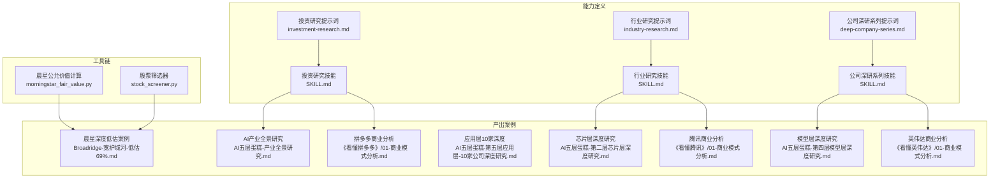
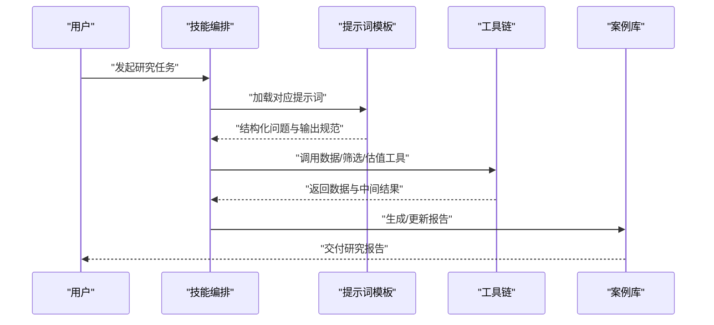
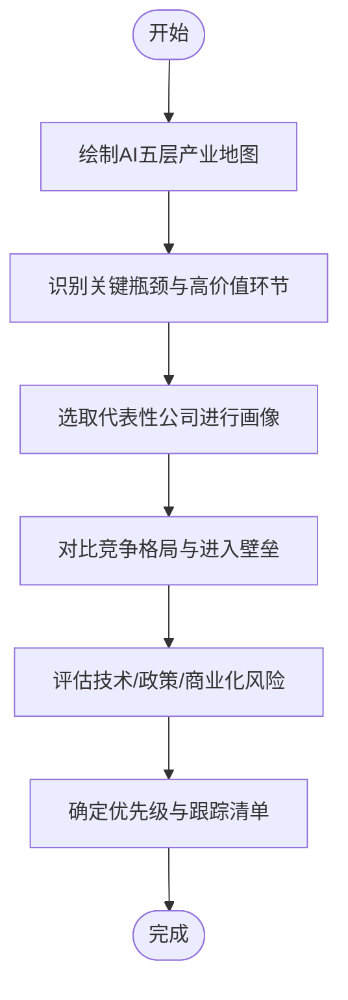
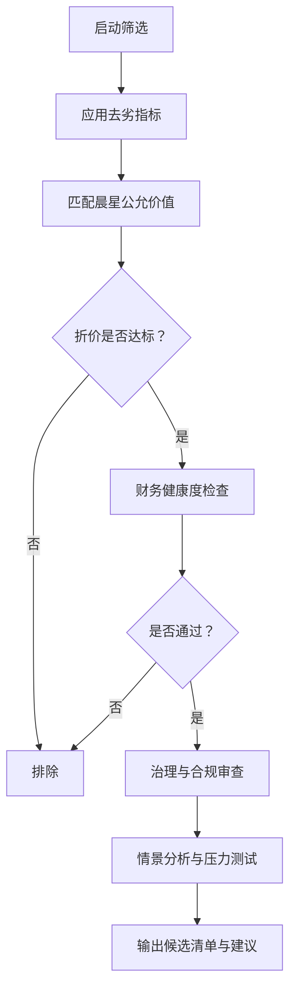
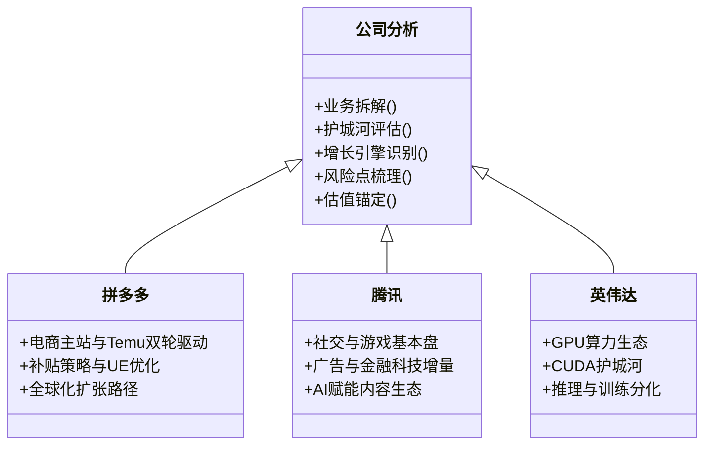
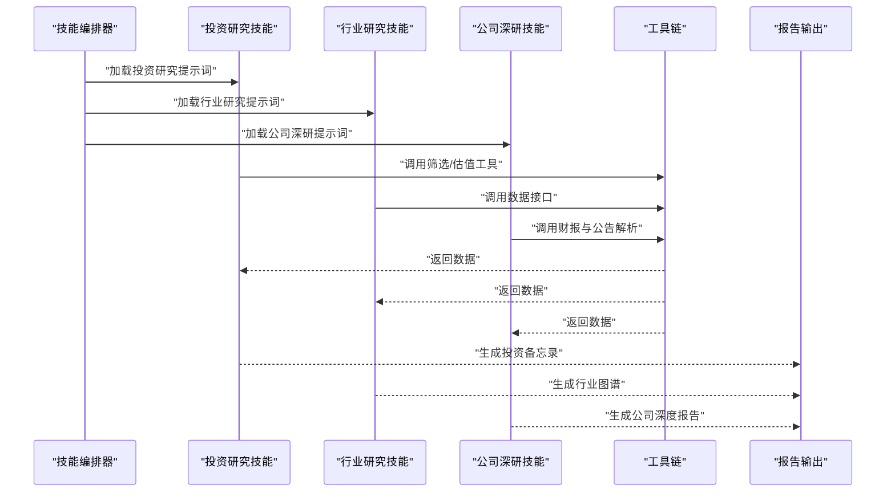
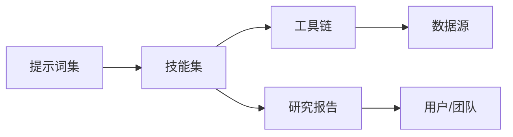

# 实战案例库

<cite>
**本文引用的文件**   
- [README_EN.md](file://README_EN.md)
- [AGENTS.md](file://AGENTS.md)
- [CLAUDE.md](file://CLAUDE.md)
- [ROADMAP.md](file://docs/ROADMAP.md)
- [codex-prompts/investment-research.md](file://codex-prompts/investment-research.md)
- [codex-prompts/industry-research.md](file://codex-prompts/industry-research.md)
- [codex-prompts/deep-company-series.md](file://codex-prompts/deep-company-series.md)
- [codex-skills/investment-research/SKILL.md](file://codex-skills/investment-research/SKILL.md)
- [codex-skills/industry-research/SKILL.md](file://codex-skills/industry-research/SKILL.md)
- [codex-skills/deep-company-series/SKILL.md](file://codex-skills/deep-company-series/SKILL.md)
- [reports/AI产业研究/AI五层蛋糕-产业全景研究-20260605.md](file://reports/AI产业研究/AI五层蛋糕-产业全景研究-20260605.md)
- [reports/AI产业研究/AI五层蛋糕-第二层芯片层深度研究-20260605.md](file://reports/AI产业研究/AI五层蛋糕-第二层芯片层深度研究-20260605.md)
- [reports/AI产业研究/AI五层蛋糕-第四层模型层深度研究-20260605.md](file://reports/AI产业研究/AI五层蛋糕-第四层模型层深度研究-20260605.md)
- [reports/AI产业研究/AI五层蛋糕-第五层应用层-10家公司深度研究-20260605.md](file://reports/AI产业研究/AI五层蛋糕-第五层应用层-10家公司深度研究-20260605.md)
- [reports/晨星深度低估/Broadridge-宽护城河-低估69%/Broadridge-宽护城河-低估69%.md](file://reports/晨星深度低估/Broadridge-宽护城河-低估69%/Broadridge-宽护城河-低估69%.md)
- [reports/晨星深度低估/PayPal-窄护城河-低估80%/PayPal-窄护城河-低估80%.md](file://reports/晨星深度低估/PayPal-窄护城河-低估80%/PayPal-窄护城河-低估80%.md)
- [reports/拼多多/《看懂拼多多》/01-商业模式分析-段永平视角.md](file://reports/拼多多/《看懂拼多多》/01-商业模式分析-段永平视角.md)
- [reports/腾讯/《看懂腾讯》/01-商业模式分析-段永平视角.md](file://reports/腾讯/《看懂腾讯》/01-商业模式分析-段永平视角.md)
- [reports/英伟达/《看懂英伟达》/01-商业模式分析-段永平视角.md](file://reports/英伟达/《看懂英伟达》/01-商业模式分析-段永平视角.md)
- [tools/morningstar_fair_value.py](file://tools/morningstar_fair_value.py)
- [tools/stock_screener.py](file://tools/stock_screener.py)
</cite>

## 目录
1. [引言](#引言)
2. [项目结构](#项目结构)
3. [核心组件](#核心组件)
4. [架构总览](#架构总览)
5. [详细组件分析](#详细组件分析)
6. [依赖分析](#依赖分析)
7. [性能与效率考量](#性能与效率考量)
8. [故障排查指南](#故障排查指南)
9. [结论](#结论)
10. [附录：模板与学习路径](#附录模板与学习路径)

## 引言
本“实战案例库”文档旨在系统化整理平台生成的投资研究报告案例，覆盖科技巨头深度分析、行业全景研究、深度低估公司挖掘等典型场景。通过解读每个案例的研究思路、分析框架、数据来源与结论推导过程，展示如何将AI技能系统应用于实际投研工作，并提供可复用的模板与最佳实践，帮助新用户快速上手并建立完整的学习路径。

## 项目结构
仓库采用“能力定义（prompts/skills）+ 工具脚本 + 产出报告”的三层组织方式：
- codex-prompts：面向大模型的提示词模板，定义不同研究任务的结构化输入与输出规范
- codex-skills：将提示词封装为可执行“技能”，提供统一入口与工作流编排
- reports：按主题/公司/日期归档的研究报告与子报告，形成案例库
- tools：数据抓取、筛选、估值计算与审计等辅助工具
- docs：路线图与专题文章

图表来源
- [codex-prompts/investment-research.md](file://codex-prompts/investment-research.md)
- [codex-prompts/industry-research.md](file://codex-prompts/industry-research.md)
- [codex-prompts/deep-company-series.md](file://codex-prompts/deep-company-series.md)
- [codex-skills/investment-research/SKILL.md](file://codex-skills/investment-research/SKILL.md)
- [codex-skills/industry-research/SKILL.md](file://codex-skills/industry-research/SKILL.md)
- [codex-skills/deep-company-series/SKILL.md](file://codex-skills/deep-company-series/SKILL.md)
- [tools/morningstar_fair_value.py](file://tools/morningstar_fair_value.py)
- [tools/stock_screener.py](file://tools/stock_screener.py)
- [reports/AI产业研究/AI五层蛋糕-产业全景研究-20260605.md](file://reports/AI产业研究/AI五层蛋糕-产业全景研究-20260605.md)
- [reports/AI产业研究/AI五层蛋糕-第二层芯片层深度研究-20260605.md](file://reports/AI产业研究/AI五层蛋糕-第二层芯片层深度研究-20260605.md)
- [reports/AI产业研究/AI五层蛋糕-第四层模型层深度研究-20260605.md](file://reports/AI产业研究/AI五层蛋糕-第四层模型层深度研究-20260605.md)
- [reports/AI产业研究/AI五层蛋糕-第五层应用层-10家公司深度研究-20260605.md](file://reports/AI产业研究/AI五层蛋糕-第五层应用层-10家公司深度研究-20260605.md)
- [reports/晨星深度低估/Broadridge-宽护城河-低估69%/Broadridge-宽护城河-低估69%.md](file://reports/晨星深度低估/Broadridge-宽护城河-低估69%/Broadridge-宽护城河-低估69%.md)
- [reports/拼多多/《看懂拼多多》/01-商业模式分析-段永平视角.md](file://reports/拼多多/《看懂拼多多》/01-商业模式分析-段永平视角.md)
- [reports/腾讯/《看懂腾讯》/01-商业模式分析-段永平视角.md](file://reports/腾讯/《看懂腾讯》/01-商业模式分析-段永平视角.md)
- [reports/英伟达/《看懂英伟达》/01-商业模式分析-段永平视角.md](file://reports/英伟达/《看懂英伟达》/01-商业模式分析-段永平视角.md)

章节来源
- [README_EN.md](file://README_EN.md)
- [AGENTS.md](file://AGENTS.md)
- [CLAUDE.md](file://CLAUDE.md)
- [docs/ROADMAP.md](file://docs/ROADMAP.md)

## 核心组件
- 提示词体系（codex-prompts）：定义投资研究、行业研究与公司深研的标准流程、关键问题清单与输出结构，确保报告一致性与可复用性
- 技能封装（codex-skills）：将提示词转化为可执行的“技能”，提供统一的调用入口、参数约束与协作编排
- 工具链（tools）：包括晨星公允价值计算、股票筛选、财报审计等，支撑数据获取、量化筛选与质量校验
- 案例库（reports）：以公司或主题为维度沉淀研究报告，包含多视角（商业模式、财务估值、竞争格局、风险管理）与多粒度（全景扫描到单公司深挖）

章节来源
- [codex-prompts/investment-research.md](file://codex-prompts/investment-research.md)
- [codex-prompts/industry-research.md](file://codex-prompts/industry-research.md)
- [codex-prompts/deep-company-series.md](file://codex-prompts/deep-company-series.md)
- [codex-skills/investment-research/SKILL.md](file://codex-skills/investment-research/SKILL.md)
- [codex-skills/industry-research/SKILL.md](file://codex-skills/industry-research/SKILL.md)
- [codex-skills/deep-company-series/SKILL.md](file://codex-skills/deep-company-series/SKILL.md)
- [tools/morningstar_fair_value.py](file://tools/morningstar_fair_value.py)
- [tools/stock_screener.py](file://tools/stock_screener.py)

## 架构总览
整体架构围绕“提示词→技能→工具→报告”的流水线展开：
- 输入：研究主题/公司名单/筛选条件
- 处理：技能驱动的多角色协作（行业研究员、公司分析师、估值专家、风控评估）
- 数据：工具链提供的市场数据、财务指标、公允价值与筛选结果
- 输出：结构化研究报告与子报告，支持横向对比与纵向深挖

图表来源
- [codex-skills/investment-research/SKILL.md](file://codex-skills/investment-research/SKILL.md)
- [codex-skills/industry-research/SKILL.md](file://codex-skills/industry-research/SKILL.md)
- [codex-skills/deep-company-series/SKILL.md](file://codex-skills/deep-company-series/SKILL.md)
- [tools/morningstar_fair_value.py](file://tools/morningstar_fair_value.py)
- [tools/stock_screener.py](file://tools/stock_screener.py)

## 详细组件分析

### 组件A：行业全景研究（AI五层蛋糕）
- 研究思路：从产业链分层切入，自上而下构建“基础设施—芯片—模型—应用”的全景图，再逐层聚焦关键卡脖子环节与高价值节点
- 分析框架：产业地图→关键环节识别→代表公司画像→竞争格局与进入壁垒→风险与机会
- 数据来源：公开资料、研报、公司公告、行业数据库；结合工具进行交叉验证
- 结论推导：基于层级贡献度、技术替代路径与商业化落地节奏，给出优先级排序与跟踪要点

图表来源
- [reports/AI产业研究/AI五层蛋糕-产业全景研究-20260605.md](file://reports/AI产业研究/AI五层蛋糕-产业全景研究-20260605.md)
- [reports/AI产业研究/AI五层蛋糕-第二层芯片层深度研究-20260605.md](file://reports/AI产业研究/AI五层蛋糕-第二层芯片层深度研究-20260605.md)
- [reports/AI产业研究/AI五层蛋糕-第四层模型层深度研究-20260605.md](file://reports/AI产业研究/AI五层蛋糕-第四层模型层深度研究-20260605.md)
- [reports/AI产业研究/AI五层蛋糕-第五层应用层-10家公司深度研究-20260605.md](file://reports/AI产业研究/AI五层蛋糕-第五层应用层-10家公司深度研究-20260605.md)

章节来源
- [codex-prompts/industry-research.md](file://codex-prompts/industry-research.md)
- [codex-skills/industry-research/SKILL.md](file://codex-skills/industry-research/SKILL.md)
- [reports/AI产业研究/AI五层蛋糕-产业全景研究-20260605.md](file://reports/AI产业研究/AI五层蛋糕-产业全景研究-20260605.md)
- [reports/AI产业研究/AI五层蛋糕-第二层芯片层深度研究-20260605.md](file://reports/AI产业研究/AI五层蛋糕-第二层芯片层深度研究-20260605.md)
- [reports/AI产业研究/AI五层蛋糕-第四层模型层深度研究-20260605.md](file://reports/AI产业研究/AI五层蛋糕-第四层模型层深度研究-20260605.md)
- [reports/AI产业研究/AI五层蛋糕-第五层应用层-10家公司深度研究-20260605.md](file://reports/AI产业研究/AI五层蛋糕-第五层应用层-10家公司深度研究-20260605.md)

### 组件B：深度低估公司挖掘（晨星公允价值+去劣筛选）
- 研究思路：先以“宽护城河+显著折价”为初筛条件，再用财务质量与治理风险做二次过滤，最终形成可跟踪的投资候选池
- 分析框架：公允价值估算→安全边际测算→财务健康度检查→治理与合规审查→情景分析与压力测试
- 数据来源：晨星公允价值、财务报表、公告与新闻；工具链提供自动化计算与批量筛选
- 结论推导：在给定假设下计算合理价格区间与安全边际，结合风险因素给出买入/观察/回避建议

图表来源
- [tools/morningstar_fair_value.py](file://tools/morningstar_fair_value.py)
- [tools/stock_screener.py](file://tools/stock_screener.py)
- [reports/晨星深度低估/Broadridge-宽护城河-低估69%/Broadridge-宽护城河-低估69%.md](file://reports/晨星深度低估/Broadridge-宽护城河-低估69%/Broadridge-宽护城河-低估69%.md)
- [reports/晨星深度低估/PayPal-窄护城河-低估80%/PayPal-窄护城河-低估80%.md](file://reports/晨星深度低估/PayPal-窄护城河-低估80%/PayPal-窄护城河-低估80%.md)

章节来源
- [tools/morningstar_fair_value.py](file://tools/morningstar_fair_value.py)
- [tools/stock_screener.py](file://tools/stock_screener.py)
- [reports/晨星深度低估/Broadridge-宽护城河-低估69%/Broadridge-宽护城河-低估69%.md](file://reports/晨星深度低估/Broadridge-宽护城河-低估69%/Broadridge-宽护城河-低估69%.md)
- [reports/晨星深度低估/PayPal-窄护城河-低估80%/PayPal-窄护城河-低估80%.md](file://reports/晨星深度低估/PayPal-窄护城河-低估80%/PayPal-窄护城河-低估80%.md)

### 组件C：科技巨头深度分析（拼多多/腾讯/英伟达）
- 研究思路：以“商业模式—护城河—增长引擎—风险点—估值锚”为主线，结合管理层战略与行业趋势进行综合判断
- 分析框架：业务拆解→收入结构与利润驱动→竞争位势与网络效应→资本配置与股东回报→估值方法与敏感性分析
- 数据来源：公司年报/季报、投资者日材料、第三方研究与公开访谈
- 结论推导：在多情景假设下推演中长期盈利路径，给出目标区间与跟踪指标

图表来源
- [reports/拼多多/《看懂拼多多》/01-商业模式分析-段永平视角.md](file://reports/拼多多/《看懂拼多多》/01-商业模式分析-段永平视角.md)
- [reports/腾讯/《看懂腾讯》/01-商业模式分析-段永平视角.md](file://reports/腾讯/《看懂腾讯》/01-商业模式分析-段永平视角.md)
- [reports/英伟达/《看懂英伟达》/01-商业模式分析-段永平视角.md](file://reports/英伟达/《看懂英伟达》/01-商业模式分析-段永平视角.md)

章节来源
- [codex-prompts/deep-company-series.md](file://codex-prompts/deep-company-series.md)
- [codex-skills/deep-company-series/SKILL.md](file://codex-skills/deep-company-series/SKILL.md)
- [reports/拼多多/《看懂拼多多》/01-商业模式分析-段永平视角.md](file://reports/拼多多/《看懂拼多多》/01-商业模式分析-段永平视角.md)
- [reports/腾讯/《看懂腾讯》/01-商业模式分析-段永平视角.md](file://reports/腾讯/《看懂腾讯》/01-商业模式分析-段永平视角.md)
- [reports/英伟达/《看懂英伟达》/01-商业模式分析-段永平视角.md](file://reports/英伟达/《看懂英伟达》/01-商业模式分析-段永平视角.md)

### 组件D：AI技能系统在工作流中的应用
- 角色分工：行业研究员、公司分析师、估值专家、风控评估员协同作业
- 编排机制：技能作为统一入口，按任务类型选择对应提示词与工具组合
- 质量控制：标准化输出结构、交叉验证与审计工具保障一致性

图表来源
- [codex-skills/investment-research/SKILL.md](file://codex-skills/investment-research/SKILL.md)
- [codex-skills/industry-research/SKILL.md](file://codex-skills/industry-research/SKILL.md)
- [codex-skills/deep-company-series/SKILL.md](file://codex-skills/deep-company-series/SKILL.md)
- [tools/morningstar_fair_value.py](file://tools/morningstar_fair_value.py)
- [tools/stock_screener.py](file://tools/stock_screener.py)

## 依赖分析
- 内部依赖
  - 技能对提示词的强依赖：不同任务需匹配相应提示词以保证输出质量
  - 工具链对数据的依赖：晨星公允价值与筛选器需要稳定数据源与清洗逻辑
- 外部依赖
  - 数据提供方：晨星、交易所公告、财经媒体与第三方数据库
  - 大模型服务：用于文本生成、摘要与结构化抽取
- 潜在耦合点
  - 工具接口变更可能影响批量报告生成
  - 提示词版本升级需同步更新技能编排与用例

图表来源
- [codex-prompts/investment-research.md](file://codex-prompts/investment-research.md)
- [codex-prompts/industry-research.md](file://codex-prompts/industry-research.md)
- [codex-prompts/deep-company-series.md](file://codex-prompts/deep-company-series.md)
- [codex-skills/investment-research/SKILL.md](file://codex-skills/investment-research/SKILL.md)
- [codex-skills/industry-research/SKILL.md](file://codex-skills/industry-research/SKILL.md)
- [codex-skills/deep-company-series/SKILL.md](file://codex-skills/deep-company-series/SKILL.md)
- [tools/morningstar_fair_value.py](file://tools/morningstar_fair_value.py)
- [tools/stock_screener.py](file://tools/stock_screener.py)

## 性能与效率考量
- 批量化处理：利用筛选器与公允价值计算工具批量生成候选清单，减少人工重复劳动
- 并行化编排：多技能并行执行，缩短端到端产出时间
- 缓存与复用：对高频数据与中间结果进行缓存，避免重复计算
- 质量门禁：引入审计与校验步骤，降低返工率

[本节为通用指导，不直接分析具体文件]

## 故障排查指南
- 数据缺失或异常
  - 现象：工具运行报错或输出为空
  - 排查：确认数据源可用性、字段映射与权限设置
- 提示词不匹配
  - 现象：输出结构不符合预期
  - 排查：核对当前使用的提示词版本与技能绑定关系
- 报告不一致
  - 现象：同主题多次生成差异较大
  - 排查：固定随机种子、收敛参数与输入数据版本

章节来源
- [tools/morningstar_fair_value.py](file://tools/morningstar_fair_value.py)
- [tools/stock_screener.py](file://tools/stock_screener.py)

## 结论
本案例库通过“提示词—技能—工具—报告”的闭环，实现了从宏观产业到微观公司的全链路投研生产。借助标准化的研究框架与自动化工具，团队能够高效产出高质量、可复用的研究报告，并在实践中持续迭代方法论与模板。

[本节为总结性内容，不直接分析具体文件]

## 附录：模板与学习路径
- 推荐学习顺序
  1) 阅读行业全景研究案例，理解自顶向下的产业分析方法
  2) 学习深度低估公司挖掘流程，掌握估值与安全边际思维
  3) 研读科技巨头深度分析，熟悉商业模式与护城河评估
  4) 对照提示词与技能说明，逐步搭建自己的研究模板
- 参考模板与范例
  - 行业研究模板：参见行业研究提示词与AI五层蛋糕系列报告
  - 公司深研模板：参见公司深研提示词与拼多多/腾讯/英伟达案例
  - 低估筛选模板：参见晨星公允价值工具与相关案例

章节来源
- [codex-prompts/industry-research.md](file://codex-prompts/industry-research.md)
- [codex-prompts/deep-company-series.md](file://codex-prompts/deep-company-series.md)
- [codex-skills/industry-research/SKILL.md](file://codex-skills/industry-research/SKILL.md)
- [codex-skills/deep-company-series/SKILL.md](file://codex-skills/deep-company-series/SKILL.md)
- [reports/AI产业研究/AI五层蛋糕-产业全景研究-20260605.md](file://reports/AI产业研究/AI五层蛋糕-产业全景研究-20260605.md)
- [reports/晨星深度低估/Broadridge-宽护城河-低估69%/Broadridge-宽护城河-低估69%.md](file://reports/晨星深度低估/Broadridge-宽护城河-低估69%/Broadridge-宽护城河-低估69%.md)
- [reports/拼多多/《看懂拼多多》/01-商业模式分析-段永平视角.md](file://reports/拼多多/《看懂拼多多》/01-商业模式分析-段永平视角.md)
- [reports/腾讯/《看懂腾讯》/01-商业模式分析-段永平视角.md](file://reports/腾讯/《看懂腾讯》/01-商业模式分析-段永平视角.md)
- [reports/英伟达/《看懂英伟达》/01-商业模式分析-段永平视角.md](file://reports/英伟达/《看懂英伟达》/01-商业模式分析-段永平视角.md)