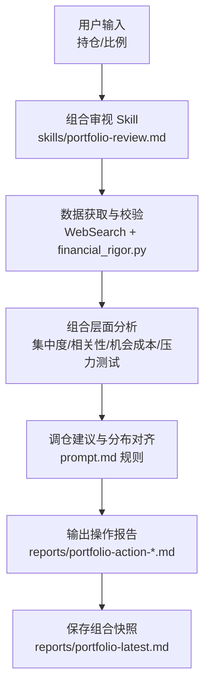
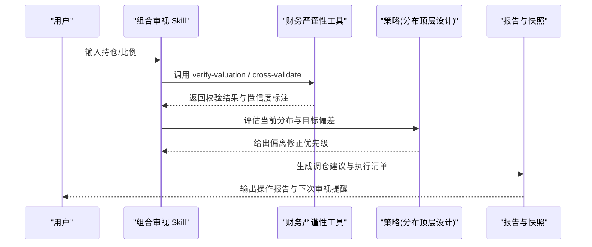
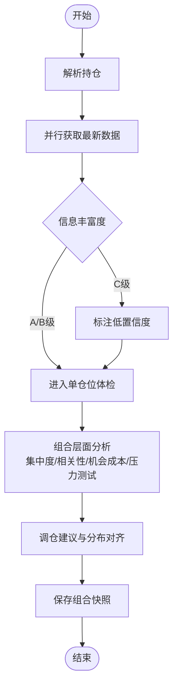
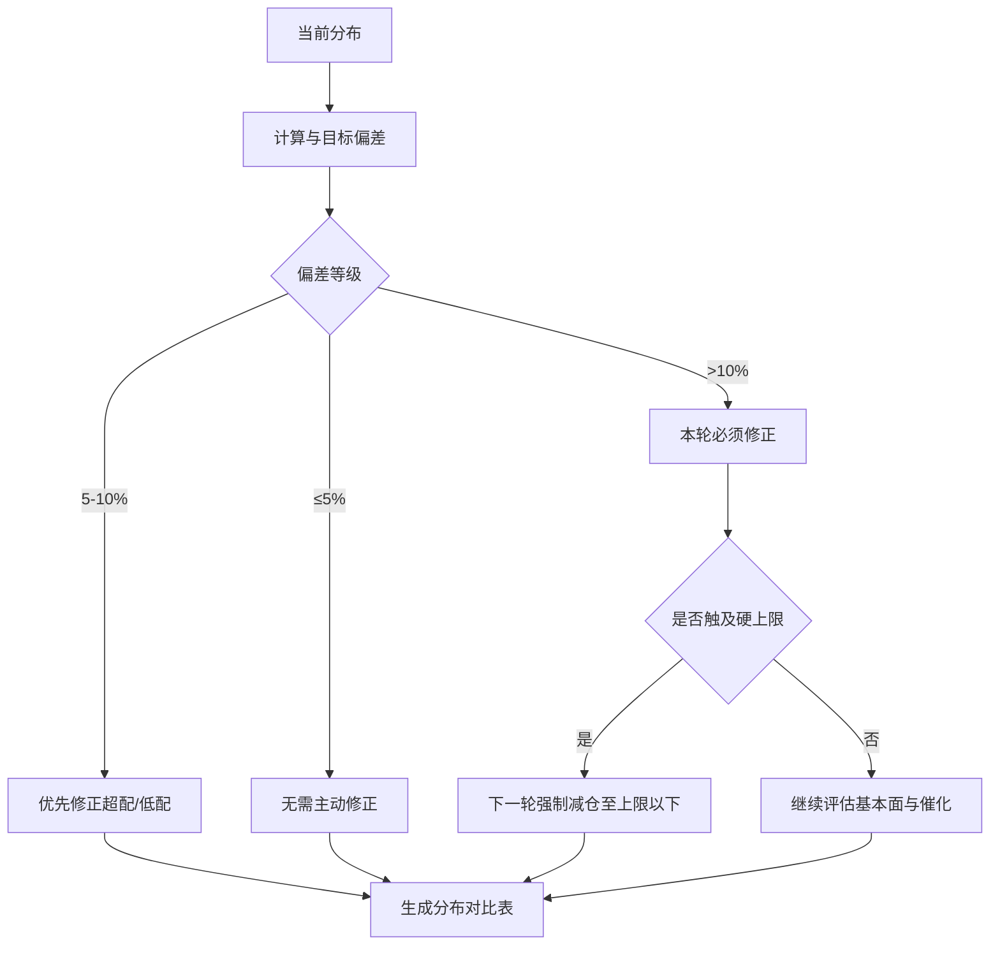
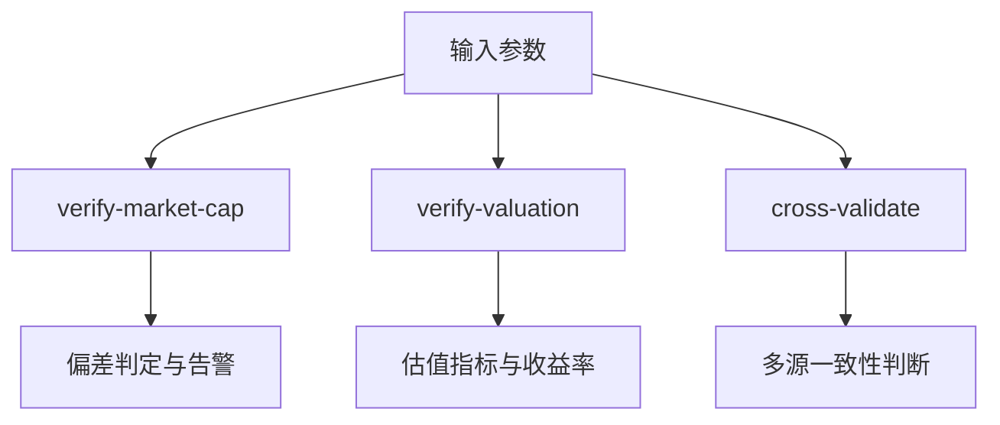
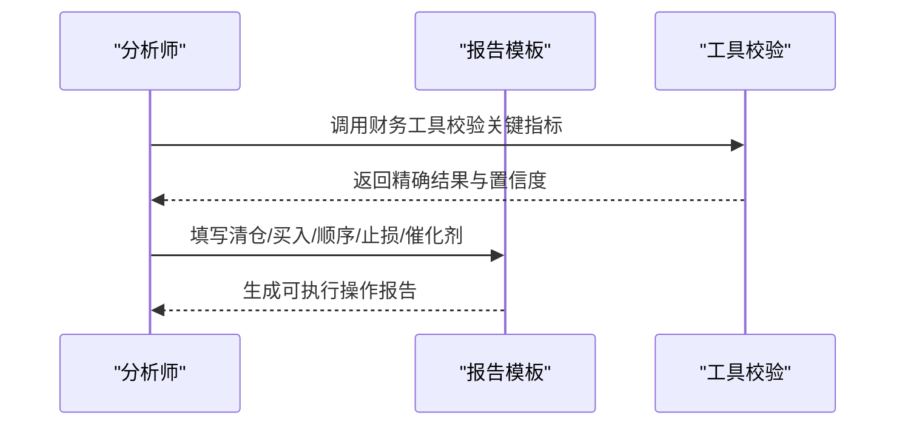
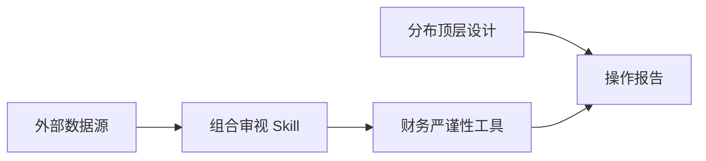

# 投资组合管理案例

<cite>
**本文引用的文件**
- [README.md](file://README.md)
- [CONTEXT.md](file://CONTEXT.md)
- [AGENTS.md](file://AGENTS.md)
- [prompt.md](file://prompt.md)
- [skills/portfolio-review.md](file://skills/portfolio-review.md)
- [tools/financial_rigor.py](file://tools/financial_rigor.py)
- [reports/portfolio-action-20260812-final.md](file://reports/portfolio-action-20260812-final.md)
- [reports/portfolio-5holdings-20260814.md](file://reports/portfolio-5holdings-20260814.md)
</cite>

## 目录
1. [引言](#引言)
2. [项目结构](#项目结构)
3. [核心组件](#核心组件)
4. [架构总览](#架构总览)
5. [详细组件分析](#详细组件分析)
6. [依赖关系分析](#依赖关系分析)
7. [性能与可维护性](#性能与可维护性)
8. [故障排查指南](#故障排查指南)
9. [结论](#结论)
10. [附录](#附录)

## 引言
本案例围绕“AI Berkshire”框架中的投资组合管理与优化展开，聚焦从“研究公司”到“管理组合”的闭环：以行业分布顶层设计为约束，结合多源数据、精确计算工具与投研流程，输出可执行的调仓方案与持续跟踪机制。该体系强调纪律化决策（集中度、相关性、机会成本、压力测试）、严谨的数据校验（精确十进制、多源交叉验证）以及可复现的研究流程。

## 项目结构
- 顶层规范与说明
  - README.md：整体框架、Skill 能力、快速开始、设计理念与实战报告索引
  - CONTEXT.md：面向 C 端 SaaS 的关键术语与编排流程定义
  - AGENTS.md：兼容层与生成规则、研究质量规则、编辑规则
- 组合管理入口与策略
  - skills/portfolio-review.md：组合审视与优化的标准流程
  - prompt.md：行业分布顶层设计、偏离修正规则、数字生成规则与最终方案模板
- 工具链
  - tools/financial_rigor.py：市值验算、估值指标验算、多源交叉验证、Benford 检测、精确计算器等
- 产出物
  - reports/portfolio-action-*.md：具体轮次的操作建议与执行清单
  - reports/portfolio-*.md：阶段性持仓快照与研究简报

**图表来源**
- [skills/portfolio-review.md:24-180](file://skills/portfolio-review.md#L24-L180)
- [prompt.md:26-142](file://prompt.md#L26-L142)
- [tools/financial_rigor.py:74-173](file://tools/financial_rigor.py#L74-L173)

**章节来源**
- [README.md:161-222](file://README.md#L161-L222)
- [CONTEXT.md:1-30](file://CONTEXT.md#L1-L30)
- [AGENTS.md:58-92](file://AGENTS.md#L58-L92)

## 核心组件
- 组合审视与优化流程（Skill）
  - 解析持仓、并行获取最新数据、单仓位体检、组合层面分析（集中度、相关性、机会成本、压力测试）、调仓建议、保存组合文件
- 行业分布顶层设计（策略）
  - 目标分布与硬上限、偏离修正规则、分布对比与数字生成规则（必须脚本计算并合计=100%）
- 财务严谨性工具（工具）
  - 市值验算、估值指标验算、多源交叉验证、Benford 检测、精确计算器（Decimal），确保关键数据可追溯、可复核
- 操作报告与执行清单（产出）
  - 明确清仓/买入标的、顺序、止损、催化剂日历、执行前后检查项

**章节来源**
- [skills/portfolio-review.md:24-180](file://skills/portfolio-review.md#L24-L180)
- [prompt.md:26-142](file://prompt.md#L26-L142)
- [tools/financial_rigor.py:74-173](file://tools/financial_rigor.py#L74-L173)
- [reports/portfolio-action-20260812-final.md:23-98](file://reports/portfolio-action-20260812-final.md#L23-L98)

## 架构总览
组合管理由“Skill 流程 + 策略约束 + 工具校验 + 报告产出”四层构成：
- Skill 层：标准化执行步骤，保证一致性
- Agent/工具层：并行数据抓取与精确计算，降低人为误差
- 策略层：以行业分布顶层设计为硬约束，驱动调仓方向
- 产出层：可审计的操作报告与组合快照，便于复盘与追踪

**图表来源**
- [skills/portfolio-review.md:24-180](file://skills/portfolio-review.md#L24-L180)
- [prompt.md:26-142](file://prompt.md#L26-L142)
- [tools/financial_rigor.py:74-173](file://tools/financial_rigor.py#L74-L173)

## 详细组件分析

### 组合审视与优化流程（Skill）
- 输入解析：支持百分比、股数+成本价、或读取已有组合文件
- 数据获取：后台 Agent 并行抓取股价、估值、财务变化、事件与一致预期；对每只持仓进行信息丰富度评级（A/B/C）
- 单仓位体检：基于 PE、买入逻辑是否变化、论文健康度与持有信心问答
- 组合层面分析：
  - 集中度：单一/前三大占比、现金占比
  - 相关性：主题/国家/货币暴露与共振风险
  - 机会成本：按预期年化回报排序，剔除低于现金的尾部仓位
  - 压力测试：宏观/行业情景下的回撤预估与对冲思路
- 输出：明确的组合健康度、最应做的一件事、最大风险；写入组合快照

**图表来源**
- [skills/portfolio-review.md:24-180](file://skills/portfolio-review.md#L24-L180)

**章节来源**
- [skills/portfolio-review.md:24-180](file://skills/portfolio-review.md#L24-L180)

### 行业分布顶层设计（策略）
- 目标分布与硬上限：AI平台/AI软件/AI硬件/非AI价值/现金，AI总暴露有上限
- 偏离修正规则：≤5%合理、5-10%警告优先修正、>10%必须修正；触及硬上限强制减仓
- 数字生成规则：所有百分比由脚本计算并打印，主类别合计=100%，小计行不参与求和
- 最终方案要求：包含调仓前/后/目标分布对比，解释偏差与后续计划

**图表来源**
- [prompt.md:26-142](file://prompt.md#L26-L142)

**章节来源**
- [prompt.md:26-142](file://prompt.md#L26-L142)

### 财务严谨性工具（工具）
- 市值验算：价格×股本 vs 报告市值，偏差阈值告警
- 估值指标验算：PE/PB/ROE/FCF Yield/股息率/PS，全部使用 Decimal 精确计算
- 多源交叉验证：中位数参考，逐源偏差提示
- Benford 检测与精确计算器：辅助异常检测与任意表达式计算

**图表来源**
- [tools/financial_rigor.py:74-173](file://tools/financial_rigor.py#L74-L173)

**章节来源**
- [tools/financial_rigor.py:74-173](file://tools/financial_rigor.py#L74-L173)

### 操作报告与执行清单（产出）
- 清仓/买入标的、数量、价格区间与核心理由
- 操作顺序与资金安排（含到账周期与分批买入）
- 执行前后检查项、止损与催化剂日历
- 执行后持仓结构与期望回报估算

**图表来源**
- [reports/portfolio-action-20260812-final.md:23-98](file://reports/portfolio-action-20260812-final.md#L23-L98)
- [tools/financial_rigor.py:74-173](file://tools/financial_rigor.py#L74-L173)

**章节来源**
- [reports/portfolio-action-20260812-final.md:23-98](file://reports/portfolio-action-20260812-final.md#L23-L98)

## 依赖关系分析
- Skill 与工具耦合
  - 组合审视 Skill 依赖财务严谨性工具进行数据校验与指标计算
- 策略与产出的强约束
  - 行业分布顶层设计决定调仓方向与优先级；最终方案必须包含分布对比与数字校验
- 外部数据与网络限制
  - 部分环境存在金融数据源拦截/限流，需在报告中注明近似值与核对建议

**图表来源**
- [skills/portfolio-review.md:24-180](file://skills/portfolio-review.md#L24-L180)
- [prompt.md:26-142](file://prompt.md#L26-L142)
- [tools/financial_rigor.py:74-173](file://tools/financial_rigor.py#L74-L173)

**章节来源**
- [AGENTS.md:58-92](file://AGENTS.md#L58-L92)

## 性能与可维护性
- 并行数据获取：通过后台 Agent 并行抓取，缩短等待时间
- 精确计算：使用 Decimal 避免浮点误差，提升可重复性与可信度
- 可维护性：Skill 与策略分离，工具独立可复用；报告模板统一，便于审计与回溯
- 成本与模型选择：深度研究消耗较高，建议先用轻量筛选再决定是否深入

[本节为通用指导，不直接分析具体文件]

## 故障排查指南
- 数据不可用或受限
  - 现象：无法获取实时收盘价或行情被限流
  - 处理：在报告中明确标注近似值来源与误差范围；在券商端核对后再用工具复算
- 分布计算不一致
  - 现象：百分比合计不为100%
  - 处理：严格使用脚本计算并打印；主类别合计校验不过禁止写报告
- 估值指标异常
  - 现象：PE/PB/FCF Yield 异常波动
  - 处理：使用 verify-valuation 重新计算；必要时 cross-validate 多源比对
- 执行偏差
  - 现象：实际成交价与计划差异较大
  - 处理：记录滑点原因，调整限价单策略与执行时段

**章节来源**
- [tools/financial_rigor.py:74-173](file://tools/financial_rigor.py#L74-L173)
- [prompt.md:134-142](file://prompt.md#L134-L142)
- [reports/portfolio-5holdings-20260814.md:1-91](file://reports/portfolio-5holdings-20260814.md#L1-L91)

## 结论
本投资组合管理案例以“Skill 流程 + 策略约束 + 工具校验 + 报告产出”为核心，形成从数据到决策再到执行的闭环。通过严格的分布顶层设计、精确的财务校验与标准化的审视流程，能够在复杂市场环境下保持纪律化、可复现的组合管理与调仓能力。

[本节为总结性内容，不直接分析具体文件]

## 附录
- 快速开始与 Skill 使用示例见仓库 README
- 组合审视与优化流程详见组合管理 Skill
- 行业分布顶层设计详见策略文档
- 财务严谨性工具命令与用法详见工具说明

[本节为补充说明，不直接分析具体文件]