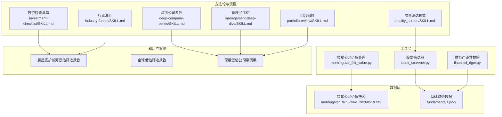
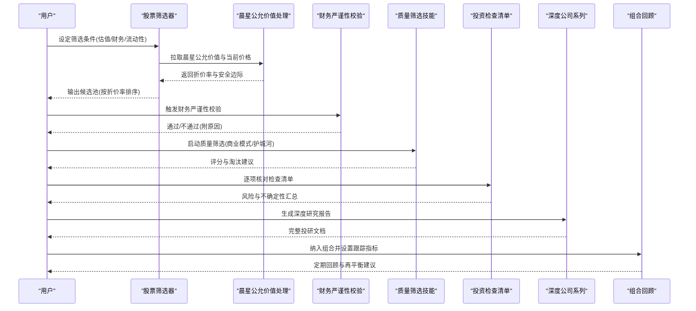
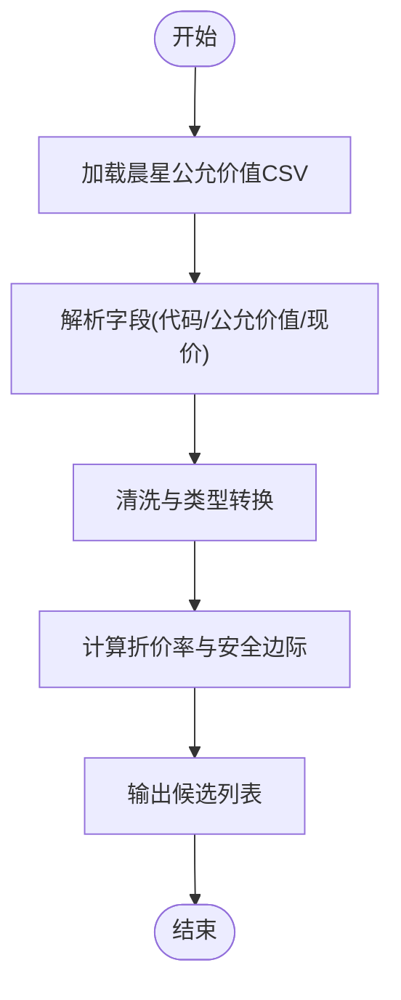
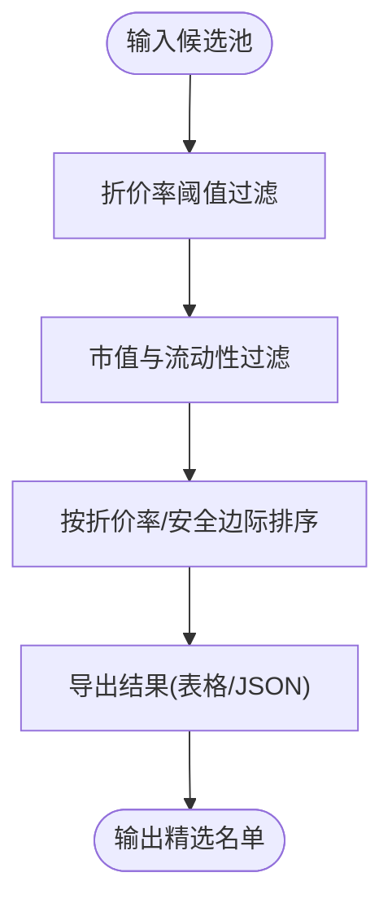
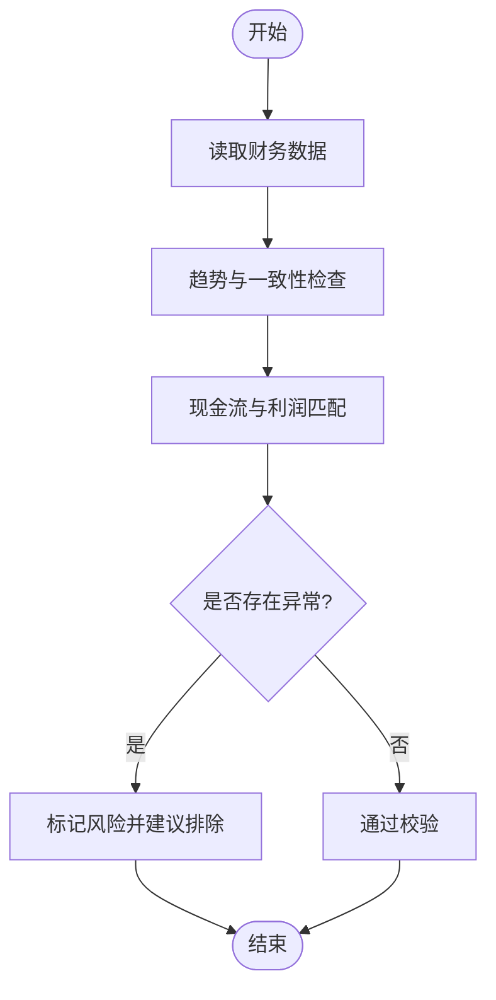
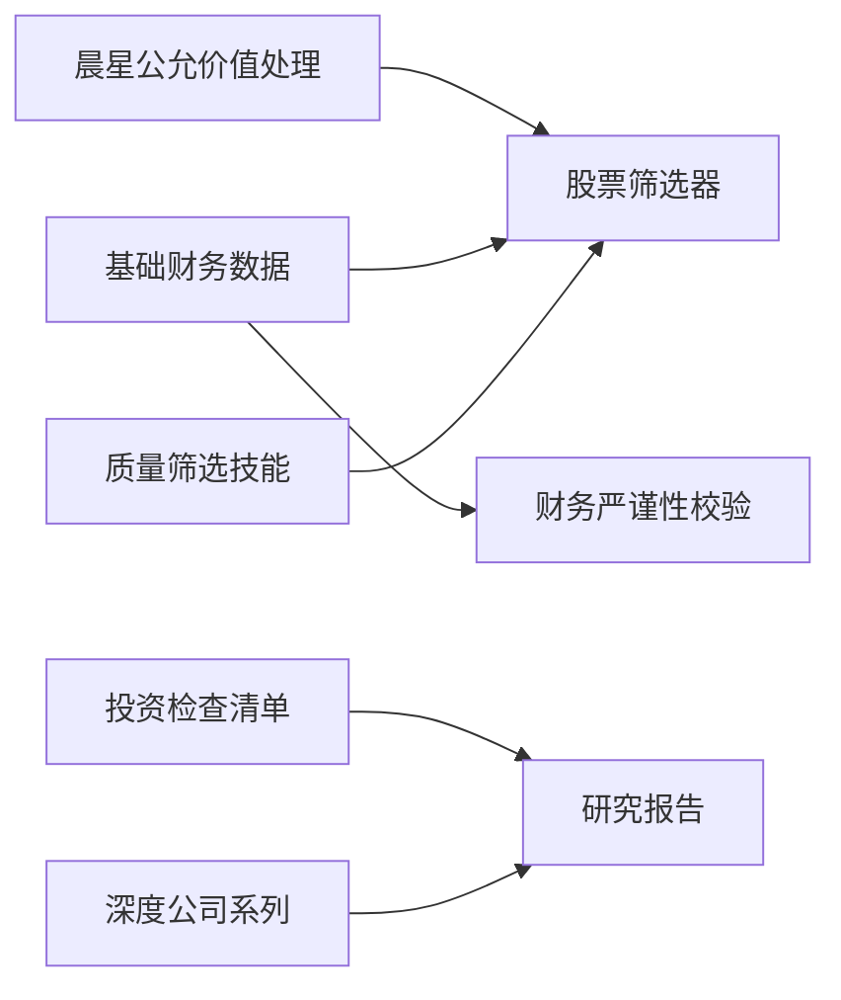

# 深度低估公司挖掘

<cite>
**本文引用的文件**   
- [README_EN.md](file://README_EN.md)
- [AGENTS.md](file://AGENTS.md)
- [CLAUDE.md](file://CLAUDE.md)
- [morningstar_fair_value.py](file://tools/morningstar_fair_value.py)
- [stock_screener.py](file://tools/stock_screener.py)
- [financial_rigor.py](file://tools/financial_rigor.py)
- [morningstar_fair_value_20260519.csv](file://data/morningstar_fair_value_20260519.csv)
- [fundamentals.json](file://data/fundamentals.json)
- [晨星宽护城河低估股票筛选-20260607.md](file://reports/晨星估值筛选/晨星宽护城河低估股票筛选-20260607.md)
- [晨星宽护城河全球低估筛选-20260607.md](file://reports/晨星估值筛选/晨星宽护城河全球低估筛选-20260607.md)
- [AI五层蛋糕-50家公司公允价值排名-20260606.md](file://reports/晨星估值筛选/AI五层蛋糕-50家公司公允价值排名-20260606.md)
- [拼多多-窄护城河-低估62%/最终报告.md](file://reports/晨星深度低估/拼多多-窄护城河-低估62%/最终报告.md)
- [阿里巴巴-宽护城河-低估94%/最终报告.md](file://reports/晨星深度低估/阿里巴巴-宽护城河-低估94%/最终报告.md)
- [腾讯音乐-窄护城河-低估176%/最终报告.md](file://reports/晨星深度低估/腾讯音乐-窄护城河-低估176%/最终报告.md)
- [耐克-宽护城河-低估128%/最终报告.md](file://reports/晨星深度低估/耐克-宽护城河-低估128%/最终报告.md)
- [金宝汤-宽护城河-低估175%/最终报告.md](file://reports/晨星深度低估/金宝汤-宽护城河-低估175%/最终报告.md)
- [quality_screen/SKILL.md](file://codex-skills/quality_screen/SKILL.md)
- [investment-checklist/SKILL.md](file://codex-skills/investment-checklist/SKILL.md)
- [deep-company-series/SKILL.md](file://codex-skills/deep-company-series/SKILL.md)
- [management-deep-dive/SKILL.md](file://codex-skills/management-deep-dive/SKILL.md)
- [industry-funnel/SKILL.md](file://codex-skills/industry-funnel/SKILL.md)
- [portfolio-review/SKILL.md](file://codex-skills/portfolio-review/SKILL.md)
</cite>

## 目录
1. [引言](#引言)
2. [项目结构](#项目结构)
3. [核心组件](#核心组件)
4. [架构总览](#架构总览)
5. [详细组件分析](#详细组件分析)
6. [依赖关系分析](#依赖关系分析)
7. [性能与可扩展性](#性能与可扩展性)
8. [故障排查指南](#故障排查指南)
9. [结论](#结论)
10. [附录：实践模板与案例](#附录实践模板与案例)

## 引言
本文件面向价值投资者，系统化阐述“基于晨星公允价值评估的深度低估公司挖掘”方法。内容覆盖从初步筛选、基本面验证、风险评估到最终投资决策的完整流程，并结合AI辅助工具（筛选器、财务严谨性校验、晨星公允价值数据）形成可复用的选股框架。文档同时提供多个真实案例路径，帮助读者将理论落地为实操。

## 项目结构
仓库围绕“投研工作流+工具脚本+案例报告”组织：
- 工具脚本：负责数据获取、筛选、财务严谨性校验与晨星公允价值处理
- 数据资产：包含晨星公允价值快照与基础财务数据
- 技能与提示词：定义投研流程、检查清单与深度研究规范
- 案例报告：覆盖多行业、多市场的深度低估公司研究与复盘

图表来源
- [morningstar_fair_value.py:1-200](file://tools/morningstar_fair_value.py#L1-L200)
- [stock_screener.py:1-200](file://tools/stock_screener.py#L1-L200)
- [financial_rigor.py:1-200](file://tools/financial_rigor.py#L1-L200)
- [morningstar_fair_value_20260519.csv:1-50](file://data/morningstar_fair_value_20260519.csv#L1-L50)
- [fundamentals.json:1-100](file://data/fundamentals.json#L1-L100)
- [quality_screen/SKILL.md:1-200](file://codex-skills/quality_screen/SKILL.md#L1-L200)
- [investment-checklist/SKILL.md:1-200](file://codex-skills/investment-checklist/SKILL.md#L1-L200)
- [deep-company-series/SKILL.md:1-200](file://codex-skills/deep-company-series/SKILL.md#L1-L200)
- [management-deep-dive/SKILL.md:1-200](file://codex-skills/management-deep-dive/SKILL.md#L1-L200)
- [industry-funnel/SKILL.md:1-200](file://codex-skills/industry-funnel/SKILL.md#L1-L200)
- [portfolio-review/SKILL.md:1-200](file://codex-skills/portfolio-review/SKILL.md#L1-L200)

章节来源
- [README_EN.md:1-200](file://README_EN.md#L1-L200)
- [AGENTS.md:1-200](file://AGENTS.md#L1-L200)
- [CLAUDE.md:1-200](file://CLAUDE.md#L1-L200)

## 核心组件
- 晨星公允价值处理模块：读取并清洗晨星公允价值数据，计算折价率与安全边际，生成候选池
- 股票筛选器：结合财务指标与估值阈值进行初筛，支持多维度过滤与排序
- 财务严谨性校验：对候选标的进行财务质量与一致性检验，剔除异常或不可靠样本
- 投研技能与检查清单：标准化研究流程，确保从商业模式、护城河、管理层到估值的闭环验证
- 案例库：以“宽/窄护城河+低估百分比”标签化呈现，便于对比与复盘

章节来源
- [morningstar_fair_value.py:1-200](file://tools/morningstar_fair_value.py#L1-L200)
- [stock_screener.py:1-200](file://tools/stock_screener.py#L1-L200)
- [financial_rigor.py:1-200](file://tools/financial_rigor.py#L1-L200)
- [quality_screen/SKILL.md:1-200](file://codex-skills/quality_screen/SKILL.md#L1-L200)
- [investment-checklist/SKILL.md:1-200](file://codex-skills/investment-checklist/SKILL.md#L1-L200)

## 架构总览
整体工作流分为“数据输入—筛选—验证—研究—决策—跟踪”六个阶段，AI技能贯穿其中，提升一致性与效率。

图表来源
- [stock_screener.py:1-200](file://tools/stock_screener.py#L1-L200)
- [morningstar_fair_value.py:1-200](file://tools/morningstar_fair_value.py#L1-L200)
- [financial_rigor.py:1-200](file://tools/financial_rigor.py#L1-L200)
- [quality_screen/SKILL.md:1-200](file://codex-skills/quality_screen/SKILL.md#L1-L200)
- [investment-checklist/SKILL.md:1-200](file://codex-skills/investment-checklist/SKILL.md#L1-L200)
- [deep-company-series/SKILL.md:1-200](file://codex-skills/deep-company-series/SKILL.md#L1-L200)
- [portfolio-review/SKILL.md:1-200](file://codex-skills/portfolio-review/SKILL.md#L1-L200)

## 详细组件分析

### 晨星公允价值处理模块
- 功能要点
  - 读取CSV格式的晨星公允价值快照，解析股票代码、公允价值、当前价格等字段
  - 计算折价率=(公允价值-当前价格)/公允价值，并标注安全边际
  - 输出结构化结果供筛选器使用
- 复杂度与优化
  - 主要操作为逐行解析与算术运算，时间复杂度近似O(n)，空间复杂度O(n)
  - 可通过向量化与增量更新降低重复计算成本
- 错误处理
  - 缺失值填充、类型转换失败、日期不一致等异常需记录日志并跳过或告警

图表来源
- [morningstar_fair_value.py:1-200](file://tools/morningstar_fair_value.py#L1-L200)
- [morningstar_fair_value_20260519.csv:1-50](file://data/morningstar_fair_value_20260519.csv#L1-L50)

章节来源
- [morningstar_fair_value.py:1-200](file://tools/morningstar_fair_value.py#L1-L200)
- [morningstar_fair_value_20260519.csv:1-50](file://data/morningstar_fair_value_20260519.csv#L1-L50)

### 股票筛选器
- 功能要点
  - 接收候选池，应用多维过滤：折价率阈值、市值、流动性、行业偏好
  - 支持排序与分页导出，便于人工复核
- 关键逻辑
  - 先粗筛后精筛：先用硬阈值快速降维，再用软指标排序
  - 与晨星公允价值模块对接，统一单位与口径
- 扩展点
  - 可接入更多因子（如股息率、回购、现金流覆盖率）

图表来源
- [stock_screener.py:1-200](file://tools/stock_screener.py#L1-L200)

章节来源
- [stock_screener.py:1-200](file://tools/stock_screener.py#L1-L200)

### 财务严谨性校验
- 功能要点
  - 对候选标的进行财务质量检查：收入/利润趋势、现金流匹配、会计政策一致性
  - 识别异常波动与潜在操纵信号，给出“通过/不通过/需进一步核查”结论
- 指标建议
  - 经营性现金流/净利润比率、应收账款周转、存货周转、毛利率稳定性
- 输出
  - 结构化评分与风险提示，作为进入深度研究的门槛

图表来源
- [financial_rigor.py:1-200](file://tools/financial_rigor.py#L1-L200)
- [fundamentals.json:1-100](file://data/fundamentals.json#L1-L100)

章节来源
- [financial_rigor.py:1-200](file://tools/financial_rigor.py#L1-L200)
- [fundamentals.json:1-100](file://data/fundamentals.json#L1-L100)

### 投研技能与检查清单
- 质量筛选技能：聚焦商业模式与护城河，明确“宽/窄/无”分类标准
- 投资检查清单：涵盖估值、风险、治理、竞争格局等维度，确保研究完整性
- 深度公司系列：提供标准化报告结构与写作指引
- 管理层深挖：评估管理层资本配置能力与股东回报历史
- 行业漏斗：自上而下定位高景气赛道与细分龙头
- 组合回顾：跟踪持仓表现与假设变化，动态调整权重

章节来源
- [quality_screen/SKILL.md:1-200](file://codex-skills/quality_screen/SKILL.md#L1-L200)
- [investment-checklist/SKILL.md:1-200](file://codex-skills/investment-checklist/SKILL.md#L1-L200)
- [deep-company-series/SKILL.md:1-200](file://codex-skills/deep-company-series/SKILL.md#L1-L200)
- [management-deep-dive/SKILL.md:1-200](file://codex-skills/management-deep-dive/SKILL.md#L1-L200)
- [industry-funnel/SKILL.md:1-200](file://codex-skills/industry-funnel/SKILL.md#L1-L200)
- [portfolio-review/SKILL.md:1-200](file://codex-skills/portfolio-review/SKILL.md#L1-L200)

## 依赖关系分析
- 内部依赖
  - 筛选器依赖晨星公允价值处理与基础财务数据
  - 财务严谨性校验依赖基础财务数据
  - 技能与检查清单驱动报告产出与流程执行
- 外部依赖
  - 晨星公允价值数据源（CSV）
  - 基础财务数据（JSON）
- 耦合与内聚
  - 模块间通过结构化数据接口交互，耦合度低、内聚度高
  - 建议增加数据版本管理与变更日志，避免口径漂移

图表来源
- [morningstar_fair_value.py:1-200](file://tools/morningstar_fair_value.py#L1-L200)
- [stock_screener.py:1-200](file://tools/stock_screener.py#L1-L200)
- [financial_rigor.py:1-200](file://tools/financial_rigor.py#L1-L200)
- [morningstar_fair_value_20260519.csv:1-50](file://data/morningstar_fair_value_20260519.csv#L1-L50)
- [fundamentals.json:1-100](file://data/fundamentals.json#L1-L100)
- [quality_screen/SKILL.md:1-200](file://codex-skills/quality_screen/SKILL.md#L1-L200)
- [investment-checklist/SKILL.md:1-200](file://codex-skills/investment-checklist/SKILL.md#L1-L200)
- [deep-company-series/SKILL.md:1-200](file://codex-skills/deep-company-series/SKILL.md#L1-L200)

章节来源
- [morningstar_fair_value.py:1-200](file://tools/morningstar_fair_value.py#L1-L200)
- [stock_screener.py:1-200](file://tools/stock_screener.py#L1-L200)
- [financial_rigor.py:1-200](file://tools/financial_rigor.py#L1-L200)
- [morningstar_fair_value_20260519.csv:1-50](file://data/morningstar_fair_value_20260519.csv#L1-L50)
- [fundamentals.json:1-100](file://data/fundamentals.json#L1-L100)
- [quality_screen/SKILL.md:1-200](file://codex-skills/quality_screen/SKILL.md#L1-L200)
- [investment-checklist/SKILL.md:1-200](file://codex-skills/investment-checklist/SKILL.md#L1-L200)
- [deep-company-series/SKILL.md:1-200](file://codex-skills/deep-company-series/SKILL.md#L1-L200)

## 性能与可扩展性
- 性能
  - 数据处理为线性复杂度，适合批量扫描；建议引入缓存与增量更新
- 可扩展性
  - 新增因子与规则应通过配置化方式注入，避免侵入核心逻辑
  - 建立统一的指标字典与口径说明，保证跨市场可比性
- 监控
  - 对数据源可用性、字段完整性、异常值比例进行持续监控

[本节为通用指导，无需引用具体文件]

## 故障排查指南
- 数据问题
  - 字段缺失或类型不一致：检查CSV/JSON格式与编码，增加容错与默认值
  - 日期错位：统一时区与频率，必要时做对齐插值
- 筛选异常
  - 结果为空：放宽阈值或检查数据源是否更新
  - 排序异常：确认折价率计算口径与单位一致
- 财务校验失败
  - 现金流与利润背离过大：要求补充解释或降级优先级
  - 会计政策频繁变更：提高风险权重并谨慎对待

章节来源
- [financial_rigor.py:1-200](file://tools/financial_rigor.py#L1-L200)
- [morningstar_fair_value.py:1-200](file://tools/morningstar_fair_value.py#L1-L200)
- [stock_screener.py:1-200](file://tools/stock_screener.py#L1-L200)

## 结论
本方案以晨星公允价值为核心锚点，结合系统化的筛选与财务严谨性校验，辅以AI驱动的标准化研究流程，形成从“发现—验证—决策—跟踪”的闭环。通过案例库与检查清单，可将价值投资原则在AI辅助下高效落地，提升发现与把握深度低估机会的概率与确定性。

[本节为总结性内容，无需引用具体文件]

## 附录：实践模板与案例

### 实践模板（步骤化）
- 第一步：数据准备
  - 拉取晨星公允价值快照与基础财务数据
  - 清洗与对齐字段，计算折价率与安全边际
- 第二步：初步筛选
  - 设定折价率阈值、市值与流动性门槛
  - 输出候选池并按折价率排序
- 第三步：财务严谨性校验
  - 运行财务质量检查，剔除异常样本
- 第四步：质量与护城河评估
  - 使用质量筛选技能判定护城河宽度
- 第五步：深度研究
  - 依据深度公司系列模板撰写报告，完成管理层深挖与行业漏斗分析
- 第六步：投资决策与跟踪
  - 使用投资检查清单完成最终把关，纳入组合并设置跟踪指标

章节来源
- [quality_screen/SKILL.md:1-200](file://codex-skills/quality_screen/SKILL.md#L1-L200)
- [investment-checklist/SKILL.md:1-200](file://codex-skills/investment-checklist/SKILL.md#L1-L200)
- [deep-company-series/SKILL.md:1-200](file://codex-skills/deep-company-series/SKILL.md#L1-L200)
- [management-deep-dive/SKILL.md:1-200](file://codex-skills/management-deep-dive/SKILL.md#L1-L200)
- [industry-funnel/SKILL.md:1-200](file://codex-skills/industry-funnel/SKILL.md#L1-L200)
- [portfolio-review/SKILL.md:1-200](file://codex-skills/portfolio-review/SKILL.md#L1-L200)

### 案例分析（路径参考）
- 拼多多（窄护城河，低估约62%）
  - 路径：[拼多多-窄护城河-低估62%/最终报告.md](file://reports/晨星深度低估/拼多多-窄护城河-低估62%/最终报告.md)
- 阿里巴巴（宽护城河，低估约94%）
  - 路径：[阿里巴巴-宽护城河-低估94%/最终报告.md](file://reports/晨星深度低估/阿里巴巴-宽护城河-低估94%/最终报告.md)
- 腾讯音乐（窄护城河，低估约176%）
  - 路径：[腾讯音乐-窄护城河-低估176%/最终报告.md](file://reports/晨星深度低估/腾讯音乐-窄护城河-低估176%/最终报告.md)
- 耐克（宽护城河，低估约128%）
  - 路径：[耐克-宽护城河-低估128%/最终报告.md](file://reports/晨星深度低估/耐克-宽护城河-低估128%/最终报告.md)
- 金宝汤（宽护城河，低估约175%）
  - 路径：[金宝汤-宽护城河-低估175%/最终报告.md](file://reports/晨星深度低估/金宝汤-宽护城河-低估175%/最终报告.md)

章节来源
- [拼多多-窄护城河-低估62%/最终报告.md](file://reports/晨星深度低估/拼多多-窄护城河-低估62%/最终报告.md)
- [阿里巴巴-宽护城河-低估94%/最终报告.md](file://reports/晨星深度低估/阿里巴巴-宽护城河-低估94%/最终报告.md)
- [腾讯音乐-窄护城河-低估176%/最终报告.md](file://reports/晨星深度低估/腾讯音乐-窄护城河-低估176%/最终报告.md)
- [耐克-宽护城河-低估128%/最终报告.md](file://reports/晨星深度低估/耐克-宽护城河-低估128%/最终报告.md)
- [金宝汤-宽护城河-低估175%/最终报告.md](file://reports/晨星深度低估/金宝汤-宽护城河-低估175%/最终报告.md)

### 相关报告与全景扫描（路径参考）
- 晨星宽护城河低估股票筛选（2026-06-07）
  - 路径：[晨星宽护城河低估股票筛选-20260607.md](file://reports/晨星估值筛选/晨星宽护城河低估股票筛选-20260607.md)
- 晨星宽护城河全球低估筛选（2026-06-07）
  - 路径：[晨星宽护城河全球低估筛选-20260607.md](file://reports/晨星估值筛选/晨星宽护城河全球低估筛选-20260607.md)
- AI五层蛋糕-50家公司公允价值排名（2026-06-06）
  - 路径：[AI五层蛋糕-50家公司公允价值排名-20260606.md](file://reports/晨星估值筛选/AI五层蛋糕-50家公司公允价值排名-20260606.md)

章节来源
- [晨星宽护城河低估股票筛选-20260607.md](file://reports/晨星估值筛选/晨星宽护城河低估股票筛选-20260607.md)
- [晨星宽护城河全球低估筛选-20260607.md](file://reports/晨星估值筛选/晨星宽护城河全球低估筛选-20260607.md)
- [AI五层蛋糕-50家公司公允价值排名-20260606.md](file://reports/晨星估值筛选/AI五层蛋糕-50家公司公允价值排名-20260606.md)