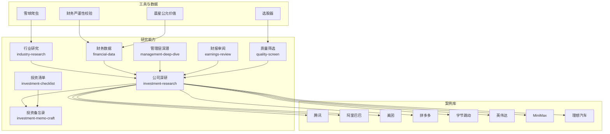
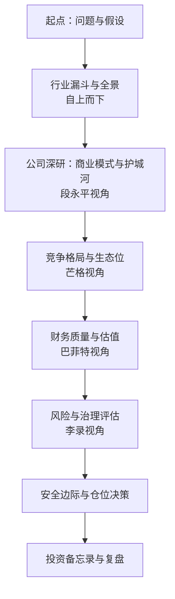
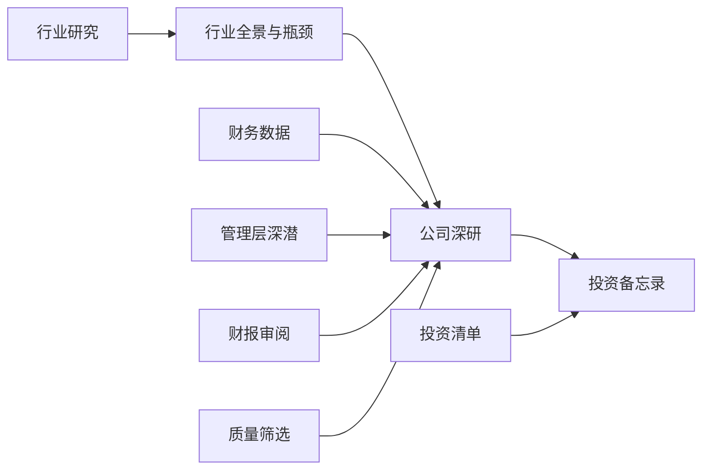

# 科技巨头深度分析

<cite>
**本文引用的文件**   
- [README_EN.md](file://README_EN.md)
- [AGENTS.md](file://AGENTS.md)
- [CLAUDE.md](file://CLAUDE.md)
- [deep-company-series.md](file://skills/deep-company-series.md)
- [investment-research.md](file://codex-skills/investment-research/SKILL.md)
- [industry-research.md](file://codex-skills/industry-research/SKILL.md)
- [financial-data.md](file://codex-skills/financial-data/SKILL.md)
- [management-deep-dive.md](file://codex-skills/management-deep-dive/SKILL.md)
- [earnings-review.md](file://codex-skills/earnings-review/SKILL.md)
- [quality-screen.md](file://codex-skills/quality-screen/SKILL.md)
- [investment-checklist.md](file://codex-prompts/investment-checklist.md)
- [investment-memo-craft/SKILL.md](file://codex-skills/investment-memo-craft/SKILL.md)
- [腾讯-research-20260702.md](file://reports/腾讯/腾讯-research-20260702.md)
- [阿里巴巴-research-20260709.md](file://reports/阿里巴巴/阿里巴巴-research-20260709.md)
- [美团投资研究报告.md](file://reports/美团/美团投资研究报告.md)
- [拼多多-research-20260702.md](file://reports/拼多多/拼多多-research-20260702.md)
- [字节跳动-业务前景展望-20260410.md](file://reports/字节跳动/字节跳动-业务前景展望-20260410.md)
- [英伟达-research-20260413.md](file://reports/英伟达/英伟达-research-20260413.md)
- [MiniMax投资研究报告_20260731.md](file://reports/MINIMAX/MiniMax投资研究报告_20260731.md)
- [最终报告-BABA-20260726.md](file://reports/Alibaba/最终报告-BABA-20260726.md)
- [lixiang-auto-investment-research-20260624.md](file://reports/lixiang-auto/lixiang-auto-investment-research-20260624.md)
</cite>

## 更新摘要
**所做更改**   
- 新增MiniMax、阿里巴巴、英伟达、理想汽车等公司的深度研究报告章节
- 更新多文章系列格式的研究方法论
- 扩展科技公司特有分析要点，增加AI模型公司分析框架
- 完善代表性企业案例拆解，涵盖更多科技细分领域

## 目录
1. [引言](#引言)
2. [项目结构](#项目结构)
3. [核心组件](#核心组件)
4. [架构总览](#架构总览)
5. [详细组件分析](#详细组件分析)
6. [依赖关系分析](#依赖关系分析)
7. [性能与效率考量](#性能与效率考量)
8. [故障排查指南](#故障排查指南)
9. [结论](#结论)
10. [附录](#附录)

## 引言
本文件面向希望系统化研究科技巨头的研究者，提供一套可复用的"四大师分析法"（巴菲特、芒格、段永平、李录）在科技企业中的落地框架。结合仓库中已有的研究与技能模板，我们梳理了从行业扫描、公司深研、财务估值到风险治理的完整流程，并给出针对用户增长模型、网络效应评估与技术护城河分析的实操要点。同时，提供一份可直接套用的研究报告结构与写作模板，帮助快速产出高质量科技股深度报告。

**更新** 基于最新代码变更，本次更新重点整合了MiniMax、阿里巴巴、英伟达、理想汽车等公司的深度研究报告，采用多文章系列格式，为AI模型公司、传统科技巨头和新能源汽车企业提供系统化的分析框架。

## 项目结构
仓库围绕"研究能力（Skills/Prompts）+ 案例库（Reports）+ 工具脚本（Tools/Scripts）"组织：
- 研究能力层：以 codex-skills 与 codex-prompts 为核心，定义行业研究、公司深研、财报审阅、管理层剖析、质量筛选等标准化流程。
- 案例库层：按公司与主题归档深度报告，覆盖互联网平台、AI算力与应用、消费与制造等。
- 工具与数据层：提供数据抓取、财务严谨性校验、晨星公允价值计算、选股筛子等辅助工具。

图表来源
- [industry-research.md](file://codex-skills/industry-research/SKILL.md)
- [investment-research.md](file://codex-skills/investment-research/SKILL.md)
- [financial-data.md](file://codex-skills/financial-data/SKILL.md)
- [management-deep-dive.md](file://codex-skills/management-deep-dive/SKILL.md)
- [earnings-review.md](file://codex-skills/earnings-review/SKILL.md)
- [quality-screen.md](file://codex-skills/quality-screen/SKILL.md)
- [investment-memo-craft/SKILL.md](file://codex-skills/investment-memo-craft/SKILL.md)
- [investment-checklist.md](file://codex-prompts/investment-checklist.md)

章节来源
- [README_EN.md](file://README_EN.md)
- [AGENTS.md](file://AGENTS.md)
- [CLAUDE.md](file://CLAUDE.md)

## 核心组件
- 行业漏斗与全景研究：用于自上而下定位赛道、识别关键瓶颈与价值分布。
- 公司深研流程：从商业模式、竞争格局、财务质量、估值与安全边际到风险治理的全链路。
- 财务数据与估值：现金流折现、分部加总、可比公司、前瞻利润推演与情景分析。
- 管理层与治理：战略一致性、资本配置、激励约束、股东回报与历史承诺兑现。
- 质量筛选与清单：去劣指标、护城河强度、估值分位、催化剂与风险矩阵。
- 投资备忘录：将上述模块整合为结构化输出，便于评审与迭代。

章节来源
- [investment-research.md](file://codex-skills/investment-research/SKILL.md)
- [industry-research.md](file://codex-skills/industry-research/SKILL.md)
- [financial-data.md](file://codex-skills/financial-data/SKILL.md)
- [management-deep-dive.md](file://codex-skills/management-deep-dive/SKILL.md)
- [earnings-review.md](file://codex-skills/earnings-review/SKILL.md)
- [quality-screen.md](file://codex-skills/quality-screen/SKILL.md)
- [investment-memo-craft/SKILL.md](file://codex-skills/investment-memo-craft/SKILL.md)
- [investment-checklist.md](file://codex-prompts/investment-checklist.md)

## 架构总览
下图展示"四大师视角"如何贯穿科技公司的研究全流程，并与具体研究步骤对应。

图表来源
- [investment-research.md](file://codex-skills/investment-research/SKILL.md)
- [industry-research.md](file://codex-skills/industry-research/SKILL.md)
- [financial-data.md](file://codex-skills/financial-data/SKILL.md)
- [management-deep-dive.md](file://codex-skills/management-deep-dive/SKILL.md)
- [investment-checklist.md](file://codex-prompts/investment-checklist.md)

## 详细组件分析

### 四大师分析法在科技企业中的落地
- 段永平视角（商业模式与护城河）
  - 关注点：用户心智、产品力、定价权、单位经济模型、长期自由现金流创造能力。
  - 适用场景：平台型公司、订阅制软件、内容生态与广告平台。
- 芒格视角（竞争格局与生态位）
  - 关注点：行业集中度、进入壁垒、替代威胁、互补者力量、监管与政策环境。
  - 适用场景：强网络效应、双边市场、基础设施与标准制定者。
- 巴菲特视角（财务质量与估值）
  - 关注点：ROIC/WACC、FCF转化率、留存收益再投资效率、分部加总与DCF敏感性。
  - 适用场景：高确定性现金流、低资本开支或轻资产模式。
- 李录视角（风险与治理）
  - 关注点：治理结构、信息披露质量、合规与地缘风险、技术颠覆与路径依赖。
  - 适用场景：高杠杆、强监管、技术快速演进的行业。

章节来源
- [investment-research.md](file://codex-skills/investment-research/SKILL.md)
- [management-deep-dive.md](file://codex-skills/management-deep-dive/SKILL.md)
- [financial-data.md](file://codex-skills/financial-data/SKILL.md)

### 科技公司特有分析要点
- 用户增长模型
  - 指标体系：获客成本CAC、活跃用户DAU/MAU、留存率、LTV/CAC、转化漏斗、渠道ROI。
  - 方法：分层 cohort 分析、渠道归因、增长飞轮验证。
- 网络效应评估
  - 类型：同边/异边网络效应、跨边补贴策略、临界规模与锁定效应。
  - 证据：双边GMV/订单密度、匹配效率、价格弹性变化。
- 技术护城河分析
  - 维度：算法与数据飞轮、工程化与规模化、开发者生态与API、专利与标准。
  - 验证：迁移成本、替换难度、开源替代威胁、算力与供应链约束。

**更新** 新增AI模型公司特有分析要点：
- 模型能力评估：基准测试表现、推理成本、多模态能力、定制化服务
- 商业化路径：API调用量、企业客户渗透、垂直行业解决方案
- 技术演进：训练数据质量、算力需求、模型迭代速度、开源生态影响

章节来源
- [investment-research.md](file://codex-skills/investment-research/SKILL.md)
- [industry-research.md](file://codex-skills/industry-research/SKILL.md)

### 财务估值方法与模板
- 常用方法
  - 分部加总（SOTP）：对广告、电商、云、游戏等业务分别估值后汇总。
  - 现金流折现（DCF）：基于FCF与WACC，做多情景与敏感性分析。
  - 相对估值：PE/PS/EV/EBITDA与同业对比，结合增长与利润率差异调整。
- 科技企业重点
  - 收入确认与递延收入、研发费用资本化、股权激励摊销、库存与供应链周转。
  - 海外业务汇率与税务影响、VIE结构与披露质量。

**更新** 新增AI模型公司估值要点：
- 算力成本建模：GPU集群成本、训练与推理成本分离、能耗管理
- 收入模式分析：API计费、订阅制、企业定制、开源商业化
- 研发投入评估：模型训练投入、数据采购成本、人才储备

章节来源
- [financial-data.md](file://codex-skills/financial-data/SKILL.md)
- [earnings-review.md](file://codex-skills/earnings-review/SKILL.md)

### 风险管理分析框架
- 宏观与政策：利率周期、监管趋严、数据安全与反垄断。
- 技术与颠覆：大模型/算力/芯片供给、开源替代、技术路线切换。
- 公司治理：股权结构、管理层稳定性、激励与回购、关联交易与透明度。
- 运营与供应链：关键供应商集中、产能与良率、物流履约与UE改善。

**更新** 新增AI行业特有风险：
- 技术风险：模型幻觉、安全性问题、版权争议、伦理审查
- 竞争风险：开源模型冲击、大厂垄断、初创公司创新
- 监管风险：数据隐私、算法透明、内容审核、国际合规

章节来源
- [management-deep-dive.md](file://codex-skills/management-deep-dive/SKILL.md)
- [investment-checklist.md](file://codex-prompts/investment-checklist.md)

### 代表性企业案例拆解（方法论映射）
以下为仓库中已存在的公司级研究示例，可用于对照学习其结构与论证逻辑：
- 腾讯：社交与内容生态、游戏与广告双引擎、视频号与小程序网络效应、国际化与出海布局。
- 阿里巴巴：电商基本盘、云计算与全球化、组织变革与效率提升、估值修复与安全边际。
- 美团：本地生活高频刚需、即时配送网络、UE优化与盈利拐点、竞争博弈与反内卷。
- 拼多多：下沉市场与低价心智、Temu全球化、供应链与商家生态、利润释放与股东回报。
- 字节跳动：推荐算法与内容分发、商业化变现与广告效率、全球化与合规挑战。
- 英伟达：GPU算力与CUDA生态、训练与推理分化、供应链与需求景气度、估值与风险平衡。

**更新** 新增AI模型公司与新能源汽车案例：
- MiniMax：AI模型商业化路径、多模态能力布局、企业客户拓展、开源与闭源策略平衡。
- 理想汽车：增程技术路线、智能驾驶布局、产品矩阵规划、供应链管理与成本控制。

章节来源
- [腾讯-research-20260702.md](file://reports/腾讯/腾讯-research-20260702.md)
- [阿里巴巴-research-20260709.md](file://reports/阿里巴巴/阿里巴巴-research-20260709.md)
- [美团投资研究报告.md](file://reports/美团/美团投资研究报告.md)
- [拼多多-research-20260702.md](file://reports/拼多多/拼多多-research-20260702.md)
- [字节跳动-业务前景展望-20260410.md](file://reports/字节跳动/字节跳动-业务前景展望-20260410.md)
- [英伟达-research-20260413.md](file://reports/英伟达/英伟达-research-20260413.md)
- [MiniMax投资研究报告_20260731.md](file://reports/MINIMAX/MiniMax投资研究报告_20260731.md)
- [最终报告-BABA-20260726.md](file://reports/Alibaba/最终报告-BABA-20260726.md)
- [lixiang-auto-investment-research-20260624.md](file://reports/lixiang-auto/lixiang-auto-investment-research-20260624.md)

### 多文章系列格式研究方法论
**新增** 基于最新代码变更，引入多文章系列格式的深度研究方法：

- 系列结构设计
  - 基础篇：商业模式与护城河分析（段永平视角）
  - 财务篇：财务质量与估值分析（巴菲特视角）
  - 竞争篇：行业竞争格局分析（芒格视角）
  - 风险篇：风险治理与管理层评估（李录视角）
  - 综合篇：投资价值综合评估

- 执行流程
  - 分阶段推进：每个篇章独立成文但相互关联
  - 交叉验证：不同视角下的结论相互印证
  - 持续更新：随着新信息获取及时更新各篇章
  - 统一标准：保持分析框架与方法论的一致性

**章节来源**
- [deep-company-series.md](file://skills/deep-company-series.md)

### 研究报告结构与写作模板（可直接套用）
- 标题与摘要：一句话结论、核心假设、关键风险与目标价区间。
- 行业与竞争：产业全景、价值链与瓶颈、竞争格局与生态位。
- 商业模式与护城河：用户增长模型、网络效应、技术/品牌/转换成本。
- 财务与估值：历史与前瞻、分部加总与DCF、敏感性分析与情景。
- 风险与治理：政策/技术/供应链/治理风险及缓释措施。
- 投资结论：安全边际、仓位建议、跟踪指标与触发条件。
- 附录：数据来源、口径说明、术语表与参考材料。

**更新** 新增AI模型公司报告模板要点：
- 技术能力评估：模型基准测试、推理成本、多模态能力
- 商业化进展：客户结构、收入模式、增长驱动因素
- 竞争态势：开源vs闭源、大厂vs初创、国内vs海外
- 监管环境：数据安全、算法透明、内容合规

章节来源
- [investment-memo-craft/SKILL.md](file://codex-skills/investment-memo-craft/SKILL.md)
- [investment-checklist.md](file://codex-prompts/investment-checklist.md)

## 依赖关系分析
研究流程各模块之间的输入输出关系如下：

图表来源
- [industry-research.md](file://codex-skills/industry-research/SKILL.md)
- [investment-research.md](file://codex-skills/investment-research/SKILL.md)
- [financial-data.md](file://codex-skills/financial-data/SKILL.md)
- [management-deep-dive.md](file://codex-skills/management-deep-dive/SKILL.md)
- [earnings-review.md](file://codex-skills/earnings-review/SKILL.md)
- [quality-screen.md](file://codex-skills/quality-screen/SKILL.md)
- [investment-memo-craft/SKILL.md](file://codex-skills/investment-memo-craft/SKILL.md)
- [investment-checklist.md](file://codex-prompts/investment-checklist.md)

章节来源
- [investment-research.md](file://codex-skills/investment-research/SKILL.md)
- [investment-memo-craft/SKILL.md](file://codex-skills/investment-memo-craft/SKILL.md)

## 性能与效率考量
- 研究流水线并行化：行业扫描与公司深研可并行推进；财务与治理评估可在同一时间窗口完成交叉验证。
- 数据自动化：优先使用脚本与工具进行数据清洗与基础统计，减少手工错误与重复劳动。
- 模板驱动：用统一模板与检查清单保证输出一致性与可复用性，缩短初稿到定稿的时间。
- 版本与回溯：所有假设、参数与数据源需标注版本与日期，便于复盘与审计。

**更新** 新增多系列研究效率优化：
- 模块化生产：各篇章可独立编写与评审
- 知识复用：通用分析框架在不同公司间复用
- 协同工作：团队成员可分工负责不同篇章
- 持续迭代：基于反馈快速更新各篇章内容

[本节为通用指导，不直接分析具体文件]

## 故障排查指南
- 数据不一致或缺失
  - 现象：不同来源数据口径不一、缺失关键指标。
  - 处理：建立数据字典与口径说明；采用多源交叉验证；记录偏差与修正过程。
- 估值结果异常
  - 现象：DCF对假设极度敏感、SOTP分部加总无法收敛。
  - 处理：回归业务本质，拆分关键驱动因子；做情景与压力测试；引入同业对比校准。
- 风险遗漏
  - 现象：忽略政策或技术颠覆风险导致结论偏乐观。
  - 处理：完善风险清单与触发条件；设置负面情景与对冲策略；定期更新。
- 团队协同问题
  - 现象：多人协作时结构不一致、结论难以对齐。
  - 处理：统一模板与检查清单；明确分工与里程碑；建立同行评审机制。

**更新** 新增AI模型研究常见问题：
- 技术评估困难：模型黑箱特性导致评估困难
  - 处理：采用基准测试、第三方评测、实际应用场景验证
- 商业化预测不确定：AI技术演进快速，商业路径不清晰
  - 处理：多情景分析、关注领先指标、动态调整预期
- 竞争格局复杂：开源与闭源并存，大厂与初创竞争激烈
  - 处理：细分市场分析、差异化竞争策略、生态位定位

章节来源
- [investment-checklist.md](file://codex-prompts/investment-checklist.md)
- [investment-memo-craft/SKILL.md](file://codex-skills/investment-memo-craft/SKILL.md)

## 结论
通过"四大师分析法"的系统化落地，结合仓库中的研究技能与案例库，可以快速构建高质量的科技巨头深度报告。关键在于：以行业漏斗定位方向，以商业模式与护城河为主线，以财务与估值为锚点，以风险与治理为底线，最终形成可执行的投资备忘录与持续跟踪计划。

**更新** 基于最新代码变更，本次更新特别强调了AI模型公司和新能源汽车行业的分析方法，通过多文章系列格式实现了更系统、更深入的研究框架。这种格式不仅提高了研究效率，还确保了分析的一致性和完整性，为投资者提供了更加全面和可靠的决策依据。

[本节为总结性内容，不直接分析具体文件]

## 附录
- 术语表：网络效应、UE、FCF、WACC、SOTP、Cohort、LTV/CAC等。
- 数据来源与工具：财报公告、券商研报、第三方数据库、工具脚本与爬虫。
- 模板下载：投资备忘录模板、研究清单、数据字典与假设变更记录表。

**更新** 新增AI行业专用术语：
- 模型相关：基座模型、微调、提示工程、多模态、推理成本
- 商业化相关：API调用、Token计费、企业定制、开源商业化
- 技术相关：算力集群、训练数据、模型迭代、版本管理

[本节为补充信息，不直接分析具体文件]