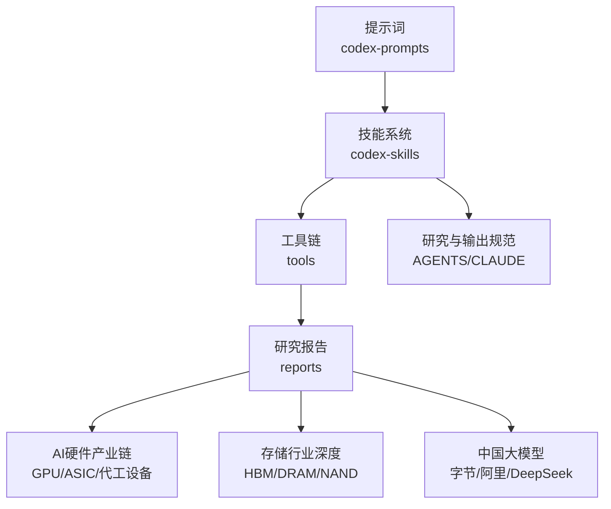
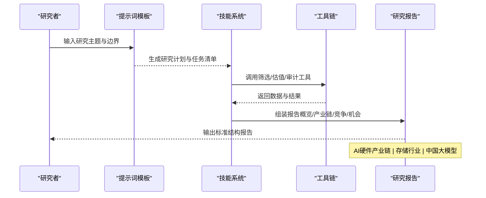
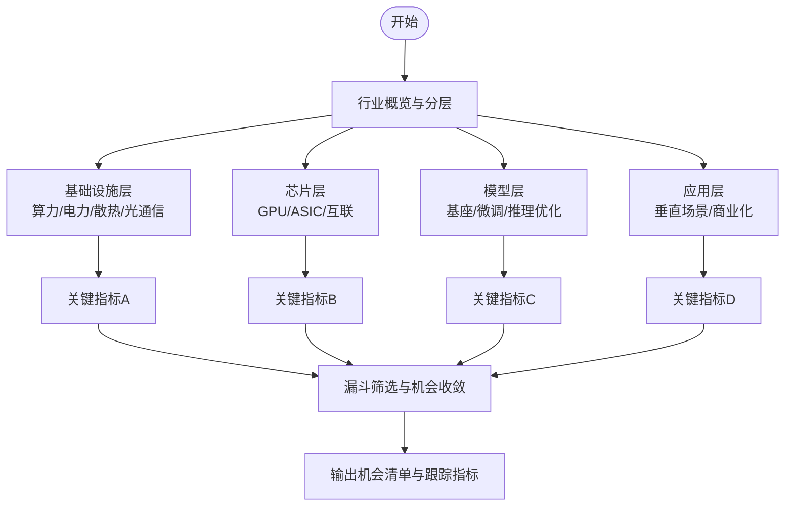
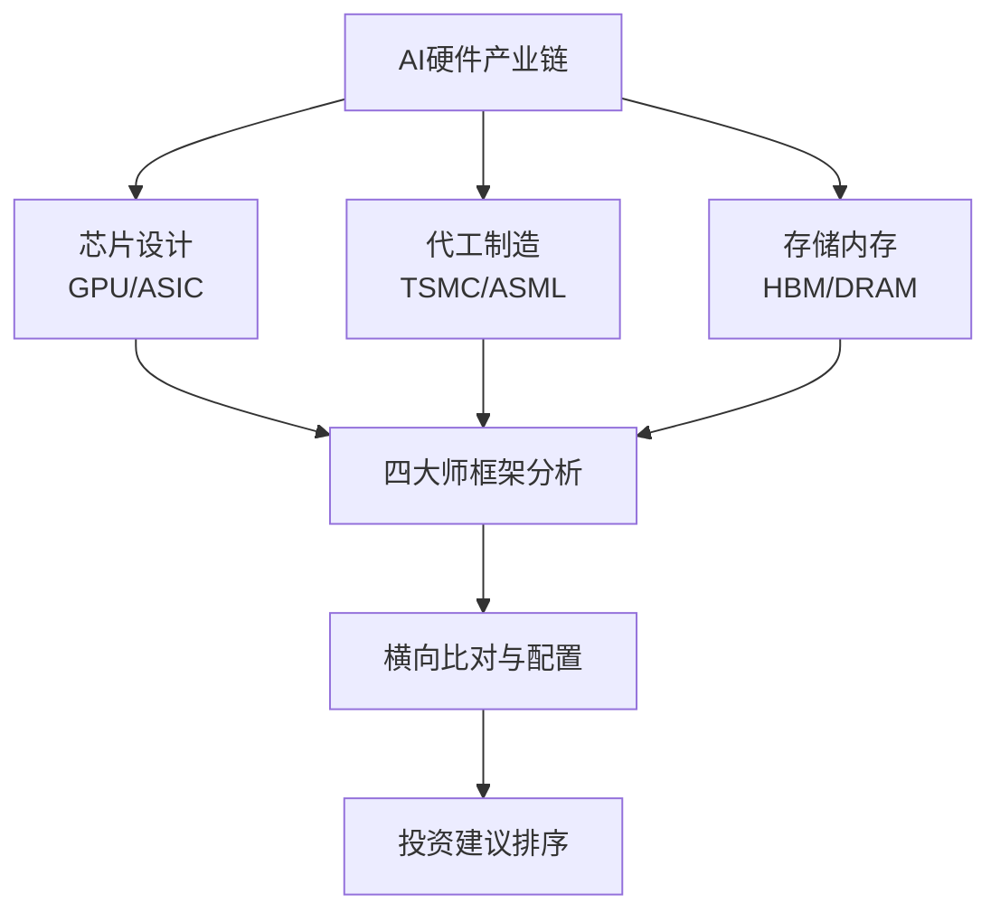
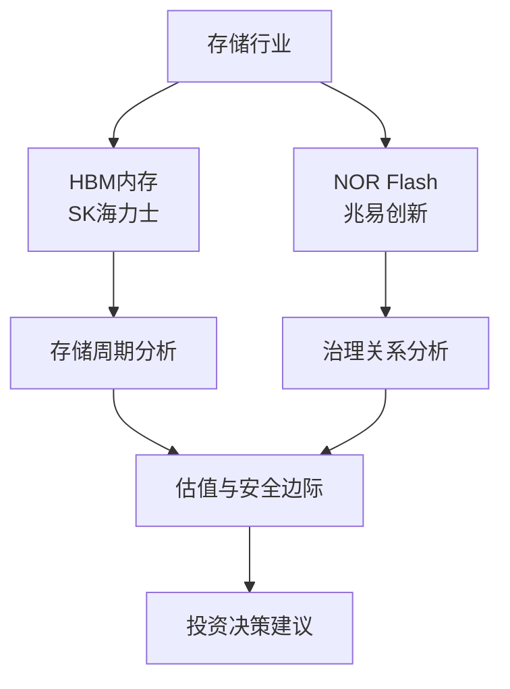
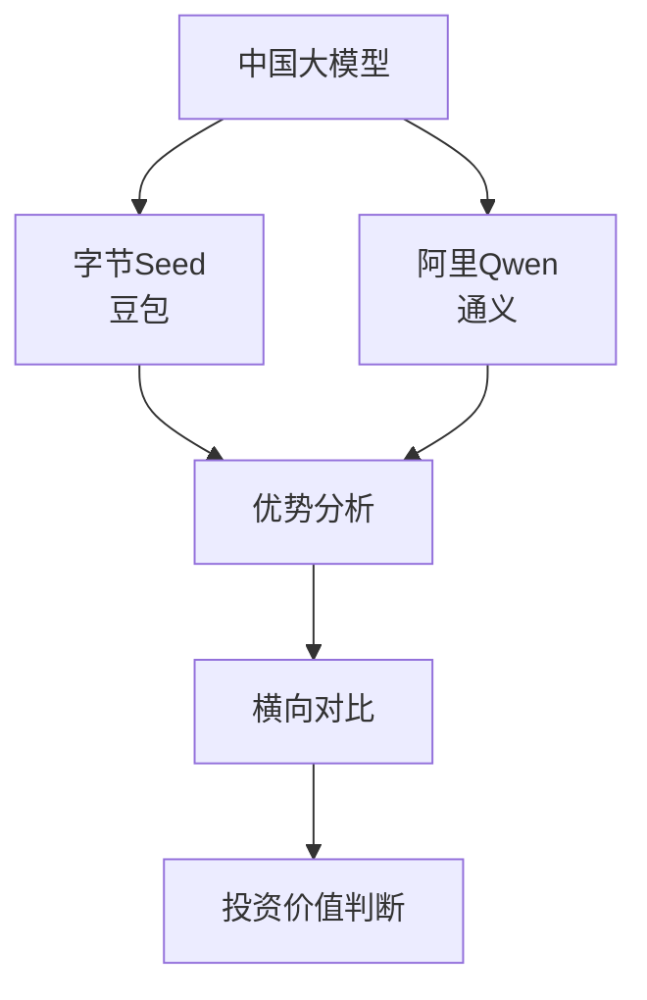
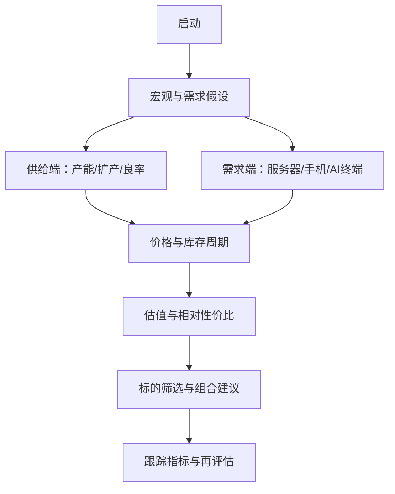
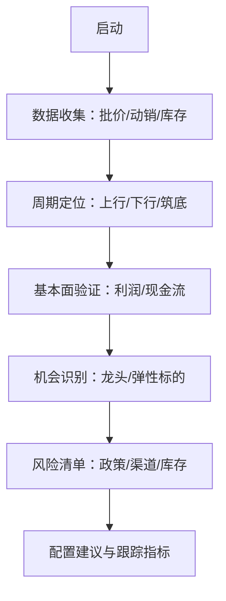
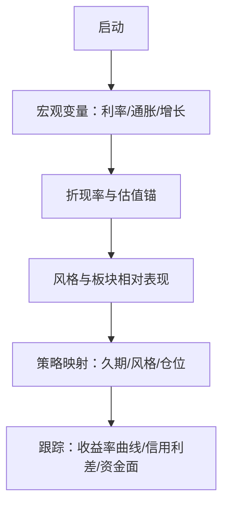
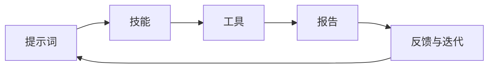

# 行业研究案例

<cite>
**本文引用的文件**   
- [README_EN.md](file://README_EN.md)
- [AGENTS.md](file://AGENTS.md)
- [CLAUDE.md](file://CLAUDE.md)
- [codex-prompts/industry-research.md](file://codex-prompts/industry-research.md)
- [codex-skills/industry-research/SKILL.md](file://codex-skills/industry-research/SKILL.md)
- [codex-skills/financial-data/SKILL.md](file://codex-skills/financial-data/SKILL.md)
- [codex-skills/industry-funnel/SKILL.md](file://codex-skills/industry-funnel/SKILL.md)
- [reports/AI产业研究/AI五层蛋糕-产业全景研究-20260605.md](file://reports/AI产业研究/AI五层蛋糕-产业全景研究-20260605.md)
- [reports/AI产业研究/AI五层蛋糕-第二层芯片层深度研究-20260605.md](file://reports/AI产业研究/AI五层蛋糕-第二层芯片层深度研究-20260605.md)
- [reports/AI产业研究/AI五层蛋糕-第四层模型层深度研究-20260605.md](file://reports/AI产业研究/AI五层蛋糕-第四层模型层深度研究-20260605.md)
- [reports/AI产业研究/AI五层蛋糕-第五层应用层-10家公司深度研究-20260605.md](file://reports/AI产业研究/AI五层蛋糕-第五层应用层-10家公司深度研究-20260605.md)
- [reports/AI硬件/01-GPU-ASIC赛道分析-20260729.md](file://reports/AI硬件/01-GPU-ASIC赛道分析-20260729.md)
- [reports/AI硬件/02-代工设备赛道分析-20260729.md](file://reports/AI硬件/02-代工设备赛道分析-20260729.md)
- [reports/AI硬件/05-横向比对与配置建议-20260729.md](file://reports/AI硬件/05-横向比对与配置建议-20260729.md)
- [reports/存储/SK海力士-投资研究报告-20260730.md](file://reports/存储/SK海力士-投资研究报告-20260730.md)
- [reports/存储/兆易创新-投资研究报告-20260730.md](file://reports/存储/兆易创新-投资研究报告-20260730.md)
- [reports/中国大模型六强横向研究-20260721/01-字节Seed-豆包.md](file://reports/中国大模型六强横向研究-20260721/01-字节Seed-豆包.md)
- [reports/中国大模型六强横向研究-20260721/02-阿里Qwen-通义.md](file://reports/中国大模型六强横向研究-20260721/02-阿里Qwen-通义.md)
- [reports/存储半导体/SK_Hynix_投资研究报告_20260512.md](file://reports/存储半导体/SK_Hynix_投资研究报告_20260512.md)
- [reports/存储半导体/存储半导体行业估值筛选与对比_20260512.md](file://reports/存储半导体/存储半导体行业估值筛选与对比_20260512.md)
- [reports/白酒周期/招商中证白酒指数C-投资研究-20260625.md](file://reports/白酒周期/招商中证白酒指数C-投资研究-20260625.md)
- [reports/宏观利率/中国低利率趋势与茅台腾讯估值研究-20260702.md](file://reports/宏观利率/中国低利率趋势与茅台腾讯估值研究-20260702.md)
- [tools/stock_screener.py](file://tools/stock_screener.py)
- [tools/morningstar_fair_value.py](file://tools/morningstar_fair_value.py)
- [tools/report_audit.py](file://tools/report_audit.py)
</cite>

## 更新摘要
**变更内容**   
- 新增AI硬件产业链深度研究（GPU/ASIC、代工设备、横向比对）
- 新增存储行业深度报告（SK海力士HBM霸主地位、兆易创新NOR龙头）
- 新增中国大模型横向研究（字节Seed、阿里Qwen等）
- 扩展AI产业研究框架，涵盖从硬件到模型的完整价值链
- 增强存储周期分析方法论，包含HBM内存细分赛道

## 目录
1. [引言](#引言)
2. [项目结构](#项目结构)
3. [核心组件](#核心组件)
4. [架构总览](#架构总览)
5. [详细组件分析](#详细组件分析)
6. [依赖关系分析](#依赖关系分析)
7. [性能考量](#性能考量)
8. [故障排查指南](#故障排查指南)
9. [结论](#结论)
10. [附录](#附录)

## 引言
本文件面向"行业研究"场景，系统化梳理平台生成的多类行业研究报告（AI产业、存储半导体、白酒周期、宏观利率等），并沉淀一套可复用的研究流程与方法论。内容覆盖：
- 从行业概览、产业链拆解、竞争格局到投资机会识别的完整闭环
- 使用AI技能系统进行数据收集、趋势分析与机会筛选的实践路径
- 不同行业的特定分析框架与关键指标
- 高质量行业报告的标准结构与最佳实践

**更新重点**：本次更新新增了AI硬件产业链（GPU/ASIC设计、代工设备、HBM内存）、存储行业深度分析（SK海力士、兆易创新）、中国大模型横向研究（字节Seed、阿里Qwen）等多领域深度研究报告，进一步完善了AI产业研究的完整价值链分析框架。

## 项目结构
仓库围绕"提示词+技能+工具+报告"的组织方式构建：
- codex-prompts：标准化研究提示词模板，驱动AI生成结构化产出
- codex-skills：封装具体研究能力（如财务数据、漏斗筛选、行业研究）
- tools：提供量化筛选、公允价值计算、报告审计等工程化能力
- reports：按主题/公司归档的研究成果，包含AI产业、存储半导体、白酒周期、宏观利率等

图表来源
- [AGENTS.md:1-200](file://AGENTS.md#L1-L200)
- [CLAUDE.md:1-200](file://CLAUDE.md#L1-L200)

章节来源
- [README_EN.md:1-200](file://README_EN.md#L1-L200)
- [AGENTS.md:1-200](file://AGENTS.md#L1-L200)
- [CLAUDE.md:1-200](file://CLAUDE.md#L1-L200)

## 核心组件
- 行业研究提示词：定义研究目标、范围、方法与交付物格式，确保产出一致性与可比性
- 行业研究技能：将研究步骤模块化（数据收集、趋势分析、竞争格局、机会筛选）
- 财务数据技能：统一财务口径与指标体系，支撑跨公司/跨行业比较
- 行业漏斗筛选：自上而下（宏观→中观→微观）与自下而上（公司→行业）的双向收敛
- 工具链：股票筛选器、晨星公允价值计算、报告审计等，提升效率与质量

章节来源
- [codex-prompts/industry-research.md:1-200](file://codex-prompts/industry-research.md#L1-L200)
- [codex-skills/industry-research/SKILL.md:1-200](file://codex-skills/industry-research/SKILL.md#L1-L200)
- [codex-skills/financial-data/SKILL.md:1-200](file://codex-skills/financial-data/SKILL.md#L1-L200)
- [codex-skills/industry-funnel/SKILL.md:1-200](file://codex-skills/industry-funnel/SKILL.md#L1-L200)

## 架构总览
下图展示"提示词→技能→工具→报告"的端到端工作流，以及典型行业研究的阶段划分与关键决策点。

图表来源
- [codex-prompts/industry-research.md:1-200](file://codex-prompts/industry-research.md#L1-L200)
- [codex-skills/industry-research/SKILL.md:1-200](file://codex-skills/industry-research/SKILL.md#L1-L200)
- [tools/stock_screener.py:1-200](file://tools/stock_screener.py#L1-L200)
- [tools/morningstar_fair_value.py:1-200](file://tools/morningstar_fair_value.py#L1-L200)
- [tools/report_audit.py:1-200](file://tools/report_audit.py#L1-L200)

## 详细组件分析

### AI产业研究案例（五层蛋糕）
- 研究要点
  - 分层视角：基础设施层、芯片层、模型层、应用层、生态与服务层
  - 关键指标：算力供给、带宽与光模块需求、模型参数与训练成本、应用渗透率与商业化进度
  - 机会识别：瓶颈环节（如电力、散热、光通信）、高弹性细分（推理侧加速、边缘部署）
- 代表性报告
  - 产业全景与分层拆解
  - 芯片层深度（算力与互联）
  - 模型层深度（开源/闭源、训练/推理分化）
  - 应用层公司矩阵（产品力、商业化、护城河）

图表来源
- [reports/AI产业研究/AI五层蛋糕-产业全景研究-20260605.md:1-200](file://reports/AI产业研究/AI五层蛋糕-产业全景研究-20260605.md#L1-L200)
- [reports/AI产业研究/AI五层蛋糕-第二层芯片层深度研究-20260605.md:1-200](file://reports/AI产业研究/AI五层蛋糕-第二层芯片层深度研究-20260605.md#L1-L200)
- [reports/AI产业研究/AI五层蛋糕-第四层模型层深度研究-20260605.md:1-200](file://reports/AI产业研究/AI五层蛋糕-第四层模型层深度研究-20260605.md#L1-L200)
- [reports/AI产业研究/AI五层蛋糕-第五层应用层-10家公司深度研究-20260605.md:1-200](file://reports/AI产业研究/AI五层蛋糕-第五层应用层-10家公司深度研究-20260605.md#L1-L200)

章节来源
- [reports/AI产业研究/AI五层蛋糕-产业全景研究-20260605.md:1-200](file://reports/AI产业研究/AI五层蛋糕-产业全景研究-20260605.md#L1-L200)
- [reports/AI产业研究/AI五层蛋糕-第二层芯片层深度研究-20260605.md:1-200](file://reports/AI产业研究/AI五层蛋糕-第二层芯片层深度研究-20260605.md#L1-L200)
- [reports/AI产业研究/AI五层蛋糕-第四层模型层深度研究-20260605.md:1-200](file://reports/AI产业研究/AI五层蛋糕-第四层模型层深度研究-20260605.md#L1-L200)
- [reports/AI产业研究/AI五层蛋糕-第五层应用层-10家公司深度研究-20260605.md:1-200](file://reports/AI产业研究/AI五层蛋糕-第五层应用层-10家公司深度研究-20260605.md#L1-L200)

### AI硬件产业链深度研究（新增）
**更新** 新增AI硬件产业链三个维度的深度分析，涵盖GPU/ASIC设计、代工设备、横向比对与配置建议。

#### GPU/ASIC芯片赛道分析
- 研究框架：四大师框架（段永平商业模式、巴菲特财务估值、芒格竞争格局、李录管理层风险）
- 核心标的：NVIDIA(NVDA)、AMD(AMD)、Broadcom(AVGO)、Marvell(MRVL)
- 关键发现：
  - GPU路线（NVDA主导）vs ASIC路线（AVGO主导）的分化趋势
  - 推理首次超越训练，占AI算力的三分之二
  - 四家公司综合评分：AVGO★★★★★ > NVDA★★★★★ > AMD★★★ > MRVL★★★

#### 代工设备赛道分析
- 覆盖公司：TSMC(台积电)、ASML、Applied Materials(AMAT)
- 核心洞察：
  - TSMC双重收费站模式（制造+CoWoS封装）
  - ASML EUV光刻机100%垄断地位
  - AMAT作为设备供应商的定位局限

#### 横向比对与配置建议
- 14家AI硬件公司核心指标横向对比
- 风险调整后预期回报排名：美光(MU) > 台积电(TSM) > Dell > SK海力士 > NVIDIA
- 收费站vs赌赢家分类：真正的收费站（TSM、ASML、SK海力士）vs 赌赢家（NVDA、AMD、MRVL）

图表来源
- [reports/AI硬件/01-GPU-ASIC赛道分析-20260729.md:1-772](file://reports/AI硬件/01-GPU-ASIC赛道分析-20260729.md#L1-L772)
- [reports/AI硬件/02-代工设备赛道分析-20260729.md:1-286](file://reports/AI硬件/02-代工设备赛道分析-20260729.md#L1-L286)
- [reports/AI硬件/05-横向比对与配置建议-20260729.md:1-408](file://reports/AI硬件/05-横向比对与配置建议-20260729.md#L1-L408)

章节来源
- [reports/AI硬件/01-GPU-ASIC赛道分析-20260729.md:1-772](file://reports/AI硬件/01-GPU-ASIC赛道分析-20260729.md#L1-L772)
- [reports/AI硬件/02-代工设备赛道分析-20260729.md:1-286](file://reports/AI硬件/02-代工设备赛道分析-20260729.md#L1-L286)
- [reports/AI硬件/05-横向比对与配置建议-20260729.md:1-408](file://reports/AI硬件/05-横向比对与配置建议-20260729.md#L1-L408)

### 存储行业深度研究（新增）
**更新** 新增存储行业两个重要公司的深度分析报告，涵盖HBM内存霸主地位和NOR Flash龙头地位。

#### SK海力士投资研究报告
- 研究重点：HBM霸主地位的可持续性 + 存储周期当前位置判断
- 核心发现：
  - HBM4量产领先，英伟达Rubin平台约三分之二份额
  - 单季营业利润率76%，净现金69万亿韩元
  - 周期位置判断：上行中后段，价格顶未到但股价顶可能已过
  - 估值结论：当前价格仍高于正常化内在价值中枢约四成

#### 兆易创新投资研究报告
- 研究重点：NOR龙头地位 + 与长鑫存储的协同和治理关系
- 核心发现：
  - NOR Flash全球第二，MCU国产第一
  - 存储超级周期顶部利润爆发（H1预告归母净利69亿）
  - 与长鑫存储的复杂治理关系（朱一明双董事长）
  - 估值结论：现价364元无安全边际，回避区间290元以上

图表来源
- [reports/存储/SK海力士-投资研究报告-20260730.md:1-351](file://reports/存储/SK海力士-投资研究报告-20260730.md#L1-L351)
- [reports/存储/兆易创新-投资研究报告-20260730.md:1-443](file://reports/存储/兆易创新-投资研究报告-20260730.md#L1-L443)

章节来源
- [reports/存储/SK海力士-投资研究报告-20260730.md:1-351](file://reports/存储/SK海力士-投资研究报告-20260730.md#L1-L351)
- [reports/存储/兆易创新-投资研究报告-20260730.md:1-443](file://reports/存储/兆易创新-投资研究报告-20260730.md#L1-L443)

### 中国大模型横向研究（新增）
**更新** 新增中国大模型六强横向研究，涵盖字节Seed、阿里Qwen等头部企业。

#### 字节跳动Seed（豆包大模型团队）
- 实力评估：国内第一，全球第一梯队，视频生成全球领先
- 核心优势：算力投入（2026年约2000亿元）、数据优势（抖音视频数据）、分发渠道（豆包DAU破亿）
- 估值轨迹：半年估值从3300亿美元升至6000亿美元
- 团队变动：吴永辉成为唯一一号位，人才持续外流至OpenAI/Meta等

#### 阿里巴巴通义千问Qwen
- 模型能力：Qwen3.7进入准前沿梯队，开源生态全球下载量第一
- 商业化进展：AI收入连续11个季度三位数增长，ARR突破358亿元
- 组织重构：吴泳铭直管Token Foundry事业部，技术派全面掌权
- 市值波动：受AI叙事驱动大幅波动，当前处于修复期

图表来源
- [reports/中国大模型六强横向研究-20260721/01-字节Seed-豆包.md:1-104](file://reports/中国大模型六强横向研究-20260721/01-字节Seed-豆包.md#L1-L104)
- [reports/中国大模型六强横向研究-20260721/02-阿里Qwen-通义.md:1-114](file://reports/中国大模型六强横向研究-20260721/02-阿里Qwen-通义.md#L1-L114)

章节来源
- [reports/中国大模型六强横向研究-20260721/01-字节Seed-豆包.md:1-104](file://reports/中国大模型六强横向研究-20260721/01-字节Seed-豆包.md#L1-L104)
- [reports/中国大模型六强横向研究-20260721/02-阿里Qwen-通义.md:1-114](file://reports/中国大模型六强横向研究-20260721/02-阿里Qwen-通义.md#L1-L114)

### 存储半导体行业案例
- 研究要点
  - 供需与价格周期：NAND/DRAM产能利用率、ASP走势、库存去化节奏
  - 技术演进：HBM/先进封装、良率与可靠性、客户认证周期
  - 竞争格局：头部厂商份额、差异化路线（产品组合/渠道/服务）
  - 估值与机会：周期位置判断、安全边际与弹性标的
- 代表性报告
  - 行业估值筛选与对比
  - 重点公司投资研究（以SK海力士为例）

图表来源
- [reports/存储半导体/存储半导体行业估值筛选与对比_20260512.md:1-200](file://reports/存储半导体/存储半导体行业估值筛选与对比_20260512.md#L1-L200)
- [reports/存储半导体/SK_Hynix_投资研究报告_20260512.md:1-200](file://reports/存储半导体/SK_Hynix_投资研究报告_20260512.md#L1-L200)

章节来源
- [reports/存储半导体/存储半导体行业估值筛选与对比_20260512.md:1-200](file://reports/存储半导体/存储半导体行业估值筛选与对比_20260512.md#L1-L200)
- [reports/存储半导体/SK_Hynix_投资研究报告_20260512.md:1-200](file://reports/存储半导体/SK_Hynix_投资研究报告_20260512.md#L1-L200)

### 白酒周期分析案例
- 研究要点
  - 周期定位：批价、动销、渠道库存、提价节奏
  - 品牌与渠道：高端集中度、经销商网络健康度、直销占比
  - 财务验证：毛利率/费用率/现金流、预收款与合同负债
  - 机会与风险：政策扰动、消费降级/升级、区域分化
- 代表性报告
  - 指数级投资研究（以招商中证白酒指数C为例）

图表来源
- [reports/白酒周期/招商中证白酒指数C-投资研究-20260625.md:1-200](file://reports/白酒周期/招商中证白酒指数C-投资研究-20260625.md#L1-L200)

章节来源
- [reports/白酒周期/招商中证白酒指数C-投资研究-20260625.md:1-200](file://reports/白酒周期/招商中证白酒指数C-投资研究-20260625.md#L1-L200)

### 宏观利率环境案例
- 研究要点
  - 利率中枢与期限结构：短端流动性、长端通胀预期、实际利率
  - 资产定价影响：折现率变化对成长/价值/红利资产的相对表现
  - 传导路径：信用利差、企业融资成本、盈利修复斜率
  - 策略映射：久期管理、风格轮动、防御与进攻组合
- 代表性报告
  - 低利率趋势下的估值重估（以茅台、腾讯为例）

图表来源
- [reports/宏观利率/中国低利率趋势与茅台腾讯估值研究-20260702.md:1-200](file://reports/宏观利率/中国低利率趋势与茅台腾讯估值研究-20260702.md#L1-L200)

章节来源
- [reports/宏观利率/中国低利率趋势与茅台腾讯估值研究-20260702.md:1-200](file://reports/宏观利率/中国低利率趋势与茅台腾讯估值研究-20260702.md#L1-L200)

### 通用研究流程与最佳实践
- 标准结构
  - 摘要与结论先行
  - 行业概览与生命周期
  - 产业链与价值链拆解
  - 竞争格局与进入壁垒
  - 关键指标与跟踪体系
  - 情景假设与敏感性分析
  - 机会清单与风险提示
  - 附录：数据来源与口径说明
- 最佳实践
  - 自上而下与自下而上结合
  - 指标体系标准化与可比性
  - 证据链闭环：数据→逻辑→结论→行动
  - 版本管理与可追溯性

章节来源
- [codex-prompts/industry-research.md:1-200](file://codex-prompts/industry-research.md#L1-L200)
- [codex-skills/industry-research/SKILL.md:1-200](file://codex-skills/industry-research/SKILL.md#L1-L200)
- [codex-skills/financial-data/SKILL.md:1-200](file://codex-skills/financial-data/SKILL.md#L1-L200)
- [codex-skills/industry-funnel/SKILL.md:1-200](file://codex-skills/industry-funnel/SKILL.md#L1-L200)

## 依赖关系分析
- 内部依赖
  - 提示词驱动技能执行；技能编排工具链；工具链支撑报告生产
  - 报告作为最终产物，反向校验提示词与技能的适用性
- 外部依赖
  - 市场数据与第三方估值（如晨星公允价值）
  - 公开披露与权威数据库

图表来源
- [codex-prompts/industry-research.md:1-200](file://codex-prompts/industry-research.md#L1-L200)
- [codex-skills/industry-research/SKILL.md:1-200](file://codex-skills/industry-research/SKILL.md#L1-L200)
- [tools/stock_screener.py:1-200](file://tools/stock_screener.py#L1-L200)
- [tools/morningstar_fair_value.py:1-200](file://tools/morningstar_fair_value.py#L1-L200)
- [tools/report_audit.py:1-200](file://tools/report_audit.py#L1-L200)

章节来源
- [AGENTS.md:1-200](file://AGENTS.md#L1-L200)
- [CLAUDE.md:1-200](file://CLAUDE.md#L1-L200)

## 性能考量
- 并行化与流水线：将数据收集、指标计算、报告拼装拆分为独立任务，最大化并行度
- 缓存与增量更新：对高频数据与中间结果建立缓存，减少重复计算
- 指标轻量化：优先选择稳定、易获取、可比性强的指标，降低噪声与延迟
- 质量控制：在流水线末端加入自动化审计与一致性检查，避免错误扩散

[本节为通用指导，不直接分析具体文件]

## 故障排查指南
- 常见问题
  - 数据缺失或口径不一致：核对数据源与时间窗口，统一单位与频率
  - 指标异常波动：区分一次性事件与趋势变化，必要时引入平滑或剔除极端值
  - 报告不一致：通过审计工具定位差异点，回溯至原始数据与计算脚本
- 处理建议
  - 建立数据字典与版本标签
  - 关键结论需有至少两条独立证据支撑
  - 对重大假设进行敏感性测试与压力测试

章节来源
- [tools/report_audit.py:1-200](file://tools/report_audit.py#L1-L200)

## 结论
- 通过"提示词+技能+工具+报告"的体系化方法，可将复杂行业研究标准化、可复制化
- 针对AI、存储半导体、白酒、宏观利率等不同领域，沉淀了分层/周期/利率敏感等专用框架
- **新增的AI硬件产业链、存储行业、中国大模型深度报告进一步丰富了研究方法论**
- 借助工具链实现高效的数据收集、筛选与审计，显著提升研究质量与时效

[本节为总结性内容，不直接分析具体文件]

## 附录
- 关键指标速查（示例）
  - AI产业：算力供给、带宽/光模块需求、模型训练成本、应用渗透率
  - AI硬件：GPU/ASIC市场份额、代工产能利用率、HBM渗透率
  - 存储半导体：产能利用率、ASP、库存周转、HBM渗透率
  - 中国大模型：模型能力排名、用户规模、商业化收入
  - 白酒：批价、动销、渠道库存、预收款/合同负债
  - 宏观利率：短端利率、期限利差、实际利率、信用利差
- 推荐阅读
  - 各主题代表性报告（见"代表性报告"小节）

[本节为补充信息，不直接分析具体文件]