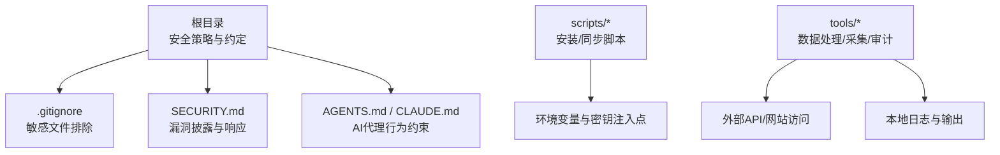
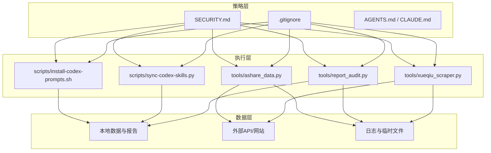
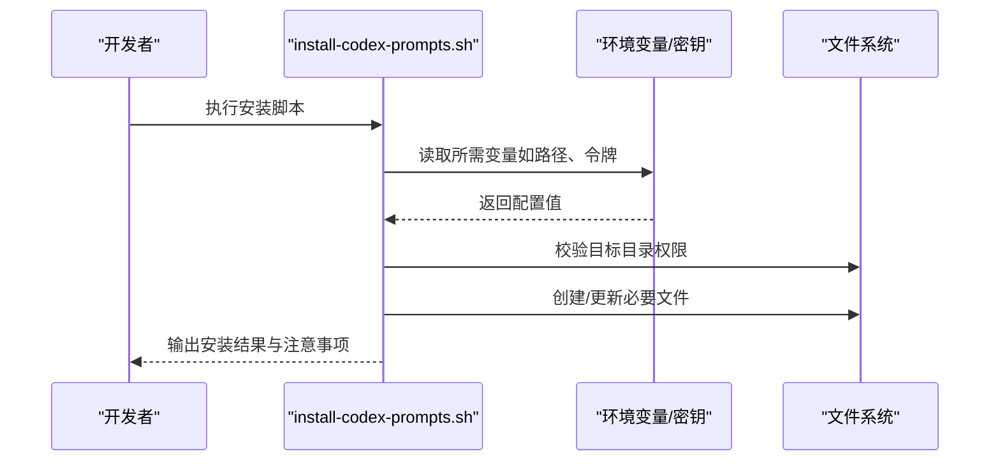
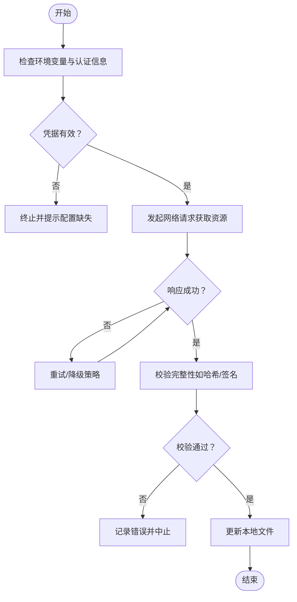
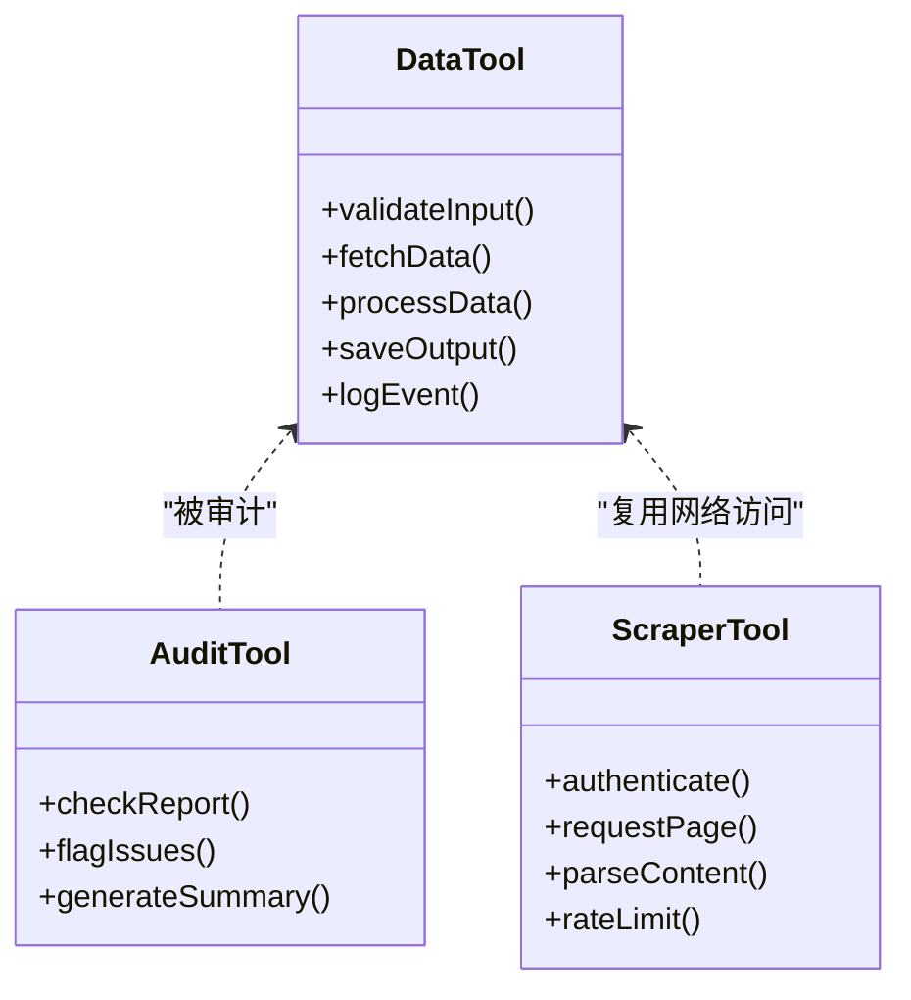

# 安全最佳实践

<cite>
**本文引用的文件**   
- [SECURITY.md](file://SECURITY.md)
- [.gitignore](file://.gitignore)
- [AGENTS.md](file://AGENTS.md)
- [CLAUDE.md](file://CLAUDE.md)
- [CODE_OF_CONDUCT.md](file://CODE_OF_CONDUCT.md)
- [scripts/install-codex-prompts.sh](file://scripts/install-codex-prompts.sh)
- [scripts/sync-codex-skills.py](file://scripts/sync-codex-skills.py)
- [tools/ashare_data.py](file://tools/ashare_data.py)
- [tools/report_audit.py](file://tools/report_audit.py)
- [tools/xueqiu_scraper.py](file://tools/xueqiu_scraper.py)
</cite>

## 目录
1. [简介](#简介)
2. [项目结构](#项目结构)
3. [核心组件](#核心组件)
4. [架构总览](#架构总览)
5. [详细组件分析](#详细组件分析)
6. [依赖分析](#依赖分析)
7. [性能考虑](#性能考虑)
8. [故障排查指南](#故障排查指南)
9. [结论](#结论)
10. [附录](#附录)

## 简介
本指南面向开发者，围绕敏感信息保护、数据安全、网络安全、依赖库安全管理、安全编码规范、安全审计与渗透测试、事件响应与漏洞披露流程，以及安全工具使用等方面，提供可落地的最佳实践。内容结合仓库中现有配置与脚本，给出具体落地建议与检查清单，帮助团队在研发全生命周期内持续降低安全风险。

## 项目结构
本项目为投资研究类仓库，包含研究报告、数据、技能提示词、安装与同步脚本、工具脚本等。从安全视角关注以下关键位置：
- 根级安全策略与行为约定：SECURITY.md、.gitignore、AGENTS.md、CLAUDE.md、CODE_OF_CONDUCT.md
- 自动化与运维脚本：scripts/*.sh、scripts/*.py
- 数据处理与外部交互工具：tools/*.py（如数据采集、报告审计、爬虫）

图表来源
- [SECURITY.md](file://SECURITY.md)
- [.gitignore](file://.gitignore)
- [AGENTS.md](file://AGENTS.md)
- [CLAUDE.md](file://CLAUDE.md)
- [scripts/install-codex-prompts.sh](file://scripts/install-codex-prompts.sh)
- [scripts/sync-codex-skills.py](file://scripts/sync-codex-skills.py)
- [tools/ashare_data.py](file://tools/ashare_data.py)
- [tools/report_audit.py](file://tools/report_audit.py)
- [tools/xueqiu_scraper.py](file://tools/xueqiu_scraper.py)

章节来源
- [SECURITY.md](file://SECURITY.md)
- [.gitignore](file://.gitignore)
- [AGENTS.md](file://AGENTS.md)
- [CLAUDE.md](file://CLAUDE.md)
- [scripts/install-codex-prompts.sh](file://scripts/install-codex-prompts.sh)
- [scripts/sync-codex-skills.py](file://scripts/sync-codex-skills.py)
- [tools/ashare_data.py](file://tools/ashare_data.py)
- [tools/report_audit.py](file://tools/report_audit.py)
- [tools/xueqiu_scraper.py](file://tools/xueqiu_scraper.py)

## 核心组件
- 安全策略与披露流程：通过 SECURITY.md 明确漏洞披露渠道、响应时限与保密要求，作为对外安全协作的契约。
- 敏感信息防护：通过 .gitignore 避免将密钥、令牌、配置文件、日志等误提交到版本库。
- AI 代理行为规范：AGENTS.md 与 CLAUDE.md 对智能体行为进行约束，减少不当输出与越权操作风险。
- 自动化脚本安全：安装与同步脚本应遵循最小权限原则，避免硬编码凭据，优先使用环境变量或受控密钥管理服务。
- 数据处理与外部访问：tools 目录下的脚本涉及外部数据源访问与本地存储，需落实输入校验、传输加密、输出脱敏与日志脱敏。

章节来源
- [SECURITY.md](file://SECURITY.md)
- [.gitignore](file://.gitignore)
- [AGENTS.md](file://AGENTS.md)
- [CLAUDE.md](file://CLAUDE.md)
- [scripts/install-codex-prompts.sh](file://scripts/install-codex-prompts.sh)
- [scripts/sync-codex-skills.py](file://scripts/sync-codex-skills.py)
- [tools/ashare_data.py](file://tools/ashare_data.py)
- [tools/report_audit.py](file://tools/report_audit.py)
- [tools/xueqiu_scraper.py](file://tools/xueqiu_scraper.py)

## 架构总览
从安全角度，系统由“策略层（文档与约定）—执行层（脚本与工具）—数据层（本地文件与外部接口）”构成。策略层定义规则；执行层负责运行逻辑；数据层承载敏感信息与外部交互。

图表来源
- [SECURITY.md](file://SECURITY.md)
- [.gitignore](file://.gitignore)
- [AGENTS.md](file://AGENTS.md)
- [CLAUDE.md](file://CLAUDE.md)
- [scripts/install-codex-prompts.sh](file://scripts/install-codex-prompts.sh)
- [scripts/sync-codex-skills.py](file://scripts/sync-codex-skills.py)
- [tools/ashare_data.py](file://tools/ashare_data.py)
- [tools/report_audit.py](file://tools/report_audit.py)
- [tools/xueqiu_scraper.py](file://tools/xueqiu_scraper.py)

## 详细组件分析

### 敏感信息保护
- API 密钥管理
  - 禁止在代码或配置文件中硬编码密钥；统一通过环境变量注入。
  - 在 CI/CD 中使用受管密钥服务（如平台提供的 Secret 管理），并在运行时以只读方式挂载。
  - 对密钥进行轮换与最小授权，按服务拆分不同密钥域。
- 配置文件加密
  - 对包含敏感信息的配置文件采用加密存储，启动时解密并仅驻留内存。
  - 限制文件权限，确保仅运行账户可读。
- 环境变量安全
  - 使用 .env 模板文件（不含真实值）配合本地开发环境加载器。
  - 在生产环境中通过容器编排或平台能力注入，避免写入镜像或版本库。
- 日志与调试
  - 默认关闭敏感字段打印；如需调试，开启脱敏开关并限制日志保留期。
- 版本控制
  - 严格维护 .gitignore，防止意外提交密钥、令牌、证书、数据库连接串等。

章节来源
- [.gitignore](file://.gitignore)
- [SECURITY.md](file://SECURITY.md)

### 数据安全保护措施
- 用户隐私保护
  - 最小化收集原则：仅收集必要信息；对用户标识进行去标识化或匿名化处理。
  - 数据分类分级：区分公开、内部、机密等级别，实施差异化访问控制。
- 数据传输加密
  - 所有外部通信强制使用 HTTPS/TLS；禁用弱协议与过时套件。
  - 服务端启用 HSTS、严格证书校验与证书固定（必要时）。
- 存储安全
  - 静态数据加密（磁盘或对象存储级别）；对高敏感数据使用应用层加密。
  - 备份加密与隔离存储；定期演练恢复流程。
- 数据留存与销毁
  - 设定保留策略与自动清理任务；对过期数据进行不可逆销毁。

章节来源
- [SECURITY.md](file://SECURITY.md)

### 网络安全最佳实践
- API 请求安全
  - 鉴权：基于令牌或短期凭证，支持刷新与撤销机制。
  - 限流与配额：对客户端进行速率限制，防止滥用与资源耗尽。
  - 签名与完整性：对外部调用增加签名校验，防篡改。
- 输入验证
  - 白名单校验类型、长度、格式；拒绝非法输入并返回通用错误消息。
- 输出编码
  - 对渲染到前端的内容进行上下文相关编码，防止 XSS。
- 跨站与跨域
  - 合理设置 CORS；对状态管理使用 SameSite Cookie 策略。
- 网络边界
  - 使用 WAF、反向代理与网关进行统一入口管控与威胁检测。

章节来源
- [SECURITY.md](file://SECURITY.md)

### 依赖库安全管理
- 漏洞扫描
  - 在构建阶段集成依赖漏洞扫描（语言生态对应的工具链），阻断高危漏洞合并。
- 版本更新
  - 建立依赖更新策略：定期评估与升级，记录变更影响与安全修复。
- 许可证合规
  - 引入许可证扫描，识别不兼容或高风险许可证，形成合规清单。
- 供应链安全
  - 锁定依赖版本（lockfile），校验哈希；对第三方包进行白名单管理。

章节来源
- [SECURITY.md](file://SECURITY.md)

### 安全编码规范
- SQL 注入防护
  - 使用参数化查询或 ORM；禁止拼接 SQL 字符串。
- XSS 防护
  - 输出前进行编码；对富文本使用安全的白名单过滤。
- CSRF 防护
  - 对写操作启用 CSRF Token 或同源策略校验。
- 命令注入与路径遍历
  - 避免直接执行用户输入的系统命令；对路径进行规范化与白名单校验。
- 错误处理与日志
  - 捕获异常并返回通用错误；避免泄露堆栈与内部细节。
- 安全头与最小权限
  - 启用安全响应头；进程与服务以最小权限运行。

章节来源
- [SECURITY.md](file://SECURITY.md)

### 安全审计与渗透测试
- 代码审查
  - 强制 Pull Request 审查，重点关注鉴权、输入校验、敏感信息处理。
- 静态与动态分析
  - 引入 SAST/DAST 工具，纳入流水线；对问题分级治理。
- 渗透测试
  - 定期开展黑盒/灰盒测试，覆盖关键业务流程与外部接口。
- 基线与度量
  - 建立安全基线指标（缺陷密度、修复时长、覆盖率等），持续改进。

章节来源
- [SECURITY.md](file://SECURITY.md)

### 安全事件响应与漏洞披露流程
- 漏洞披露
  - 通过 SECURITY.md 指定的渠道上报；承诺保密与反馈时限。
- 事件响应
  - 制定预案：发现、遏制、根因分析、修复、复盘与通告。
- 沟通与公告
  - 对内快速同步，对外按影响范围发布通告与修复指引。
- 证据保全
  - 保留日志、快照与变更记录，便于溯源与取证。

章节来源
- [SECURITY.md](file://SECURITY.md)

### 安全工具使用：代码审查与风险评估
- 代码审查
  - 使用 IDE 插件与 Lint 规则，提前发现常见安全问题。
- 风险评估
  - 结合依赖扫描、配置检查与运行时监控，形成风险视图。
- 自动化门禁
  - 在 CI 中设置质量与安全门槛，未达标禁止合并。

章节来源
- [SECURITY.md](file://SECURITY.md)

### 组件A分析：安装与同步脚本的安全加固
该组件涵盖安装与同步脚本，主要关注环境变量注入、权限控制与幂等性。

图表来源
- [scripts/install-codex-prompts.sh](file://scripts/install-codex-prompts.sh)

章节来源
- [scripts/install-codex-prompts.sh](file://scripts/install-codex-prompts.sh)

#### 关键要点
- 使用环境变量注入，避免硬编码。
- 校验目标目录存在性与权限，失败即中止。
- 幂等执行：重复运行不破坏既有配置。
- 输出最小化日志，避免泄露敏感信息。

### 组件B分析：技能同步脚本的数据与网络访问
该组件负责拉取或同步技能相关文件，需关注网络访问安全与数据一致性。

图表来源
- [scripts/sync-codex-skills.py](file://scripts/sync-codex-skills.py)

章节来源
- [scripts/sync-codex-skills.py](file://scripts/sync-codex-skills.py)

#### 关键要点
- 网络请求必须使用 HTTPS，禁用明文传输。
- 对下载内容进行完整性校验，防止中间人篡改。
- 失败重试具备退避策略，避免雪崩。
- 日志脱敏，不记录 URL 中的令牌或路径参数。

### 组件C分析：数据处理与外部访问工具
该组件包含数据采集、报告审计与爬虫等工具，重点在于输入校验、传输加密、输出脱敏与访问控制。

图表来源
- [tools/ashare_data.py](file://tools/ashare_data.py)
- [tools/report_audit.py](file://tools/report_audit.py)
- [tools/xueqiu_scraper.py](file://tools/xueqiu_scraper.py)

章节来源
- [tools/ashare_data.py](file://tools/ashare_data.py)
- [tools/report_audit.py](file://tools/report_audit.py)
- [tools/xueqiu_scraper.py](file://tools/xueqiu_scraper.py)

#### 关键要点
- 输入校验：类型、长度、格式、白名单。
- 传输加密：HTTPS、证书校验、超时与重试。
- 输出脱敏：日志与报告中去除敏感字段。
- 访问控制：最小权限、令牌轮换、速率限制。

## 依赖分析
从安全视角，依赖关系包括：
- 策略层对执行层的约束：SECURITY.md、.gitignore、AGENTS.md、CLAUDE.md 指导脚本与工具实现。
- 执行层对数据层的访问：脚本与工具读取/写入本地文件，访问外部网络资源。
- 潜在耦合点：环境变量命名与取值、网络端点与证书、文件路径与权限。

图表来源
- [SECURITY.md](file://SECURITY.md)
- [.gitignore](file://.gitignore)
- [AGENTS.md](file://AGENTS.md)
- [CLAUDE.md](file://CLAUDE.md)
- [scripts/install-codex-prompts.sh](file://scripts/install-codex-prompts.sh)
- [scripts/sync-codex-skills.py](file://scripts/sync-codex-skills.py)
- [tools/ashare_data.py](file://tools/ashare_data.py)
- [tools/report_audit.py](file://tools/report_audit.py)
- [tools/xueqiu_scraper.py](file://tools/xueqiu_scraper.py)

章节来源
- [SECURITY.md](file://SECURITY.md)
- [.gitignore](file://.gitignore)
- [AGENTS.md](file://AGENTS.md)
- [CLAUDE.md](file://CLAUDE.md)
- [scripts/install-codex-prompts.sh](file://scripts/install-codex-prompts.sh)
- [scripts/sync-codex-skills.py](file://scripts/sync-codex-skills.py)
- [tools/ashare_data.py](file://tools/ashare_data.py)
- [tools/report_audit.py](file://tools/report_audit.py)
- [tools/xueqiu_scraper.py](file://tools/xueqiu_scraper.py)

## 性能考虑
- 安全开销可控：TLS握手、加密解密、校验计算应在可接受范围内；对热点路径进行优化。
- 缓存与批处理：合理使用缓存减少重复网络请求；批量处理提升吞吐。
- 资源限制：对并发、超时、内存占用进行上限控制，避免资源耗尽。
- 监控与告警：对延迟、错误率、资源使用进行观测，及时发现问题。

[本节为通用指导，无需特定文件引用]

## 故障排查指南
- 常见问题定位
  - 环境变量缺失或权限不足：检查注入来源与运行账户权限。
  - 网络访问失败：确认 TLS 配置、证书链与域名解析。
  - 数据不一致：核对完整性校验与幂等逻辑。
- 日志与诊断
  - 开启结构化日志，包含时间戳、请求ID、模块名。
  - 脱敏敏感字段，保留足够上下文以便复现。
- 回滚与恢复
  - 变更前备份；变更后验证关键路径；准备一键回滚方案。

章节来源
- [SECURITY.md](file://SECURITY.md)

## 结论
通过将安全策略前置到文档与约定，并在脚本与工具中严格落实最小权限、输入校验、传输加密与输出脱敏，可有效降低整体安全风险。配合依赖治理、代码审查、渗透测试与事件响应流程，形成闭环的安全工程体系。

[本节为总结性内容，无需特定文件引用]

## 附录
- 检查清单
  - 敏感信息：无硬编码、环境变量注入、日志脱敏、.gitignore 完善。
  - 传输安全：HTTPS 强制、证书校验、HSTS。
  - 输入输出：白名单校验、上下文编码、CSRF 防护。
  - 依赖治理：漏洞扫描、版本锁定、许可证合规。
  - 审计与测试：SAST/DAST、渗透测试、基线度量。
  - 事件响应：披露渠道、响应预案、复盘与通告。

[本节为补充材料，无需特定文件引用]