# 开发者指南

<cite>
**本文引用的文件**
- [README.md](file://README.md)
- [AGENTS.md](file://AGENTS.md)
- [CODE_OF_CONDUCT.md](file://CODE_OF_CONDUCT.md)
- [SECURITY.md](file://SECURITY.md)
- [.editorconfig](file://.editorconfig)
- [.gitignore](file://.gitignore)
- [.claude/settings.json](file://.claude/settings.json)
- [scripts/learnings-digest.sh](file://scripts/learnings-digest.sh)
- [scripts/workflow-cleanup-hook.sh](file://scripts/workflow-cleanup-hook.sh)
- [scripts/workflow-session-cleanup.sh](file://scripts/workflow-session-cleanup.sh)
- [codex-skills/investment-memo-craft/SKILL.md](file://codex-skills/investment-memo-craft/SKILL.md)
- [codex-skills/investment-memo-craft/agents/openai.yaml](file://codex-skills/investment-memo-craft/agents/openai.yaml)
- [tools/morningstar_fair_value.py](file://tools/morningstar_fair_value.py)
- [tools/stock_screener.py](file://tools/stock_screener.py)
- [tools/xueqiu_scraper.py](file://tools/xueqiu_scraper.py)
- [tools/report_audit.py](file://tools/report_audit.py)
- [tools/financial_rigor.py](file://tools/financial_rigor.py)
- [tools/momentum_backtest.py](file://tools/momentum_backtest.py)
- [tools/momentum_backtest_v2.py](file://tools/momentum_backtest_v2.py)
- [tools/ashare_data.py](file://tools/ashare_data.py)
- [data/fundamentals.json](file://data/fundamentals.json)
- [data/watchlist.json](file://data/watchlist.json)
- [data/cross_asset_10y_2016-2026.csv](file://data/cross_asset_10y_2016-2026.csv)
- [data/correlation_3stocks_2021-2026.csv](file://data/correlation_3stocks_2021-2026.csv)
- [data/morningstar_fair_value_20260519.csv](file://data/morningstar_fair_value_20260519.csv)
- [research/MRVL/MRVL_data_collection.md](file://research/MRVL/MRVL_data_collection.md)
- [docs/ROADMAP.md](file://docs/ROADMAP.md)
- [.github/ISSUE_TEMPLATE/config.yml](file://.github/ISSUE_TEMPLATE/config.yml)
- [.github/ISSUE_TEMPLATE/bug_report.yml](file://.github/ISSUE_TEMPLATE/bug_report.yml)
- [.github/ISSUE_TEMPLATE/data_error.yml](file://.github/ISSUE_TEMPLATE/data_error.yml)
- [.github/ISSUE_TEMPLATE/other.yml](file://.github/ISSUE_TEMPLATE/other.yml)
- [.github/ISSUE_TEMPLATE/suggestion.yml](file://.github/ISSUE_TEMPLATE/suggestion.yml)
</cite>

## 更新摘要
**所做更改**
- 新增学习知识库系统与 SessionStart 钩子机制，实现跨会话的机构记忆和学习沉淀
- 添加工作流清理和会话状态管理功能，确保工作流状态一致性
- 增强持久化机构记忆能力，通过结构化目录组织 LEARNINGS、ERRORS 和 FEATURE_REQUESTS
- 更新钩子配置和工作流程自动化，支持自动上下文注入和状态清理

## 目录
1. [简介](#简介)
2. [项目结构](#项目结构)
3. [核心组件](#核心组件)
4. [架构总览](#架构总览)
5. [详细组件分析](#详细组件分析)
6. [依赖分析](#依赖分析)
7. [性能考虑](#性能考虑)
8. [故障排除指南](#故障排除指南)
9. [结论](#结论)
10. [附录](#附录)

## 简介
本指南面向希望参与本项目开发与贡献的工程师与研究者，提供从环境搭建、协作规范到技术扩展、测试策略与安全实践的全流程说明。项目围绕投研工作流构建，包含技能（Skills）、提示词（Prompts）、工具脚本与数据资产等模块，支持通过配置化方式扩展新能力与集成外部API。**最新更新**：引入了学习知识库系统和 SessionStart 钩子机制，实现了跨会话的机构记忆和学习沉淀功能，显著提升了团队协作效率和知识传承能力。

## 项目结构
仓库采用"按功能域+资源分层"的组织方式：
- 顶层文档与治理：README、行为准则、安全策略、编辑器配置、忽略规则
- 智能体与技能：codex-skills、codex-prompts、skills
- 工具与脚本：tools、scripts
- 数据与研究：data、research、reports
- GitHub协作模板：.github/ISSUE_TEMPLATE
- **新增**：学习知识库：`.learnings/`（会话学习知识存储）
- **新增**：钩子配置：`.claude/settings.json`（SessionStart 钩子配置）

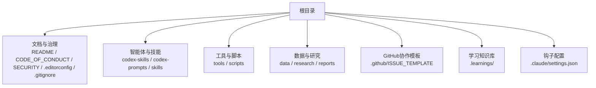

**章节来源**
- [README.md](file://README.md)
- [CODE_OF_CONDUCT.md](file://CODE_OF_CONDUCT.md)
- [SECURITY.md](file://SECURITY.md)
- [.editorconfig](file://.editorconfig)
- [.gitignore](file://.gitignore)
- [.claude/settings.json](file://.claude/settings.json)

## 核心组件
- 技能（Skills）：以SKILL.md为入口定义可复用的研究或生产任务；部分技能附带代理配置（如OpenAI），便于接入不同模型后端。
- 提示词（Prompts）：集中管理用于驱动大模型的指令模板，配合技能使用。
- 工具（Tools）：Python脚本实现数据采集、筛选、回测、报告审计与财务严谨性检查等能力。
- 脚本（Scripts）：安装与同步类脚本，简化技能与提示词的部署与更新。
- 数据（Data）：结构化数据与CSV/JSON样本，供工具与分析使用。
- 研究（Research）：针对特定标的的数据收集与方法说明。
- **新增**：学习知识库（Learnings）：`.learnings/` 目录存储会话学习、错误记录和需求反馈，实现机构记忆。
- **新增**：钩子系统（Hooks）：SessionStart 钩子在每次会话启动时自动注入学习摘要，PostToolUse 钩子处理工作流状态清理。

**章节来源**
- [codex-skills/investment-memo-craft/SKILL.md](file://codex-skills/investment-memo-craft/SKILL.md)
- [codex-skills/investment-memo-craft/agents/openai.yaml](file://codex-skills/investment-memo-craft/agents/openai.yaml)
- [scripts/learnings-digest.sh](file://scripts/learnings-digest.sh)
- [.claude/settings.json](file://.claude/settings.json)

## 架构总览
系统由"技能编排 + 提示词驱动 + 工具执行 + 数据支撑 + 学习记忆"构成。技能作为高层任务描述，调用相应工具完成数据获取、处理与输出；提示词提供模型交互模板；工具负责具体计算与I/O；数据层提供输入与中间结果；**学习系统**通过 SessionStart 钩子在每个会话开始时自动注入累积的学习知识，实现跨会话的机构记忆。

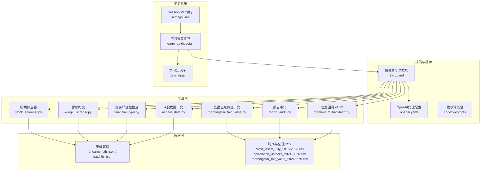

**图表来源**
- [codex-skills/investment-memo-craft/SKILL.md](file://codex-skills/investment-memo-craft/SKILL.md)
- [codex-skills/investment-memo-craft/agents/openai.yaml](file://codex-skills/investment-memo-craft/agents/openai.yaml)
- [scripts/learnings-digest.sh](file://scripts/learnings-digest.sh)
- [.claude/settings.json](file://.claude/settings.json)
- [tools/morningstar_fair_value.py](file://tools/morningstar_fair_value.py)
- [tools/stock_screener.py](file://tools/stock_screener.py)
- [tools/xueqiu_scraper.py](file://tools/xueqiu_scraper.py)
- [tools/report_audit.py](file://tools/report_audit.py)
- [tools/financial_rigor.py](file://tools/financial_rigor.py)
- [tools/momentum_backtest.py](file://tools/momentum_backtest.py)
- [tools/momentum_backtest_v2.py](file://tools/momentum_backtest_v2.py)
- [tools/ashare_data.py](file://tools/ashare_data.py)
- [data/fundamentals.json](file://data/fundamentals.json)
- [data/watchlist.json](file://data/watchlist.json)
- [data/cross_asset_10y_2016-2026.csv](file://data/cross_asset_10y_2016-2026.csv)
- [data/correlation_3stocks_2021-2026.csv](file://data/correlation_3stocks_2021-2026.csv)
- [data/morningstar_fair_value_20260519.csv](file://data/morningstar_fair_value_20260519.csv)

## 详细组件分析

### 开发环境与前置条件
- Python环境
  - 建议使用Python 3.9+（依据工具脚本中的导入与语法推断）。
  - 推荐使用虚拟环境（venv/conda）隔离依赖。
- 依赖库安装
  - 参考各工具的导入语句与数据处理需求，常见依赖包括pandas、numpy、requests、beautifulsoup4、openpyxl等（根据实际脚本导入确认）。
  - 若存在requirements文件或poetry/pipenv配置，请优先使用该方案进行安装。
- API密钥与环境变量
  - 在代理配置中指定模型后端（例如OpenAI），需设置对应环境变量（如OPENAI_API_KEY）。
  - 其他第三方服务（如数据源、爬虫）需在环境变量中配置访问凭据。
- 编辑器与代码风格
  - 遵循.editorconfig定义的缩进、换行与编码规范。
  - 建议启用IDE自动格式化与lint检查。
- **新增**：Claude Code 钩子配置
  - 确保 `.claude/settings.json` 正确配置 SessionStart 钩子。
  - 验证 `jq` 命令可用（用于学习摘要生成）。

**章节来源**
- [.editorconfig](file://.editorconfig)
- [codex-skills/investment-memo-craft/agents/openai.yaml](file://codex-skills/investment-memo-craft/agents/openai.yaml)
- [.claude/settings.json](file://.claude/settings.json)

### 贡献指南与协作规范
- 行为准则
  - 遵守社区行为准则，保持尊重与包容。
- 提交约定
  - 使用语义化提交信息（feat/fix/docs/chore等），清晰描述变更范围与动机。
  - 小步提交，避免一次性过大变更。
- Pull Request流程
  - Fork仓库并创建分支，提交后发起PR。
  - 在PR描述中说明背景、改动点、影响范围与验证方法。
  - 确保CI通过（如有）、测试覆盖与文档更新。
- Issue与模板
  - 使用预设模板反馈问题、数据错误与建议，提升沟通效率。
- **新增**：学习知识库贡献
  - 在 `.learnings/` 目录下维护学习记录、错误日志和需求反馈。
  - 定期更新学习摘要，确保知识的有效性和时效性。

**章节来源**
- [CODE_OF_CONDUCT.md](file://CODE_OF_CONDUCT.md)
- [.github/ISSUE_TEMPLATE/config.yml](file://.github/ISSUE_TEMPLATE/config.yml)
- [.github/ISSUE_TEMPLATE/bug_report.yml](file://.github/ISSUE_TEMPLATE/bug_report.yml)
- [.github/ISSUE_TEMPLATE/data_error.yml](file://.github/ISSUE_TEMPLATE/data_error.yml)
- [.github/ISSUE_TEMPLATE/other.yml](file://.github/ISSUE_TEMPLATE/other.yml)
- [.github/ISSUE_TEMPLATE/suggestion.yml](file://.github/ISSUE_TEMPLATE/suggestion.yml)

### 技术架构与扩展点
- 新技能开发
  - 在codex-skills下新增目录，编写SKILL.md定义任务目标、输入输出与步骤。
  - 如需接入模型，可在agents目录下添加代理配置（如openai.yaml）。
- 工具集成
  - 将独立能力封装为tools下的脚本，明确CLI参数与I/O格式。
  - 在技能中通过命令行或函数调用集成工具。
- API扩展
  - 通过环境变量注入API密钥，避免硬编码。
  - 对网络请求增加重试与超时控制，保证鲁棒性。
- **新增**：学习系统集成
  - 在 `.learnings/` 目录下创建 LEARNINGS.md、ERRORS.md、FEATURE_REQUESTS.md 文件。
  - 使用标准格式记录学习条目：`## [LRN] 标题`、`## [ERR] 标题`、`## [FEAT] 标题`。
  - 通过 SessionStart 钩子自动注入学习摘要到新会话上下文。
- **新增**：工作流状态管理
  - 使用 PostToolUse 钩子清理工作流状态。
  - 在会话开始时自动清理遗留的工作流标记。

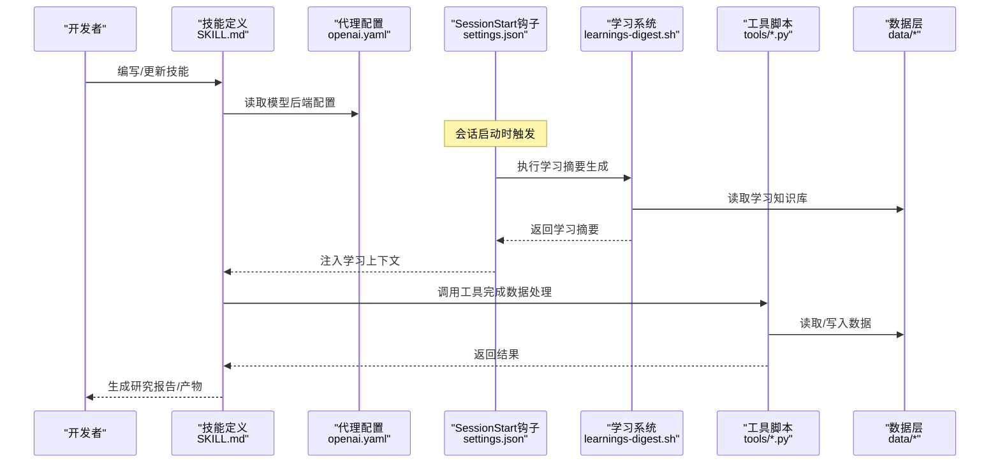

**图表来源**
- [codex-skills/investment-memo-craft/SKILL.md](file://codex-skills/investment-memo-craft/SKILL.md)
- [codex-skills/investment-memo-craft/agents/openai.yaml](file://codex-skills/investment-memo-craft/agents/openai.yaml)
- [.claude/settings.json](file://.claude/settings.json)
- [scripts/learnings-digest.sh](file://scripts/learnings-digest.sh)
- [tools/morningstar_fair_value.py](file://tools/morningstar_fair_value.py)
- [tools/stock_screener.py](file://tools/stock_screener.py)
- [tools/xueqiu_scraper.py](file://tools/xueqiu_scraper.py)
- [data/fundamentals.json](file://data/fundamentals.json)
- [data/watchlist.json](file://data/watchlist.json)

### 关键工具与数据处理流程

#### 晨星公允价值工具
- 功能概述
  - 读取本地公允价值CSV，结合其他数据进行估值分析与对比。
- 输入输出
  - 输入：morningstar_fair_value_20260519.csv及相关数据
  - 输出：估值指标、排序与可视化结果（视实现而定）
- 复杂度与优化
  - 主要开销在数据加载与聚合，建议向量化操作与索引优化。

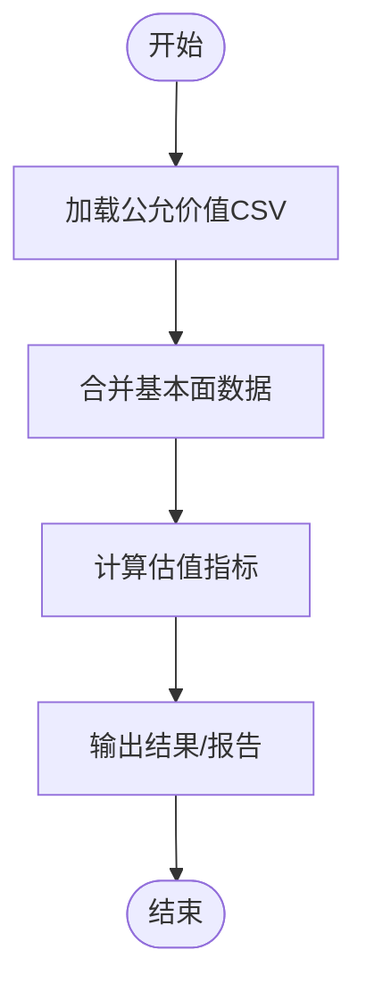

**图表来源**
- [tools/morningstar_fair_value.py](file://tools/morningstar_fair_value.py)
- [data/morningstar_fair_value_20260519.csv](file://data/morningstar_fair_value_20260519.csv)
- [data/fundamentals.json](file://data/fundamentals.json)

**章节来源**
- [tools/morningstar_fair_value.py](file://tools/morningstar_fair_value.py)
- [data/morningstar_fair_value_20260519.csv](file://data/morningstar_fair_value_20260519.csv)
- [data/fundamentals.json](file://data/fundamentals.json)

#### 股票筛选器
- 功能概述
  - 基于watchlist与基本面数据执行筛选逻辑，输出候选池。
- 输入输出
  - 输入：watchlist.json、fundamentals.json
  - 输出：筛选结果（列表/CSV/JSON）
- 可扩展性
  - 通过配置文件或参数化规则快速调整筛选条件。

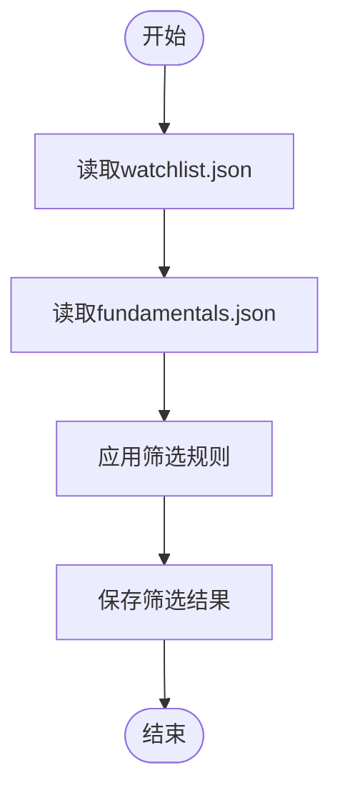

**图表来源**
- [tools/stock_screener.py](file://tools/stock_screener.py)
- [data/watchlist.json](file://data/watchlist.json)
- [data/fundamentals.json](file://data/fundamentals.json)

**章节来源**
- [tools/stock_screener.py](file://tools/stock_screener.py)
- [data/watchlist.json](file://data/watchlist.json)
- [data/fundamentals.json](file://data/fundamentals.json)

#### 雪球爬虫
- 功能概述
  - 抓取公开页面内容，解析结构化数据并落盘。
- 注意事项
  - 遵守网站条款与反爬策略，合理设置延迟与User-Agent。
  - 失败重试与异常捕获，避免中断整个流程。

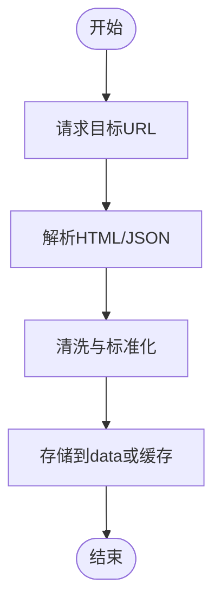

**图表来源**
- [tools/xueqiu_scraper.py](file://tools/xueqiu_scraper.py)

**章节来源**
- [tools/xueqiu_scraper.py](file://tools/xueqiu_scraper.py)

#### 报告审计与财务严谨性检查
- 报告审计
  - 校验报告结构与引用完整性，发现缺失与不一致。
- 财务严谨性
  - 对财务指标进行一致性检查与合理性判断，辅助质量控制。

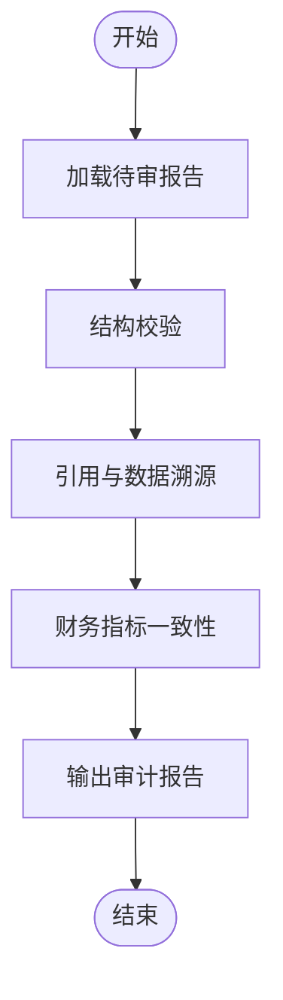

**图表来源**
- [tools/report_audit.py](file://tools/report_audit.py)
- [tools/financial_rigor.py](file://tools/financial_rigor.py)

**章节来源**
- [tools/report_audit.py](file://tools/report_audit.py)
- [tools/financial_rigor.py](file://tools/financial_rigor.py)

#### 动量回测（v1/v2）
- 功能概述
  - 基于历史价格序列执行动量策略回测，评估收益与风险。
- 输入输出
  - 输入：跨资产时序数据（CSV）
  - 输出：回测绩效指标与交易记录
- 性能优化
  - 使用向量化计算与内存映射，减少I/O瓶颈。

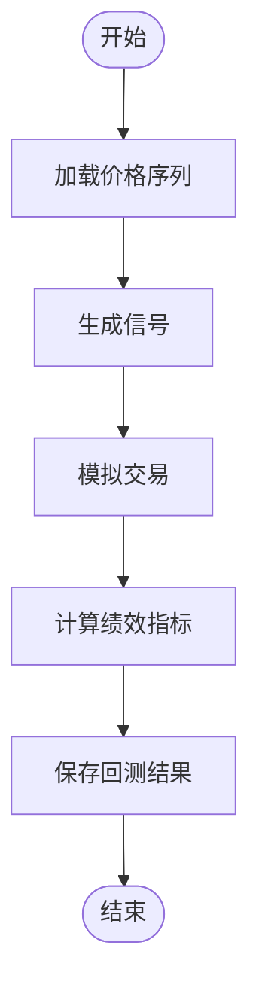

**图表来源**
- [tools/momentum_backtest.py](file://tools/momentum_backtest.py)
- [tools/momentum_backtest_v2.py](file://tools/momentum_backtest_v2.py)
- [data/cross_asset_10y_2016-2026.csv](file://data/cross_asset_10y_2016-2026.csv)

**章节来源**
- [tools/momentum_backtest.py](file://tools/momentum_backtest.py)
- [tools/momentum_backtest_v2.py](file://tools/momentum_backtest_v2.py)
- [data/cross_asset_10y_2016-2026.csv](file://data/cross_asset_10y_2016-2026.csv)

#### A股数据工具
- 功能概述
  - 统一A股数据的采集、清洗与导出接口。
- 输入输出
  - 输入：交易所或第三方数据源
  - 输出：标准化CSV/JSON

**章节来源**
- [tools/ashare_data.py](file://tools/ashare_data.py)

### 学习知识库系统
**新增功能**：学习知识库系统提供了跨会话的机构记忆和学习沉淀能力。

- 目录结构
  - `.learnings/LEARNINGS.md`：最佳实践、修正和经验总结
  - `.learnings/ERRORS.md`：已知错误和解决方案
  - `.learnings/FEATURE_REQUESTS.md`：用户需求和建议
  - `.learnings/session-summary-YYYY-MM-DD.md`：每日会话摘要

- 学习摘要生成
  - 通过 `scripts/learnings-digest.sh` 自动生成学习摘要
  - 支持 jq 格式化和明文输出两种模式
  - 限制显示条目数量，避免上下文过载

- SessionStart 钩子集成
  - 在 `.claude/settings.json` 中配置钩子
  - 每次会话启动时自动注入学习摘要
  - 确保新成员也能获得项目积累的知识

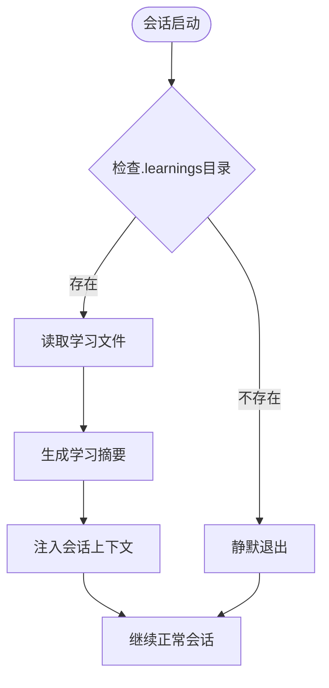

**图表来源**
- [scripts/learnings-digest.sh](file://scripts/learnings-digest.sh)
- [.claude/settings.json](file://.claude/settings.json)

**章节来源**
- [scripts/learnings-digest.sh](file://scripts/learnings-digest.sh)
- [.claude/settings.json](file://.claude/settings.json)

### 工作流状态管理
**新增功能**：工作流状态管理系统确保会话间的状态一致性和清理。

- 会话清理钩子
  - `workflow-session-cleanup.sh`：在会话开始时清理遗留状态
  - `workflow-cleanup-hook.sh`：在工作流完成后清理标记文件

- 状态文件管理
  - `.claude/.workflow/` 目录存储工作流状态
  - `.done` 文件标记已完成的任务
  - `active` 文件标识当前活跃的工作流

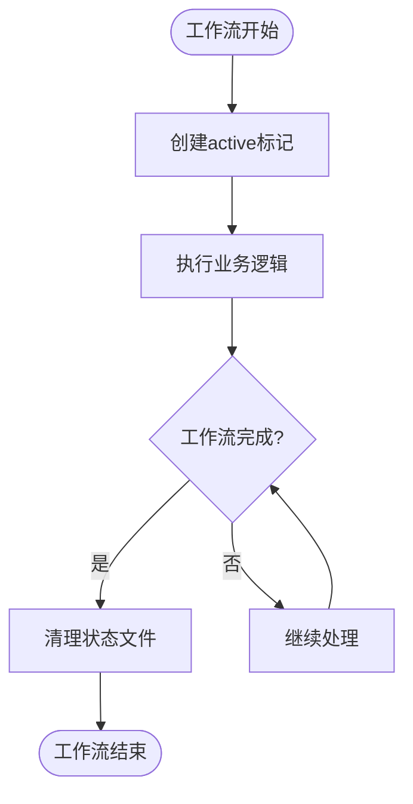

**图表来源**
- [scripts/workflow-session-cleanup.sh](file://scripts/workflow-session-cleanup.sh)
- [scripts/workflow-cleanup-hook.sh](file://scripts/workflow-cleanup-hook.sh)

**章节来源**
- [scripts/workflow-session-cleanup.sh](file://scripts/workflow-session-cleanup.sh)
- [scripts/workflow-cleanup-hook.sh](file://scripts/workflow-cleanup-hook.sh)

### 安装与同步脚本
- 安装脚本
  - install-codex-skills.sh/.bat：安装技能相关依赖与配置
  - install-codex-prompts.sh/.bat：安装提示词模板
- 同步脚本
  - sync-codex-skills.py：拉取或同步最新技能版本
  - sync-codex-prompts.py：拉取或同步最新提示词版本

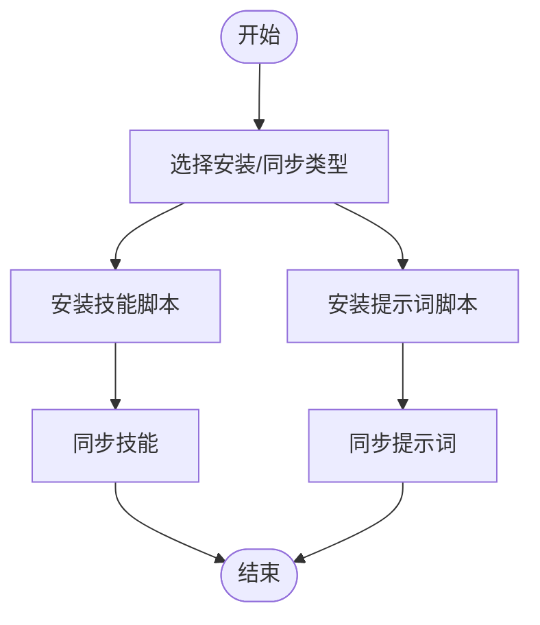

**图表来源**
- [scripts/install-codex-skills.sh](file://scripts/install-codex-skills.sh)
- [scripts/install-codex-prompts.sh](file://scripts/install-codex-prompts.sh)
- [scripts/sync-codex-skills.py](file://scripts/sync-codex-skills.py)
- [scripts/sync-codex-prompts.py](file://scripts/sync-codex-prompts.py)

**章节来源**
- [scripts/install-codex-skills.sh](file://scripts/install-codex-skills.sh)
- [scripts/install-codex-prompts.sh](file://scripts/install-codex-prompts.sh)
- [scripts/sync-codex-skills.py](file://scripts/sync-codex-skills.py)
- [scripts/sync-codex-prompts.py](file://scripts/sync-codex-prompts.py)

### 数据与研究
- 数据资产
  - fundamentals.json、watchlist.json：基础与关注列表
  - cross_asset_10y_2016-2026.csv、correlation_3stocks_2021-2026.csv、morningstar_fair_value_20260519.csv：时序与估值数据
- 研究方法
  - research/MRVL/MRVL_data_collection.md：特定标的的数据收集方法与步骤

**章节来源**
- [data/fundamentals.json](file://data/fundamentals.json)
- [data/watchlist.json](file://data/watchlist.json)
- [data/cross_asset_10y_2016-2026.csv](file://data/cross_asset_10y_2016-2026.csv)
- [data/correlation_3stocks_2021-2026.csv](file://data/correlation_3stocks_2021-2026.csv)
- [data/morningstar_fair_value_20260519.csv](file://data/morningstar_fair_value_20260519.csv)
- [research/MRVL/MRVL_data_collection.md](file://research/MRVL/MRVL_data_collection.md)

## 依赖分析
- 内部依赖
  - 技能与提示词共同驱动工具链；工具之间相对独立，通过数据层解耦。
  - **新增**：学习系统依赖于 `.learnings/` 目录结构和标准文件格式。
  - **新增**：钩子系统依赖于 Claude Code 的钩子机制和 jq 工具。
- 外部依赖
  - 模型API（OpenAI等）通过代理配置与环境变量注入。
  - 数据源（网页、CSV/JSON）通过工具脚本访问。
- 潜在循环依赖
  - 当前结构无直接循环依赖；建议在新增工具时保持单向依赖关系。

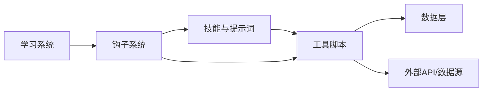

**图表来源**
- [codex-skills/investment-memo-craft/SKILL.md](file://codex-skills/investment-memo-craft/SKILL.md)
- [codex-skills/investment-memo-craft/agents/openai.yaml](file://codex-skills/investment-memo-craft/agents/openai.yaml)
- [scripts/learnings-digest.sh](file://scripts/learnings-digest.sh)
- [.claude/settings.json](file://.claude/settings.json)
- [tools/morningstar_fair_value.py](file://tools/morningstar_fair_value.py)
- [tools/stock_screener.py](file://tools/stock_screener.py)
- [tools/xueqiu_scraper.py](file://tools/xueqiu_scraper.py)
- [data/fundamentals.json](file://data/fundamentals.json)
- [data/watchlist.json](file://data/watchlist.json)

**章节来源**
- [codex-skills/investment-memo-craft/SKILL.md](file://codex-skills/investment-memo-craft/SKILL.md)
- [codex-skills/investment-memo-craft/agents/openai.yaml](file://codex-skills/investment-memo-craft/agents/openai.yaml)
- [scripts/learnings-digest.sh](file://scripts/learnings-digest.sh)
- [.claude/settings.json](file://.claude/settings.json)
- [tools/morningstar_fair_value.py](file://tools/morningstar_fair_value.py)
- [tools/stock_screener.py](file://tools/stock_screener.py)
- [tools/xueqiu_scraper.py](file://tools/xueqiu_scraper.py)
- [data/fundamentals.json](file://data/fundamentals.json)
- [data/watchlist.json](file://data/watchlist.json)

## 性能考虑
- 数据I/O
  - 使用列式存储与索引优化，减少重复读取。
  - 批量处理与并行化（注意线程安全与锁）。
- 计算优化
  - 优先使用向量化操作，避免逐行循环。
  - 对大规模回测使用分块计算与增量更新。
- 网络请求
  - 设置合理的超时与重试策略，避免阻塞主流程。
  - 使用连接池与缓存减少重复请求。
- **新增**：学习系统性能
  - 学习摘要生成应限制条目数量，避免上下文过大。
  - 定期检查学习文件的大小和格式，保持高效读取。
  - 使用增量更新而非全量重写学习文件。

[本节为通用指导，不直接分析具体文件]

## 故障排除指南
- 常见问题
  - 环境变量未设置：检查API密钥与数据源凭据是否已正确配置。
  - 路径错误：确认数据文件路径与输出目录权限。
  - 网络异常：检查代理与防火墙设置，必要时切换数据源。
  - **新增**：学习系统问题
    - 学习摘要未注入：检查 `.claude/settings.json` 配置和 `jq` 命令可用性。
    - 学习文件损坏：验证 `.learnings/` 目录结构和文件格式。
    - 钩子执行失败：检查脚本权限和执行环境。
- 日志与调试
  - 在工具中加入结构化日志，记录关键步骤与异常堆栈。
  - 使用最小数据集复现问题，逐步定位。
  - **新增**：钩子调试
    - 查看 Claude Code 的输出日志，确认钩子执行情况。
    - 手动执行学习摘要脚本验证功能。
- 安全最佳实践
  - 不在代码中硬编码敏感信息，使用环境变量或密钥管理服务。
  - 定期轮换密钥，限制最小权限。
  - **新增**：学习数据安全
    - 避免在学习文件中存储敏感信息。
    - 定期审查学习内容的隐私合规性。

**章节来源**
- [SECURITY.md](file://SECURITY.md)
- [codex-skills/investment-memo-craft/agents/openai.yaml](file://codex-skills/investment-memo-craft/agents/openai.yaml)
- [scripts/learnings-digest.sh](file://scripts/learnings-digest.sh)
- [.claude/settings.json](file://.claude/settings.json)

## 结论
本项目以技能与提示词为核心，结合工具链与数据资产，形成可扩展的投研工作流。**最新更新**：通过学习知识库系统和 SessionStart 钩子机制，实现了跨会话的机构记忆和学习沉淀功能，显著提升了团队协作效率和知识传承能力。通过清晰的贡献规范、完善的模板与脚本，以及新增的学习系统，开发者可以快速上手并持续演进系统能力。建议在新功能开发中遵循模块化设计、强化测试与安全实践，以提升整体质量与稳定性。

[本节为总结性内容，不直接分析具体文件]

## 附录
- 路线图与规划
  - docs/ROADMAP.md：项目阶段性目标与里程碑
- 入门学习路径
  - 阅读README与行为准则，了解项目愿景与协作原则
  - 熟悉技能与提示词结构，尝试运行现有工具
  - **新增**：学习知识库使用
    - 了解 `.learnings/` 目录结构和文件格式
    - 学习如何贡献新的学习条目
    - 理解 SessionStart 钩子的工作原理
  - 基于现有模板新增一个小型技能或工具，完成端到端验证
  - 提交PR并参与评审，融入社区协作

**章节来源**
- [docs/ROADMAP.md](file://docs/ROADMAP.md)
- [README.md](file://README.md)
- [CODE_OF_CONDUCT.md](file://CODE_OF_CONDUCT.md)
- [scripts/learnings-digest.sh](file://scripts/learnings-digest.sh)
- [.claude/settings.json](file://.claude/settings.json)