# 故障排除与调试

<cite>
**本文引用的文件**   
- [README_EN.md](file://README_EN.md)
- [AGENTS.md](file://AGENTS.md)
- [CLAUDE.md](file://CLAUDE.md)
- [SECURITY.md](file://SECURITY.md)
- [.github/ISSUE_TEMPLATE/bug_report.yml](file://.github/ISSUE_TEMPLATE/bug_report.yml)
- [.github/ISSUE_TEMPLATE/data_error.yml](file://.github/ISSUE_TEMPLATE/data_error.yml)
- [.github/ISSUE_TEMPLATE/suggestion.yml](file://.github/ISSUE_TEMPLATE/suggestion.yml)
- [.github/ISSUE_TEMPLATE/config.yml](file://.github/ISSUE_TEMPLATE/config.yml)
- [tools/log-command.sh](file://tools/log-command.sh)
- [scripts/install-codex-prompts.sh](file://scripts/install-codex-prompts.sh)
- [scripts/install-codex-skills.sh](file://scripts/install-codex-skills.sh)
- [scripts/sync-codex-prompts.py](file://scripts/sync-codex-prompts.py)
- [scripts/sync-codex-skills.py](file://scripts/sync-codex-skills.py)
</cite>

## 目录
1. [简介](#简介)
2. [项目结构](#项目结构)
3. [核心组件](#核心组件)
4. [架构总览](#架构总览)
5. [详细组件分析](#详细组件分析)
6. [依赖关系分析](#依赖关系分析)
7. [性能考虑](#性能考虑)
8. [故障排除指南](#故障排除指南)
9. [结论](#结论)
10. [附录](#附录)

## 简介
本指南面向开发者与维护者，提供针对该仓库的故障排除与调试方法。内容覆盖常见问题定位（如外部API连接失败、数据处理错误、权限配置问题）、日志分析与调试技巧、错误信息解读与修复建议、GitHub Issues模板使用规范、性能调优方法与工具、备份恢复与数据迁移、远程调试与问题重现等。文档在保持技术深度的同时，尽量以循序渐进的方式呈现，便于不同背景的读者快速上手。

## 项目结构
仓库采用“研究产出+脚本工具+技能与提示词”的组织方式：
- 研究与报告：reports 下按公司与主题归档大量Markdown研究报告
- 数据与资产：data 存放CSV/JSON等数据集；assets 存放相关资源
- 脚本与工具：scripts 提供安装与同步脚本；tools 提供数据分析与辅助工具
- 技能与提示词：codex-skills 与 codex-prompts 定义可复用的工作流与提示词
- 工程化与协作：.github/ISSUE_TEMPLATE 提供问题反馈模板；根级文档包含安全与行为准则

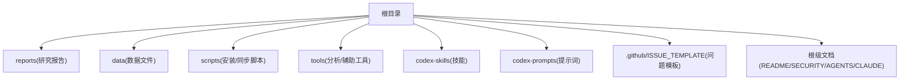

[本节为概念性概览，不直接分析具体文件]

## 核心组件
- 问题反馈模板：通过 .github/ISSUE_TEMPLATE 下的多类模板引导用户提交高质量问题，包括通用Bug、数据错误、建议等
- 日志与诊断脚本：tools/log-command.sh 提供统一的日志查看命令封装，便于快速定位运行期问题
- 安装与同步脚本：scripts 下的 shell/python 脚本用于安装/同步提示词与技能，便于环境一致性维护
- 根级文档：README_EN.md、SECURITY.md、AGENTS.md、CLAUDE.md 提供项目说明、安全策略与Agent行为规范，有助于理解系统边界与约束

**章节来源**
- [README_EN.md](file://README_EN.md)
- [SECURITY.md](file://SECURITY.md)
- [AGENTS.md](file://AGENTS.md)
- [CLAUDE.md](file://CLAUDE.md)
- [.github/ISSUE_TEMPLATE/bug_report.yml](file://.github/ISSUE_TEMPLATE/bug_report.yml)
- [.github/ISSUE_TEMPLATE/data_error.yml](file://.github/ISSUE_TEMPLATE/data_error.yml)
- [.github/ISSUE_TEMPLATE/suggestion.yml](file://.github/ISSUE_TEMPLATE/suggestion.yml)
- [tools/log-command.sh](file://tools/log-command.sh)
- [scripts/install-codex-prompts.sh](file://scripts/install-codex-prompts.sh)
- [scripts/install-codex-skills.sh](file://scripts/install-codex-skills.sh)
- [scripts/sync-codex-prompts.py](file://scripts/sync-codex-prompts.py)
- [scripts/sync-codex-skills.py](file://scripts/sync-codex-skills.py)

## 架构总览
从“问题发现—信息收集—定位—修复—验证—复盘”的角度，整体流程如下：

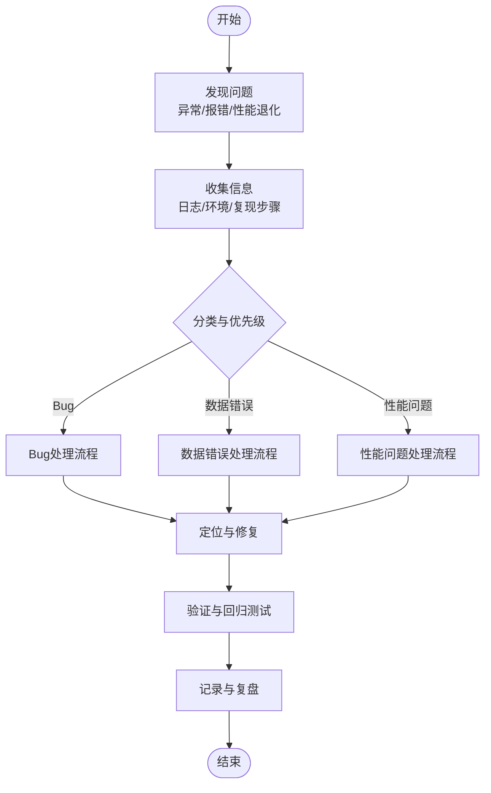

[本图为概念流程图，不直接映射到具体源码文件]

## 详细组件分析

### GitHub Issues 模板与问题上报
- 模板类型
  - bug_report.yml：通用缺陷上报，要求描述现象、期望行为、实际行为、复现步骤、环境信息等
  - data_error.yml：数据错误专用，要求数据来源、字段样例、预期与差异、影响范围等
  - suggestion.yml：功能建议或改进点，要求背景、目标方案、收益评估
  - config.yml：Issue 模板全局配置
- 填写要点
  - 明确环境与版本信息（操作系统、Python/Node 版本、关键依赖）
  - 提供最小可复现步骤与输入输出
  - 附上相关日志片段与时间戳
  - 对数据错误，给出原始数据片段与清洗规则

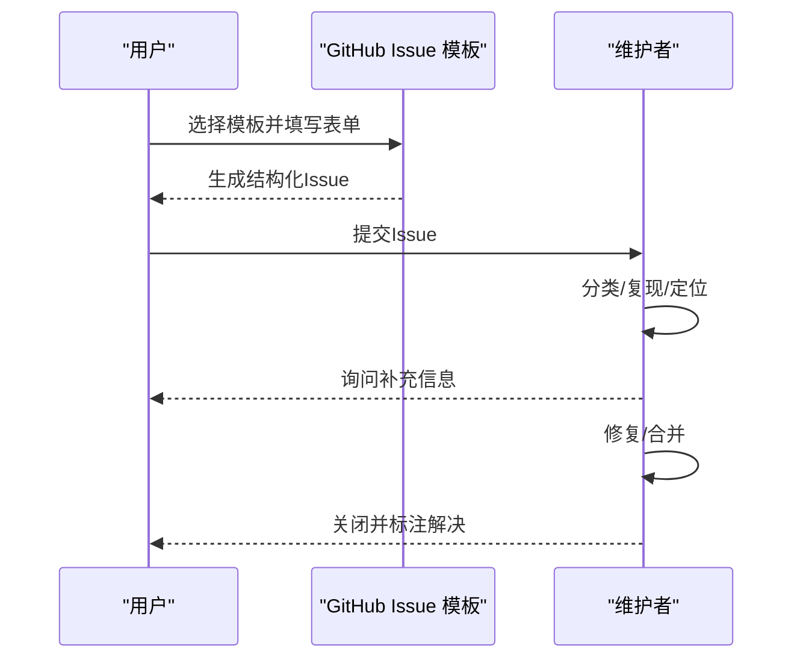

**图表来源**
- [.github/ISSUE_TEMPLATE/bug_report.yml](file://.github/ISSUE_TEMPLATE/bug_report.yml)
- [.github/ISSUE_TEMPLATE/data_error.yml](file://.github/ISSUE_TEMPLATE/data_error.yml)
- [.github/ISSUE_TEMPLATE/suggestion.yml](file://.github/ISSUE_TEMPLATE/suggestion.yml)
- [.github/ISSUE_TEMPLATE/config.yml](file://.github/ISSUE_TEMPLATE/config.yml)

**章节来源**
- [.github/ISSUE_TEMPLATE/bug_report.yml](file://.github/ISSUE_TEMPLATE/bug_report.yml)
- [.github/ISSUE_TEMPLATE/data_error.yml](file://.github/ISSUE_TEMPLATE/data_error.yml)
- [.github/ISSUE_TEMPLATE/suggestion.yml](file://.github/ISSUE_TEMPLATE/suggestion.yml)
- [.github/ISSUE_TEMPLATE/config.yml](file://.github/ISSUE_TEMPLATE/config.yml)

### 日志与诊断脚本
- tools/log-command.sh 提供统一日志查看入口，便于在不同环境下快速检索关键信息
- 典型用法
  - 指定时间窗口过滤
  - 关键字匹配（如错误码、请求ID）
  - 结合 tail/watch 进行实时观察
- 最佳实践
  - 在脚本中固定日志路径与轮转策略
  - 将关键上下文（如请求ID、用户ID、数据批次号）写入日志
  - 避免打印敏感信息（密钥、PII）

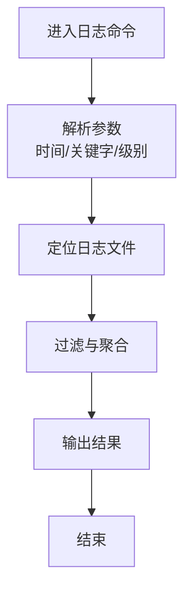

**图表来源**
- [tools/log-command.sh](file://tools/log-command.sh)

**章节来源**
- [tools/log-command.sh](file://tools/log-command.sh)

### 安装与同步脚本
- scripts/install-codex-prompts.sh / install-codex-skills.sh：一键安装提示词与技能到本地工作区
- scripts/sync-codex-prompts.py / sync-codex-skills.py：增量同步远端变更，保证团队一致性
- 常见排错
  - 权限不足：检查目标目录写权限
  - 网络超时：代理/镜像设置
  - 版本不一致：锁定依赖版本，记录安装日志

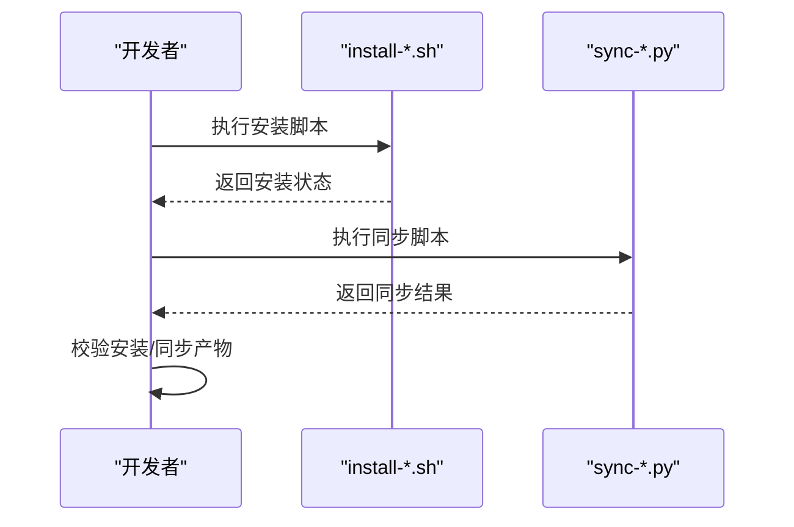

**图表来源**
- [scripts/install-codex-prompts.sh](file://scripts/install-codex-prompts.sh)
- [scripts/install-codex-skills.sh](file://scripts/install-codex-skills.sh)
- [scripts/sync-codex-prompts.py](file://scripts/sync-codex-prompts.py)
- [scripts/sync-codex-skills.py](file://scripts/sync-codex-skills.py)

**章节来源**
- [scripts/install-codex-prompts.sh](file://scripts/install-codex-prompts.sh)
- [scripts/install-codex-skills.sh](file://scripts/install-codex-skills.sh)
- [scripts/sync-codex-prompts.py](file://scripts/sync-codex-prompts.py)
- [scripts/sync-codex-skills.py](file://scripts/sync-codex-skills.py)

### 根级文档与安全策略
- README_EN.md：项目概述、使用说明与贡献指引
- SECURITY.md：安全漏洞披露流程与响应SLA
- AGENTS.md / CLAUDE.md：Agent 行为与能力边界，有助于排查由自动化流程引发的异常

**章节来源**
- [README_EN.md](file://README_EN.md)
- [SECURITY.md](file://SECURITY.md)
- [AGENTS.md](file://AGENTS.md)
- [CLAUDE.md](file://CLAUDE.md)

## 依赖关系分析
- 模块内聚与耦合
  - 脚本层（scripts）与工具层（tools）相对独立，主要依赖文件系统与标准库
  - 问题模板（.github/ISSUE_TEMPLATE）与代码无直接耦合，但作为协作契约影响问题流转效率
- 外部依赖
  - 安装/同步脚本可能依赖网络访问与外部仓库
  - 日志脚本依赖系统日志位置与权限
- 潜在风险
  - 硬编码路径与环境变量未集中管理
  - 缺少幂等性与回滚机制

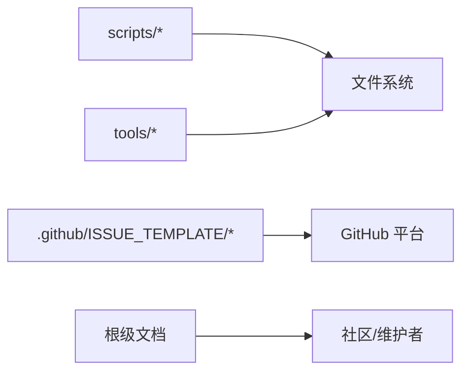

[本图为概念图，不直接映射到具体源码文件]

**章节来源**
- [scripts/install-codex-prompts.sh](file://scripts/install-codex-prompts.sh)
- [scripts/install-codex-skills.sh](file://scripts/install-codex-skills.sh)
- [scripts/sync-codex-prompts.py](file://scripts/sync-codex-prompts.py)
- [scripts/sync-codex-skills.py](file://scripts/sync-codex-skills.py)
- [tools/log-command.sh](file://tools/log-command.sh)
- [.github/ISSUE_TEMPLATE/bug_report.yml](file://.github/ISSUE_TEMPLATE/bug_report.yml)
- [.github/ISSUE_TEMPLATE/data_error.yml](file://.github/ISSUE_TEMPLATE/data_error.yml)
- [.github/ISSUE_TEMPLATE/suggestion.yml](file://.github/ISSUE_TEMPLATE/suggestion.yml)
- [.github/ISSUE_TEMPLATE/config.yml](file://.github/ISSUE_TEMPLATE/config.yml)

## 性能考虑
- 内存使用优化
  - 大文件读取采用流式/分块处理，避免一次性加载
  - 合理设置批大小与并发度，控制峰值内存
- CPU 性能分析
  - 使用系统级工具（如 perf、top、htop）定位热点函数
  - 对计算密集型任务进行向量化或并行化
- 网络请求优化
  - 启用连接复用与重试退避
  - 压缩传输与缓存热点数据
- 日志与监控
  - 减少高开销日志输出，按需开启详细日志
  - 引入指标采集（QPS、延迟、错误率）

[本节为通用指导，不直接分析具体文件]

## 故障排除指南

### API 连接失败
- 症状
  - 请求超时、连接拒绝、证书错误、鉴权失败
- 排查步骤
  - 确认网络连通与代理设置
  - 校验域名解析与端口可达
  - 检查凭据有效期与作用域
  - 抓取握手与HTTP报文，关注重定向与错误码
- 常见原因与修复
  - 防火墙/安全组拦截：调整白名单
  - 证书过期或不信任：更新CA链或禁用严格校验（谨慎）
  - 速率限制：实现指数退避与队列限流

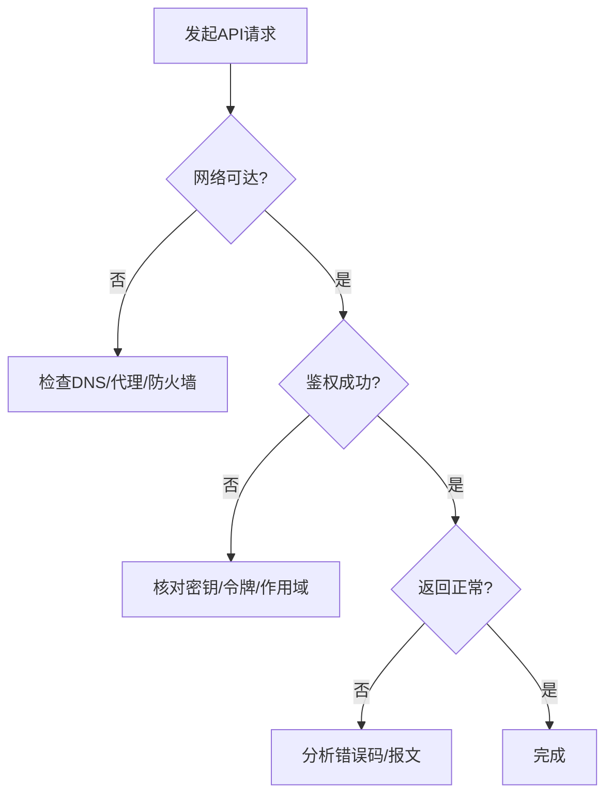

[本图为概念流程图，不直接映射到具体源码文件]

### 数据处理错误
- 症状
  - 字段缺失、类型不匹配、重复键、空指针/越界
- 排查步骤
  - 抽取最小样本，构造单元测试
  - 增加断言与Schema校验
  - 记录输入摘要与中间状态
- 常见原因与修复
  - 上游数据格式变更：适配兼容逻辑与告警
  - 并发写入冲突：加锁或幂等设计
  - 数值溢出/精度丢失：更换数据类型或算法

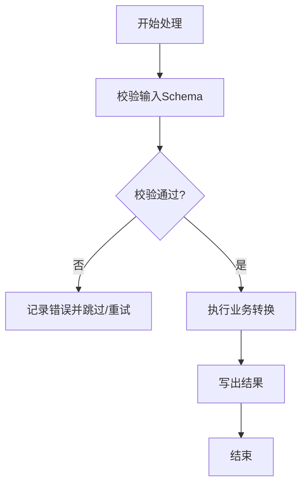

[本图为概念流程图，不直接映射到具体源码文件]

### 权限配置问题
- 症状
  - 读写失败、部署失败、服务启动报权限错误
- 排查步骤
  - 检查进程用户与目录/文件权限
  - 确认环境变量与配置文件中的路径
  - 审计容器/沙箱的安全策略
- 常见原因与修复
  - 非root用户无法写系统目录：改用应用目录
  - 密钥文件权限过宽：收紧至只读
  - SELinux/AppArmor 拦截：添加必要规则

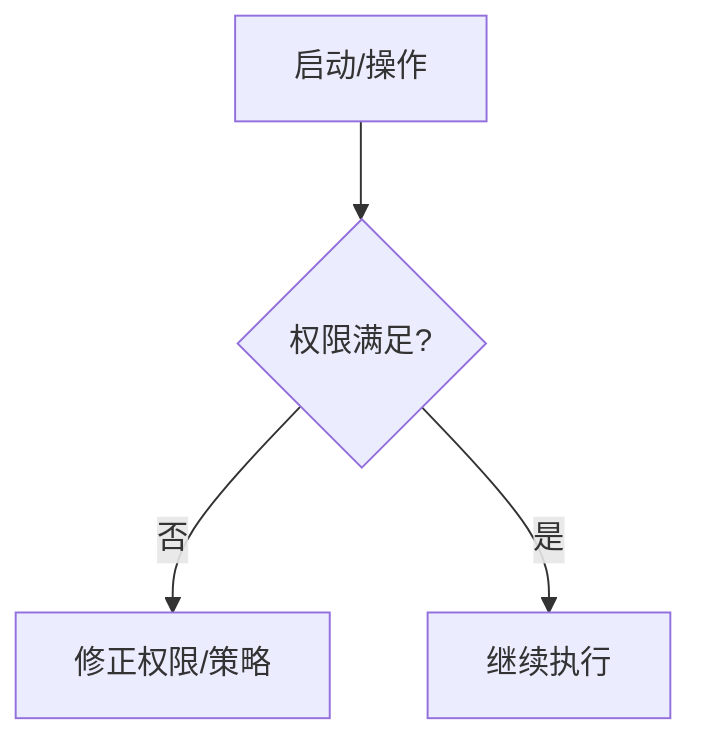

[本图为概念流程图，不直接映射到具体源码文件]

### 日志分析与调试技巧
- 日志级别设置
  - 生产默认 INFO/WARN，临时调试切换 DEBUG
  - 区分业务日志与系统日志，避免混用
- 关键信息提取
  - 请求ID、用户ID、数据批次、时间戳、错误码
- 性能瓶颈定位
  - 结合慢查询/慢日志与火焰图
  - 关注GC停顿、线程阻塞、IO等待

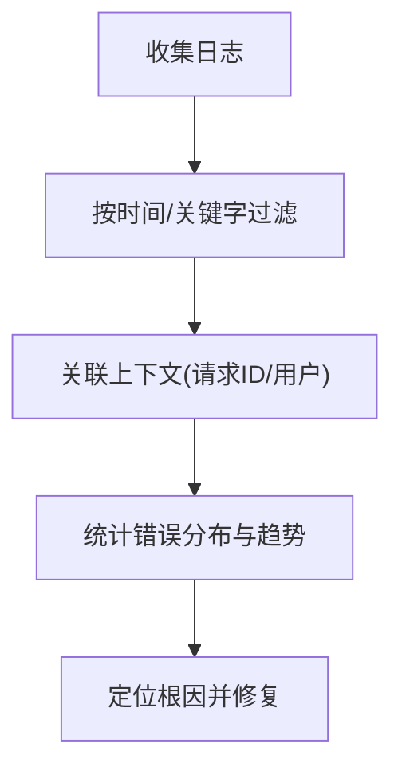

[本图为概念流程图，不直接映射到具体源码文件]

### 错误代码与异常信息解读
- 原则
  - 优先根据错误码分类（网络/认证/数据/业务）
  - 结合堆栈与上下文日志缩小范围
- 建议
  - 建立错误码字典与处理策略
  - 对可恢复错误实现自动重试与降级

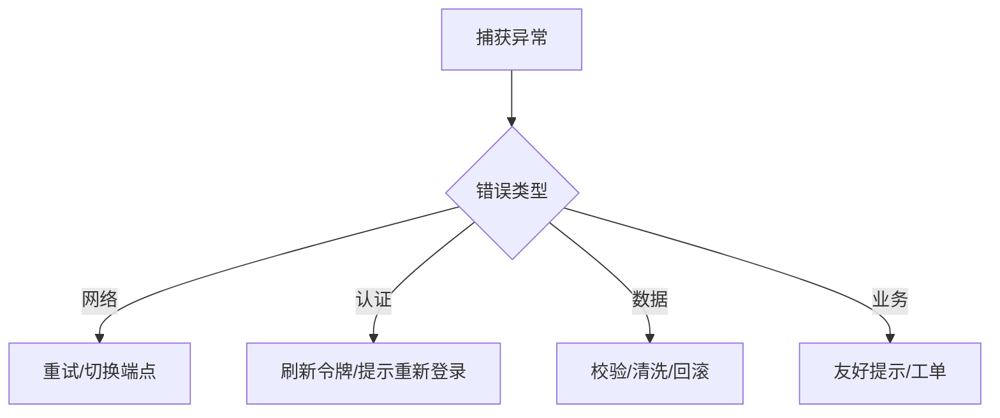

[本图为概念流程图，不直接映射到具体源码文件]

### 使用 GitHub Issues 模板有效报告问题
- 必备信息
  - 问题描述、期望与实际行为、复现步骤、环境信息、相关日志
- 数据错误专项
  - 数据来源、字段样例、差异对比、影响范围
- 建议
  - 使用最小复现集，避免附带无关文件
  - 附上截图/录屏与时间线

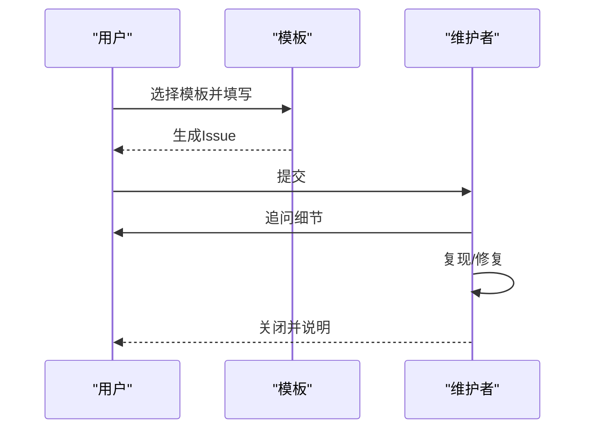

**图表来源**
- [.github/ISSUE_TEMPLATE/bug_report.yml](file://.github/ISSUE_TEMPLATE/bug_report.yml)
- [.github/ISSUE_TEMPLATE/data_error.yml](file://.github/ISSUE_TEMPLATE/data_error.yml)
- [.github/ISSUE_TEMPLATE/suggestion.yml](file://.github/ISSUE_TEMPLATE/suggestion.yml)
- [.github/ISSUE_TEMPLATE/config.yml](file://.github/ISSUE_TEMPLATE/config.yml)

**章节来源**
- [.github/ISSUE_TEMPLATE/bug_report.yml](file://.github/ISSUE_TEMPLATE/bug_report.yml)
- [.github/ISSUE_TEMPLATE/data_error.yml](file://.github/ISSUE_TEMPLATE/data_error.yml)
- [.github/ISSUE_TEMPLATE/suggestion.yml](file://.github/ISSUE_TEMPLATE/suggestion.yml)
- [.github/ISSUE_TEMPLATE/config.yml](file://.github/ISSUE_TEMPLATE/config.yml)

### 性能调优方法与工具
- 内存
  - 监控RSS/Heap，识别泄漏点；降低对象生命周期；使用生成器/迭代器
- CPU
  - 使用采样器定位热点；减少分支预测失败；利用并行与向量化
- 网络
  - 连接池、超时与重试策略；压缩与缓存；CDN/边缘加速
- 观测
  - 指标埋点、分布式追踪、错误率与延迟SLO

[本节为通用指导，不直接分析具体文件]

### 备份恢复与数据迁移
- 备份策略
  - 定期快照与增量备份；异地容灾；校验完整性
- 恢复演练
  - 制定RTO/RPO目标；定期演练恢复流程
- 数据迁移
  - 灰度发布与双写；回滚预案；幂等与去重

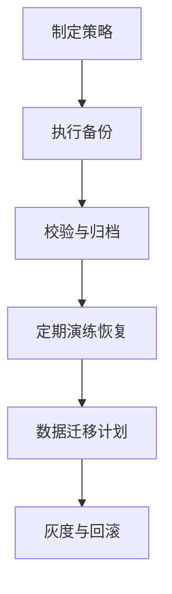

[本图为概念流程图，不直接映射到具体源码文件]

### 远程调试与问题重现
- 远程调试
  - 使用日志聚合与链路追踪；必要时开启远程调试端口（受控环境）
- 问题重现
  - 固化输入与种子；容器化环境；录制回放
- 安全注意
  - 脱敏敏感数据；最小权限；审计访问

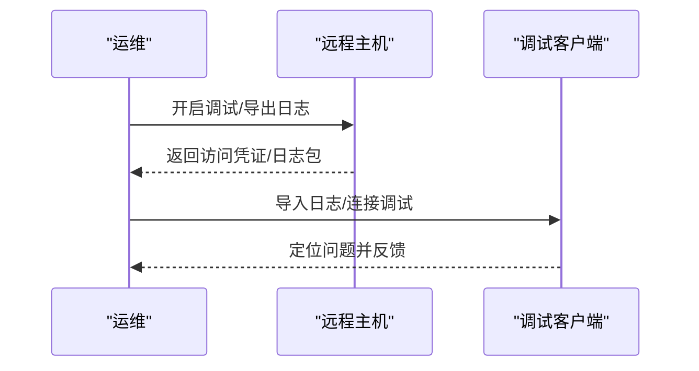

[本图为概念流程图，不直接映射到具体源码文件]

## 结论
通过标准化的问题上报模板、统一的日志与诊断脚本、完善的安装与同步流程，以及系统的性能与稳定性保障手段，可以显著提升问题定位效率与系统可靠性。建议持续完善错误码体系、指标观测与演练机制，形成闭环的质量保障体系。

## 附录
- 参考文档
  - 项目说明与安全策略：README_EN.md、SECURITY.md
  - Agent 行为与能力边界：AGENTS.md、CLAUDE.md
- 实用脚本
  - 日志查看：tools/log-command.sh
  - 安装与同步：scripts/install-codex-prompts.sh、scripts/install-codex-skills.sh、scripts/sync-codex-prompts.py、scripts/sync-codex-skills.py

**章节来源**
- [README_EN.md](file://README_EN.md)
- [SECURITY.md](file://SECURITY.md)
- [AGENTS.md](file://AGENTS.md)
- [CLAUDE.md](file://CLAUDE.md)
- [tools/log-command.sh](file://tools/log-command.sh)
- [scripts/install-codex-prompts.sh](file://scripts/install-codex-prompts.sh)
- [scripts/install-codex-skills.sh](file://scripts/install-codex-skills.sh)
- [scripts/sync-codex-prompts.py](file://scripts/sync-codex-prompts.py)
- [scripts/sync-codex-skills.py](file://scripts/sync-codex-skills.py)