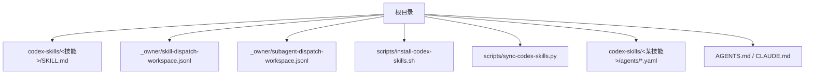
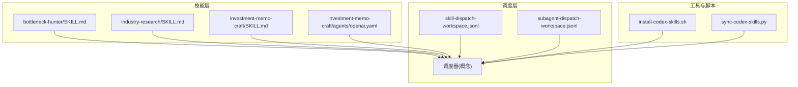
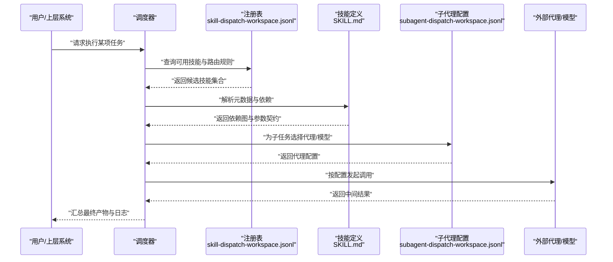
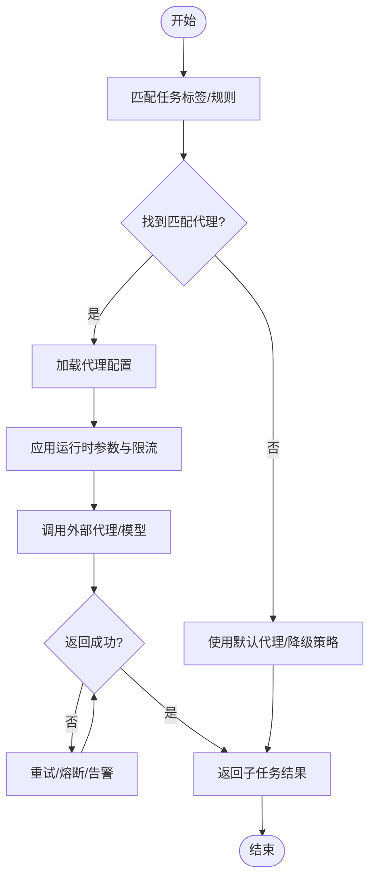
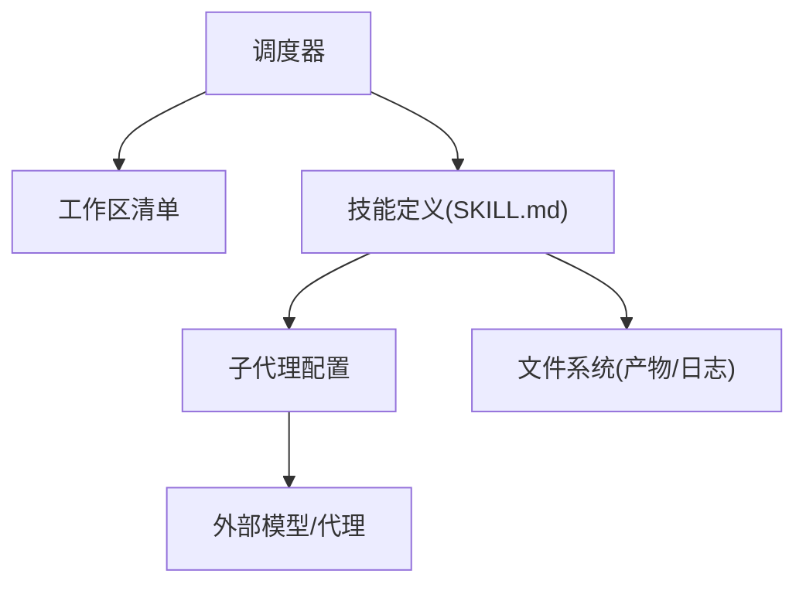

# AI技能系统架构

<cite>
**本文引用的文件**   
- [SKILL.md](file://codex-skills/bottleneck-hunter/SKILL.md)
- [SKILL.md](file://codex-skills/deep-company-series/SKILL.md)
- [SKILL.md](file://codex-skills/dyp-ask/SKILL.md)
- [SKILL.md](file://codex-skills/earnings-review/SKILL.md)
- [SKILL.md](file://codex-skills/financial-data/SKILL.md)
- [SKILL.md](file://codex-skills/industry-funnel/SKILL.md)
- [SKILL.md](file://codex-skills/industry-research/SKILL.md)
- [SKILL.md](file://codex-skills/investment-checklist/SKILL.md)
- [SKILL.md](file://codex-skills/investment-memo-craft/SKILL.md)
- [SKILL.md](file://codex-skills/investment-research/SKILL.md)
- [SKILL.md](file://codex-skills/investment-team/SKILL.md)
- [SKILL.md](file://codex-skills/management-deep-dive/SKILL.md)
- [SKILL.md](file://codex-skills/news-pulse/SKILL.md)
- [SKILL.md](file://codex-skills/portfolio-review/SKILL.md)
- [SKILL.md](file://codex-skills/private-company-research/SKILL.md)
- [SKILL.md](file://codex-skills/quality-screen/SKILL.md)
- [SKILL.md](file://codex-skills/thesis-drift/SKILL.md)
- [SKILL.md](file://codex-skills/thesis-tracker/SKILL.md)
- [SKILL.md](file://codex-skills/wechat-article/SKILL.md)
- [agents/openai.yaml](file://codex-skills/investment-memo-craft/agents/openai.yaml)
- [skill-dispatch-workspace.jsonl](file://_owner/skill-dispatch-workspace.jsonl)
- [subagent-dispatch-workspace.jsonl](file://_owner/subagent-dispatch-workspace.jsonl)
- [install-codex-skills.sh](file://scripts/install-codex-skills.sh)
- [sync-codex-skills.py](file://scripts/sync-codex-skills.py)
- [AGENTS.md](file://AGENTS.md)
- [CLAUDE.md](file://CLAUDE.md)
</cite>

## 目录
1. [简介](#简介)
2. [项目结构](#项目结构)
3. [核心组件](#核心组件)
4. [架构总览](#架构总览)
5. [详细组件分析](#详细组件分析)
6. [依赖关系分析](#依赖关系分析)
7. [性能考虑](#性能考虑)
8. [故障排查指南](#故障排查指南)
9. [结论](#结论)
10. [附录](#附录)

## 简介
本文件面向开发者，系统化阐述AI技能系统的整体架构与实现要点，重点覆盖：
- SKILL.md 文件格式规范（元数据、参数、执行逻辑）
- 技能调度机制（发现、加载、执行流程）
- 子代理配置系统（subagent-dispatch-workspace.jsonl 的格式与策略）
- 技能间依赖与通信机制
- 开发最佳实践（代码组织、错误处理、性能优化）
- 调试与测试方法
- 示例与配置文件说明

## 项目结构
仓库采用“以能力为中心”的组织方式：每个技能一个目录，包含描述性 SKILL.md；部分复杂技能在 agents 子目录中定义外部代理配置。顶层提供安装与同步脚本，以及用于全局调度的工作区清单。

图示来源
- [install-codex-skills.sh](file://scripts/install-codex-skills.sh)
- [sync-codex-skills.py](file://scripts/sync-codex-skills.py)
- [skill-dispatch-workspace.jsonl](file://_owner/skill-dispatch-workspace.jsonl)
- [subagent-dispatch-workspace.jsonl](file://_owner/subagent-dispatch-workspace.jsonl)
- [agents/openai.yaml](file://codex-skills/investment-memo-craft/agents/openai.yaml)
- [AGENTS.md](file://AGENTS.md)
- [CLAUDE.md](file://CLAUDE.md)

章节来源
- [install-codex-skills.sh](file://scripts/install-codex-skills.sh)
- [sync-codex-skills.py](file://scripts/sync-codex-skills.py)
- [skill-dispatch-workspace.jsonl](file://_owner/skill-dispatch-workspace.jsonl)
- [subagent-dispatch-workspace.jsonl](file://_owner/subagent-dispatch-workspace.jsonl)
- [agents/openai.yaml](file://codex-skills/investment-memo-craft/agents/openai.yaml)
- [AGENTS.md](file://AGENTS.md)
- [CLAUDE.md](file://CLAUDE.md)

## 核心组件
- 技能定义（SKILL.md）：声明式描述技能的名称、用途、输入参数、输出产物、前置条件、依赖关系与执行步骤。
- 调度工作区（skill-dispatch-workspace.jsonl）：集中注册可用技能及其运行环境、优先级、路由规则等。
- 子代理工作区（subagent-dispatch-workspace.jsonl）：为子任务分配专用代理实例或模型，支持按场景选择不同推理后端。
- 安装与同步脚本：将 codex-skills 内容部署到目标位置，并维护版本一致性。
- 代理配置（agents/*.yaml）：为特定技能的外部代理调用提供模型、参数、鉴权等配置。

章节来源
- [SKILL.md](file://codex-skills/bottleneck-hunter/SKILL.md)
- [SKILL.md](file://codex-skills/industry-research/SKILL.md)
- [SKILL.md](file://codex-skills/investment-memo-craft/SKILL.md)
- [skill-dispatch-workspace.jsonl](file://_owner/skill-dispatch-workspace.jsonl)
- [subagent-dispatch-workspace.jsonl](file://_owner/subagent-dispatch-workspace.jsonl)
- [install-codex-skills.sh](file://scripts/install-codex-skills.sh)
- [sync-codex-skills.py](file://scripts/sync-codex-skills.py)
- [agents/openai.yaml](file://codex-skills/investment-memo-craft/agents/openai.yaml)

## 架构总览
系统由“技能定义 + 调度器 + 子代理 + 工具链”构成。调度器读取工作区清单，解析各技能的元数据与依赖，按需加载并编排执行；子代理根据任务类型选择合适模型或后端；安装与同步脚本保障环境一致性与可复现性。

图示来源
- [SKILL.md](file://codex-skills/bottleneck-hunter/SKILL.md)
- [SKILL.md](file://codex-skills/industry-research/SKILL.md)
- [SKILL.md](file://codex-skills/investment-memo-craft/SKILL.md)
- [agents/openai.yaml](file://codex-skills/investment-memo-craft/agents/openai.yaml)
- [skill-dispatch-workspace.jsonl](file://_owner/skill-dispatch-workspace.jsonl)
- [subagent-dispatch-workspace.jsonl](file://_owner/subagent-dispatch-workspace.jsonl)
- [install-codex-skills.sh](file://scripts/install-codex-skills.sh)
- [sync-codex-skills.py](file://scripts/sync-codex-skills.py)

## 详细组件分析

### SKILL.md 文件格式规范
SKILL.md 是技能的声明式入口，建议包含以下结构化段落（字段名仅为约定，具体以实际文件为准）：
- 元数据
  - 名称、版本、作者、许可证
  - 适用场景与目标用户
  - 前置条件（如需要的外部工具、环境变量、权限）
- 参数配置
  - 输入参数列表（名称、类型、默认值、是否必填、取值范围）
  - 输出产物（报告、图表、数据文件等）
- 执行逻辑
  - 步骤化流程（顺序/并行）、分支条件、重试与回退策略
  - 对外部服务/工具的调用约定（鉴权、限流、超时）
- 依赖关系
  - 对其他技能的引用（上游产出作为下游输入）
  - 对共享资源（数据、模板、字典）的依赖
- 质量与合规
  - 校验规则、审计日志、敏感信息脱敏要求
- 示例与提示
  - 典型用例、边界情况、常见错误与修复建议

章节来源
- [SKILL.md](file://codex-skills/bottleneck-hunter/SKILL.md)
- [SKILL.md](file://codex-skills/industry-research/SKILL.md)
- [SKILL.md](file://codex-skills/investment-memo-craft/SKILL.md)

### 技能调度机制（发现、加载、执行）
调度流程遵循“清单驱动 + 声明式依赖”的模式：
- 发现：扫描 codex-skills 目录，收集所有 SKILL.md 并解析元数据
- 加载：依据 skill-dispatch-workspace.jsonl 的路由与约束，决定启用哪些技能及运行上下文
- 执行：按依赖拓扑排序，构建执行图；遇到外部代理时，按 subagent-dispatch-workspace.jsonl 选择模型/后端
- 结果：聚合输出至 reports 或指定目录，记录执行日志与指标

图示来源
- [skill-dispatch-workspace.jsonl](file://_owner/skill-dispatch-workspace.jsonl)
- [subagent-dispatch-workspace.jsonl](file://_owner/subagent-dispatch-workspace.jsonl)
- [SKILL.md](file://codex-skills/industry-research/SKILL.md)

章节来源
- [skill-dispatch-workspace.jsonl](file://_owner/skill-dispatch-workspace.jsonl)
- [subagent-dispatch-workspace.jsonl](file://_owner/subagent-dispatch-workspace.jsonl)
- [SKILL.md](file://codex-skills/bottleneck-hunter/SKILL.md)

### 子代理配置系统（subagent-dispatch-workspace.jsonl）
该文件用于为子任务选择代理实例或模型，典型字段包括：
- 任务标签/匹配规则：用于将子任务映射到特定代理
- 代理标识：模型名称、提供商、端点地址
- 运行时参数：温度、最大长度、重试次数、超时
- 配额与限流：并发度、速率限制、熔断阈值
- 安全与审计：鉴权方式、密钥来源、访问日志开关

图示来源
- [subagent-dispatch-workspace.jsonl](file://_owner/subagent-dispatch-workspace.jsonl)

章节来源
- [subagent-dispatch-workspace.jsonl](file://_owner/subagent-dispatch-workspace.jsonl)

### 技能间的依赖与通信
- 依赖声明：通过 SKILL.md 中的依赖段声明上游技能与所需产物
- 数据契约：明确输入/输出的数据结构、命名空间与版本
- 通信方式：文件系统（共享目录）、消息队列（可选扩展）、标准输出/日志
- 冲突解决：同名产物需带版本号或命名空间隔离；调度器负责去重与合并

[此图为概念示意，无需图示来源]

章节来源
- [SKILL.md](file://codex-skills/investment-memo-craft/SKILL.md)

### 代理配置示例（agents/openai.yaml）
针对需要外部模型的复杂技能，可在 agents 目录下提供 YAML 配置，通常包含：
- 模型标识与版本
- 鉴权信息（密钥路径或环境变量）
- 调用参数（temperature、max_tokens、top_p 等）
- 重试与超时策略
- 日志与追踪开关

章节来源
- [agents/openai.yaml](file://codex-skills/investment-memo-craft/agents/openai.yaml)

### 安装与同步脚本
- install-codex-skills.sh：将 codex-skills 内容复制到目标目录，建立软链接或更新索引
- sync-codex-skills.py：拉取远程变更、对比差异、增量更新并生成变更日志

章节来源
- [install-codex-skills.sh](file://scripts/install-codex-skills.sh)
- [sync-codex-skills.py](file://scripts/sync-codex-skills.py)

### 开发者指引与约定
- AGENTS.md / CLAUDE.md：提供通用行为约定、编码风格、提交规范与安全要求

章节来源
- [AGENTS.md](file://AGENTS.md)
- [CLAUDE.md](file://CLAUDE.md)

## 依赖关系分析
- 内聚与耦合
  - 高内聚：每个 SKILL.md 聚焦单一职责，参数与输出契约清晰
  - 低耦合：通过工作区清单与子代理配置解耦调度与实现
- 直接/间接依赖
  - 直接：调度器 -> 工作区清单 -> 技能定义
  - 间接：技能 -> 外部代理/模型 -> 网络/鉴权服务
- 循环依赖
  - 通过依赖声明与拓扑排序避免环；若出现环，需在 SKILL.md 中标注拆分或引入异步批处理
- 外部依赖
  - 外部模型/代理：通过 subagent-dispatch-workspace.jsonl 管理
  - 文件系统：产物与日志落盘

图示来源
- [skill-dispatch-workspace.jsonl](file://_owner/skill-dispatch-workspace.jsonl)
- [subagent-dispatch-workspace.jsonl](file://_owner/subagent-dispatch-workspace.jsonl)
- [SKILL.md](file://codex-skills/industry-research/SKILL.md)

章节来源
- [skill-dispatch-workspace.jsonl](file://_owner/skill-dispatch-workspace.jsonl)
- [subagent-dispatch-workspace.jsonl](file://_owner/subagent-dispatch-workspace.jsonl)
- [SKILL.md](file://codex-skills/bottleneck-hunter/SKILL.md)

## 性能考虑
- 并行与批处理：对无依赖的子任务并行执行；批量调用外部模型以降低握手开销
- 缓存与复用：对稳定中间结果进行缓存，避免重复计算
- 限流与退避：对第三方接口实施指数退避与熔断，防止雪崩
- 资源隔离：为高成本任务设置独立配额与超时，避免影响其他任务
- 产物压缩与增量更新：减少I/O与传输成本

[本节为通用指导，不直接分析具体文件]

## 故障排查指南
- 常见问题定位
  - 技能未生效：检查是否在 skill-dispatch-workspace.jsonl 中注册且路径正确
  - 子代理失败：核对 subagent-dispatch-workspace.jsonl 的模型与鉴权配置
  - 依赖缺失：确认上游技能已执行并产出约定文件
  - 权限问题：确保读写目录权限与密钥文件可读
- 日志与追踪
  - 在 SKILL.md 中约定关键步骤的日志输出位置与级别
  - 为外部代理调用增加请求ID以便跨链路追踪
- 快速恢复
  - 对幂等操作启用重试；对非幂等操作引入补偿与回滚
  - 提供降级策略（如切换备用模型或简化流程）

章节来源
- [skill-dispatch-workspace.jsonl](file://_owner/skill-dispatch-workspace.jsonl)
- [subagent-dispatch-workspace.jsonl](file://_owner/subagent-dispatch-workspace.jsonl)
- [SKILL.md](file://codex-skills/earnings-review/SKILL.md)

## 结论
本系统以声明式 SKILL.md 为核心，配合工作区清单与子代理配置，实现了可插拔、可扩展的技能生态。通过清晰的依赖契约与调度策略，既能满足复杂投研流水线的需求，也便于团队协同与持续演进。建议在后续迭代中完善统一的数据契约与监控体系，进一步提升稳定性与可观测性。

[本节为总结性内容，不直接分析具体文件]

## 附录

### SKILL.md 字段参考（建议）
- 元数据：名称、版本、作者、许可证、适用场景
- 参数：输入参数（名称、类型、默认值、必填、约束）
- 输出：产物清单（文件名、格式、存储路径）
- 执行：步骤、分支、重试、回退
- 依赖：上游技能、共享资源
- 质量：校验、审计、脱敏
- 示例：用例、边界、排错

章节来源
- [SKILL.md](file://codex-skills/quality-screen/SKILL.md)
- [SKILL.md](file://codex-skills/thesis-tracker/SKILL.md)
- [SKILL.md](file://codex-skills/wechat-article/SKILL.md)

### 示例与配置文件说明
- 示例技能：bottleneck-hunter、industry-research、investment-memo-craft
- 代理配置：investment-memo-craft/agents/openai.yaml
- 调度清单：_owner/skill-dispatch-workspace.jsonl、_owner/subagent-dispatch-workspace.jsonl
- 安装与同步：scripts/install-codex-skills.sh、scripts/sync-codex-skills.py

章节来源
- [SKILL.md](file://codex-skills/bottleneck-hunter/SKILL.md)
- [SKILL.md](file://codex-skills/industry-research/SKILL.md)
- [SKILL.md](file://codex-skills/investment-memo-craft/SKILL.md)
- [agents/openai.yaml](file://codex-skills/investment-memo-craft/agents/openai.yaml)
- [skill-dispatch-workspace.jsonl](file://_owner/skill-dispatch-workspace.jsonl)
- [subagent-dispatch-workspace.jsonl](file://_owner/subagent-dispatch-workspace.jsonl)
- [install-codex-skills.sh](file://scripts/install-codex-skills.sh)
- [sync-codex-skills.py](file://scripts/sync-codex-skills.py)