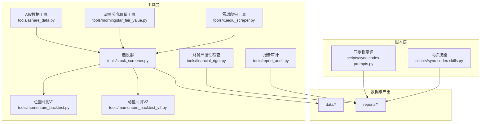
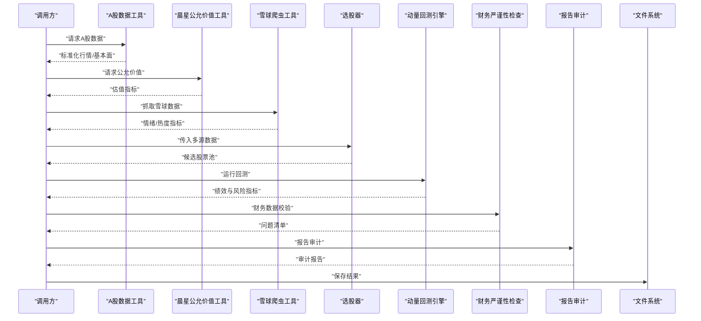
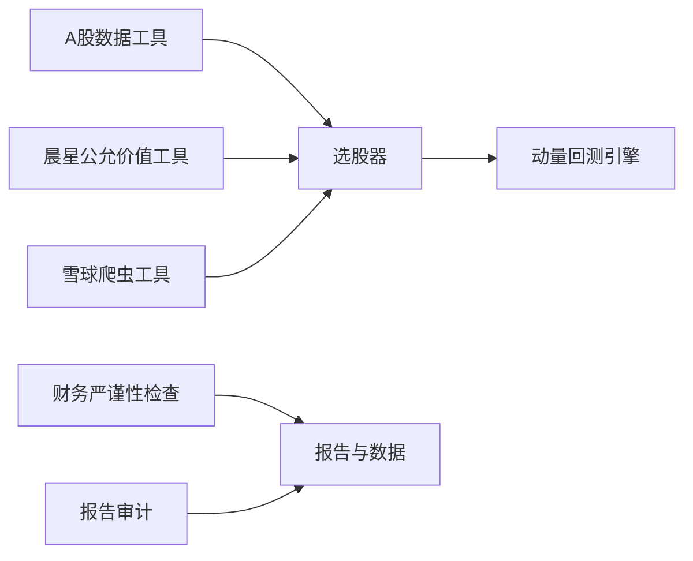

# 工具集成指南

<cite>
**本文引用的文件**   
- [tools/ashare_data.py](file://tools/ashare_data.py)
- [tools/morningstar_fair_value.py](file://tools/morningstar_fair_value.py)
- [tools/xueqiu_scraper.py](file://tools/xueqiu_scraper.py)
- [tools/stock_screener.py](file://tools/stock_screener.py)
- [tools/momentum_backtest.py](file://tools/momentum_backtest.py)
- [tools/momentum_backtest_v2.py](file://tools/momentum_backtest_v2.py)
- [tools/financial_rigor.py](file://tools/financial_rigor.py)
- [tools/report_audit.py](file://tools/report_audit.py)
- [scripts/sync-codex-prompts.py](file://scripts/sync-codex-prompts.py)
- [scripts/sync-codex-skills.py](file://scripts/sync-codex-skills.py)
- [README_EN.md](file://README_EN.md)
</cite>

## 目录
1. [简介](#简介)
2. [项目结构](#项目结构)
3. [核心组件](#核心组件)
4. [架构总览](#架构总览)
5. [详细组件分析](#详细组件分析)
6. [依赖关系分析](#依赖关系分析)
7. [性能考虑](#性能考虑)
8. [故障排查指南](#故障排查指南)
9. [结论](#结论)
10. [附录](#附录)

## 简介
本指南面向开发者，提供一套可复用的Python工具脚本开发规范与集成实践。围绕数据抓取、筛选回测、财务严谨性校验与报告审计等关键能力，给出代码结构、命名约定、注释标准、API接口设计原则、外部数据源集成方法（晨星公允价值、雪球爬虫、A股数据）、错误处理与异常管理、性能优化技巧，以及可复用数据处理模块的编写范式与测试建议。目标是帮助团队快速构建稳定、可维护、可扩展的数据与分析工具链。

## 项目结构
仓库采用“按功能域组织”的结构：
- tools：核心工具脚本集合，涵盖A股数据、晨星公允价值、雪球爬虫、选股器、动量回测、财务严谨性检查、报告审计等。
- scripts：辅助安装与同步脚本，用于环境准备与资源同步。
- data：示例或中间结果数据文件。
- reports：投研报告与专题文档。
- codex-prompts / codex-skills：提示词与技能定义，驱动研究流程。
- docs：路线图与文章。

图表来源
- [tools/ashare_data.py](file://tools/ashare_data.py)
- [tools/morningstar_fair_value.py](file://tools/morningstar_fair_value.py)
- [tools/xueqiu_scraper.py](file://tools/xueqiu_scraper.py)
- [tools/stock_screener.py](file://tools/stock_screener.py)
- [tools/momentum_backtest.py](file://tools/momentum_backtest.py)
- [tools/momentum_backtest_v2.py](file://tools/momentum_backtest_v2.py)
- [tools/financial_rigor.py](file://tools/financial_rigor.py)
- [tools/report_audit.py](file://tools/report_audit.py)
- [scripts/sync-codex-prompts.py](file://scripts/sync-codex-prompts.py)
- [scripts/sync-codex-skills.py](file://scripts/sync-codex-skills.py)

章节来源
- [README_EN.md](file://README_EN.md)

## 核心组件
- A股数据工具：负责A股市场数据的获取、清洗与标准化输出，供后续筛选与回测使用。
- 晨星公允价值工具：对接晨星公允价值数据，进行估值指标计算与排序。
- 雪球爬虫工具：从雪球平台抓取市场情绪、讨论热度等辅助信息。
- 选股器：整合多源数据，执行因子筛选与组合初筛。
- 动量回测引擎：对策略进行历史回测，评估收益与风险指标。
- 财务严谨性检查：对财务数据进行一致性、合理性校验。
- 报告审计：对研究报告进行质量与合规性审查。

章节来源
- [tools/ashare_data.py](file://tools/ashare_data.py)
- [tools/morningstar_fair_value.py](file://tools/morningstar_fair_value.py)
- [tools/xueqiu_scraper.py](file://tools/xueqiu_scraper.py)
- [tools/stock_screener.py](file://tools/stock_screener.py)
- [tools/momentum_backtest.py](file://tools/momentum_backtest.py)
- [tools/momentum_backtest_v2.py](file://tools/momentum_backtest_v2.py)
- [tools/financial_rigor.py](file://tools/financial_rigor.py)
- [tools/report_audit.py](file://tools/report_audit.py)

## 架构总览
整体架构遵循“数据接入—加工—筛选—回测—审计”的流水线模式：
- 数据接入层：A股数据、晨星公允价值、雪球爬虫分别提供结构化数据。
- 加工与筛选层：选股器统一输入，执行因子计算与筛选。
- 回测与评估层：动量回测引擎对候选池进行历史表现评估。
- 审计与输出层：财务严谨性与报告审计保障数据与报告质量，最终输出至reports与data目录。

图表来源
- [tools/ashare_data.py](file://tools/ashare_data.py)
- [tools/morningstar_fair_value.py](file://tools/morningstar_fair_value.py)
- [tools/xueqiu_scraper.py](file://tools/xueqiu_scraper.py)
- [tools/stock_screener.py](file://tools/stock_screener.py)
- [tools/momentum_backtest.py](file://tools/momentum_backtest.py)
- [tools/momentum_backtest_v2.py](file://tools/momentum_backtest_v2.py)
- [tools/financial_rigor.py](file://tools/financial_rigor.py)
- [tools/report_audit.py](file://tools/report_audit.py)

## 详细组件分析

### A股数据工具
职责与边界
- 负责A股基础数据获取、清洗与标准化，为选股器与回测提供一致的数据格式。
- 输出字段应包含时间序列、价格、成交量、基本面指标等，并保证缺失值与异常值的处理策略明确。

API设计原则
- 函数签名清晰，参数具备默认值与类型约束；返回值为结构化对象或DataFrame。
- 参数验证前置，失败时抛出明确的异常类型与消息。
- 返回值包含元数据（如数据来源、更新时间、版本）。

错误处理与重试
- 网络请求需实现指数退避重试，区分可重试与不可重试错误。
- 记录详细的日志上下文（请求URL、参数、耗时、状态码）。

性能优化
- 批量请求合并、分页拉取、缓存热点数据。
- 使用内存映射或分块写入避免大对象驻留。

可复用数据处理模块
- 将清洗规则封装为独立函数，便于在多个工具中复用。
- 提供单元测试覆盖常见边界条件（空表、重复日期、停牌日等）。

章节来源
- [tools/ashare_data.py](file://tools/ashare_data.py)

### 晨星公允价值工具
职责与边界
- 读取或拉取晨星公允价值数据，计算低估幅度、护城河等级等指标。
- 与A股数据融合后进入选股器进行综合评分。

API设计原则
- 输入支持多种数据源路径或URL；输出为统一的估值指标表。
- 对缺失或不一致的公允价值进行标注与降级处理。

错误处理与重试
- 针对HTTP错误、解析错误进行分类处理，记录失败样本以便人工复核。
- 对限流与鉴权失败实施退避与告警。

性能优化
- 增量更新机制，仅拉取变更部分。
- 并行下载与解析，控制并发度以避免被限流。

章节来源
- [tools/morningstar_fair_value.py](file://tools/morningstar_fair_value.py)

### 雪球爬虫工具
职责与边界
- 抓取雪球平台的公开页面或接口数据，提取热度、讨论量等辅助指标。
- 遵守目标站点的使用条款与反爬策略，设置合理的请求间隔。

API设计原则
- 提供配置化入口（代理、UA、延迟），便于在不同环境下切换。
- 返回结构化数据，包含原始HTML摘要与解析后的指标。

错误处理与重试
- 识别验证码、封禁、超时等错误，自动切换代理与降速。
- 记录每次抓取的指纹（URL、时间、响应头）便于追踪。

性能优化
- 异步并发抓取，限制最大并发数。
- 本地缓存已抓取页面，减少重复请求。

章节来源
- [tools/xueqiu_scraper.py](file://tools/xueqiu_scraper.py)

### 选股器
职责与边界
- 整合A股数据、晨星公允价值、雪球情绪等多源数据，执行因子计算与筛选。
- 输出候选股票池及评分明细，供回测与深度研究使用。

API设计原则
- 支持策略参数注入（阈值、权重、窗口期）。
- 返回结果包含评分、排名、关键因子贡献度。

错误处理与重试
- 对缺失数据采取填充或剔除策略，并在结果中标注原因。
- 对异常因子值进行截尾或Winsorize处理。

性能优化
- 向量化计算优先，避免逐行循环。
- 使用索引与分区存储提升查询效率。

章节来源
- [tools/stock_screener.py](file://tools/stock_screener.py)

### 动量回测引擎（V1/V2）
职责与边界
- 基于候选池与交易信号，执行历史回测，计算年化收益、夏普比率、最大回撤等指标。
- V2在V1基础上改进信号生成与滑点模型。

API设计原则
- 统一回测接口，支持不同策略与参数集。
- 输出时序绩效与统计摘要，便于横向对比。

错误处理与重试
- 对数据缺失与停牌日进行插值或跳过处理。
- 记录每笔交易的滑点、手续费与成交概率假设。

性能优化
- 事件驱动或向量化回测，选择适合数据规模的方式。
- 缓存中间结果，支持断点续跑。

章节来源
- [tools/momentum_backtest.py](file://tools/momentum_backtest.py)
- [tools/momentum_backtest_v2.py](file://tools/momentum_backtest_v2.py)

### 财务严谨性检查
职责与边界
- 对财务报表数据进行一致性、合理性校验，识别异常波动与勾稽关系错误。
- 输出问题清单与建议修正方案。

API设计原则
- 输入为标准化的财务报表对象；输出为问题列表与严重级别。
- 支持自定义规则扩展。

错误处理与重试
- 对缺失字段进行标记与估算，记录估算依据。
- 对不满足基本会计恒等式的报表直接拒绝。

性能优化
- 规则引擎批处理，避免重复扫描。
- 使用索引加速跨期比对。

章节来源
- [tools/financial_rigor.py](file://tools/financial_rigor.py)

### 报告审计
职责与边界
- 对研究报告进行结构与内容审计，包括引用完整性、数据一致性、风险提示充分性等。
- 输出审计报告与整改建议。

API设计原则
- 支持Markdown与PDF等多种格式的审计。
- 输出结构化审计结果，便于自动化流转。

错误处理与重试
- 对无法解析的报告进行隔离与告警。
- 记录审计过程的时间线与证据。

性能优化
- 分块解析与并行审计，降低长报告处理时间。
- 缓存常用模板与规则库。

章节来源
- [tools/report_audit.py](file://tools/report_audit.py)

### 辅助脚本（提示词与技能同步）
职责与边界
- 同步codex-prompts与codex-skills到指定工作区，确保研究与生产环境一致。
- 提供幂等执行与差异更新。

API设计原则
- 命令行参数配置源与目标路径。
- 输出同步日志与变更摘要。

错误处理与重试
- 对权限不足与路径不存在进行友好提示。
- 支持断点续传与冲突解决策略。

性能优化
- 增量同步，仅复制变更文件。
- 压缩传输与并行写入。

章节来源
- [scripts/sync-codex-prompts.py](file://scripts/sync-codex-prompts.py)
- [scripts/sync-codex-skills.py](file://scripts/sync-codex-skills.py)

## 依赖关系分析
各工具之间的依赖关系如下：
- 选股器依赖A股数据、晨星公允价值、雪球爬虫的输出。
- 回测引擎依赖选股器的候选池与交易信号。
- 财务严谨性与报告审计作为质量门禁，作用于数据与报告产出。

图表来源
- [tools/ashare_data.py](file://tools/ashare_data.py)
- [tools/morningstar_fair_value.py](file://tools/morningstar_fair_value.py)
- [tools/xueqiu_scraper.py](file://tools/xueqiu_scraper.py)
- [tools/stock_screener.py](file://tools/stock_screener.py)
- [tools/momentum_backtest.py](file://tools/momentum_backtest.py)
- [tools/momentum_backtest_v2.py](file://tools/momentum_backtest_v2.py)
- [tools/financial_rigor.py](file://tools/financial_rigor.py)
- [tools/report_audit.py](file://tools/report_audit.py)

章节来源
- [tools/ashare_data.py](file://tools/ashare_data.py)
- [tools/morningstar_fair_value.py](file://tools/morningstar_fair_value.py)
- [tools/xueqiu_scraper.py](file://tools/xueqiu_scraper.py)
- [tools/stock_screener.py](file://tools/stock_screener.py)
- [tools/momentum_backtest.py](file://tools/momentum_backtest.py)
- [tools/momentum_backtest_v2.py](file://tools/momentum_backtest_v2.py)
- [tools/financial_rigor.py](file://tools/financial_rigor.py)
- [tools/report_audit.py](file://tools/report_audit.py)

## 性能考虑
- 缓存策略：对高频访问的外部数据与中间结果进行本地缓存，设置合理过期时间与失效键。
- 并发处理：对I/O密集型任务（网络请求、文件读写）采用线程或进程池；CPU密集型任务（因子计算）使用向量化或多进程。
- 内存管理：避免一次性加载超大表，采用分块读取与流式处理；及时释放临时对象。
- 数据库与存储：对时序数据使用列式存储或时序数据库，提高查询与聚合效率。
- 监控与度量：记录关键路径耗时、吞吐与错误率，建立基线并持续优化。

[本节为通用指导，无需特定文件来源]

## 故障排查指南
常见问题与定位步骤：
- 网络请求失败：检查代理、UA、限速策略；查看重试次数与退避间隔；确认目标站点可用性。
- 数据缺失或异常：核对时间对齐、停牌日处理、除权除息调整；检查缺失值填充策略。
- 回测结果异常：验证信号生成逻辑、滑点与手续费假设；检查持仓与资金曲线是否合理。
- 报告审计失败：确认文件格式与编码；检查引用链接与图片路径；查看审计日志中的具体规则命中情况。

建议的日志与告警：
- 统一日志格式，包含时间戳、模块名、级别、消息、上下文键值。
- 对关键错误分类（网络、解析、业务、系统），并触发相应告警通道。

章节来源
- [tools/ashare_data.py](file://tools/ashare_data.py)
- [tools/morningstar_fair_value.py](file://tools/morningstar_fair_value.py)
- [tools/xueqiu_scraper.py](file://tools/xueqiu_scraper.py)
- [tools/stock_screener.py](file://tools/stock_screener.py)
- [tools/momentum_backtest.py](file://tools/momentum_backtest.py)
- [tools/momentum_backtest_v2.py](file://tools/momentum_backtest_v2.py)
- [tools/financial_rigor.py](file://tools/financial_rigor.py)
- [tools/report_audit.py](file://tools/report_audit.py)

## 结论
通过统一的工具规范与清晰的架构分层，本项目实现了从数据接入到报告产出的全链路自动化与可审计化。建议在后续迭代中持续完善：
- 强化API契约与类型注解，提升可维护性。
- 完善单元测试与集成测试覆盖率，确保回归安全。
- 引入更完善的监控与告警体系，提升稳定性与可观测性。
- 探索更多外部数据源与因子，增强选股与回测能力。

[本节为总结性内容，无需特定文件来源]

## 附录
- 开发规范要点
  - 代码结构：每个工具一个主模块，子模块按职责拆分（数据、清洗、计算、输出）。
  - 命名约定：模块与函数使用小写下划线，类使用驼峰；常量全大写。
  - 注释标准：模块级docstring说明用途与依赖；函数级docstring描述参数、返回值与异常。
  - API设计：最小必要参数、默认值与类型约束、明确错误码与异常类型。
  - 错误处理：分类捕获、重试与退避、上下文日志、失败样本落盘。
  - 性能优化：缓存、并发、向量化、分块与流式处理。
  - 可复用模块：抽取通用清洗与校验逻辑，提供单元测试与示例用法。
- 测试用例建议
  - 单元测试：覆盖正常路径、边界条件与异常分支。
  - 集成测试：模拟外部数据源与网络异常，验证端到端流程。
  - 性能测试：基准测试关键路径，设定性能回归阈值。

[本节为通用指导，无需特定文件来源]