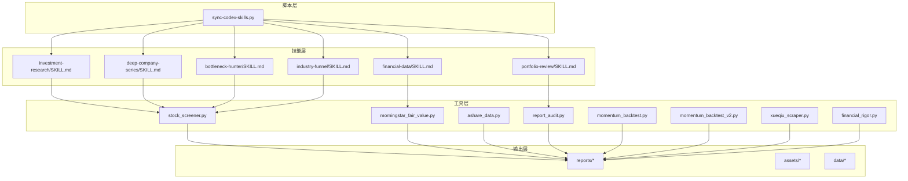
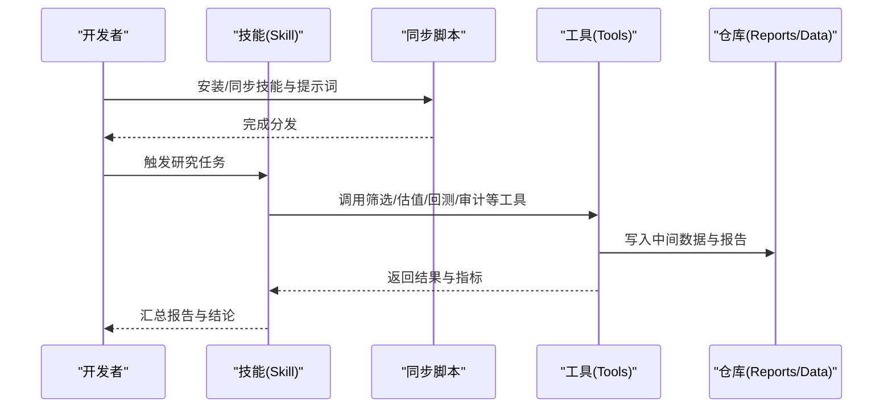
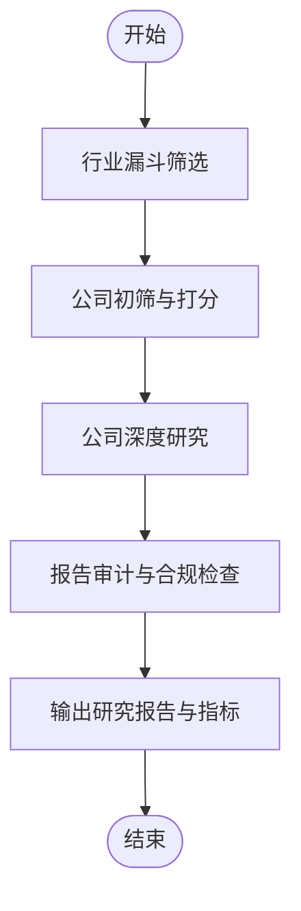
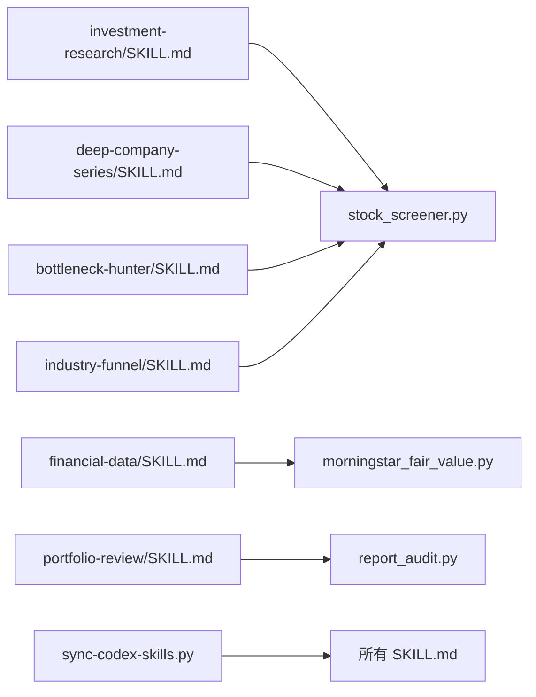

# 扩展开发最佳实践

<cite>
**本文引用的文件**   
- [README_EN.md](file://README_EN.md)
- [AGENTS.md](file://AGENTS.md)
- [CLAUDE.md](file://CLAUDE.md)
- [codex-skills/investment-research/SKILL.md](file://codex-skills/investment-research/SKILL.md)
- [codex-skills/financial-data/SKILL.md](file://codex-skills/financial-data/SKILL.md)
- [codex-skills/deep-company-series/SKILL.md](file://codex-skills/deep-company-series/SKILL.md)
- [codex-skills/bottleneck-hunter/SKILL.md](file://codex-skills/bottleneck-hunter/SKILL.md)
- [codex-skills/industry-funnel/SKILL.md](file://codex-skills/industry-funnel/SKILL.md)
- [codex-skills/portfolio-review/SKILL.md](file://codex-skills/portfolio-review/SKILL.md)
- [scripts/sync-codex-skills.py](file://scripts/sync-codex-skills.py)
- [tools/stock_screener.py](file://tools/stock_screener.py)
- [tools/morningstar_fair_value.py](file://tools/morningstar_fair_value.py)
- [tools/ashare_data.py](file://tools/ashare_data.py)
- [tools/report_audit.py](file://tools/report_audit.py)
- [tools/momentum_backtest.py](file://tools/momentum_backtest.py)
- [tools/momentum_backtest_v2.py](file://tools/momentum_backtest_v2.py)
- [tools/xueqiu_scraper.py](file://tools/xueqiu_scraper.py)
- [tools/financial_rigor.py](file://tools/financial_rigor.py)
</cite>

## 目录
1. [引言](#引言)
2. [项目结构](#项目结构)
3. [核心组件](#核心组件)
4. [架构总览](#架构总览)
5. [详细组件分析](#详细组件分析)
6. [依赖关系分析](#依赖关系分析)
7. [性能考量](#性能考量)
8. [故障排查指南](#故障排查指南)
9. [结论](#结论)
10. [附录](#附录)

## 引言
本指南面向高级开发者，聚焦于在现有投资研究工作流基础上进行扩展与二次开发。内容覆盖工作流设计、技能编排、状态管理、插件机制与钩子、事件处理、新分析模型开发、第三方服务集成、代码质量保障、性能调优与问题诊断等主题，并提供完整的实战案例与实践总结，帮助你在保持系统稳定性的同时快速交付高质量能力。

## 项目结构
仓库采用“技能（Skill）+ 工具（Tool）+ 脚本（Script）+ 报告（Report）”的模块化组织方式：
- codex-skills：以 SKILL.md 描述的技能定义，用于驱动研究流程与角色协作
- tools：可复用的数据获取、筛选、回测、审计等工具脚本
- scripts：安装与同步脚本，负责将技能与提示词分发到目标环境
- reports：按公司与专题归档的研究产出
- assets、data：静态资源与示例数据
- docs、logs：文档与运行日志

图表来源
- [codex-skills/investment-research/SKILL.md](file://codex-skills/investment-research/SKILL.md)
- [codex-skills/financial-data/SKILL.md](file://codex-skills/financial-data/SKILL.md)
- [codex-skills/deep-company-series/SKILL.md](file://codex-skills/deep-company-series/SKILL.md)
- [codex-skills/bottleneck-hunter/SKILL.md](file://codex-skills/bottleneck-hunter/SKILL.md)
- [codex-skills/industry-funnel/SKILL.md](file://codex-skills/industry-funnel/SKILL.md)
- [codex-skills/portfolio-review/SKILL.md](file://codex-skills/portfolio-review/SKILL.md)
- [scripts/sync-codex-skills.py](file://scripts/sync-codex-skills.py)
- [tools/stock_screener.py](file://tools/stock_screener.py)
- [tools/morningstar_fair_value.py](file://tools/morningstar_fair_value.py)
- [tools/ashare_data.py](file://tools/ashare_data.py)
- [tools/report_audit.py](file://tools/report_audit.py)
- [tools/momentum_backtest.py](file://tools/momentum_backtest.py)
- [tools/momentum_backtest_v2.py](file://tools/momentum_backtest_v2.py)
- [tools/xueqiu_scraper.py](file://tools/xueqiu_scraper.py)
- [tools/financial_rigor.py](file://tools/financial_rigor.py)

章节来源
- [README_EN.md](file://README_EN.md)
- [AGENTS.md](file://AGENTS.md)
- [CLAUDE.md](file://CLAUDE.md)

## 核心组件
- 技能（SKILL.md）：以自然语言规范化的“可执行研究方案”，包含角色、步骤、输入输出约定、质量控制点与产物路径。通过脚本分发到运行时环境，由智能体或自动化流水线读取并执行。
- 工具（Python 脚本）：提供数据拉取、筛选、估值计算、回测、审计、合规校验等原子能力，供技能调用或独立使用。
- 脚本（安装/同步）：统一安装与同步技能与提示词，确保多环境一致性。
- 报告（Markdown）：结构化研究成果，便于版本化与评审。

章节来源
- [codex-skills/investment-research/SKILL.md](file://codex-skills/investment-research/SKILL.md)
- [codex-skills/financial-data/SKILL.md](file://codex-skills/financial-data/SKILL.md)
- [codex-skills/deep-company-series/SKILL.md](file://codex-skills/deep-company-series/SKILL.md)
- [codex-skills/bottleneck-hunter/SKILL.md](file://codex-skills/bottleneck-hunter/SKILL.md)
- [codex-skills/industry-funnel/SKILL.md](file://codex-skills/industry-funnel/SKILL.md)
- [codex-skills/portfolio-review/SKILL.md](file://codex-skills/portfolio-review/SKILL.md)
- [scripts/sync-codex-skills.py](file://scripts/sync-codex-skills.py)

## 架构总览
整体架构围绕“技能编排 + 工具执行 + 结果归档”展开。技能作为高层工作流定义，驱动工具完成数据采集、分析与验证，最终生成标准化研究报告。

图表来源
- [scripts/sync-codex-skills.py](file://scripts/sync-codex-skills.py)
- [codex-skills/investment-research/SKILL.md](file://codex-skills/investment-research/SKILL.md)
- [tools/stock_screener.py](file://tools/stock_screener.py)
- [tools/morningstar_fair_value.py](file://tools/morningstar_fair_value.py)
- [tools/report_audit.py](file://tools/report_audit.py)

## 详细组件分析

### 技能编排与工作流设计
- 工作流设计要点
  - 明确输入：标的清单、时间窗口、数据源、评估维度
  - 拆解步骤：数据收集 → 预处理 → 筛选/打分 → 深度分析 → 报告生成 → 审计校验
  - 控制分支：阈值判断、异常回退、重试策略
  - 产物约定：中间数据、图表、报告、元数据
- 状态管理建议
  - 使用幂等键（如标的+日期+参数哈希）避免重复计算
  - 记录阶段状态与耗时，支持断点续跑
  - 对关键中间结果做快照，便于回溯与对比

章节来源
- [codex-skills/investment-research/SKILL.md](file://codex-skills/investment-research/SKILL.md)
- [codex-skills/industry-funnel/SKILL.md](file://codex-skills/industry-funnel/SKILL.md)
- [codex-skills/portfolio-review/SKILL.md](file://codex-skills/portfolio-review/SKILL.md)

### 插件机制与钩子函数
- 插件化思路
  - 将数据源、筛选器、评分器、审计规则抽象为可插拔模块
  - 通过配置注册插件，支持热更新与灰度发布
- 钩子与事件
  - 生命周期钩子：before_fetch、after_process、on_error、on_complete
  - 事件总线：发布/订阅模式解耦各阶段，便于监控与告警
- 实现建议
  - 定义统一接口契约（输入/输出/错误码）
  - 提供默认实现与测试桩，保证向后兼容

[本节为概念性说明，不直接分析具体文件]

### 新分析模型开发
- 算法实现
  - 明确假设与边界条件，给出复杂度与稳定性分析
  - 参数化配置，支持网格搜索与交叉验证
- 数据预处理
  - 缺失值填充、异常值检测、去极值、标准化
  - 对齐口径（会计期间、币种、汇率）
- 结果输出
  - 结构化指标（JSON/CSV）、可视化图表、可读报告
  - 可解释性：特征贡献、敏感性分析、反事实检验

章节来源
- [tools/stock_screener.py](file://tools/stock_screener.py)
- [tools/morningstar_fair_value.py](file://tools/morningstar_fair_value.py)
- [tools/momentum_backtest.py](file://tools/momentum_backtest.py)
- [tools/momentum_backtest_v2.py](file://tools/momentum_backtest_v2.py)

### 第三方服务集成
- API 封装
  - 统一客户端抽象（请求/响应/错误/重试/超时）
  - 强类型数据模型与字段映射
- 认证管理
  - 密钥轮换、最小权限原则、环境变量注入
  - 敏感信息不落盘，审计追踪
- 限流与容错
  - 令牌桶/漏桶限流、指数退避重试、熔断降级
  - 配额监控与告警

[本节为概念性说明，不直接分析具体文件]

### 代码质量保证
- 单元测试
  - 针对工具函数与数据处理逻辑编写用例
  - 使用固定数据集与 Mock 外部依赖
- 集成测试
  - 端到端验证技能→工具→报告的完整链路
  - 回归测试保护历史基准
- 代码审查
  - 变更影响面评估、风险点标注、性能与安全扫描
  - 文档与注释同步更新

章节来源
- [tools/report_audit.py](file://tools/report_audit.py)
- [tools/financial_rigor.py](file://tools/financial_rigor.py)

### 性能调优与问题诊断
- 性能分析
  - I/O 瓶颈识别（网络/磁盘）、CPU 热点定位
  - 批处理与并行化、缓存与增量计算
- 日志追踪
  - 结构化日志、TraceID 贯穿全链路、采样策略
- 监控告警
  - 关键指标（成功率、延迟、配额使用）看板
  - 阈值告警与自动恢复策略

[本节为概念性说明，不直接分析具体文件]

### 实战案例：构建“行业漏斗 + 公司深研”复合工作流
- 目标
  - 从行业层面筛选高景气赛道，再下沉至公司层面的深度研究
- 步骤
  - 行业漏斗：基于宏观与产业数据，形成候选行业清单
  - 公司筛选：结合财务质量与估值指标，缩小标的池
  - 深度研究：商业模式、竞争格局、管理层、风险治理
  - 报告生成与审计：结构化输出与合规校验
- 编排
  - 使用行业漏斗技能串联筛选与深研技能
  - 通过工具链完成数据拉取、计算与审计
- 产物
  - 行业洞察、公司初筛、深度报告、审计意见

图表来源
- [codex-skills/industry-funnel/SKILL.md](file://codex-skills/industry-funnel/SKILL.md)
- [codex-skills/deep-company-series/SKILL.md](file://codex-skills/deep-company-series/SKILL.md)
- [tools/stock_screener.py](file://tools/stock_screener.py)
- [tools/report_audit.py](file://tools/report_audit.py)

章节来源
- [codex-skills/industry-funnel/SKILL.md](file://codex-skills/industry-funnel/SKILL.md)
- [codex-skills/deep-company-series/SKILL.md](file://codex-skills/deep-company-series/SKILL.md)
- [tools/stock_screener.py](file://tools/stock_screener.py)
- [tools/report_audit.py](file://tools/report_audit.py)

## 依赖关系分析
- 组件耦合
  - 技能与工具松耦合：通过标准输入输出与错误码交互
  - 工具间低内聚：每个工具专注单一职责，组合灵活
- 外部依赖
  - 数据源（交易所、财经网站、估值平台）
  - 运行时环境（Python、包管理器、环境变量）
- 潜在循环依赖
  - 通过分层与接口隔离避免循环引用
- 接口契约
  - 统一的参数命名、数据类型、返回值结构与错误语义

图表来源
- [codex-skills/investment-research/SKILL.md](file://codex-skills/investment-research/SKILL.md)
- [codex-skills/financial-data/SKILL.md](file://codex-skills/financial-data/SKILL.md)
- [codex-skills/deep-company-series/SKILL.md](file://codex-skills/deep-company-series/SKILL.md)
- [codex-skills/bottleneck-hunter/SKILL.md](file://codex-skills/bottleneck-hunter/SKILL.md)
- [codex-skills/industry-funnel/SKILL.md](file://codex-skills/industry-funnel/SKILL.md)
- [codex-skills/portfolio-review/SKILL.md](file://codex-skills/portfolio-review/SKILL.md)
- [scripts/sync-codex-skills.py](file://scripts/sync-codex-skills.py)
- [tools/stock_screener.py](file://tools/stock_screener.py)
- [tools/morningstar_fair_value.py](file://tools/morningstar_fair_value.py)
- [tools/report_audit.py](file://tools/report_audit.py)

章节来源
- [scripts/sync-codex-skills.py](file://scripts/sync-codex-skills.py)
- [tools/stock_screener.py](file://tools/stock_screener.py)
- [tools/morningstar_fair_value.py](file://tools/morningstar_fair_value.py)
- [tools/report_audit.py](file://tools/report_audit.py)

## 性能考量
- 数据层
  - 批量拉取与分页策略、连接池复用、压缩传输
  - 本地缓存与增量更新，减少重复请求
- 计算层
  - 向量化运算、惰性求值、分块处理大表
  - 并行化与异步化，合理设置并发上限
- 存储层
  - 列式存储与索引优化，冷热数据分离
  - 定期清理与归档，控制磁盘占用
- 观测性
  - 关键路径埋点、慢查询定位、资源水位监控

[本节为通用指导，不直接分析具体文件]

## 故障排查指南
- 常见问题
  - 数据源不可用或限流：检查网络连通、配额与重试策略
  - 数据口径不一致：核对字段映射、单位与时间对齐
  - 报告审计失败：定位缺失字段、格式错误或阈值不满足
- 诊断方法
  - 启用详细日志与 TraceID，复现问题链路
  - 使用最小数据集与单步执行定位根因
  - 对比历史基线，确认是否为回归问题
- 恢复策略
  - 自动重试与降级、人工介入开关、回滚到上一稳定版本

章节来源
- [tools/report_audit.py](file://tools/report_audit.py)
- [tools/financial_rigor.py](file://tools/financial_rigor.py)

## 结论
通过“技能编排 + 工具执行 + 报告归档”的架构，本项目提供了可扩展的投资研究工作流基础。建议在以下方面持续投入：完善插件与钩子体系、强化数据与模型的可观测性、建立完善的测试与审计流程、持续优化性能与稳定性。这些实践将显著提升研发效率与成果质量。

[本节为总结性内容，不直接分析具体文件]

## 附录
- 快速上手
  - 使用同步脚本安装与分发技能
  - 参考已有技能模板，逐步扩展自定义工作流
- 推荐实践
  - 小步快跑、持续集成、灰度发布
  - 文档先行、变更可追溯、复盘常态化

章节来源
- [scripts/sync-codex-skills.py](file://scripts/sync-codex-skills.py)
- [codex-skills/investment-research/SKILL.md](file://codex-skills/investment-research/SKILL.md)
- [codex-skills/financial-data/SKILL.md](file://codex-skills/financial-data/SKILL.md)
- [codex-skills/deep-company-series/SKILL.md](file://codex-skills/deep-company-series/SKILL.md)
- [codex-skills/bottleneck-hunter/SKILL.md](file://codex-skills/bottleneck-hunter/SKILL.md)
- [codex-skills/industry-funnel/SKILL.md](file://codex-skills/industry-funnel/SKILL.md)
- [codex-skills/portfolio-review/SKILL.md](file://codex-skills/portfolio-review/SKILL.md)