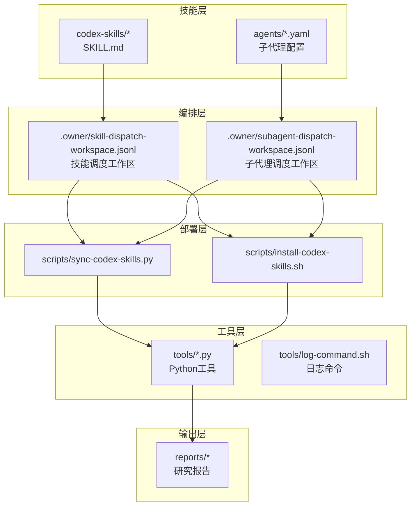
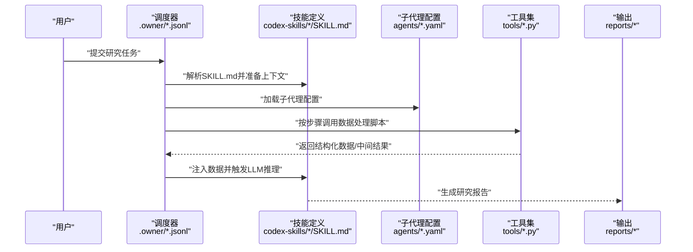
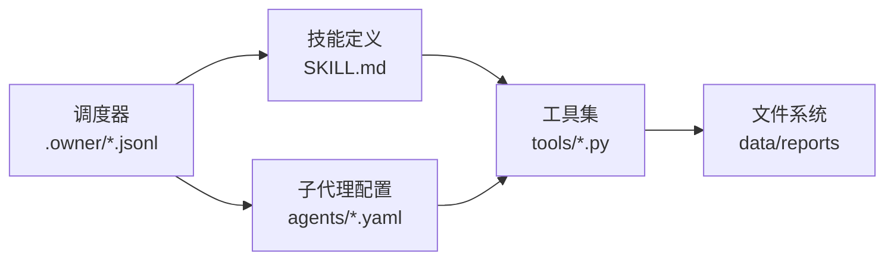
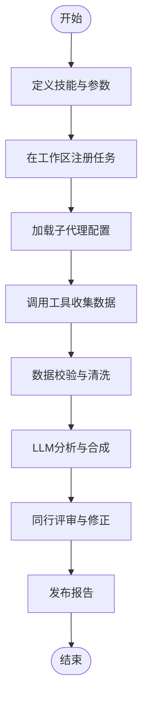

# 架构与扩展

<cite>
**本文引用的文件**
- [SKILL.md](file://codex-skills/investment-memo-craft/SKILL.md)
- [agents/openai.yaml](file://codex-skills/investment-memo-craft/agents/openai.yaml)
- [skill-dispatch-workspace.jsonl](file://.owner/skill-dispatch-workspace.jsonl)
- [subagent-dispatch-workspace.jsonl](file://.owner/subagent-dispatch-workspace.jsonl)
- [sync-codex-skills.py](file://scripts/sync-codex-skills.py)
- [install-codex-skills.sh](file://scripts/install-codex-skills.sh)
- [financial_rigor.py](file://tools/financial_rigor.py)
- [stock_screener.py](file://tools/stock_screener.py)
- [xueqiu_scraper.py](file://tools/xueqiu_scraper.py)
- [log-command.sh](file://tools/log-command.sh)
</cite>

## 目录
1. [引言](#引言)
2. [项目结构](#项目结构)
3. [核心组件](#核心组件)
4. [架构总览](#架构总览)
5. [详细组件分析](#详细组件分析)
6. [依赖关系分析](#依赖关系分析)
7. [性能与可观测性](#性能与可观测性)
8. [故障排查指南](#故障排查指南)
9. [结论](#结论)
10. [附录：投资研究工作流示例](#附录投资研究工作流示例)

## 引言
本指南面向高级开发者，聚焦AI技能系统的架构设计与扩展开发方法。内容涵盖：
- SKILL.md 文件格式规范、技能调度机制与子代理配置
- 新技能开发流程（定义、提示词集成、数据处理逻辑）
- 工具集成最佳实践（Python脚本规范、API接口设计、错误处理）
- 配置管理（JSONL工作区、环境变量、动态加载）
- 性能优化与调试技巧（日志、监控、诊断）
- 基于现有架构构建复杂投资研究工作流

## 项目结构
仓库采用“能力即文档 + 配置驱动”的组织方式：
- codex-skills：每个技能一个目录，包含SKILL.md描述与可选的agents配置
- .owner：系统级工作区与工作流编排（技能调度、子代理调度）
- scripts：安装与同步脚本，负责将技能与提示词部署到目标环境
- tools：Python工具集，提供数据抓取、筛选、财务严谨性检查等能力
- reports：研究产出物（Markdown报告）
- data：静态数据与中间结果

图表来源
- [SKILL.md:1-200](file://codex-skills/investment-memo-craft/SKILL.md#L1-L200)
- [agents/openai.yaml:1-200](file://codex-skills/investment-memo-craft/agents/openai.yaml#L1-L200)
- [skill-dispatch-workspace.jsonl:1-200](file://.owner/skill-dispatch-workspace.jsonl#L1-L200)
- [subagent-dispatch-workspace.jsonl:1-200](file://.owner/subagent-dispatch-workspace.jsonl#L1-L200)
- [sync-codex-skills.py:1-200](file://scripts/sync-codex-skills.py#L1-L200)
- [install-codex-skills.sh:1-200](file://scripts/install-codex-skills.sh#L1-L200)

章节来源
- [SKILL.md:1-200](file://codex-skills/investment-memo-craft/SKILL.md#L1-L200)
- [agents/openai.yaml:1-200](file://codex-skills/investment-memo-craft/agents/openai.yaml#L1-L200)
- [skill-dispatch-workspace.jsonl:1-200](file://.owner/skill-dispatch-workspace.jsonl#L1-L200)
- [subagent-dispatch-workspace.jsonl:1-200](file://.owner/subagent-dispatch-workspace.jsonl#L1-L200)
- [sync-codex-skills.py:1-200](file://scripts/sync-codex-skills.py#L1-L200)
- [install-codex-skills.sh:1-200](file://scripts/install-codex-skills.sh#L1-L200)

## 核心组件
- 技能定义（SKILL.md）：以结构化Markdown描述技能的目标、输入、步骤、约束与输出格式，作为LLM执行时的上下文与行为契约。
- 子代理配置（agents/*.yaml）：为特定任务指定模型、参数与角色，支持多模型协作与差异化推理策略。
- 调度工作区（.owner/*.jsonl）：以JSONL记录任务编排信息，包括技能选择、参数注入、依赖关系与执行顺序。
- 部署与同步（scripts/*）：将技能与提示词同步至运行环境，并建立软链接或复制资源，确保运行时一致性。
- 工具集（tools/*）：封装外部数据源与计算逻辑，通过命令行或脚本调用，供技能在数据处理阶段使用。

章节来源
- [SKILL.md:1-200](file://codex-skills/investment-memo-craft/SKILL.md#L1-L200)
- [agents/openai.yaml:1-200](file://codex-skills/investment-memo-craft/agents/openai.yaml#L1-L200)
- [skill-dispatch-workspace.jsonl:1-200](file://.owner/skill-dispatch-workspace.jsonl#L1-L200)
- [subagent-dispatch-workspace.jsonl:1-200](file://.owner/subagent-dispatch-workspace.jsonl#L1-L200)
- [sync-codex-skills.py:1-200](file://scripts/sync-codex-skills.py#L1-L200)
- [install-codex-skills.sh:1-200](file://scripts/install-codex-skills.sh#L1-L200)

## 架构总览
整体架构围绕“技能即配置”的理念，通过JSONL工作区驱动调度，结合Python工具完成数据获取与加工，最终生成研究报告。

图表来源
- [skill-dispatch-workspace.jsonl:1-200](file://.owner/skill-dispatch-workspace.jsonl#L1-L200)
- [subagent-dispatch-workspace.jsonl:1-200](file://.owner/subagent-dispatch-workspace.jsonl#L1-L200)
- [SKILL.md:1-200](file://codex-skills/investment-memo-craft/SKILL.md#L1-L200)
- [agents/openai.yaml:1-200](file://codex-skills/investment-memo-craft/agents/openai.yaml#L1-L200)
- [financial_rigor.py:1-200](file://tools/financial_rigor.py#L1-L200)
- [stock_screener.py:1-200](file://tools/stock_screener.py#L1-L200)
- [xueqiu_scraper.py:1-200](file://tools/xueqiu_scraper.py#L1-L200)

## 详细组件分析

### 技能定义（SKILL.md）
- 职责：描述技能目标、输入参数、执行步骤、约束条件与输出格式；作为LLM执行的“程序化说明”。
- 关键要素：
  - 元数据：名称、版本、作者、适用场景
  - 输入：标的、时间窗口、数据来源、过滤条件
  - 步骤：数据收集→清洗→分析→合成→评审
  - 约束：合规、风险、质量门槛
  - 输出：报告结构、指标清单、可视化要求
- 扩展建议：
  - 将重复逻辑抽象为“子步骤”，便于复用与组合
  - 明确失败回退路径与重试策略
  - 对敏感字段进行脱敏与最小化原则

章节来源
- [SKILL.md:1-200](file://codex-skills/investment-memo-craft/SKILL.md#L1-L200)

### 子代理配置（agents/*.yaml）
- 职责：为不同任务分配合适的模型与参数，实现“专能专用”。
- 关键要素：
  - 模型标识与版本
  - 温度、最大令牌数、超时等推理参数
  - 角色与系统提示词引用
  - 并发与限流策略
- 扩展建议：
  - 按领域划分代理（如财务、行业、新闻），提升专业化水平
  - 引入A/B测试通道对比不同模型表现
  - 对高成本代理设置预算上限与降级策略

章节来源
- [agents/openai.yaml:1-200](file://codex-skills/investment-memo-craft/agents/openai.yaml#L1-L200)

### 调度工作区（.owner/*.jsonl）
- 职责：以JSONL记录任务编排信息，驱动技能与子代理的动态装配。
- 关键要素：
  - 任务ID、时间戳、状态机（待执行/进行中/完成/失败）
  - 技能映射、参数注入、依赖图
  - 子代理路由、重试次数、错误码
- 扩展建议：
  - 增加幂等键，避免重复执行
  - 引入优先级队列与资源配额
  - 持久化中间状态以便断点续跑

章节来源
- [skill-dispatch-workspace.jsonl:1-200](file://.owner/skill-dispatch-workspace.jsonl#L1-L200)
- [subagent-dispatch-workspace.jsonl:1-200](file://.owner/subagent-dispatch-workspace.jsonl#L1-L200)

### 部署与同步（scripts/*）
- 职责：将技能与提示词同步到目标环境，建立一致的运行视图。
- 关键要素：
  - 增量同步与冲突检测
  - 软链接/复制策略
  - 校验和验证与回滚
- 扩展建议：
  - 引入发布流水线与灰度发布
  - 支持多环境隔离（开发/预发/生产）

章节来源
- [sync-codex-skills.py:1-200](file://scripts/sync-codex-skills.py#L1-L200)
- [install-codex-skills.sh:1-200](file://scripts/install-codex-skills.sh#L1-L200)

### 工具集（tools/*）
- 职责：封装外部数据源与计算逻辑，提供稳定可靠的CLI接口。
- 典型工具：
  - financial_rigor.py：财务数据严谨性检查与异常检测
  - stock_screener.py：股票筛选与因子计算
  - xueqiu_scraper.py：雪球数据抓取与解析
  - log-command.sh：统一日志记录与追踪
- 扩展建议：
  - 标准化输入输出（JSON/CSV）、错误码与退出码
  - 内置重试、超时与熔断
  - 提供单元测试与基准用例

章节来源
- [financial_rigor.py:1-200](file://tools/financial_rigor.py#L1-L200)
- [stock_screener.py:1-200](file://tools/stock_screener.py#L1-L200)
- [xueqiu_scraper.py:1-200](file://tools/xueqiu_scraper.py#L1-L200)
- [log-command.sh:1-200](file://tools/log-command.sh#L1-L200)

### 新技能开发流程
- 步骤概览：
  1) 创建技能目录与SKILL.md，明确目标与边界
  2) 编写agents配置，选择合适的模型与参数
  3) 在调度工作区注册任务，定义参数与依赖
  4) 开发或复用tools脚本，实现数据处理逻辑
  5) 通过部署脚本同步资源，端到端验证
  6) 加入日志与监控，持续迭代优化
- 注意事项：
  - 保持SKILL.md的可读性与可执行性一致
  - 工具函数应幂等且可回放
  - 对第三方API增加鉴权与限流保护

章节来源
- [SKILL.md:1-200](file://codex-skills/investment-memo-craft/SKILL.md#L1-L200)
- [agents/openai.yaml:1-200](file://codex-skills/investment-memo-craft/agents/openai.yaml#L1-L200)
- [skill-dispatch-workspace.jsonl:1-200](file://.owner/skill-dispatch-workspace.jsonl#L1-L200)
- [subagent-dispatch-workspace.jsonl:1-200](file://.owner/subagent-dispatch-workspace.jsonl#L1-L200)
- [sync-codex-skills.py:1-200](file://scripts/sync-codex-skills.py#L1-L200)
- [install-codex-skills.sh:1-200](file://scripts/install-codex-skills.sh#L1-L200)

### 工具集成最佳实践
- Python脚本规范：
  - 统一的CLI入口与参数解析
  - 明确的输入输出约定（JSON/CSV）
  - 错误分类与退出码规范
  - 日志分级与结构化输出
- API接口设计：
  - RESTful风格或RPC风格均可，但需保持一致
  - 幂等键与请求签名
  - 分页、过滤与排序参数
- 错误处理机制：
  - 网络重试与指数退避
  - 熔断与快速失败
  - 降级策略与兜底数据

章节来源
- [financial_rigor.py:1-200](file://tools/financial_rigor.py#L1-L200)
- [stock_screener.py:1-200](file://tools/stock_screener.py#L1-L200)
- [xueqiu_scraper.py:1-200](file://tools/xueqiu_scraper.py#L1-L200)
- [log-command.sh:1-200](file://tools/log-command.sh#L1-L200)

### 配置管理系统工作原理
- JSONL配置文件结构：
  - 每行一条任务记录，包含任务ID、状态、参数、依赖、结果指针
  - 支持追加写入与原子更新
- 环境变量管理：
  - 敏感信息（密钥、URL）通过环境变量注入
  - 区分环境（dev/staging/prod）
- 动态加载机制：
  - 启动时扫描codex-skills与agents目录
  - 根据工作区配置按需加载技能与代理
  - 变更热重载与版本锁定

章节来源
- [skill-dispatch-workspace.jsonl:1-200](file://.owner/skill-dispatch-workspace.jsonl#L1-L200)
- [subagent-dispatch-workspace.jsonl:1-200](file://.owner/subagent-dispatch-workspace.jsonl#L1-L200)
- [sync-codex-skills.py:1-200](file://scripts/sync-codex-skills.py#L1-L200)
- [install-codex-skills.sh:1-200](file://scripts/install-codex-skills.sh#L1-L200)

## 依赖关系分析
- 组件耦合：
  - 调度器依赖工作区配置与技能定义
  - 技能依赖子代理配置与工具集
  - 工具集对外部数据源与文件系统有依赖
- 潜在循环依赖：
  - 应避免工具反向依赖调度器
  - 技能不应直接修改工作区文件，仅通过调度器协调
- 外部依赖：
  - LLM服务、数据源API、本地文件系统

图表来源
- [skill-dispatch-workspace.jsonl:1-200](file://.owner/skill-dispatch-workspace.jsonl#L1-L200)
- [subagent-dispatch-workspace.jsonl:1-200](file://.owner/subagent-dispatch-workspace.jsonl#L1-L200)
- [SKILL.md:1-200](file://codex-skills/investment-memo-craft/SKILL.md#L1-L200)
- [agents/openai.yaml:1-200](file://codex-skills/investment-memo-craft/agents/openai.yaml#L1-L200)
- [financial_rigor.py:1-200](file://tools/financial_rigor.py#L1-L200)
- [stock_screener.py:1-200](file://tools/stock_screener.py#L1-L200)
- [xueqiu_scraper.py:1-200](file://tools/xueqiu_scraper.py#L1-L200)

## 性能与可观测性
- 日志记录：
  - 使用log-command.sh统一采集命令执行日志
  - 结构化日志（JSON）便于检索与分析
- 监控指标：
  - 任务成功率、平均耗时、重试率
  - 工具调用QPS、错误分布、延迟分位
- 问题诊断：
  - 基于任务ID的全链路追踪
  - 快照保存中间结果，便于回放与对比
- 优化建议：
  - 批量处理与并行执行
  - 缓存热点数据与模型输出
  - 限制大模型上下文长度与裁剪无关信息

章节来源
- [log-command.sh:1-200](file://tools/log-command.sh#L1-L200)

## 故障排查指南
- 常见问题定位：
  - 任务未执行：检查工作区状态与权限
  - 工具报错：查看结构化日志与退出码
  - 模型调用失败：检查代理配置与网络连通性
- 恢复策略：
  - 幂等重放与断点续跑
  - 降级到备用模型或数据源
  - 清理脏数据与重建索引

章节来源
- [skill-dispatch-workspace.jsonl:1-200](file://.owner/skill-dispatch-workspace.jsonl#L1-L200)
- [subagent-dispatch-workspace.jsonl:1-200](file://.owner/subagent-dispatch-workspace.jsonl#L1-L200)
- [log-command.sh:1-200](file://tools/log-command.sh#L1-L200)

## 结论
本架构以“技能即配置”为核心，通过JSONL工作区驱动调度，结合Python工具实现数据闭环，形成可扩展、可观测的投资研究工作流。遵循本文的开发与实践规范，可在保证质量的前提下快速迭代与规模化扩展。

## 附录：投资研究工作流示例
以下流程图展示如何利用现有架构构建复杂的研究工作流（概念示意，不绑定具体代码）。

[此图为概念流程，无需图表来源]