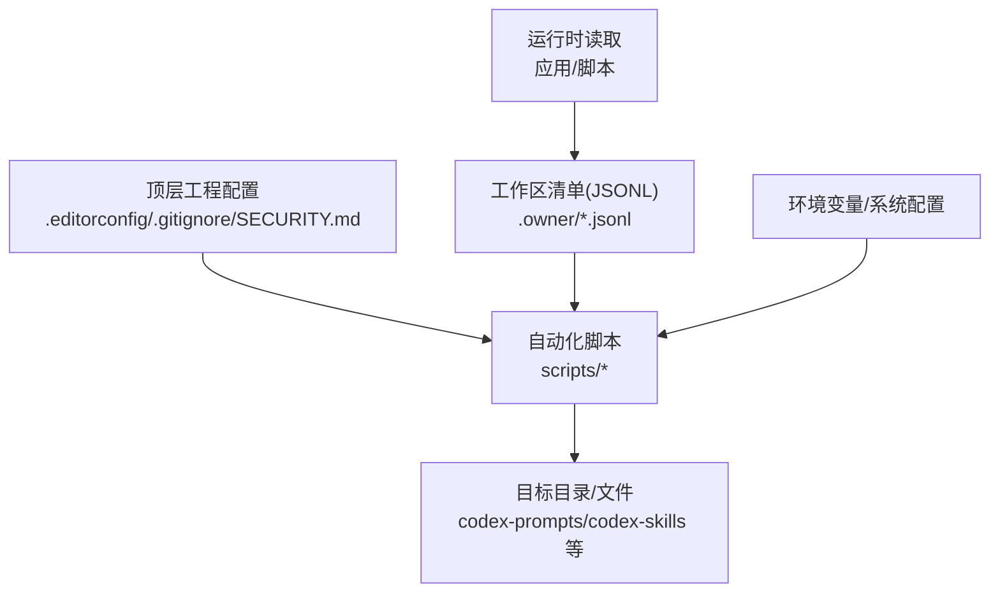
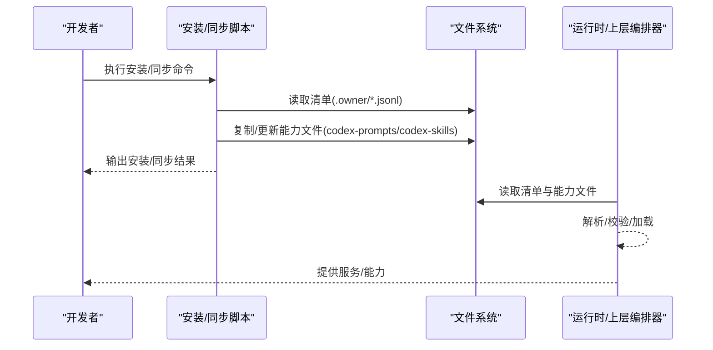
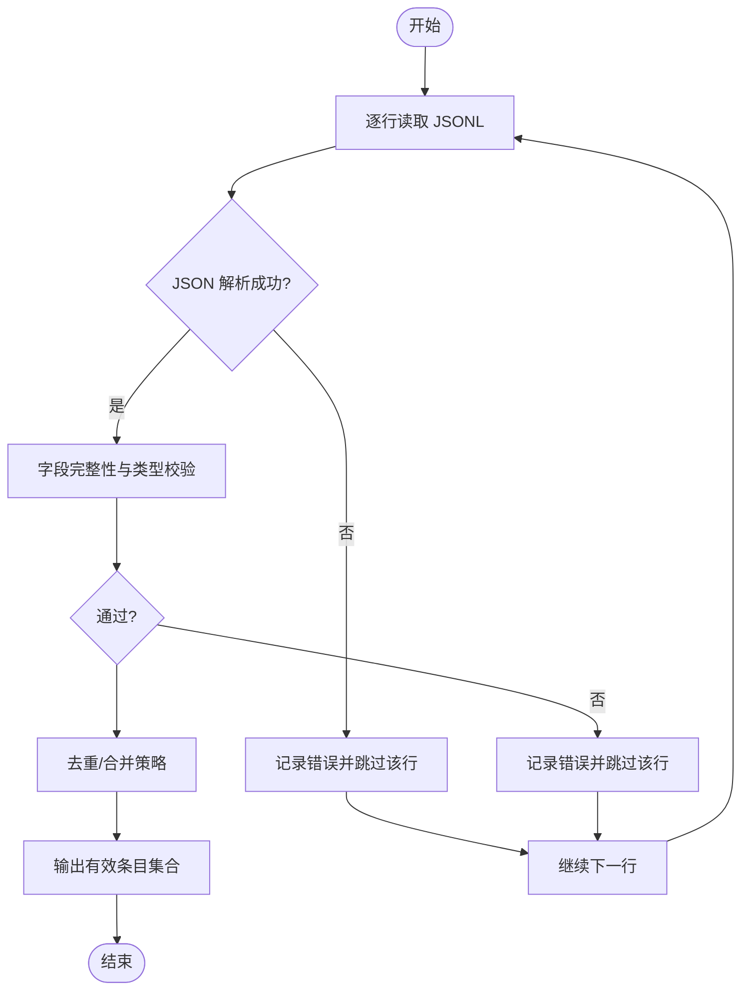
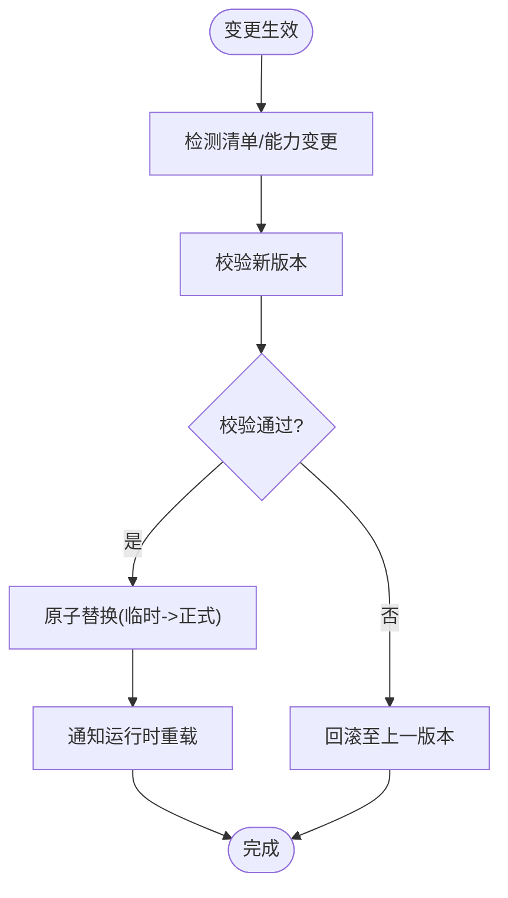
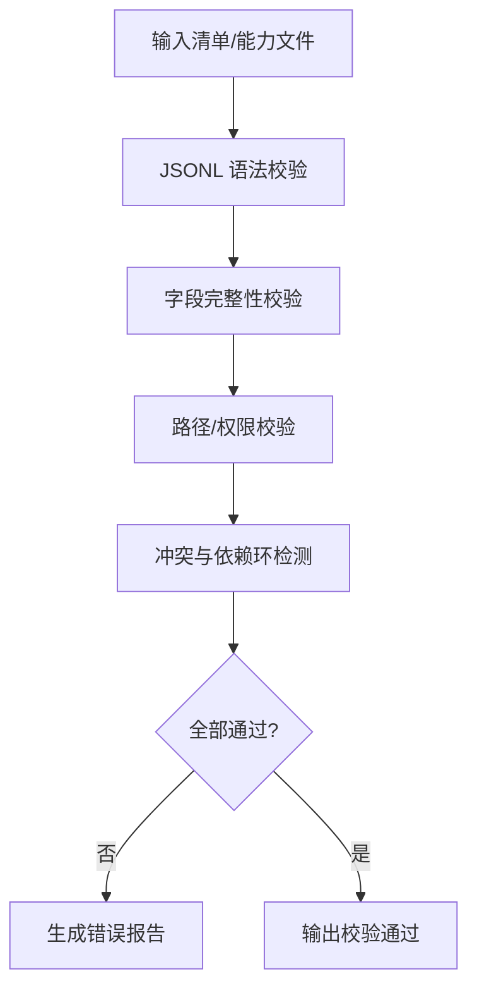
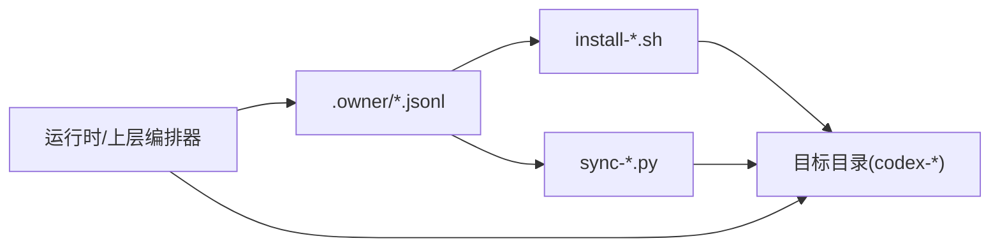

# 配置管理系统

<cite>
**本文引用的文件**   
- [AGENTS.md](file://AGENTS.md)
- [CLAUDE.md](file://CLAUDE.md)
- [.editorconfig](file://.editorconfig)
- [.gitignore](file://.gitignore)
- [SECURITY.md](file://SECURITY.md)
- [README_EN.md](file://README_EN.md)
- [install-codex-prompts.sh](file://scripts/install-codex-prompts.sh)
- [install-codex-skills.sh](file://scripts/install-codex-skills.sh)
- [sync-codex-prompts.py](file://scripts/sync-codex-prompts.py)
- [sync-codex-skills.py](file://scripts/sync-codex-skills.py)
- [skill-dispatch-workspace.jsonl](file://.owner/skill-dispatch-workspace.jsonl)
- [subagent-dispatch-workspace.jsonl](file://.owner/subagent-dispatch-workspace.jsonl)
</cite>

## 目录
1. [简介](#简介)
2. [项目结构](#项目结构)
3. [核心组件](#核心组件)
4. [架构总览](#架构总览)
5. [详细组件分析](#详细组件分析)
6. [依赖关系分析](#依赖关系分析)
7. [性能与扩展性考虑](#性能与扩展性考虑)
8. [故障排查指南](#故障排查指南)
9. [结论](#结论)
10. [附录](#附录)

## 简介
本文件面向开发者，系统化梳理仓库中的“配置管理”相关实践与机制。重点覆盖：
- JSONL 配置文件结构与字段约定（以 .owner 下的工作区清单为例）
- 环境变量管理机制（命名规范、优先级、安全策略）
- 动态加载机制（热更新、版本兼容、回滚策略）
- 配置文件组织与管理策略（模块化、环境隔离、权限控制）
- 配置验证与测试方法（语法检查、完整性校验、冲突检测）
- 自动化管理与部署脚本（安装、同步、校验流程）
- 完整示例与最佳实践

说明：
- 本项目未提供集中式配置中心或运行时配置服务；配置主要体现为：
  - 代码级默认值与常量
  - 脚本参数与环境变量
  - 结构化清单文件（JSONL）
  - 编辑器/工具链配置（.editorconfig、.gitignore）
- 本文所有实现细节均基于仓库现有文件进行归纳与解读，不引入外部假设。

## 项目结构
从配置视角看，仓库采用“多源配置 + 脚本驱动”的组织方式：
- 顶层工程配置：.editorconfig、.gitignore、SECURITY.md、README_EN.md、AGENTS.md、CLAUDE.md
- 运行期配置清单：.owner/*.jsonl（技能/子代理调度工作区清单）
- 自动化脚本：scripts/*（安装与同步脚本，负责将配置/能力分发到目标位置）
- 数据与产物：data/*、reports/*、codex-* 等（非配置，但受配置影响）

图表来源
- [.editorconfig:1-200](file://.editorconfig#L1-L200)
- [.gitignore:1-200](file://.gitignore#L1-L200)
- [SECURITY.md:1-200](file://SECURITY.md#L1-L200)
- [install-codex-prompts.sh:1-200](file://scripts/install-codex-prompts.sh#L1-L200)
- [install-codex-skills.sh:1-200](file://scripts/install-codex-skills.sh#L1-L200)
- [sync-codex-prompts.py:1-200](file://scripts/sync-codex-prompts.py#L1-L200)
- [sync-codex-skills.py:1-200](file://scripts/sync-codex-skills.py#L1-L200)
- [skill-dispatch-workspace.jsonl:1-200](file://.owner/skill-dispatch-workspace.jsonl#L1-L200)
- [subagent-dispatch-workspace.jsonl:1-200](file://.owner/subagent-dispatch-workspace.jsonl#L1-L200)

章节来源
- [.editorconfig:1-200](file://.editorconfig#L1-L200)
- [.gitignore:1-200](file://.gitignore#L1-L200)
- [SECURITY.md:1-200](file://SECURITY.md#L1-L200)
- [README_EN.md:1-200](file://README_EN.md#L1-L200)
- [AGENTS.md:1-200](file://AGENTS.md#L1-L200)
- [CLAUDE.md:1-200](file://CLAUDE.md#L1-L200)

## 核心组件
- 工作区清单（JSONL）
  - 作用：描述技能/子代理的调度与工作区映射，供上层编排器或脚本消费。
  - 形态：每行一个 JSON 对象，键名与语义由具体消费端定义。
  - 典型用途：指定能力名称、路径、版本、启用开关、资源配额等（以实际消费端为准）。
- 自动化脚本
  - 安装脚本：将 codex-prompts、codex-skills 等能力复制到目标位置，便于本地使用。
  - 同步脚本：拉取/比对并同步远程或上游变更，保证本地与期望状态一致。
- 工程级配置
  - .editorconfig：统一编辑器行为（缩进、换行、编码等），减少团队差异。
  - .gitignore：忽略构建产物、日志、临时文件，避免污染仓库。
  - SECURITY.md：安全基线与披露流程，约束敏感信息处理。
  - AGENTS.md / CLAUDE.md：Agent 行为与交互约定，间接影响配置读取与执行边界。

章节来源
- [skill-dispatch-workspace.jsonl:1-200](file://.owner/skill-dispatch-workspace.jsonl#L1-L200)
- [subagent-dispatch-workspace.jsonl:1-200](file://.owner/subagent-dispatch-workspace.jsonl#L1-L200)
- [install-codex-prompts.sh:1-200](file://scripts/install-codex-prompts.sh#L1-L200)
- [install-codex-skills.sh:1-200](file://scripts/install-codex-skills.sh#L1-L200)
- [sync-codex-prompts.py:1-200](file://scripts/sync-codex-prompts.py#L1-L200)
- [sync-codex-skills.py:1-200](file://scripts/sync-codex-skills.py#L1-L200)
- [.editorconfig:1-200](file://.editorconfig#L1-L200)
- [.gitignore:1-200](file://.gitignore#L1-L200)
- [SECURITY.md:1-200](file://SECURITY.md#L1-L200)
- [AGENTS.md:1-200](file://AGENTS.md#L1-L200)
- [CLAUDE.md:1-200](file://CLAUDE.md#L1-L200)

## 架构总览
配置在系统中的流转遵循“声明式清单 + 脚本装配 + 运行时读取”的模式：
- 声明层：.owner/*.jsonl 作为权威清单，描述可用能力与工作区映射。
- 装配层：安装/同步脚本根据清单与目标环境，完成复制、校验与幂等更新。
- 运行层：应用/脚本按需读取清单与能力文件，按约定解析并执行。

图表来源
- [install-codex-prompts.sh:1-200](file://scripts/install-codex-prompts.sh#L1-L200)
- [install-codex-skills.sh:1-200](file://scripts/install-codex-skills.sh#L1-L200)
- [sync-codex-prompts.py:1-200](file://scripts/sync-codex-prompts.py#L1-L200)
- [sync-codex-skills.py:1-200](file://scripts/sync-codex-skills.py#L1-L200)
- [skill-dispatch-workspace.jsonl:1-200](file://.owner/skill-dispatch-workspace.jsonl#L1-L200)
- [subagent-dispatch-workspace.jsonl:1-200](file://.owner/subagent-dispatch-workspace.jsonl#L1-L200)

## 详细组件分析

### JSONL 工作区清单（.owner/*.jsonl）
- 文件格式：JSON Lines，每行一个独立 JSON 对象。
- 设计要点：
  - 幂等：重复加载不会导致副作用。
  - 可扩展：新增字段需保持向后兼容（旧客户端忽略未知字段）。
  - 可校验：建议在上层增加必填字段与类型校验。
- 常见字段类别（概念性说明，具体以消费端为准）：
  - 标识类：id/name、版本 version、来源 source
  - 路径类：path/dir、入口 entrypoint
  - 控制类：enabled/disabled、优先级 priority、标签 tags
  - 资源类：内存/超时/并发限制等（若适用）
- 校验建议：
  - 语法：逐行 JSON 解析失败即报错。
  - 完整性：必填字段存在且非空。
  - 一致性：路径存在、入口可执行、无循环引用。
  - 冲突：同名条目去重或明确覆盖策略。

图表来源
- [skill-dispatch-workspace.jsonl:1-200](file://.owner/skill-dispatch-workspace.jsonl#L1-L200)
- [subagent-dispatch-workspace.jsonl:1-200](file://.owner/subagent-dispatch-workspace.jsonl#L1-L200)

章节来源
- [skill-dispatch-workspace.jsonl:1-200](file://.owner/skill-dispatch-workspace.jsonl#L1-L200)
- [subagent-dispatch-workspace.jsonl:1-200](file://.owner/subagent-dispatch-workspace.jsonl#L1-L200)

### 环境变量管理机制
- 命名规范（建议）：
  - 全大写、下划线分隔，如 APP_ENV、LOG_LEVEL、WORKSPACE_DIR。
  - 前缀区分模块：PROMPTS_、SKILLS_、DISPATCH_ 等。
- 优先级顺序（通用原则）：
  - 默认值 < 配置文件 < 环境变量 < 命令行参数（若支持）。
  - 同一层级内，后加载者覆盖先加载者。
- 安全考虑：
  - 不在仓库中提交密钥；通过 CI/CD 注入或本地 .env（被 .gitignore 忽略）。
  - 最小权限原则：仅暴露必要变量。
  - 审计与脱敏：日志中避免打印敏感值。
- 在本仓库中的体现：
  - 脚本可通过环境变量控制安装/同步行为（例如目标目录、是否强制覆盖等）。
  - .gitignore 确保敏感文件不被提交。

章节来源
- [.gitignore:1-200](file://.gitignore#L1-L200)
- [SECURITY.md:1-200](file://SECURITY.md#L1-L200)
- [install-codex-prompts.sh:1-200](file://scripts/install-codex-prompts.sh#L1-L200)
- [install-codex-skills.sh:1-200](file://scripts/install-codex-skills.sh#L1-L200)
- [sync-codex-prompts.py:1-200](file://scripts/sync-codex-prompts.py#L1-L200)
- [sync-codex-skills.py:1-200](file://scripts/sync-codex-skills.py#L1-L200)

### 动态加载机制（热更新、版本兼容、回滚）
- 热更新：
  - 清单文件（JSONL）与能力文件分离，修改清单后可触发重新加载。
  - 建议在运行时监听文件变化或提供显式刷新接口。
- 版本兼容：
  - 清单字段向后兼容：新增字段不影响旧客户端。
  - 能力文件带版本号，加载时校验最低版本要求。
- 回滚策略：
  - 保留上一版本快照（如 .bak 或时间戳目录）。
  - 切换时原子替换（写入临时目录，再 rename 覆盖）。
  - 失败自动回滚至上一稳定版本。

图表来源
- [sync-codex-prompts.py:1-200](file://scripts/sync-codex-prompts.py#L1-L200)
- [sync-codex-skills.py:1-200](file://scripts/sync-codex-skills.py#L1-L200)
- [skill-dispatch-workspace.jsonl:1-200](file://.owner/skill-dispatch-workspace.jsonl#L1-L200)
- [subagent-dispatch-workspace.jsonl:1-200](file://.owner/subagent-dispatch-workspace.jsonl#L1-L200)

### 配置文件组织结构与管理策略
- 模块化配置：
  - 按领域拆分清单（如 skill-dispatch、subagent-dispatch），降低耦合。
- 环境隔离：
  - 通过环境变量或目录前缀区分 dev/staging/prod。
  - 安装/同步脚本支持目标路径参数化。
- 权限控制：
  - 清单只读，写操作由受控脚本执行。
  - 结合操作系统权限与 CI/CD 审批流。

章节来源
- [.editorconfig:1-200](file://.editorconfig#L1-L200)
- [.gitignore:1-200](file://.gitignore#L1-L200)
- [SECURITY.md:1-200](file://SECURITY.md#L1-L200)
- [install-codex-prompts.sh:1-200](file://scripts/install-codex-prompts.sh#L1-L200)
- [install-codex-skills.sh:1-200](file://scripts/install-codex-skills.sh#L1-L200)
- [sync-codex-prompts.py:1-200](file://scripts/sync-codex-prompts.py#L1-L200)
- [sync-codex-skills.py:1-200](file://scripts/sync-codex-skills.py#L1-L200)

### 配置验证与测试方法
- 语法检查：
  - JSONL 逐行解析，捕获并报告错误行号。
- 完整性验证：
  - 必填字段、路径存在性、入口可执行性检查。
- 冲突检测：
  - 同名条目去重策略与覆盖规则。
  - 跨清单依赖环检测（若存在依赖关系）。
- 测试建议：
  - 单元测试：对解析器、校验器、合并策略进行测试。
  - 集成测试：模拟安装/同步流程，验证最终目录结构与权限。
  - 回归测试：版本升级前后行为对比。

图表来源
- [skill-dispatch-workspace.jsonl:1-200](file://.owner/skill-dispatch-workspace.jsonl#L1-L200)
- [subagent-dispatch-workspace.jsonl:1-200](file://.owner/subagent-dispatch-workspace.jsonl#L1-L200)

### 自动化管理与部署脚本
- 安装脚本（shell）：
  - 功能：将 codex-prompts、codex-skills 等能力复制到目标目录。
  - 特性：支持覆盖策略、目标路径参数化、幂等执行。
- 同步脚本（Python）：
  - 功能：拉取/比对并同步变更，保证本地与期望状态一致。
  - 特性：增量同步、失败重试、日志记录。
- 推荐用法：
  - 本地开发：执行安装脚本初始化环境。
  - CI/CD：执行同步脚本拉取最新能力，再进行构建与测试。

章节来源
- [install-codex-prompts.sh:1-200](file://scripts/install-codex-prompts.sh#L1-L200)
- [install-codex-skills.sh:1-200](file://scripts/install-codex-skills.sh#L1-L200)
- [sync-codex-prompts.py:1-200](file://scripts/sync-codex-prompts.py#L1-L200)
- [sync-codex-skills.py:1-200](file://scripts/sync-codex-skills.py#L1-L200)

## 依赖关系分析
- 脚本与清单：
  - 安装/同步脚本依赖 .owner/*.jsonl 作为权威清单。
- 运行时与清单：
  - 上层编排器/应用直接读取清单与能力文件。
- 工程配置与脚本：
  - .editorconfig/.gitignore 影响开发与提交行为，间接保障配置质量。

图表来源
- [skill-dispatch-workspace.jsonl:1-200](file://.owner/skill-dispatch-workspace.jsonl#L1-L200)
- [subagent-dispatch-workspace.jsonl:1-200](file://.owner/subagent-dispatch-workspace.jsonl#L1-L200)
- [install-codex-prompts.sh:1-200](file://scripts/install-codex-prompts.sh#L1-L200)
- [install-codex-skills.sh:1-200](file://scripts/install-codex-skills.sh#L1-L200)
- [sync-codex-prompts.py:1-200](file://scripts/sync-codex-prompts.py#L1-L200)
- [sync-codex-skills.py:1-200](file://scripts/sync-codex-skills.py#L1-L200)

## 性能与扩展性考虑
- 清单规模：
  - 大清单建议分页/分片加载，避免一次性载入过多条目。
- 校验成本：
  - 增量校验优先，仅对变更条目进行深度校验。
- 并发与锁：
  - 多进程/线程同时读写清单时需加锁或使用原子写入。
- 扩展点：
  - 通过新增字段与版本策略平滑演进，保持向后兼容。

## 故障排查指南
- 常见问题定位：
  - JSONL 解析失败：检查行尾逗号、引号转义、非法字符。
  - 路径不存在：确认相对/绝对路径与当前工作目录。
  - 权限不足：检查目标目录写权限与用户身份。
  - 冲突覆盖：确认去重策略与覆盖优先级。
- 日志与调试：
  - 开启详细日志，记录关键步骤与错误上下文。
  - 使用 diff 工具对比变更前后的清单与能力文件。
- 回滚与恢复：
  - 使用备份快照快速回滚。
  - 通过版本标签定位问题版本并降级。

章节来源
- [SECURITY.md:1-200](file://SECURITY.md#L1-L200)
- [.gitignore:1-200](file://.gitignore#L1-L200)
- [install-codex-prompts.sh:1-200](file://scripts/install-codex-prompts.sh#L1-L200)
- [install-codex-skills.sh:1-200](file://scripts/install-codex-skills.sh#L1-L200)
- [sync-codex-prompts.py:1-200](file://scripts/sync-codex-prompts.py#L1-L200)
- [sync-codex-skills.py:1-200](file://scripts/sync-codex-skills.py#L1-L200)

## 结论
本项目采用“清单驱动 + 脚本装配”的配置管理模式，具备以下优势：
- 清晰的结构与职责划分（清单、脚本、运行时）
- 良好的可扩展性与兼容性（JSONL 字段演进、版本策略）
- 易于自动化与持续集成（安装/同步脚本）
建议后续补充：
- 统一的配置校验器与测试套件
- 更完善的运行时热更新与回滚机制
- 更细粒度的权限控制与审计日志

## 附录
- 最佳实践清单：
  - 清单字段命名清晰、语义明确，避免歧义。
  - 所有敏感信息通过环境变量注入，禁止入库。
  - 安装/同步脚本幂等执行，支持断点续传与重试。
  - 变更走评审与 CI 流水线，确保可追溯。
- 参考文件：
  - 工程配置：.editorconfig、.gitignore、SECURITY.md
  - Agent 约定：AGENTS.md、CLAUDE.md
  - 清单文件：.owner/skill-dispatch-workspace.jsonl、.owner/subagent-dispatch-workspace.jsonl
  - 自动化脚本：scripts/install-codex-prompts.sh、scripts/install-codex-skills.sh、scripts/sync-codex-prompts.py、scripts/sync-codex-skills.py