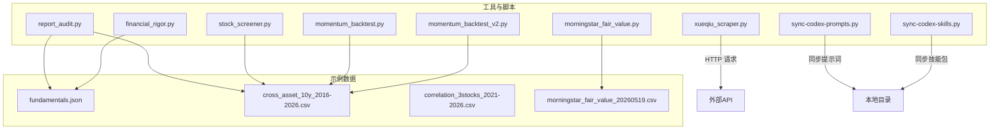
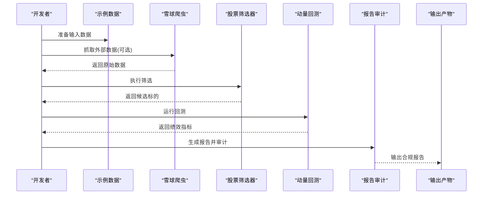
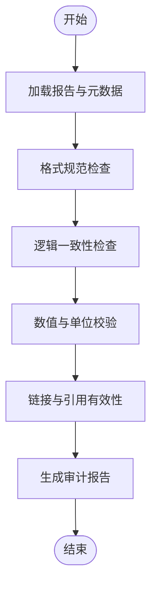
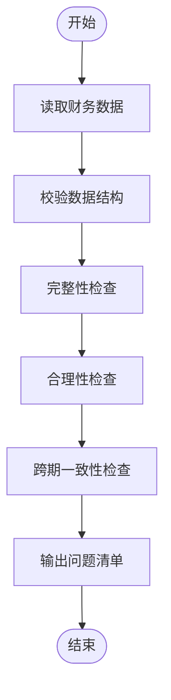
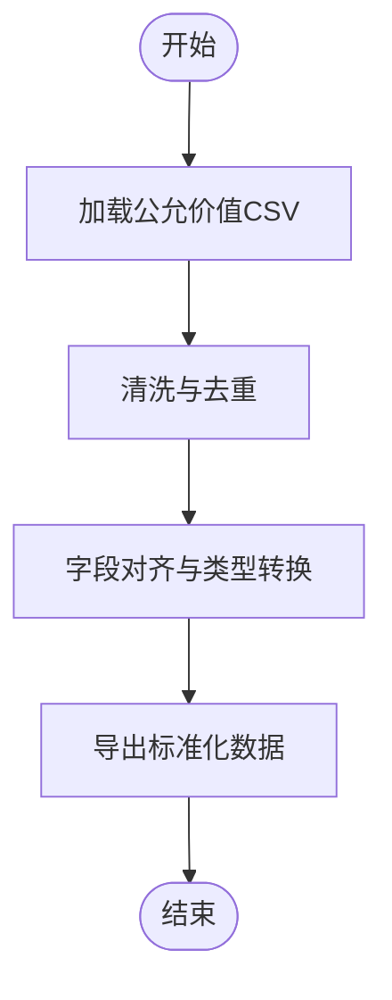
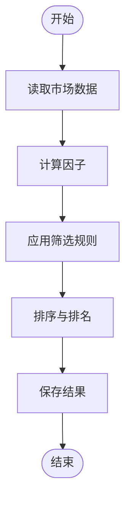
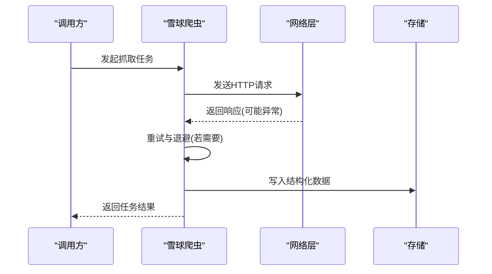
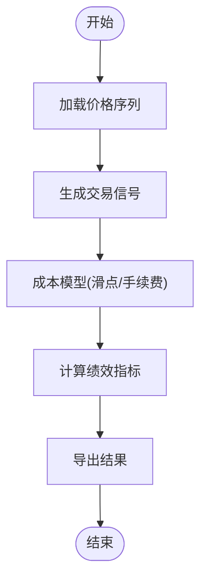
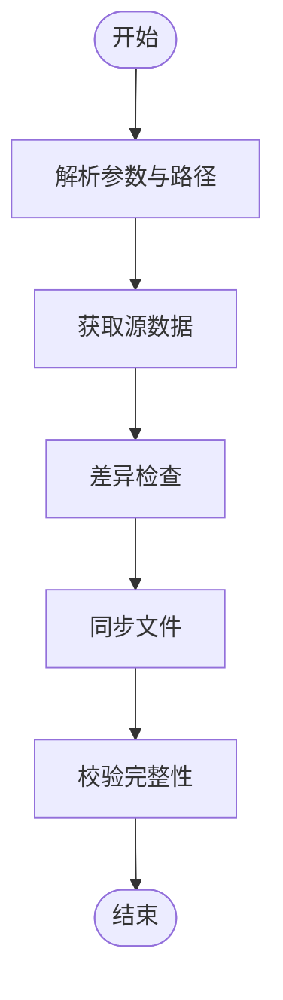
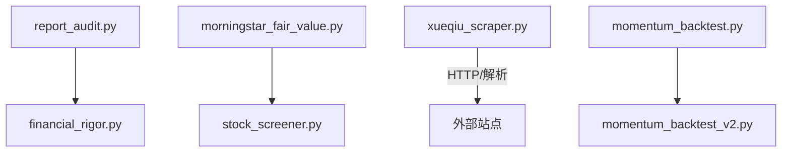

# 测试与质量保证

<cite>
**本文引用的文件**   
- [tools/report_audit.py](file://tools/report_audit.py)
- [tools/financial_rigor.py](file://tools/financial_rigor.py)
- [tools/morningstar_fair_value.py](file://tools/morningstar_fair_value.py)
- [tools/stock_screener.py](file://tools/stock_screener.py)
- [tools/xueqiu_scraper.py](file://tools/xueqiu_scraper.py)
- [tools/momentum_backtest.py](file://tools/momentum_backtest.py)
- [tools/momentum_backtest_v2.py](file://tools/momentum_backtest_v2.py)
- [scripts/sync-codex-prompts.py](file://scripts/sync-codex-prompts.py)
- [scripts/sync-codex-skills.py](file://scripts/sync-codex-skills.py)
- [data/fundamentals.json](file://data/fundamentals.json)
- [data/cross_asset_10y_2016-2026.csv](file://data/cross_asset_10y_2016-2026.csv)
- [data/correlation_3stocks_2021-2026.csv](file://data/correlation_3stocks_2021-2026.csv)
- [data/morningstar_fair_value_20260519.csv](file://data/morningstar_fair_value_20260519.csv)
</cite>

## 目录
1. [简介](#简介)
2. [项目结构](#项目结构)
3. [核心组件](#核心组件)
4. [架构总览](#架构总览)
5. [详细组件分析](#详细组件分析)
6. [依赖关系分析](#依赖关系分析)
7. [性能考量](#性能考量)
8. [故障排查指南](#故障排查指南)
9. [结论](#结论)
10. [附录](#附录)

## 简介
本指南面向开发者，提供覆盖单元测试、集成测试、代码质量检查、报告审计工具使用、持续集成与自动化测试配置、回归与兼容性测试的完整实践方案。结合仓库中现有的数据处理与报告生成脚本（如财务严谨性校验、晨星公允价值处理、动量回测、雪球爬虫等），给出可落地的测试策略与质量门禁建议，帮助团队在快速迭代的同时保障数据与报告的准确性与一致性。

## 项目结构
仓库以“研究产出 + 工具脚本 + 示例数据”为主，测试与质量保证相关能力主要分布在 tools 与 scripts 目录下的 Python 脚本中，以及 data 目录中的示例数据集。整体组织方式便于按功能域划分测试用例：数据处理管道、外部 API 调用、报告生成与审计、回测与筛选等。

图表来源
- [tools/report_audit.py](file://tools/report_audit.py)
- [tools/financial_rigor.py](file://tools/financial_rigor.py)
- [tools/morningstar_fair_value.py](file://tools/morningstar_fair_value.py)
- [tools/stock_screener.py](file://tools/stock_screener.py)
- [tools/xueqiu_scraper.py](file://tools/xueqiu_scraper.py)
- [tools/momentum_backtest.py](file://tools/momentum_backtest.py)
- [tools/momentum_backtest_v2.py](file://tools/momentum_backtest_v2.py)
- [scripts/sync-codex-prompts.py](file://scripts/sync-codex-prompts.py)
- [scripts/sync-codex-skills.py](file://scripts/sync-codex-skills.py)
- [data/fundamentals.json](file://data/fundamentals.json)
- [data/cross_asset_10y_2016-2026.csv](file://data/cross_asset_10y_2016-2026.csv)
- [data/correlation_3stocks_2021-2026.csv](file://data/correlation_3stocks_2021-2026.csv)
- [data/morningstar_fair_value_20260519.csv](file://data/morningstar_fair_value_20260519.csv)

章节来源
- [tools/report_audit.py](file://tools/report_audit.py)
- [tools/financial_rigor.py](file://tools/financial_rigor.py)
- [tools/morningstar_fair_value.py](file://tools/morningstar_fair_value.py)
- [tools/stock_screener.py](file://tools/stock_screener.py)
- [tools/xueqiu_scraper.py](file://tools/xueqiu_scraper.py)
- [tools/momentum_backtest.py](file://tools/momentum_backtest.py)
- [tools/momentum_backtest_v2.py](file://tools/momentum_backtest_v2.py)
- [scripts/sync-codex-prompts.py](file://scripts/sync-codex-prompts.py)
- [scripts/sync-codex-skills.py](file://scripts/sync-codex-skills.py)
- [data/fundamentals.json](file://data/fundamentals.json)
- [data/cross_asset_10y_2016-2026.csv](file://data/cross_asset_10y_2016-2026.csv)
- [data/correlation_3stocks_2021-2026.csv](file://data/correlation_3stocks_2021-2026.csv)
- [data/morningstar_fair_value_20260519.csv](file://data/morningstar_fair_value_20260519.csv)

## 核心组件
- 报告审计工具：用于对生成的研究报告进行格式规范、逻辑一致性与关键指标校验，确保输出符合既定标准。
- 财务严谨性校验：对财务数据进行完整性、合理性、跨期一致性检查，识别异常值与缺失字段。
- 晨星公允价值处理：读取并解析晨星公允价值数据，进行清洗、对齐与导出，为估值分析提供基础数据。
- 股票筛选器：基于多因子或规则对股票池进行筛选，支持批量处理与结果持久化。
- 雪球爬虫：从外部站点抓取信息，需考虑反爬、限流与容错重试。
- 动量回测：实现历史价格序列的回测逻辑，评估策略表现与稳健性。
- 同步脚本：将提示词与技能包同步到本地工作区，保证版本一致与环境可复现。

章节来源
- [tools/report_audit.py](file://tools/report_audit.py)
- [tools/financial_rigor.py](file://tools/financial_rigor.py)
- [tools/morningstar_fair_value.py](file://tools/morningstar_fair_value.py)
- [tools/stock_screener.py](file://tools/stock_screener.py)
- [tools/xueqiu_scraper.py](file://tools/xueqiu_scraper.py)
- [tools/momentum_backtest.py](file://tools/momentum_backtest.py)
- [tools/momentum_backtest_v2.py](file://tools/momentum_backtest_v2.py)
- [scripts/sync-codex-prompts.py](file://scripts/sync-codex-prompts.py)
- [scripts/sync-codex-skills.py](file://scripts/sync-codex-skills.py)

## 架构总览
下图展示了典型的数据处理与报告生成流程，包括数据准备、清洗转换、策略计算、报告生成与审计验证的关键环节。

图表来源
- [tools/xueqiu_scraper.py](file://tools/xueqiu_scraper.py)
- [tools/stock_screener.py](file://tools/stock_screener.py)
- [tools/momentum_backtest.py](file://tools/momentum_backtest.py)
- [tools/report_audit.py](file://tools/report_audit.py)
- [data/cross_asset_10y_2016-2026.csv](file://data/cross_asset_10y_2016-2026.csv)

## 详细组件分析

### 报告审计工具（report_audit.py）
- 职责：对研究报告进行格式规范检查、关键段落存在性校验、数值范围与单位一致性检查、引用与链接有效性验证。
- 输入：Markdown/文本报告、元数据（如公司名、日期、指标表）。
- 输出：审计报告（通过/失败项清单）、修复建议。
- 测试要点：
  - 单元测试：针对各检查规则编写断言，覆盖正常、边界与异常输入。
  - 集成测试：端到端验证“生成报告 → 审计 → 输出报告”的流水线。
  - 模拟数据：构造最小可行报告样本，包含缺失字段、错误单位、无效链接等场景。
  - 断言方法：路径存在性、正则匹配、JSON/CSV 结构校验、阈值比较。
  - 性能：大文档分块处理、增量审计避免全量重算。

图表来源
- [tools/report_audit.py](file://tools/report_audit.py)

章节来源
- [tools/report_audit.py](file://tools/report_audit.py)

### 财务严谨性校验（financial_rigor.py）
- 职责：对财务报表数据进行完整性、合理性、跨期一致性检查；识别异常值、缺失字段与不一致口径。
- 输入：财务数据 JSON/CSV（如 fundamentals.json）。
- 输出：校验结果、问题清单、修复建议。
- 测试要点：
  - 单元测试：覆盖字段必填、类型约束、范围约束、同比环比合理区间。
  - 集成测试：对接真实数据源，验证端到端校验流程。
  - 模拟数据：构造缺失、重复、越界、负值异常等样例。
  - 断言方法：空值检测、极值检测、比率计算与阈值比较。
  - 性能：批处理与并行校验，避免单条记录阻塞。

图表来源
- [tools/financial_rigor.py](file://tools/financial_rigor.py)
- [data/fundamentals.json](file://data/fundamentals.json)

章节来源
- [tools/financial_rigor.py](file://tools/financial_rigor.py)
- [data/fundamentals.json](file://data/fundamentals.json)

### 晨星公允价值处理（morningstar_fair_value.py）
- 职责：读取晨星公允价值 CSV，进行清洗、字段对齐、去重与导出，供后续估值分析使用。
- 输入：morningstar_fair_value_20260519.csv。
- 输出：标准化后的公允价值数据集。
- 测试要点：
  - 单元测试：字段映射、数据类型转换、缺失值填充策略。
  - 集成测试：端到端读取→清洗→导出流程。
  - 模拟数据：构造含乱码、重复行、异常日期的样例。
  - 断言方法：行数不变性（除去重外）、关键字段非空、日期格式统一。
  - 性能：流式读取与分批写入，降低内存占用。

图表来源
- [tools/morningstar_fair_value.py](file://tools/morningstar_fair_value.py)
- [data/morningstar_fair_value_20260519.csv](file://data/morningstar_fair_value_20260519.csv)

章节来源
- [tools/morningstar_fair_value.py](file://tools/morningstar_fair_value.py)
- [data/morningstar_fair_value_20260519.csv](file://data/morningstar_fair_value_20260519.csv)

### 股票筛选器（stock_screener.py）
- 职责：基于多因子或规则对股票池进行筛选，支持批量处理与结果持久化。
- 输入：市场数据（如 cross_asset_10y_2016-2026.csv）。
- 输出：筛选结果列表或表格。
- 测试要点：
  - 单元测试：因子计算、阈值过滤、排序与分页。
  - 集成测试：端到端“读取数据 → 计算因子 → 筛选 → 输出”。
  - 模拟数据：构造不同波动率、流动性、估值区间的样例。
  - 断言方法：结果集大小、关键因子范围、稳定性（多次运行一致）。
  - 性能：向量化计算、缓存中间结果。

图表来源
- [tools/stock_screener.py](file://tools/stock_screener.py)
- [data/cross_asset_10y_2016-2026.csv](file://data/cross_asset_10y_2016-2026.csv)

章节来源
- [tools/stock_screener.py](file://tools/stock_screener.py)
- [data/cross_asset_10y_2016-2026.csv](file://data/cross_asset_10y_2016-2026.csv)

### 雪球爬虫（xueqiu_scraper.py）
- 职责：从外部站点抓取信息，需考虑反爬、限流与容错重试。
- 输入：目标 URL 列表、查询参数。
- 输出：结构化数据（JSON/CSV）。
- 测试要点：
  - 单元测试：URL 构建、请求头设置、响应解析。
  - 集成测试：端到端抓取与存储，模拟网络异常与限流。
  - 模拟数据：构造成功、超时、403、429、5xx 等响应样例。
  - 断言方法：状态码判断、重试次数上限、数据完整性。
  - 性能：并发控制、指数退避、速率限制。

图表来源
- [tools/xueqiu_scraper.py](file://tools/xueqiu_scraper.py)

章节来源
- [tools/xueqiu_scraper.py](file://tools/xueqiu_scraper.py)

### 动量回测（momentum_backtest.py / momentum_backtest_v2.py）
- 职责：实现历史价格序列的回测逻辑，评估策略表现与稳健性。
- 输入：时间序列数据（如 cross_asset_10y_2016-2026.csv）。
- 输出：绩效指标、交易信号、净值曲线。
- 测试要点：
  - 单元测试：信号生成、滑点与手续费处理、绩效指标计算。
  - 集成测试：端到端“读取数据 → 生成信号 → 计算收益 → 输出报告”。
  - 模拟数据：构造趋势、震荡、跳空缺口等行情样例。
  - 断言方法：最大回撤、夏普比率、胜率、换手率等阈值检查。
  - 性能：向量化计算、滚动窗口优化、避免重复计算。

图表来源
- [tools/momentum_backtest.py](file://tools/momentum_backtest.py)
- [tools/momentum_backtest_v2.py](file://tools/momentum_backtest_v2.py)
- [data/cross_asset_10y_2016-2026.csv](file://data/cross_asset_10y_2016-2026.csv)

章节来源
- [tools/momentum_backtest.py](file://tools/momentum_backtest.py)
- [tools/momentum_backtest_v2.py](file://tools/momentum_backtest_v2.py)
- [data/cross_asset_10y_2016-2026.csv](file://data/cross_asset_10y_2016-2026.csv)

### 同步脚本（sync-codex-prompts.py / sync-codex-skills.py）
- 职责：将提示词与技能包同步到本地工作区，保证版本一致与环境可复现。
- 输入：远程或共享目录中的提示词/技能包。
- 输出：本地目录结构与文件。
- 测试要点：
  - 单元测试：路径解析、文件复制、冲突处理。
  - 集成测试：端到端同步流程，校验文件完整性与哈希。
  - 模拟数据：构造空目录、权限不足、网络不可达等场景。
  - 断言方法：目标文件存在性、内容一致性、版本号匹配。
  - 性能：增量同步、跳过未变更文件。

图表来源
- [scripts/sync-codex-prompts.py](file://scripts/sync-codex-prompts.py)
- [scripts/sync-codex-skills.py](file://scripts/sync-codex-skills.py)

章节来源
- [scripts/sync-codex-prompts.py](file://scripts/sync-codex-prompts.py)
- [scripts/sync-codex-skills.py](file://scripts/sync-codex-skills.py)

## 依赖关系分析
- 模块内聚与耦合：
  - report_audit.py 与 financial_rigor.py 均依赖数据校验与格式化能力，建议抽取公共校验函数以降低耦合。
  - morningstar_fair_value.py 与 stock_screener.py 共享数据清洗与类型转换逻辑，可抽象为数据管道模块。
  - xueqiu_scraper.py 作为外部依赖入口，应隔离网络与解析逻辑，便于替换与模拟。
  - momentum_backtest.py 与 momentum_backtest_v2.py 可能存在演进关系，建议统一接口与测试基类。
- 外部依赖：
  - HTTP 客户端、CSV/JSON 读写库、日期与数值处理库。
  - 建议通过依赖注入与配置文件管理外部服务地址与认证信息。

图表来源
- [tools/report_audit.py](file://tools/report_audit.py)
- [tools/financial_rigor.py](file://tools/financial_rigor.py)
- [tools/morningstar_fair_value.py](file://tools/morningstar_fair_value.py)
- [tools/stock_screener.py](file://tools/stock_screener.py)
- [tools/xueqiu_scraper.py](file://tools/xueqiu_scraper.py)
- [tools/momentum_backtest.py](file://tools/momentum_backtest.py)
- [tools/momentum_backtest_v2.py](file://tools/momentum_backtest_v2.py)

章节来源
- [tools/report_audit.py](file://tools/report_audit.py)
- [tools/financial_rigor.py](file://tools/financial_rigor.py)
- [tools/morningstar_fair_value.py](file://tools/morningstar_fair_value.py)
- [tools/stock_screener.py](file://tools/stock_screener.py)
- [tools/xueqiu_scraper.py](file://tools/xueqiu_scraper.py)
- [tools/momentum_backtest.py](file://tools/momentum_backtest.py)
- [tools/momentum_backtest_v2.py](file://tools/momentum_backtest_v2.py)

## 性能考量
- 数据管道：采用流式读取与分批处理，避免一次性加载大文件导致内存溢出。
- 计算优化：优先使用向量化操作与缓存中间结果，减少重复计算。
- 并发控制：爬虫与回测任务需设置合理的并发度与退避策略，防止触发限流。
- 资源监控：引入日志与指标采集，跟踪 CPU、内存、I/O 与网络延迟。
- 基准测试：对关键路径建立性能基准，定期回归以确保性能不退化。

## 故障排查指南
- 常见错误与定位：
  - 数据缺失或类型错误：检查数据源与清洗逻辑，增加字段必填与类型转换断言。
  - 网络异常与限流：捕获 HTTP 状态码与异常类型，实施重试与退避策略。
  - 报告格式不一致：统一模板与校验规则，输出详细差异报告。
  - 回测结果不稳定：固定随机种子、确认数据时间戳与时区、检查滑点与手续费模型。
- 调试建议：
  - 启用详细日志与断点调试，记录关键中间变量。
  - 使用最小可复现样例进行问题定位。
  - 对关键函数编写快照测试，对比输出变化。

## 结论
通过系统化的单元测试、集成测试、代码质量检查与报告审计，结合持续集成与自动化测试，可有效提升项目的可靠性与可维护性。建议在团队中推广统一的测试规范与质量门禁，确保每次提交都经过严格的验证与审计，从而保障研究与投资决策的数据基础与报告质量。

## 附录

### 单元测试编写指南（Python）
- 测试框架与组织：
  - 使用 pytest 或 unittest，按模块组织测试文件（如 test_report_audit.py）。
  - 每个被测函数/类对应一组测试用例，遵循 AAA（Arrange-Act-Assert）模式。
- 断言方法：
  - 结构断言：检查返回值类型、键集合、字段存在性。
  - 数值断言：使用近似相等、范围阈值、统计指标断言。
  - 文件断言：检查输出文件存在、行数、列名、哈希一致性。
- 模拟数据准备：
  - 使用 fixtures 或工厂函数生成稳定样例数据。
  - 针对边界条件构造极端输入（空、超大、非法字符、缺失字段）。
- 外部依赖隔离：
  - 使用 mock 或测试替身替代网络请求与文件系统访问。
  - 对爬虫与数据库访问封装接口，便于注入测试替身。

### 集成测试策略
- API 调用测试：
  - 使用测试环境或沙箱，避免影响生产数据。
  - 覆盖成功、失败、超时、限流等场景。
- 数据处理管道测试：
  - 端到端验证“输入 → 清洗 → 计算 → 输出”的链路。
  - 使用快照测试对比关键中间结果。
- 报告生成验证：
  - 校验报告结构、关键段落、图表与引用。
  - 对数值与单位进行二次校验，确保一致性。

### 代码质量检查工具
- 静态代码分析：
  - 使用 flake8/pylint/ruff 检查语法与风格。
  - 使用 mypy 进行类型检查，提升健壮性。
- 代码覆盖率统计：
  - 使用 coverage.py 生成覆盖率报告，设定最低覆盖率门槛。
- 性能基准测试：
  - 使用 pytest-benchmark 或 timeit 对关键路径进行基准测试。
  - 建立性能回归门禁，防止性能退化。

### 报告审计工具使用方法
- 财务数据验证：
  - 检查关键字段完整性、数值范围与单位一致性。
  - 跨期一致性比对，识别异常变动。
- 逻辑一致性检查：
  - 核对报表勾稽关系、比率计算与汇总逻辑。
- 格式规范验证：
  - 统一标题层级、段落结构、图表编号与引用格式。
  - 输出审计清单与修复建议，辅助人工复核。

### 持续集成与自动化测试配置
- CI 流水线建议：
  - 安装依赖 → 静态检查 → 单元测试 → 集成测试 → 覆盖率报告 → 性能基准 → 发布制品。
- 触发策略：
  - 分支保护与合并前检查，PR 自动运行测试。
  - 定时任务运行全量回归与数据更新。
- 环境与缓存：
  - 缓存依赖与下载数据，缩短构建时间。
  - 使用容器化环境保证可复现性。

### 代码审查清单与质量门禁标准
- 审查清单：
  - 是否新增必要测试用例？
  - 是否覆盖边界与异常场景？
  - 是否对外部依赖进行隔离与模拟？
  - 是否更新文档与注释？
- 质量门禁：
  - 单元测试通过率 ≥ 95%。
  - 覆盖率 ≥ 80%（关键模块更高）。
  - 静态检查无严重问题。
  - 性能基准不劣于基线。

### 回归测试与兼容性测试
- 回归测试：
  - 使用历史数据与已知结果进行回归验证。
  - 对关键算法与报告模板进行快照对比。
- 兼容性测试：
  - 在不同 Python 版本与操作系统上运行测试套件。
  - 验证第三方库版本兼容性与升级影响。