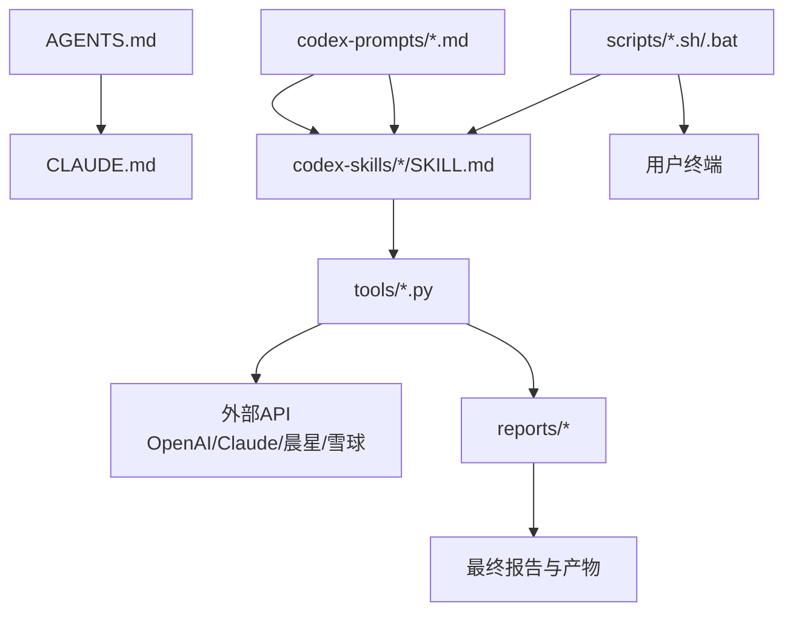
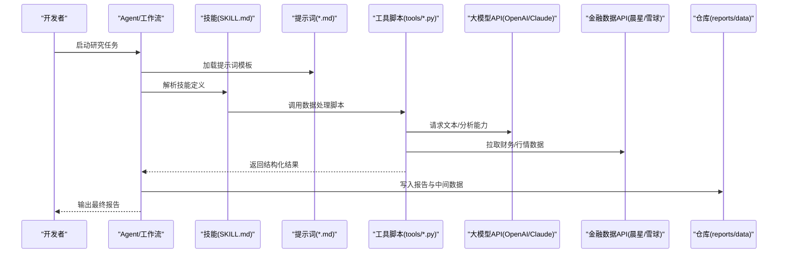
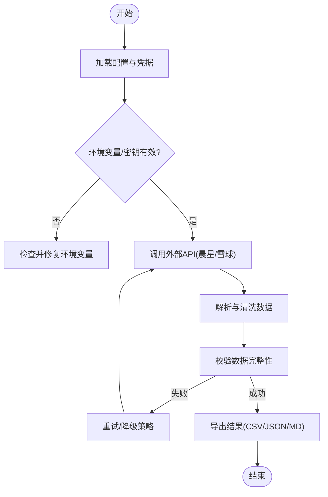
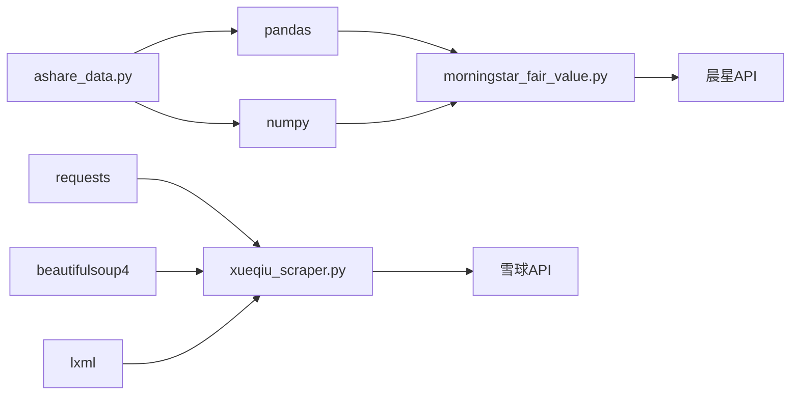

# 环境搭建

<cite>
**本文引用的文件**   
- [AGENTS.md](file://AGENTS.md)
- [CLAUDE.md](file://CLAUDE.md)
- [install-claude-commands.sh](file://scripts/install-claude-commands.sh)
- [install-codex-skills.sh](file://scripts/install-codex-skills.sh)
- [install-codex-prompts.sh](file://scripts/install-codex-prompts.sh)
- [install-claude-commands.bat](file://scripts/install-claude-commands.bat)
- [install-codex-skills.bat](file://scripts/install-codex-skills.bat)
- [install-codex-prompts.bat](file://scripts/install-codex-prompts.bat)
- [sync-codex-prompts.py](file://scripts/sync-codex-prompts.py)
- [sync-codex-skills.py](file://scripts/sync-codex-skills.py)
- [financial-data.md](file://codex-prompts/financial-data.md)
- [investment-research.md](file://codex-prompts/investment-research.md)
- [SKILL.md](file://codex-skills/financial-data/SKILL.md)
- [SKILL.md](file://codex-skills/deep-company-series/SKILL.md)
- [morningstar_fair_value.py](file://tools/morningstar_fair_value.py)
- [xueqiu_scraper.py](file://tools/xueqiu_scraper.py)
- [ashare_data.py](file://tools/ashare_data.py)
</cite>

## 目录
1. [简介](#简介)
2. [项目结构](#项目结构)
3. [核心组件](#核心组件)
4. [架构总览](#架构总览)
5. [详细组件分析](#详细组件分析)
6. [依赖分析](#依赖分析)
7. [性能考虑](#性能考虑)
8. [故障排查指南](#故障排查指南)
9. [结论](#结论)
10. [附录](#附录)

## 简介
本指南面向开发者，提供从本地环境准备到外部服务配置、再到自动化脚本部署的完整流程。内容涵盖：
- Python 环境与核心依赖（pandas、numpy、requests 等）安装与验证
- 大语言模型 API（OpenAI、Claude 等）与金融数据 API（晨星、雪球等）密钥配置
- 自动化安装脚本的使用与注意事项
- 关键配置文件（AGENTS.md、CLAUDE.md 等）的作用与设置要点
- 常见问题定位与解决建议

## 项目结构
仓库采用“提示词/技能 + 工具脚本 + 报告输出”的组织方式：
- codex-prompts：LLM 提示词模板集合，用于驱动研究、数据获取、报告生成等工作流
- codex-skills：可复用的技能定义（SKILL.md），描述任务边界、输入输出与调用约定
- scripts：跨平台安装与同步脚本（Shell/Batch/Python）
- tools：数据采集与分析工具（晨星公允价值、雪球爬虫、A股数据等）
- reports：投研报告与产出物
- data：示例数据与中间结果
- AGENTS.md / CLAUDE.md：项目级行为与能力说明

图表来源
- [AGENTS.md](file://AGENTS.md)
- [CLAUDE.md](file://CLAUDE.md)
- [install-claude-commands.sh](file://scripts/install-claude-commands.sh)
- [install-codex-skills.sh](file://scripts/install-codex-skills.sh)
- [install-codex-prompts.sh](file://scripts/install-codex-prompts.sh)
- [install-claude-commands.bat](file://scripts/install-claude-commands.bat)
- [install-codex-skills.bat](file://scripts/install-codex-skills.bat)
- [install-codex-prompts.bat](file://scripts/install-codex-prompts.bat)
- [financial-data.md](file://codex-prompts/financial-data.md)
- [investment-research.md](file://codex-prompts/investment-research.md)
- [SKILL.md](file://codex-skills/financial-data/SKILL.md)
- [SKILL.md](file://codex-skills/deep-company-series/SKILL.md)
- [morningstar_fair_value.py](file://tools/morningstar_fair_value.py)
- [xueqiu_scraper.py](file://tools/xueqiu_scraper.py)
- [ashare_data.py](file://tools/ashare_data.py)

章节来源
- [AGENTS.md](file://AGENTS.md)
- [CLAUDE.md](file://CLAUDE.md)
- [install-claude-commands.sh](file://scripts/install-claude-commands.sh)
- [install-codex-skills.sh](file://scripts/install-codex-skills.sh)
- [install-codex-prompts.sh](file://scripts/install-codex-prompts.sh)
- [install-claude-commands.bat](file://scripts/install-claude-commands.bat)
- [install-codex-skills.bat](file://scripts/install-codex-skills.bat)
- [install-codex-prompts.bat](file://scripts/install-codex-prompts.bat)
- [financial-data.md](file://codex-prompts/financial-data.md)
- [investment-research.md](file://codex-prompts/investment-research.md)
- [SKILL.md](file://codex-skills/financial-data/SKILL.md)
- [SKILL.md](file://codex-skills/deep-company-series/SKILL.md)
- [morningstar_fair_value.py](file://tools/morningstar_fair_value.py)
- [xueqiu_scraper.py](file://tools/xueqiu_scraper.py)
- [ashare_data.py](file://tools/ashare_data.py)

## 核心组件
- 提示词与技能
  - codex-prompts：定义研究、数据、写作等任务的提示词模板
  - codex-skills：将提示词封装为可复用技能，明确输入输出与执行约束
- 自动化脚本
  - install-*.sh/.bat：一键安装/链接提示词与技能到工作区
  - sync-*.py：在仓库内同步更新提示词与技能
- 工具脚本
  - morningstar_fair_value.py：对接晨星公允价值接口
  - xueqiu_scraper.py：抓取雪球公开信息
  - ashare_data.py：A股相关数据处理
- 项目级配置
  - AGENTS.md：Agent 行为与能力说明
  - CLAUDE.md：Claude 工作空间配置与使用说明

章节来源
- [financial-data.md](file://codex-prompts/financial-data.md)
- [investment-research.md](file://codex-prompts/investment-research.md)
- [SKILL.md](file://codex-skills/financial-data/SKILL.md)
- [SKILL.md](file://codex-skills/deep-company-series/SKILL.md)
- [install-claude-commands.sh](file://scripts/install-claude-commands.sh)
- [install-codex-skills.sh](file://scripts/install-codex-skills.sh)
- [install-codex-prompts.sh](file://scripts/install-codex-prompts.sh)
- [install-claude-commands.bat](file://scripts/install-claude-commands.bat)
- [install-codex-skills.bat](file://scripts/install-codex-skills.bat)
- [install-codex-prompts.bat](file://scripts/install-codex-prompts.bat)
- [sync-codex-prompts.py](file://scripts/sync-codex-prompts.py)
- [sync-codex-skills.py](file://scripts/sync-codex-skills.py)
- [morningstar_fair_value.py](file://tools/morningstar_fair_value.py)
- [xueqiu_scraper.py](file://tools/xueqiu_scraper.py)
- [ashare_data.py](file://tools/ashare_data.py)
- [AGENTS.md](file://AGENTS.md)
- [CLAUDE.md](file://CLAUDE.md)

## 架构总览
下图展示了“提示词/技能 → 工具脚本 → 外部API → 报告输出”的整体数据流。

图表来源
- [financial-data.md](file://codex-prompts/financial-data.md)
- [investment-research.md](file://codex-prompts/investment-research.md)
- [SKILL.md](file://codex-skills/financial-data/SKILL.md)
- [SKILL.md](file://codex-skills/deep-company-series/SKILL.md)
- [morningstar_fair_value.py](file://tools/morningstar_fair_value.py)
- [xueqiu_scraper.py](file://tools/xueqiu_scraper.py)
- [ashare_data.py](file://tools/ashare_data.py)

## 详细组件分析

### Python 环境与依赖
- 版本要求
  - 建议使用 Python 3.10+（根据工具脚本对第三方库的兼容性选择）
- 虚拟环境
  - 推荐使用 venv 或 conda 创建隔离环境，避免系统包冲突
- 核心依赖
  - pandas、numpy、requests 为数据处理与网络请求的基础库
  - 其他可能需要的库包括 openpyxl（Excel 读写）、beautifulsoup4/lxml（网页解析）等，具体以工具脚本导入为准
- 安装步骤
  - 使用 pip 安装：pip install pandas numpy requests
  - 如需 Excel 支持：pip install openpyxl
  - 如需网页解析：pip install beautifulsoup4 lxml
- 验证方法
  - 在 Python 中 import 上述模块并打印版本号，确保无报错

章节来源
- [morningstar_fair_value.py](file://tools/morningstar_fair_value.py)
- [xueqiu_scraper.py](file://tools/xueqiu_scraper.py)
- [ashare_data.py](file://tools/ashare_data.py)

### 外部 API 密钥配置
- 大语言模型 API
  - OpenAI：设置环境变量 OPENAI_API_KEY；如通过代理访问，需配置代理相关变量
  - Claude：设置环境变量 ANTHROPIC_API_KEY；同样可按需配置代理
- 金融数据 API
  - 晨星：在 morningstar_fair_value.py 中查找并配置认证参数（如 token、cookie 或账号密码）
  - 雪球：在 xueqiu_scraper.py 中配置登录态或 Cookie（注意合规与频率限制）
- 安全建议
  - 不要将密钥硬编码进代码；优先使用环境变量或 .env 文件
  - 将包含密钥的文件加入 .gitignore，避免泄露

章节来源
- [morningstar_fair_value.py](file://tools/morningstar_fair_value.py)
- [xueqiu_scraper.py](file://tools/xueqiu_scraper.py)

### 自动化安装脚本
- Shell 脚本（Linux/macOS）
  - install-claude-commands.sh：安装/链接 Claude 命令与工作区
  - install-codex-skills.sh：安装/链接 codex-skills 到工作区
  - install-codex-prompts.sh：安装/链接 codex-prompts 到工作区
- Windows 批处理脚本
  - install-claude-commands.bat
  - install-codex-skills.bat
  - install-codex-prompts.bat
- 同步脚本
  - sync-codex-prompts.py：在仓库内同步提示词变更
  - sync-codex-skills.py：在仓库内同步技能变更
- 使用方法
  - Linux/macOS：赋予执行权限后运行对应 .sh 脚本
  - Windows：双击或命令行运行对应 .bat 脚本
  - 首次运行前确认目标路径存在且具备写权限

章节来源
- [install-claude-commands.sh](file://scripts/install-claude-commands.sh)
- [install-codex-skills.sh](file://scripts/install-codex-skills.sh)
- [install-codex-prompts.sh](file://scripts/install-codex-prompts.sh)
- [install-claude-commands.bat](file://scripts/install-claude-commands.bat)
- [install-codex-skills.bat](file://scripts/install-codex-skills.bat)
- [install-codex-prompts.bat](file://scripts/install-codex-prompts.bat)
- [sync-codex-prompts.py](file://scripts/sync-codex-prompts.py)
- [sync-codex-skills.py](file://scripts/sync-codex-skills.py)

### 关键配置文件
- AGENTS.md
  - 作用：定义 Agent 的行为规范、可用能力与交互约定
  - 设置要点：按需启用/禁用功能、指定默认模型与输出格式
- CLAUDE.md
  - 作用：Claude 工作空间配置说明，包括技能与提示词的加载路径
  - 设置要点：确认路径映射正确、权限无误

章节来源
- [AGENTS.md](file://AGENTS.md)
- [CLAUDE.md](file://CLAUDE.md)

### 提示词与技能
- 提示词模板
  - financial-data.md：财务数据获取与分析流程
  - investment-research.md：投资研究框架与输出规范
- 技能定义
  - codex-skills/financial-data/SKILL.md：封装数据获取与清洗流程
  - codex-skills/deep-company-series/SKILL.md：深度公司系列研究流程
- 使用方式
  - 通过 Agent 加载 SKILL.md 与对应提示词，按输入参数触发工具脚本

章节来源
- [financial-data.md](file://codex-prompts/financial-data.md)
- [investment-research.md](file://codex-prompts/investment-research.md)
- [SKILL.md](file://codex-skills/financial-data/SKILL.md)
- [SKILL.md](file://codex-skills/deep-company-series/SKILL.md)

### 工具脚本与数据流
- morningstar_fair_value.py
  - 职责：读取晨星公允价值数据，进行清洗与导出
  - 输入：认证凭据、股票代码/筛选条件
  - 输出：CSV/JSON 等结构化数据
- xueqiu_scraper.py
  - 职责：抓取雪球公开页面信息，解析为结构化数据
  - 输入：Cookie/登录态、目标页面 URL
  - 输出：Markdown/CSV/JSON 等
- ashare_data.py
  - 职责：A股数据处理与指标计算
  - 输入：原始数据文件或接口返回
  - 输出：分析结果与可视化素材

图表来源
- [morningstar_fair_value.py](file://tools/morningstar_fair_value.py)
- [xueqiu_scraper.py](file://tools/xueqiu_scraper.py)
- [ashare_data.py](file://tools/ashare_data.py)

## 依赖分析
- 直接依赖
  - pandas、numpy、requests 为核心数据处理与网络请求库
  - 可选：openpyxl、beautifulsoup4、lxml（视工具脚本导入而定）
- 间接依赖
  - 各工具脚本内部可能引入特定库（如日期处理、加密、日志等）
- 外部集成点
  - 大模型 API：OpenAI、Anthropic（Claude）
  - 金融数据 API：晨星、雪球

图表来源
- [morningstar_fair_value.py](file://tools/morningstar_fair_value.py)
- [xueqiu_scraper.py](file://tools/xueqiu_scraper.py)
- [ashare_data.py](file://tools/ashare_data.py)

章节来源
- [morningstar_fair_value.py](file://tools/morningstar_fair_value.py)
- [xueqiu_scraper.py](file://tools/xueqiu_scraper.py)
- [ashare_data.py](file://tools/ashare_data.py)

## 性能考虑
- 批量请求与限流
  - 对金融数据 API 增加退避与重试逻辑，避免触发限流
- 内存与缓存
  - 大数据集处理时采用分块读取与增量写入，减少内存峰值
- 并行与异步
  - 对独立请求使用并发策略（如线程池/协程），提升吞吐
- 输出优化
  - 使用列式存储（Parquet）或压缩格式（gzip）降低体积

[本节为通用指导，不直接分析具体文件]

## 故障排查指南
- 环境问题
  - Python 版本不兼容：升级至 3.10+，或使用 pyenv/conda 管理多版本
  - 依赖缺失：重新安装 pandas/numpy/requests 及可选依赖
- 网络与代理
  - 无法访问外部 API：检查代理设置与防火墙规则
  - 证书错误：更新 CA 证书或配置信任根
- 密钥与鉴权
  - 401/403 错误：核对环境变量名与值是否正确
  - Cookie 过期：刷新登录态并更新脚本中的凭据
- 权限问题
  - 安装脚本执行失败：确认具有写权限与执行权限
  - 路径不存在：先创建目标目录再运行安装脚本
- 数据异常
  - 字段缺失或类型错误：检查上游数据源与解析逻辑
  - 空结果：确认筛选条件与时间范围是否合理

章节来源
- [morningstar_fair_value.py](file://tools/morningstar_fair_value.py)
- [xueqiu_scraper.py](file://tools/xueqiu_scraper.py)
- [install-claude-commands.sh](file://scripts/install-claude-commands.sh)
- [install-codex-skills.sh](file://scripts/install-codex-skills.sh)
- [install-codex-prompts.sh](file://scripts/install-codex-prompts.sh)
- [install-claude-commands.bat](file://scripts/install-claude-commands.bat)
- [install-codex-skills.bat](file://scripts/install-codex-skills.bat)
- [install-codex-prompts.bat](file://scripts/install-codex-prompts.bat)

## 结论
通过本指南，您可以快速完成本地环境搭建、外部 API 配置与自动化脚本部署，并理解提示词与技能的工作方式。建议在团队内统一环境变量命名与密钥管理策略，结合日志与重试机制提升稳定性。

[本节为总结性内容，不直接分析具体文件]

## 附录
- 常用命令参考
  - 安装依赖：pip install pandas numpy requests
  - 运行安装脚本（Linux/macOS）：chmod +x scripts/install-*.sh && ./scripts/install-*.sh
  - 运行安装脚本（Windows）：双击 scripts/install-*.bat 或在命令行执行
- 环境变量清单（示例）
  - OPENAI_API_KEY
  - ANTHROPIC_API_KEY
  - 其他由工具脚本读取的凭据（见对应脚本注释）

[本节为补充信息，不直接分析具体文件]