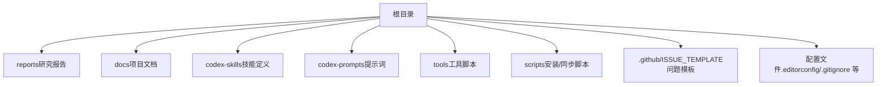
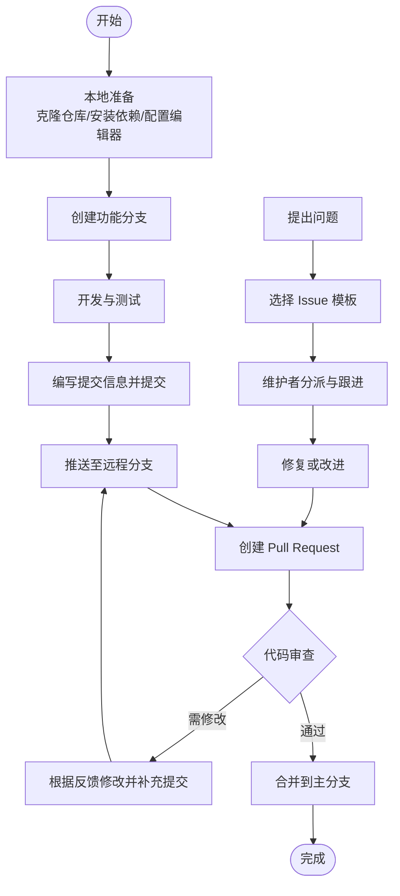
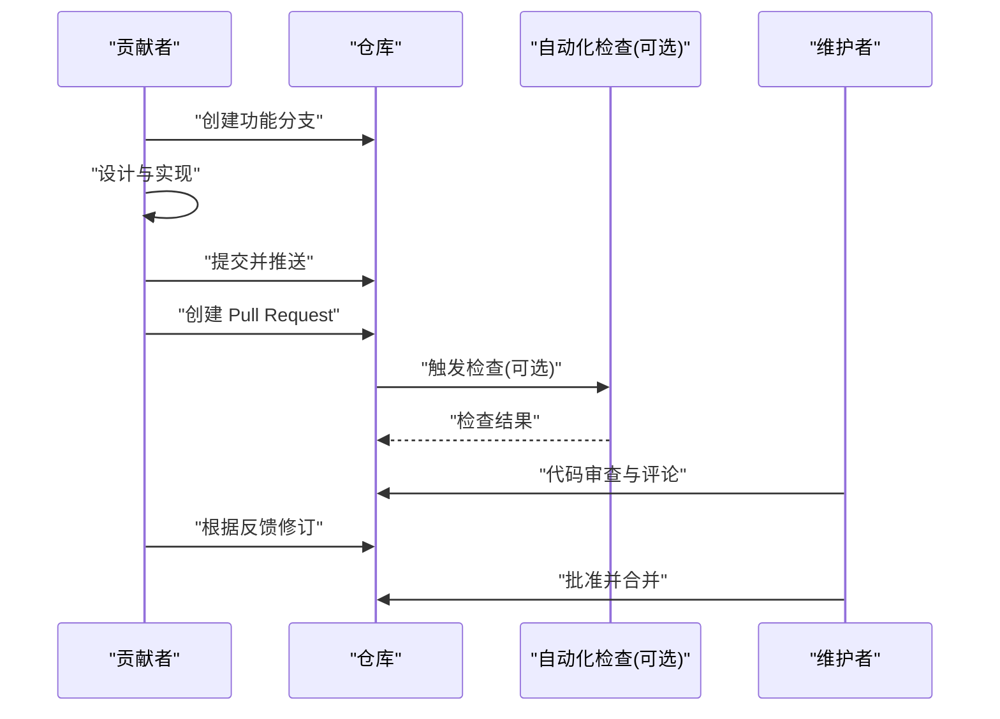
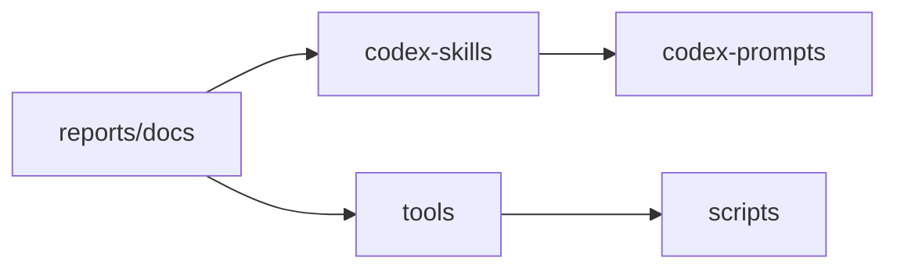

# 贡献指南

<cite>
**本文引用的文件**   
- [README_EN.md](file://README_EN.md)
- [CODE_OF_CONDUCT.md](file://CODE_OF_CONDUCT.md)
- [SECURITY.md](file://SECURITY.md)
- [.editorconfig](file://.editorconfig)
- [.gitignore](file://.gitignore)
- [AGENTS.md](file://AGENTS.md)
- [CLAUDE.md](file://CLAUDE.md)
- [ISSUE_TEMPLATE/bug_report.yml](file://.github/ISSUE_TEMPLATE/bug_report.yml)
- [ISSUE_TEMPLATE/config.yml](file://.github/ISSUE_TEMPLATE/config.yml)
- [ISSUE_TEMPLATE/data_error.yml](file://.github/ISSUE_TEMPLATE/data_error.yml)
- [ISSUE_TEMPLATE/other.yml](file://.github/ISSUE_TEMPLATE/other.yml)
- [ISSUE_TEMPLATE/suggestion.yml](file://.github/ISSUE_TEMPLATE/suggestion.yml)
</cite>

## 目录
1. [简介](#简介)
2. [项目结构](#项目结构)
3. [核心组件](#核心组件)
4. [架构总览](#架构总览)
5. [详细组件分析](#详细组件分析)
6. [依赖分析](#依赖分析)
7. [性能考虑](#性能考虑)
8. [故障排查指南](#故障排查指南)
9. [结论](#结论)
10. [附录](#附录)

## 简介
本贡献指南面向希望参与项目的开发者与文档作者，目标是统一代码规范、提交约定、Pull Request 流程、Issue 模板使用方式、行为准则与社区参与规范，并提供从需求到实现的新功能开发流程与文档贡献最佳实践。请所有贡献者在开始工作前阅读并遵循本指南，以确保协作顺畅与质量可控。

## 项目结构
仓库采用“研究内容为主、工具脚本为辅”的组织方式：
- 研究与报告：以 Markdown 为主的研究报告、数据与图表存放于 reports 与 docs 等目录
- 技能与提示词：codex-skills 与 codex-prompts 用于组织可复用的分析与写作能力
- 工具脚本：tools 与 scripts 提供数据处理、回测、筛选等辅助能力
- 配置与规范：根目录包含 .editorconfig、.gitignore、行为准则与安全策略等

[本节为概念性说明，无需来源标注]

## 核心组件
- 行为准则与安全策略：明确社区参与规范与安全披露流程
- 编辑器与格式配置：通过 .editorconfig 统一缩进、换行、编码等基础风格
- Issue 模板：标准化 bug 报告、数据错误、建议与其他类型问题的反馈
- 自动化与安装脚本：提供一键安装与同步能力，降低环境搭建成本
- 研究与报告体系：以 Markdown 为核心的知识沉淀与协作载体

章节来源
- [CODE_OF_CONDUCT.md](file://CODE_OF_CONDUCT.md)
- [SECURITY.md](file://SECURITY.md)
- [.editorconfig](file://.editorconfig)
- [.gitignore](file://.gitignore)
- [ISSUE_TEMPLATE/bug_report.yml](file://.github/ISSUE_TEMPLATE/bug_report.yml)
- [ISSUE_TEMPLATE/data_error.yml](file://.github/ISSUE_TEMPLATE/data_error.yml)
- [ISSUE_TEMPLATE/suggestion.yml](file://.github/ISSUE_TEMPLATE/suggestion.yml)
- [ISSUE_TEMPLATE/other.yml](file://.github/ISSUE_TEMPLATE/other.yml)
- [ISSUE_TEMPLATE/config.yml](file://.github/ISSUE_TEMPLATE/config.yml)

## 架构总览
下图展示了贡献者在工作流中涉及的关键节点与交互关系：从本地准备、分支创建、提交与 PR，到审查与合并，以及问题反馈的闭环。

[本图为概念性流程图，不直接映射具体源码文件，故无图示来源]

## 详细组件分析

### 代码规范与提交约定
- Python 代码风格
  - 缩进与空格：遵循 .editorconfig 的统一设置，确保跨编辑器一致
  - 换行与编码：使用 LF 换行与 UTF-8 编码
  - 命名与模块：保持简洁明确的命名，避免过深嵌套
- Markdown 文档格式
  - 标题层级清晰，段落简短，列表有序
  - 链接与图片路径相对且稳定
  - 表格与代码块用于结构化表达
- 文件命名规范
  - 英文小写加下划线或短横线，避免特殊字符
  - 日期型后缀统一格式（如 YYYYMMDD）
- 提交信息约定
  - 主题行简明扼要，必要时在正文补充动机与影响
  - 关联 Issue 编号（如有）
  - 变更范围尽量单一，便于审查与回溯

章节来源
- [.editorconfig](file://.editorconfig)
- [.gitignore](file://.gitignore)

### Pull Request 流程与协作规范
- 分支管理策略
  - 基于主分支创建功能分支，完成后发起 PR
  - 分支名体现变更类型与目标（例如 feature/xxx、fix/xxx）
- 代码审查要求
  - 自测通过后提交，附带必要说明与截图/日志
  - 审查关注点：正确性、可读性、可维护性、兼容性
- 合并标准
  - 审查通过、CI 检查通过（若启用）、无冲突
  - 重要变更需至少一名维护者批准

章节来源
- [AGENTS.md](file://AGENTS.md)
- [CLAUDE.md](file://CLAUDE.md)

### GitHub Issues 模板使用
- 模板类型
  - Bug 报告：描述现象、复现步骤、期望与实际结果、环境与日志
  - 数据错误：定位数据来源、字段差异、对比依据与修正建议
  - 功能建议：背景、价值、方案与验收标准
  - 其他：通用问题与讨论
- 提交流程
  - 先搜索是否已有相关 Issue
  - 选择合适模板填写关键信息
  - 附上最小可复现示例或数据片段（脱敏后）

章节来源
- [ISSUE_TEMPLATE/bug_report.yml](file://.github/ISSUE_TEMPLATE/bug_report.yml)
- [ISSUE_TEMPLATE/data_error.yml](file://.github/ISSUE_TEMPLATE/data_error.yml)
- [ISSUE_TEMPLATE/suggestion.yml](file://.github/ISSUE_TEMPLATE/suggestion.yml)
- [ISSUE_TEMPLATE/other.yml](file://.github/ISSUE_TEMPLATE/other.yml)
- [ISSUE_TEMPLATE/config.yml](file://.github/ISSUE_TEMPLATE/config.yml)

### 行为准则与社区参与
- 尊重与包容：保持专业与友善，尊重不同观点
- 有效沟通：聚焦问题本身，提供事实与证据
- 安全与合规：遵守安全披露流程，不泄露敏感信息
- 贡献边界：在职责范围内协作，重大决策由维护者把关

章节来源
- [CODE_OF_CONDUCT.md](file://CODE_OF_CONDUCT.md)
- [SECURITY.md](file://SECURITY.md)

### 新功能开发流程（从需求到实现）
- 需求分析
  - 明确问题背景、目标用户与成功指标
  - 评估影响范围与风险
- 方案设计
  - 输出简要设计说明（接口、数据结构、依赖变化）
  - 确定测试策略与验收标准
- 实现与自测
  - 按规范编写代码与文档
  - 本地验证与回归检查
- 提交与审查
  - 拆分提交、完善提交信息
  - 响应审查意见并完成修订
- 合并与发布
  - 满足合并标准后合入
  - 更新相关文档与变更记录

[本图为概念性序列图，不直接映射具体源码文件，故无图示来源]

### 文档贡献最佳实践
- 结构与一致性
  - 使用统一的标题层级与术语表
  - 新增或更新 README、指南类文档时，保持版本与时间戳一致
- 可视化与示例
  - 用流程图/时序图解释复杂过程
  - 提供可复现的最小示例与预期输出
- 审核与归档
  - 文档变更同样走 PR 流程
  - 归档历史版本，保留变更记录

章节来源
- [AGENTS.md](file://AGENTS.md)
- [CLAUDE.md](file://CLAUDE.md)

## 依赖分析
- 内部依赖
  - 工具脚本与技能/提示词相互引用，形成“能力+数据+报告”的闭环
- 外部依赖
  - 编辑器与 Git 工具链
  - 第三方库仅在 tools/scripts 中使用，按需安装
- 耦合与内聚
  - 报告与数据相对独立，便于并行协作
  - 工具脚本应保持稳定接口，减少破坏性变更

[本图为概念性依赖图，不直接映射具体源码文件，故无图示来源]

## 性能考虑
- 大文件与数据
  - 避免将大型二进制或数据集直接提交至仓库，使用外部存储或数据快照说明
- 脚本效率
  - 对批量处理脚本进行必要的优化与日志记录
- 文档检索
  - 合理组织目录与索引，提升查阅效率

[本节为通用指导，无需来源标注]

## 故障排查指南
- 常见问题
  - 编辑器格式不一致：确认 .editorconfig 生效
  - 提交被拒绝：检查分支保护规则与审查状态
  - Issue 无法分类：核对模板字段是否完整
- 定位方法
  - 使用最小复现步骤与日志
  - 区分数据问题与逻辑问题，分别走数据错误与 Bug 模板
- 升级与回滚
  - 重要变更前后备份关键数据与配置
  - 记录变更原因与影响面

章节来源
- [ISSUE_TEMPLATE/bug_report.yml](file://.github/ISSUE_TEMPLATE/bug_report.yml)
- [ISSUE_TEMPLATE/data_error.yml](file://.github/ISSUE_TEMPLATE/data_error.yml)
- [.editorconfig](file://.editorconfig)

## 结论
通过统一的规范与流程，本项目能够在保证质量的前提下高效协作。请贡献者严格遵循本指南，并在遇到不确定问题时及时沟通。感谢每一位参与者的付出。

[本节为总结性内容，无需来源标注]

## 附录
- 快速入口
  - 行为准则：[CODE_OF_CONDUCT.md](file://CODE_OF_CONDUCT.md)
  - 安全策略：[SECURITY.md](file://SECURITY.md)
  - 项目概览：[README_EN.md](file://README_EN.md)
  - 编辑器配置：[.editorconfig](file://.editorconfig)
  - 忽略规则：[.gitignore](file://.gitignore)
  - 智能体与助手说明：[AGENTS.md](file://AGENTS.md)、[CLAUDE.md](file://CLAUDE.md)
  - Issue 模板：见 .github/ISSUE_TEMPLATE 目录

章节来源
- [README_EN.md](file://README_EN.md)
- [CODE_OF_CONDUCT.md](file://CODE_OF_CONDUCT.md)
- [SECURITY.md](file://SECURITY.md)
- [.editorconfig](file://.editorconfig)
- [.gitignore](file://.gitignore)
- [AGENTS.md](file://AGENTS.md)
- [CLAUDE.md](file://CLAUDE.md)
- [ISSUE_TEMPLATE/bug_report.yml](file://.github/ISSUE_TEMPLATE/bug_report.yml)
- [ISSUE_TEMPLATE/data_error.yml](file://.github/ISSUE_TEMPLATE/data_error.yml)
- [ISSUE_TEMPLATE/suggestion.yml](file://.github/ISSUE_TEMPLATE/suggestion.yml)
- [ISSUE_TEMPLATE/other.yml](file://.github/ISSUE_TEMPLATE/other.yml)
- [ISSUE_TEMPLATE/config.yml](file://.github/ISSUE_TEMPLATE/config.yml)