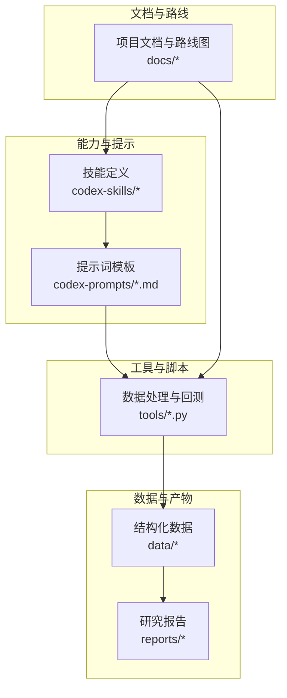
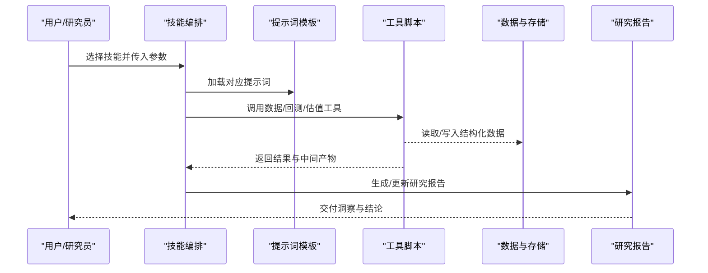
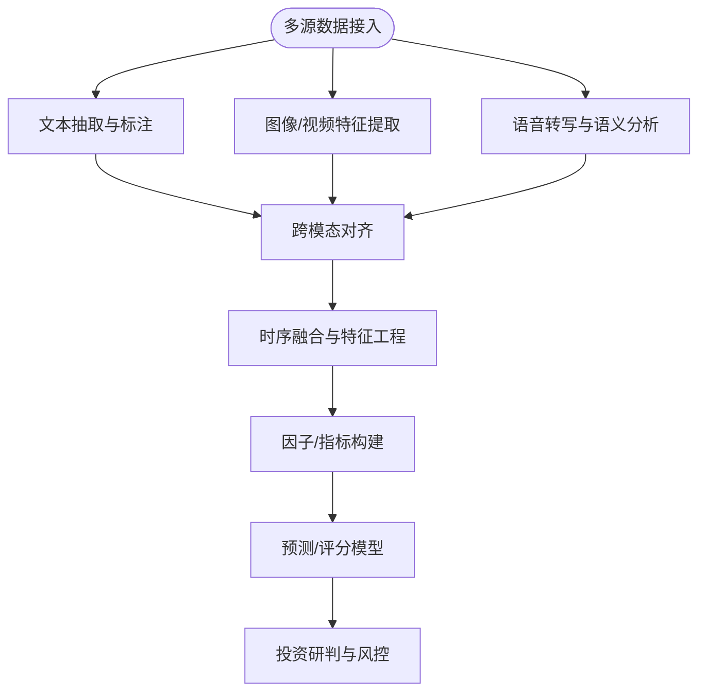
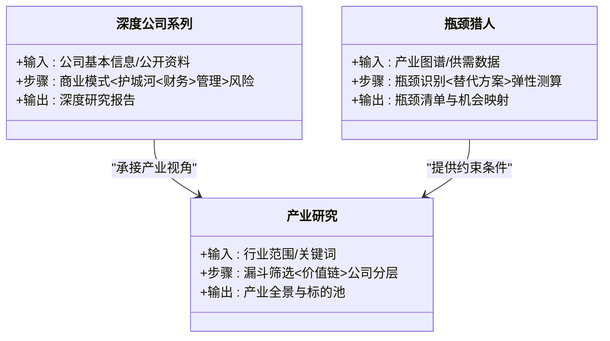
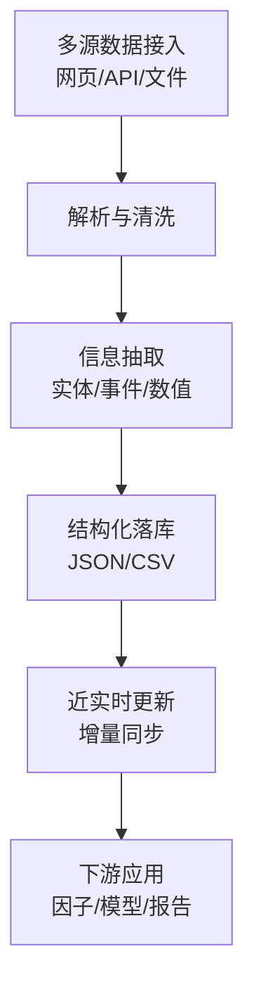
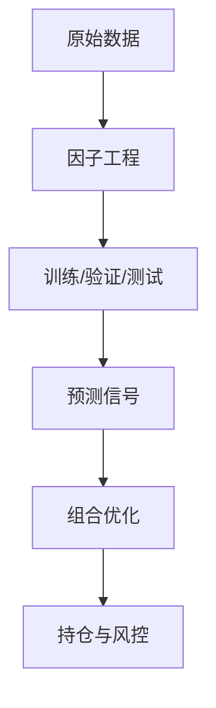

# AI投资前沿技术

<cite>
**本文引用的文件**   
- [README_EN.md](file://README_EN.md)
- [AGENTS.md](file://AGENTS.md)
- [CLAUDE.md](file://CLAUDE.md)
- [ROADMAP.md](file://docs/ROADMAP.md)
- [大模型的下一战：多模态是必然还是过热的叙事.md](file://docs/大模型的下一战：多模态是必然还是过热的叙事.md)
- [bottleneck-hunter.md](file://codex-prompts/bottleneck-hunter.md)
- [deep-company-series.md](file://codex-prompts/deep-company-series.md)
- [industry-research.md](file://codex-prompts/industry-research.md)
- [investment-research.md](file://codex-prompts/investment-research.md)
- [financial-data.md](file://codex-prompts/financial-data.md)
- [earnings-review.md](file://codex-prompts/earnings-review.md)
- [management-deep-dive.md](file://codex-prompts/management-deep-dive.md)
- [news-pulse.md](file://codex-prompts/news-pulse.md)
- [portfolio-review.md](file://codex-prompts/portfolio-review.md)
- [SKILL.md](file://codex-skills/deep-company-series/SKILL.md)
- [SKILL.md](file://codex-skills/industry-research/SKILL.md)
- [SKILL.md](file://codex-skills/financial-data/SKILL.md)
- [SKILL.md](file://codex-skills/earnings-review/SKILL.md)
- [SKILL.md](file://codex-skills/management-deep-dive/SKILL.md)
- [SKILL.md](file://codex-skills/news-pulse/SKILL.md)
- [SKILL.md](file://codex-skills/portfolio-review/SKILL.md)
- [stock_screener.py](file://tools/stock_screener.py)
- [momentum_backtest_v2.py](file://tools/momentum_backtest_v2.py)
- [morningstar_fair_value.py](file://tools/morningstar_fair_value.py)
- [xueqiu_scraper.py](file://tools/xueqiu_scraper.py)
- [ashare_data.py](file://tools/ashare_data.py)
- [fundamentals.json](file://data/fundamentals.json)
- [watchlist.json](file://data/watchlist.json)
- [AI五层蛋糕-产业全景研究-20260605.md](file://reports/AI产业研究/AI五层蛋糕-产业全景研究-20260605.md)
- [AI五层蛋糕-50家卡脖子公司筛选-20260605.md](file://reports/AI产业研究/AI五层蛋糕-50家卡脖子公司筛选-20260605.md)
</cite>

## 目录
1. [引言](#引言)
2. [项目结构](#项目结构)
3. [核心组件](#核心组件)
4. [架构总览](#架构总览)
5. [详细组件分析](#详细组件分析)
6. [依赖关系分析](#依赖关系分析)
7. [性能与可扩展性](#性能与可扩展性)
8. [故障排查指南](#故障排查指南)
9. [结论](#结论)
10. [附录](#附录)

## 引言
本文件面向希望将AI技术应用于投资决策的读者，系统梳理多模态分析、大语言模型（LLM）在投研中的落地路径、AI驱动的数据采集与处理、机器学习在量化投资中的应用，以及风险与治理要点。结合仓库中“技能+提示词+工具脚本+研究报告”的组合式实践，提供从方法论到工程化的完整参考，帮助投资者提升研究与决策效率。

## 项目结构
仓库采用“能力即代码”的组织方式：以“技能（skills/codex-skills）”定义投研流程，以“提示词（codex-prompts）”规范信息抽取与分析框架，以“工具（tools）”实现数据抓取、回测与估值计算，以“报告（reports）”沉淀研究成果，辅以“数据（data）”和“文档（docs）”。

图表来源
- [SKILL.md](file://codex-skills/deep-company-series/SKILL.md)
- [SKILL.md](file://codex-skills/industry-research/SKILL.md)
- [SKILL.md](file://codex-skills/financial-data/SKILL.md)
- [stock_screener.py](file://tools/stock_screener.py)
- [morningstar_fair_value.py](file://tools/morningstar_fair_value.py)
- [xueqiu_scraper.py](file://tools/xueqiu_scraper.py)
- [roadmap.md](file://docs/ROADMAP.md)

章节来源
- [README_EN.md](file://README_EN.md)
- [AGENTS.md](file://AGENTS.md)
- [CLAUDE.md](file://CLAUDE.md)
- [ROADMAP.md](file://docs/ROADMAP.md)

## 核心组件
- 技能体系（Skills）：将投研工作流封装为可复用的“技能”，如深度公司系列、行业研究、财报审阅、管理层深潜、新闻脉搏、组合复盘等，每个技能包含目标、输入输出、步骤与质量检查。
- 提示词库（Prompts）：围绕关键任务提供高质量提示词模板，覆盖瓶颈识别、产业漏斗、财务数据提取、盈利电话会解读、投研清单等，确保一致性与可追溯性。
- 工具链（Tools）：提供A股数据接入、雪球爬虫、动量回测、晨星公允价值估算、选股器等功能，打通“数据—分析—报告”闭环。
- 数据资产（Data）：存放基本面快照、关注列表、相关性矩阵等结构化数据，作为分析与报告的输入。
- 研究报告（Reports）：按公司与主题归档的研究产出，体现从“技能+提示词+工具”到“洞察与结论”的转化。

章节来源
- [SKILL.md](file://codex-skills/deep-company-series/SKILL.md)
- [SKILL.md](file://codex-skills/industry-research/SKILL.md)
- [SKILL.md](file://codex-skills/financial-data/SKILL.md)
- [SKILL.md](file://codex-skills/earnings-review/SKILL.md)
- [SKILL.md](file://codex-skills/management-deep-dive/SKILL.md)
- [SKILL.md](file://codex-skills/news-pulse/SKILL.md)
- [SKILL.md](file://codex-skills/portfolio-review/SKILL.md)
- [stock_screener.py](file://tools/stock_screener.py)
- [momentum_backtest_v2.py](file://tools/momentum_backtest_v2.py)
- [morningstar_fair_value.py](file://tools/morningstar_fair_value.py)
- [xueqiu_scraper.py](file://tools/xueqiu_scraper.py)
- [ashare_data.py](file://tools/ashare_data.py)
- [fundamentals.json](file://data/fundamentals.json)
- [watchlist.json](file://data/watchlist.json)

## 架构总览
整体架构遵循“技能编排—提示词驱动—工具执行—数据沉淀—报告生成”的流水线模式。技能负责流程编排与质量控制；提示词保证信息抽取与推理的一致性；工具完成数据采集、清洗、建模与回测；数据与报告形成知识资产，反哺后续迭代。

图表来源
- [SKILL.md](file://codex-skills/deep-company-series/SKILL.md)
- [SKILL.md](file://codex-skills/industry-research/SKILL.md)
- [SKILL.md](file://codex-skills/financial-data/SKILL.md)
- [stock_screener.py](file://tools/stock_screener.py)
- [morningstar_fair_value.py](file://tools/morningstar_fair_value.py)
- [xueqiu_scraper.py](file://tools/xueqiu_scraper.py)

## 详细组件分析

### 多模态分析在投资决策中的应用
- 文本：财报、公告、研报、新闻、社交媒体等多源文本的结构化抽取与情感/事件标注，用于构建事件因子与情绪指标。
- 图像/视频：工厂巡检图、产品演示视频、渠道陈列照片等，通过视觉模型进行质量评估与趋势判断。
- 音频：业绩电话会、路演录音转写，提取管理层语气、不确定性信号与前瞻指引变化。
- 融合方法：跨模态对齐（文本-图像-音频）、时序融合（事件序列）、对比学习（同业对标），最终汇聚为可解释的投资因子与情景假设。

[本节为概念性说明，不直接分析具体文件]

### 大语言模型在投研中的实际应用
- 深度公司系列分析：基于“深度公司系列”技能与提示词，自动拆解商业模式、护城河、竞争格局、财务质量与管理层评估，形成标准化研究骨架。
- 瓶颈识别：利用“瓶颈猎人”提示词与产业漏斗技能，自上而下定位产业链关键环节与约束点，辅助资本配置。
- 产业研究：通过“产业研究”技能与“产业漏斗”提示词，完成赛道扫描、价值链拆解与公司分层。
- 财报与电话会：借助“财报审阅”“管理层深潜”“新闻脉搏”等技能，自动化提炼关键信息与风险提示。

图表来源
- [SKILL.md](file://codex-skills/deep-company-series/SKILL.md)
- [bottleneck-hunter.md](file://codex-prompts/bottleneck-hunter.md)
- [industry-research.md](file://codex-prompts/industry-research.md)
- [investment-research.md](file://codex-prompts/investment-research.md)
- [financial-data.md](file://codex-prompts/financial-data.md)
- [earnings-review.md](file://codex-prompts/earnings-review.md)
- [management-deep-dive.md](file://codex-prompts/management-deep-dive.md)
- [news-pulse.md](file://codex-prompts/news-pulse.md)

章节来源
- [SKILL.md](file://codex-skills/deep-company-series/SKILL.md)
- [SKILL.md](file://codex-skills/industry-research/SKILL.md)
- [SKILL.md](file://codex-skills/financial-data/SKILL.md)
- [SKILL.md](file://codex-skills/earnings-review/SKILL.md)
- [SKILL.md](file://codex-skills/management-deep-dive/SKILL.md)
- [SKILL.md](file://codex-skills/news-pulse/SKILL.md)
- [SKILL.md](file://codex-skills/portfolio-review/SKILL.md)
- [bottleneck-hunter.md](file://codex-prompts/bottleneck-hunter.md)
- [deep-company-series.md](file://codex-prompts/deep-company-series.md)
- [industry-research.md](file://codex-prompts/industry-research.md)
- [investment-research.md](file://codex-prompts/investment-research.md)
- [financial-data.md](file://codex-prompts/financial-data.md)
- [earnings-review.md](file://codex-prompts/earnings-review.md)
- [management-deep-dive.md](file://codex-prompts/management-deep-dive.md)
- [news-pulse.md](file://codex-prompts/news-pulse.md)
- [portfolio-review.md](file://codex-prompts/portfolio-review.md)

### AI驱动的数据收集与处理
- 自动信息提取：通过提示词驱动的抽取模板，从公告、研报、新闻中提取实体、事件与数值，形成半结构化记录。
- 结构化数据生成：将非结构化内容转化为JSON/CSV，统一字段命名与时间戳，便于后续建模与可视化。
- 实时数据处理：结合爬虫与API，对价格、舆情、资金流向等进行近实时更新，支撑短线策略与事件驱动策略。

章节来源
- [xueqiu_scraper.py](file://tools/xueqiu_scraper.py)
- [ashare_data.py](file://tools/ashare_data.py)
- [financial-data.md](file://codex-prompts/financial-data.md)
- [news-pulse.md](file://codex-prompts/news-pulse.md)

### 机器学习在量化投资中的应用
- 因子挖掘：从价量、基本面、另类数据中构造横截面/时序因子，并进行IC/IR检验与分组收益验证。
- 预测模型：使用树模型、线性模型或深度学习进行收益率/波动率/流动性预测，注意样本外稳健性与交易成本。
- 组合优化：在风险预算、换手率、流动性约束下求解权重，结合凯利公式等仓位管理思想控制尾部风险。

章节来源
- [stock_screener.py](file://tools/stock_screener.py)
- [momentum_backtest_v2.py](file://tools/momentum_backtest_v2.py)
- [morningstar_fair_value.py](file://tools/morningstar_fair_value.py)

## 依赖关系分析
- 技能与提示词：技能定义流程边界与质量标准，提示词提供稳定的信息抽取与推理范式，二者共同决定产出一致性。
- 工具与数据：工具脚本依赖外部数据接口与本地数据格式约定，需保证版本兼容与异常重试机制。
- 报告与资产：报告是对“技能+提示词+工具”产物的综合呈现，应建立索引与溯源链接，便于回溯与审计。

图表来源
- [SKILL.md](file://codex-skills/deep-company-series/SKILL.md)
- [SKILL.md](file://codex-skills/industry-research/SKILL.md)
- [SKILL.md](file://codex-skills/financial-data/SKILL.md)
- [stock_screener.py](file://tools/stock_screener.py)
- [morningstar_fair_value.py](file://tools/morningstar_fair_value.py)
- [xueqiu_scraper.py](file://tools/xueqiu_scraper.py)

章节来源
- [AGENTS.md](file://AGENTS.md)
- [CLAUDE.md](file://CLAUDE.md)
- [ROADMAP.md](file://docs/ROADMAP.md)

## 性能与可扩展性
- 批处理与并行：对大规模公司/行业批量研究时，建议按公司或行业分片并行执行，减少端到端耗时。
- 缓存与去重：对重复请求与稳定数据引入缓存与ETL去重，降低外部接口压力与成本。
- 增量更新：对高频数据采用增量同步与断点续传，保障时效性与稳定性。
- 资源隔离：将数据抓取、模型推理、报告生成拆分为独立进程/容器，避免相互影响。

[本节为通用指导，不直接分析具体文件]

## 故障排查指南
- 数据源不可用：检查网络连通、鉴权配置与速率限制；增加重试与退避策略；必要时切换备用源。
- 解析失败：校验输入格式与编码；对异常行进行跳过与日志记录；逐步缩小问题范围定位。
- 模型输出不稳定：固定随机种子；对提示词进行最小改动回归；增加输出校验与后处理规则。
- 回测异常：确认滑点、手续费、涨跌停与停牌处理；核对基准与区间划分；进行敏感性分析。

章节来源
- [xueqiu_scraper.py](file://tools/xueqiu_scraper.py)
- [ashare_data.py](file://tools/ashare_data.py)
- [momentum_backtest_v2.py](file://tools/momentum_backtest_v2.py)

## 结论
本项目以“技能+提示词+工具+报告”的体系化方式，将AI能力嵌入投研全流程。多模态分析拓展了信息维度，LLM提升了研究与写作效率，工具链保障了数据与回测的可操作性。建议在实践中坚持“可解释、可审计、可回滚”的原则，持续完善数据治理与模型风险管理，稳步提升投研质量与效率。

[本节为总结性内容，不直接分析具体文件]

## 附录

### 使用指南与最佳实践
- 明确目标与范围：先定义研究问题与边界，再选择相应技能与提示词。
- 小步快跑：先用小规模样本验证流程，再扩展到全市场/全行业。
- 数据先行：确保数据口径一致、时间对齐、缺失值与异常值处理策略清晰。
- 可解释优先：保留关键证据链与引用来源，避免黑箱结论。
- 风险控制：设置止损/止盈、仓位上限、集中度与流动性约束。
- 持续迭代：定期复盘模型与流程，更新提示词与因子库。

[本节为通用指导，不直接分析具体文件]

### 典型应用场景示例
- 产业全景与瓶颈识别：以“产业研究”技能与“瓶颈猎人”提示词为基础，结合工具生成的数据，输出产业地图与候选标的。
- 深度公司研究：套用“深度公司系列”技能，配合财务数据与电话会解读，形成结构化研究报告。
- 组合复盘与调仓：基于“组合复盘”技能与回测工具，评估历史表现与归因，提出调仓建议。

章节来源
- [SKILL.md](file://codex-skills/industry-research/SKILL.md)
- [SKILL.md](file://codex-skills/deep-company-series/SKILL.md)
- [SKILL.md](file://codex-skills/portfolio-review/SKILL.md)
- [bottleneck-hunter.md](file://codex-prompts/bottleneck-hunter.md)
- [investment-research.md](file://codex-prompts/investment-research.md)
- [momentum_backtest_v2.py](file://tools/momentum_backtest_v2.py)

### 相关研究报告样例
- AI产业研究：涵盖产业全景、层级拆解与重点公司筛选，展示从宏观到微观的落地路径。
- 晨星公允价值与估值筛选：结合工具与数据，形成可复用的估值与筛选流程。

章节来源
- [AI五层蛋糕-产业全景研究-20260605.md](file://reports/AI产业研究/AI五层蛋糕-产业全景研究-20260605.md)
- [AI五层蛋糕-50家卡脖子公司筛选-20260605.md](file://reports/AI产业研究/AI五层蛋糕-50家卡脖子公司筛选-20260605.md)
- [morningstar_fair_value.py](file://tools/morningstar_fair_value.py)