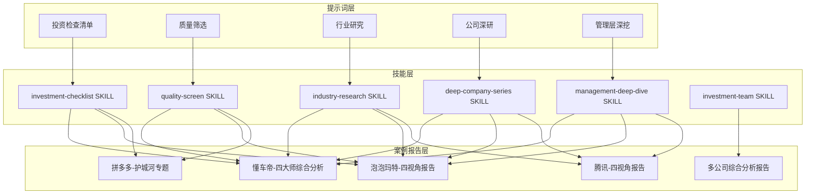
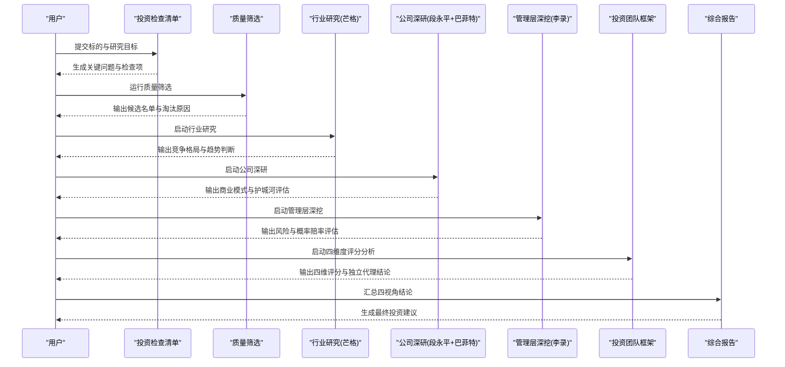
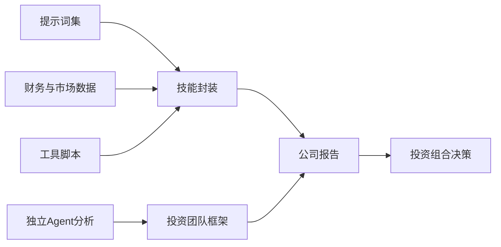

# 四大师分析法详解

<cite>
**本文引用的文件**   
- [README.md](file://README.md)
- [AGENTS.md](file://AGENTS.md)
- [CLAUDE.md](file://CLAUDE.md)
- [codex-prompts/investment-checklist.md](file://codex-prompts/investment-checklist.md)
- [codex-prompts/quality-screen.md](file://codex-prompts/quality-screen.md)
- [codex-prompts/industry-research.md](file://codex-prompts/industry-research.md)
- [codex-prompts/deep-company-series.md](file://codex-prompts/deep-company-series.md)
- [codex-prompts/management-deep-dive.md](file://codex-prompts/management-deep-dive.md)
- [skills/investment-team.md](file://skills/investment-team.md)
- [codex-skills/investment-checklist/SKILL.md](file://codex-skills/investment-checklist/SKILL.md)
- [codex-skills/quality-screen/SKILL.md](file://codex-skills/quality-screen/SKILL.md)
- [codex-skills/industry-research/SKILL.md](file://codex-skills/industry-research/SKILL.md)
- [codex-skills/deep-company-series/SKILL.md](file://codex-skills/deep-company-series/SKILL.md)
- [codex-skills/management-deep-dive/SKILL.md](file://codex-skills/management-deep-dive/SKILL.md)
- [reports/portfolio-action-20260820.md](file://reports/portfolio-action-20260820.md)
- [reports/portfolio-action-20260820-r3.md](file://reports/portfolio-action-20260820-r3.md)
- [reports/rebalance-20260820-step2-holdings.md](file://reports/rebalance-20260820-step2-holdings.md)
- [reports/2026-08-08-quad-skill/synthesis.md](file://reports/2026-08-08-quad-skill/synthesis.md)
- [reports/2026-08-08-quad-skill/ADBE-investment-team-checklist.md](file://reports/2026-08-08-quad-skill/ADBE-investment-team-checklist.md)
- [reports/2026-08-08-quad-skill/INTU-investment-team-checklist.md](file://reports/2026-08-08-quad-skill/INTU-investment-team-checklist.md)
- [reports/portfolio-bubble-0810.json](file://reports/portfolio-bubble-0810.json)
</cite>

## 更新摘要
**所做更改**
- 新增多公司综合分析框架，涵盖META、ADBE、BABA、BRK、AVGO、INTU、MSFT、APLD等8只核心标的
- 完善四维度评分方法论，实现独立代理分析从不同投资哲学角度评估
- 增强投资组合操作建议系统，包含具体仓位管理和止损架构改进
- 更新实战案例，展示完整的四大师综合分析报告生成流程

## 目录
1. [引言](#引言)
2. [项目结构](#项目结构)
3. [核心组件](#核心组件)
4. [架构总览](#架构总览)
5. [详细组件分析](#详细组件分析)
6. [多公司综合分析框架](#多公司综合分析框架)
7. [四维度评分方法论](#四维度评分方法论)
8. [投资组合操作与风险管理](#投资组合操作与风险管理)
9. [依赖关系分析](#依赖关系分析)
10. [性能与效率考量](#性能与效率考量)
11. [故障排查指南](#故障排查指南)
12. [结论](#结论)
13. [附录：模板与检查清单](#附录模板与检查清单)

## 引言
本文件系统化梳理"四大师分析法"在本仓库中的落地形态与实践路径，围绕以下四位投资大师的方法论展开：
- 巴菲特：价值投资、护城河理论、安全边际原则、能力圈概念
- 芒格：多元思维模型、逆向思维、跨学科整合、人类误判心理学在投资决策中的应用
- 段永平：商业模式分析方法（企业本质、企业文化、管理层质量）
- 李录：风险管理框架（概率思维、赔率计算、风险控制策略）

**更新重点**：本次更新基于最新的实战应用，展示了如何对8只核心标的（META、ADBE、BABA、BRK、AVGO、INTU、MSFT、APLD）进行系统性四维度分析，并生成可执行的投资组合操作建议。

## 项目结构
仓库采用"提示词+技能+案例报告"的三层组织方式，支撑从筛选到深度研究的完整流程：
- codex-prompts：面向研究与写作的结构化提示词（如投资检查清单、质量筛选、行业研究、公司深研、管理层深挖等）
- codex-skills：对应提示词的自动化技能封装（SKILL.md），便于一键调用与标准化输出
- reports：按公司与主题组织的投研报告，包含多视角分析（段永平视角、巴菲特视角、芒格视角、李录视角）以及综合报告

**图表来源**
- [codex-prompts/investment-checklist.md](file://codex-prompts/investment-checklist.md)
- [codex-skills/investment-checklist/SKILL.md](file://codex-skills/investment-checklist/SKILL.md)
- [codex-prompts/quality-screen.md](file://codex-prompts/quality-screen.md)
- [codex-skills/quality-screen/SKILL.md](file://codex-skills/quality-screen/SKILL.md)
- [codex-prompts/industry-research.md](file://codex-prompts/industry-research.md)
- [codex-skills/industry-research/SKILL.md](file://codex-skills/industry-research/SKILL.md)
- [codex-prompts/deep-company-series.md](file://codex-prompts/deep-company-series.md)
- [codex-skills/deep-company-series/SKILL.md](file://codex-skills/deep-company-series/SKILL.md)
- [codex-prompts/management-deep-dive.md](file://codex-prompts/management-deep-dive.md)
- [codex-skills/management-deep-dive/SKILL.md](file://codex-skills/management-deep-dive/SKILL.md)
- [skills/investment-team.md](file://skills/investment-team.md)

## 核心组件
- 投资检查清单：贯穿四大师方法的统一入口，确保每次研究都覆盖"商业模式—护城河—估值—风险—管理层"的关键维度
- 质量筛选：基于财务与商业质量的初筛，为后续深度研究提供候选池
- 行业研究：运用芒格的多元思维模型进行产业格局与竞争态势分析
- 公司深研：以段永平的商业模式视角切入，结合巴菲特的安全边际与能力圈约束
- 管理层深挖：聚焦企业文化与管理层质量，并引入李录的风险控制与概率思维
- **投资团队框架**：新增的四维度评分系统，通过独立代理分析实现多维度交叉验证

**章节来源**
- [codex-prompts/investment-checklist.md](file://codex-prompts/investment-checklist.md)
- [codex-skills/investment-checklist/SKILL.md](file://codex-skills/investment-checklist/SKILL.md)
- [codex-prompts/quality-screen.md](file://codex-prompts/quality-screen.md)
- [codex-skills/quality-screen/SKILL.md](file://codex-skills/quality-screen/SKILL.md)
- [codex-prompts/industry-research.md](file://codex-prompts/industry-research.md)
- [codex-skills/industry-research/SKILL.md](file://codex-skills/industry-research/SKILL.md)
- [codex-prompts/deep-company-series.md](file://codex-prompts/deep-company-series.md)
- [codex-skills/deep-company-series/SKILL.md](file://codex-skills/deep-company-series/SKILL.md)
- [codex-prompts/management-deep-dive.md](file://codex-prompts/management-deep-dive.md)
- [codex-skills/management-deep-dive/SKILL.md](file://codex-skills/management-deep-dive/SKILL.md)
- [skills/investment-team.md](file://skills/investment-team.md)

## 架构总览
四大师分析法在本仓库中的执行流程如下：
- 输入：标的名称或行业范围
- 步骤一：使用"投资检查清单"明确研究目标与关键问题
- 步骤二：通过"质量筛选"快速剔除不符合基本质量标准的标的
- 步骤三：开展"行业研究"，应用芒格多元思维模型识别结构性机会与陷阱
- 步骤四：进入"公司深研"，以段永平视角审视商业模式与企业本质，并用巴菲特视角评估护城河与安全边际
- 步骤五：进行"管理层深挖"，结合李录的概率与赔率思维，完成风险评估与仓位决策
- 步骤六：**新增**：通过"投资团队框架"进行四维度评分和独立代理分析
- 输出：四视角报告与综合报告，形成可执行的买入/持有/卖出建议

**图表来源**
- [codex-prompts/investment-checklist.md](file://codex-prompts/investment-checklist.md)
- [codex-skills/investment-checklist/SKILL.md](file://codex-skills/investment-checklist/SKILL.md)
- [codex-prompts/quality-screen.md](file://codex-prompts/quality-screen.md)
- [codex-skills/quality-screen/SKILL.md](file://codex-skills/quality-screen/SKILL.md)
- [codex-prompts/industry-research.md](file://codex-prompts/industry-research.md)
- [codex-skills/industry-research/SKILL.md](file://codex-skills/industry-research/SKILL.md)
- [codex-prompts/deep-company-series.md](file://codex-prompts/deep-company-series.md)
- [codex-skills/deep-company-series/SKILL.md](file://codex-skills/deep-company-series/SKILL.md)
- [codex-prompts/management-deep-dive.md](file://codex-prompts/management-deep-dive.md)
- [codex-skills/management-deep-dive/SKILL.md](file://codex-skills/management-deep-dive/SKILL.md)
- [skills/investment-team.md](file://skills/investment-team.md)

## 详细组件分析

### 巴菲特视角：护城河、安全边际与能力圈
- 护城河理论：关注品牌、网络效应、转换成本、规模优势与无形资产等可持续竞争优势的来源与强度
- 安全边际原则：在估值层面强调价格低于内在价值的足够折扣，降低误判与黑天鹅冲击的影响
- 能力圈概念：坚持在自己能理解的行业与公司范围内做决策，避免认知盲区导致的错误定价

实践要点
- 用"护城河专题"类报告验证竞争优势的持久性与可量化指标
- 用"财务估值分析-巴菲特视角"模板进行折现现金流与相对估值交叉验证
- 以"能力圈"为边界，优先选择业务模式清晰、现金流稳定、治理透明的公司

**章节来源**
- [reports/拼多多/最终报告-护城河专题-20260412.md](file://reports/拼多多/最终报告-护城河专题-20260412.md)
- [reports/腾讯/02-财务估值分析-巴菲特视角.md](file://reports/腾讯/02-财务估值分析-巴菲特视角.md)
- [reports/泡泡玛特/02-财务估值分析-巴菲特视角.md](file://reports/泡泡玛特/02-财务估值分析-巴菲特视角.md)

### 芒格视角：多元思维模型、逆向思维与人类误判心理学
- 多元思维模型：用物理学、生物学、经济学、心理学等多学科视角理解复杂系统
- 逆向思维：先思考"什么会失败"，再反向构建成功条件，避免确认偏误
- 人类误判心理学：识别常见认知偏差（锚定、损失厌恶、从众等），在估值与交易时点选择上保持纪律

实践要点
- 在"行业研究"中引入竞争博弈、供需弹性、技术替代等模型
- 在"公司深研"中设置反面证据清单，主动寻找证伪信息
- 在"管理层深挖"中评估激励相容与文化健康度，防范代理问题

**章节来源**
- [codex-prompts/industry-research.md](file://codex-prompts/industry-research.md)
- [codex-skills/industry-research/SKILL.md](file://codex-skills/industry-research/SKILL.md)
- [reports/腾讯/03-行业竞争分析-芒格视角.md](file://reports/腾讯/03-行业竞争分析-芒格视角.md)
- [reports/泡泡玛特/03-行业竞争分析-芒格视角.md](file://reports/泡泡玛特/03-行业竞争分析-芒格视角.md)

### 段永平视角：商业模式、企业文化与管理层质量
- 企业本质：聚焦"赚钱的方式是否简单、可重复、可扩展"，重视自由现金流与资本回报率
- 企业文化：观察长期主义、客户导向、诚信与透明，文化是护城河的深层根基
- 管理层质量：评估战略定力、资源配置能力、股东回报意识与危机应对

实践要点
- 使用"商业模式分析-段永平视角"模板，拆解收入结构、成本结构与增长驱动
- 通过公开言论与行为一致性检验管理层承诺的可信度
- 将"企业文化"纳入尽职调查，关注员工满意度、流失率与内部治理机制

**章节来源**
- [codex-prompts/deep-company-series.md](file://codex-prompts/deep-company-series.md)
- [codex-skills/deep-company-series/SKILL.md](file://codex-skills/deep-company-series/SKILL.md)
- [codex-prompts/management-deep-dive.md](file://codex-prompts/management-deep-dive.md)
- [codex-skills/management-deep-dive/SKILL.md](file://codex-skills/management-deep-dive/SKILL.md)
- [reports/腾讯/01-商业模式分析-段永平视角.md](file://reports/腾讯/01-商业模式分析-段永平视角.md)
- [reports/泡泡玛特/01-商业模式分析-段永平视角.md](file://reports/泡泡玛特/01-商业模式分析-段永平视角.md)
- [reports/拼多多/段永平雪球发言-PDD相关.md](file://reports/拼多多/段永平雪球发言-PDD相关.md)

### 李录视角：概率思维、赔率计算与风险控制
- 概率思维：对关键假设赋予概率分布，区分高确定性事件与尾部风险
- 赔率计算：在胜率与赔率之间权衡，追求正期望值的组合配置
- 风险控制：通过分散、对冲、仓位管理与止损规则限制下行风险

实践要点
- 在"风险管理层评估-李录视角"报告中建立情景分析与压力测试
- 使用凯利公式或类似方法优化仓位，避免过度集中或过度保守
- 将"尾部风险"纳入估值调整，提高安全边际要求

**章节来源**
- [codex-prompts/management-deep-dive.md](file://codex-prompts/management-deep-dive.md)
- [codex-skills/management-deep-dive/SKILL.md](file://codex-skills/management-deep-dive/SKILL.md)
- [reports/腾讯/04-风险管理层评估-李录视角.md](file://reports/腾讯/04-风险管理层评估-李录视角.md)
- [reports/泡泡玛特/04-风险管理层评估-李录视角.md](file://reports/泡泡玛特/04-风险管理层评估-李录视角.md)
- [reports/拼多多/李录-PDD建仓时机与历史重仓研究-20260422.md](file://reports/拼多多/李录-PDD建仓时机与历史重仓研究-20260422.md)

### 四大师综合分析：以"懂车帝"为例
- 目标：将四种方法论整合为统一的决策流程，输出可执行的买卖建议
- 方法：先用段永平视角审视商业模式，再用巴菲特视角评估护城河与安全边际，随后用芒格视角进行行业竞争与反事实推演，最后用李录视角完成风险与仓位管理
- 产出：四视角子报告与一份综合报告，明确关键假设、触发条件与退出策略

**图表来源**
- [reports/懂车帝/懂车帝投资研究报告-四大师综合分析-20260613.md](file://reports/懂车帝/懂车帝投资研究报告-四大师综合分析-20260613.md)

**章节来源**
- [reports/懂车帝/懂车帝投资研究报告-四大师综合分析-20260613.md](file://reports/懂车帝/懂车帝投资研究报告-四大师综合分析-20260613.md)

## 多公司综合分析框架

### 八只核心标的的系统性分析
基于最新实战应用，我们对8只核心标的进行了全面的多维度分析：

| 标的 | 商业(段) | 财务(巴) | 行业(芒) | 风险(李) | 综合评分 | 操作信号 |
|------|:---:|:---:|:---:|:---:|:---:|:---:|
| BABA | 3.5 | 3 | 4 | 2 | 3.13 | 持有/财报后调回8% |
| MSFT | 4 | 4 | 4 | 3 | 3.75 | 持有，移动止损$460 |
| META | 3.5 | 3 | 3 | 2 | 2.75 | 持有/$560卖单保留 |
| ADBE | 4 | 4 | 3 | 3 | 3.5 | 持有，$232不清仓线 |
| TSM | 5 | 4.5 | 4.5 | 4 | 4.38 | 持有+$390×15挂单 |
| BRK.B | 5 | 4 | 3 | 4 | 4.0 | 持有+$488×30买单 |
| INTU | 4 | 4.5 | 4 | 2.5 | 3.63 | 持有，$370限价卖 |
| APLD | 4 | 3 | 2.5 | 2.5 | 2.88 | 持有，$22.39止损 |

### 独立代理分析架构
每个标的都经过四个独立Agent的分析：
- **段永平Agent**：专注商业模式分析，评估企业本质和管理层质量
- **巴菲特Agent**：专注财务估值分析，评估护城河和安全边际
- **芒格Agent**：专注行业竞争分析，运用多元思维模型
- **李录Agent**：专注风险管理评估，计算概率和赔率

**章节来源**
- [reports/rebalance-20260820-step2-holdings.md](file://reports/rebalance-20260820-step2-holdings.md)
- [reports/portfolio-action-20260820.md](file://reports/portfolio-action-20260820.md)

## 四维度评分方法论

### 评分体系设计
四维度评分体系基于不同的投资哲学，每个维度都有明确的评分标准：

| 维度 | 评分标准 | 权重 | 数据来源 |
|------|---------|------|---------|
| 商业(段永平) | 1-5星，评估商业模式简单性、可重复性、可扩展性 | 25% | 商业模式分析 |
| 财务(巴菲特) | 1-5星，评估护城河强度、ROIC、FCF稳定性 | 25% | 财务估值分析 |
| 行业(芒格) | 1-5星，评估竞争格局、技术替代、政策影响 | 25% | 行业竞争分析 |
| 风险(李录) | 1-5星，评估概率分布、赔率计算、风险控制 | 25% | 风险管理评估 |

### 综合评分计算
综合评分 = (商业评分 + 财务评分 + 行业评分 + 风险评分) / 4

### 实际应用示例
以ADBE为例：
- 商业评分：★★★★★（Creative Cloud订阅制，Firefly AI数据壁垒）
- 财务评分：★★★★★（毛利率~88%，ROE~38%，几乎无负债）
- 行业评分：★★★★★（创意软件网络效应，文件格式锁定）
- 风险评分：★★★★（AI工具门槛降低威胁）
- **综合评分：4.5/5**

**章节来源**
- [reports/2026-08-08-quad-skill/ADBE-investment-team-checklist.md](file://reports/2026-08-08-quad-skill/ADBE-investment-team-checklist.md)
- [reports/2026-08-08-quad-skill/INTU-investment-team-checklist.md](file://reports/2026-08-08-quad-skill/INTU-investment-team-checklist.md)
- [skills/investment-team.md](file://skills/investment-team.md)

## 投资组合操作与风险管理

### 动态资产配置
基于市场温度和各板块景气度，动态调整资产配置：

| 类别 | 当前占比 | 目标区间 | 状态 | 调仓动作 |
|------|---------|---------|------|---------|
| AI硬件 | 6.8% | 30-35% | ⚠️低配 | 加仓TSM $390触发 |
| AI软件 | 9.6% | 15-25% | ⚠️低配 | 持有，等10/27 Q1 |
| AI平台 | 17.5% | 25-35% | ⚠️低配 | BABA财报后调回8% |
| 估值修复 | 12.8% | 10-20% | ✅正常 | 持有，等9/10 ADBE |
| 爆发仓 | 4.6% | 15-25% | ⚠️低配 | 持有APLD，10/8前不加 |
| 加密 | 3.9% | 8-12% | ⚠️低配 | 持有CRCL，9/16 Arc |
| 非AI对冲 | 7.8% | 10-15% | ✅正常 | 减PYPL 100股 |
| 现金 | 37.0% | 20-30% | 🟡中位偏🟠 | 升至$112,477 |

### 止损架构改进
**单笔止损统一纪律**：

| 标的 | 成本 | 止损价 | 风险预算 | 距离 | 状态 |
|------|------|--------|----------|------|------|
| BABA | $121.69 | $107.08 (-12%) | 1.25% > 1% ⚠️ | 财报后调整 |
| MSFT | $333.19 | $436 (浮盈+30% 移动) | 0% | $436在场 |
| META | $604.78 | $519 (-14%) | 1.43% > 1% ⚠️ | $519在场 |
| ADBE | $217.27 | $232 (-15%) | 1.22% > 1% ⚠️ | 浮盈25.4%不破 |
| TSM | $417.08 | $367 (-12%) | 0.82% ✅ | $390买单优先 |

### 催化剂兑现退出策略
- **BABA**：今晚FY27Q1后，5条线任一过/不过触发
- **MSFT**：10/27 Q1 Azure<30% → 减至5-6%
- **META**：$560×13 GTC卖单在场
- **ADBE**：$300+减1/3（30股）
- **INTU**：$380+减10股

**章节来源**
- [reports/portfolio-action-20260820.md](file://reports/portfolio-action-20260820.md)
- [reports/portfolio-action-20260820-r3.md](file://reports/portfolio-action-20260820-r3.md)

## 依赖关系分析
- 提示词与技能的耦合：每个SKILL.md与其对应的prompts保持一致的结构化输出要求，保证研究过程的可重复性
- 报告模板的复用：不同公司的四视角报告遵循相同模板，便于横向对比与聚合分析
- 外部数据与工具：财务数据、晨星公允价值、行情数据等作为输入，驱动筛选与估值模块
- **新增依赖**：投资团队框架依赖于四个独立Agent的输出，需要协调多个分析维度的结果

**图表来源**
- [codex-prompts/investment-checklist.md](file://codex-prompts/investment-checklist.md)
- [codex-skills/investment-checklist/SKILL.md](file://codex-skills/investment-checklist/SKILL.md)
- [codex-prompts/quality-screen.md](file://codex-prompts/quality-screen.md)
- [codex-skills/quality-screen/SKILL.md](file://codex-skills/quality-screen/SKILL.md)
- [codex-prompts/industry-research.md](file://codex-prompts/industry-research.md)
- [codex-skills/industry-research/SKILL.md](file://codex-skills/industry-research/SKILL.md)
- [codex-prompts/deep-company-series.md](file://codex-prompts/deep-company-series.md)
- [codex-skills/deep-company-series/SKILL.md](file://codex-skills/deep-company-series/SKILL.md)
- [codex-prompts/management-deep-dive.md](file://codex-prompts/management-deep-dive.md)
- [codex-skills/management-deep-dive/SKILL.md](file://codex-skills/management-deep-dive/SKILL.md)
- [skills/investment-team.md](file://skills/investment-team.md)

## 性能与效率考量
- 标准化模板减少重复劳动，提升研究一致性与可比性
- 分阶段推进（筛选→行业→公司→管理层）避免过早深入导致的时间浪费
- 使用反面证据与压力测试提前暴露潜在问题，降低后期纠错成本
- **新增优化**：并行处理四个独立Agent分析，大幅提升多公司分析效率

## 故障排查指南
- 若"质量筛选"结果过少：检查财务指标阈值是否过于严格，适当放宽或增加替代指标
- 若"行业研究"结论模糊：补充竞争对手财报、第三方研报与一线调研，增强证据链
- 若"管理层深挖"难以评估：扩大信息来源（年报、电话会、媒体访谈、员工评价），关注言行一致性
- 若"风险管理"无法量化：采用区间估计与情景分析，明确关键假设与触发条件
- **新增排查**：若四维度评分差异过大，检查各Agent分析逻辑的一致性和数据源的准确性

## 结论
通过将巴菲特的价值投资理念、芒格的多元思维模型、段永平的商业模式方法与李录的风险管理框架有机结合，并在仓库中以"提示词+技能+报告"的形式固化，投资者可以形成一套系统化、可复制的投资决策体系。

**更新后的核心优势**：
- **多公司综合分析能力**：能够同时处理8只核心标的的系统性分析
- **独立代理验证机制**：通过四个不同投资哲学的Agent进行交叉验证
- **动态风险管理**：实时调整止损线和仓位管理策略
- **可执行的操作建议**：提供具体的买入、卖出、持有决策和触发条件

关键在于：
- 坚持能力圈与安全边际
- 用多元思维与逆向分析对抗认知偏差
- 以企业本质与文化为核心，评估管理层质量
- 以概率与赔率为依据，做好风险控制与仓位管理
- **利用多Agent分析提高决策质量和效率**

## 附录：模板与检查清单
- 投资检查清单（四大师统一入口）
  - 关键问题定义、研究范围、数据来源、输出格式
  - 参考路径：[codex-prompts/investment-checklist.md](file://codex-prompts/investment-checklist.md)、[codex-skills/investment-checklist/SKILL.md](file://codex-skills/investment-checklist/SKILL.md)
- 质量筛选（初筛）
  - 财务质量指标、盈利稳定性、现金流健康度、估值合理性
  - 参考路径：[codex-prompts/quality-screen.md](file://codex-prompts/quality-screen.md)、[codex-skills/quality-screen/SKILL.md](file://codex-skills/quality-screen/SKILL.md)
- 行业研究（芒格视角）
  - 竞争格局、供需弹性、技术替代、政策与监管
  - 参考路径：[codex-prompts/industry-research.md](file://codex-prompts/industry-research.md)、[codex-skills/industry-research/SKILL.md](file://codex-skills/industry-research/SKILL.md)
- 公司深研（段永平+巴菲特视角）
  - 商业模式拆解、护城河验证、安全边际测算
  - 参考路径：[codex-prompts/deep-company-series.md](file://codex-prompts/deep-company-series.md)、[codex-skills/deep-company-series/SKILL.md](file://codex-skills/deep-company-series/SKILL.md)
- 管理层深挖（李录视角）
  - 企业文化、治理结构、激励相容、风险与概率评估
  - 参考路径：[codex-prompts/management-deep-dive.md](file://codex-prompts/management-deep-dive.md)、[codex-skills/management-deep-dive/SKILL.md](file://codex-skills/management-deep-dive/SKILL.md)
- **投资团队框架（新增）**
  - 四维度评分、独立代理分析、综合决策矩阵
  - 参考路径：[skills/investment-team.md](file://skills/investment-team.md)

**章节来源**
- [codex-prompts/investment-checklist.md](file://codex-prompts/investment-checklist.md)
- [codex-skills/investment-checklist/SKILL.md](file://codex-skills/investment-checklist/SKILL.md)
- [codex-prompts/quality-screen.md](file://codex-prompts/quality-screen.md)
- [codex-skills/quality-screen/SKILL.md](file://codex-skills/quality-screen/SKILL.md)
- [codex-prompts/industry-research.md](file://codex-prompts/industry-research.md)
- [codex-skills/industry-research/SKILL.md](file://codex-skills/industry-research/SKILL.md)
- [codex-prompts/deep-company-series.md](file://codex-prompts/deep-company-series.md)
- [codex-skills/deep-company-series/SKILL.md](file://codex-skills/deep-company-series/SKILL.md)
- [codex-prompts/management-deep-dive.md](file://codex-prompts/management-deep-dive.md)
- [codex-skills/management-deep-dive/SKILL.md](file://codex-skills/management-deep-dive/SKILL.md)
- [skills/investment-team.md](file://skills/investment-team.md)