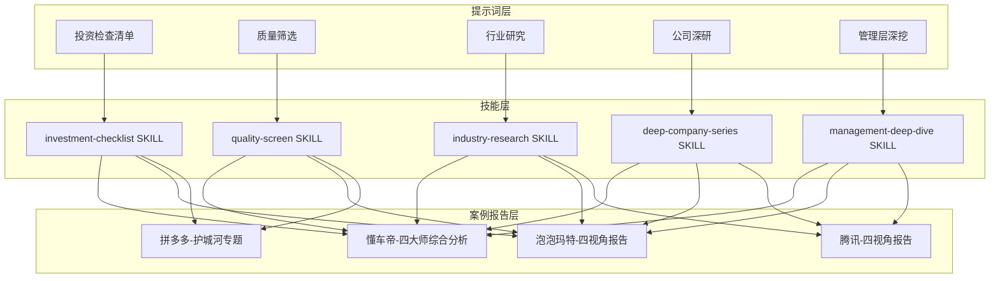
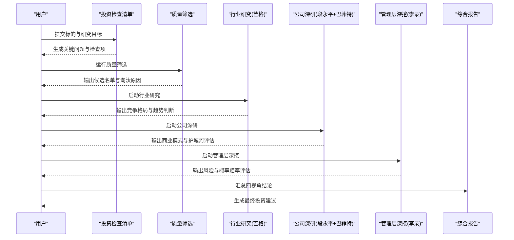
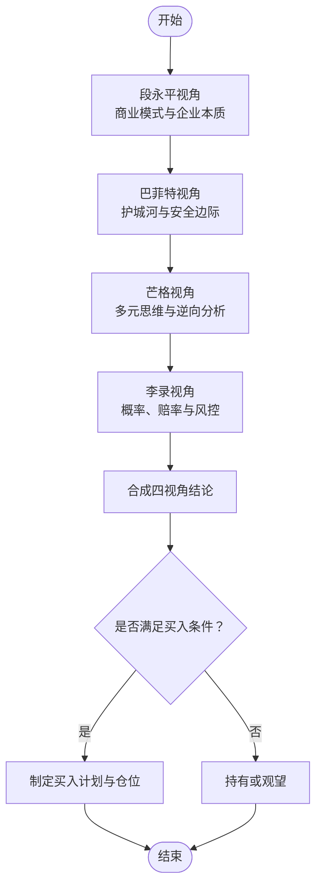
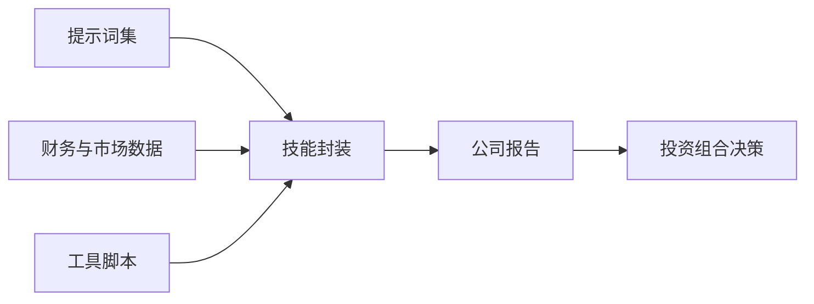

# 四大师分析法详解

<cite>
**本文引用的文件**   
- [README.md](file://README.md)
- [AGENTS.md](file://AGENTS.md)
- [CLAUDE.md](file://CLAUDE.md)
- [codex-prompts/investment-checklist.md](file://codex-prompts/investment-checklist.md)
- [codex-prompts/quality-screen.md](file://codex-prompts/quality-screen.md)
- [codex-prompts/industry-research.md](file://codex-prompts/industry-research.md)
- [codex-prompts/deep-company-series.md](file://codex-prompts/deep-company-series.md)
- [codex-prompts/management-deep-dive.md](file://codex-prompts/management-deep-dive.md)
- [codex-skills/investment-checklist/SKILL.md](file://codex-skills/investment-checklist/SKILL.md)
- [codex-skills/quality-screen/SKILL.md](file://codex-skills/quality-screen/SKILL.md)
- [codex-skills/industry-research/SKILL.md](file://codex-skills/industry-research/SKILL.md)
- [codex-skills/deep-company-series/SKILL.md](file://codex-skills/deep-company-series/SKILL.md)
- [codex-skills/management-deep-dive/SKILL.md](file://codex-skills/management-deep-dive/SKILL.md)
- [reports/拼多多/最终报告-护城河专题-20260412.md](file://reports/拼多多/最终报告-护城河专题-20260412.md)
- [reports/拼多多/段永平雪球发言-PDD相关.md](file://reports/拼多多/段永平雪球发言-PDD相关.md)
- [reports/拼多多/李录-PDD建仓时机与历史重仓研究-20260422.md](file://reports/拼多多/李录-PDD建仓时机与历史重仓研究-20260422.md)
- [reports/腾讯/02-财务估值分析-巴菲特视角.md](file://reports/腾讯/02-财务估值分析-巴菲特视角.md)
- [reports/腾讯/03-行业竞争分析-芒格视角.md](file://reports/腾讯/03-行业竞争分析-芒格视角.md)
- [reports/腾讯/04-风险管理层评估-李录视角.md](file://reports/腾讯/04-风险管理层评估-李录视角.md)
- [reports/腾讯/01-商业模式分析-段永平视角.md](file://reports/腾讯/01-商业模式分析-段永平视角.md)
- [reports/泡泡玛特/01-商业模式分析-段永平视角.md](file://reports/泡泡玛特/01-商业模式分析-段永平视角.md)
- [reports/泡泡玛特/02-财务估值分析-巴菲特视角.md](file://reports/泡泡玛特/02-财务估值分析-巴菲特视角.md)
- [reports/泡泡玛特/03-行业竞争分析-芒格视角.md](file://reports/泡泡玛特/03-行业竞争分析-芒格视角.md)
- [reports/泡泡玛特/04-风险管理层评估-李录视角.md](file://reports/泡泡玛特/04-风险管理层评估-李录视角.md)
- [reports/懂车帝/懂车帝投资研究报告-四大师综合分析-20260613.md](file://reports/懂车帝/懂车帝投资研究报告-四大师综合分析-20260613.md)
</cite>

## 目录
1. [引言](#引言)
2. [项目结构](#项目结构)
3. [核心组件](#核心组件)
4. [架构总览](#架构总览)
5. [详细组件分析](#详细组件分析)
6. [依赖关系分析](#依赖关系分析)
7. [性能与效率考量](#性能与效率考量)
8. [故障排查指南](#故障排查指南)
9. [结论](#结论)
10. [附录：模板与检查清单](#附录模板与检查清单)

## 引言
本文件系统化梳理“四大师分析法”在本仓库中的落地形态与实践路径，围绕以下四位投资大师的方法论展开：
- 巴菲特：价值投资、护城河理论、安全边际原则、能力圈概念
- 芒格：多元思维模型、逆向思维、跨学科整合、人类误判心理学在投资决策中的应用
- 段永平：商业模式分析方法（企业本质、企业文化、管理层质量）
- 李录：风险管理框架（概率思维、赔率计算、风险控制策略）

文档将结合仓库中已有的研究模板、技能脚本与案例报告，展示如何将这些方法论有机融合，形成可复用的投资决策体系，并提供可直接使用的分析与检查清单。

## 项目结构
仓库采用“提示词+技能+案例报告”的三层组织方式，支撑从筛选到深度研究的完整流程：
- codex-prompts：面向研究与写作的结构化提示词（如投资检查清单、质量筛选、行业研究、公司深研、管理层深挖等）
- codex-skills：对应提示词的自动化技能封装（SKILL.md），便于一键调用与标准化输出
- reports：按公司与主题组织的投研报告，包含多视角分析（段永平视角、巴菲特视角、芒格视角、李录视角）以及综合报告

图表来源
- [codex-prompts/investment-checklist.md](file://codex-prompts/investment-checklist.md)
- [codex-skills/investment-checklist/SKILL.md](file://codex-skills/investment-checklist/SKILL.md)
- [codex-prompts/quality-screen.md](file://codex-prompts/quality-screen.md)
- [codex-skills/quality-screen/SKILL.md](file://codex-skills/quality-screen/SKILL.md)
- [codex-prompts/industry-research.md](file://codex-prompts/industry-research.md)
- [codex-skills/industry-research/SKILL.md](file://codex-skills/industry-research/SKILL.md)
- [codex-prompts/deep-company-series.md](file://codex-prompts/deep-company-series.md)
- [codex-skills/deep-company-series/SKILL.md](file://codex-skills/deep-company-series/SKILL.md)
- [codex-prompts/management-deep-dive.md](file://codex-prompts/management-deep-dive.md)
- [codex-skills/management-deep-dive/SKILL.md](file://codex-skills/management-deep-dive/SKILL.md)
- [reports/拼多多/最终报告-护城河专题-20260412.md](file://reports/拼多多/最终报告-护城河专题-20260412.md)
- [reports/腾讯/01-商业模式分析-段永平视角.md](file://reports/腾讯/01-商业模式分析-段永平视角.md)
- [reports/腾讯/02-财务估值分析-巴菲特视角.md](file://reports/腾讯/02-财务估值分析-巴菲特视角.md)
- [reports/腾讯/03-行业竞争分析-芒格视角.md](file://reports/腾讯/03-行业竞争分析-芒格视角.md)
- [reports/腾讯/04-风险管理层评估-李录视角.md](file://reports/腾讯/04-风险管理层评估-李录视角.md)
- [reports/泡泡玛特/01-商业模式分析-段永平视角.md](file://reports/泡泡玛特/01-商业模式分析-段永平视角.md)
- [reports/泡泡玛特/02-财务估值分析-巴菲特视角.md](file://reports/泡泡玛特/02-财务估值分析-巴菲特视角.md)
- [reports/泡泡玛特/03-行业竞争分析-芒格视角.md](file://reports/泡泡玛特/03-行业竞争分析-芒格视角.md)
- [reports/泡泡玛特/04-风险管理层评估-李录视角.md](file://reports/泡泡玛特/04-风险管理层评估-李录视角.md)
- [reports/懂车帝/懂车帝投资研究报告-四大师综合分析-20260613.md](file://reports/懂车帝/懂车帝投资研究报告-四大师综合分析-20260613.md)

章节来源
- [README.md](file://README.md)
- [AGENTS.md](file://AGENTS.md)
- [CLAUDE.md](file://CLAUDE.md)

## 核心组件
- 投资检查清单：贯穿四大师方法的统一入口，确保每次研究都覆盖“商业模式—护城河—估值—风险—管理层”的关键维度
- 质量筛选：基于财务与商业质量的初筛，为后续深度研究提供候选池
- 行业研究：运用芒格的多元思维模型进行产业格局与竞争态势分析
- 公司深研：以段永平的商业模式视角切入，结合巴菲特的安全边际与能力圈约束
- 管理层深挖：聚焦企业文化与管理层质量，并引入李录的风险控制与概率思维

章节来源
- [codex-prompts/investment-checklist.md](file://codex-prompts/investment-checklist.md)
- [codex-skills/investment-checklist/SKILL.md](file://codex-skills/investment-checklist/SKILL.md)
- [codex-prompts/quality-screen.md](file://codex-prompts/quality-screen.md)
- [codex-skills/quality-screen/SKILL.md](file://codex-skills/quality-screen/SKILL.md)
- [codex-prompts/industry-research.md](file://codex-prompts/industry-research.md)
- [codex-skills/industry-research/SKILL.md](file://codex-skills/industry-research/SKILL.md)
- [codex-prompts/deep-company-series.md](file://codex-prompts/deep-company-series.md)
- [codex-skills/deep-company-series/SKILL.md](file://codex-skills/deep-company-series/SKILL.md)
- [codex-prompts/management-deep-dive.md](file://codex-prompts/management-deep-dive.md)
- [codex-skills/management-deep-dive/SKILL.md](file://codex-skills/management-deep-dive/SKILL.md)

## 架构总览
四大师分析法在本仓库中的执行流程如下：
- 输入：标的名称或行业范围
- 步骤一：使用“投资检查清单”明确研究目标与关键问题
- 步骤二：通过“质量筛选”快速剔除不符合基本质量标准的标的
- 步骤三：开展“行业研究”，应用芒格多元思维模型识别结构性机会与陷阱
- 步骤四：进入“公司深研”，以段永平视角审视商业模式与企业本质，并用巴菲特视角评估护城河与安全边际
- 步骤五：进行“管理层深挖”，结合李录的概率与赔率思维，完成风险评估与仓位决策
- 输出：四视角报告与综合报告，形成可执行的买入/持有/卖出建议

图表来源
- [codex-prompts/investment-checklist.md](file://codex-prompts/investment-checklist.md)
- [codex-skills/investment-checklist/SKILL.md](file://codex-skills/investment-checklist/SKILL.md)
- [codex-prompts/quality-screen.md](file://codex-prompts/quality-screen.md)
- [codex-skills/quality-screen/SKILL.md](file://codex-skills/quality-screen/SKILL.md)
- [codex-prompts/industry-research.md](file://codex-prompts/industry-research.md)
- [codex-skills/industry-research/SKILL.md](file://codex-skills/industry-research/SKILL.md)
- [codex-prompts/deep-company-series.md](file://codex-prompts/deep-company-series.md)
- [codex-skills/deep-company-series/SKILL.md](file://codex-skills/deep-company-series/SKILL.md)
- [codex-prompts/management-deep-dive.md](file://codex-prompts/management-deep-dive.md)
- [codex-skills/management-deep-dive/SKILL.md](file://codex-skills/management-deep-dive/SKILL.md)

## 详细组件分析

### 巴菲特视角：护城河、安全边际与能力圈
- 护城河理论：关注品牌、网络效应、转换成本、规模优势与无形资产等可持续竞争优势的来源与强度
- 安全边际原则：在估值层面强调价格低于内在价值的足够折扣，降低误判与黑天鹅冲击的影响
- 能力圈概念：坚持在自己能理解的行业与公司范围内做决策，避免认知盲区导致的错误定价

实践要点
- 用“护城河专题”类报告验证竞争优势的持久性与可量化指标
- 用“财务估值分析-巴菲特视角”模板进行折现现金流与相对估值交叉验证
- 以“能力圈”为边界，优先选择业务模式清晰、现金流稳定、治理透明的公司

章节来源
- [reports/拼多多/最终报告-护城河专题-20260412.md](file://reports/拼多多/最终报告-护城河专题-20260412.md)
- [reports/腾讯/02-财务估值分析-巴菲特视角.md](file://reports/腾讯/02-财务估值分析-巴菲特视角.md)
- [reports/泡泡玛特/02-财务估值分析-巴菲特视角.md](file://reports/泡泡玛特/02-财务估值分析-巴菲特视角.md)

### 芒格视角：多元思维模型、逆向思维与人类误判心理学
- 多元思维模型：用物理学、生物学、经济学、心理学等多学科视角理解复杂系统
- 逆向思维：先思考“什么会失败”，再反向构建成功条件，避免确认偏误
- 人类误判心理学：识别常见认知偏差（锚定、损失厌恶、从众等），在估值与交易时点选择上保持纪律

实践要点
- 在“行业研究”中引入竞争博弈、供需弹性、技术替代等模型
- 在“公司深研”中设置反面证据清单，主动寻找证伪信息
- 在“管理层深挖”中评估激励相容与文化健康度，防范代理问题

章节来源
- [codex-prompts/industry-research.md](file://codex-prompts/industry-research.md)
- [codex-skills/industry-research/SKILL.md](file://codex-skills/industry-research/SKILL.md)
- [reports/腾讯/03-行业竞争分析-芒格视角.md](file://reports/腾讯/03-行业竞争分析-芒格视角.md)
- [reports/泡泡玛特/03-行业竞争分析-芒格视角.md](file://reports/泡泡玛特/03-行业竞争分析-芒格视角.md)

### 段永平视角：商业模式、企业文化与管理层质量
- 企业本质：聚焦“赚钱的方式是否简单、可重复、可扩展”，重视自由现金流与资本回报率
- 企业文化：观察长期主义、客户导向、诚信与透明，文化是护城河的深层根基
- 管理层质量：评估战略定力、资源配置能力、股东回报意识与危机应对

实践要点
- 使用“商业模式分析-段永平视角”模板，拆解收入结构、成本结构与增长驱动
- 通过公开言论与行为一致性检验管理层承诺的可信度
- 将“企业文化”纳入尽职调查，关注员工满意度、流失率与内部治理机制

章节来源
- [codex-prompts/deep-company-series.md](file://codex-prompts/deep-company-series.md)
- [codex-skills/deep-company-series/SKILL.md](file://codex-skills/deep-company-series/SKILL.md)
- [codex-prompts/management-deep-dive.md](file://codex-prompts/management-deep-dive.md)
- [codex-skills/management-deep-dive/SKILL.md](file://codex-skills/management-deep-dive/SKILL.md)
- [reports/腾讯/01-商业模式分析-段永平视角.md](file://reports/腾讯/01-商业模式分析-段永平视角.md)
- [reports/泡泡玛特/01-商业模式分析-段永平视角.md](file://reports/泡泡玛特/01-商业模式分析-段永平视角.md)
- [reports/拼多多/段永平雪球发言-PDD相关.md](file://reports/拼多多/段永平雪球发言-PDD相关.md)

### 李录视角：概率思维、赔率计算与风险控制
- 概率思维：对关键假设赋予概率分布，区分高确定性事件与尾部风险
- 赔率计算：在胜率与赔率之间权衡，追求正期望值的组合配置
- 风险控制：通过分散、对冲、仓位管理与止损规则限制下行风险

实践要点
- 在“风险管理层评估-李录视角”报告中建立情景分析与压力测试
- 使用凯利公式或类似方法优化仓位，避免过度集中或过度保守
- 将“尾部风险”纳入估值调整，提高安全边际要求

章节来源
- [codex-prompts/management-deep-dive.md](file://codex-prompts/management-deep-dive.md)
- [codex-skills/management-deep-dive/SKILL.md](file://codex-skills/management-deep-dive/SKILL.md)
- [reports/腾讯/04-风险管理层评估-李录视角.md](file://reports/腾讯/04-风险管理层评估-李录视角.md)
- [reports/泡泡玛特/04-风险管理层评估-李录视角.md](file://reports/泡泡玛特/04-风险管理层评估-李录视角.md)
- [reports/拼多多/李录-PDD建仓时机与历史重仓研究-20260422.md](file://reports/拼多多/李录-PDD建仓时机与历史重仓研究-20260422.md)

### 四大师综合分析：以“懂车帝”为例
- 目标：将四种方法论整合为统一的决策流程，输出可执行的买卖建议
- 方法：先用段永平视角审视商业模式，再用巴菲特视角评估护城河与安全边际，随后用芒格视角进行行业竞争与反事实推演，最后用李录视角完成风险与仓位管理
- 产出：四视角子报告与一份综合报告，明确关键假设、触发条件与退出策略

图表来源
- [reports/懂车帝/懂车帝投资研究报告-四大师综合分析-20260613.md](file://reports/懂车帝/懂车帝投资研究报告-四大师综合分析-20260613.md)

章节来源
- [reports/懂车帝/懂车帝投资研究报告-四大师综合分析-20260613.md](file://reports/懂车帝/懂车帝投资研究报告-四大师综合分析-20260613.md)

## 依赖关系分析
- 提示词与技能的耦合：每个SKILL.md与其对应的prompts保持一致的结构化输出要求，保证研究过程的可重复性
- 报告模板的复用：不同公司的四视角报告遵循相同模板，便于横向对比与聚合分析
- 外部数据与工具：财务数据、晨星公允价值、行情数据等作为输入，驱动筛选与估值模块

图表来源
- [codex-prompts/investment-checklist.md](file://codex-prompts/investment-checklist.md)
- [codex-skills/investment-checklist/SKILL.md](file://codex-skills/investment-checklist/SKILL.md)
- [codex-prompts/quality-screen.md](file://codex-prompts/quality-screen.md)
- [codex-skills/quality-screen/SKILL.md](file://codex-skills/quality-screen/SKILL.md)
- [codex-prompts/industry-research.md](file://codex-prompts/industry-research.md)
- [codex-skills/industry-research/SKILL.md](file://codex-skills/industry-research/SKILL.md)
- [codex-prompts/deep-company-series.md](file://codex-prompts/deep-company-series.md)
- [codex-skills/deep-company-series/SKILL.md](file://codex-skills/deep-company-series/SKILL.md)
- [codex-prompts/management-deep-dive.md](file://codex-prompts/management-deep-dive.md)
- [codex-skills/management-deep-dive/SKILL.md](file://codex-skills/management-deep-dive/SKILL.md)

## 性能与效率考量
- 标准化模板减少重复劳动，提升研究一致性与可比性
- 分阶段推进（筛选→行业→公司→管理层）避免过早深入导致的时间浪费
- 使用反面证据与压力测试提前暴露潜在问题，降低后期纠错成本

[本节为通用指导，不直接分析具体文件]

## 故障排查指南
- 若“质量筛选”结果过少：检查财务指标阈值是否过于严格，适当放宽或增加替代指标
- 若“行业研究”结论模糊：补充竞争对手财报、第三方研报与一线调研，增强证据链
- 若“管理层深挖”难以评估：扩大信息来源（年报、电话会、媒体访谈、员工评价），关注言行一致性
- 若“风险管理”无法量化：采用区间估计与情景分析，明确关键假设与触发条件

[本节为通用指导，不直接分析具体文件]

## 结论
通过将巴菲特的价值投资理念、芒格的多元思维模型、段永平的商业模式方法与李录的风险管理框架有机结合，并在仓库中以“提示词+技能+报告”的形式固化，投资者可以形成一套系统化、可复制的投资决策体系。关键在于：
- 坚持能力圈与安全边际
- 用多元思维与逆向分析对抗认知偏差
- 以企业本质与文化为核心，评估管理层质量
- 以概率与赔率为依据，做好风险控制与仓位管理

[本节为总结性内容，不直接分析具体文件]

## 附录：模板与检查清单
- 投资检查清单（四大师统一入口）
  - 关键问题定义、研究范围、数据来源、输出格式
  - 参考路径：[codex-prompts/investment-checklist.md](file://codex-prompts/investment-checklist.md)、[codex-skills/investment-checklist/SKILL.md](file://codex-skills/investment-checklist/SKILL.md)
- 质量筛选（初筛）
  - 财务质量指标、盈利稳定性、现金流健康度、估值合理性
  - 参考路径：[codex-prompts/quality-screen.md](file://codex-prompts/quality-screen.md)、[codex-skills/quality-screen/SKILL.md](file://codex-skills/quality-screen/SKILL.md)
- 行业研究（芒格视角）
  - 竞争格局、供需弹性、技术替代、政策与监管
  - 参考路径：[codex-prompts/industry-research.md](file://codex-prompts/industry-research.md)、[codex-skills/industry-research/SKILL.md](file://codex-skills/industry-research/SKILL.md)
- 公司深研（段永平+巴菲特视角）
  - 商业模式拆解、护城河验证、安全边际测算
  - 参考路径：[codex-prompts/deep-company-series.md](file://codex-prompts/deep-company-series.md)、[codex-skills/deep-company-series/SKILL.md](file://codex-skills/deep-company-series/SKILL.md)
- 管理层深挖（李录视角）
  - 企业文化、治理结构、激励相容、风险与概率评估
  - 参考路径：[codex-prompts/management-deep-dive.md](file://codex-prompts/management-deep-dive.md)、[codex-skills/management-deep-dive/SKILL.md](file://codex-skills/management-deep-dive/SKILL.md)

章节来源
- [codex-prompts/investment-checklist.md](file://codex-prompts/investment-checklist.md)
- [codex-skills/investment-checklist/SKILL.md](file://codex-skills/investment-checklist/SKILL.md)
- [codex-prompts/quality-screen.md](file://codex-prompts/quality-screen.md)
- [codex-skills/quality-screen/SKILL.md](file://codex-skills/quality-screen/SKILL.md)
- [codex-prompts/industry-research.md](file://codex-prompts/industry-research.md)
- [codex-skills/industry-research/SKILL.md](file://codex-skills/industry-research/SKILL.md)
- [codex-prompts/deep-company-series.md](file://codex-prompts/deep-company-series.md)
- [codex-skills/deep-company-series/SKILL.md](file://codex-skills/deep-company-series/SKILL.md)
- [codex-prompts/management-deep-dive.md](file://codex-prompts/management-deep-dive.md)
- [codex-skills/management-deep-dive/SKILL.md](file://codex-skills/management-deep-dive/SKILL.md)