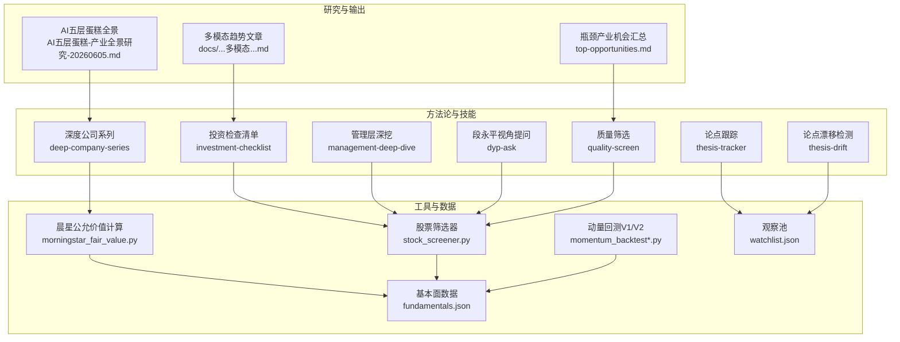
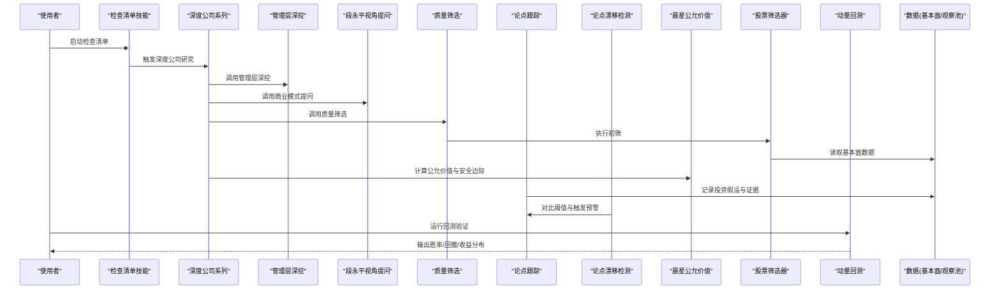
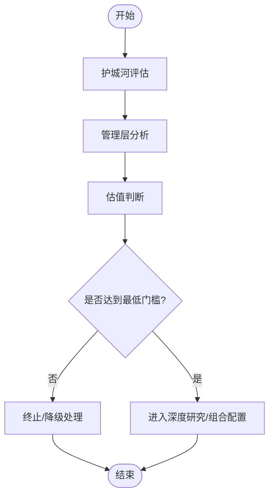
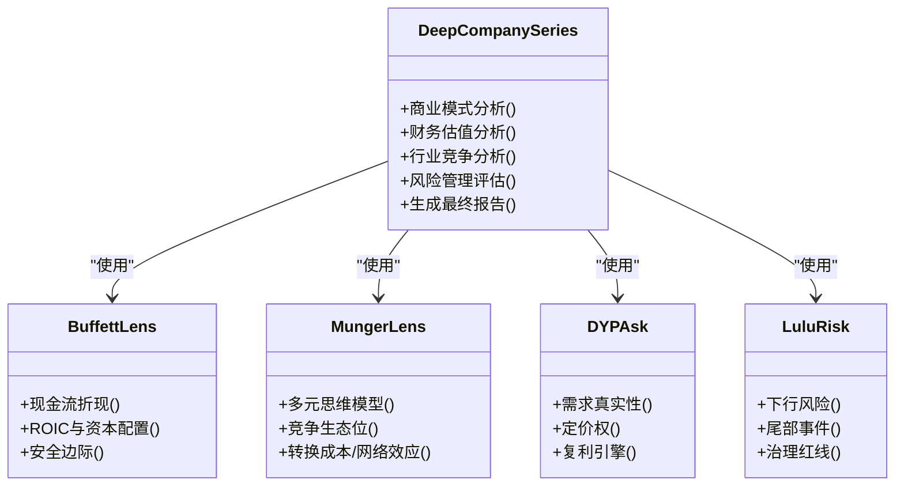
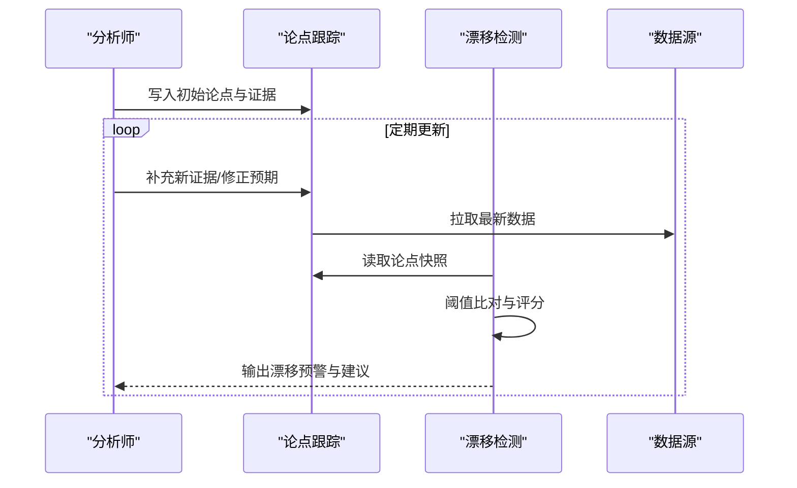
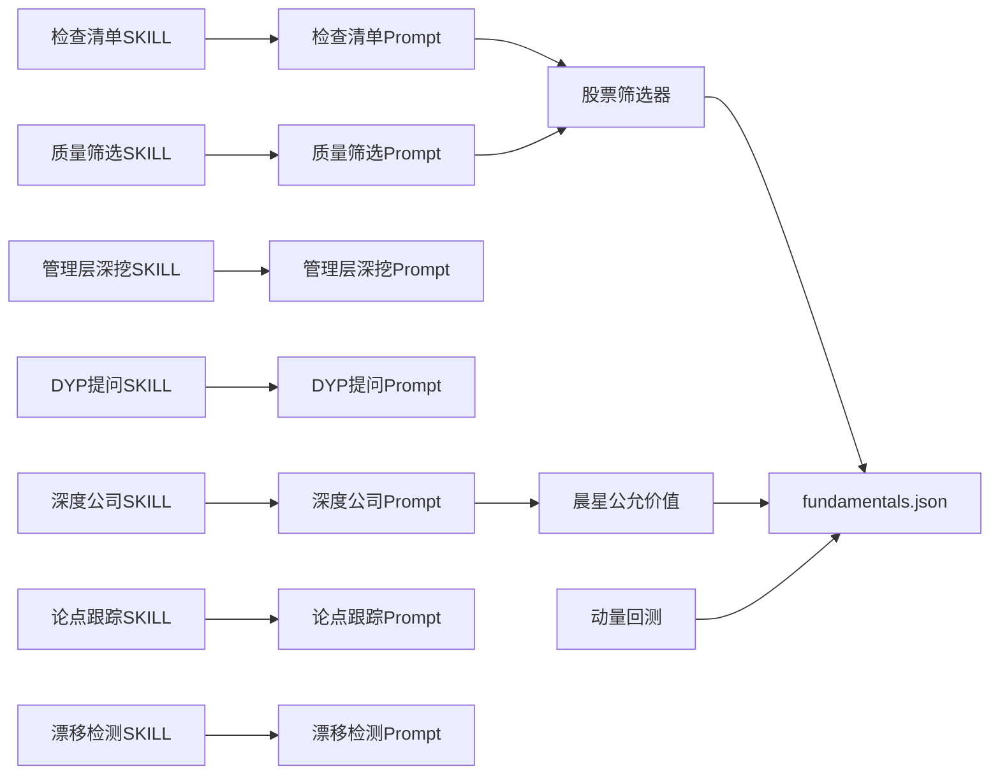

# 投资方法论

<cite>
**本文引用的文件**   
- [codex-prompts/investment-checklist.md](file://codex-prompts/investment-checklist.md)
- [codex-skills/investment-checklist/SKILL.md](file://codex-skills/investment-checklist/SKILL.md)
- [codex-prompts/thesis-tracker.md](file://codex-prompts/thesis-tracker.md)
- [codex-skills/thesis-tracker/SKILL.md](file://codex-skills/thesis-tracker/SKILL.md)
- [codex-prompts/thesis-drift.md](file://codex-prompts/thesis-drift.md)
- [codex-skills/thesis-drift/SKILL.md](file://codex-skills/thesis-drift/SKILL.md)
- [codex-prompts/dyp-ask.md](file://codex-prompts/dyp-ask.md)
- [codex-skills/dyp-ask/SKILL.md](file://codex-skills/dyp-ask/SKILL.md)
- [codex-prompts/deep-company-series.md](file://codex-prompts/deep-company-series.md)
- [codex-skills/deep-company-series/SKILL.md](file://codex-skills/deep-company-series/SKILL.md)
- [codex-prompts/management-deep-dive.md](file://codex-prompts/management-deep-dive.md)
- [codex-skills/management-deep-dive/SKILL.md](file://codex-skills/management-deep-dive/SKILL.md)
- [codex-prompts/quality-screen.md](file://codex-prompts/quality-screen.md)
- [codex-skills/quality-screen/SKILL.md](file://codex-skills/quality-screen/SKILL.md)
- [tools/morningstar_fair_value.py](file://tools/morningstar_fair_value.py)
- [tools/stock_screener.py](file://tools/stock_screener.py)
- [tools/momentum_backtest.py](file://tools/momentum_backtest.py)
- [tools/momentum_backtest_v2.py](file://tools/momentum_backtest_v2.py)
- [data/fundamentals.json](file://data/fundamentals.json)
- [data/watchlist.json](file://data/watchlist.json)
- [reports/bottleneck-map/top-opportunities.md](file://reports/bottleneck-map/top-opportunities.md)
- [docs/大模型的下一战：多模态是必然还是过热的叙事.md](file://docs/大模型的下一战：多模态是必然还是过热的叙事.md)
</cite>

## 目录
1. [引言](#引言)
2. [项目结构](#项目结构)
3. [核心组件](#核心组件)
4. [架构总览](#架构总览)
5. [详细组件分析](#详细组件分析)
6. [依赖关系分析](#依赖关系分析)
7. [性能与可扩展性](#性能与可扩展性)
8. [故障排查指南](#故障排查指南)
9. [结论](#结论)
10. [附录](#附录)

## 引言
本文件围绕“四大师分析法”的投资方法论，结合仓库中的技能、提示词与工具链，系统化阐述价值投资、多元思维模型、商业模式分析与风险管理框架的实践路径。文档同时覆盖投资检查清单的设计原理与使用方法、投资论点跟踪与漂移检测流程，并探讨多模态分析在投资决策中的应用前景。为便于落地，文中提供大量实战案例定位与量化验证方法指引，帮助读者建立可复用的投资决策框架。

## 项目结构
该仓库以“研究产出 + 技能/提示词 + 工具脚本 + 数据资产”的模块化组织方式呈现：
- codex-prompts 与 codex-skills：定义投研工作流（如检查清单、深度公司系列、管理层深挖、质量筛选、论点跟踪与漂移检测等）
- tools：提供选股、估值、回测等工程化能力
- data：存放基础财务数据、晨星公允价值、观察池等
- reports：沉淀行业与公司级研究报告，包含AI产业链、瓶颈产业扫描、个股深度报告等
- docs：方法论与趋势文章

图表来源
- [codex-skills/investment-checklist/SKILL.md](file://codex-skills/investment-checklist/SKILL.md)
- [codex-skills/deep-company-series/SKILL.md](file://codex-skills/deep-company-series/SKILL.md)
- [codex-skills/management-deep-dive/SKILL.md](file://codex-skills/management-deep-dive/SKILL.md)
- [codex-skills/dyp-ask/SKILL.md](file://codex-skills/dyp-ask/SKILL.md)
- [codex-skills/quality-screen/SKILL.md](file://codex-skills/quality-screen/SKILL.md)
- [codex-skills/thesis-tracker/SKILL.md](file://codex-skills/thesis-tracker/SKILL.md)
- [codex-skills/thesis-drift/SKILL.md](file://codex-skills/thesis-drift/SKILL.md)
- [tools/morningstar_fair_value.py](file://tools/morningstar_fair_value.py)
- [tools/stock_screener.py](file://tools/stock_screener.py)
- [tools/momentum_backtest.py](file://tools/momentum_backtest.py)
- [tools/momentum_backtest_v2.py](file://tools/momentum_backtest_v2.py)
- [data/fundamentals.json](file://data/fundamentals.json)
- [data/watchlist.json](file://data/watchlist.json)
- [reports/bottleneck-map/top-opportunities.md](file://reports/bottleneck-map/top-opportunities.md)
- [docs/大模型的下一战：多模态是必然还是过热的叙事.md](file://docs/大模型的下一战：多模态是必然还是过热的叙事.md)

章节来源
- [codex-skills/investment-checklist/SKILL.md](file://codex-skills/investment-checklist/SKILL.md)
- [codex-skills/deep-company-series/SKILL.md](file://codex-skills/deep-company-series/SKILL.md)
- [codex-skills/management-deep-dive/SKILL.md](file://codex-skills/management-deep-dive/SKILL.md)
- [codex-skills/dyp-ask/SKILL.md](file://codex-skills/dyp-ask/SKILL.md)
- [codex-skills/quality-screen/SKILL.md](file://codex-skills/quality-screen/SKILL.md)
- [codex-skills/thesis-tracker/SKILL.md](file://codex-skills/thesis-tracker/SKILL.md)
- [codex-skills/thesis-drift/SKILL.md](file://codex-skills/thesis-drift/SKILL.md)
- [tools/morningstar_fair_value.py](file://tools/morningstar_fair_value.py)
- [tools/stock_screener.py](file://tools/stock_screener.py)
- [tools/momentum_backtest.py](file://tools/momentum_backtest.py)
- [tools/momentum_backtest_v2.py](file://tools/momentum_backtest_v2.py)
- [data/fundamentals.json](file://data/fundamentals.json)
- [data/watchlist.json](file://data/watchlist.json)
- [reports/bottleneck-map/top-opportunities.md](file://reports/bottleneck-map/top-opportunities.md)
- [docs/大模型的下一战：多模态是必然还是过热的叙事.md](file://docs/大模型的下一战：多模态是必然还是过热的叙事.md)

## 核心组件
- 投资检查清单：将护城河评估、管理层分析、估值判断等关键要素结构化，形成可重复执行的决策门槛与风控闸门。
- 深度公司系列：从商业模式、竞争格局、财务质量到风险治理的全景式拆解，支撑四大师视角的综合研判。
- 管理层深挖：聚焦公司治理、激励约束、资本配置与股东回报行为，识别长期价值创造的关键驱动。
- 段永平视角提问：以“生意本质+用户价值+定价权”为核心，快速穿透复杂商业叙事，锁定可持续现金流来源。
- 质量筛选：基于财务与经营指标构建初筛漏斗，提高研究效率与命中率。
- 论点跟踪与漂移检测：对投资假设进行时间序列记录与阈值监控，避免认知惰性导致的策略漂移。
- 估值与回测工具：以晨星公允价值、历史回测与动量信号辅助验证安全边际与胜率。

章节来源
- [codex-prompts/investment-checklist.md](file://codex-prompts/investment-checklist.md)
- [codex-skills/investment-checklist/SKILL.md](file://codex-skills/investment-checklist/SKILL.md)
- [codex-prompts/deep-company-series.md](file://codex-prompts/deep-company-series.md)
- [codex-skills/deep-company-series/SKILL.md](file://codex-skills/deep-company-series/SKILL.md)
- [codex-prompts/management-deep-dive.md](file://codex-prompts/management-deep-dive.md)
- [codex-skills/management-deep-dive/SKILL.md](file://codex-skills/management-deep-dive/SKILL.md)
- [codex-prompts/dyp-ask.md](file://codex-prompts/dyp-ask.md)
- [codex-skills/dyp-ask/SKILL.md](file://codex-skills/dyp-ask/SKILL.md)
- [codex-prompts/quality-screen.md](file://codex-prompts/quality-screen.md)
- [codex-skills/quality-screen/SKILL.md](file://codex-skills/quality-screen/SKILL.md)
- [codex-prompts/thesis-tracker.md](file://codex-prompts/thesis-tracker.md)
- [codex-skills/thesis-tracker/SKILL.md](file://codex-skills/thesis-tracker/SKILL.md)
- [codex-prompts/thesis-drift.md](file://codex-prompts/thesis-drift.md)
- [codex-skills/thesis-drift/SKILL.md](file://codex-skills/thesis-drift/SKILL.md)
- [tools/morningstar_fair_value.py](file://tools/morningstar_fair_value.py)
- [tools/stock_screener.py](file://tools/stock_screener.py)
- [tools/momentum_backtest.py](file://tools/momentum_backtest.py)
- [tools/momentum_backtest_v2.py](file://tools/momentum_backtest_v2.py)

## 架构总览
四大师分析法在本仓库中通过“技能+提示词+工具+数据”的组合实现闭环：
- 巴菲特价值投资：强调安全边际与现金流折现，借助晨星公允价值与财务质量筛选进行量化校验。
- 芒格多元思维模型：以跨学科视角审视竞争格局、网络效应、转换成本与规模经济，体现在深度公司系列与行业研究中。
- 段永平商业模式分析：聚焦“好生意”三问（需求是否真实、能否持续、是否有定价权），由dyp-ask技能引导结构化思考。
- 李录风险管理框架：重视下行风险、尾部事件与治理缺陷，通过管理层深挖与论点漂移检测降低误判概率。

图表来源
- [codex-skills/investment-checklist/SKILL.md](file://codex-skills/investment-checklist/SKILL.md)
- [codex-skills/deep-company-series/SKILL.md](file://codex-skills/deep-company-series/SKILL.md)
- [codex-skills/management-deep-dive/SKILL.md](file://codex-skills/management-deep-dive/SKILL.md)
- [codex-skills/dyp-ask/SKILL.md](file://codex-skills/dyp-ask/SKILL.md)
- [codex-skills/quality-screen/SKILL.md](file://codex-skills/quality-screen/SKILL.md)
- [codex-skills/thesis-tracker/SKILL.md](file://codex-skills/thesis-tracker/SKILL.md)
- [codex-skills/thesis-drift/SKILL.md](file://codex-skills/thesis-drift/SKILL.md)
- [tools/morningstar_fair_value.py](file://tools/morningstar_fair_value.py)
- [tools/stock_screener.py](file://tools/stock_screener.py)
- [tools/momentum_backtest.py](file://tools/momentum_backtest.py)
- [tools/momentum_backtest_v2.py](file://tools/momentum_backtest_v2.py)
- [data/fundamentals.json](file://data/fundamentals.json)
- [data/watchlist.json](file://data/watchlist.json)

## 详细组件分析

### 投资检查清单（护城河/管理层/估值）
- 设计原理
  - 将定性洞察转化为可核查条目，避免“印象式投资”。
  - 分层设置“必须满足”和“加分项”，兼顾确定性与弹性。
- 关键要素
  - 护城河评估：品牌、网络效应、转换成本、规模经济、监管许可等。
  - 管理层分析：诚信度、资本配置记录、激励约束一致性、股东回报实践。
  - 估值判断：安全边际、盈利质量、现金流稳定性、周期位置。
- 使用方法
  - 逐项打分与证据归档；未达标项需给出缓解措施或放弃理由。
  - 与质量筛选联动，先过滤低质量标的再进入深度研究。

图表来源
- [codex-prompts/investment-checklist.md](file://codex-prompts/investment-checklist.md)
- [codex-skills/investment-checklist/SKILL.md](file://codex-skills/investment-checklist/SKILL.md)

章节来源
- [codex-prompts/investment-checklist.md](file://codex-prompts/investment-checklist.md)
- [codex-skills/investment-checklist/SKILL.md](file://codex-skills/investment-checklist/SKILL.md)

### 深度公司系列（四大师综合）
- 目标：用统一模板完成商业模式、竞争格局、财务质量与风险治理的系统性分析。
- 四大师映射
  - 巴菲特：关注自由现金流、ROIC、会计稳健性与安全边际。
  - 芒格：运用多学科思维审视结构性优势与生态位。
  - 段永平：以“好生意”三问检验需求真实性与定价权。
  - 李录：强调下行保护、尾部风险与治理红线。
- 产出物：标准化研究报告与子报告（如商业模式、财务估值、行业竞争、风险管理）。

图表来源
- [codex-prompts/deep-company-series.md](file://codex-prompts/deep-company-series.md)
- [codex-skills/deep-company-series/SKILL.md](file://codex-skills/deep-company-series/SKILL.md)
- [codex-prompts/management-deep-dive.md](file://codex-prompts/management-deep-dive.md)
- [codex-skills/management-deep-dive/SKILL.md](file://codex-skills/management-deep-dive/SKILL.md)
- [codex-prompts/dyp-ask.md](file://codex-prompts/dyp-ask.md)
- [codex-skills/dyp-ask/SKILL.md](file://codex-skills/dyp-ask/SKILL.md)

章节来源
- [codex-prompts/deep-company-series.md](file://codex-prompts/deep-company-series.md)
- [codex-skills/deep-company-series/SKILL.md](file://codex-skills/deep-company-series/SKILL.md)
- [codex-prompts/management-deep-dive.md](file://codex-prompts/management-deep-dive.md)
- [codex-skills/management-deep-dive/SKILL.md](file://codex-skills/management-deep-dive/SKILL.md)
- [codex-prompts/dyp-ask.md](file://codex-prompts/dyp-ask.md)
- [codex-skills/dyp-ask/SKILL.md](file://codex-skills/dyp-ask/SKILL.md)

### 管理层深挖（治理与资本配置）
- 重点维度
  - 股权结构与控制人动机
  - 高管薪酬与长期业绩挂钩程度
  - 并购与回购/分红的纪律性
  - 信息披露透明度与审计质量
- 与检查清单联动：作为“管理层分析”模块的数据源与证据库。

章节来源
- [codex-prompts/management-deep-dive.md](file://codex-prompts/management-deep-dive.md)
- [codex-skills/management-deep-dive/SKILL.md](file://codex-skills/management-deep-dive/SKILL.md)

### 段永平视角提问（商业模式分析）
- 核心问题
  - 客户为什么持续付费？
  - 产品/服务是否具备不可替代性？
  - 企业能否在不牺牲质量的前提下提价？
- 应用方式：在深度公司系列的“商业模式分析”阶段优先回答上述问题，形成“好生意”判定。

章节来源
- [codex-prompts/dyp-ask.md](file://codex-prompts/dyp-ask.md)
- [codex-skills/dyp-ask/SKILL.md](file://codex-skills/dyp-ask/SKILL.md)

### 质量筛选（初筛漏斗）
- 指标方向：盈利能力、增长质量、杠杆与流动性、营运效率、估值相对水平。
- 与工具集成：通过股票筛选器批量处理，结合基本面数据快速收敛候选池。

章节来源
- [codex-prompts/quality-screen.md](file://codex-prompts/quality-screen.md)
- [codex-skills/quality-screen/SKILL.md](file://codex-skills/quality-screen/SKILL.md)
- [tools/stock_screener.py](file://tools/stock_screener.py)
- [data/fundamentals.json](file://data/fundamentals.json)

### 投资论点跟踪与漂移检测
- 论点跟踪
  - 记录初始假设、关键证据、触发条件与退出标准。
  - 定期更新事实与预期，形成时间序列证据链。
- 漂移检测
  - 设定阈值（如基本面恶化、竞争格局变化、治理风险暴露）。
  - 当实际偏离超过阈值时触发复盘与调仓建议。

图表来源
- [codex-prompts/thesis-tracker.md](file://codex-prompts/thesis-tracker.md)
- [codex-skills/thesis-tracker/SKILL.md](file://codex-skills/thesis-tracker/SKILL.md)
- [codex-prompts/thesis-drift.md](file://codex-prompts/thesis-drift.md)
- [codex-skills/thesis-drift/SKILL.md](file://codex-skills/thesis-drift/SKILL.md)
- [data/watchlist.json](file://data/watchlist.json)

章节来源
- [codex-prompts/thesis-tracker.md](file://codex-prompts/thesis-tracker.md)
- [codex-skills/thesis-tracker/SKILL.md](file://codex-skills/thesis-tracker/SKILL.md)
- [codex-prompts/thesis-drift.md](file://codex-prompts/thesis-drift.md)
- [codex-skills/thesis-drift/SKILL.md](file://codex-skills/thesis-drift/SKILL.md)
- [data/watchlist.json](file://data/watchlist.json)

### 估值与回测（安全边际与胜率验证）
- 公允价值与安全边际
  - 利用晨星公允价值工具进行独立估值锚定，结合DCF/相对估值交叉验证。
- 回测与动量
  - 通过动量回测脚本验证策略在不同市场环境的胜率、回撤与收益分布，辅助仓位与择时。

章节来源
- [tools/morningstar_fair_value.py](file://tools/morningstar_fair_value.py)
- [tools/momentum_backtest.py](file://tools/momentum_backtest.py)
- [tools/momentum_backtest_v2.py](file://tools/momentum_backtest_v2.py)
- [data/fundamentals.json](file://data/fundamentals.json)

## 依赖关系分析
- 技能与提示词
  - 各SKILL.md定义了输入/输出契约与执行步骤，确保方法论可复用与可编排。
- 工具与数据
  - stock_screener.py与fundamentals.json构成初筛链路；morningstar_fair_value.py与fundamentals.json构成估值链路；回测脚本依赖历史行情与基本面数据。
- 研究产出
  - bottleneck-map与AI产业链报告体现方法论在热点赛道的落地，可作为高质量样本用于训练与校准。

图表来源
- [codex-skills/investment-checklist/SKILL.md](file://codex-skills/investment-checklist/SKILL.md)
- [codex-skills/deep-company-series/SKILL.md](file://codex-skills/deep-company-series/SKILL.md)
- [codex-skills/management-deep-dive/SKILL.md](file://codex-skills/management-deep-dive/SKILL.md)
- [codex-skills/dyp-ask/SKILL.md](file://codex-skills/dyp-ask/SKILL.md)
- [codex-skills/quality-screen/SKILL.md](file://codex-skills/quality-screen/SKILL.md)
- [codex-skills/thesis-tracker/SKILL.md](file://codex-skills/thesis-tracker/SKILL.md)
- [codex-skills/thesis-drift/SKILL.md](file://codex-skills/thesis-drift/SKILL.md)
- [codex-prompts/investment-checklist.md](file://codex-prompts/investment-checklist.md)
- [codex-prompts/deep-company-series.md](file://codex-prompts/deep-company-series.md)
- [codex-prompts/management-deep-dive.md](file://codex-prompts/management-deep-dive.md)
- [codex-prompts/dyp-ask.md](file://codex-prompts/dyp-ask.md)
- [codex-prompts/quality-screen.md](file://codex-prompts/quality-screen.md)
- [codex-prompts/thesis-tracker.md](file://codex-prompts/thesis-tracker.md)
- [codex-prompts/thesis-drift.md](file://codex-prompts/thesis-drift.md)
- [tools/stock_screener.py](file://tools/stock_screener.py)
- [tools/morningstar_fair_value.py](file://tools/morningstar_fair_value.py)
- [tools/momentum_backtest.py](file://tools/momentum_backtest.py)
- [tools/momentum_backtest_v2.py](file://tools/momentum_backtest_v2.py)
- [data/fundamentals.json](file://data/fundamentals.json)

章节来源
- [codex-skills/investment-checklist/SKILL.md](file://codex-skills/investment-checklist/SKILL.md)
- [codex-skills/deep-company-series/SKILL.md](file://codex-skills/deep-company-series/SKILL.md)
- [codex-skills/management-deep-dive/SKILL.md](file://codex-skills/management-deep-dive/SKILL.md)
- [codex-skills/dyp-ask/SKILL.md](file://codex-skills/dyp-ask/SKILL.md)
- [codex-skills/quality-screen/SKILL.md](file://codex-skills/quality-screen/SKILL.md)
- [codex-skills/thesis-tracker/SKILL.md](file://codex-skills/thesis-tracker/SKILL.md)
- [codex-skills/thesis-drift/SKILL.md](file://codex-skills/thesis-drift/SKILL.md)
- [codex-prompts/investment-checklist.md](file://codex-prompts/investment-checklist.md)
- [codex-prompts/deep-company-series.md](file://codex-prompts/deep-company-series.md)
- [codex-prompts/management-deep-dive.md](file://codex-prompts/management-deep-dive.md)
- [codex-prompts/dyp-ask.md](file://codex-prompts/dyp-ask.md)
- [codex-prompts/quality-screen.md](file://codex-prompts/quality-screen.md)
- [codex-prompts/thesis-tracker.md](file://codex-prompts/thesis-tracker.md)
- [codex-prompts/thesis-drift.md](file://codex-prompts/thesis-drift.md)
- [tools/stock_screener.py](file://tools/stock_screener.py)
- [tools/morningstar_fair_value.py](file://tools/morningstar_fair_value.py)
- [tools/momentum_backtest.py](file://tools/momentum_backtest.py)
- [tools/momentum_backtest_v2.py](file://tools/momentum_backtest_v2.py)
- [data/fundamentals.json](file://data/fundamentals.json)

## 性能与可扩展性
- 批量化初筛：通过筛选器与JSON数据源并行处理，提升覆盖率与迭代速度。
- 模块化编排：SKILL/Prompt解耦，可按需组合不同大师视角，支持团队分工与版本管理。
- 回测与压力测试：利用动量回测脚本进行多周期验证，优化参数与风控阈值。
- 扩展点：新增数据源（财报、新闻、研报）、接入多模态信息（图文、语音纪要）增强证据质量。

[本节为通用指导，不直接分析具体文件]

## 故障排查指南
- 数据缺失或格式异常
  - 核对fundamentals.json字段完整性与类型；确认筛选器与估值工具的字段映射。
- 阈值误报/漏报
  - 调整漂移检测阈值与权重；增加反例样本进行回溯校准。
- 回测结果不稳定
  - 检查滑点、交易成本、停牌与分红处理；对比V1与V2回测差异定位偏差来源。
- 报告不一致
  - 对齐SKILL/Prompt的版本；确保输入参数与中间产物一致。

章节来源
- [tools/stock_screener.py](file://tools/stock_screener.py)
- [tools/morningstar_fair_value.py](file://tools/morningstar_fair_value.py)
- [tools/momentum_backtest.py](file://tools/momentum_backtest.py)
- [tools/momentum_backtest_v2.py](file://tools/momentum_backtest_v2.py)
- [data/fundamentals.json](file://data/fundamentals.json)

## 结论
通过将四大师分析法嵌入“检查清单—深度研究—管理层深挖—商业模式提问—质量筛选—论点跟踪—漂移检测—估值与回测”的完整链条，本方法论实现了从理念到工程化的落地。结合AI多模态技术，未来可在信息抽取、证据关联与可视化方面进一步提升效率与准确性，形成更稳健的投资决策体系。

[本节为总结性内容，不直接分析具体文件]

## 附录

### 实战案例索引（示例）
- AI五层蛋糕产业全景与瓶颈扫描
  - [AI五层蛋糕-产业全景研究-20260605.md](file://reports/AI产业研究/AI五层蛋糕-产业全景研究-20260605.md)
  - [top-opportunities.md](file://reports/bottleneck-map/top-opportunities.md)
- 个股深度报告（含四大师视角）
  - [拼多多-最终报告-护城河专题-20260412.md](file://reports/拼多多/最终报告-护城河专题-20260412.md)
  - [腾讯-技术与颠覆风险深度研究-20260702.md](file://reports/腾讯/腾讯-技术与颠覆风险深度研究-20260702.md)
  - [英伟达-安全垫分析-20260426.md](file://reports/英伟达/英伟达-安全垫分析-20260426.md)
- 量化验证与回测
  - [momentum_backtest.py](file://tools/momentum_backtest.py)
  - [momentum_backtest_v2.py](file://tools/momentum_backtest_v2.py)

### 多模态分析在投资决策中的应用前景
- 应用场景
  - 财报电话会语音转文本与情感分析
  - 公告/研报的图文抽取与知识图谱构建
  - 社交媒体与新闻舆情的情绪因子构建
- 与现有方法的融合
  - 作为检查清单的证据补充，提升管理层与竞争格局分析的时效性与覆盖面
  - 与论点跟踪系统对接，自动标注关键事件与观点变更
- 参考阅读
  - [大模型的下一战：多模态是必然还是过热的叙事.md](file://docs/大模型的下一战：多模态是必然还是过热的叙事.md)

章节来源
- [reports/bottleneck-map/top-opportunities.md](file://reports/bottleneck-map/top-opportunities.md)
- [reports/AI产业研究/AI五层蛋糕-产业全景研究-20260605.md](file://reports/AI产业研究/AI五层蛋糕-产业全景研究-20260605.md)
- [reports/拼多多/最终报告-护城河专题-20260412.md](file://reports/拼多多/最终报告-护城河专题-20260412.md)
- [reports/腾讯/腾讯-技术与颠覆风险深度研究-20260702.md](file://reports/腾讯/腾讯-技术与颠覆风险深度研究-20260702.md)
- [reports/英伟达/英伟达-安全垫分析-20260426.md](file://reports/英伟达/英伟达-安全垫分析-20260426.md)
- [tools/momentum_backtest.py](file://tools/momentum_backtest.py)
- [tools/momentum_backtest_v2.py](file://tools/momentum_backtest_v2.py)
- [docs/大模型的下一战：多模态是必然还是过热的叙事.md](file://docs/大模型的下一战：多模态是必然还是过热的叙事.md)