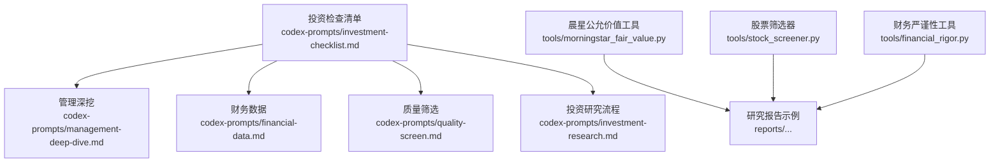
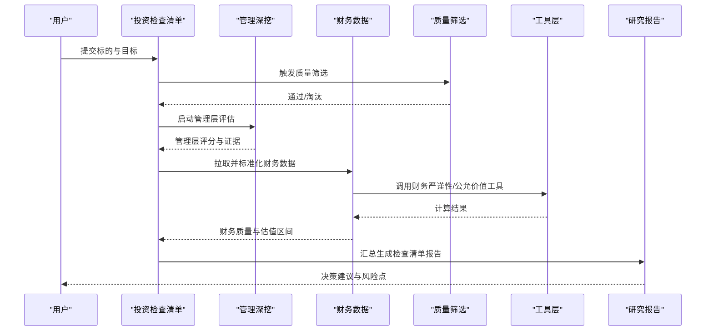
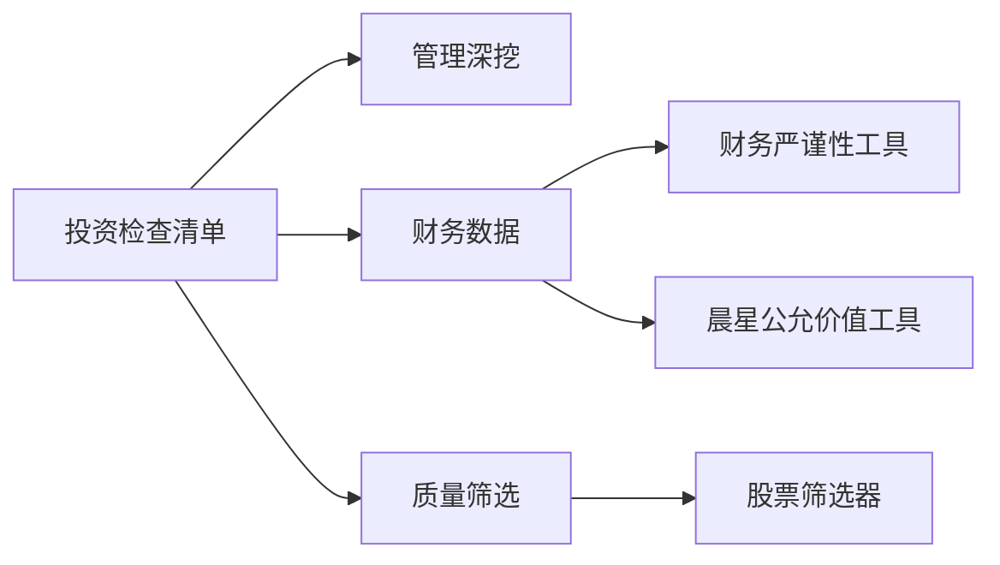

# 投资检查清单

<cite>
**本文引用的文件**   
- [investment-checklist.md](file://codex-prompts/investment-checklist.md)
- [SKILL.md](file://codex-skills/investment-checklist/SKILL.md)
- [management-deep-dive.md](file://codex-prompts/management-deep-dive.md)
- [SKILL.md](file://codex-skills/management-deep-dive/SKILL.md)
- [financial-data.md](file://codex-prompts/financial-data.md)
- [SKILL.md](file://codex-skills/financial-data/SKILL.md)
- [quality-screen.md](file://codex-prompts/quality-screen.md)
- [SKILL.md](file://codex-skills/quality-screen/SKILL.md)
- [investment-research.md](file://codex-prompts/investment-research.md)
- [SKILL.md](file://codex-skills/investment-research/SKILL.md)
- [morningstar_fair_value.py](file://tools/morningstar_fair_value.py)
- [stock_screener.py](file://tools/stock_screener.py)
- [financial_rigor.py](file://tools/financial_rigor.py)
- [reports/拼多多/最终报告-护城河专题-20260412.md](file://reports/拼多多/最终报告-护城河专题-20260412.md)
- [reports/拼多多/拼多多-财务与估值深度分析-20260615.md](file://reports/拼多多/拼多多-财务与估值深度分析-20260615.md)
- [reports/泡泡玛特/泡泡玛特-财务质量审计-20260516.md](file://reports/泡泡玛特/泡泡玛特-财务质量审计-20260516.md)
</cite>

## 目录
1. [引言](#引言)
2. [项目结构](#项目结构)
3. [核心组件](#核心组件)
4. [架构总览](#架构总览)
5. [详细组件分析](#详细组件分析)
6. [依赖关系分析](#依赖关系分析)
7. [性能与效率考量](#性能与效率考量)
8. [故障排查指南](#故障排查指南)
9. [结论](#结论)
10. [附录](#附录)

## 引言
本文件面向希望系统化评估投资机会的投资者与研究团队，提供一套“投资检查清单”的设计原理、构建逻辑与使用方法。内容覆盖：
- 如何结构化地评估企业价值与安全边际
- 护城河评估体系（品牌优势、网络效应、成本优势、转换成本）的量化方法
- 管理层分析框架（诚信度、资本配置能力、战略执行力）的关键指标
- 估值判断方法（DCF、相对估值、历史估值区间）
- 财务质量审计工具（现金流、资产负债表健康度、盈利质量）
- 结合真实案例的正反面演示，帮助落地决策

## 项目结构
围绕“投资检查清单”，仓库提供了提示词模板、技能规范、工具脚本以及大量实战研究报告，形成从方法论到落地的闭环。

图表来源
- [investment-checklist.md](file://codex-prompts/investment-checklist.md)
- [management-deep-dive.md](file://codex-prompts/management-deep-dive.md)
- [financial-data.md](file://codex-prompts/financial-data.md)
- [quality-screen.md](file://codex-prompts/quality-screen.md)
- [investment-research.md](file://codex-prompts/investment-research.md)
- [morningstar_fair_value.py](file://tools/morningstar_fair_value.py)
- [stock_screener.py](file://tools/stock_screener.py)
- [financial_rigor.py](file://tools/financial_rigor.py)

章节来源
- [investment-checklist.md](file://codex-prompts/investment-checklist.md)
- [SKILL.md](file://codex-skills/investment-checklist/SKILL.md)
- [management-deep-dive.md](file://codex-prompts/management-deep-dive.md)
- [SKILL.md](file://codex-skills/management-deep-dive/SKILL.md)
- [financial-data.md](file://codex-prompts/financial-data.md)
- [SKILL.md](file://codex-skills/financial-data/SKILL.md)
- [quality-screen.md](file://codex-prompts/quality-screen.md)
- [SKILL.md](file://codex-skills/quality-screen/SKILL.md)
- [investment-research.md](file://codex-prompts/investment-research.md)
- [SKILL.md](file://codex-skills/investment-research/SKILL.md)
- [morningstar_fair_value.py](file://tools/morningstar_fair_value.py)
- [stock_screener.py](file://tools/stock_screener.py)
- [financial_rigor.py](file://tools/financial_rigor.py)

## 核心组件
- 投资检查清单（总控）：定义评估维度、评分规则、否决项与权重，串联各子模块输出，形成可复用的投资决策依据。
- 管理深挖：聚焦管理层诚信度、资本配置记录、战略执行与激励约束机制，给出可量化的证据收集路径。
- 财务数据：标准化财务口径，统一关键比率与趋势分析，确保可比性与稳健性。
- 质量筛选：基于去劣原则与质量因子进行初筛，降低踩雷概率。
- 投资研究流程：将上述模块整合为端到端的研究工作流，明确输入、处理、输出与复核节点。

章节来源
- [investment-checklist.md](file://codex-prompts/investment-checklist.md)
- [SKILL.md](file://codex-skills/investment-checklist/SKILL.md)
- [management-deep-dive.md](file://codex-prompts/management-deep-dive.md)
- [SKILL.md](file://codex-skills/management-deep-dive/SKILL.md)
- [financial-data.md](file://codex-prompts/financial-data.md)
- [SKILL.md](file://codex-skills/financial-data/SKILL.md)
- [quality-screen.md](file://codex-prompts/quality-screen.md)
- [SKILL.md](file://codex-skills/quality-screen/SKILL.md)
- [investment-research.md](file://codex-prompts/investment-research.md)
- [SKILL.md](file://codex-skills/investment-research/SKILL.md)

## 架构总览
投资检查清单采用“模块化+流水线”的架构：以检查清单为中枢，驱动管理、财务、质量等子模块产出结构化证据；工具层提供自动化计算与筛选；最终汇聚为研究报告与决策建议。

图表来源
- [investment-checklist.md](file://codex-prompts/investment-checklist.md)
- [management-deep-dive.md](file://codex-prompts/management-deep-dive.md)
- [financial-data.md](file://codex-prompts/financial-data.md)
- [quality-screen.md](file://codex-prompts/quality-screen.md)
- [investment-research.md](file://codex-prompts/investment-research.md)
- [financial_rigor.py](file://tools/financial_rigor.py)
- [morningstar_fair_value.py](file://tools/morningstar_fair_value.py)

## 详细组件分析

### 护城河评估体系
- 设计要点
  - 将护城河拆解为品牌优势、网络效应、成本优势、转换成本四类，每类定义可观测指标与数据来源。
  - 引入“证据强度”分级（强/中/弱），避免主观臆断。
  - 对每个维度设置阈值与扣分项，支持横向对比与时间序列跟踪。
- 量化方法
  - 品牌优势：定价权与毛利率稳定性、复购率、NPS/口碑指标、广告投入产出比。
  - 网络效应：活跃用户规模、双边市场匹配效率、跨边网络弹性、平台留存与迁移成本。
  - 成本优势：单位成本曲线、规模经济拐点、供应链议价力、产能利用率与折旧策略。
  - 转换成本：合同粘性、集成复杂度、合规与认证壁垒、替代方案切换成本。
- 输出物
  - 护城河评分卡、证据清单、风险预警与反证项。

章节来源
- [investment-checklist.md](file://codex-prompts/investment-checklist.md)
- [reports/拼多多/最终报告-护城河专题-20260412.md](file://reports/拼多多/最终报告-护城河专题-20260412.md)

### 管理层分析框架
- 设计要点
  - 聚焦三大维度：诚信度、资本配置能力、战略执行力。
  - 强调“言行一致”的证据链：公开承诺、资本支出、回购/分红、并购整合、股权激励与减持行为。
- 关键指标
  - 诚信度：信息披露质量、关联交易透明度、审计意见、监管处罚记录。
  - 资本配置：ROIC vs WACC、自由现金流转化率、并购协同兑现、资本开支纪律。
  - 战略执行：里程碑达成率、业务结构优化、组织与人才建设、危机应对。
- 输出物
  - 管理层画像、治理评分、负面事件追踪与影响评估。

章节来源
- [management-deep-dive.md](file://codex-prompts/management-deep-dive.md)
- [SKILL.md](file://codex-skills/management-deep-dive/SKILL.md)

### 估值判断方法
- 设计要点
  - 多方法交叉验证：绝对估值（DCF）、相对估值（PE/PB/EV/EBITDA等）、历史估值区间与分位数。
  - 安全边际：在合理估值基础上叠加情景分析与压力测试。
- 技术要点
  - DCF：增长假设、利润率路径、营运资本与CapEx、折现率与永续增长率敏感性。
  - 相对估值：同业可比公司选择、周期调整、会计差异修正。
  - 历史区间：滚动窗口、极端值剔除、宏观与行业周期定位。
- 输出物
  - 估值区间、情景矩阵、安全边际与仓位建议。

章节来源
- [investment-checklist.md](file://codex-prompts/investment-checklist.md)
- [financial-data.md](file://codex-prompts/financial-data.md)
- [SKILL.md](file://codex-skills/financial-data/SKILL.md)
- [morningstar_fair_value.py](file://tools/morningstar_fair_value.py)

### 财务质量审计工具
- 设计要点
  - 三表联动：利润表、资产负债表、现金流量表的勾稽关系校验。
  - 重点科目穿透：应收/存货周转、预收/递延收入、商誉与无形资产、杠杆与流动性。
- 分析方法
  - 现金流分析：经营现金流/净利润、自由现金流稳定性、资本开支与再投资回报。
  - 资产负债健康度：短债覆盖、利息保障、资产减值风险、表外负债识别。
  - 盈利质量：非经常性损益占比、收入确认政策、毛利率波动归因。
- 输出物
  - 财务健康评分、异常信号清单、审计关注点与后续核查计划。

章节来源
- [financial-data.md](file://codex-prompts/financial-data.md)
- [SKILL.md](file://codex-skills/financial-data/SKILL.md)
- [financial_rigor.py](file://tools/financial_rigor.py)
- [reports/泡泡玛特/泡泡玛特-财务质量审计-20260516.md](file://reports/泡泡玛特/泡泡玛特-财务质量审计-20260516.md)

### 质量筛选与去劣
- 设计要点
  - 先排雷后择优：以去劣指标快速淘汰高风险标的，提升研究效率。
  - 质量因子：盈利稳定性、现金流质量、杠杆水平、治理与合规。
- 输出物
  - 候选池、淘汰原因、二次复核建议。

章节来源
- [quality-screen.md](file://codex-prompts/quality-screen.md)
- [SKILL.md](file://codex-skills/quality-screen/SKILL.md)
- [stock_screener.py](file://tools/stock_screener.py)

### 投资研究流程（端到端）
- 阶段划分
  - 立项与初筛 → 护城河与管理层深挖 → 财务与估值建模 → 风险与情景分析 → 决策与复盘
- 质量控制
  - 证据归档、假设透明、反证优先、同行评审与版本控制

章节来源
- [investment-research.md](file://codex-prompts/investment-research.md)
- [SKILL.md](file://codex-skills/investment-research/SKILL.md)

## 依赖关系分析
- 模块耦合
  - 检查清单作为编排者，依赖管理、财务、质量三个子模块；工具层被财务与质量模块调用。
- 外部依赖
  - 财报与公告、第三方估值数据（如晨星公允价值）、行情与基本面数据库。
- 潜在循环
  - 当前为单向依赖，未见循环引用；建议在扩展时保持分层清晰。

图表来源
- [investment-checklist.md](file://codex-prompts/investment-checklist.md)
- [management-deep-dive.md](file://codex-prompts/management-deep-dive.md)
- [financial-data.md](file://codex-prompts/financial-data.md)
- [quality-screen.md](file://codex-prompts/quality-screen.md)
- [financial_rigor.py](file://tools/financial_rigor.py)
- [morningstar_fair_value.py](file://tools/morningstar_fair_value.py)
- [stock_screener.py](file://tools/stock_screener.py)

## 性能与效率考量
- 批量化与并行化：对候选池进行批量初筛与打分，减少重复劳动。
- 数据缓存与增量更新：对高频数据（行情、公告）建立缓存，仅增量刷新。
- 假设库与模板复用：将常用假设与模板沉淀，缩短建模时间。
- 可视化与仪表盘：将关键指标与趋势可视化，提高审阅效率。

[本节为通用指导，不直接分析具体文件]

## 故障排查指南
- 数据缺失或口径不一致
  - 现象：关键比率缺失、同比不可比
  - 处理：统一会计口径、补充披露来源、标注估算方法与不确定性
- 模型不稳定
  - 现象：DCF对假设敏感导致结果震荡
  - 处理：敏感性分析、情景矩阵、保守假设与压力测试
- 证据不足或矛盾
  - 现象：管理层承诺与实际行为不一致
  - 处理：交叉验证多渠道信息、记录反证、降级评分并提示风险

章节来源
- [financial-data.md](file://codex-prompts/financial-data.md)
- [investment-checklist.md](file://codex-prompts/investment-checklist.md)

## 结论
本检查清单以“证据先行、量化支撑、交叉验证”为核心原则，将护城河、管理层、财务与估值四大维度整合为可操作的工作流。通过工具化与模板化，显著提升研究与决策效率，同时保留足够的灵活性以适应不同行业与公司特征。

[本节为总结性内容，不直接分析具体文件]

## 附录

### 使用示例：拼多多（正面案例）
- 护城河：平台网络效应与成本优势显著，供给端与需求端双向粘性增强。
- 管理层：战略聚焦主站与出海，资本配置偏向效率与回报。
- 财务质量：现金流稳健，费用管控有效，盈利质量改善。
- 估值：相对与历史区间显示具备安全边际，需关注竞争与监管风险。

章节来源
- [reports/拼多多/最终报告-护城河专题-20260412.md](file://reports/拼多多/最终报告-护城河专题-20260412.md)
- [reports/拼多多/拼多多-财务与估值深度分析-20260615.md](file://reports/拼多多/拼多多-财务与估值深度分析-20260615.md)

### 使用示例：泡泡玛特（财务质量审计）
- 现金流：经营性现金流与净利润匹配度高，自由现金流稳定。
- 资产负债表：库存与渠道管理良好，短期偿债能力充足。
- 盈利质量：非经常性损益占比低，收入确认谨慎。
- 风险提示：新品节奏与渠道扩张带来的营运资金占用。

章节来源
- [reports/泡泡玛特/泡泡玛特-财务质量审计-20260516.md](file://reports/泡泡玛特/泡泡玛特-财务质量审计-20260516.md)