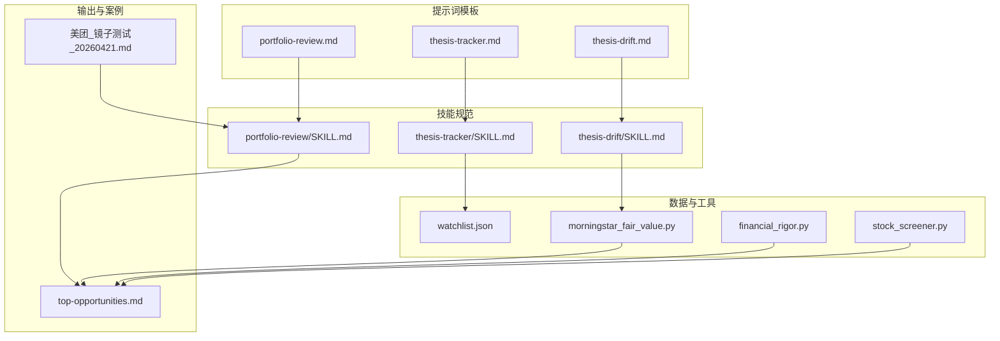
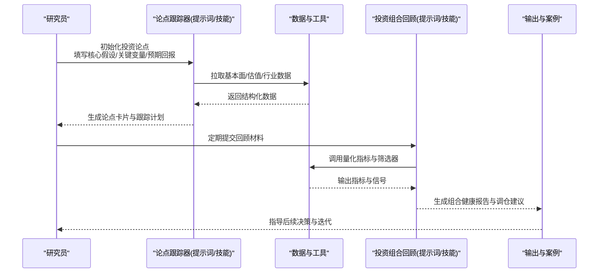
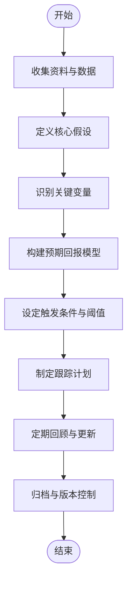
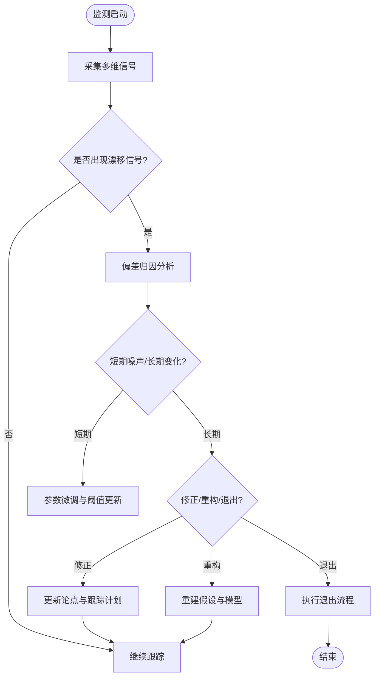
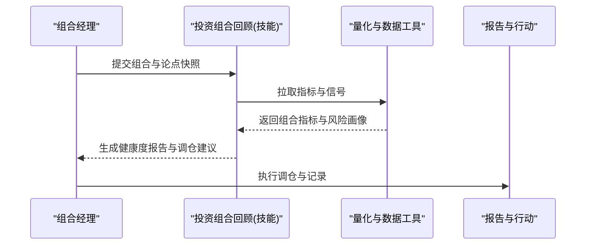
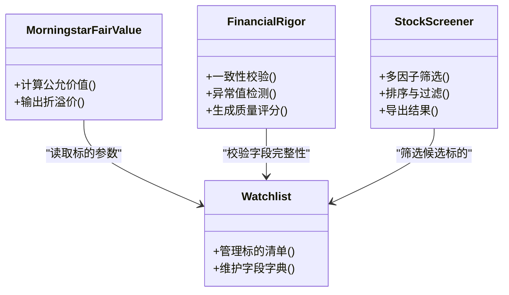

# 投资论点跟踪机制

<cite>
**本文引用的文件**   
- [codex-prompts/thesis-tracker.md](file://codex-prompts/thesis-tracker.md)
- [codex-skills/thesis-tracker/SKILL.md](file://codex-skills/thesis-tracker/SKILL.md)
- [codex-prompts/thesis-drift.md](file://codex-prompts/thesis-drift.md)
- [codex-skills/thesis-drift/SKILL.md](file://codex-skills/thesis-drift/SKILL.md)
- [codex-prompts/portfolio-review.md](file://codex-prompts/portfolio-review.md)
- [codex-skills/portfolio-review/SKILL.md](file://codex-skills/portfolio-review/SKILL.md)
- [实盘记录/美团_镜子测试_20260421.md](file://实盘记录/美团_镜子测试_20260421.md)
- [reports/bottleneck-map/top-opportunities.md](file://reports/bottleneck-map/top-opportunities.md)
- [tools/morningstar_fair_value.py](file://tools/morningstar_fair_value.py)
- [tools/financial_rigor.py](file://tools/financial_rigor.py)
- [tools/stock_screener.py](file://tools/stock_screener.py)
- [data/watchlist.json](file://data/watchlist.json)
</cite>

## 目录
1. [引言](#引言)
2. [项目结构](#项目结构)
3. [核心组件](#核心组件)
4. [架构总览](#架构总览)
5. [详细组件分析](#详细组件分析)
6. [依赖关系分析](#依赖关系分析)
7. [性能与可维护性](#性能与可维护性)
8. [故障排查指南](#故障排查指南)
9. [结论](#结论)
10. [附录](#附录)

## 引言
本文件面向投资研究与组合管理实践，系统化阐述“投资论点跟踪机制”的设计与落地方法。内容覆盖：
- 投资论点的定义、结构与构建方法（核心假设、关键变量、预期回报）
- 论点跟踪的实现机制（定期回顾流程、关键指标监控、假设验证）
- 论点漂移检测技术（信号识别、偏差分析、修正策略）
- 镜前测试方法与系统性反思
- 论点管理的最佳实践（文档化、版本控制、团队协作）
- 端到端案例演示（从初始论点到后续跟踪调整）
- 量化指标与自动化监控工具使用指南

## 项目结构
围绕投资论点跟踪，仓库提供了两类关键资产：
- 提示词模板（codex-prompts）：用于驱动研究、跟踪与复盘的标准化问题集与检查清单
- 技能规范（codex-skills）：将上述模板固化为可复用的工作流能力（SKILL），便于团队一致执行

图表来源
- [codex-prompts/thesis-tracker.md](file://codex-prompts/thesis-tracker.md)
- [codex-skills/thesis-tracker/SKILL.md](file://codex-skills/thesis-tracker/SKILL.md)
- [codex-prompts/thesis-drift.md](file://codex-prompts/thesis-drift.md)
- [codex-skills/thesis-drift/SKILL.md](file://codex-skills/thesis-drift/SKILL.md)
- [codex-prompts/portfolio-review.md](file://codex-prompts/portfolio-review.md)
- [codex-skills/portfolio-review/SKILL.md](file://codex-skills/portfolio-review/SKILL.md)
- [data/watchlist.json](file://data/watchlist.json)
- [tools/morningstar_fair_value.py](file://tools/morningstar_fair_value.py)
- [tools/financial_rigor.py](file://tools/financial_rigor.py)
- [tools/stock_screener.py](file://tools/stock_screener.py)
- [reports/bottleneck-map/top-opportunities.md](file://reports/bottleneck-map/top-opportunities.md)
- [实盘记录/美团_镜子测试_20260421.md](file://实盘记录/美团_镜子测试_20260421.md)

章节来源
- [codex-prompts/thesis-tracker.md](file://codex-prompts/thesis-tracker.md)
- [codex-skills/thesis-tracker/SKILL.md](file://codex-skills/thesis-tracker/SKILL.md)
- [codex-prompts/thesis-drift.md](file://codex-prompts/thesis-drift.md)
- [codex-skills/thesis-drift/SKILL.md](file://codex-skills/thesis-drift/SKILL.md)
- [codex-prompts/portfolio-review.md](file://codex-prompts/portfolio-review.md)
- [codex-skills/portfolio-review/SKILL.md](file://codex-skills/portfolio-review/SKILL.md)
- [data/watchlist.json](file://data/watchlist.json)
- [tools/morningstar_fair_value.py](file://tools/morningstar_fair_value.py)
- [tools/financial_rigor.py](file://tools/financial_rigor.py)
- [tools/stock_screener.py](file://tools/stock_screener.py)
- [reports/bottleneck-map/top-opportunities.md](file://reports/bottleneck-map/top-opportunities.md)
- [实盘记录/美团_镜子测试_20260421.md](file://实盘记录/美团_镜子测试_20260421.md)

## 核心组件
- 投资论点跟踪器（Thesis Tracker）
  - 作用：结构化沉淀投资论点，明确核心假设、关键变量、预期回报与触发条件；提供定期回顾与更新指引
  - 输入：标的基本信息、业务与财务要点、估值与安全边际
  - 输出：论点卡片、跟踪计划、关键指标阈值与回顾节奏
- 论点漂移检测（Thesis Drift）
  - 作用：基于事实与数据对核心假设进行持续校验，识别偏离并给出修正建议
  - 输入：财报、公告、行业数据、价格与估值变化、竞争格局变动
  - 输出：漂移信号、偏差归因、修正策略（加仓/减仓/持有/退出）
- 投资组合回顾（Portfolio Review）
  - 作用：在组合层面审视论点质量、相关性、风险暴露与再平衡机会
  - 输入：各标的论点状态、权重、表现与风险指标
  - 输出：组合健康度评估、调仓建议、优先级排序
- 量化与数据工具
  - 晨星公允价值计算脚本：辅助安全边际判断
  - 财务严谨性检查：统一口径与一致性校验
  - 股票筛选器：快速定位候选标的与异常信号
  - 观察池：集中管理待跟踪标的与基础信息

章节来源
- [codex-prompts/thesis-tracker.md](file://codex-prompts/thesis-tracker.md)
- [codex-skills/thesis-tracker/SKILL.md](file://codex-skills/thesis-tracker/SKILL.md)
- [codex-prompts/thesis-drift.md](file://codex-prompts/thesis-drift.md)
- [codex-skills/thesis-drift/SKILL.md](file://codex-skills/thesis-drift/SKILL.md)
- [codex-prompts/portfolio-review.md](file://codex-prompts/portfolio-review.md)
- [codex-skills/portfolio-review/SKILL.md](file://codex-skills/portfolio-review/SKILL.md)
- [tools/morningstar_fair_value.py](file://tools/morningstar_fair_value.py)
- [tools/financial_rigor.py](file://tools/financial_rigor.py)
- [tools/stock_screener.py](file://tools/stock_screener.py)
- [data/watchlist.json](file://data/watchlist.json)

## 架构总览
投资论点跟踪机制由“方法论（提示词）—能力（技能）—数据与工具—产出与案例”四层构成，形成闭环：

图表来源
- [codex-prompts/thesis-tracker.md](file://codex-prompts/thesis-tracker.md)
- [codex-skills/thesis-tracker/SKILL.md](file://codex-skills/thesis-tracker/SKILL.md)
- [codex-prompts/thesis-drift.md](file://codex-prompts/thesis-drift.md)
- [codex-skills/thesis-drift/SKILL.md](file://codex-skills/thesis-drift/SKILL.md)
- [codex-prompts/portfolio-review.md](file://codex-prompts/portfolio-review.md)
- [codex-skills/portfolio-review/SKILL.md](file://codex-skills/portfolio-review/SKILL.md)
- [tools/morningstar_fair_value.py](file://tools/morningstar_fair_value.py)
- [tools/financial_rigor.py](file://tools/financial_rigor.py)
- [tools/stock_screener.py](file://tools/stock_screener.py)
- [reports/bottleneck-map/top-opportunities.md](file://reports/bottleneck-map/top-opportunities.md)

## 详细组件分析

### 投资论点跟踪器（Thesis Tracker）
- 目标
  - 将投资逻辑显式化、可追踪、可证伪
  - 建立“假设—变量—结果”的映射，便于后续验证与回溯
- 关键要素
  - 核心假设：商业模式、护城河、增长驱动、定价权等
  - 关键变量：收入/利润弹性因子、成本项、渗透率、产能利用率等
  - 预期回报：合理估值区间、安全边际、时间维度与情景分析
  - 触发条件：买入/加仓/减仓/退出的前置信号
- 工作流程
  - 初始化：收集公司资料、行业背景、历史业绩与同业对比
  - 建模：搭建关键变量与预期回报的关系框架
  - 跟踪：设定回顾周期与指标阈值，记录变更与原因
  - 归档：版本化管理，保留每次更新的差异与依据

图表来源
- [codex-prompts/thesis-tracker.md](file://codex-prompts/thesis-tracker.md)
- [codex-skills/thesis-tracker/SKILL.md](file://codex-skills/thesis-tracker/SKILL.md)

章节来源
- [codex-prompts/thesis-tracker.md](file://codex-prompts/thesis-tracker.md)
- [codex-skills/thesis-tracker/SKILL.md](file://codex-skills/thesis-tracker/SKILL.md)

### 论点漂移检测（Thesis Drift）
- 目标
  - 及时识别核心假设与实际表现的偏离，避免“确认偏误”
- 信号识别
  - 基本面信号：营收/利润增速、利润率趋势、现金流质量、资本开支效率
  - 估值信号：相对/绝对估值分位、公允价值偏离度
  - 市场信号：价格动量、波动率、流动性变化
  - 事件信号：管理层变更、监管政策、竞争格局突变
- 偏差分析
  - 区分短期噪声与长期结构性变化
  - 定位偏差来源：假设错误、变量误估、外部冲击或模型局限
- 修正策略
  - 微调：更新参数与阈值，保持原逻辑
  - 重构：修改核心假设或关键变量
  - 退出：当证据充分且不可逆时果断退出

图表来源
- [codex-prompts/thesis-drift.md](file://codex-prompts/thesis-drift.md)
- [codex-skills/thesis-drift/SKILL.md](file://codex-skills/thesis-drift/SKILL.md)

章节来源
- [codex-prompts/thesis-drift.md](file://codex-prompts/thesis-drift.md)
- [codex-skills/thesis-drift/SKILL.md](file://codex-skills/thesis-drift/SKILL.md)

### 投资组合回顾（Portfolio Review）
- 目标
  - 在组合层面审视论点质量、风险集中度与再平衡机会
- 关键步骤
  - 汇总各标的论点状态与跟踪记录
  - 计算组合层面的风险与收益指标
  - 识别高相关性与尾部风险
  - 生成调仓优先级与行动计划
- 输出
  - 组合健康度评分、风险热力图、调仓建议与理由

图表来源
- [codex-prompts/portfolio-review.md](file://codex-prompts/portfolio-review.md)
- [codex-skills/portfolio-review/SKILL.md](file://codex-skills/portfolio-review/SKILL.md)
- [reports/bottleneck-map/top-opportunities.md](file://reports/bottleneck-map/top-opportunities.md)

章节来源
- [codex-prompts/portfolio-review.md](file://codex-prompts/portfolio-review.md)
- [codex-skills/portfolio-review/SKILL.md](file://codex-skills/portfolio-review/SKILL.md)
- [reports/bottleneck-map/top-opportunities.md](file://reports/bottleneck-map/top-opportunities.md)

### 镜前测试（Mirror Test）
- 目的
  - 通过系统性自我拷问，检验投资决策的质量与偏见
- 典型问题
  - 我是否清晰陈述了买入/持有的核心理由？
  - 如果当前持仓为负，我是否会买入？为什么？
  - 哪些证据会改变我的观点？我已如何跟踪这些证据？
  - 我是否混淆了运气与能力？
- 实践方式
  - 结合具体案例撰写反思笔记，记录决策前后的心智模型与证据变化
  - 将反思纳入定期回顾流程，形成闭环

章节来源
- [实盘记录/美团_镜子测试_20260421.md](file://实盘记录/美团_镜子测试_20260421.md)

### 量化指标与自动化监控工具
- 晨星公允价值计算（morningstar_fair_value.py）
  - 用途：辅助安全边际判断与估值锚定
  - 输入：财务与估值参数
  - 输出：公允价值估算与折溢价比例
- 财务严谨性检查（financial_rigor.py）
  - 用途：统一口径、一致性校验、异常值提示
  - 输出：合规与质量评分、需复核项清单
- 股票筛选器（stock_screener.py）
  - 用途：快速定位候选标的与异常信号
  - 输出：筛选结果与排序
- 观察池（watchlist.json）
  - 用途：集中管理待跟踪标的与基础信息
  - 输出：标的清单与字段说明

图表来源
- [tools/morningstar_fair_value.py](file://tools/morningstar_fair_value.py)
- [tools/financial_rigor.py](file://tools/financial_rigor.py)
- [tools/stock_screener.py](file://tools/stock_screener.py)
- [data/watchlist.json](file://data/watchlist.json)

章节来源
- [tools/morningstar_fair_value.py](file://tools/morningstar_fair_value.py)
- [tools/financial_rigor.py](file://tools/financial_rigor.py)
- [tools/stock_screener.py](file://tools/stock_screener.py)
- [data/watchlist.json](file://data/watchlist.json)

## 依赖关系分析
- 模块耦合
  - 提示词与技能强绑定：SKILL.md是对应提示词的规范化执行指南
  - 工具与数据：脚本依赖watchlist.json中的标的与字段字典
  - 输出与案例：top-opportunities.md作为组合回顾与筛选结果的聚合展示
- 潜在循环依赖
  - 当前结构以单向依赖为主（提示词→技能→工具→输出），未见明显循环
- 外部依赖
  - 数据源与第三方估值方法（如晨星公允价值）需在脚本中配置与校验

图表来源
- [codex-prompts/thesis-tracker.md](file://codex-prompts/thesis-tracker.md)
- [codex-skills/thesis-tracker/SKILL.md](file://codex-skills/thesis-tracker/SKILL.md)
- [codex-prompts/thesis-drift.md](file://codex-prompts/thesis-drift.md)
- [codex-skills/thesis-drift/SKILL.md](file://codex-skills/thesis-drift/SKILL.md)
- [codex-prompts/portfolio-review.md](file://codex-prompts/portfolio-review.md)
- [codex-skills/portfolio-review/SKILL.md](file://codex-skills/portfolio-review/SKILL.md)
- [tools/morningstar_fair_value.py](file://tools/morningstar_fair_value.py)
- [tools/financial_rigor.py](file://tools/financial_rigor.py)
- [tools/stock_screener.py](file://tools/stock_screener.py)
- [data/watchlist.json](file://data/watchlist.json)
- [reports/bottleneck-map/top-opportunities.md](file://reports/bottleneck-map/top-opportunities.md)

章节来源
- [codex-prompts/thesis-tracker.md](file://codex-prompts/thesis-tracker.md)
- [codex-skills/thesis-tracker/SKILL.md](file://codex-skills/thesis-tracker/SKILL.md)
- [codex-prompts/thesis-drift.md](file://codex-prompts/thesis-drift.md)
- [codex-skills/thesis-drift/SKILL.md](file://codex-skills/thesis-drift/SKILL.md)
- [codex-prompts/portfolio-review.md](file://codex-prompts/portfolio-review.md)
- [codex-skills/portfolio-review/SKILL.md](file://codex-skills/portfolio-review/SKILL.md)
- [tools/morningstar_fair_value.py](file://tools/morningstar_fair_value.py)
- [tools/financial_rigor.py](file://tools/financial_rigor.py)
- [tools/stock_screener.py](file://tools/stock_screener.py)
- [data/watchlist.json](file://data/watchlist.json)
- [reports/bottleneck-map/top-opportunities.md](file://reports/bottleneck-map/top-opportunities.md)

## 性能与可维护性
- 性能
  - 批量处理：优先对watchlist.json中的标的进行并行计算与筛选
  - 缓存与增量更新：对高频数据（价格、估值）采用增量更新策略
  - 指标预计算：将常用指标（增长率、利润率、折溢价）预存，减少重复计算
- 可维护性
  - 字段字典与数据契约：在watchlist.json中明确字段类型与取值范围
  - 脚本接口稳定：对外暴露稳定的函数签名，便于替换数据源
  - 日志与审计：关键计算与决策路径留痕，支持回溯与复盘

[本节为通用指导，不直接分析具体文件]

## 故障排查指南
- 常见问题
  - 数据缺失或不一致：检查watchlist.json字段完整性与数据类型
  - 估值异常：核对公允价值计算参数与输入数据源
  - 筛选结果异常：确认筛选因子阈值与权重设置
- 定位步骤
  - 逐步运行脚本并打印中间结果
  - 使用财务严谨性检查输出定位异常项
  - 回滚到上一版本对比差异
- 恢复措施
  - 修复数据后重新计算
  - 调整阈值与参数，必要时重构假设
  - 记录变更原因与影响范围

章节来源
- [tools/financial_rigor.py](file://tools/financial_rigor.py)
- [tools/morningstar_fair_value.py](file://tools/morningstar_fair_value.py)
- [tools/stock_screener.py](file://tools/stock_screener.py)
- [data/watchlist.json](file://data/watchlist.json)

## 结论
投资论点跟踪机制通过“结构化论点—持续验证—漂移检测—组合回顾—镜前测试”的闭环，显著提升投资决策的可追溯性与稳健性。配合量化指标与自动化工具，可实现高效、一致的跟踪与复盘，降低认知偏差带来的损失。

[本节为总结性内容，不直接分析具体文件]

## 附录
- 端到端案例演示（以拼多多为例）
  - 初始化论点：梳理商业模式、增长驱动、估值与安全边际
  - 设定关键变量与阈值：收入增速、利润率、Temu贡献占比、估值分位
  - 定期跟踪：财报发布后更新指标，对照阈值判断是否需要修正
  - 漂移检测：若核心假设被证伪（如竞争加剧导致利润率持续下滑），触发重构或退出
  - 组合回顾：评估对整体组合的风险暴露与相关性，决定调仓优先级
  - 镜前测试：反思是否存在过度乐观或忽视负面证据的倾向
- 文档化要求
  - 每个标的至少包含：论点卡片、跟踪计划、回顾记录、镜像测试笔记
  - 版本控制：变更记录需包含日期、作者、变更内容与依据
- 团队协作规范
  - 角色分工：研究员负责论点与跟踪，组合经理负责回顾与调仓
  - 评审机制：重要变更需经同行评审与记录
  - 知识库：将优秀案例与失败教训沉淀至共享库

章节来源
- [codex-prompts/thesis-tracker.md](file://codex-prompts/thesis-tracker.md)
- [codex-skills/thesis-tracker/SKILL.md](file://codex-skills/thesis-tracker/SKILL.md)
- [codex-prompts/thesis-drift.md](file://codex-prompts/thesis-drift.md)
- [codex-skills/thesis-drift/SKILL.md](file://codex-skills/thesis-drift/SKILL.md)
- [codex-prompts/portfolio-review.md](file://codex-prompts/portfolio-review.md)
- [codex-skills/portfolio-review/SKILL.md](file://codex-skills/portfolio-review/SKILL.md)
- [实盘记录/美团_镜子测试_20260421.md](file://实盘记录/美团_镜子测试_20260421.md)
- [reports/bottleneck-map/top-opportunities.md](file://reports/bottleneck-map/top-opportunities.md)
- [tools/morningstar_fair_value.py](file://tools/morningstar_fair_value.py)
- [tools/financial_rigor.py](file://tools/financial_rigor.py)
- [tools/stock_screener.py](file://tools/stock_screener.py)
- [data/watchlist.json](file://data/watchlist.json)