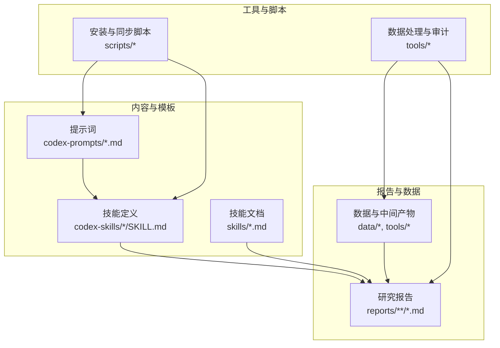
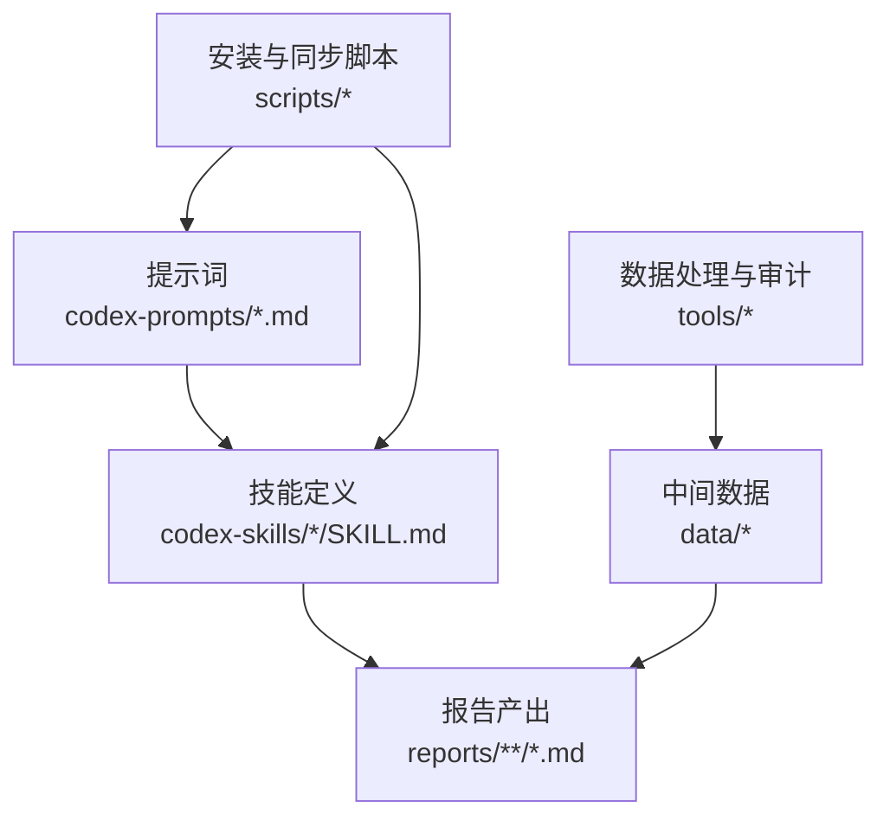
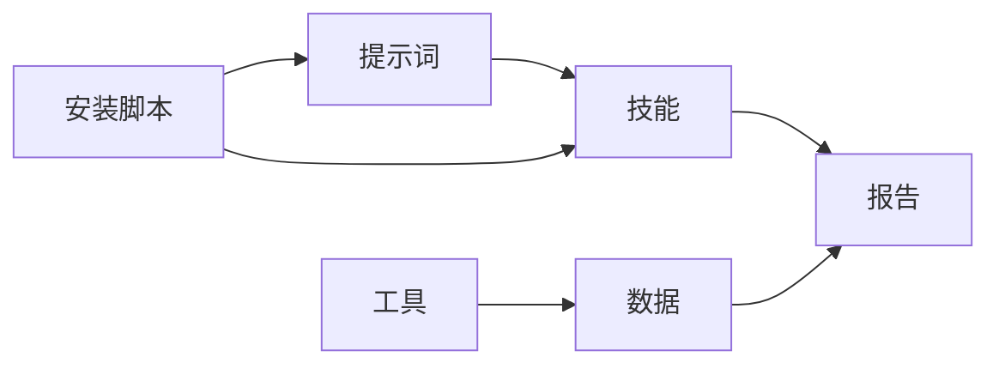

# 多格式输出

<cite>
**本文引用的文件**   
- [README.md](file://README.md)
- [AGENTS.md](file://AGENTS.md)
- [CLAUDE.md](file://CLAUDE.md)
- [CODE_OF_CONDUCT.md](file://CODE_OF_CONDUCT.md)
- [SECURITY.md](file://SECURITY.md)
- [ROADMAP.md](file://docs/ROADMAP.md)
- [bottleneck-hunter.md](file://codex-prompts/bottleneck-hunter.md)
- [investment-research.md](file://codex-prompts/investment-research.md)
- [earnings-review.md](file://codex-prompts/earnings-review.md)
- [industry-funnel.md](file://codex-prompts/industry-funnel.md)
- [wechat-article.md](file://codex-prompts/wechat-article.md)
- [SKILL.md](file://codex-skills/deep-company-series/SKILL.md)
- [SKILL.md](file://codex-skills/earnings-review/SKILL.md)
- [SKILL.md](file://codex-skills/financial-data/SKILL.md)
- [SKILL.md](file://codex-skills/industry-research/SKILL.md)
- [SKILL.md](file://codex-skills/investment-team/SKILL.md)
- [SKILL.md](file://codex-skills/portfolio-review/SKILL.md)
- [SKILL.md](file://codex-skills/wechat-article/SKILL.md)
- [deep-company-series.md](file://skills/deep-company-series.md)
- [earnings-review.md](file://skills/earnings-review.md)
- [financial-data.md](file://skills/financial-data.md)
- [industry-research.md](file://skills/industry-research.md)
- [investment-team.md](file://skills/investment-team.md)
- [portfolio-review.md](file://skills/portfolio-review.md)
- [wechat-article.md](file://skills/wechat-article.md)
- [install-codex-prompts.sh](file://scripts/install-codex-prompts.sh)
- [sync-codex-prompts.py](file://scripts/sync-codex-prompts.py)
- [report_audit.py](file://tools/report_audit.py)
- [stock_screener.py](file://tools/stock_screener.py)
- [morningstar_fair_value.py](file://tools/morningstar_fair_value.py)
- [xueqiu_scraper.py](file://tools/xueqiu_scraper.py)
- [01-开篇-全球最大的发薪公司.md](file://reports/ADP/《看懂ADP》/01-开篇-全球最大的发薪公司.md)
- [AI五层蛋糕-产业全景研究-20260605.md](file://reports/AI产业研究/AI五层蛋糕-产业全景研究-20260605.md)
- [腾讯-earnings-2026Q1-v1.md](file://reports/腾讯/腾讯-earnings-2026Q1-v1.md)
</cite>

## 目录
1. [引言](#引言)
2. [项目结构](#项目结构)
3. [核心组件](#核心组件)
4. [架构总览](#架构总览)
5. [详细组件分析](#详细组件分析)
6. [依赖分析](#依赖分析)
7. [性能考虑](#性能考虑)
8. [故障排除指南](#故障排除指南)
9. [结论](#结论)
10. [附录](#附录)

## 引言
本章节面向“多格式输出”的目标，围绕仓库中现有的报告与技能体系，梳理支持的主要输出格式（Markdown、HTML、PDF、JSON等）及其在研究与内容生产流程中的使用方式。由于仓库以 Markdown 为事实源，并通过脚本与工具链进行同步与处理，因此：
- Markdown 是原生且首选的写作与协作格式；
- HTML/PDF 通常由外部渲染器或构建工具将 Markdown 转换为最终呈现；
- JSON 主要用于数据交换与中间产物，便于后续渲染或自动化处理。

本节不直接分析具体代码实现，而是基于仓库结构与现有文档进行总体说明。

## 项目结构
仓库采用“按主题/公司组织”的报告目录与“按能力/角色组织”的技能与提示词目录，辅以脚本与工具用于安装、同步与数据处理。与多格式输出相关的关键位置包括：
- reports：大量 Markdown 研究报告与专题文章，作为输出的事实源；
- codex-prompts / codex-skills / skills：定义不同角色的工作流与产出规范，间接决定输出格式与风格；
- scripts：提供安装与同步脚本，常用于准备渲染环境或统一素材；
- tools：数据处理与审计工具，可生成结构化数据（如 JSON）供下游渲染。

图表来源
- [README.md:1-200](file://README.md#L1-L200)
- [AGENTS.md:1-200](file://AGENTS.md#L1-L200)
- [CLAUDE.md:1-200](file://CLAUDE.md#L1-L200)
- [ROADMAP.md:1-200](file://docs/ROADMAP.md#L1-L200)

章节来源
- [README.md:1-200](file://README.md#L1-L200)
- [AGENTS.md:1-200](file://AGENTS.md#L1-L200)
- [CLAUDE.md:1-200](file://CLAUDE.md#L1-L200)
- [ROADMAP.md:1-200](file://docs/ROADMAP.md#L1-L200)

## 核心组件
- 提示词与技能体系：通过 codex-prompts 与 codex-skills 定义不同研究任务与产出规范，确保报告的结构化与一致性。
- 报告目录：reports 下按公司与专题组织 Markdown 报告，作为多格式转换的事实源。
- 脚本与工具：scripts 负责环境与素材准备，tools 负责数据抽取、清洗与审计，产出可用于渲染的数据。

章节来源
- [bottleneck-hunter.md:1-200](file://codex-prompts/bottleneck-hunter.md#L1-L200)
- [investment-research.md:1-200](file://codex-prompts/investment-research.md#L1-L200)
- [earnings-review.md:1-200](file://codex-prompts/earnings-review.md#L1-L200)
- [industry-funnel.md:1-200](file://codex-prompts/industry-funnel.md#L1-L200)
- [wechat-article.md:1-200](file://codex-prompts/wechat-article.md#L1-L200)
- [SKILL.md:1-200](file://codex-skills/deep-company-series/SKILL.md#L1-L200)
- [SKILL.md:1-200](file://codex-skills/earnings-review/SKILL.md#L1-L200)
- [SKILL.md:1-200](file://codex-skills/financial-data/SKILL.md#L1-L200)
- [SKILL.md:1-200](file://codex-skills/industry-research/SKILL.md#L1-L200)
- [SKILL.md:1-200](file://codex-skills/investment-team/SKILL.md#L1-L200)
- [SKILL.md:1-200](file://codex-skills/portfolio-review/SKILL.md#L1-L200)
- [SKILL.md:1-200](file://codex-skills/wechat-article/SKILL.md#L1-L200)
- [deep-company-series.md:1-200](file://skills/deep-company-series.md#L1-L200)
- [earnings-review.md:1-200](file://skills/earnings-review.md#L1-L200)
- [financial-data.md:1-200](file://skills/financial-data.md#L1-L200)
- [industry-research.md:1-200](file://skills/industry-research.md#L1-L200)
- [investment-team.md:1-200](file://skills/investment-team.md#L1-L200)
- [portfolio-review.md:1-200](file://skills/portfolio-review.md#L1-L200)
- [wechat-article.md:1-200](file://skills/wechat-article.md#L1-L200)

## 架构总览
下图展示了从“提示词/技能”到“报告”，再到“脚本/工具”的整体关系。该图强调 Markdown 作为事实源的核心地位，以及脚本与工具对数据与环境的支撑作用。

图表来源
- [README.md:1-200](file://README.md#L1-L200)
- [AGENTS.md:1-200](file://AGENTS.md#L1-L200)
- [CLAUDE.md:1-200](file://CLAUDE.md#L1-L200)
- [ROADMAP.md:1-200](file://docs/ROADMAP.md#L1-L200)

## 详细组件分析

### 提示词与技能驱动的报告生成
- 提示词定义了不同研究任务的输入、步骤与输出要求，确保报告结构一致、内容完整。
- 技能进一步细化角色分工与交付物标准，例如深度公司系列、财报审阅、行业漏斗、投研团队协同等。
- 这些规范直接影响最终报告的 Markdown 结构，从而为后续的 HTML/PDF 渲染提供稳定基础。

章节来源
- [bottleneck-hunter.md:1-200](file://codex-prompts/bottleneck-hunter.md#L1-L200)
- [investment-research.md:1-200](file://codex-prompts/investment-research.md#L1-L200)
- [earnings-review.md:1-200](file://codex-prompts/earnings-review.md#L1-L200)
- [industry-funnel.md:1-200](file://codex-prompts/industry-funnel.md#L1-L200)
- [wechat-article.md:1-200](file://codex-prompts/wechat-article.md#L1-L200)
- [SKILL.md:1-200](file://codex-skills/deep-company-series/SKILL.md#L1-L200)
- [SKILL.md:1-200](file://codex-skills/earnings-review/SKILL.md#L1-L200)
- [SKILL.md:1-200](file://codex-skills/financial-data/SKILL.md#L1-L200)
- [SKILL.md:1-200](file://codex-skills/industry-research/SKILL.md#L1-L200)
- [SKILL.md:1-200](file://codex-skills/investment-team/SKILL.md#L1-L200)
- [SKILL.md:1-200](file://codex-skills/portfolio-review/SKILL.md#L1-L200)
- [SKILL.md:1-200](file://codex-skills/wechat-article/SKILL.md#L1-L200)

### 报告目录与样例
- reports 目录下包含大量 Markdown 报告，覆盖公司深度研究、财报审阅、行业分析等主题。
- 示例文件体现了报告的组织方式与命名规范，便于批量处理与版本管理。

章节来源
- [01-开篇-全球最大的发薪公司.md:1-200](file://reports/ADP/《看懂ADP》/01-开篇-全球最大的发薪公司.md#L1-L200)
- [AI五层蛋糕-产业全景研究-20260605.md:1-200](file://reports/AI产业研究/AI五层蛋糕-产业全景研究-20260605.md#L1-L200)
- [腾讯-earnings-2026Q1-v1.md:1-200](file://reports/腾讯/腾讯-earnings-2026Q1-v1.md#L1-L200)

### 脚本与工具链
- 安装与同步脚本：用于准备提示词与技能的环境，保证一致的素材与配置。
- 数据处理与审计工具：提供数据抓取、清洗与质量检查，产出结构化数据（如 CSV/JSON），供报告引用与渲染。

章节来源
- [install-codex-prompts.sh:1-200](file://scripts/install-codex-prompts.sh#L1-L200)
- [sync-codex-prompts.py:1-200](file://scripts/sync-codex-prompts.py#L1-L200)
- [report_audit.py:1-200](file://tools/report_audit.py#L1-L200)
- [stock_screener.py:1-200](file://tools/stock_screener.py#L1-L200)
- [morningstar_fair_value.py:1-200](file://tools/morningstar_fair_value.py#L1-L200)
- [xueqiu_scraper.py:1-200](file://tools/xueqiu_scraper.py#L1-L200)

## 依赖分析
- 提示词与技能之间存在强耦合：提示词定义任务，技能细化执行路径与交付标准。
- 报告与数据存在双向依赖：报告引用数据，数据由工具生成并受报告需求影响。
- 脚本与工具为整体流程提供基础设施：安装、同步、数据抽取与审计。

图表来源
- [README.md:1-200](file://README.md#L1-L200)
- [AGENTS.md:1-200](file://AGENTS.md#L1-L200)
- [CLAUDE.md:1-200](file://CLAUDE.md#L1-L200)
- [ROADMAP.md:1-200](file://docs/ROADMAP.md#L1-L200)

章节来源
- [README.md:1-200](file://README.md#L1-L200)
- [AGENTS.md:1-200](file://AGENTS.md#L1-L200)
- [CLAUDE.md:1-200](file://CLAUDE.md#L1-L200)
- [ROADMAP.md:1-200](file://docs/ROADMAP.md#L1-L200)

## 性能考虑
- 报告体量与渲染成本：大型报告（含大量图表与表格）在转换为 HTML/PDF 时可能增加渲染时间与资源消耗，建议分节渲染与按需加载。
- 数据预处理：在工具层完成数据清洗与聚合，减少渲染时的计算压力。
- 缓存策略：对静态资源（样式、字体、图表）进行缓存，提升重复渲染效率。

[本节为通用指导，无需特定文件来源]

## 故障排除指南
- 渲染失败：检查 Markdown 语法与图片链接是否正确，确认外部依赖（如 PDF 渲染引擎）已安装。
- 数据缺失：核对工具链是否成功运行，确认中间数据文件是否存在且格式正确。
- 样式异常：若自定义 CSS 未生效，检查样式引入路径与优先级冲突。
- 权限问题：确保脚本与工具具有必要的读写权限，避免写入报告或数据目录失败。

[本节为通用指导，无需特定文件来源]

## 结论
本仓库以 Markdown 为核心事实源，通过提示词与技能体系保障报告的一致性与完整性，借助脚本与工具链完成数据准备与质量审计。对于多格式输出，建议在保持 Markdown 稳定的前提下，结合外部渲染器实现 HTML/PDF 的最终呈现，并以 JSON/CSV 作为数据交换与二次加工的基础。

[本节为总结性内容，无需特定文件来源]

## 附录

### 输出格式选择建议
- 在线阅读：优先 HTML，具备良好交互与跨平台兼容性。
- 打印输出：优先 PDF，适合固定版式与归档。
- 数据交换：优先 JSON/CSV，便于程序化处理与可视化。
- 协作编辑：优先 Markdown，利于版本管理与多人协作。

[本节为通用指导，无需特定文件来源]

### 自定义输出与样式
- 样式定制：通过外部 CSS 控制排版与主题，适配不同阅读场景。
- 模板扩展：在提示词与技能中定义结构化字段，确保渲染模板能稳定填充。
- 批量转换：利用脚本遍历 reports 目录，调用渲染器批量生成 HTML/PDF。

[本节为通用指导，无需特定文件来源]

### 兼容性处理
- 跨平台差异：注意字体、分页与页眉页脚在不同渲染器中的表现差异。
- 图表嵌入：优先使用矢量格式（SVG）或高分辨率位图，确保缩放清晰。
- 编码与语言：确保 UTF-8 编码与中文排版设置一致，避免乱码。

[本节为通用指导，无需特定文件来源]