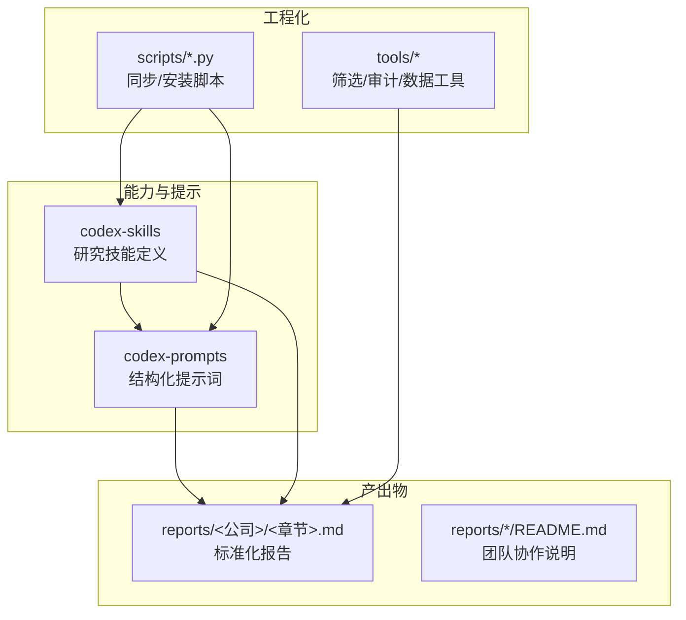
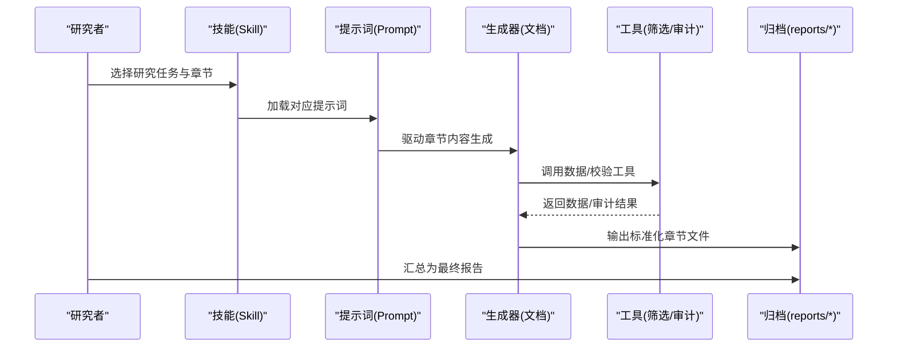
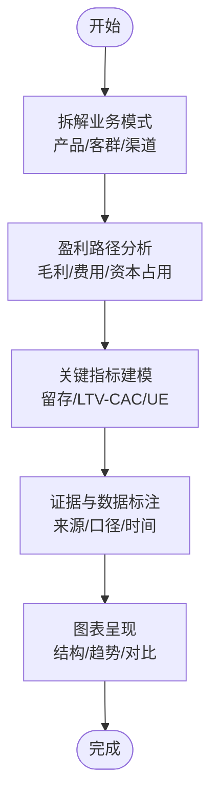
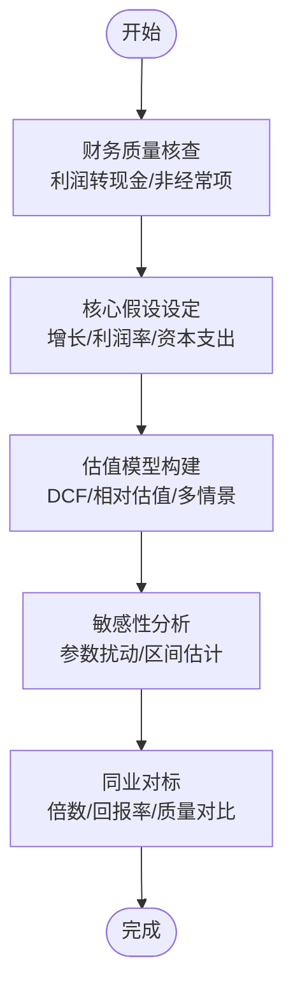
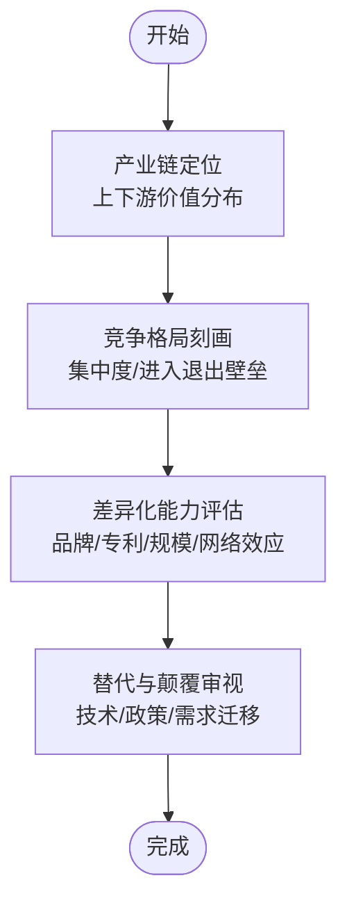
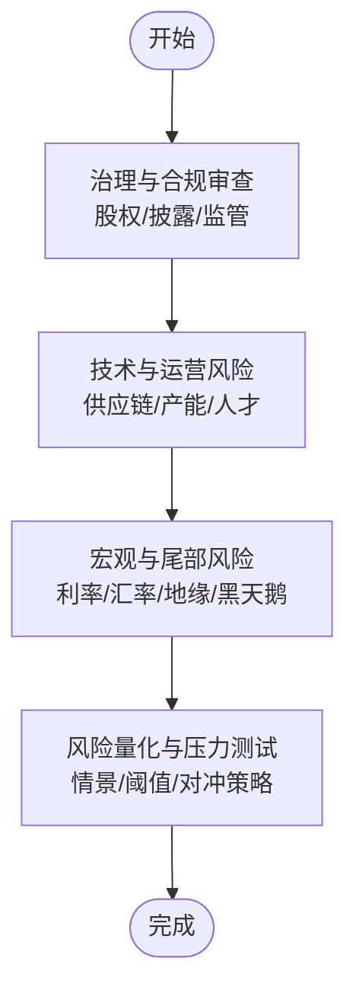
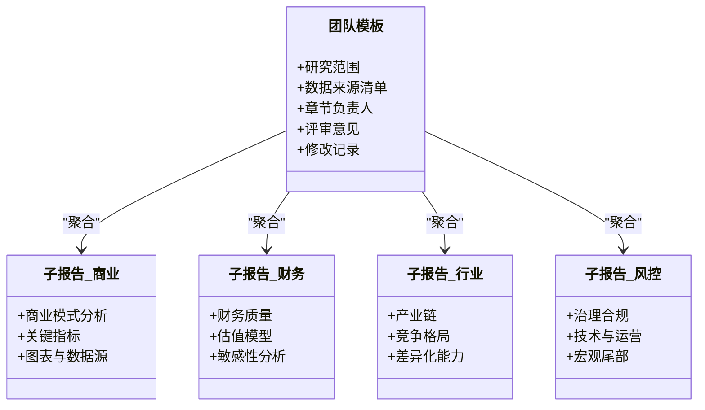
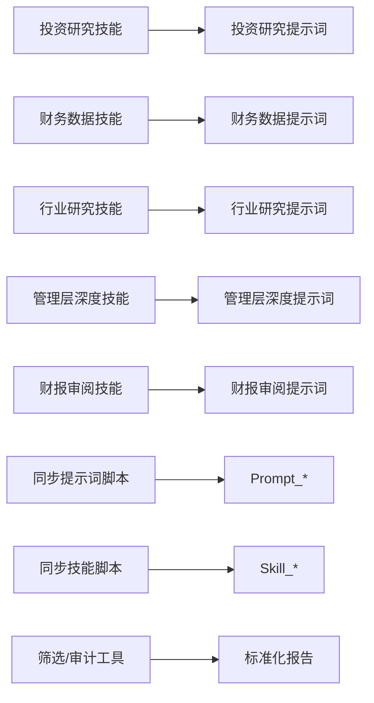

# 报告模板设计

<cite>
**本文引用的文件**   
- [README.md](file://README.md)
- [AGENTS.md](file://AGENTS.md)
- [CLAUDE.md](file://CLAUDE.md)
- [investment-research/SKILL.md](file://codex-skills/investment-research/SKILL.md)
- [financial-data/SKILL.md](file://codex-skills/financial-data/SKILL.md)
- [industry-research/SKILL.md](file://codex-skills/industry-research/SKILL.md)
- [management-deep-dive/SKILL.md](file://codex-skills/management-deep-dive/SKILL.md)
- [earnings-review/SKILL.md](file://codex-skills/earnings-review/SKILL.md)
- [investment-memo-craft/SKILL.md](file://codex-skills/investment-memo-craft/SKILL.md)
- [reports/腾讯/《看懂腾讯》/01-商业模式分析-段永平视角.md](file://reports/腾讯/《看懂腾讯》/01-商业模式分析-段永平视角.md)
- [reports/腾讯/《看懂腾讯》/02-财务估值分析-巴菲特视角.md](file://reports/腾讯/《看懂腾讯》/02-财务估值分析-巴菲特视角.md)
- [reports/腾讯/《看懂腾讯》/03-行业竞争分析-芒格视角.md](file://reports/腾讯/《看懂腾讯》/03-行业竞争分析-芒格视角.md)
- [reports/腾讯/《看懂腾讯》/04-风险管理层评估-李录视角.md](file://reports/腾讯/《看懂腾讯》/04-风险管理层评估-李录视角.md)
- [reports/拼多多/《看懂拼多多》/01-商业模式分析-段永平视角.md](file://reports/拼多多/《看懂拼多多》/01-商业模式分析-段永平视角.md)
- [reports/拼多多/《看懂拼多多》/02-财务估值分析-巴菲特视角.md](file://reports/拼多多/《看懂拼多多》/02-财务估值分析-巴菲特视角.md)
- [reports/拼多多/《看懂拼多多》/03-行业竞争分析-芒格视角.md](file://reports/拼多多/《看懂拼多多》/03-行业竞争分析-芒格视角.md)
- [reports/拼多多/《看懂拼多多》/04-风险管理层评估-李录视角.md](file://reports/拼多多/《看懂拼多多》/04-风险管理层评估-李录视角.md)
- [reports/泡泡玛特/《看懂泡泡玛特》/01-商业模式分析-段永平视角.md](file://reports/泡泡玛特/《看懂泡泡玛特》/01-商业模式分析-段永平视角.md)
- [reports/泡泡玛特/《看懂泡泡玛特》/02-财务估值分析-巴菲特视角.md](file://reports/泡泡玛特/《看懂泡泡玛特》/02-财务估值分析-巴菲特视角.md)
- [reports/泡泡玛特/《看懂泡泡玛特》/03-行业竞争分析-芒格视角.md](file://reports/泡泡玛特/《看懂泡泡玛特》/03-行业竞争分析-芒格视角.md)
- [reports/泡泡玛特/《看懂泡泡玛特》/04-风险管理层评估-李录视角.md](file://reports/泡泡玛特/《看懂泡泡玛特》/04-风险管理层评估-李录视角.md)
- [reports/美团/《看懂美团》/01-商业模式分析-段永平视角.md](file://reports/美团/《看懂美团》/01-商业模式分析-段永平视角.md)
- [reports/美团/《看懂美团》/04-风险管理层评估-李录视角.md](file://reports/美团/《看懂美团》/04-风险管理层评估-李录视角.md)
- [reports/小米/README.md](file://reports/小米/README.md)
- [reports/蚂蚁数科-team-20260417/README.md](file://reports/蚂蚁数科-team-20260417/README.md)
- [scripts/sync-codex-prompts.py](file://scripts/sync-codex-prompts.py)
- [scripts/sync-codex-skills.py](file://scripts/sync-codex-skills.py)
</cite>

## 目录
1. [引言](#引言)
2. [项目结构](#项目结构)
3. [核心组件](#核心组件)
4. [架构总览](#架构总览)
5. [详细组件分析](#详细组件分析)
6. [依赖关系分析](#依赖关系分析)
7. [性能与效率考量](#性能与效率考量)
8. [故障排查指南](#故障排查指南)
9. [结论](#结论)
10. [附录](#附录)

## 引言
本文件面向投资研究团队与个人研究者，系统化阐述“标准化投资研究报告”的模板结构与章节组织方式。围绕商业模式分析、财务估值分析、行业竞争分析、风险管理评估四大核心模块，说明其设计原理、内容要求、数据源引用规范与图表展示标准；并提供模板自定义方法与扩展机制（新增维度、调整顺序、定制输出格式），辅以大量实际案例与最佳实践，帮助快速构建专业、可复用的投研报告模板。

## 项目结构
仓库采用“技能（Skill）+ 提示词（Prompt）+ 示例报告 + 脚本工具”的组织方式：
- codex-skills：定义各研究环节的能力边界与流程规范（如投资研究、财务数据、行业研究、管理层深度、财报审阅等）。
- codex-prompts：为各环节提供结构化提示词，驱动生成一致的章节内容与风格。
- reports：按公司或主题归档最终报告与子报告，体现统一模板落地效果。
- scripts：同步与安装提示词/技能的自动化脚本，保障环境一致性。
- tools：辅助工具（筛选、审计、数据抓取等），支撑报告的数据与质量闭环。

图示来源
- [investment-research/SKILL.md](file://codex-skills/investment-research/SKILL.md)
- [financial-data/SKILL.md](file://codex-skills/financial-data/SKILL.md)
- [industry-research/SKILL.md](file://codex-skills/industry-research/SKILL.md)
- [management-deep-dive/SKILL.md](file://codex-skills/management-deep-dive/SKILL.md)
- [earnings-review/SKILL.md](file://codex-skills/earnings-review/SKILL.md)
- [investment-memo-craft/SKILL.md](file://codex-skills/investment-memo-craft/SKILL.md)
- [scripts/sync-codex-prompts.py](file://scripts/sync-codex-prompts.py)
- [scripts/sync-codex-skills.py](file://scripts/sync-codex-skills.py)

章节来源
- [README.md](file://README.md)
- [AGENTS.md](file://AGENTS.md)
- [CLAUDE.md](file://CLAUDE.md)

## 核心组件
- 标准化四段式模板
  - 商业模式分析（段永平视角）：聚焦价值创造逻辑、收入模型、客户与渠道、成本结构与关键资源。
  - 财务估值分析（巴菲特视角）：以自由现金流为核心，结合ROIC/WACC、增长假设与安全边际进行估值讨论。
  - 行业竞争分析（芒格视角）：从产业格局、进入壁垒、替代威胁、上下游议价能力等多维审视。
  - 风险管理评估（李录视角）：治理结构、合规风险、技术颠覆、宏观周期与尾部风险的系统性评估。
- 团队版模板
  - 在四段式基础上增加“团队分工、交叉验证、最终报告整合”的流程说明，便于多人协作与版本管理。
- 数据与图表规范
  - 数据源标注：明确数据来源、时间范围、口径差异与更新频率。
  - 图表标准：标题清晰、坐标轴单位完整、图例一致、趋势对比突出、敏感性分析可视化。

章节来源
- [investment-research/SKILL.md](file://codex-skills/investment-research/SKILL.md)
- [financial-data/SKILL.md](file://codex-skills/financial-data/SKILL.md)
- [industry-research/SKILL.md](file://codex-skills/industry-research/SKILL.md)
- [management-deep-dive/SKILL.md](file://codex-skills/management-deep-dive/SKILL.md)
- [earnings-review/SKILL.md](file://codex-skills/earnings-review/SKILL.md)
- [investment-memo-craft/SKILL.md](file://codex-skills/investment-memo-craft/SKILL.md)
- [reports/腾讯/《看懂腾讯》/01-商业模式分析-段永平视角.md](file://reports/腾讯/《看懂腾讯》/01-商业模式分析-段永平视角.md)
- [reports/腾讯/《看懂腾讯》/02-财务估值分析-巴菲特视角.md](file://reports/腾讯/《看懂腾讯》/02-财务估值分析-巴菲特视角.md)
- [reports/腾讯/《看懂腾讯》/03-行业竞争分析-芒格视角.md](file://reports/腾讯/《看懂腾讯》/03-行业竞争分析-芒格视角.md)
- [reports/腾讯/《看懂腾讯》/04-风险管理层评估-李录视角.md](file://reports/腾讯/《看懂腾讯》/04-风险管理层评估-李录视角.md)
- [reports/拼多多/《看懂拼多多》/01-商业模式分析-段永平视角.md](file://reports/拼多多/《看懂拼多多》/01-商业模式分析-段永平视角.md)
- [reports/拼多多/《看懂拼多多》/02-财务估值分析-巴菲特视角.md](file://reports/拼多多/《看懂拼多多》/02-财务估值分析-巴菲特视角.md)
- [reports/拼多多/《看懂拼多多》/03-行业竞争分析-芒格视角.md](file://reports/拼多多/《看懂拼多多》/03-行业竞争分析-芒格视角.md)
- [reports/拼多多/《看懂拼多多》/04-风险管理层评估-李录视角.md](file://reports/拼多多/《看懂拼多多》/04-风险管理层评估-李录视角.md)
- [reports/泡泡玛特/《看懂泡泡玛特》/01-商业模式分析-段永平视角.md](file://reports/泡泡玛特/《看懂泡泡玛特》/01-商业模式分析-段永平视角.md)
- [reports/泡泡玛特/《看懂泡泡玛特》/02-财务估值分析-巴菲特视角.md](file://reports/泡泡玛特/《看懂泡泡玛特》/02-财务估值分析-巴菲特视角.md)
- [reports/泡泡玛特/《看懂泡泡玛特》/03-行业竞争分析-芒格视角.md](file://reports/泡泡玛特/《看懂泡泡玛特》/03-行业竞争分析-芒格视角.md)
- [reports/泡泡玛特/《看懂泡泡玛特》/04-风险管理层评估-李录视角.md](file://reports/泡泡玛特/《看懂泡泡玛特》/04-风险管理层评估-李录视角.md)
- [reports/美团/《看懂美团》/01-商业模式分析-段永平视角.md](file://reports/美团/《看懂美团》/01-商业模式分析-段永平视角.md)
- [reports/美团/《看懂美团》/04-风险管理层评估-李录视角.md](file://reports/美团/《看懂美团》/04-风险管理层评估-李录视角.md)
- [reports/小米/README.md](file://reports/小米/README.md)
- [reports/蚂蚁数科-team-20260417/README.md](file://reports/蚂蚁数科-team-20260417/README.md)

## 架构总览
标准化报告由“技能定义→提示词驱动→章节生成→团队协作→工具校验”的流水线构成。每个章节对应一个或多个技能与提示词组合，确保内容结构稳定、风格一致、数据可追溯。

图示来源
- [investment-research/SKILL.md](file://codex-skills/investment-research/SKILL.md)
- [financial-data/SKILL.md](file://codex-skills/financial-data/SKILL.md)
- [industry-research/SKILL.md](file://codex-skills/industry-research/SKILL.md)
- [management-deep-dive/SKILL.md](file://codex-skills/management-deep-dive/SKILL.md)
- [earnings-review/SKILL.md](file://codex-skills/earnings-review/SKILL.md)
- [investment-memo-craft/SKILL.md](file://codex-skills/investment-memo-craft/SKILL.md)
- [scripts/sync-codex-prompts.py](file://scripts/sync-codex-prompts.py)
- [scripts/sync-codex-skills.py](file://scripts/sync-codex-skills.py)

## 详细组件分析

### 商业模式分析（段永平视角）
- 设计原理
  - 强调“企业如何赚钱”的本质问题，关注可持续性与可扩展性。
  - 通过收入结构、定价权、用户粘性与网络效应识别护城河。
- 内容要求
  - 业务模式拆解：产品/服务矩阵、目标客群、渠道与生态位。
  - 盈利路径：毛利率、费用率、资本开支与营运资金占用。
  - 关键指标：留存/复购、LTV/CAC、单店/单用户经济模型。
- 数据源引用规范
  - 年报/招股书/公告、第三方平台（券商研报、行业协会）、公开数据库。
  - 标注时间戳、口径说明与可比性约束。
- 图表展示标准
  - 收入结构饼图/堆叠柱状图、UE模型瀑布图、增长曲线与拐点标注。
- 实际案例参考
  - 腾讯、拼多多、泡泡玛特、美团的“商业模式分析”章节均遵循上述结构。

章节来源
- [investment-research/SKILL.md](file://codex-skills/investment-research/SKILL.md)
- [reports/腾讯/《看懂腾讯》/01-商业模式分析-段永平视角.md](file://reports/腾讯/《看懂腾讯》/01-商业模式分析-段永平视角.md)
- [reports/拼多多/《看懂拼多多》/01-商业模式分析-段永平视角.md](file://reports/拼多多/《看懂拼多多》/01-商业模式分析-段永平视角.md)
- [reports/泡泡玛特/《看懂泡泡玛特》/01-商业模式分析-段永平视角.md](file://reports/泡泡玛特/《看懂泡泡玛特》/01-商业模式分析-段永平视角.md)
- [reports/美团/《看懂美团》/01-商业模式分析-段永平视角.md](file://reports/美团/《看懂美团》/01-商业模式分析-段永平视角.md)

### 财务估值分析（巴菲特视角）
- 设计原理
  - 以自由现金流折现为核心，强调安全边际与长期复利。
  - 将会计利润还原为现金回报，剔除一次性与非经常性影响。
- 内容要求
  - 历史财务质量：收入确认、折旧摊销、资本化研发、表外负债。
  - 估值框架：WACC、永续增长率、情景分析与敏感性测试。
  - 同业对标：PE/PB/EV/EBITDA、FCF收益率、ROIC-WACC差值。
- 数据源引用规范
  - 财务报表、分析师预测、市场数据；注明汇率、税率、会计准则差异。
- 图表展示标准
  - DCF瀑布图、敏感性热力图、同业估值散点图、ROIC-WACC剪刀差图。
- 实际案例参考
  - 腾讯、拼多多、泡泡玛特的“财务估值分析”章节。

章节来源
- [financial-data/SKILL.md](file://codex-skills/financial-data/SKILL.md)
- [reports/腾讯/《看懂腾讯》/02-财务估值分析-巴菲特视角.md](file://reports/腾讯/《看懂腾讯》/02-财务估值分析-巴菲特视角.md)
- [reports/拼多多/《看懂拼多多》/02-财务估值分析-巴菲特视角.md](file://reports/拼多多/《看懂拼多多》/02-财务估值分析-巴菲特视角.md)
- [reports/泡泡玛特/《看懂泡泡玛特》/02-财务估值分析-巴菲特视角.md](file://reports/泡泡玛特/《看懂泡泡玛特》/02-财务估值分析-巴菲特视角.md)

### 行业竞争分析（芒格视角）
- 设计原理
  - 从产业经济学出发，关注结构性优势与长期竞争地位。
  - 用“逆向思维”审视潜在破坏者与替代方案。
- 内容要求
  - 产业链定位：上游资源/中游制造/下游渠道的价值分配。
  - 竞争格局：CRn、集中度变化、进入退出壁垒、政策与监管。
  - 差异化能力：品牌、专利、规模、转换成本、网络效应。
- 数据源引用规范
  - 行业白皮书、海关/统计局数据、招投标信息、专利与商标库。
- 图表展示标准
  - 产业链图谱、波特五力图、份额演变图、进入壁垒评分雷达图。
- 实际案例参考
  - 腾讯、拼多多、泡泡玛特的“行业竞争分析”章节。

章节来源
- [industry-research/SKILL.md](file://codex-skills/industry-research/SKILL.md)
- [reports/腾讯/《看懂腾讯》/03-行业竞争分析-芒格视角.md](file://reports/腾讯/《看懂腾讯》/03-行业竞争分析-芒格视角.md)
- [reports/拼多多/《看懂拼多多》/03-行业竞争分析-芒格视角.md](file://reports/拼多多/《看懂拼多多》/03-行业竞争分析-芒格视角.md)
- [reports/泡泡玛特/《看懂泡泡玛特》/03-行业竞争分析-芒格视角.md](file://reports/泡泡玛特/《看懂泡泡玛特》/03-行业竞争分析-芒格视角.md)

### 风险管理评估（李录视角）
- 设计原理
  - 以“最坏情况”为起点，系统梳理治理、合规、技术与宏观风险。
  - 强调风险的可量化与可对冲性，避免模糊定性。
- 内容要求
  - 公司治理：股权结构、激励约束、关联交易与信息披露质量。
  - 合规与政策：牌照、反垄断、数据安全、ESG相关风险。
  - 技术与运营：供应链脆弱性、产能瓶颈、关键人才流失。
  - 宏观与尾部：利率、汇率、地缘政治、黑天鹅事件压力测试。
- 数据源引用规范
  - 监管公告、诉讼与处罚记录、新闻舆情、第三方评级与审计报告。
- 图表展示标准
  - 风险矩阵（概率×影响）、压力测试结果、风险敞口占比图。
- 实际案例参考
  - 腾讯、拼多多、泡泡玛特、美团的“风险管理评估”章节。

章节来源
- [management-deep-dive/SKILL.md](file://codex-skills/management-deep-dive/SKILL.md)
- [earnings-review/SKILL.md](file://codex-skills/earnings-review/SKILL.md)
- [reports/腾讯/《看懂腾讯》/04-风险管理层评估-李录视角.md](file://reports/腾讯/《看懂腾讯》/04-风险管理层评估-李录视角.md)
- [reports/拼多多/《看懂拼多多》/04-风险管理层评估-李录视角.md](file://reports/拼多多/《看懂拼多多》/04-风险管理层评估-李录视角.md)
- [reports/泡泡玛特/《看懂泡泡玛特》/04-风险管理层评估-李录视角.md](file://reports/泡泡玛特/《看懂泡泡玛特》/04-风险管理层评估-李录视角.md)
- [reports/美团/《看懂美团》/04-风险管理层评估-李录视角.md](file://reports/美团/《看懂美团》/04-风险管理层评估-李录视角.md)

### 团队版模板与协作流程
- 设计要点
  - 明确角色分工（商业/财务/行业/风控），设置交叉评审与版本控制。
  - 使用README串联子报告，形成“模块化拼装”的最终报告。
- 内容要求
  - 团队README需包含：研究范围、数据来源清单、章节负责人、评审意见与修改记录。
- 实际案例参考
  - 小米、蚂蚁数科团队的README说明了协作与整合方式。

章节来源
- [reports/小米/README.md](file://reports/小米/README.md)
- [reports/蚂蚁数科-team-20260417/README.md](file://reports/蚂蚁数科-team-20260417/README.md)

## 依赖关系分析
- 技能与提示词
  - 每个章节由对应的Skill与Prompt共同驱动，保证结构与风格一致。
- 脚本与工程化
  - 同步脚本用于维护提示词与技能的一致性，减少人工维护成本。
- 工具链
  - 筛选与审计工具嵌入到报告生成流程中，提升数据准确性与可追溯性。

图示来源
- [investment-research/SKILL.md](file://codex-skills/investment-research/SKILL.md)
- [financial-data/SKILL.md](file://codex-skills/financial-data/SKILL.md)
- [industry-research/SKILL.md](file://codex-skills/industry-research/SKILL.md)
- [management-deep-dive/SKILL.md](file://codex-skills/management-deep-dive/SKILL.md)
- [earnings-review/SKILL.md](file://codex-skills/earnings-review/SKILL.md)
- [scripts/sync-codex-prompts.py](file://scripts/sync-codex-prompts.py)
- [scripts/sync-codex-skills.py](file://scripts/sync-codex-skills.py)

## 性能与效率考量
- 模板复用与模块化：将章节拆分为独立Markdown文件，支持并行撰写与增量更新。
- 数据缓存与去重：对高频数据建立本地缓存，减少重复抓取与计算。
- 自动化校验：在生成后自动执行数据一致性检查与图表规范校验，降低返工率。
- 版本管理：基于README与变更记录实现轻量级版本控制，便于回溯与复盘。

## 故障排查指南
- 常见问题
  - 章节缺失或顺序不一致：核对Skill与Prompt映射，确保模板配置正确。
  - 数据源不可用或过期：更新数据源清单与访问凭证，启用缓存与重试机制。
  - 图表不规范或缺少标注：运行图表规范检查，补充标题、单位与来源。
- 处理步骤
  - 使用同步脚本重新拉取最新提示词与技能。
  - 依据README中的“数据来源清单”逐项核验。
  - 对异常章节单独回归测试，逐步定位问题。

章节来源
- [scripts/sync-codex-prompts.py](file://scripts/sodex-prompts.py)
- [scripts/sync-codex-skills.py](file://scripts/sync-codex-skills.py)
- [reports/小米/README.md](file://reports/小米/README.md)
- [reports/蚂蚁数科-team-20260417/README.md](file://reports/蚂蚁数科-team-20260417/README.md)

## 结论
本模板体系以“四段式核心模块”为基础，结合“团队版协作流程”，实现了从数据到洞察再到决策支持的完整闭环。通过技能与提示词的解耦、脚本与工具的工程化支撑，以及严格的引用与图表规范，确保了报告的专业性、一致性与可复用性。建议在实际应用中持续迭代模板与工具链，沉淀高质量案例与最佳实践，进一步提升投研效率与质量。

## 附录
- 模板自定义方法
  - 新增分析维度：在Skill中定义新章节的职责与输入输出，在Prompt中给出结构化引导，并在reports下创建对应模板文件。
  - 调整章节顺序：修改README或主模板索引，保持依赖关系与引用路径一致。
  - 定制输出格式：统一Markdown样式与图表导出规则，必要时引入渲染脚本批量转换。
- 最佳实践清单
  - 每章必含“数据源与口径说明”“关键假设与不确定性”“图表与结论一一对应”。
  - 重要结论需有“反证与压力测试”作为支撑。
  - 团队版必须保留“评审意见与修改记录”，确保知识传承。