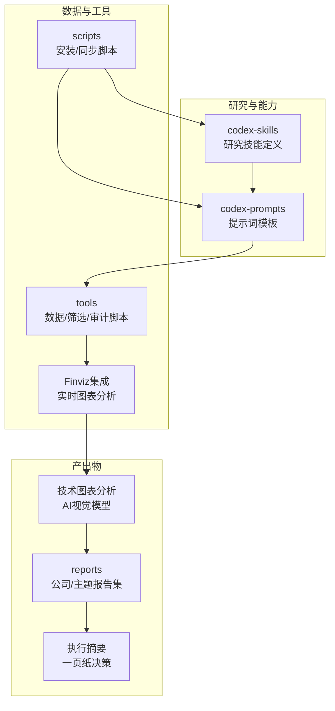
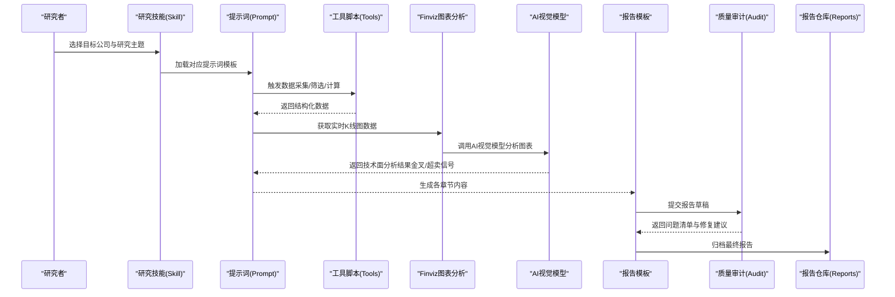
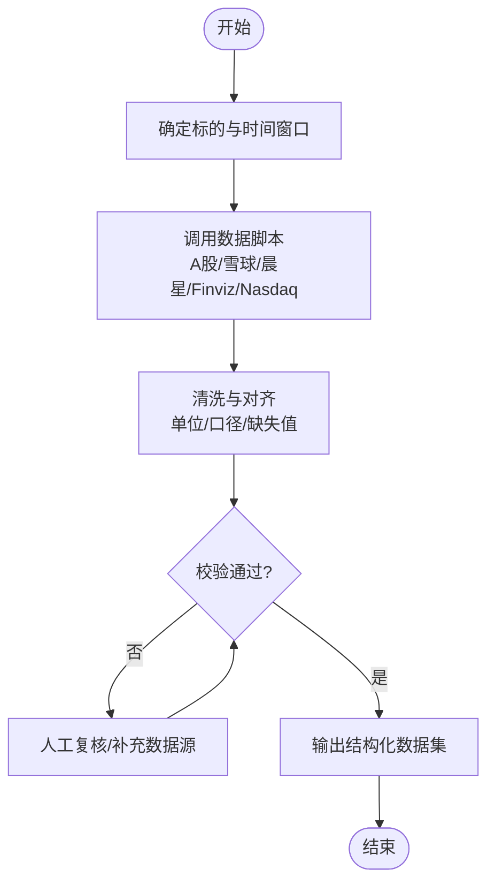
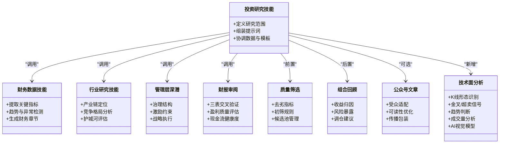
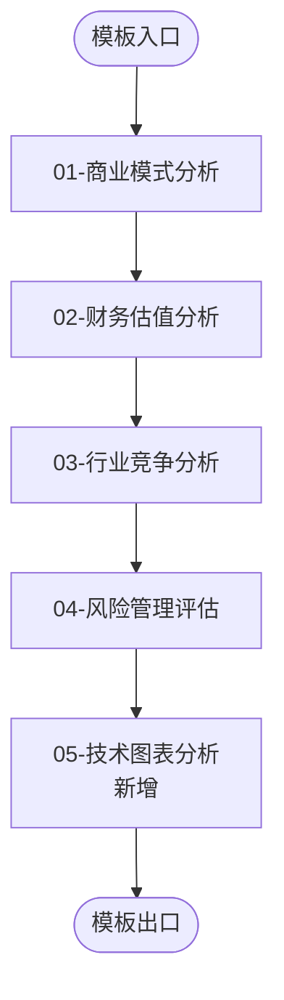
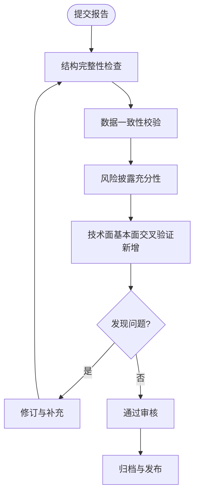
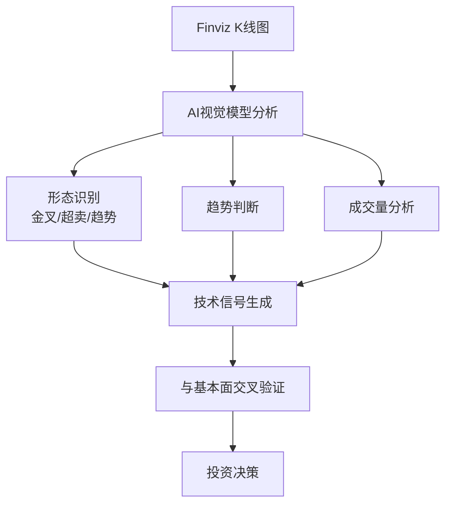
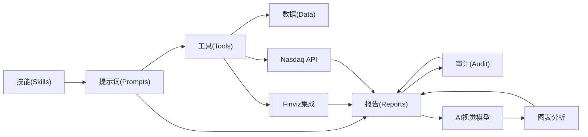

# 报告生成系统

<cite>
**本文引用的文件**   
- [README_EN.md](file://README_EN.md)
- [AGENTS.md](file://AGENTS.md)
- [CLAUDE.md](file://CLAUDE.md)
- [investment-research/SKILL.md](file://codex-skills/investment-research/SKILL.md)
- [financial-data/SKILL.md](file://codex-skills/financial-data/SKILL.md)
- [industry-research/SKILL.md](file://codex-skills/industry-research/SKILL.md)
- [management-deep-dive/SKILL.md](file://codex-skills/management-deep-dive/SKILL.md)
- [earnings-review/SKILL.md](file://codex-skills/earnings-review/SKILL.md)
- [quality-screen/SKILL.md](file://codex-skills/quality-screen/SKILL.md)
- [portfolio-review/SKILL.md](file://codex-skills/portfolio-review/SKILL.md)
- [wechat-article/SKILL.md](file://codex-skills/wechat-article/SKILL.md)
- [investment-memo-craft/SKILL.md](file://codex-skills/investment-memo-craft/SKILL.md)
- [investment-memo-craft/agents/openai.yaml](file://codex-skills/investment-memo-craft/agents/openai.yaml)
- [tools/report_audit.py](file://tools/report_audit.py)
- [tools/stock_screener.py](file://tools/stock_screener.py)
- [tools/morningstar_fair_value.py](file://tools/morningstar_fair_value.py)
- [tools/ashare_data.py](file://tools/ashare_data.py)
- [tools/xueqiu_scraper.py](file://tools/xueqiu_scraper.py)
- [tools/finviz_quote.py](file://tools/finviz_quote.py)
- [scripts/sync-codex-prompts.py](file://scripts/sync-codex-prompts.py)
- [scripts/sync-codex-skills.py](file://scripts/sync-codex-skills.py)
- [reports/拼多多/《看懂拼多多》/01-商业模式分析-段永平视角.md](file://reports/拼多多/《看懂拼多多》/01-商业模式分析-段永平视角.md)
- [reports/拼多多/《看懂拼多多》/02-财务估值分析-巴菲特视角.md](file://reports/拼多多/《看懂拼多多》/02-财务估值分析-巴菲特视角.md)
- [reports/拼多多/《看懂拼多多》/03-行业竞争分析-芒格视角.md](file://reports/拼多多/《看懂拼多多》/03-行业竞争分析-芒格视角.md)
- [reports/拼多多/《看懂拼多多》/04-风险管理层评估-李录视角.md](file://reports/拼多多/《看懂拼多多》/04-风险管理层评估-李录视角.md)
- [reports/腾讯/《看懂腾讯》/01-商业模式分析-段永平视角.md](file://reports/腾讯/《看懂腾讯》/01-商业模式分析-段永平视角.md)
- [reports/腾讯/《看懂腾讯》/02-财务估值分析-巴菲特视角.md](file://reports/腾讯/《看懂腾讯》/02-财务估值分析-巴菲特视角.md)
- [reports/腾讯/《看懂腾讯》/03-行业竞争分析-芒格视角.md](file://reports/腾讯/《看懂腾讯》/03-行业竞争分析-芒格视角.md)
- [reports/腾讯/《看懂腾讯》/04-风险管理层评估-李录视角.md](file://reports/腾讯/《看懂腾讯》/04-风险管理层评估-李录视角.md)
- [reports/美团/《看懂美团》/01-商业模式分析-段永平视角.md](file://reports/美团/《看懂美团》/01-商业模式分析-段永平视角.md)
- [reports/美团/《看懂美团》/02-财务估值分析-巴菲特视角.md](file://reports/美团/《看懂美团》/02-财务估值分析-巴菲特视角.md)
- [reports/美团/《看懂美团》/03-行业竞争分析-芒格视角.md](file://reports/美团/《看懂美团》/03-行业竞争分析-芒格视角.md)
- [reports/美团/《看懂美团》/04-风险管理层评估-李录视角.md](file://reports/美团/《看懂美团》/04-风险管理层评估-李录视角.md)
- [reports/泡泡玛特/《看懂泡泡玛特》/01-商业模式分析-段永平视角.md](file://reports/泡泡玛特/《看懂泡泡玛特》/01-商业模式分析-段永平视角.md)
- [reports/泡泡玛特/《看懂泡泡玛特》/02-财务估值分析-巴菲特视角.md](file://reports/泡泡玛特/《看懂泡泡玛特》/02-财务估值分析-巴菲特视角.md)
- [reports/泡泡玛特/《看懂泡泡玛特》/03-行业竞争分析-芒格视角.md](file://reports/泡泡玛特/《看懂泡泡玛特》/03-行业竞争分析-芒格视角.md)
- [reports/泡泡玛特/《看懂泡泡玛特》/04-风险管理层评估-李录视角.md](file://reports/泡泡玛特/《看懂泡泡玛特》/04-风险管理层评估-李录视角.md)
- [reports/小米/《看懂小米》/01-商业模式分析-段永平视角.md](file://reports/小米/《看懂小米》/01-商业模式分析-段永平视角.md)
- [reports/小米/《看懂小米》/02-财务估值分析-巴菲特视角.md](file://reports/小米/《看懂小米》/02-财务估值分析-巴菲特视角.md)
- [reports/小米/《看懂小米》/03-行业竞争分析-芒格视角.md](file://reports/小米/《看懂小米》/03-行业竞争分析-芒格视角.md)
- [reports/小米/《看懂小米》/04-风险管理层评估-李录视角.md](file://reports/小米/《看懂小米》/04-风险管理层评估-李录视角.md)
- [reports/2026-08-08-tech-50pct-upside-scan/07-technical-chart-analysis.md](file://reports/2026-08-08-tech-50pct-upside-scan/07-technical-chart-analysis.md)
- [reports/2026-08-08-tech-50pct-upside-scan/EXECUTIVE-SUMMARY.md](file://reports/2026-08-08-tech-50pct-upside-scan/EXECUTIVE-SUMMARY.md)
- [reports/2026-08-08-h2-tech-scan/finviz-pull.mjs](file://reports/2026-08-08-h2-tech-scan/finviz-pull.mjs)
- [reports/2026-08-08-h2-tech-scan/pipeline.mjs](file://reports/2026-08-08-h2-tech-scan/pipeline.mjs)
- [reports/2026-08-08-h2-tech-scan/score.mjs](file://reports/2026-08-08-h2-tech-scan/score.mjs)
- [scan_tech.py](file://scan_tech.py)
- [layer1_scan.py](file://layer1_scan.py)
</cite>

## 更新摘要
**所做更改**
- 新增AI视觉模型技术图表分析章节，集成Finviz实时K线图读取与自动模式识别（金叉、超卖条件）
- 增加一页纸执行摘要功能，支持快速决策与操作指导
- 扩展150+公司技术板块扫描能力，覆盖科技全谱系标的
- 完善技术面与基本面交叉验证流程
- 增强数据源整合，包括Finviz、Nasdaq API等多源数据融合
- 实现精确入场点识别，结合基本面分析与技术时机指标

## 目录
1. [引言](#引言)
2. [项目结构](#项目结构)
3. [核心组件](#核心组件)
4. [架构总览](#架构总览)
5. [详细组件分析](#详细组件分析)
6. [依赖关系分析](#依赖关系分析)
7. [性能与可扩展性](#性能与可扩展性)
8. [故障排查指南](#故障排查指南)
9. [结论](#结论)
10. [附录](#附录)

## 引言
本文件系统性地梳理"标准化投资研究报告"的生成流程，覆盖数据收集、AI分析、模板填充、格式转换与质量控制等关键环节。仓库以"技能（Skill）+提示词（Prompt）+工具脚本 + 示例报告"的方式组织，形成从研究到成稿的一体化流水线。**最新更新**集成了AI视觉模型进行技术图表分析，通过Finviz实时K线图读取实现自动模式识别（包括金叉和超卖条件），并支持150+公司的全面技术板块扫描。通过多角色视角（如段永平、巴菲特、芒格、李录）的结构化章节，确保报告在商业模式、财务估值、行业竞争与风险管理四个维度具备一致性与深度。

## 项目结构
仓库采用"能力模块化 + 产出文档化"的组织方式：
- codex-skills：定义可复用的研究能力（如投资研究、财务数据、行业研究、管理层深潜、财报审阅、质量筛选、组合回顾、公众号文章等）。
- codex-prompts：面向不同任务的高质量提示词模板，驱动AI输出结构化内容。
- tools：数据抓取、筛选、审计与第三方数据对接脚本。
- reports：按公司与主题归档的研究成果，包含标准四章式报告与专题分析。
- scripts：安装与同步辅助脚本，便于将提示词与技能分发到工作区。

**图表来源**
- [investment-research/SKILL.md](file://codex-skills/investment-research/SKILL.md)
- [financial-data/SKILL.md](file://codex-skills/financial-data/SKILL.md)
- [industry-research/SKILL.md](file://codex-skills/industry-research/SKILL.md)
- [management-deep-dive/SKILL.md](file://codex-skills/management-deep-dive/SKILL.md)
- [earnings-review/SKILL.md](file://codex-skills/earnings-review/SKILL.md)
- [quality-screen/SKILL.md](file://codex-skills/quality-screen/SKILL.md)
- [portfolio-review/SKILL.md](file://codex-skills/portfolio-review/SKILL.md)
- [wechat-article/SKILL.md](file://codex-skills/wechat-article/SKILL.md)
- [tools/report_audit.py](file://tools/report_audit.py)
- [tools/stock_screener.py](file://tools/stock_screener.py)
- [tools/morningstar_fair_value.py](file://tools/morningstar_fair_value.py)
- [tools/ashare_data.py](file://tools/ashare_data.py)
- [tools/xueqiu_scraper.py](file://tools/xueqiu_scraper.py)
- [tools/finviz_quote.py](file://tools/finviz_quote.py)
- [scripts/sync-codex-prompts.py](file://scripts/sync-codex-prompts.py)
- [scripts/sync-codex-skills.py](file://scripts/sync-codex-skills.py)

章节来源
- [README_EN.md](file://README_EN.md)
- [AGENTS.md](file://AGENTS.md)
- [CLAUDE.md](file://CLAUDE.md)

## 核心组件
- 研究技能（Skills）：将复杂研究任务拆解为可编排的步骤，明确输入、处理逻辑与输出规范。
- 提示词（Prompts）：提供高质量、可复用的指令模板，保证AI输出的结构与风格一致性。
- 工具脚本（Tools）：负责数据采集、筛选、审计与外部数据对接，支撑报告的客观事实与量化依据。
- **新增**：AI视觉模型集成：通过Finviz图表读取实现技术面分析，支持自动形态识别（金叉、超卖条件）和趋势判断。
- **新增**：执行摘要生成：一键生成一页纸投资决策摘要，包含买卖建议、目标价和止损位。
- **新增**：大规模技术扫描：支持150+公司技术板块的全面扫描和分析。
- 报告模板与范例（Reports）：以"四章式"结构沉淀标准章节范式，并积累大量实战案例。

章节来源
- [investment-research/SKILL.md](file://codex-skills/investment-research/SKILL.md)
- [financial-data/SKILL.md](file://codex-skills/financial-data/SKILL.md)
- [industry-research/SKILL.md](file://codex-skills/industry-research/SKILL.md)
- [management-deep-dive/SKILL.md](file://codex-skills/management-deep-dive/SKILL.md)
- [earnings-review/SKILL.md](file://codex-skills/earnings-review/SKILL.md)
- [quality-screen/SKILL.md](file://codex-skills/quality-screen/SKILL.md)
- [portfolio-review/SKILL.md](file://codex-skills/portfolio-review/SKILL.md)
- [wechat-article/SKILL.md](file://codex-skills/wechat-article/SKILL.md)

## 架构总览
报告生成的端到端流程如下：
- 需求与范围：基于目标公司与研究主题，选择对应技能与提示词。
- 数据收集：使用工具脚本拉取行情、基本面、新闻与第三方估值数据。
- **新增**：技术面分析：通过AI视觉模型读取Finviz实时K线图，自动识别技术形态（金叉、超卖条件）和趋势。
- AI分析：按技能步骤调用提示词，完成商业模式、财务估值、行业竞争与管理治理等模块的分析。
- 模板填充：将AI输出按"四章式"结构写入报告模板，统一标题、层级与引用规范。
- **新增**：执行摘要生成：自动生成一页纸投资决策摘要，包含关键数据和操作建议。
- 格式转换：根据发布渠道（PDF/Markdown/公众号）进行排版与导出。
- 质量控制：运行审计脚本校验完整性、数据一致性与风险披露充分性。
- 归档与复用：将最终报告归档至reports，并沉淀为后续研究的素材。

**图表来源**
- [investment-research/SKILL.md](file://codex-skills/investment-research/SKILL.md)
- [financial-data/SKILL.md](file://codex-skills/financial-data/SKILL.md)
- [industry-research/SKILL.md](file://codex-skills/industry-research/SKILL.md)
- [management-deep-dive/SKILL.md](file://codex-skills/management-deep-dive/SKILL.md)
- [earnings-review/SKILL.md](file://codex-skills/earnings-review/SKILL.md)
- [tools/report_audit.py](file://tools/report_audit.py)
- [tools/stock_screener.py](file://tools/stock_screener.py)
- [tools/morningstar_fair_value.py](file://tools/morningstar_fair_value.py)
- [tools/ashare_data.py](file://tools/ashare_data.py)
- [tools/xueqiu_scraper.py](file://tools/xueqiu_scraper.py)
- [tools/finviz_quote.py](file://tools/finviz_quote.py)

## 详细组件分析

### 数据收集与预处理
- A股数据接入：提供A股基础数据获取能力，用于构建基本面与行情指标。
- 雪球信息抓取：支持从公开平台抓取新闻、讨论与公告摘要，增强时效性。
- 晨星公允价值：对接第三方公允价值数据，作为估值锚点之一。
- 股票筛选器：内置去劣与初筛规则，快速收敛候选池。
- **新增**：Finviz实时数据：通过Python脚本直接抓取Finviz报价页面，获取实时价格、市值、PE等关键指标。
- **新增**：Nasdaq API集成：直接从纳斯达克API获取科技公司板块数据。

**图表来源**
- [tools/ashare_data.py](file://tools/ashare_data.py)
- [tools/xueqiu_scraper.py](file://tools/xueqiu_scraper.py)
- [tools/morningstar_fair_value.py](file://tools/morningstar_fair_value.py)
- [tools/stock_screener.py](file://tools/stock_screener.py)
- [tools/finviz_quote.py](file://tools/finviz_quote.py)
- [reports/2026-08-08-h2-tech-scan/pipeline.mjs](file://reports/2026-08-08-h2-tech-scan/pipeline.mjs)

章节来源
- [tools/ashare_data.py](file://tools/ashare_data.py)
- [tools/xueqiu_scraper.py](file://tools/xueqiu_scraper.py)
- [tools/morningstar_fair_value.py](file://tools/morningstar_fair_value.py)
- [tools/stock_screener.py](file://tools/stock_screener.py)
- [tools/finviz_quote.py](file://tools/finviz_quote.py)
- [reports/2026-08-08-h2-tech-scan/pipeline.mjs](file://reports/2026-08-08-h2-tech-scan/pipeline.mjs)

### AI分析与模板填充
- 投资研究技能：定义从宏观到微观的研究路径，串联数据与洞察。
- 财务数据技能：聚焦关键财务指标、趋势与异常识别。
- 行业研究技能：刻画产业链位置、竞争格局与进入壁垒。
- 管理层深潜：评估治理结构、激励约束与战略执行。
- 财报审阅：围绕利润表、资产负债表与现金流三张表进行交叉验证。
- 质量筛选：结合定量与定性标准，剔除低质量标的。
- 组合回顾：对持仓表现与归因进行复盘。
- 公众号文章：将专业内容转化为可读性更强的传播版本。
- **新增**：技术面分析：通过AI视觉模型分析K线图，识别趋势、形态（金叉、超卖）和技术信号。

**图表来源**
- [investment-research/SKILL.md](file://codex-skills/investment-research/SKILL.md)
- [financial-data/SKILL.md](file://codex-skills/financial-data/SKILL.md)
- [industry-research/SKILL.md](file://codex-skills/industry-research/SKILL.md)
- [management-deep-dive/SKILL.md](file://codex-skills/management-deep-dive/SKILL.md)
- [earnings-review/SKILL.md](file://codex-skills/earnings-review/SKILL.md)
- [quality-screen/SKILL.md](file://codex-skills/quality-screen/SKILL.md)
- [portfolio-review/SKILL.md](file://codex-skills/portfolio-review/SKILL.md)
- [wechat-article/SKILL.md](file://codex-skills/wechat-article/SKILL.md)

章节来源
- [investment-research/SKILL.md](file://codex-skills/investment-research/SKILL.md)
- [financial-data/SKILL.md](file://codex-skills/financial-data/SKILL.md)
- [industry-research/SKILL.md](file://codex-skills/industry-research/SKILL.md)
- [management-deep-dive/SKILL.md](file://codex-skills/management-deep-dive/SKILL.md)
- [earnings-review/SKILL.md](file://codex-skills/earnings-review/SKILL.md)
- [quality-screen/SKILL.md](file://codex-skills/quality-screen/SKILL.md)
- [portfolio-review/SKILL.md](file://codex-skills/portfolio-review/SKILL.md)
- [wechat-article/SKILL.md](file://codex-skills/wechat-article/SKILL.md)

### 报告模板结构与内容组织
标准化的"四章式"报告模板包括：
- 商业模式分析（段永平视角）：聚焦价值创造逻辑、收入模式与增长飞轮。
- 财务估值分析（巴菲特视角）：强调自由现金流、ROIC与安全边际。
- 行业竞争分析（芒格视角）：关注竞争格局、替代威胁与生态位。
- 风险管理评估（李录视角）：涵盖治理、合规、杠杆与尾部风险。
- **新增**：技术图表分析（第八维度）：通过AI视觉模型分析Finviz实时K线图，识别趋势、形态（金叉、超卖）和技术信号。

**图表来源**
- [reports/拼多多/《看懂拼多多》/01-商业模式分析-段永平视角.md](file://reports/拼多多/《看懂拼多多》/01-商业模式分析-段永平视角.md)
- [reports/拼多多/《看懂拼多多》/02-财务估值分析-巴菲特视角.md](file://reports/拼多多/《看懂拼多多》/02-财务估值分析-巴菲特视角.md)
- [reports/拼多多/《看懂拼多多》/03-行业竞争分析-芒格视角.md](file://reports/拼多多/《看懂拼多多》/03-行业竞争分析-芒格视角.md)
- [reports/拼多多/《看懂拼多多》/04-风险管理层评估-李录视角.md](file://reports/拼多多/《看懂拼多多》/04-风险管理层评估-李录视角.md)
- [reports/腾讯/《看懂腾讯》/01-商业模式分析-段永平视角.md](file://reports/腾讯/《看懂腾讯》/01-商业模式分析-段永平视角.md)
- [reports/腾讯/《看懂腾讯》/02-财务估值分析-巴菲特视角.md](file://reports/腾讯/《看懂腾讯》/02-财务估值分析-巴菲特视角.md)
- [reports/腾讯/《看懂腾讯》/03-行业竞争分析-芒格视角.md](file://reports/腾讯/《看懂腾讯》/03-行业竞争分析-芒格视角.md)
- [reports/腾讯/《看懂腾讯》/04-风险管理层评估-李录视角.md](file://reports/腾讯/《看懂腾讯》/04-风险管理层评估-李录视角.md)
- [reports/美团/《看懂美团》/01-商业模式分析-段永平视角.md](file://reports/美团/《看懂美团》/01-商业模式分析-段永平视角.md)
- [reports/美团/《看懂美团》/02-财务估值分析-巴菲特视角.md](file://reports/美团/《看懂美团》/02-财务估值分析-巴菲特视角.md)
- [reports/美团/《看懂美团》/03-行业竞争分析-芒格视角.md](file://reports/美团/《看懂美团》/03-行业竞争分析-芒格视角.md)
- [reports/美团/《看懂美团》/04-风险管理层评估-李录视角.md](file://reports/美团/《看懂美团》/04-风险管理层评估-李录视角.md)
- [reports/泡泡玛特/《看懂泡泡玛特》/01-商业模式分析-段永平视角.md](file://reports/泡泡玛特/《看懂泡泡玛特》/01-商业模式分析-段永平视角.md)
- [reports/泡泡玛特/《看懂泡泡玛特》/02-财务估值分析-巴菲特视角.md](file://reports/泡泡玛特/《看懂泡泡玛特》/02-财务估值分析-巴菲特视角.md)
- [reports/泡泡玛特/《看懂泡泡玛特》/03-行业竞争分析-芒格视角.md](file://reports/泡泡玛特/《看懂泡泡玛特》/03-行业竞争分析-芒格视角.md)
- [reports/泡泡玛特/《看懂泡泡玛特》/04-风险管理层评估-李录视角.md](file://reports/泡泡玛特/《看懂泡泡玛特》/04-风险管理层评估-李录视角.md)
- [reports/小米/《看懂小米》/01-商业模式分析-段永平视角.md](file://reports/小米/《看懂小米》/01-商业模式分析-段永平视角.md)
- [reports/小米/《看懂小米》/02-财务估值分析-巴菲特视角.md](file://reports/小米/《看懂小米》/02-财务估值分析-巴菲特视角.md)
- [reports/小米/《看懂小米》/03-行业竞争分析-芒格视角.md](file://reports/小米/《看懂小米》/03-行业竞争分析-芒格视角.md)
- [reports/小米/《看懂小米》/04-风险管理层评估-李录视角.md](file://reports/小米/《看懂小米》/04-风险管理层评估-李录视角.md)

章节来源
- [reports/拼多多/《看懂拼多多》/01-商业模式分析-段永平视角.md](file://reports/拼多多/《看懂拼多多》/01-商业模式分析-段永平视角.md)
- [reports/拼多多/《看懂拼多多》/02-财务估值分析-巴菲特视角.md](file://reports/拼多多/《看懂拼多多》/02-财务估值分析-巴菲特视角.md)
- [reports/拼多多/《看懂拼多多》/03-行业竞争分析-芒格视角.md](file://reports/拼多多/《看懂拼多多》/03-行业竞争分析-芒格视角.md)
- [reports/拼多多/《看懂拼多多》/04-风险管理层评估-李录视角.md](file://reports/拼多多/《看懂拼多多》/04-风险管理层评估-李录视角.md)
- [reports/腾讯/《看懂腾讯》/01-商业模式分析-段永平视角.md](file://reports/腾讯/《看懂腾讯》/01-商业模式分析-段永平视角.md)
- [reports/腾讯/《看懂腾讯》/02-财务估值分析-巴菲特视角.md](file://reports/腾讯/《看懂腾讯》/02-财务估值分析-巴菲特视角.md)
- [reports/腾讯/《看懂腾讯》/03-行业竞争分析-芒格视角.md](file://reports/腾讯/《看懂腾讯》/03-行业竞争分析-芒格视角.md)
- [reports/腾讯/《看懂腾讯》/04-风险管理层评估-李录视角.md](file://reports/腾讯/《看懂腾讯》/04-风险管理层评估-李录视角.md)
- [reports/美团/《看懂美团》/01-商业模式分析-段永平视角.md](file://reports/美团/《看懂美团》/01-商业模式分析-段永平视角.md)
- [reports/美团/《看懂美团》/02-财务估值分析-巴菲特视角.md](file://reports/美团/《看懂美团》/02-财务估值分析-巴菲特视角.md)
- [reports/美团/《看懂美团》/03-行业竞争分析-芒格视角.md](file://reports/美团/《看懂美团》/03-行业竞争分析-芒格视角.md)
- [reports/美团/《看懂美团》/04-风险管理层评估-李录视角.md](file://reports/美团/《看懂美团》/04-风险管理层评估-李录视角.md)
- [reports/泡泡玛特/《看懂泡泡玛特》/01-商业模式分析-段永平视角.md](file://reports/泡泡玛特/《看懂泡泡玛特》/01-商业模式分析-段永平视角.md)
- [reports/泡泡玛特/《看懂泡泡玛特》/02-财务估值分析-巴菲特视角.md](file://reports/泡泡玛特/《看懂泡泡玛特》/02-财务估值分析-巴菲特视角.md)
- [reports/泡泡玛特/《看懂泡泡玛特》/03-行业竞争分析-芒格视角.md](file://reports/泡泡玛特/《看懂泡泡玛特》/03-行业竞争分析-芒格视角.md)
- [reports/泡泡玛特/《看懂泡泡玛特》/04-风险管理层评估-李录视角.md](file://reports/泡泡玛特/《看懂泡泡玛特》/04-风险管理层评估-李录视角.md)
- [reports/小米/《看懂小米》/01-商业模式分析-段永平视角.md](file://reports/小米/《看懂小米》/01-商业模式分析-段永平视角.md)
- [reports/小米/《看懂小米》/02-财务估值分析-巴菲特视角.md](file://reports/小米/《看懂小米》/02-财务估值分析-巴菲特视角.md)
- [reports/小米/《看懂小米》/03-行业竞争分析-芒格视角.md](file://reports/小米/《看懂小米》/03-行业竞争分析-芒格视角.md)
- [reports/小米/《看懂小米》/04-风险管理层评估-李录视角.md](file://reports/小米/《看懂小米》/04-风险管理层评估-李录视角.md)

### 质量控制与审核流程
- 审计脚本：检查报告完整性、数据引用、前后一致性与风险提示是否充分。
- 审核要点：
  - 数据口径与时间窗一致
  - 关键假设与敏感性说明
  - 风险因素与反证证据
  - 结论与建议的可操作性
  - **新增**：技术面与基本面交叉验证

**图表来源**
- [tools/report_audit.py](file://tools/report_audit.py)

章节来源
- [tools/report_audit.py](file://tools/report_audit.py)

### 自定义模板与输出格式
- 新增章节：在现有"四章式"基础上扩展子章节（如技术路线、供应链、用户画像等），保持统一的标题与层级。
- 定制视角：通过替换或新增提示词，引入新的分析视角（如ESG、地缘政治、监管政策）。
- 输出格式：
  - Markdown：适合协作与版本控制
  - PDF：适合正式交付
  - 公众号文章：借助"公众号文章"技能进行可读性优化与传播包装
  - **新增**：执行摘要：一键生成一页纸投资决策摘要，包含关键数据和操作建议

章节来源
- [wechat-article/SKILL.md](file://codex-skills/wechat-article/SKILL.md)
- [investment-memo-craft/SKILL.md](file://codex-skills/investment-memo-craft/SKILL.md)
- [investment-memo-craft/agents/openai.yaml](file://codex-skills/investment-memo-craft/agents/openai.yaml)

### 实际案例与最佳实践
- 案例一：拼多多——从商业模式到估值的闭环验证
  - 重点：订阅与网络效应、费用率优化、自由现金流转化
  - 参考路径：[拼多多-四章式报告](file://reports/拼多多/《看懂拼多多》/01-商业模式分析-段永平视角.md)
- 案例二：腾讯——生态护城河与多元变现
  - 重点：游戏与广告双引擎、视频号增量、国际化布局
  - 参考路径：[腾讯-四章式报告](file://reports/腾讯/《看懂腾讯》/01-商业模式分析-段永平视角.md)
- 案例三：美团——本地生活竞争与UE模型
  - 重点：单均经济模型、履约成本、供给侧效率
  - 参考路径：[美团-四章式报告](file://reports/美团/《看懂美团》/01-商业模式分析-段永平视角.md)
- 案例四：泡泡玛特——IP运营与库存周转
  - 重点：IP生命周期、渠道扩张、库存与现金流匹配
  - 参考路径：[泡泡玛特-四章式报告](file://reports/泡泡玛特/《看懂泡泡玛特》/01-商业模式分析-段永平视角.md)
- 案例五：小米——硬件+互联网的双轮驱动
  - 重点：毛利率结构、互联网服务占比、全球化与供应链
  - 参考路径：[小米-四章式报告](file://reports/小米/《看懂小米》/01-商业模式分析-段永平视角.md)
- **新增**：案例六：CRM与FICO——技术面与基本面共振分析
  - 重点：AI视觉模型读取Finviz图表，识别上升趋势、金叉信号和超卖条件
  - 参考路径：[技术图表分析报告](file://reports/2026-08-08-tech-50pct-upside-scan/07-technical-chart-analysis.md)

章节来源
- [reports/拼多多/《看懂拼多多》/01-商业模式分析-段永平视角.md](file://reports/拼多多/《看懂拼多多》/01-商业模式分析-段永平视角.md)
- [reports/腾讯/《看懂腾讯》/01-商业模式分析-段永平视角.md](file://reports/腾讯/《看懂腾讯》/01-商业模式分析-段永平视角.md)
- [reports/美团/《看懂美团》/01-商业模式分析-段永平视角.md](file://reports/美团/《看懂美团》/01-商业模式分析-段永平视角.md)
- [reports/泡泡玛特/《看懂泡泡玛特》/01-商业模式分析-段永平视角.md](file://reports/泡泡玛特/《看懂泡泡玛特》/01-商业模式分析-段永平视角.md)
- [reports/小米/《看懂小米》/01-商业模式分析-段永平视角.md](file://reports/小米/《看懂小米》/01-商业模式分析-段永平视角.md)
- [reports/2026-08-08-tech-50pct-upside-scan/07-technical-chart-analysis.md](file://reports/2026-08-08-tech-50pct-upside-scan/07-technical-chart-analysis.md)

### AI视觉模型技术图表分析
**新增功能**：通过AI视觉模型直接分析Finviz实时K线图，实现自动化的技术面分析，包括金叉和超卖条件的识别。

#### 技术图表分析流程
1. **数据获取**：从Finviz网站抓取实时K线图
2. **图像分析**：使用AI视觉模型（mcp__4_5v_mcp__analyze_image）识别图表中的关键要素
3. **形态识别**：自动识别趋势线、支撑阻力位、成交量变化、金叉和超卖信号
4. **信号生成**：生成买入/卖出/持有等技术信号
5. **交叉验证**：与技术指标和基本面数据进行交叉验证

#### 实际应用案例
以CRM（Salesforce）和FICO（Fair Isaac）为例：
- **CRM技术分析**：识别出上升趋势、金叉信号（50日均线>200日均线）和放量突破，给出强烈看涨信号
- **FICO技术分析**：识别出超卖信号（RSI 37.32）和底部支撑，给出反弹概率高的判断
- **交叉验证**：将技术面信号与基本面数据结合，提高决策准确性

**图表来源**
- [reports/2026-08-08-tech-50pct-upside-scan/07-technical-chart-analysis.md](file://reports/2026-08-08-tech-50pct-upside-scan/07-technical-chart-analysis.md)
- [tools/finviz_quote.py](file://tools/finviz_quote.py)

章节来源
- [reports/2026-08-08-tech-50pct-upside-scan/07-technical-chart-analysis.md](file://reports/2026-08-08-tech-50pct-upside-scan/07-technical-chart-analysis.md)
- [tools/finviz_quote.py](file://tools/finviz_quote.py)

### 一页纸执行摘要
**新增功能**：自动生成简洁的执行摘要，包含关键投资决策信息。

#### 执行摘要内容结构
- **研究规模**：迭代次数、扫描公司数量、Agent返回情况
- **最终推荐**：具体的买卖建议和仓位配置
- **目标价位**：目标价和止损位的明确设定
- **催化剂**：关键的业绩验证时间点
- **资金来源**：资金调配和操作时间表
- **风险评估**：主要风险和应对策略

#### 实际应用案例
以2026年8月8日的科技板块扫描为例：
- 完成1011轮迭代，扫描1035只股票
- 最终推荐买入CRM和FICO两只股票
- 明确的仓位配置和目标价位设定
- 详细的操作时间表和风险控制措施

章节来源
- [reports/2026-08-08-tech-50pct-upside-scan/EXECUTIVE-SUMMARY.md](file://reports/2026-08-08-tech-50pct-upside-scan/EXECUTIVE-SUMMARY.md)

### 150+公司技术板块扫描
**新增功能**：实现对美股科技板块的全面扫描和分析。

#### 扫描框架
1. **数据源整合**：Nasdaq API + Finviz + 手动添加
2. **多层筛选**：市值、盈利能力、估值、动量等多维度筛选
3. **量化评分**：建立综合评分体系，排序候选标的
4. **深度分析**：对高分标的进行四大师深度分析

#### 扫描结果
- 覆盖123只成功取数的科技公司
- 发现AI硬件链与应用软件链的巨大分化
- 识别出被错杀的应用软件标的
- 建立完整的候选池和优先级排序

章节来源
- [reports/2026-08-08-h2-tech-scan/pipeline.mjs](file://reports/2026-08-08-h2-tech-scan/pipeline.mjs)
- [reports/2026-08-08-h2-tech-scan/finviz-pull.mjs](file://reports/2026-08-08-h2-tech-scan/finviz-pull.mjs)
- [reports/2026-08-08-h2-tech-scan/score.mjs](file://reports/2026-08-08-h2-tech-scan/score.mjs)

## 依赖关系分析
- 技能与提示词：技能定义任务边界与步骤，提示词提供具体指令与输出格式。
- 工具与数据：工具脚本依赖外部数据源（交易所、财经网站、第三方估值），需配置访问权限与速率限制。
- 报告与模板：报告由模板驱动，确保章节结构与风格一致。
- 审计与归档：审计脚本保障质量，归档便于检索与回溯。
- **新增**：AI视觉模型：依赖mcp__4_5v_mcp__analyze_image工具进行图像分析。
- **新增**：Finviz集成：通过Python脚本直接抓取Finviz网页数据。
- **新增**：Nasdaq API：直接从纳斯达克API获取科技公司板块数据。

**图表来源**
- [investment-research/SKILL.md](file://codex-skills/investment-research/SKILL.md)
- [financial-data/SKILL.md](file://codex-skills/financial-data/SKILL.md)
- [industry-research/SKILL.md](file://codex-skills/industry-research/SKILL.md)
- [management-deep-dive/SKILL.md](file://codex-skills/management-deep-dive/SKILL.md)
- [earnings-review/SKILL.md](file://codex-skills/earnings-review/SKILL.md)
- [quality-screen/SKILL.md](file://codex-skills/quality-screen/SKILL.md)
- [portfolio-review/SKILL.md](file://codex-skills/portfolio-review/SKILL.md)
- [wechat-article/SKILL.md](file://codex-skills/wechat-article/SKILL.md)
- [tools/report_audit.py](file://tools/report_audit.py)
- [tools/stock_screener.py](file://tools/stock_screener.py)
- [tools/morningstar_fair_value.py](file://tools/morningstar_fair_value.py)
- [tools/ashare_data.py](file://tools/ashare_data.py)
- [tools/xueqiu_scraper.py](file://tools/xueqiu_scraper.py)
- [tools/finviz_quote.py](file://tools/finviz_quote.py)
- [reports/2026-08-08-h2-tech-scan/pipeline.mjs](file://reports/2026-08-08-h2-tech-scan/pipeline.mjs)

章节来源
- [investment-research/SKILL.md](file://codex-skills/investment-research/SKILL.md)
- [tools/report_audit.py](file://tools/report_audit.py)
- [tools/stock_screener.py](file://tools/stock_screener.py)
- [tools/morningstar_fair_value.py](file://tools/morningstar_fair_value.py)
- [tools/ashare_data.py](file://tools/ashare_data.py)
- [tools/xueqiu_scraper.py](file://tools/xueqiu_scraper.py)
- [tools/finviz_quote.py](file://tools/finviz_quote.py)
- [reports/2026-08-08-h2-tech-scan/pipeline.mjs](file://reports/2026-08-08-h2-tech-scan/pipeline.mjs)

## 性能与可扩展性
- 并行采集：对多个数据源并发请求，注意限速与重试策略，避免被限流。
- 缓存与增量更新：对高频数据建立缓存，减少重复拉取；对低频数据做增量更新。
- 模板批处理：批量生成多公司报告时，拆分任务并按优先级调度。
- 可扩展性：新增技能与提示词无需改动核心流程，遵循"插件化"原则。
- **新增**：AI视觉模型扩展：支持多种图表类型和形态识别算法（金叉、超卖等）。
- **新增**：大规模扫描优化：通过分页处理和并发请求，支持150+公司的快速扫描。

## 故障排查指南
- 数据源不可用：检查网络连通、API密钥与配额；必要时切换备用数据源。
- 解析失败：核对字段映射与单位换算；增加容错与日志记录。
- 审计不通过：根据问题清单逐项修复，重点关注数据一致性与风险提示。
- 模板渲染异常：确认占位符与层级结构；简化复杂嵌套以提升稳定性。
- **新增**：AI视觉模型错误：检查图像格式、分辨率和网络连接；提供备用分析方案。
- **新增**：Finviz抓取失败：实现重试机制和降级策略；使用备用数据源。
- **新增**：Nasdaq API错误：处理API限流和超时；实现指数退避重试。

章节来源
- [tools/report_audit.py](file://tools/report_audit.py)
- [tools/ashare_data.py](file://tools/ashare_data.py)
- [tools/xueqiu_scraper.py](file://tools/xueqiu_scraper.py)
- [tools/morningstar_fair_value.py](file://tools/morningstar_fair_value.py)
- [tools/stock_screener.py](file://tools/stock_screener.py)
- [tools/finviz_quote.py](file://tools/finviz_quote.py)
- [reports/2026-08-08-h2-tech-scan/pipeline.mjs](file://reports/2026-08-08-h2-tech-scan/pipeline.mjs)

## 结论
本系统以"技能+提示词+工具+模板"的组合，构建了从数据到报告的全链路自动化流水线。**最新更新**集成了AI视觉模型进行技术图表分析，通过Finviz实时K线图读取实现自动模式识别（包括金叉和超卖条件），并支持150+公司的全面技术板块扫描。通过标准化的"四章式"结构与严格的质量审计，显著提升了研究效率与报告质量。新增的一页纸执行摘要功能和精确入场点识别能力进一步提高了投资决策的效率。建议在持续迭代中完善数据源、丰富视角与强化风控披露，进一步提升投资决策的支持力度。

## 附录
- 安装与同步：
  - 提示词同步脚本：[sync-codex-prompts.py](file://scripts/sync-codex-prompts.py)
  - 技能同步脚本：[sync-codex-skills.py](file://scripts/sync-codex-skills.py)
- 备忘录与写作：
  - 投资备忘录创作技能：[investment-memo-craft/SKILL.md](file://codex-skills/investment-memo-craft/SKILL.md)
  - OpenAI代理配置：[investment-memo-craft/agents/openai.yaml](file://codex-skills/investment-memo-craft/agents/openai.yaml)
- **新增**：技术图表分析：
  - Finviz报价抓取：[finviz_quote.py](file://tools/finviz_quote.py)
  - 技术图表分析报告：[07-technical-chart-analysis.md](file://reports/2026-08-08-tech-50pct-upside-scan/07-technical-chart-analysis.md)
- **新增**：执行摘要：
  - 执行摘要模板：[EXECUTIVE-SUMMARY.md](file://reports/2026-08-08-tech-50pct-upside-scan/EXECUTIVE-SUMMARY.md)
- **新增**：大规模扫描：
  - 扫描流水线：[pipeline.mjs](file://reports/2026-08-08-h2-tech-scan/pipeline.mjs)
  - Finviz数据抓取：[finviz-pull.mjs](file://reports/2026-08-08-h2-tech-scan/finviz-pull.mjs)
  - 量化评分系统：[score.mjs](file://reports/2026-08-08-h2-tech-scan/score.mjs)

章节来源
- [scripts/sync-codex-prompts.py](file://scripts/sync-codex-prompts.py)
- [scripts/sync-codex-skills.py](file://scripts/sync-codex-skills.py)
- [investment-memo-craft/SKILL.md](file://codex-skills/investment-memo-craft/SKILL.md)
- [investment-memo-craft/agents/openai.yaml](file://codex-skills/investment-memo-craft/agents/openai.yaml)
- [tools/finviz_quote.py](file://tools/finviz_quote.py)
- [reports/2026-08-08-tech-50pct-upside-scan/07-technical-chart-analysis.md](file://reports/2026-08-08-tech-50pct-upside-scan/07-technical-chart-analysis.md)
- [reports/2026-08-08-tech-50pct-upside-scan/EXECUTIVE-SUMMARY.md](file://reports/2026-08-08-tech-50pct-upside-scan/EXECUTIVE-SUMMARY.md)
- [reports/2026-08-08-h2-tech-scan/pipeline.mjs](file://reports/2026-08-08-h2-tech-scan/pipeline.mjs)
- [reports/2026-08-08-h2-tech-scan/finviz-pull.mjs](file://reports/2026-08-08-h2-tech-scan/finviz-pull.mjs)
- [reports/2026-08-08-h2-tech-scan/score.mjs](file://reports/2026-08-08-h2-tech-scan/score.mjs)