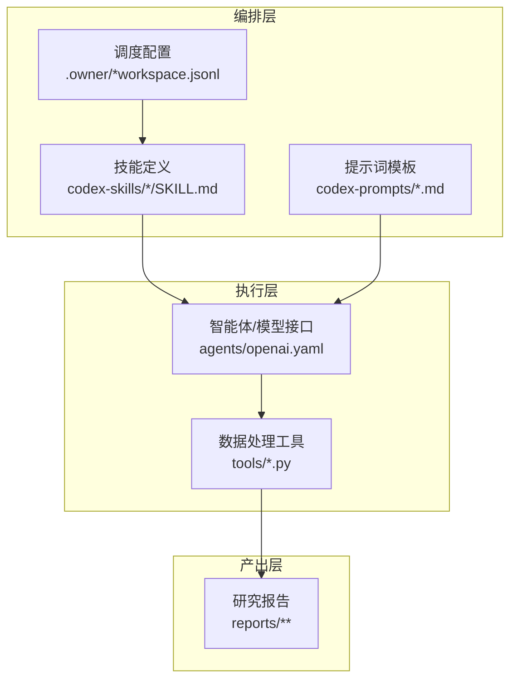
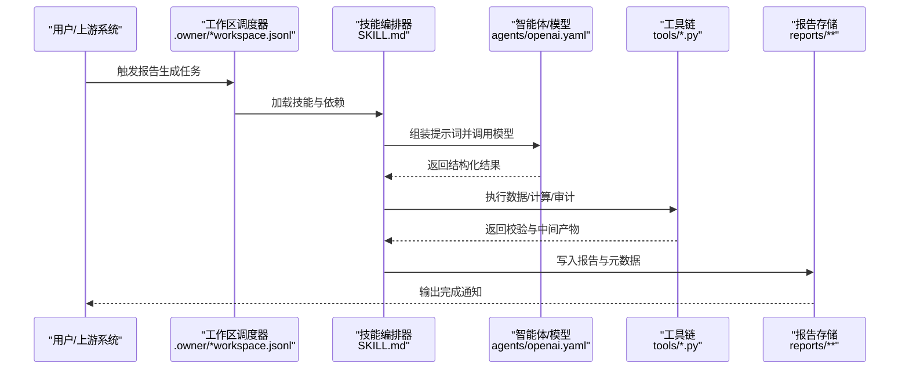
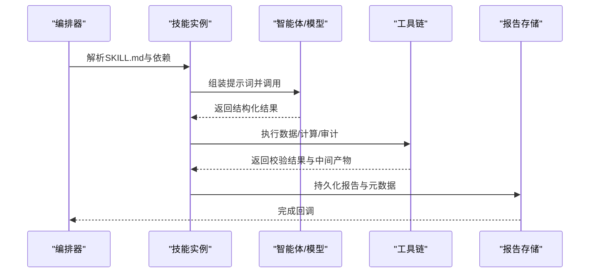
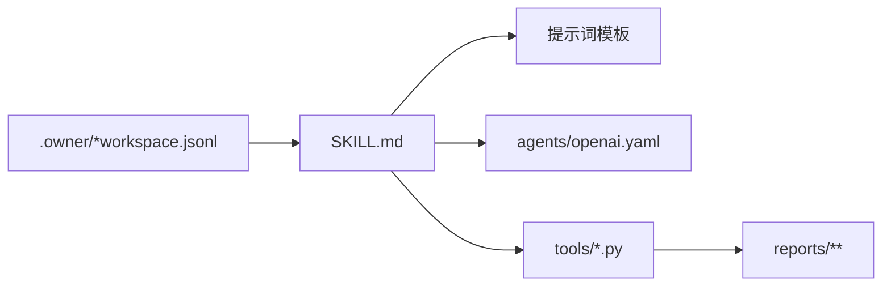

# 生成流程控制

<cite>
**本文引用的文件**   
- [AGENTS.md](file://AGENTS.md)
- [CLAUDE.md](file://CLAUDE.md)
- [README_EN.md](file://README_EN.md)
- [investment-memo-craft/SKILL.md](file://codex-skills/investment-memo-craft/SKILL.md)
- [investment-memo-craft/agents/openai.yaml](file://codex-skills/investment-memo-craft/agents/openai.yaml)
- [financial-data/SKILL.md](file://codex-skills/financial-data/SKILL.md)
- [industry-research/SKILL.md](file://codex-skills/industry-research/SKILL.md)
- [earnings-review/SKILL.md](file://codex-skills/earnings-review/SKILL.md)
- [investment-team/SKILL.md](file://codex-skills/investment-team/SKILL.md)
- [portfolio-review/SKILL.md](file://codex-skills/portfolio-review/SKILL.md)
- [deep-company-series/SKILL.md](file://codex-skills/deep-company-series/SKILL.md)
- [quality-screen/SKILL.md](file://codex-skills/quality-screen/SKILL.md)
- [bottleneck-hunter/SKILL.md](file://codex-skills/bottleneck-hunter/SKILL.md)
- [news-pulse/SKILL.md](file://codex-skills/news-pulse/SKILL.md)
- [management-deep-dive/SKILL.md](file://codex-skills/management-deep-dive/SKILL.md)
- [thesis-tracker/SKILL.md](file://codex-skills/thesis-tracker/SKILL.md)
- [thesis-drift/SKILL.md](file://codex-skills/thesis-drift/SKILL.md)
- [private-company-research/SKILL.md](file://codex-skills/private-company-research/SKILL.md)
- [wechat-article/SKILL.md](file://codex-skills/wechat-article/SKILL.md)
- [dyp-ask/SKILL.md](file://codex-skills/dyp-ask/SKILL.md)
- [investment-research/SKILL.md](file://codex-skills/investment-research/SKILL.md)
- [investment-checklist/SKILL.md](file://codex-skills/investment-checklist/SKILL.md)
- [skills/deep-company-series.md](file://skills/deep-company-series.md)
- [skills/earnings-review.md](file://skills/earnings-review.md)
- [skills/financial-data.md](file://skills/financial-data.md)
- [skills/industry-research.md](file://skills/industry-research.md)
- [skills/investment-team.md](file://skills/investment-team.md)
- [skills/portfolio-review.md](file://skills/portfolio-review.md)
- [tools/report_audit.py](file://tools/report_audit.py)
- [tools/financial_rigor.py](file://tools/financial_rigor.py)
- [tools/stock_screener.py](file://tools/stock_screener.py)
- [tools/morningstar_fair_value.py](file://tools/morningstar_fair_value.py)
- [tools/xueqiu_scraper.py](file://tools/xueqiu_scraper.py)
- [tools/ashare_data.py](file://tools/ashare_data.py)
- [tools/momentum_backtest.py](file://tools/momentum_backtest.py)
- [tools/momentum_backtest_v2.py](file://tools/momentum_backtest_v2.py)
- [scripts/sync-codex-prompts.py](file://scripts/sync-codex-prompts.py)
- [scripts/sync-codex-skills.py](file://scripts/sync-codex-skills.py)
- [.owner/skill-dispatch-workspace.jsonl](file://.owner/skill-dispatch-workspace.jsonl)
- [.owner/subagent-dispatch-workspace.jsonl](file://.owner/subagent-dispatch-workspace.jsonl)
</cite>

## 目录
1. [简介](#简介)
2. [项目结构](#项目结构)
3. [核心组件](#核心组件)
4. [架构总览](#架构总览)
5. [详细组件分析](#详细组件分析)
6. [依赖关系分析](#依赖关系分析)
7. [性能与可扩展性](#性能与可扩展性)
8. [故障排查与调试](#故障排查与调试)
9. [结论](#结论)
10. [附录](#附录)

## 简介
本文件面向“报告生成流程控制”，围绕从数据收集、AI技能调度、提示词执行、数据处理管道到质量控制检查的完整自动化链路，提供系统化文档。内容覆盖智能体配置与工作流编排机制、通过配置文件驱动各步骤的方法、监控与调试手段（错误处理、重试策略、性能优化），以及自定义生成流程与外部工具集成的最佳实践，帮助开发者构建高效、可观测、可演进的报告自动化系统。

## 项目结构
仓库采用“技能+提示词+工具脚本+输出产物”的组织方式：
- codex-skills：以SKILL.md定义能力单元（如财务数据、行业研究、财报审阅、投研团队等），作为工作流中的原子任务。
- codex-prompts：按主题组织提示词模板，供技能或智能体在推理阶段调用。
- tools：数据处理与质量校验脚本（筛选、审计、回测、爬虫等）。
- reports：最终生成的研究报告与子报告集合。
- .owner：工作区级调度配置（技能分发、子智能体分发）。
- scripts：安装与同步脚本，用于将提示词与技能部署到本地环境。
- skills：轻量版技能描述，便于快速参考。

图表来源
- [investment-memo-craft/SKILL.md](file://codex-skills/investment-memo-craft/SKILL.md)
- [investment-memo-craft/agents/openai.yaml](file://codex-skills/investment-memo-craft/agents/openai.yaml)
- [.owner/skill-dispatch-workspace.jsonl](file://.owner/skill-dispatch-workspace.jsonl)
- [.owner/subagent-dispatch-workspace.jsonl](file://.owner/subagent-dispatch-workspace.jsonl)

章节来源
- [AGENTS.md](file://AGENTS.md)
- [CLAUDE.md](file://CLAUDE.md)
- [README_EN.md](file://README_EN.md)

## 核心组件
- 技能（Skill）：以SKILL.md为契约，描述输入、目标、步骤、约束与输出格式，是工作流的最小可复用单元。
- 提示词（Prompt）：以markdown形式维护，支持多角色视角与结构化输出，被技能在执行时组合注入。
- 智能体配置：通过agents下的YAML声明模型、参数与调用约定，实现模型无关的编排。
- 工具链：Python脚本负责数据采集、清洗、计算与质量审计，形成可靠的数据管道。
- 调度配置：工作区级JSONL记录技能与子智能体的分发策略，驱动端到端流水线。

章节来源
- [investment-memo-craft/SKILL.md](file://codex-skills/investment-memo-craft/SKILL.md)
- [investment-memo-craft/agents/openai.yaml](file://codex-skills/investment-memo-craft/agents/openai.yaml)
- [.owner/skill-dispatch-workspace.jsonl](file://.owner/skill-dispatch-workspace.jsonl)
- [.owner/subagent-dispatch-workspace.jsonl](file://.owner/subagent-dispatch-workspace.jsonl)

## 架构总览
整体架构遵循“配置驱动 + 技能编排 + 工具增强”的模式：
- 配置层：技能定义、提示词模板、智能体配置、工作区调度。
- 编排层：根据配置选择并串联多个技能，管理上下文传递与并行度。
- 执行层：调用大模型API与本地工具脚本，完成分析与计算。
- 产出层：标准化输出至reports目录，附带元数据与版本信息。

图表来源
- [.owner/skill-dispatch-workspace.jsonl](file://.owner/skill-dispatch-workspace.jsonl)
- [.owner/subagent-dispatch-workspace.jsonl](file://.owner/subagent-dispatch-workspace.jsonl)
- [investment-memo-craft/SKILL.md](file://codex-skills/investment-memo-craft/SKILL.md)
- [investment-memo-craft/agents/openai.yaml](file://codex-skills/investment-memo-craft/agents/openai.yaml)
- [tools/report_audit.py](file://tools/report_audit.py)

## 详细组件分析

### 技能与提示词体系
- 技能职责划分清晰：财务数据、行业研究、财报审阅、投研团队、组合回顾、深度公司系列、质量筛选、瓶颈挖掘、新闻脉冲、管理层深挖、跟踪与漂移检测、私有公司研究、公众号文章等。
- 提示词模板按主题组织，支持多视角（段永平、巴菲特、芒格、李录等）与结构化输出，确保一致性与可复现性。
- 建议每个技能明确：输入源、前置条件、步骤顺序、并行度、失败重试策略、输出规范与验收标准。

章节来源
- [financial-data/SKILL.md](file://codex-skills/financial-data/SKILL.md)
- [industry-research/SKILL.md](file://codex-skills/industry-research/SKILL.md)
- [earnings-review/SKILL.md](file://codex-skills/earnings-review/SKILL.md)
- [investment-team/SKILL.md](file://codex-skills/investment-team/SKILL.md)
- [portfolio-review/SKILL.md](file://codex-skills/portfolio-review/SKILL.md)
- [deep-company-series/SKILL.md](file://codex-skills/deep-company-series/SKILL.md)
- [quality-screen/SKILL.md](file://codex-skills/quality-screen/SKILL.md)
- [bottleneck-hunter/SKILL.md](file://codex-skills/bottleneck-hunter/SKILL.md)
- [news-pulse/SKILL.md](file://codex-skills/news-pulse/SKILL.md)
- [management-deep-dive/SKILL.md](file://codex-skills/management-deep-dive/SKILL.md)
- [thesis-tracker/SKILL.md](file://codex-skills/thesis-tracker/SKILL.md)
- [thesis-drift/SKILL.md](file://codex-skills/thesis-drift/SKILL.md)
- [private-company-research/SKILL.md](file://codex-skills/private-company-research/SKILL.md)
- [wechat-article/SKILL.md](file://codex-skills/wechat-article/SKILL.md)
- [dyp-ask/SKILL.md](file://codex-skills/dyp-ask/SKILL.md)
- [investment-research/SKILL.md](file://codex-skills/investment-research/SKILL.md)
- [investment-checklist/SKILL.md](file://codex-skills/investment-checklist/SKILL.md)
- [skills/deep-company-series.md](file://skills/deep-company-series.md)
- [skills/earnings-review.md](file://skills/earnings-review.md)
- [skills/financial-data.md](file://skills/financial-data.md)
- [skills/industry-research.md](file://skills/industry-research.md)
- [skills/investment-team.md](file://skills/investment-team.md)
- [skills/portfolio-review.md](file://skills/portfolio-review.md)

### 智能体与模型配置
- agents/openai.yaml集中声明模型调用参数与接口约定，使编排层与具体模型解耦。
- 建议在配置中显式声明：超时、重试次数、并发上限、温度/采样策略、输出格式约束。
- 当切换模型或提供商时，仅需更新该配置，无需改动上层编排逻辑。

章节来源
- [investment-memo-craft/agents/openai.yaml](file://codex-skills/investment-memo-craft/agents/openai.yaml)

### 数据处理与质量管控
- 工具链涵盖股票筛选、晨星公允价值、动量回测、雪球抓取、A股数据、财务严谨性检查与报告审计。
- 建议在关键节点插入质量门禁：数据完整性、口径一致性、数值合理性、引用可追溯。
- 对长耗时任务（回测、批量抓取）引入分片与断点续跑，避免重复成本。

章节来源
- [tools/stock_screener.py](file://tools/stock_screener.py)
- [tools/morningstar_fair_value.py](file://tools/morningstar_fair_value.py)
- [tools/momentum_backtest.py](file://tools/momentum_backtest.py)
- [tools/momentum_backtest_v2.py](file://tools/momentum_backtest_v2.py)
- [tools/xueqiu_scraper.py](file://tools/xueqiu_scraper.py)
- [tools/ashare_data.py](file://tools/ashare_data.py)
- [tools/financial_rigor.py](file://tools/financial_rigor.py)
- [tools/report_audit.py](file://tools/report_audit.py)

### 工作区调度与编排
- .owner下jsonl文件定义技能分发与子智能体分发策略，作为全局编排入口。
- 建议在工作区级别维护：任务拓扑、依赖图、资源配额、优先级与重试策略。
- 通过配置化方式动态装配流程，减少硬编码，提升可维护性与扩展性。

章节来源
- [.owner/skill-dispatch-workspace.jsonl](file://.owner/skill-dispatch-workspace.jsonl)
- [.owner/subagent-dispatch-workspace.jsonl](file://.owner/subagent-dispatch-workspace.jsonl)

### 安装与同步脚本
- scripts下提供提示词与技能的安装/同步脚本，便于在不同环境中保持一致的模板与能力集。
- 建议在CI/CD中集成，确保环境与代码同步更新，降低漂移风险。

章节来源
- [scripts/sync-codex-prompts.py](file://scripts/sync-codex-prompts.py)
- [scripts/sync-codex-skills.py](file://scripts/sync-codex-skills.py)

### 报告生成主流程时序

图表来源
- [investment-memo-craft/SKILL.md](file://codex-skills/investment-memo-craft/SKILL.md)
- [investment-memo-craft/agents/openai.yaml](file://codex-skills/investment-memo-craft/agents/openai.yaml)
- [tools/report_audit.py](file://tools/report_audit.py)

## 依赖关系分析
- 技能与提示词：SKILL.md依赖对应主题的提示词模板，形成“能力-表达”的解耦。
- 编排与智能体：编排层通过agents配置抽象模型调用，屏蔽底层差异。
- 工具与数据：工具脚本读取原始数据与缓存，产出中间结果供后续技能消费。
- 工作区与全局配置：.owner下的jsonl决定全局任务路由与资源分配。

图表来源
- [investment-memo-craft/SKILL.md](file://codex-skills/investment-memo-craft/SKILL.md)
- [investment-memo-craft/agents/openai.yaml](file://codex-skills/investment-memo-craft/agents/openai.yaml)
- [.owner/skill-dispatch-workspace.jsonl](file://.owner/skill-dispatch-workspace.jsonl)
- [.owner/subagent-dispatch-workspace.jsonl](file://.owner/subagent-dispatch-workspace.jsonl)

## 性能与可扩展性
- 并行与批处理：对独立技能与工具调用启用并发；对大数据任务进行分片与增量处理。
- 缓存与幂等：对价格、财报、研报等稳定数据建立缓存键与版本戳，避免重复请求。
- 限流与退避：对外部API实施指数退避与熔断，保障稳定性。
- 资源隔离：不同技能使用独立的临时目录与命名空间，防止污染。
- 可观测性：为每步操作记录时间戳、输入摘要、输出摘要与错误码，便于追踪与回溯。

[本节为通用指导，不直接分析具体文件]

## 故障排查与调试
- 日志与追踪：在每个技能入口与出口打印结构化日志，包含任务ID、步骤、耗时、状态码。
- 错误分类：区分网络错误、鉴权错误、数据缺失、格式异常、业务校验失败，分别采取重试、降级或告警。
- 重试策略：对瞬时错误采用指数退避与最大重试次数；对确定性错误立即失败并上报。
- 断点恢复：对长任务保存进度快照，支持中断后继续执行。
- 质量门禁：在报告落盘前运行审计脚本，拦截低质量或不合规输出。

章节来源
- [tools/report_audit.py](file://tools/report_audit.py)
- [tools/financial_rigor.py](file://tools/financial_rigor.py)

## 结论
通过将“技能-提示词-智能体-工具-配置”解耦并以工作区级调度为中心，本项目实现了高内聚、低耦合的报告生成流水线。借助配置驱动的编排与严格的质量门禁，可在保证一致性的同时灵活扩展新能力与外部工具。配合完善的可观测性与容错策略，系统具备生产可用的可靠性与可维护性。

[本节为总结性内容，不直接分析具体文件]

## 附录
- 快速上手
  - 安装与同步：使用scripts下的脚本将提示词与技能部署到本地环境。
  - 配置智能体：在agents下调整模型与调用参数。
  - 编排任务：在.owner下维护工作区调度配置，指定技能序列与依赖。
  - 运行与验证：执行后检查reports输出，并通过tools中的审计脚本进行质量校验。

章节来源
- [scripts/sync-codex-prompts.py](file://scripts/sync-codex-prompts.py)
- [scripts/sync-codex-skills.py](file://scripts/sync-codex-skills.py)
- [investment-memo-craft/agents/openai.yaml](file://codex-skills/investment-memo-craft/agents/openai.yaml)
- [.owner/skill-dispatch-workspace.jsonl](file://.owner/skill-dispatch-workspace.jsonl)
- [.owner/subagent-dispatch-workspace.jsonl](file://.owner/subagent-dispatch-workspace.jsonl)
- [tools/report_audit.py](file://tools/report_audit.py)