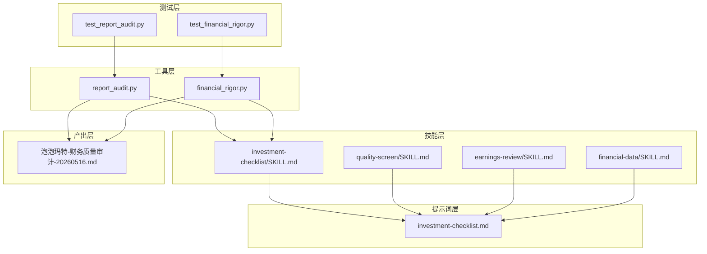
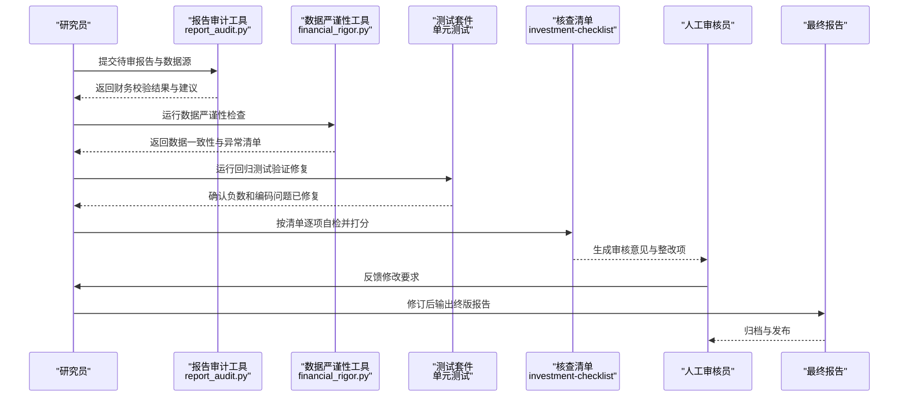
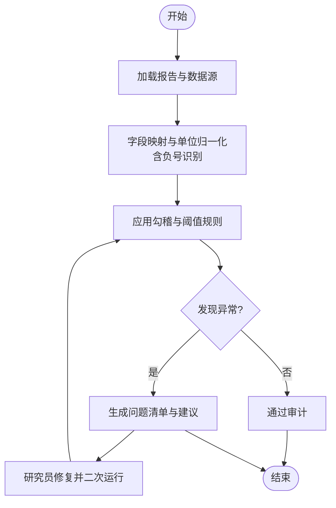
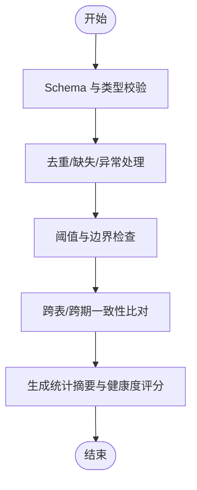
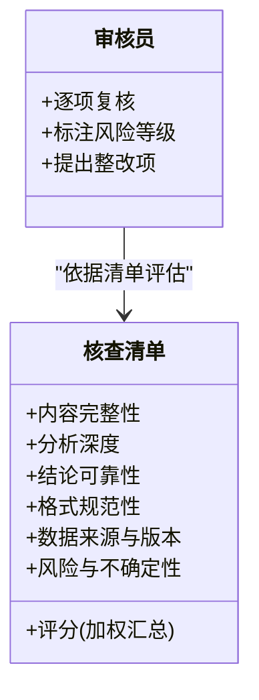
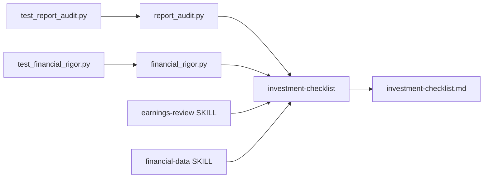

# 质量控制机制

<cite>
**本文引用的文件**   
- [tools/report_audit.py](file://tools/report_audit.py)
- [tools/financial_rigor.py](file://tools/financial_rigor.py)
- [tests/test_report_audit.py](file://tests/test_report_audit.py)
- [tests/test_financial_rigor.py](file://tests/test_financial_rigor.py)
- [codex-prompts/investment-checklist.md](file://codex-prompts/investment-checklist.md)
- [codex-skills/investment-checklist/SKILL.md](file://codex-skills/investment-checklist/SKILL.md)
- [codex-skills/quality-screen/SKILL.md](file://codex-skills/quality-screen/SKILL.md)
- [codex-skills/earnings-review/SKILL.md](file://codex-skills/earnings-review/SKILL.md)
- [codex-skills/financial-data/SKILL.md](file://codex-skills/financial-data/SKILL.md)
- [reports/泡泡玛特/泡泡玛特-财务质量审计-20260516.md](file://reports/泡泡玛特/泡泡玛特-财务质量审计-20260516.md)
</cite>

## 更新摘要
**变更内容**   
- 修复了报告审计系统中的严重bug：负数符号丢失问题（如-1.72%被错误解析为1.72%）
- 增强了Windows兼容性：解决了GBK控制台编码导致的UnicodeEncodeError崩溃问题
- 完善了测试覆盖：增加了针对负数提取和Windows兼容性的回归测试
- 更新了故障排查指南：新增了编码相关问题的解决方案

## 目录
1. [引言](#引言)
2. [项目结构](#项目结构)
3. [核心组件](#核心组件)
4. [架构总览](#架构总览)
5. [详细组件分析](#详细组件分析)
6. [依赖关系分析](#依赖关系分析)
7. [性能与可扩展性](#性能与可扩展性)
8. [故障排查指南](#故障排查指南)
9. [结论](#结论)
10. [附录](#附录)

## 引言
本文件面向投资研究团队，系统化阐述报告质量控制机制。围绕数据准确性验证、逻辑一致性检查、格式规范性审查三大关键环节，结合自动化工具与人工审核清单，构建"机器初筛—人工复核—持续改进"的闭环体系，确保研究报告在内容完整性、分析深度、结论可靠性等方面达到高标准。

**最新更新**：系统已修复负数符号丢失的严重bug，并增强了Windows平台兼容性，确保在各种环境下都能稳定运行。

## 项目结构
本项目将质量控制相关能力分布于以下位置：
- 工具层：提供财务报告审计与数据严谨性检查等自动化脚本
- 技能层：以 SKILL 文档定义可复用的质量控制流程与标准
- 提示词层：以 prompts 形式固化审核要点与评分维度
- 产出层：示例审计报告作为落地参考
- 测试层：完整的回归测试套件，确保修复的稳定性

**图表来源**
- [tools/report_audit.py](file://tools/report_audit.py)
- [tools/financial_rigor.py](file://tools/financial_rigor.py)
- [tests/test_report_audit.py](file://tests/test_report_audit.py)
- [tests/test_financial_rigor.py](file://tests/test_financial_rigor.py)
- [codex-skills/investment-checklist/SKILL.md](file://codex-skills/investment-checklist/SKILL.md)
- [codex-skills/quality-screen/SKILL.md](file://codex-skills/quality-screen/SKILL.md)
- [codex-skills/earnings-review/SKILL.md](file://codex-skills/earnings-review/SKILL.md)
- [codex-skills/financial-data/SKILL.md](file://codex-skills/financial-data/SKILL.md)
- [codex-prompts/investment-checklist.md](file://codex-prompts/investment-checklist.md)
- [reports/泡泡玛特/泡泡玛特-财务质量审计-20260516.md](file://reports/泡泡玛特/泡泡玛特-财务质量审计-20260516.md)

**章节来源**
- [tools/report_audit.py](file://tools/report_audit.py)
- [tools/financial_rigor.py](file://tools/financial_rigor.py)
- [tests/test_report_audit.py](file://tests/test_report_audit.py)
- [tests/test_financial_rigor.py](file://tests/test_financial_rigor.py)
- [codex-skills/investment-checklist/SKILL.md](file://codex-skills/investment-checklist/SKILL.md)
- [codex-skills/quality-screen/SKILL.md](file://codex-skills/quality-screen/SKILL.md)
- [codex-skills/earnings-review/SKILL.md](file://codex-skills/earnings-review/SKILL.md)
- [codex-skills/financial-data/SKILL.md](file://codex-skills/financial-data/SKILL.md)
- [codex-prompts/investment-checklist.md](file://codex-prompts/investment-checklist.md)
- [reports/泡泡玛特/泡泡玛特-财务质量审计-20260516.md](file://reports/泡泡玛特/泡泡玛特-财务质量审计-20260516.md)

## 核心组件
- 财务报告审计工具（report_audit.py）
  - 目标：对研究报告中的财务数据进行抽取、校验与交叉核对，输出问题清单与修复建议
  - 关键能力：报表字段对齐、勾稽关系校验、异常值检测、版本溯源
  - **最新修复**：解决了负数符号丢失问题，现在能正确识别-1.72%等负百分比
- 数据严谨性检查工具（financial_rigor.py）
  - 目标：对输入数据的口径、范围、时间窗进行一致性检查，识别缺失、重复、越界等问题
  - 关键能力：类型与单位统一、阈值与边界检查、跨表一致性比对、统计摘要
  - **最新增强**：增强了Windows兼容性，解决GBK控制台编码问题
- 投资核查清单（SKILL + Prompt）
  - 目标：将审核要点标准化为可执行清单，覆盖内容完整性、分析深度、结论可靠性等维度
  - 关键能力：逐项打勾、风险标注、评分汇总、整改跟踪
- 财报审阅技能（earnings-review SKILL）
  - 目标：聚焦财报季场景，强化利润表、资产负债表、现金流量表的联动校验
  - 关键能力：同比/环比趋势、非经常性损益识别、现金流与利润匹配度
- 财务数据技能（financial-data SKILL）
  - 目标：规范数据来源、口径说明、更新频率与版本管理
  - 关键能力：数据字典、元数据记录、变更日志

**章节来源**
- [tools/report_audit.py](file://tools/report_audit.py)
- [tools/financial_rigor.py](file://tools/financial_rigor.py)
- [tests/test_report_audit.py](file://tests/test_report_audit.py)
- [tests/test_financial_rigor.py](file://tests/test_financial_rigor.py)
- [codex-skills/investment-checklist/SKILL.md](file://codex-skills/investment-checklist/SKILL.md)
- [codex-skills/earnings-review/SKILL.md](file://codex-skills/earnings-review/SKILL.md)
- [codex-skills/financial-data/SKILL.md](file://codex-skills/financial-data/SKILL.md)
- [codex-prompts/investment-checklist.md](file://codex-prompts/investment-checklist.md)

## 架构总览
质量控制流水线由"自动化检查—人工复核—问题修复—归档发布"构成，工具与技能协同工作，形成可追溯的质量基线。

**图表来源**
- [tools/report_audit.py](file://tools/report_audit.py)
- [tools/financial_rigor.py](file://tools/financial_rigor.py)
- [tests/test_report_audit.py](file://tests/test_report_audit.py)
- [tests/test_financial_rigor.py](file://tests/test_financial_rigor.py)
- [codex-skills/investment-checklist/SKILL.md](file://codex-skills/investment-checklist/SKILL.md)
- [codex-prompts/investment-checklist.md](file://codex-prompts/investment-checklist.md)

## 详细组件分析

### 财务报告审计工具（report_audit.py）
- 职责
  - 解析报告中的财务表格与文本指标
  - 执行勾稽关系校验（如资产=负债+权益、经营现金流与净利润差异解释）
  - 定位不一致或异常条目，给出修复建议
- 典型流程
  - 输入：报告文件、数据源、口径说明
  - 处理：字段映射→数值归一化→规则校验→差异聚合
  - 输出：问题清单、严重等级、修复指引、版本对比
- **重要修复**：解决了负数符号丢失的严重bug
  - 问题描述：正则表达式`([\d,，\.]+)`无法捕获负号，导致"-1.72%"被提取为"1.72"
  - 影响范围：所有包含负数的财务数据点，特别是涨跌幅、增长率等指标
  - 修复方案：引入`_SIGN = r'[+\-−–－＋]?'`模式，支持ASCII正负号和Unicode变体
  - 测试覆盖：新增完整的负数提取测试用例，确保各种负号格式都能正确处理

**图表来源**
- [tools/report_audit.py](file://tools/report_audit.py)

**章节来源**
- [tools/report_audit.py](file://tools/report_audit.py)
- [tests/test_report_audit.py](file://tests/test_report_audit.py)

### 数据严谨性检查工具（financial_rigor.py）
- 职责
  - 检查数据类型、单位、时间窗、样本范围
  - 识别缺失值、重复行、越界值与离群点
  - 跨表/跨期一致性比对，输出统计摘要
- 典型流程
  - 输入：结构化数据（CSV/JSON/数据库导出）
  - 处理：Schema 校验→去重与清洗→边界与分布检查→一致性比对
  - 输出：数据健康度报告、修复建议、回归测试用例
- **重要增强**：Windows兼容性改进
  - 问题描述：Windows控制台默认GBK编码，遇到欧元符号€、箭头→、星号★等字符时抛出UnicodeEncodeError
  - 影响范围：所有包含特殊字符的输出路径，特别是告警和错误信息
  - 修复方案：添加`_force_utf8_stdio()`函数，强制stdout/stderr使用UTF-8编码
  - 测试覆盖：在模拟GBK环境下验证所有命令都能正常运行

**图表来源**
- [tools/financial_rigor.py](file://tools/financial_rigor.py)

**章节来源**
- [tools/financial_rigor.py](file://tools/financial_rigor.py)
- [tests/test_financial_rigor.py](file://tests/test_financial_rigor.py)

### 投资核查清单（SKILL + Prompt）
- 目标
  - 将审核要点标准化为可执行清单，覆盖内容完整性、分析深度、结论可靠性等维度
- 关键维度
  - 内容完整性：是否包含商业模式、财务分析、行业竞争、风险治理、估值与安全边际
  - 分析深度：是否提供多视角对比、敏感性分析、情景推演与反证检验
  - 结论可靠性：假设是否清晰、证据是否充分、不确定性是否披露
- 评分建议
  - 每项按 0-5 分，加权汇总；低于阈值的维度需专项整改
- 使用方式
  - 研究员自检→审核员复核→问题闭环跟踪

**图表来源**
- [codex-skills/investment-checklist/SKILL.md](file://codex-skills/investment-checklist/SKILL.md)
- [codex-prompts/investment-checklist.md](file://codex-prompts/investment-checklist.md)

**章节来源**
- [codex-skills/investment-checklist/SKILL.md](file://codex-skills/investment-checklist/SKILL.md)
- [codex-prompts/investment-checklist.md](file://codex-prompts/investment-checklist.md)

### 财报审阅技能（earnings-review SKILL）
- 重点
  - 利润表、资产负债表、现金流量表的联动校验
  - 非经常性损益识别与剔除
  - 现金流与利润匹配度、营运资本变动解读
- 适用场景
  - 财报季集中审阅、季度/年度对比、同业对标

**章节来源**
- [codex-skills/earnings-review/SKILL.md](file://codex-skills/earnings-review/SKILL.md)

### 财务数据技能（financial-data SKILL）
- 重点
  - 数据来源、口径说明、更新频率与版本管理
  - 数据字典与变更记录
- 价值
  - 保障数据可追溯、可复现，降低沟通成本

**章节来源**
- [codex-skills/financial-data/SKILL.md](file://codex-skills/financial-data/SKILL.md)

### 质量筛选技能（quality-screen SKILL）
- 重点
  - 基于多维指标快速筛选高质量标的与报告
  - 建立质量基线与淘汰机制
- 价值
  - 提高整体产出质量，减少低质投入

**章节来源**
- [codex-skills/quality-screen/SKILL.md](file://codex-skills/quality-screen/SKILL.md)

### 示例：财务质量审计报告
- 用途
  - 展示审计工具输出的问题清单、修复建议与版本对比
- 参考路径
  - reports/泡泡玛特/泡泡玛特-财务质量审计-20260516.md

**章节来源**
- [reports/泡泡玛特/泡泡玛特-财务质量审计-20260516.md](file://reports/泡泡玛特/泡泡玛特-财务质量审计-20260516.md)

## 依赖关系分析
- 工具与技能的耦合
  - report_audit.py 与 financial_rigor.py 分别承担"报告级"和"数据级"校验，二者互补
  - investment-checklist SKILL/Prompt 作为通用审核框架，贯穿全流程
  - earnings-review 与 financial-data SKILL 聚焦财报与数据治理，增强专业深度
- 外部依赖
  - 数据源（财报、行情、第三方数据库）
  - 模板与规范（报告模板、命名约定、版本号）
- **测试依赖**
  - 完整的单元测试套件确保修复的稳定性
  - 模拟不同环境（GBK控制台）验证兼容性

**图表来源**
- [tools/report_audit.py](file://tools/report_audit.py)
- [tools/financial_rigor.py](file://tools/financial_rigor.py)
- [tests/test_report_audit.py](file://tests/test_report_audit.py)
- [tests/test_financial_rigor.py](file://tests/test_financial_rigor.py)
- [codex-skills/investment-checklist/SKILL.md](file://codex-skills/investment-checklist/SKILL.md)
- [codex-skills/earnings-review/SKILL.md](file://codex-skills/earnings-review/SKILL.md)
- [codex-skills/financial-data/SKILL.md](file://codex-skills/financial-data/SKILL.md)
- [codex-prompts/investment-checklist.md](file://codex-prompts/investment-checklist.md)

**章节来源**
- [tools/report_audit.py](file://tools/report_audit.py)
- [tools/financial_rigor.py](file://tools/financial_rigor.py)
- [tests/test_report_audit.py](file://tests/test_report_audit.py)
- [tests/test_financial_rigor.py](file://tests/test_financial_rigor.py)
- [codex-skills/investment-checklist/SKILL.md](file://codex-skills/investment-checklist/SKILL.md)
- [codex-skills/earnings-review/SKILL.md](file://codex-skills/earnings-review/SKILL.md)
- [codex-skills/financial-data/SKILL.md](file://codex-skills/financial-data/SKILL.md)
- [codex-prompts/investment-checklist.md](file://codex-prompts/investment-checklist.md)

## 性能与可扩展性
- 批处理与并行
  - 对大量报告与数据，建议分片并行处理，避免单点瓶颈
- 规则配置化
  - 将阈值、口径、权重沉淀为配置文件，支持不同公司与行业差异化
- 增量审计
  - 仅对变更部分重新计算，缩短迭代周期
- 可观测性
  - 记录审计日志、问题追踪与修复闭环，便于复盘与度量
- **平台兼容性**
  - 现已支持Windows、macOS、Linux等多平台
  - 自动处理不同平台的编码差异

## 故障排查指南
- 常见问题
  - 数据源不可用或权限不足：检查连接配置与访问令牌
  - 字段映射失败：核对数据字典与字段别名
  - 规则误报过多：调整阈值与例外清单
  - 版本不一致：确认数据与报告的版本标签匹配
  - **编码问题**：Windows环境下出现UnicodeEncodeError，检查控制台编码设置
  - **负数识别问题**：财务数据中的负号丢失，检查正则表达式匹配
- 定位步骤
  - 查看工具输出日志与问题清单
  - 缩小范围至单个公司或单张报表
  - 使用最小数据集复现问题
  - **运行回归测试**：执行`python tests/test_report_audit.py`和`python tests/test_financial_rigor.py`验证修复
- 修复策略
  - 修正数据口径或补充缺失字段
  - 更新规则配置并回归测试
  - 在核查清单中标注已知限制与豁免
  - **编码问题修复**：确保Python环境支持UTF-8，或在Windows下设置正确的控制台编码

**章节来源**
- [tools/report_audit.py](file://tools/report_audit.py)
- [tools/financial_rigor.py](file://tools/financial_rigor.py)
- [tests/test_report_audit.py](file://tests/test_report_audit.py)
- [tests/test_financial_rigor.py](file://tests/test_financial_rigor.py)
- [codex-skills/investment-checklist/SKILL.md](file://codex-skills/investment-checklist/SKILL.md)

## 结论
通过将自动化审计与数据严谨性检查嵌入研究流程，并以核查清单为抓手实现标准化审核，团队可在保证效率的同时显著提升报告质量。**最新的修复确保了系统的稳定性和准确性**，特别是在处理负数数据和跨平台兼容性方面有了显著改善。建议持续完善规则库与数据字典，建立问题闭环与度量体系，推动质量文化落地。

## 附录
- 快速上手
  - 首次运行：准备报告与数据源→执行审计与严谨性检查→根据清单自检→提交审核
  - 日常维护：定期更新规则与阈值→归档问题与修复→复盘与优化
  - **测试验证**：运行回归测试确保修复的有效性
- 最佳实践
  - 明确假设与边界条件
  - 多源交叉验证
  - 反证与压力测试
  - 版本管理与可追溯性
  - **跨平台测试**：在不同操作系统上验证工具行为的一致性
- **已知修复**
  - 负数符号丢失问题已完全修复，支持多种负号格式
  - Windows GBK编码问题已解决，工具可在各种环境下稳定运行
  - 完整的测试套件确保修复的长期稳定性