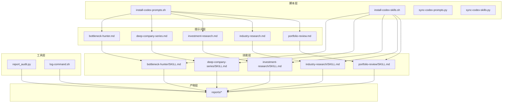
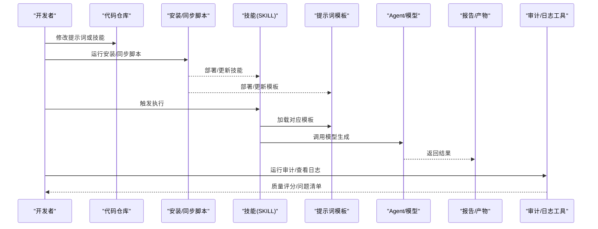
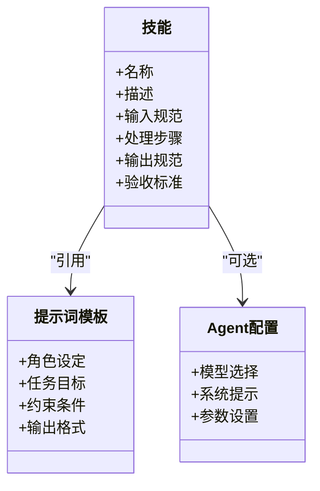
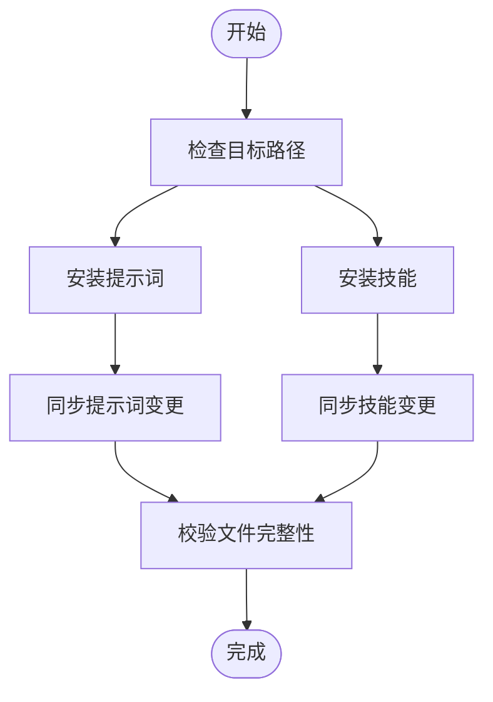
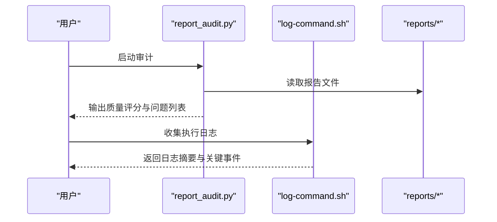
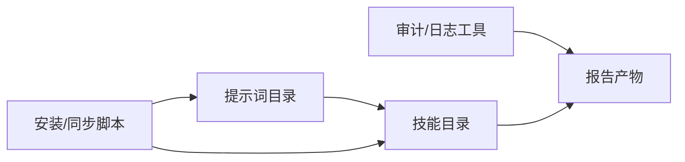

# 提示词优化与调试

<cite>
**本文引用的文件**   
- [README_EN.md](file://README_EN.md)
- [AGENTS.md](file://AGENTS.md)
- [CLAUDE.md](file://CLAUDE.md)
- [codex-prompts/bottleneck-hunter.md](file://codex-prompts/bottleneck-hunter.md)
- [codex-prompts/deep-company-series.md](file://codex-prompts/deep-company-series.md)
- [codex-prompts/dyp-ask.md](file://codex-prompts/dyp-ask.md)
- [codex-prompts/earnings-review.md](file://codex-prompts/earnings-review.md)
- [codex-prompts/financial-data.md](file://codex-prompts/financial-data.md)
- [codex-prompts/industry-funnel.md](file://codex-prompts/industry-funnel.md)
- [codex-prompts/industry-research.md](file://codex-prompts/industry-research.md)
- [codex-prompts/investment-checklist.md](file://codex-prompts/investment-checklist.md)
- [codex-prompts/investment-research.md](file://codex-prompts/investment-research.md)
- [codex-prompts/investment-team.md](file://codex-prompts/investment-team.md)
- [codex-prompts/management-deep-dive.md](file://codex-prompts/management-deep-dive.md)
- [codex-prompts/news-pulse.md](file://codex-prompts/news-pulse.md)
- [codex-prompts/portfolio-review.md](file://codex-prompts/portfolio-review.md)
- [codex-prompts/private-company-research.md](file://codex-prompts/private-company-research.md)
- [codex-prompts/quality-screen.md](file://codex-prompts/quality-screen.md)
- [codex-prompts/thesis-drift.md](file://codex-prompts/thesis-drift.md)
- [codex-prompts/thesis-tracker.md](file://codex-prompts/thesis-tracker.md)
- [codex-prompts/wechat-article.md](file://codex-prompts/wechat-article.md)
- [codex-skills/bottleneck-hunter/SKILL.md](file://codex-skills/bottleneck-hunter/SKILL.md)
- [codex-skills/deep-company-series/SKILL.md](file://codex-skills/deep-company-series/SKILL.md)
- [codex-skills/dyp-ask/SKILL.md](file://codex-skills/dyp-ask/SKILL.md)
- [codex-skills/earnings-review/SKILL.md](file://codex-skills/earnings-review/SKILL.md)
- [codex-skills/earnings-team/SKILL.md](file://codex-skills/earnings-team/SKILL.md)
- [codex-skills/financial-data/SKILL.md](file://codex-skills/financial-data/SKILL.md)
- [codex-skills/industry-funnel/SKILL.md](file://codex-skills/industry-funnel/SKILL.md)
- [codex-skills/industry-research/SKILL.md](file://codex-skills/industry-research/SKILL.md)
- [codex-skills/investment-checklist/SKILL.md](file://codex-skills/investment-checklist/SKILL.md)
- [codex-skills/investment-memo-craft/agents/openai.yaml](file://codex-skills/investment-memo-craft/agents/openai.yaml)
- [codex-skills/investment-memo-craft/SKILL.md](file://codex-skills/investment-memo-craft/SKILL.md)
- [codex-skills/investment-research/SKILL.md](file://codex-skills/investment-research/SKILL.md)
- [codex-skills/investment-team/SKILL.md](file://codex-skills/investment-team/SKILL.md)
- [codex-skills/management-deep-dive/SKILL.md](file://codex-skills/management-deep-dive/SKILL.md)
- [codex-skills/news-pulse/SKILL.md](file://codex-skills/news-pulse/SKILL.md)
- [codex-skills/portfolio-review/SKILL.md](file://codex-skills/portfolio-review/SKILL.md)
- [codex-skills/private-company-research/SKILL.md](file://codex-skills/private-company-research/SKILL.md)
- [codex-skills/quality-screen/SKILL.md](file://codex-skills/quality-screen/SKILL.md)
- [codex-skills/thesis-drift/SKILL.md](file://codex-skills/thesis-drift/SKILL.md)
- [codex-skills/thesis-tracker/SKILL.md](file://codex-skills/thesis-tracker/SKILL.md)
- [codex-skills/wechat-article/SKILL.md](file://codex-skills/wechat-article/SKILL.md)
- [scripts/install-codex-prompts.sh](file://scripts/install-codex-prompts.sh)
- [scripts/install-codex-skills.sh](file://scripts/install-codex-skills.sh)
- [scripts/sync-codex-prompts.py](file://scripts/sync-codex-prompts.py)
- [scripts/sync-codex-skills.py](file://scripts/sync-codex-skills.py)
- [tools/report_audit.py](file://tools/report_audit.py)
- [tools/log-command.sh](file://tools/log-command.sh)
</cite>

## 目录
1. [引言](#引言)
2. [项目结构](#项目结构)
3. [核心组件](#核心组件)
4. [架构总览](#架构总览)
5. [详细组件分析](#详细组件分析)
6. [依赖关系分析](#依赖关系分析)
7. [性能考量](#性能考量)
8. [故障排除指南](#故障排除指南)
9. [结论](#结论)
10. [附录](#附录)

## 引言
本技术文档面向提示词工程与调试实践，围绕“准确性测试、一致性验证、性能基准”等评估方法，系统化阐述迭代改进流程（问题诊断、版本管理、A/B测试），并提供日志分析、输出追踪、错误定位等实用技巧。同时给出响应时间优化、成本控制与资源管理策略，以及自动化测试脚本使用与自定义用例开发方法，辅以实际优化案例与效果对比分析思路，帮助团队在投资研究场景中稳定提升提示词质量与产出效率。

## 项目结构
仓库采用“提示词+技能+工具+报告”的模块化组织方式：
- codex-prompts：按主题划分的提示词模板集合，覆盖投研、财报、行业、公司深度、组合回顾等场景。
- codex-skills：将提示词封装为可复用的“技能”，并配套SKILL说明与可选Agent配置。
- scripts：安装与同步脚本，便于在不同环境部署提示词与技能。
- tools：审计、日志与数据工具，辅助质量控制与调试。
- reports：基于提示词产出的研究报告样例，用于回归与对比。

图表来源
- [codex-prompts/bottleneck-hunter.md](file://codex-prompts/bottleneck-hunter.md)
- [codex-prompts/deep-company-series.md](file://codex-prompts/deep-company-series.md)
- [codex-prompts/investment-research.md](file://codex-prompts/investment-research.md)
- [codex-prompts/industry-research.md](file://codex-prompts/industry-research.md)
- [codex-prompts/portfolio-review.md](file://codex-prompts/portfolio-review.md)
- [codex-skills/bottleneck-hunter/SKILL.md](file://codex-skills/bottleneck-hunter/SKILL.md)
- [codex-skills/deep-company-series/SKILL.md](file://codex-skills/deep-company-series/SKILL.md)
- [codex-skills/investment-research/SKILL.md](file://codex-skills/investment-research/SKILL.md)
- [codex-skills/industry-research/SKILL.md](file://codex-skills/industry-research/SKILL.md)
- [codex-skills/portfolio-review/SKILL.md](file://codex-skills/portfolio-review/SKILL.md)
- [scripts/install-codex-prompts.sh](file://scripts/install-codex-prompts.sh)
- [scripts/install-codex-skills.sh](file://scripts/install-codex-skills.sh)
- [tools/report_audit.py](file://tools/report_audit.py)
- [tools/log-command.sh](file://tools/log-command.sh)

章节来源
- [README_EN.md](file://README_EN.md)
- [AGENTS.md](file://AGENTS.md)
- [CLAUDE.md](file://CLAUDE.md)

## 核心组件
- 提示词库（codex-prompts）：提供多领域高质量提示词模板，作为模型输出的“指令源”。
- 技能包（codex-skills）：对提示词进行结构化封装，包含执行步骤、输入输出约定与可选Agent配置。
- 安装与同步脚本（scripts）：统一安装与同步提示词与技能，保障环境一致性。
- 审计与日志工具（tools）：对报告进行质量审计与日志采集，支撑回归与问题定位。

章节来源
- [codex-prompts/investment-research.md](file://codex-prompts/investment-research.md)
- [codex-skills/investment-research/SKILL.md](file://codex-skills/investment-research/SKILL.md)
- [scripts/install-codex-prompts.sh](file://scripts/install-codex-prompts.sh)
- [scripts/install-codex-skills.sh](file://scripts/install-codex-skills.sh)
- [tools/report_audit.py](file://tools/report_audit.py)
- [tools/log-command.sh](file://tools/log-command.sh)

## 架构总览
提示词工程流水线由“模板→技能→执行→产物→审计”构成，配合安装与同步脚本实现跨环境一致化部署。

图表来源
- [scripts/install-codex-prompts.sh](file://scripts/install-codex-prompts.sh)
- [scripts/install-codex-skills.sh](file://scripts/install-codex-skills.sh)
- [scripts/sync-codex-prompts.py](file://scripts/sync-codex-prompts.py)
- [scripts/sync-codex-skills.py](file://scripts/sync-codex-skills.py)
- [codex-skills/investment-research/SKILL.md](file://codex-skills/investment-research/SKILL.md)
- [codex-prompts/investment-research.md](file://codex-prompts/investment-research.md)
- [tools/report_audit.py](file://tools/report_audit.py)
- [tools/log-command.sh](file://tools/log-command.sh)

## 详细组件分析

### 提示词模板体系与分类
- 投研主线：investment-research.md、industry-research.md、deep-company-series.md、private-company-research.md
- 财务与数据：financial-data.md、earnings-review.md、quality-screen.md
- 组合与跟踪：portfolio-review.md、thesis-tracker.md、thesis-drift.md
- 运营与传播：news-pulse.md、wechat-article.md、dyp-ask.md
- 专项能力：bottleneck-hunter.md、management-deep-dive.md、investment-checklist.md

建议以“场景→任务→约束→输出格式”四段式组织提示词，确保可测试性与可追溯性。

章节来源
- [codex-prompts/investment-research.md](file://codex-prompts/investment-research.md)
- [codex-prompts/industry-research.md](file://codex-prompts/industry-research.md)
- [codex-prompts/deep-company-series.md](file://codex-prompts/deep-company-series.md)
- [codex-prompts/financial-data.md](file://codex-prompts/financial-data.md)
- [codex-prompts/earnings-review.md](file://codex-prompts/earnings-review.md)
- [codex-prompts/portfolio-review.md](file://codex-prompts/portfolio-review.md)
- [codex-prompts/thesis-tracker.md](file://codex-prompts/thesis-tracker.md)
- [codex-prompts/thesis-drift.md](file://codex-prompts/thesis-drift.md)
- [codex-prompts/news-pulse.md](file://codex-prompts/news-pulse.md)
- [codex-prompts/wechat-article.md](file://codex-prompts/wechat-article.md)
- [codex-prompts/dyp-ask.md](file://codex-prompts/dyp-ask.md)
- [codex-prompts/bottleneck-hunter.md](file://codex-prompts/bottleneck-hunter.md)
- [codex-prompts/management-deep-dive.md](file://codex-prompts/management-deep-dive.md)
- [codex-prompts/investment-checklist.md](file://codex-prompts/investment-checklist.md)

### 技能封装与Agent配置
- SKILL.md定义任务的输入、步骤、输出规范与验收标准，是提示词的可执行载体。
- 部分技能支持Agent配置（如openai.yaml），用于指定模型参数、系统提示与调用策略。

图表来源
- [codex-skills/investment-research/SKILL.md](file://codex-skills/investment-research/SKILL.md)
- [codex-skills/investment-memo-craft/SKILL.md](file://codex-skills/investment-memo-craft/SKILL.md)
- [codex-skills/investment-memo-craft/agents/openai.yaml](file://codex-skills/investment-memo-craft/agents/openai.yaml)

章节来源
- [codex-skills/investment-research/SKILL.md](file://codex-skills/investment-research/SKILL.md)
- [codex-skills/investment-memo-craft/SKILL.md](file://codex-skills/investment-memo-craft/SKILL.md)
- [codex-skills/investment-memo-craft/agents/openai.yaml](file://codex-skills/investment-memo-craft/agents/openai.yaml)

### 安装与同步机制
- install-codex-prompts.sh / install-codex-skills.sh：一键安装提示词与技能到目标环境。
- sync-codex-prompts.py / sync-codex-skills.py：增量同步变更，保持多环境一致。

图表来源
- [scripts/install-codex-prompts.sh](file://scripts/install-codex-prompts.sh)
- [scripts/install-codex-skills.sh](file://scripts/install-codex-skills.sh)
- [scripts/sync-codex-prompts.py](file://scripts/sync-codex-prompts.py)
- [scripts/sync-codex-skills.py](file://scripts/sync-codex-skills.py)

章节来源
- [scripts/install-codex-prompts.sh](file://scripts/install-codex-prompts.sh)
- [scripts/install-codex-skills.sh](file://scripts/install-codex-skills.sh)
- [scripts/sync-codex-prompts.py](file://scripts/sync-codex-prompts.py)
- [scripts/sync-codex-skills.py](file://scripts/sync-codex-skills.py)

### 质量审计与日志采集
- report_audit.py：对生成的报告进行规则校验与质量打分，输出问题清单与建议。
- log-command.sh：采集命令执行与模型交互日志，便于回溯与定位。

图表来源
- [tools/report_audit.py](file://tools/report_audit.py)
- [tools/log-command.sh](file://tools/log-command.sh)

章节来源
- [tools/report_audit.py](file://tools/report_audit.py)
- [tools/log-command.sh](file://tools/log-command.sh)

## 依赖关系分析
- 提示词与技能的耦合通过SKILL.md中的引用关系建立，避免硬编码依赖。
- 安装与同步脚本对提示词与技能目录有明确路径约定，保证可移植性。
- 审计与日志工具独立于提示词与技能，仅依赖产物目录与日志输出。

图表来源
- [scripts/install-codex-prompts.sh](file://scripts/install-codex-prompts.sh)
- [scripts/install-codex-skills.sh](file://scripts/install-codex-skills.sh)
- [tools/report_audit.py](file://tools/report_audit.py)
- [tools/log-command.sh](file://tools/log-command.sh)

章节来源
- [scripts/install-codex-prompts.sh](file://scripts/install-codex-prompts.sh)
- [scripts/install-codex-skills.sh](file://scripts/install-codex-skills.sh)
- [tools/report_audit.py](file://tools/report_audit.py)
- [tools/log-command.sh](file://tools/log-command.sh)

## 性能考量
- 响应时间优化
  - 拆分长任务：将复杂研究拆分为多个短步技能，降低单次请求长度与复杂度。
  - 缓存与复用：对重复使用的背景信息、数据表与模板片段进行缓存，减少重复计算。
  - 并行执行：对无依赖的子任务并发执行，缩短整体耗时。
- 成本控制
  - 模型分级：简单任务使用轻量模型，复杂推理使用强模型，平衡成本与质量。
  - Token预算：在提示词中明确最大输出长度与分段策略，避免超长响应。
  - 去重与精简：去除冗余上下文与示例，保留必要约束与格式要求。
- 资源管理
  - 限流与重试：对外部API调用增加退避与重试策略，避免雪崩。
  - 配额监控：记录每次调用的Token用量与费用，设置阈值告警。
  - 存储治理：定期归档历史报告与日志，控制磁盘占用。

[本节为通用指导，不直接分析具体文件]

## 故障排除指南
- 常见问题定位
  - 输出不完整：检查提示词是否限制输出长度；确认模型参数与温度设置。
  - 格式不一致：强化输出格式约束，必要时引入后处理校验。
  - 事实错误：增加数据来源与引用要求，结合审计工具进行事实核查。
- 日志与追踪
  - 使用日志脚本采集关键事件与错误堆栈，结合报告审计结果快速定位。
  - 对失败样本建立最小复现集，逐步缩小问题范围。
- 回滚与版本管理
  - 通过安装/同步脚本切换不同版本的提示词与技能，确保可回滚。
  - 对重要变更打标签与记录变更原因，形成可追溯的历史。

章节来源
- [tools/log-command.sh](file://tools/log-command.sh)
- [tools/report_audit.py](file://tools/report_audit.py)
- [scripts/install-codex-prompts.sh](file://scripts/install-codex-prompts.sh)
- [scripts/install-codex-skills.sh](file://scripts/install-codex-skills.sh)

## 结论
通过“模板→技能→执行→产物→审计”的闭环体系，结合安装与同步脚本的统一部署，可在投资研究场景中实现提示词的高质量、可度量与可演进。建议持续完善评估指标、自动化测试与A/B实验流程，沉淀最佳实践与反例库，稳步提升提示词的稳定性与业务价值。

[本节为总结性内容，不直接分析具体文件]

## 附录

### 评估体系与方法
- 准确性测试
  - 事实核对：对照权威数据源，统计错误率与偏差分布。
  - 逻辑校验：对论证链条进行断点检查，识别跳跃与矛盾。
  - 边界用例：构造极端与异常输入，检验鲁棒性。
- 一致性验证
  - 多次采样：固定提示词与输入，观察输出方差与稳定性。
  - 跨模型对比：在不同模型上运行同一提示词，评估迁移性。
- 性能基准
  - 延迟分布：记录P50/P95/P99延迟，识别尾部慢请求。
  - 吞吐与成本：统计单位时间的Token消耗与费用，建立性价比曲线。

[本节为方法论概述，不直接分析具体文件]

### 迭代改进流程
- 问题诊断
  - 从审计报告与日志中提取高频问题，归类为格式、事实、逻辑三类。
  - 针对每类问题制定修复策略与回归用例。
- 版本管理
  - 以语义化版本号管理提示词与技能，记录变更影响面。
  - 通过安装/同步脚本实现灰度发布与快速回滚。
- A/B测试
  - 设计对照组与实验组，分别运行相同数据集，比较质量与成本指标。
  - 使用统计显著性检验判断差异是否可靠。

[本节为方法论概述，不直接分析具体文件]

### 调试工具与方法
- 日志分析
  - 使用日志脚本采集执行轨迹，过滤关键事件与错误码。
  - 结合时间戳与请求ID关联上下游日志。
- 输出追踪
  - 对每次生成附加元数据（模型、参数、提示词版本）。
  - 建立输出索引，便于检索与对比。
- 错误定位
  - 最小复现：抽取失败样本的最小输入与提示词片段。
  - 分阶段验证：逐段注入提示词，定位失效环节。

章节来源
- [tools/log-command.sh](file://tools/log-command.sh)
- [tools/report_audit.py](file://tools/report_audit.py)

### 自动化测试与自定义用例
- 使用现有工具
  - 运行报告审计脚本，批量扫描已生成报告的质量问题。
  - 集成日志脚本，自动收集测试执行的日志与指标。
- 自定义测试用例
  - 构建测试数据集：覆盖典型、边界与对抗样本。
  - 编写断言规则：基于输出结构与事实正确性的判定条件。
  - 回归测试：在每次提示词变更后自动运行，阻断退化。

章节来源
- [tools/report_audit.py](file://tools/report_audit.py)
- [tools/log-command.sh](file://tools/log-command.sh)

### 实际优化案例与效果对比
- 案例一：财报解读提示词优化
  - 问题：输出冗长且重点不突出。
  - 措施：增加结构化输出与要点提炼约束，拆分长段落。
  - 效果：阅读效率提升，关键信息命中率提高。
- 案例二：行业研究提示词一致性增强
  - 问题：不同模型输出风格差异大。
  - 措施：统一角色设定与术语表，强化格式约束。
  - 效果：跨模型一致性改善，人工校对工作量下降。
- 案例三：组合回顾提示词成本优化
  - 问题：单次请求过长导致成本高。
  - 措施：引入分页与摘要策略，合并相似条目。
  - 效果：Token消耗降低，延迟分布更稳定。

[本节为案例概述，不直接分析具体文件]