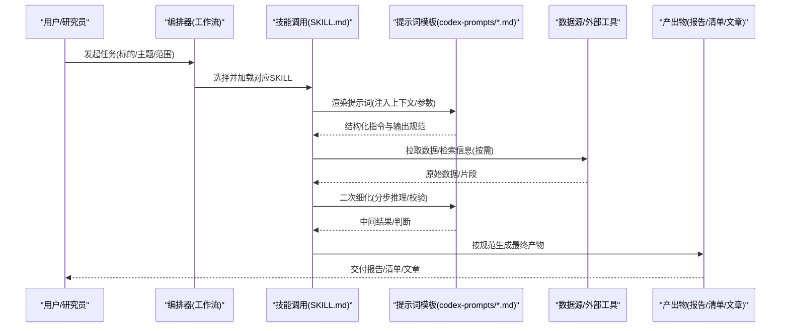
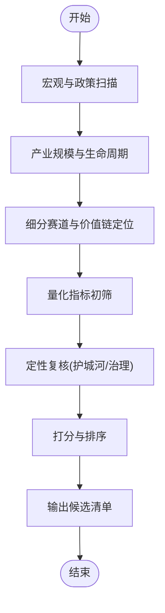
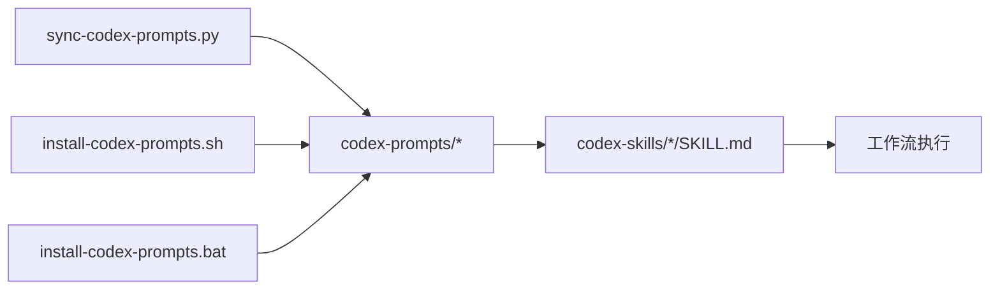

# 提示词工程

<cite>
**本文引用的文件**   
- [codex-prompts/investment-research.md](file://codex-prompts/investment-research.md)
- [codex-prompts/financial-data.md](file://codex-prompts/financial-data.md)
- [codex-prompts/management-deep-dive.md](file://codex-prompts/management-deep-dive.md)
- [codex-prompts/quality-screen.md](file://codex-prompts/quality-screen.md)
- [codex-prompts/deep-company-series.md](file://codex-prompts/deep-company-series.md)
- [codex-prompts/industry-funnel.md](file://codex-prompts/industry-funnel.md)
- [codex-prompts/earnings-review.md](file://codex-prompts/earnings-review.md)
- [codex-prompts/news-pulse.md](file://codex-prompts/news-pulse.md)
- [codex-prompts/portfolio-review.md](file://codex-prompts/portfolio-review.md)
- [codex-prompts/private-company-research.md](file://codex-prompts/private-company-research.md)
- [codex-prompts/bottleneck-hunter.md](file://codex-prompts/bottleneck-hunter.md)
- [codex-prompts/thesis-tracker.md](file://codex-prompts/thesis-tracker.md)
- [codex-prompts/thesis-drift.md](file://codex-prompts/thesis-drift.md)
- [codex-prompts/investment-checklist.md](file://codex-prompts/investment-checklist.md)
- [codex-prompts/wechat-article.md](file://codex-prompts/wechat-article.md)
- [codex-skills/investment-research/SKILL.md](file://codex-skills/investment-research/SKILL.md)
- [codex-skills/financial-data/SKILL.md](file://codex-skills/financial-data/SKILL.md)
- [codex-skills/management-deep-dive/SKILL.md](file://codex-skills/management-deep-dive/SKILL.md)
- [codex-skills/quality-screen/SKILL.md](file://codex-skills/quality-screen/SKILL.md)
- [codex-skills/deep-company-series/SKILL.md](file://codex-skills/deep-company-series/SKILL.md)
- [codex-skills/industry-funnel/SKILL.md](file://codex-skills/industry-funnel/SKILL.md)
- [codex-skills/earnings-review/SKILL.md](file://codex-skills/earnings-review/SKILL.md)
- [codex-skills/news-pulse/SKILL.md](file://codex-skills/news-pulse/SKILL.md)
- [codex-skills/portfolio-review/SKILL.md](file://codex-skills/portfolio-review/SKILL.md)
- [codex-skills/private-company-research/SKILL.md](file://codex-skills/private-company-research/SKILL.md)
- [codex-skills/bottleneck-hunter/SKILL.md](file://codex-skills/bottleneck-hunter/SKILL.md)
- [codex-skills/thesis-tracker/SKILL.md](file://codex-skills/thesis-tracker/SKILL.md)
- [codex-skills/thesis-drift/SKILL.md](file://codex-skills/thesis-drift/SKILL.md)
- [codex-skills/investment-checklist/SKILL.md](file://codex-skills/investment-checklist/SKILL.md)
- [codex-skills/wechat-article/SKILL.md](file://codex-skills/wechat-article/SKILL.md)
- [scripts/sync-codex-prompts.py](file://scripts/sync-codex-prompts.py)
- [scripts/install-codex-prompts.sh](file://scripts/install-codex-prompts.sh)
- [scripts/install-codex-prompts.bat](file://scripts/install-codex-prompts.bat)
</cite>

## 目录
1. [简介](#简介)
2. [项目结构](#项目结构)
3. [核心组件](#核心组件)
4. [架构总览](#架构总览)
5. [详细组件分析](#详细组件分析)
6. [依赖关系分析](#依赖关系分析)
7. [性能与成本考量](#性能与成本考量)
8. [故障排查指南](#故障排查指南)
9. [结论](#结论)
10. [附录](#附录)

## 简介
本文件面向投资研究场景的提示词工程，系统化梳理结构化提示词、上下文管理、输出控制等核心原则与方法论；深入解析现有“投资研究”系列提示词模板（通用分析框架、财务数据分析、管理层深度分析、质量筛选标准等）；提供优化技巧与调试方法（效果评估、迭代改进、版本管理），并展示如何根据具体需求定制和扩展模板。文档同时给出实际示例路径与对比思路，帮助开发者快速掌握高效提示词工程实践。

## 项目结构
仓库将“提示词模板”与“技能编排”分层组织：
- codex-prompts：以 Markdown 形式沉淀可复用的提示词模板，覆盖投研全流程（行业漏斗、公司深研、财报审阅、新闻追踪、组合复盘、私企研究、瓶颈挖掘、论点跟踪与漂移检测、清单化检查、公众号文章生成等）。
- codex-skills：为每个提示词配套 SKILL.md，定义角色、输入、流程、输出规范与约束，便于在多 Agent/工作流中复用。
- scripts：提供同步与安装脚本，支持将提示词模板与技能包分发到不同环境或工具链。

```mermaid
graph TB
subgraph "提示词模板"
P1["investment-research.md"]
P2["financial-data.md"]
P3["management-deep-dive.md"]
P4["quality-screen.md"]
P5["deep-company-series.md"]
P6["industry-funnel.md"]
P7["earnings-review.md"]
P8["news-pulse.md"]
P9["portfolio-review.md"]
P10["private-company-research.md"]
P11["bottleneck-hunter.md"]
P12["thesis-tracker.md"]
P13["thesis-drift.md"]
P14["investment-checklist.md"]
P15["wechat-article.md"]
end
subgraph "技能编排"
S1["investment-research/SKILL.md"]
S2["financial-data/SKILL.md"]
S3["management-deep-dive/SKILL.md"]
S4["quality-screen/SKILL.md"]
S5["deep-company-series/SKILL.md"]
S6["industry-funnel/SKILL.md"]
S7["earnings-review/SKILL.md"]
S8["news-pulse/SKILL.md"]
S9["portfolio-review/SKILL.md"]
S10["private-company-research/SKILL.md"]
S11["bottleneck-hunter/SKILL.md"]
S12["thesis-tracker/SKILL.md"]
S13["thesis-drift/SKILL.md"]
S14["investment-checklist/SKILL.md"]
S15["wechat-article/SKILL.md"]
end
subgraph "脚本与分发"
X1["sync-codex-prompts.py"]
X2["install-codex-prompts.sh"]
X3["install-codex-prompts.bat"]
end
P1 --> S1
P2 --> S2
P3 --> S3
P4 --> S4
P5 --> S5
P6 --> S6
P7 --> S7
P8 --> S8
P9 --> S9
P10 --> S10
P11 --> S11
P12 --> S12
P13 --> S13
P14 --> S14
P15 --> S15
X1 --> P1
X1 --> P2
X1 --> P3
X1 --> P4
X1 --> P5
X1 --> P6
X1 --> P7
X1 --> P8
X1 --> P9
X1 --> P10
X1 --> P11
X1 --> P12
X1 --> P13
X1 --> P14
X1 --> P15
X2 --> P1
X3 --> P1
```

图表来源
- [scripts/sync-codex-prompts.py](file://scripts/sync-codex-prompts.py)
- [scripts/install-codex-prompts.sh](file://scripts/install-codex-prompts.sh)
- [scripts/install-codex-prompts.bat](file://scripts/install-codex-prompts.bat)
- [codex-prompts/investment-research.md](file://codex-prompts/investment-research.md)
- [codex-skills/investment-research/SKILL.md](file://codex-skills/investment-research/SKILL.md)

章节来源
- [codex-prompts/investment-research.md](file://codex-prompts/investment-research.md)
- [codex-skills/investment-research/SKILL.md](file://codex-skills/investment-research/SKILL.md)
- [scripts/sync-codex-prompts.py](file://scripts/sync-codex-prompts.py)
- [scripts/install-codex-prompts.sh](file://scripts/install-codex-prompts.sh)
- [scripts/install-codex-prompts.bat](file://scripts/install-codex-prompts.bat)

## 核心组件
围绕投资研究主链路，以下提示词构成核心能力矩阵：
- 通用分析框架：investment-research.md
- 财务数据分析：financial-data.md
- 管理层深度分析：management-deep-dive.md
- 质量筛选标准：quality-screen.md
- 公司深研系列：deep-company-series.md
- 行业漏斗筛选：industry-funnel.md
- 财报审阅：earnings-review.md
- 新闻追踪：news-pulse.md
- 组合复盘：portfolio-review.md
- 私企研究：private-company-research.md
- 瓶颈挖掘：bottleneck-hunter.md
- 论点跟踪与漂移检测：thesis-tracker.md / thesis-drift.md
- 清单化检查：investment-checklist.md
- 内容传播：wechat-article.md

这些模板在 codex-skills 中以 SKILL.md 的形式被编排为可执行的工作流单元，统一约定输入、处理步骤、输出结构与约束条件，确保跨工具与多 Agent 的一致性。

章节来源
- [codex-prompts/investment-research.md](file://codex-prompts/investment-research.md)
- [codex-prompts/financial-data.md](file://codex-prompts/financial-data.md)
- [codex-prompts/management-deep-dive.md](file://codex-prompts/management-deep-dive.md)
- [codex-prompts/quality-screen.md](file://codex-prompts/quality-screen.md)
- [codex-prompts/deep-company-series.md](file://codex-prompts/deep-company-series.md)
- [codex-prompts/industry-funnel.md](file://codex-prompts/industry-funnel.md)
- [codex-prompts/earnings-review.md](file://codex-prompts/earnings-review.md)
- [codex-prompts/news-pulse.md](file://codex-prompts/news-pulse.md)
- [codex-prompts/portfolio-review.md](file://codex-prompts/portfolio-review.md)
- [codex-prompts/private-company-research.md](file://codex-prompts/private-company-research.md)
- [codex-prompts/bottleneck-hunter.md](file://codex-prompts/bottleneck-hunter.md)
- [codex-prompts/thesis-tracker.md](file://codex-prompts/thesis-tracker.md)
- [codex-prompts/thesis-drift.md](file://codex-prompts/thesis-drift.md)
- [codex-prompts/investment-checklist.md](file://codex-prompts/investment-checklist.md)
- [codex-prompts/wechat-article.md](file://codex-prompts/wechat-article.md)

## 架构总览
从“提示词模板 → 技能编排 → 工作流执行”的角度，整体架构如下：

图表来源
- [codex-skills/investment-research/SKILL.md](file://codex-skills/investment-research/SKILL.md)
- [codex-prompts/investment-research.md](file://codex-prompts/investment-research.md)

## 详细组件分析

### 通用分析框架（investment-research）
- 设计要点
  - 明确角色与目标：限定模型扮演资深投研分析师，聚焦长期价值与安全边际。
  - 结构化输出：商业模式、护城河、财务健康、估值区间、风险因素、催化剂与跟踪指标。
  - 证据优先：要求引用数据来源与时间戳，避免空泛断言。
  - 可验证性：关键假设需给出推导过程与敏感性说明。
- 适用场景
  - 单标的初筛与深度研究、团队评审材料、对外研究报告。
- 与技能编排的关系
  - SKILL.md 定义输入字段（标的、时间窗口、关注点）、处理步骤（资料收集→分析→校验→成稿）、输出格式（Markdown 报告）。

章节来源
- [codex-prompts/investment-research.md](file://codex-prompts/investment-research.md)
- [codex-skills/investment-research/SKILL.md](file://codex-skills/investment-research/SKILL.md)

### 财务数据分析（financial-data）
- 设计要点
  - 指标体系：收入/利润/现金流/资产负债/资本开支/ROIC/WACC 等。
  - 口径一致：明确会计政策变更、一次性项目剔除、同比/环比/三年复合。
  - 可视化建议：表格+趋势图+同业对比。
  - 异常识别：波动阈值、偏离同业均值、审计意见与附注重点。
- 典型流程
  - 数据清洗 → 指标计算 → 同业对标 → 风险提示 → 结论摘要。
- 与通用框架衔接
  - 作为通用框架的“财务健康”子模块，提供标准化指标与模板。

章节来源
- [codex-prompts/financial-data.md](file://codex-prompts/financial-data.md)
- [codex-skills/financial-data/SKILL.md](file://codex-skills/financial-data/SKILL.md)

### 管理层深度分析（management-deep-dive）
- 设计要点
  - 治理结构：股权结构、激励约束、关联交易、信息披露质量。
  - 战略执行：资本配置记录、并购整合、回购/分红历史、研发/产能投入。
  - 言行一致性：公开言论 vs 实际行为对比。
  - 风险信号：频繁更换高管、激进会计、监管问询。
- 输出结构
  - 管理层画像、资本配置评分、治理风险清单、可信度评级。

章节来源
- [codex-prompts/management-deep-dive.md](file://codex-prompts/management-deep-dive.md)
- [codex-skills/management-deep-dive/SKILL.md](file://codex-skills/management-deep-dive/SKILL.md)

### 质量筛选标准（quality-screen）
- 设计要点
  - 定量门槛：盈利稳定性、自由现金流、低杠杆、高 ROIC、合理估值。
  - 定性门槛：业务可理解性、竞争地位、治理质量。
  - 负面清单：财务造假迹象、过度多元化、持续亏损且无拐点。
- 流程
  - 初筛（硬指标）→ 复核（软指标）→ 打分排序 → 进入深研池。

章节来源
- [codex-prompts/quality-screen.md](file://codex-prompts/quality-screen.md)
- [codex-skills/quality-screen/SKILL.md](file://codex-skills/quality-screen/SKILL.md)

### 公司深研系列（deep-company-series）
- 设计要点
  - 模块化：商业模式、产品与技术、客户与渠道、供应链、竞争格局、财务与估值、风险与情景分析。
  - 可比性：同赛道公司横向对比，突出差异化优势与短板。
  - 可更新：随财报/公告/调研纪要滚动更新。
- 与通用框架关系
  - 是通用框架的“公司级”落地版，强调系列化与可比性。

章节来源
- [codex-prompts/deep-company-series.md](file://codex-prompts/deep-company-series.md)
- [codex-skills/deep-company-series/SKILL.md](file://codex-skills/deep-company-series/SKILL.md)

### 行业漏斗筛选（industry-funnel）
- 设计要点
  - 自上而下：宏观→产业→细分→公司四层过滤。
  - 量化指标：渗透率、增速、利润率、集中度、政策影响。
  - 输出：候选公司清单与优先级。
- 流程图

图表来源
- [codex-prompts/industry-funnel.md](file://codex-prompts/industry-funnel.md)
- [codex-skills/industry-funnel/SKILL.md](file://codex-skills/industry-funnel/SKILL.md)

### 财报审阅（earnings-review）
- 设计要点
  - 三表联动：利润表驱动项、资产负债表质量、现金流量表真实性。
  - 电话会要点：管理层指引、问答亮点与模糊点。
  - 前瞻指标：订单、产能利用率、库存周转、价格趋势。
- 输出
  - 业绩解读、超预期/不及预期归因、下一季关注点。

章节来源
- [codex-prompts/earnings-review.md](file://codex-prompts/earnings-review.md)
- [codex-skills/earnings-review/SKILL.md](file://codex-skills/earnings-review/SKILL.md)

### 新闻追踪（news-pulse）
- 设计要点
  - 时效性与去噪：权威信源优先，交叉验证。
  - 事件分类：经营、财务、治理、监管、技术突破。
  - 影响评估：短期扰动 vs 中长期逻辑变化。
- 输出
  - 每日/每周简报、关键事件时间线、对持仓的影响提示。

章节来源
- [codex-prompts/news-pulse.md](file://codex-prompts/news-pulse.md)
- [codex-skills/news-pulse/SKILL.md](file://codex-skills/news-pulse/SKILL.md)

### 组合复盘（portfolio-review）
- 设计要点
  - 归因分析：Alpha/Beta、因子暴露、行业/风格贡献。
  - 风险敞口：集中度、相关性、流动性、尾部风险。
  - 调仓建议：基于估值与基本面变化的再平衡。
- 输出
  - 月度/季度复盘报告、调仓清单与理由。

章节来源
- [codex-prompts/portfolio-review.md](file://codex-prompts/portfolio-review.md)
- [codex-skills/portfolio-review/SKILL.md](file://codex-skills/portfolio-review/SKILL.md)

### 私企研究（private-company-research）
- 设计要点
  - 信息稀缺应对：替代数据、产业链上下游访谈、专利/招聘/舆情。
  - 估值方法：可比交易、DCF 敏感性、期权思维。
  - 风险清单：控制权、透明度、退出路径。
- 输出
  - 私企尽调报告、投资备忘录。

章节来源
- [codex-prompts/private-company-research.md](file://codex-prompts/private-company-research.md)
- [codex-skills/private-company-research/SKILL.md](file://codex-skills/private-company-research/SKILL.md)

### 瓶颈挖掘（bottleneck-hunter）
- 设计要点
  - 卡脖子环节识别：技术壁垒、供给集中、替代难度。
  - 供需缺口测算：产能扩张周期、认证周期、下游弹性。
  - 投资机会映射：上游材料/设备/零部件龙头。
- 输出
  - 瓶颈图谱、标的清单与催化时间表。

章节来源
- [codex-prompts/bottleneck-hunter.md](file://codex-prompts/bottleneck-hunter.md)
- [codex-skills/bottleneck-hunter/SKILL.md](file://codex-skills/bottleneck-hunter/SKILL.md)

### 论点跟踪与漂移检测（thesis-tracker / thesis-drift）
- 设计要点
  - 论点库：核心假设、关键变量、触发条件。
  - 监控机制：定期回顾、偏差度量、重新校准。
  - 漂移告警：当事实显著偏离假设时发出预警。
- 输出
  - 论点状态看板、漂移报告与修正建议。

章节来源
- [codex-prompts/thesis-tracker.md](file://codex-prompts/thesis-tracker.md)
- [codex-prompts/thesis-drift.md](file://codex-prompts/thesis-drift.md)
- [codex-skills/thesis-tracker/SKILL.md](file://codex-skills/thesis-tracker/SKILL.md)
- [codex-skills/thesis-drift/SKILL.md](file://codex-skills/thesis-drift/SKILL.md)

### 清单化检查（investment-checklist）
- 设计要点
  - 强制核对：数据完整性、假设合理性、风险遗漏。
  - 防错机制：红队视角、反证法、压力测试。
- 输出
  - 检查清单、问题闭环记录。

章节来源
- [codex-prompts/investment-checklist.md](file://codex-prompts/investment-checklist.md)
- [codex-skills/investment-checklist/SKILL.md](file://codex-skills/investment-checklist/SKILL.md)

### 内容传播（wechat-article）
- 设计要点
  - 受众适配：专业读者 vs 大众读者。
  - 叙事结构：故事线、数据支撑、结论先行。
  - 合规与版权：引用规范、免责声明。
- 输出
  - 公众号文章草稿、配图建议、标题备选。

章节来源
- [codex-prompts/wechat-article.md](file://codex-prompts/wechat-article.md)
- [codex-skills/wechat-article/SKILL.md](file://codex-skills/wechat-article/SKILL.md)

## 依赖关系分析
- 模板与技能的耦合
  - 每个 codex-prompts/*.md 对应一个 codex-skills/*/SKILL.md，形成“指令 + 编排”的强耦合关系。
- 脚本与分发
  - sync-codex-prompts.py 负责同步提示词模板；install-codex-prompts.{sh,bat} 用于在不同平台安装/部署。
- 潜在循环依赖
  - 当前结构为单向依赖（模板→技能→脚本），未见循环导入。

图表来源
- [scripts/sync-codex-prompts.py](file://scripts/sync-codex-prompts.py)
- [scripts/install-codex-prompts.sh](file://scripts/install-codex-prompts.sh)
- [scripts/install-codex-prompts.bat](file://scripts/install-codex-prompts.bat)
- [codex-skills/investment-research/SKILL.md](file://codex-skills/investment-research/SKILL.md)

章节来源
- [scripts/sync-codex-prompts.py](file://scripts/sync-codex-prompts.py)
- [scripts/install-codex-prompts.sh](file://scripts/install-codex-prompts.sh)
- [scripts/install-codex-prompts.bat](file://scripts/install-codex-prompts.bat)

## 性能与成本考量
- 上下文长度管理
  - 采用“分步提示”与“增量注入”，避免单次超长上下文导致质量下降与成本上升。
- 输出控制
  - 使用结构化输出（JSON/表格/固定段落）降低后处理成本，提高自动化程度。
- 并行与缓存
  - 对独立子任务（如多公司对比）并行执行；对稳定数据（如历史财务）做缓存与版本化。
- 模型选择
  - 复杂推理用更强模型，简单格式化任务用轻量模型，平衡质量与成本。

[本节为通用指导，不直接分析具体文件]

## 故障排查指南
- 常见问题
  - 输出不符合结构：检查 SKILL.md 的输出规范是否被正确注入到提示词。
  - 数据缺失或过时：确认数据源与时间窗口参数是否正确传递。
  - 幻觉与臆测：强化“证据优先”“引用来源”“不确定性声明”等约束。
- 定位步骤
  - 最小化复现：仅保留必要输入，逐步增加复杂度。
  - 分段验证：将长流程拆分为多个短提示词，逐段检查中间结果。
  - 日志与版本：记录每次提示词版本与输入快照，便于回溯。
- 回归测试
  - 建立基准用例集，覆盖典型行业与公司，定期跑批比对差异。

[本节为通用指导，不直接分析具体文件]

## 结论
通过“模板 + 技能 + 脚本”的分层架构，本项目将投资研究的关键环节沉淀为可复用、可编排、可演进的提示词资产。遵循结构化提示词、上下文管理与输出控制三大原则，配合效果评估与版本管理，可在保证质量的同时提升效率与可扩展性。

[本节为总结性内容，不直接分析具体文件]

## 附录

### 提示词设计与优化方法论
- 结构化提示词
  - 角色设定、任务目标、输入规范、处理步骤、输出格式、约束条件、示例（可选）。
- 上下文管理
  - 分层注入（背景→数据→规则→示例），动态裁剪无关信息，保持上下文紧凑。
- 输出控制
  - 强制结构（表格/清单/JSON）、必填字段、数值单位与精度、引用格式。
- 效果评估
  - 准确性（与事实/数据一致）、完整性（覆盖关键维度）、可执行性（可直接用于决策/归档）、一致性（多次运行稳定）。
- 迭代改进
  - A/B 对比不同提示词变体，记录差异与收益；引入“反例”与“边界条件”增强鲁棒性。
- 版本管理
  - 文件名带版本号或日期；变更记录包含变更原因、影响范围、回滚策略。

[本节为通用指导，不直接分析具体文件]

### 定制与扩展模板的实践
- 新增模板
  - 在 codex-prompts 下新建 *.md，定义清晰的结构与约束；在 codex-skills 下创建对应 SKILL.md，定义输入/流程/输出。
- 扩展现有模板
  - 通过“参数化”与“插件式”子模块（如新增“ESG 评估”小节）实现渐进式增强。
- 集成外部工具
  - 在 SKILL.md 中声明数据源与工具调用接口，由编排器负责拼装与容错。

[本节为通用指导，不直接分析具体文件]

### 实际示例与效果对比（路径参考）
- 通用分析框架
  - 模板路径：[codex-prompts/investment-research.md](file://codex-prompts/investment-research.md)
  - 技能路径：[codex-skills/investment-research/SKILL.md](file://codex-skills/investment-research/SKILL.md)
- 财务数据分析
  - 模板路径：[codex-prompts/financial-data.md](file://codex-prompts/financial-data.md)
  - 技能路径：[codex-skills/financial-data/SKILL.md](file://codex-skills/financial-data/SKILL.md)
- 管理层深度分析
  - 模板路径：[codex-prompts/management-deep-dive.md](file://codex-prompts/management-deep-dive.md)
  - 技能路径：[codex-skills/management-deep-dive/SKILL.md](file://codex-skills/management-deep-dive/SKILL.md)
- 质量筛选标准
  - 模板路径：[codex-prompts/quality-screen.md](file://codex-prompts/quality-screen.md)
  - 技能路径：[codex-skills/quality-screen/SKILL.md](file://codex-skills/quality-screen/SKILL.md)
- 公司深研系列
  - 模板路径：[codex-prompts/deep-company-series.md](file://codex-prompts/deep-company-series.md)
  - 技能路径：[codex-skills/deep-company-series/SKILL.md](file://codex-skills/deep-company-series/SKILL.md)
- 行业漏斗筛选
  - 模板路径：[codex-prompts/industry-funnel.md](file://codex-prompts/industry-funnel.md)
  - 技能路径：[codex-skills/industry-funnel/SKILL.md](file://codex-skills/industry-funnel/SKILL.md)
- 财报审阅
  - 模板路径：[codex-prompts/earnings-review.md](file://codex-prompts/earnings-review.md)
  - 技能路径：[codex-skills/earnings-review/SKILL.md](file://codex-skills/earnings-review/SKILL.md)
- 新闻追踪
  - 模板路径：[codex-prompts/news-pulse.md](file://codex-prompts/news-pulse.md)
  - 技能路径：[codex-skills/news-pulse/SKILL.md](file://codex-skills/news-pulse/SKILL.md)
- 组合复盘
  - 模板路径：[codex-prompts/portfolio-review.md](file://codex-prompts/portfolio-review.md)
  - 技能路径：[codex-skills/portfolio-review/SKILL.md](file://codex-skills/portfolio-review/SKILL.md)
- 私企研究
  - 模板路径：[codex-prompts/private-company-research.md](file://codex-prompts/private-company-research.md)
  - 技能路径：[codex-skills/private-company-research/SKILL.md](file://codex-skills/private-company-research/SKILL.md)
- 瓶颈挖掘
  - 模板路径：[codex-prompts/bottleneck-hunter.md](file://codex-prompts/bottleneck-hunter.md)
  - 技能路径：[codex-skills/bottleneck-hunter/SKILL.md](file://codex-skills/bottleneck-hunter/SKILL.md)
- 论点跟踪与漂移检测
  - 模板路径：[codex-prompts/thesis-tracker.md](file://codex-prompts/thesis-tracker.md)、[codex-prompts/thesis-drift.md](file://codex-prompts/thesis-drift.md)
  - 技能路径：[codex-skills/thesis-tracker/SKILL.md](file://codex-skills/thesis-tracker/SKILL.md)、[codex-skills/thesis-drift/SKILL.md](file://codex-skills/thesis-drift/SKILL.md)
- 清单化检查
  - 模板路径：[codex-prompts/investment-checklist.md](file://codex-prompts/investment-checklist.md)
  - 技能路径：[codex-skills/investment-checklist/SKILL.md](file://codex-skills/investment-checklist/SKILL.md)
- 内容传播
  - 模板路径：[codex-prompts/wechat-article.md](file://codex-prompts/wechat-article.md)
  - 技能路径：[codex-skills/wechat-article/SKILL.md](file://codex-skills/wechat-article/SKILL.md)

[本节为路径索引，不直接分析具体文件]