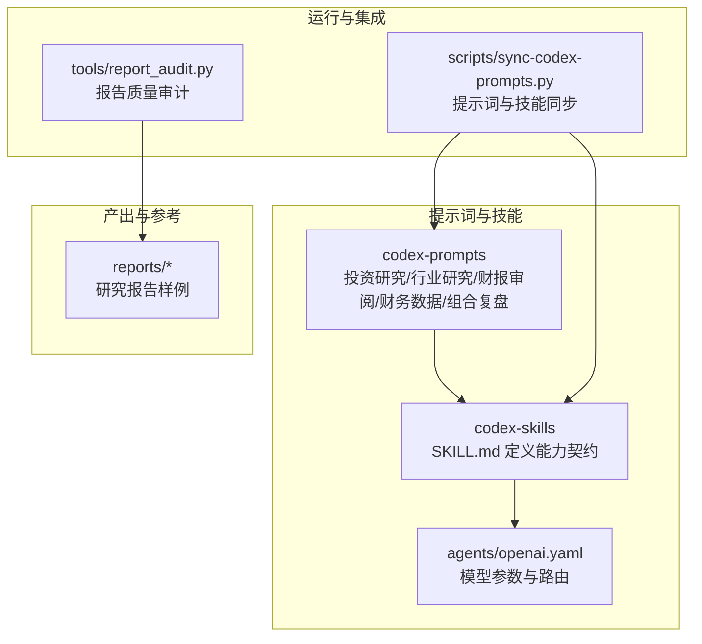
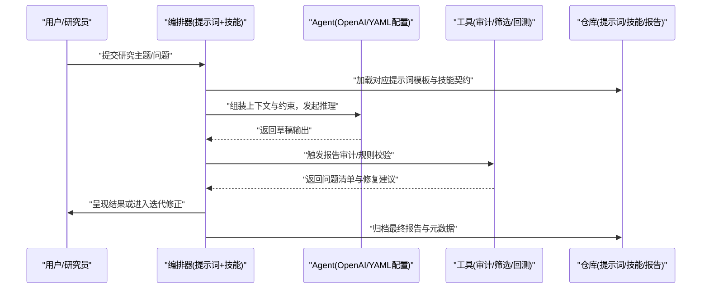
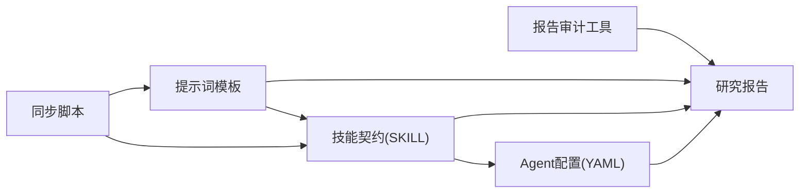

# 提示词设计原则与方法论

<cite>
**本文引用的文件**   
- [README_EN.md](file://README_EN.md)
- [AGENTS.md](file://AGENTS.md)
- [CLAUDE.md](file://CLAUDE.md)
- [codex-prompts/investment-research.md](file://codex-prompts/investment-research.md)
- [codex-prompts/industry-research.md](file://codex-prompts/industry-research.md)
- [codex-prompts/earnings-review.md](file://codex-prompts/earnings-review.md)
- [codex-prompts/financial-data.md](file://codex-prompts/financial-data.md)
- [codex-prompts/portfolio-review.md](file://codex-prompts/portfolio-review.md)
- [codex-skills/investment-memo-craft/SKILL.md](file://codex-skills/investment-memo-craft/SKILL.md)
- [codex-skills/investment-memo-craft/agents/openai.yaml](file://codex-skills/investment-memo-craft/agents/openai.yaml)
- [scripts/sync-codex-prompts.py](file://scripts/sync-codex-prompts.py)
- [tools/report_audit.py](file://tools/report_audit.py)
</cite>

## 目录
1. [引言](#引言)
2. [项目结构](#项目结构)
3. [核心组件](#核心组件)
4. [架构总览](#架构总览)
5. [详细组件分析](#详细组件分析)
6. [依赖关系分析](#依赖关系分析)
7. [性能与成本优化](#性能与成本优化)
8. [故障排查指南](#故障排查指南)
9. [结论](#结论)
10. [附录](#附录)

## 引言
本文件面向投资研究场景，系统化阐述结构化提示词的设计原则与方法论。围绕角色设定、任务分解、约束条件、输出格式等关键要素，结合上下文管理策略（信息组织、记忆保持、多轮对话）与输出控制机制（格式规范、质量控制、错误处理），构建一套可复用的提示词工程最佳实践框架。文档同时给出实际投研工作流中的示例与对比思路，帮助读者快速落地到公司研究、行业扫描、财报审阅、组合复盘等高频任务。

## 项目结构
仓库采用“提示词模板 + 技能定义 + 工具脚本”的分层组织方式：
- codex-prompts：按任务域划分的提示词模板集合，覆盖投研全流程（公司研究、行业研究、财报审阅、财务数据、组合复盘等）。
- codex-skills：以SKILL.md为入口的技能定义，描述能力边界、输入输出、调用约定；部分技能包含agent配置（如openai.yaml）。
- scripts：用于同步、安装、部署的辅助脚本，包括将提示词与技能分发到不同环境的脚本。
- tools：研究与质量保障工具，如报告审计、筛选器、回测等。
- reports：历史研究报告样例，可作为提示词效果验证与风格对齐的参考。

图示来源
- [codex-prompts/investment-research.md](file://codex-prompts/investment-research.md)
- [codex-skills/investment-memo-craft/SKILL.md](file://codex-skills/investment-memo-craft/SKILL.md)
- [codex-skills/investment-memo-craft/agents/openai.yaml](file://codex-skills/investment-memo-craft/agents/openai.yaml)
- [scripts/sync-codex-prompts.py](file://scripts/sync-codex-prompts.py)
- [tools/report_audit.py](file://tools/report_audit.py)

章节来源
- [README_EN.md](file://README_EN.md)
- [AGENTS.md](file://AGENTS.md)
- [CLAUDE.md](file://CLAUDE.md)

## 核心组件
- 提示词模板族（codex-prompts）
  - 投资研究：聚焦公司基本面、护城河、估值与安全边际的结构化拆解。
  - 行业研究：产业全景、竞争格局、技术路线与政策环境的多维扫描。
  - 财报审阅：三表勾稽、异常识别、管理层讨论与前瞻指引解读。
  - 财务数据：指标提取、口径统一、时间序列与可比性校验。
  - 组合复盘：持仓归因、风险暴露、再平衡建议与情景压力测试。
- 技能契约（codex-skills）
  - SKILL.md：明确能力范围、输入输出、前置条件、失败重试与回退策略。
  - agents/openai.yaml：模型选择、温度/最大长度等参数，以及多Agent协作路由。
- 同步与装配（scripts）
  - sync-codex-prompts.py：将提示词与技能打包并分发至目标环境，保证版本一致性。
- 质量审计（tools）
  - report_audit.py：对生成报告进行规则检查、缺失项检测、引用完整性校验与风格一致性评估。

章节来源
- [codex-prompts/investment-research.md](file://codex-prompts/investment-research.md)
- [codex-prompts/industry-research.md](file://codex-prompts/industry-research.md)
- [codex-prompts/earnings-review.md](file://codex-prompts/earnings-review.md)
- [codex-prompts/financial-data.md](file://codex-prompts/financial-data.md)
- [codex-prompts/portfolio-review.md](file://codex-prompts/portfolio-review.md)
- [codex-skills/investment-memo-craft/SKILL.md](file://codex-skills/investment-memo-craft/SKILL.md)
- [codex-skills/investment-memo-craft/agents/openai.yaml](file://codex-skills/investment-memo-craft/agents/openai.yaml)
- [scripts/sync-codex-prompts.py](file://scripts/sync-codex-prompts.py)
- [tools/report_audit.py](file://tools/report_audit.py)

## 架构总览
从“需求→提示词编排→模型推理→输出控制→质量审计→归档”的全链路如下：

图示来源
- [codex-skills/investment-memo-craft/SKILL.md](file://codex-skills/investment-memo-craft/SKILL.md)
- [codex-skills/investment-memo-craft/agents/openai.yaml](file://codex-skills/investment-memo-craft/agents/openai.yaml)
- [tools/report_audit.py](file://tools/report_audit.py)
- [scripts/sync-codex-prompts.py](file://scripts/sync-codex-prompts.py)

## 详细组件分析

### 结构化提示词设计原则
- 角色设定
  - 明确专家身份与研究视角（如“价值投资者/行业分析师/风控官”），限定知识边界与表达风格。
- 任务分解
  - 将复杂问题拆分为子任务（信息收集→分析→综合→结论），每个子任务有独立输入输出与验收标准。
- 约束条件
  - 数据时效、口径一致、假设透明、不确定性标注、反证与敏感性分析要求。
- 输出格式
  - 固定结构（摘要、要点、证据链、风险、结论与建议）、字段字典、单位与日期格式、引用规范。
- 上下文管理
  - 信息分层（背景/事实/观点/假设）、记忆槽位（关键结论/待验证点）、多轮对话状态机（澄清→补充→收敛）。
- 输出控制
  - 格式校验、质量阈值、错误回退（降级到更保守结论或请求更多数据）、版本留痕。

章节来源
- [codex-prompts/investment-research.md](file://codex-prompts/investment-research.md)
- [codex-prompts/industry-research.md](file://codex-prompts/industry-research.md)
- [codex-prompts/earnings-review.md](file://codex-prompts/earnings-review.md)
- [codex-prompts/financial-data.md](file://codex-prompts/financial-data.md)
- [codex-prompts/portfolio-review.md](file://codex-prompts/portfolio-review.md)

### 上下文管理策略
- 信息组织
  - 使用“事实-证据-推断-结论”四层结构，避免观点与数据混排。
- 记忆保持
  - 维护“全局记忆”（研究假设、关键变量、结论快照）与“会话记忆”（当前子任务进展）。
- 多轮对话管理
  - 引入“澄清轮次”“增量补充轮次”“收敛轮次”，每轮明确输入来源与变更影响面。
- 版本与溯源
  - 每次迭代保留差异说明与依据链接，便于回溯与审计。

章节来源
- [codex-skills/investment-memo-craft/SKILL.md](file://codex-skills/investment-memo-craft/SKILL.md)
- [codex-skills/investment-memo-craft/agents/openai.yaml](file://codex-skills/investment-memo-craft/agents/openai.yaml)

### 输出控制机制
- 格式规范
  - 强制字段、枚举值、数值精度、单位、时间戳与时区、引用编号。
- 质量控制
  - 自动规则检查（完整性、一致性、逻辑自洽）、抽样人工复核、红队挑战（反证与压力测试）。
- 错误处理
  - 缺失数据时的降级策略、冲突信息的仲裁规则、不可判定情形的显式声明。

章节来源
- [tools/report_audit.py](file://tools/report_audit.py)
- [codex-skills/investment-memo-craft/SKILL.md](file://codex-skills/investment-memo-craft/SKILL.md)

### 投资研究场景下的应用示例
- 公司深度研究
  - 角色：资深价值分析师；任务：商业模式→护城河→财务质量→估值与安全边际；约束：近三期财报+最新公告；输出：标准化备忘录。
- 行业全景扫描
  - 角色：产业研究员；任务：产业链图谱→竞争格局→技术演进→政策催化；约束：权威来源优先；输出：结构化简报。
- 财报审阅
  - 角色：财务审计型分析师；任务：三表勾稽→异常识别→管理层解读；约束：会计口径一致；输出：问题清单与修订建议。
- 组合复盘
  - 角色：投资组合经理；任务：归因分析→风险暴露→情景压力→调仓建议；约束：基准与因子一致；输出：决策备忘录。

章节来源
- [codex-prompts/investment-research.md](file://codex-prompts/investment-research.md)
- [codex-prompts/industry-research.md](file://codex-prompts/industry-research.md)
- [codex-prompts/earnings-review.md](file://codex-prompts/earnings-review.md)
- [codex-prompts/portfolio-review.md](file://codex-prompts/portfolio-review.md)

### 设计模式与反模式
- 设计模式
  - 模板化：按任务域沉淀模板，复用角色/结构/约束/输出。
  - 契约化：SKILL.md定义输入输出与失败回退，确保可替换实现。
  - 流水线化：将“检索→分析→合成→审计”串成可编排流程。
  - 可观测性：记录提示词版本、参数、输入摘要与输出指纹，便于回归与对比。
- 反模式识别
  - 过度自由：缺少结构与约束导致输出不稳定。
  - 上下文爆炸：一次性塞入过多材料，降低注意力与准确性。
  - 黑盒推理：不展示证据链与假设，难以审计与改进。
  - 单点依赖：单一数据源或单一模型，缺乏交叉验证与降级路径。

章节来源
- [codex-skills/investment-memo-craft/SKILL.md](file://codex-skills/investment-memo-craft/SKILL.md)
- [codex-skills/investment-memo-craft/agents/openai.yaml](file://codex-skills/investment-memo-craft/agents/openai.yaml)

### 效果对比与度量
- 维度
  - 准确性（事实正确率/引用完整度）、一致性（结构/术语/口径）、效率（首稿时间/迭代次数）、可审计性（溯源覆盖率）。
- 方法
  - 基线A：无结构化提示词；基线B：仅模板；方案C：模板+契约+审计。
  - 通过report_audit.py自动化打分，辅以人工抽检与同行评审。
- 预期
  - C在准确性与一致性上显著优于A/B，且迭代次数下降、可审计性提升。

章节来源
- [tools/report_audit.py](file://tools/report_audit.py)

## 依赖关系分析
- 模块耦合
  - 提示词模板与技能契约强相关：模板提供内容骨架，契约规定接口与行为。
  - Agent配置驱动模型选择与参数，影响输出稳定性与成本。
  - 同步脚本负责版本一致性，避免“提示词漂移”。
  - 审计工具作为后置关卡，保障输出质量与合规。
- 外部依赖
  - 大模型API（由agents配置指定）、数据源（研报/公告/数据库）、本地文件系统（报告归档）。

图示来源
- [codex-prompts/investment-research.md](file://codex-prompts/investment-research.md)
- [codex-skills/investment-memo-craft/SKILL.md](file://codex-skills/investment-memo-craft/SKILL.md)
- [codex-skills/investment-memo-craft/agents/openai.yaml](file://codex-skills/investment-memo-craft/agents/openai.yaml)
- [scripts/sync-codex-prompts.py](file://scripts/sync-codex-prompts.py)
- [tools/report_audit.py](file://tools/report_audit.py)

章节来源
- [scripts/sync-codex-prompts.py](file://scripts/sync-codex-prompts.py)
- [tools/report_audit.py](file://tools/report_audit.py)

## 性能与成本优化
- 提示词层面
  - 精简上下文：只注入必要事实与关键证据，避免冗余。
  - 分步推理：先列要点与证据，再给结论，减少长文本一次性生成。
  - 结构化输出：固定字段与枚举，降低后处理成本。
- 模型与参数
  - 根据任务复杂度选择模型与温度/最大长度，简单任务用轻量模型，复杂推理用更强模型。
  - 缓存与复用：对稳定部分的输出做哈希缓存，避免重复计算。
- 流程与工具
  - 并行化：多子任务并行生成，最后合并与校验。
  - 预检与过滤：在调用前进行输入合法性与必要性检查，减少无效调用。
  - 审计前置：在生成阶段嵌入轻量规则检查，尽早发现问题。

[本节为通用指导，无需特定文件来源]

## 故障排查指南
- 常见问题
  - 输出结构不一致：检查模板字段与契约是否匹配，确认审计规则已启用。
  - 数据口径不一致：核对财务数据模板的指标定义与时间窗口。
  - 幻觉与引用缺失：强化“必须附证据链”的约束，并在审计中增加引用完整性检查。
  - 多轮对话发散：引入“收敛轮次”与“变更影响面”声明，限制上下文膨胀。
- 定位步骤
  - 查看提示词版本与参数快照，复现问题。
  - 使用审计工具输出问题清单，逐项修复。
  - 若涉及模型差异，切换agents配置进行对照实验。
- 回退策略
  - 降级到更保守结论或请求更多数据；必要时退回上一轮有效状态。

章节来源
- [tools/report_audit.py](file://tools/report_audit.py)
- [codex-skills/investment-memo-craft/SKILL.md](file://codex-skills/investment-memo-craft/SKILL.md)
- [codex-skills/investment-memo-craft/agents/openai.yaml](file://codex-skills/investment-memo-craft/agents/openai.yaml)

## 结论
通过将“角色-任务-约束-输出”的结构化原则与“上下文管理-输出控制-质量审计”的工程化手段相结合，可在投资研究场景中显著提升提示词的稳定性、可审计性与可复用性。配合技能契约与同步脚本，团队可实现跨成员、跨任务的标准化生产与持续改进。

[本节为总结性内容，无需特定文件来源]

## 附录
- 快速上手
  - 选择对应任务域的提示词模板，阅读配套SKILL.md，按契约准备输入。
  - 使用同步脚本将模板与技能部署到目标环境，确保版本一致。
  - 生成后运行报告审计，根据问题清单迭代完善。
- 扩展建议
  - 新增任务域时，遵循“模板+契约+审计”的三位一体范式，逐步沉淀团队知识库。
  - 建立提示词版本库与效果看板，持续追踪准确性、一致性与效率指标。

[本节为操作指引，无需特定文件来源]