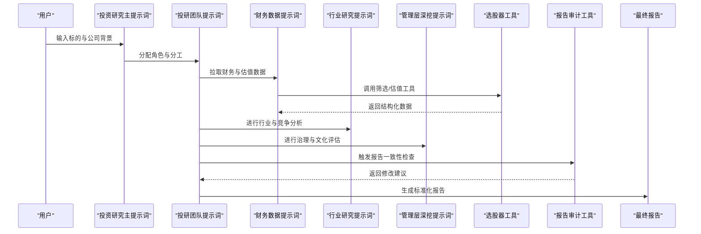
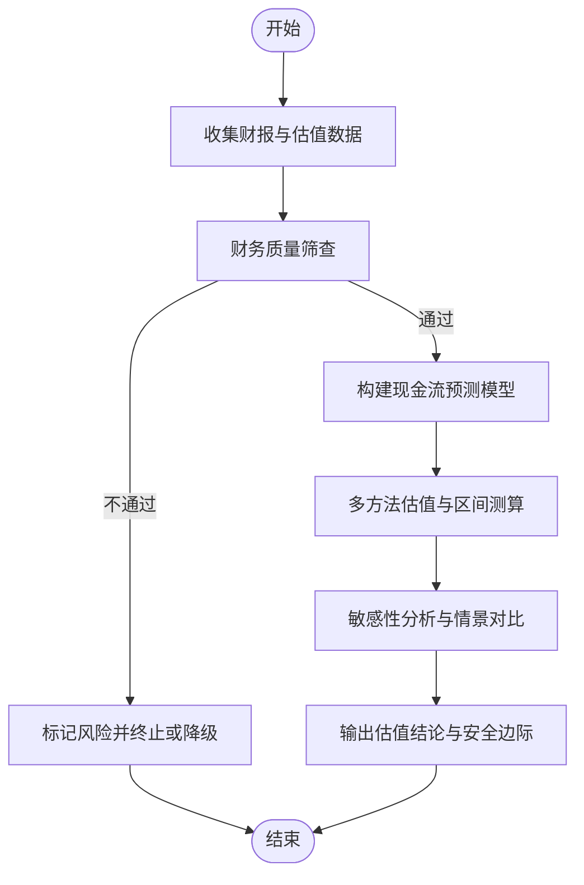
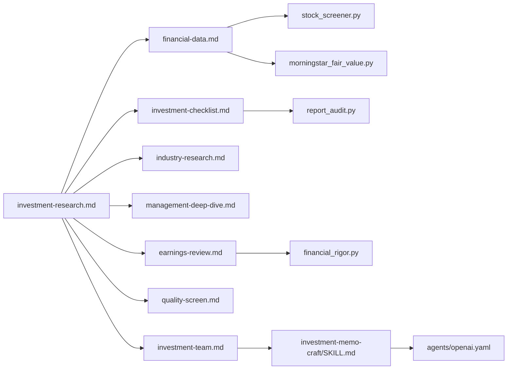

# 投资研究通用框架模板

<cite>
**本文引用的文件**   
- [README_EN.md](file://README_EN.md)
- [AGENTS.md](file://AGENTS.md)
- [CLAUDE.md](file://CLAUDE.md)
- [investment-research.md](file://codex-prompts/investment-research.md)
- [investment-team.md](file://codex-prompts/investment-team.md)
- [financial-data.md](file://codex-prompts/financial-data.md)
- [industry-research.md](file://codex-prompts/industry-research.md)
- [management-deep-dive.md](file://codex-prompts/management-deep-dive.md)
- [earnings-review.md](file://codex-prompts/earnings-review.md)
- [quality-screen.md](file://codex-prompts/quality-screen.md)
- [investment-checklist.md](file://codex-prompts/investment-checklist.md)
- [deep-company-series.md](file://codex-prompts/deep-company-series.md)
- [private-company-research.md](file://codex-prompts/private-company-research.md)
- [thesis-tracker.md](file://codex-prompts/thesis-tracker.md)
- [thesis-drift.md](file://codex-prompts/thesis-drift.md)
- [portfolio-review.md](file://codex-prompts/portfolio-review.md)
- [news-pulse.md](file://codex-prompts/news-pulse.md)
- [bottleneck-hunter.md](file://codex-prompts/bottleneck-hunter.md)
- [dyp-ask.md](file://codex-prompts/dyp-ask.md)
- [wechat-article.md](file://codex-prompts/wechat-article.md)
- [SKILL.md](file://codex-skills/investment-memo-craft/SKILL.md)
- [openai.yaml](file://codex-skills/investment-memo-craft/agents/openai.yaml)
- [stock_screener.py](file://tools/stock_screener.py)
- [morningstar_fair_value.py](file://tools/morningstar_fair_value.py)
- [report_audit.py](file://tools/report_audit.py)
- [financial_rigor.py](file://tools/financial_rigor.py)
</cite>

## 目录
1. [简介](#简介)
2. [项目结构](#项目结构)
3. [核心组件](#核心组件)
4. [架构总览](#架构总览)
5. [详细组件分析](#详细组件分析)
6. [依赖关系分析](#依赖关系分析)
7. [性能与可扩展性](#性能与可扩展性)
8. [故障排查指南](#故障排查指南)
9. [结论](#结论)
10. [附录](#附录)

## 简介
本文件面向“投资研究通用框架提示词”的解析与使用，聚焦四大师分析法（巴菲特、芒格、段永平、李录）的整合逻辑与分析维度，覆盖商业模式分析、财务估值分析、行业竞争分析、风险管理评估等核心模块的实现机制。文档同时给出报告生成的标准化格式与输出规范、参数配置选项、使用示例与自定义方法，并说明如何针对不同公司类型调整分析重点与权重，最后提供最佳实践与常见问题解决方案。

## 项目结构
仓库采用“提示词+技能+工具+案例报告”的分层组织方式：
- codex-prompts：按投研任务拆分的提示词模板，覆盖从初筛到深度研究的全流程
- codex-skills：可复用的技能定义与Agent编排配置
- tools：数据抓取、筛选、审计与质量校验脚本
- reports：大量真实公司研究报告样例，体现统一结构与风格
- 根级元信息：README、AGENTS、CLAUDE 等用于整体使用说明与环境约定

```mermaid
graph TB
subgraph "提示词层"
P1["investment-research.md"]
P2["investment-team.md"]
P3["financial-data.md"]
P4["industry-research.md"]
P5["management-deep-dive.md"]
P6["earnings-review.md"]
P7["quality-screen.md"]
P8["investment-checklist.md"]
P9["deep-company-series.md"]
P10["private-company-research.md"]
P11["thesis-tracker.md"]
P12["thesis-drift.md"]
P13["portfolio-review.md"]
P14["news-pulse.md"]
P15["bottleneck-hunter.md"]
P16["dyp-ask.md"]
P17["wechat-article.md"]
end
subgraph "技能与Agent"
S1["investment-memo-craft/SKILL.md"]
A1["investment-memo-craft/agents/openai.yaml"]
end
subgraph "工具层"
T1["stock_screener.py"]
T2["morningstar_fair_value.py"]
T3["report_audit.py"]
T4["financial_rigor.py"]
end
subgraph "输出与样例"
R1["reports/*/*.md"]
end
P1 --> S1
P2 --> S1
P3 --> T1
P3 --> T2
P4 --> T1
P5 --> T4
P6 --> T4
P7 --> T1
P8 --> T3
P9 --> R1
P10 --> R1
P11 --> R1
P12 --> R1
P13 --> R1
P14 --> R1
P15 --> R1
P16 --> R1
P17 --> R1
```

图示来源
- [investment-research.md](file://codex-prompts/investment-research.md)
- [investment-team.md](file://codex-prompts/investment-team.md)
- [financial-data.md](file://codex-prompts/financial-data.md)
- [industry-research.md](file://codex-prompts/industry-research.md)
- [management-deep-dive.md](file://codex-prompts/management-deep-dive.md)
- [earnings-review.md](file://codex-prompts/earnings-review.md)
- [quality-screen.md](file://codex-prompts/quality-screen.md)
- [investment-checklist.md](file://codex-prompts/investment-checklist.md)
- [deep-company-series.md](file://codex-prompts/deep-company-series.md)
- [private-company-research.md](file://codex-prompts/private-company-research.md)
- [thesis-tracker.md](file://codex-prompts/thesis-tracker.md)
- [thesis-drift.md](file://codex-prompts/thesis-drift.md)
- [portfolio-review.md](file://codex-prompts/portfolio-review.md)
- [news-pulse.md](file://codex-prompts/news-pulse.md)
- [bottleneck-hunter.md](file://codex-prompts/bottleneck-hunter.md)
- [dyp-ask.md](file://codex-prompts/dyp-ask.md)
- [wechat-article.md](file://codex-prompts/wechat-article.md)
- [SKILL.md](file://codex-skills/investment-memo-craft/SKILL.md)
- [openai.yaml](file://codex-skills/investment-memo-craft/agents/openai.yaml)
- [stock_screener.py](file://tools/stock_screener.py)
- [morningstar_fair_value.py](file://tools/morningstar_fair_value.py)
- [report_audit.py](file://tools/report_audit.py)
- [financial_rigor.py](file://tools/financial_rigor.py)

章节来源
- [README_EN.md](file://README_EN.md)
- [AGENTS.md](file://AGENTS.md)
- [CLAUDE.md](file://CLAUDE.md)

## 核心组件
- 四大师视角整合
  - 巴菲特视角：强调自由现金流、资本配置、安全边际与长期复利
  - 芒格视角：强调跨学科思维、竞争格局、护城河与逆向思考
  - 段永平视角：强调商业本质、用户价值、企业文化与管理者动机
  - 李录视角：强调风险治理、制度环境、长期主义与概率思维
- 分析维度与模块
  - 商业模式分析：收入模型、成本结构、增长驱动与扩张路径
  - 财务估值分析：历史与前瞻财务指标、DCF/相对估值、情景假设
  - 行业竞争分析：产业链位置、进入壁垒、替代威胁与定价权
  - 风险管理评估：治理结构、合规与政策、技术颠覆与供应链脆弱性
- 报告生成与标准化
  - 统一的章节结构、术语表、数据来源与引用规范
  - 关键图表清单与可视化建议
  - 审核与一致性检查流程

章节来源
- [investment-research.md](file://codex-prompts/investment-research.md)
- [investment-team.md](file://codex-prompts/investment-team.md)
- [financial-data.md](file://codex-prompts/financial-data.md)
- [industry-research.md](file://codex-prompts/industry-research.md)
- [management-deep-dive.md](file://codex-prompts/management-deep-dive.md)
- [earnings-review.md](file://codex-prompts/earnings-review.md)
- [quality-screen.md](file://codex-prompts/quality-screen.md)
- [investment-checklist.md](file://codex-prompts/investment-checklist.md)
- [deep-company-series.md](file://codex-prompts/deep-company-series.md)
- [private-company-research.md](file://codex-prompts/private-company-research.md)
- [thesis-tracker.md](file://codex-prompts/thesis-tracker.md)
- [thesis-drift.md](file://codex-prompts/thesis-drift.md)
- [portfolio-review.md](file://codex-prompts/portfolio-review.md)
- [news-pulse.md](file://codex-prompts/news-pulse.md)
- [bottleneck-hunter.md](file://codex-prompts/bottleneck-hunter.md)
- [dyp-ask.md](file://codex-prompts/dyp-ask.md)
- [wechat-article.md](file://codex-prompts/wechat-article.md)

## 架构总览
系统以“提示词为入口、技能为编排、工具为支撑、报告为产出”的流水线式架构运行。典型调用链如下：

图示来源
- [investment-research.md](file://codex-prompts/investment-research.md)
- [investment-team.md](file://codex-prompts/investment-team.md)
- [financial-data.md](file://codex-prompts/financial-data.md)
- [industry-research.md](file://codex-prompts/industry-research.md)
- [management-deep-dive.md](file://codex-prompts/management-deep-dive.md)
- [stock_screener.py](file://tools/stock_screener.py)
- [report_audit.py](file://tools/report_audit.py)

## 详细组件分析

### 四大师分析法整合逻辑
- 设计要点
  - 将四大师的核心原则映射到具体分析维度，避免空泛口号
  - 通过“问题清单+证据要求+反证检验”的结构化约束提升严谨性
  - 在最终报告中设置“四大师综合评分/共识/分歧”小节，便于决策
- 落地方式
  - 巴菲特：自由现金流折现、ROIC/ROE趋势、资本配置记录、回购与分红
  - 芒格：护城河五力、替代品与生态位、逆向案例库
  - 段永平：用户心智、产品体验、企业价值观与管理者言行一致性
  - 李录：治理结构、监管环境、长期风险因子与尾部风险压力测试

章节来源
- [investment-research.md](file://codex-prompts/investment-research.md)
- [investment-team.md](file://codex-prompts/investment-team.md)
- [investment-checklist.md](file://codex-prompts/investment-checklist.md)

### 商业模式分析（段永平视角）
- 关注点
  - 收入来源与定价权、客户粘性与转换成本、渠道与网络效应
  - 成本结构与规模经济、单位经济模型（UE）与盈利拐点
- 输出规范
  - 业务全景图、价值链定位、关键假设与敏感性分析
  - 对标公司与差异化证据

章节来源
- [investment-research.md](file://codex-prompts/investment-research.md)
- [management-deep-dive.md](file://codex-prompts/management-deep-dive.md)

### 财务估值分析（巴菲特视角）
- 关注点
  - 历史财务质量（利润含金量、营运资本、折旧摊销）、未来现金流预测
  - 估值方法组合：DCF、相对估值、资产法与情景分析
- 工具集成
  - 通过财务数据提示词与选股器/公允价值工具获取数据与基准

图示来源
- [financial-data.md](file://codex-prompts/financial-data.md)
- [stock_screener.py](file://tools/stock_screener.py)
- [morningstar_fair_value.py](file://tools/morningstar_fair_value.py)

章节来源
- [financial-data.md](file://codex-prompts/financial-data.md)
- [stock_screener.py](file://tools/stock_screener.py)
- [morningstar_fair_value.py](file://tools/morningstar_fair_value.py)

### 行业竞争分析（芒格视角）
- 关注点
  - 产业生命周期、集中度变化、进入壁垒与退出成本
  - 上下游议价能力、替代品威胁与跨界竞争
- 输出规范
  - 竞争矩阵、波特五力评估、关键变量跟踪清单

章节来源
- [industry-research.md](file://codex-prompts/industry-research.md)
- [investment-research.md](file://codex-prompts/investment-research.md)

### 风险管理评估（李录视角）
- 关注点
  - 公司治理与激励相容、合规与政策风险、技术与供应链脆弱性
  - 尾部风险识别与压力测试、对冲策略与预案
- 输出规范
  - 风险清单、影响概率矩阵、缓释措施与监控指标

章节来源
- [management-deep-dive.md](file://codex-prompts/management-deep-dive.md)
- [investment-checklist.md](file://codex-prompts/investment-checklist.md)

### 报告生成与标准化
- 标准结构
  - 摘要、投资主题、四大师综合分析、商业模式、财务估值、行业竞争、风险管理、催化剂与时间表、结论与建议、附录与数据来源
- 质量控制
  - 报告审计工具对一致性、完整性与引用规范进行检查
  - 版本管理与变更追踪

章节来源
- [investment-research.md](file://codex-prompts/investment-research.md)
- [report_audit.py](file://tools/report_audit.py)

### 参数配置与使用示例
- 常用参数
  - 标的代码/名称、市场与交易所、时间窗口、估值方法选择、权重偏好（如更重视现金流或竞争格局）、输出语言与格式
- 使用示例
  - 单公司深度研究：以“投资研究主提示词”为入口，串联“投研团队”“财务数据”“行业研究”“管理层深挖”等子提示词
  - 批量初筛：结合“质量筛选”与“选股器工具”，输出候选池后进入深度研究
  - 专题研究：使用“瓶颈猎手”“新闻脉冲”“微信文章”等提示词补充事件与舆情

章节来源
- [investment-research.md](file://codex-prompts/investment-research.md)
- [investment-team.md](file://codex-prompts/investment-team.md)
- [quality-screen.md](file://codex-prompts/quality-screen.md)
- [bottleneck-hunter.md](file://codex-prompts/bottleneck-hunter.md)
- [news-pulse.md](file://codex-prompts/news-pulse.md)
- [wechat-article.md](file://codex-prompts/wechat-article.md)

### 不同公司类型的调整建议
- 成熟消费/公用事业：提高现金流与分红权重，降低成长假设敏感度
- 科技平台/互联网：强化网络效应、用户粘性与监管风险评估
- 周期制造/资源：突出价格弹性、产能利用率与库存周期
- 生物医药/硬科技：重视研发管线、专利与注册审批风险
- 未上市/早期公司：侧重创始人背景、里程碑达成与融资条款保护

章节来源
- [private-company-research.md](file://codex-prompts/private-company-research.md)
- [deep-company-series.md](file://codex-prompts/deep-company-series.md)

### 自定义方法与扩展
- 新增分析维度
  - 在“投资研究主提示词”中扩展维度卡片，并在“投研团队提示词”中分配角色与交付物
- 接入新数据源
  - 在“财务数据提示词”中声明字段契约，编写对应工具脚本，纳入“报告审计”校验
- Agent编排
  - 基于“投资备忘录技能”与Agent配置文件，定义多Agent协作流程与消息协议

章节来源
- [SKILL.md](file://codex-skills/investment-memo-craft/SKILL.md)
- [openai.yaml](file://codex-skills/investment-memo-craft/agents/openai.yaml)
- [investment-research.md](file://codex-prompts/investment-research.md)
- [financial-data.md](file://codex-prompts/financial-data.md)

## 依赖关系分析
- 提示词之间
  - “投资研究主提示词”作为编排入口，依赖“投研团队”“财务数据”“行业研究”“管理层深挖”“收益审阅”“质量筛选”“清单”等子提示词
- 提示词与工具
  - 财务与行业分析依赖“选股器”“晨星公允价值”等工具；报告质量依赖“报告审计”“财务严谨性”工具
- 技能与Agent
  - “投资备忘录技能”定义工作流与Agent配置，支撑复杂报告的协同生产

图示来源
- [investment-research.md](file://codex-prompts/investment-research.md)
- [investment-team.md](file://codex-prompts/investment-team.md)
- [financial-data.md](file://codex-prompts/financial-data.md)
- [industry-research.md](file://codex-prompts/industry-research.md)
- [management-deep-dive.md](file://codex-prompts/management-deep-dive.md)
- [earnings-review.md](file://codex-prompts/earnings-review.md)
- [quality-screen.md](file://codex-prompts/quality-screen.md)
- [investment-checklist.md](file://codex-prompts/investment-checklist.md)
- [stock_screener.py](file://tools/stock_screener.py)
- [morningstar_fair_value.py](file://tools/morningstar_fair_value.py)
- [report_audit.py](file://tools/report_audit.py)
- [financial_rigor.py](file://tools/financial_rigor.py)
- [SKILL.md](file://codex-skills/investment-memo-craft/SKILL.md)
- [openai.yaml](file://codex-skills/investment-memo-craft/agents/openai.yaml)

章节来源
- [investment-research.md](file://codex-prompts/investment-research.md)
- [investment-team.md](file://codex-prompts/investment-team.md)
- [financial-data.md](file://codex-prompts/financial-data.md)
- [industry-research.md](file://codex-prompts/industry-research.md)
- [management-deep-dive.md](file://codex-prompts/management-deep-dive.md)
- [earnings-review.md](file://codex-prompts/earnings-review.md)
- [quality-screen.md](file://codex-prompts/quality-screen.md)
- [investment-checklist.md](file://codex-prompts/investment-checklist.md)
- [stock_screener.py](file://tools/stock_screener.py)
- [morningstar_fair_value.py](file://tools/morningstar_fair_value.py)
- [report_audit.py](file://tools/report_audit.py)
- [financial_rigor.py](file://tools/financial_rigor.py)
- [SKILL.md](file://codex-skills/investment-memo-craft/SKILL.md)
- [openai.yaml](file://codex-skills/investment-memo-craft/agents/openai.yaml)

## 性能与可扩展性
- 并行化
  - 将“财务数据”“行业研究”“管理层深挖”等子任务并行执行，缩短端到端时延
- 缓存与复用
  - 对高频数据（财报、估值基准、行业指标）建立缓存层，减少重复计算
- 增量更新
  - 针对季报/年报发布，仅重算受影响模块并合并差异
- 可扩展性
  - 通过“技能+Agent”配置快速接入新的数据源与分析维度，保持提示词稳定

[本节为通用指导，无需列出具体文件来源]

## 故障排查指南
- 数据缺失或不一致
  - 使用“报告审计”与“财务严谨性”工具定位字段缺失、口径不一致与异常值
- 估值结果不稳定
  - 检查DCF关键假设（增长率、折现率、永续期），进行敏感性分析并记录假设依据
- 报告质量不达标
  - 对照“清单”逐项核对，确保引用完整、图表清晰、结论有据
- 多Agent协作异常
  - 检查“Agent配置”中的消息协议与权限边界，确认各角色职责清晰

章节来源
- [report_audit.py](file://tools/report_audit.py)
- [financial_rigor.py](file://tools/financial_rigor.py)
- [investment-checklist.md](file://codex-prompts/investment-checklist.md)
- [openai.yaml](file://codex-skills/investment-memo-craft/agents/openai.yaml)

## 结论
本框架以“四大师分析法”为核心方法论，结合标准化的提示词体系、可插拔的工具链与严格的报告审计流程，形成从初筛到深度研究再到成果沉淀的闭环。通过模块化设计与参数化配置，既能满足单公司深度研究，也能支撑大规模扫描与专题研究。建议在团队内推广统一的数据口径与报告规范，持续完善工具链与知识库，以提升研究与投资决策的效率与质量。

[本节为总结性内容，无需列出具体文件来源]

## 附录
- 快速上手
  - 阅读根级说明文件，了解环境与命令安装方式
  - 从“投资研究主提示词”开始，逐步引入“投研团队”“财务数据”“行业研究”等子提示词
- 参考样例
  - 查看“reports”目录下多家公司的研究报告，学习结构与表达范式
- 进阶用法
  - 结合“论文追踪”“论文漂移”“投资组合回顾”“新闻脉冲”“瓶颈猎手”等提示词，构建持续研究体系

章节来源
- [README_EN.md](file://README_EN.md)
- [AGENTS.md](file://AGENTS.md)
- [CLAUDE.md](file://CLAUDE.md)
- [thesis-tracker.md](file://codex-prompts/thesis-tracker.md)
- [thesis-drift.md](file://codex-prompts/thesis-drift.md)
- [portfolio-review.md](file://codex-prompts/portfolio-review.md)
- [news-pulse.md](file://codex-prompts/news-pulse.md)
- [bottleneck-hunter.md](file://codex-prompts/bottleneck-hunter.md)