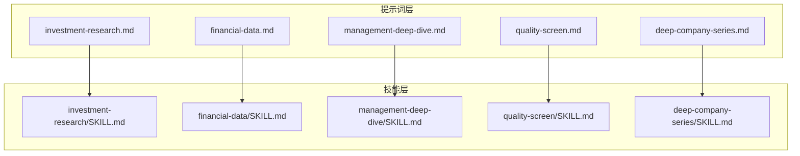
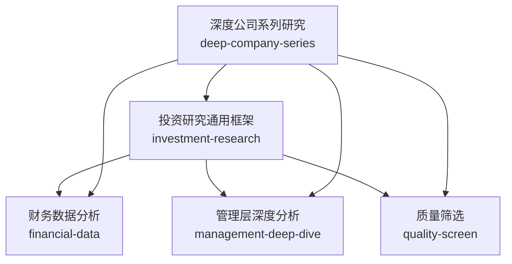
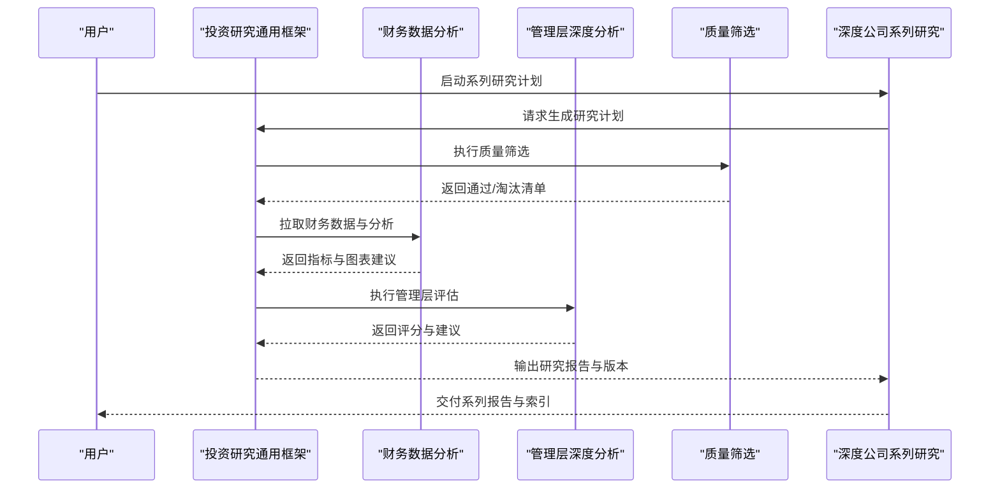

# 核心提示词模板解析

<cite>
**本文引用的文件**   
- [codex-prompts/investment-research.md](file://codex-prompts/investment-research.md)
- [codex-prompts/financial-data.md](file://codex-prompts/financial-data.md)
- [codex-prompts/management-deep-dive.md](file://codex-prompts/management-deep-dive.md)
- [codex-prompts/quality-screen.md](file://codex-prompts/quality-screen.md)
- [codex-prompts/deep-company-series.md](file://codex-prompts/deep-company-series.md)
- [codex-skills/investment-research/SKILL.md](file://codex-skills/investment-research/SKILL.md)
- [codex-skills/financial-data/SKILL.md](file://codex-skills/financial-data/SKILL.md)
- [codex-skills/management-deep-dive/SKILL.md](file://codex-skills/management-deep-dive/SKILL.md)
- [codex-skills/quality-screen/SKILL.md](file://codex-skills/quality-screen/SKILL.md)
- [codex-skills/deep-company-series/SKILL.md](file://codex-skills/deep-company-series/SKILL.md)
</cite>

## 目录
1. [引言](#引言)
2. [项目结构](#项目结构)
3. [核心组件](#核心组件)
4. [架构总览](#架构总览)
5. [详细组件分析](#详细组件分析)
6. [依赖关系分析](#依赖关系分析)
7. [性能与质量考量](#性能与质量考量)
8. [故障排查指南](#故障排查指南)
9. [结论](#结论)
10. [附录](#附录)

## 引言
本文件面向投资研究场景，系统化解析“核心提示词模板”的设计与实现，覆盖以下关键主题：
- 投资研究通用框架：分析维度、评估标准、报告格式等要素的结构化设计
- 财务数据分析模板：数据提取、指标计算、可视化呈现的技术路径与输出规范
- 管理层深度分析：评估体系与判断标准
- 质量筛选标准：量化指标与筛选逻辑
- 深度公司系列研究：系统化分析方法与组合工作流
- 每个模板的参数说明、使用示例、输出样例与自定义选项
- 模板间的依赖关系与组合使用方法

## 项目结构
仓库采用“提示词（prompts）+技能（skills）”的双层组织方式：
- codex-prompts：以Markdown形式定义各模板的输入参数、处理流程、输出结构与约束条件
- codex-skills：将对应模板封装为可复用的技能单元，便于在工具链中调用与编排

图表来源
- [codex-prompts/investment-research.md](file://codex-prompts/investment-research.md)
- [codex-prompts/financial-data.md](file://codex-prompts/financial-data.md)
- [codex-prompts/management-deep-dive.md](file://codex-prompts/management-deep-dive.md)
- [codex-prompts/quality-screen.md](file://codex-prompts/quality-screen.md)
- [codex-prompts/deep-company-series.md](file://codex-prompts/deep-company-series.md)
- [codex-skills/investment-research/SKILL.md](file://codex-skills/investment-research/SKILL.md)
- [codex-skills/financial-data/SKILL.md](file://codex-skills/financial-data/SKILL.md)
- [codex-skills/management-deep-dive/SKILL.md](file://codex-skills/management-deep-dive/SKILL.md)
- [codex-skills/quality-screen/SKILL.md](file://codex-skills/quality-screen/SKILL.md)
- [codex-skills/deep-company-series/SKILL.md](file://codex-skills/deep-company-series/SKILL.md)

章节来源
- [codex-prompts/investment-research.md](file://codex-prompts/investment-research.md)
- [codex-prompts/financial-data.md](file://codex-prompts/financial-data.md)
- [codex-prompts/management-deep-dive.md](file://codex-prompts/management-deep-dive.md)
- [codex-prompts/quality-screen.md](file://codex-prompts/quality-screen.md)
- [codex-prompts/deep-company-series.md](file://codex-prompts/deep-company-series.md)
- [codex-skills/investment-research/SKILL.md](file://codex-skills/investment-research/SKILL.md)
- [codex-skills/financial-data/SKILL.md](file://codex-skills/financial-data/SKILL.md)
- [codex-skills/management-deep-dive/SKILL.md](file://codex-skills/management-deep-dive/SKILL.md)
- [codex-skills/quality-screen/SKILL.md](file://codex-skills/quality-screen/SKILL.md)
- [codex-skills/deep-company-series/SKILL.md](file://codex-skills/deep-company-series/SKILL.md)

## 核心组件
本节聚焦五大核心模板，逐一拆解其结构设计、输入参数、处理逻辑与输出规范。

- 投资研究通用框架（investment-research）
  - 目标：提供统一的研究入口，串联商业模式、行业竞争、财务估值与管理层治理等多维分析
  - 典型输入：公司名称/代码、研究范围、时间窗口、重点问题清单、参考视角
  - 处理逻辑：按模块生成子报告并汇总形成最终研究报告
  - 输出：结构化研究报告（含摘要、分节结论、风险与建议）

- 财务数据分析（financial-data）
  - 目标：从财报与公开数据中提取关键指标，完成趋势与对比分析，并给出可视化建议
  - 典型输入：公司标识、报表期间、指标清单、口径约定
  - 处理逻辑：数据清洗→指标计算→异常检测→可视化方案→解读要点
  - 输出：指标表、趋势图建议、关键发现与风险提示

- 管理层深度分析（management-deep-dive）
  - 目标：评估管理层能力、激励与治理质量，识别潜在代理问题
  - 典型输入：高管履历、薪酬与持股变动、重大决策事件、ESG与合规记录
  - 处理逻辑：证据收集→评分矩阵→一致性检验→结论与建议
  - 输出：管理层画像、评分结果、风险点与改进建议

- 质量筛选（quality-screen）
  - 目标：基于量化标准对候选池进行初筛与去劣
  - 典型输入：候选标的列表、筛选阈值、权重配置、排除规则
  - 处理逻辑：指标计算→阈值判定→排序打分→结果输出
  - 输出：通过/淘汰清单、得分明细、原因说明

- 深度公司系列研究（deep-company-series）
  - 目标：围绕单一公司开展多期、多维度的系统研究，沉淀长期跟踪资产
  - 典型输入：公司标识、研究计划、更新频率、专题清单
  - 处理逻辑：基线构建→专题迭代→版本管理→综合结论
  - 输出：系列报告集、索引与变更日志、关键假设与触发条件

章节来源
- [codex-prompts/investment-research.md](file://codex-prompts/investment-research.md)
- [codex-prompts/financial-data.md](file://codex-prompts/financial-data.md)
- [codex-prompts/management-deep-dive.md](file://codex-prompts/management-deep-dive.md)
- [codex-prompts/quality-screen.md](file://codex-prompts/quality-screen.md)
- [codex-prompts/deep-company-series.md](file://codex-prompts/deep-company-series.md)

## 架构总览
下图展示“提示词—技能—产出”的整体协作关系，以及模板间的数据流向与依赖。

图表来源
- [codex-prompts/investment-research.md](file://codex-prompts/investment-research.md)
- [codex-prompts/financial-data.md](file://codex-prompts/financial-data.md)
- [codex-prompts/management-deep-dive.md](file://codex-prompts/management-deep-dive.md)
- [codex-prompts/quality-screen.md](file://codex-prompts/quality-screen.md)
- [codex-prompts/deep-company-series.md](file://codex-prompts/deep-company-series.md)

## 详细组件分析

### 投资研究通用框架（investment-research）
- 角色定位：研究编排器，负责将多个子模块拼装成完整研究报告
- 输入参数
  - 公司标识（名称/代码）、市场与板块
  - 研究范围（业务、财务、行业、治理等）
  - 时间窗口（历史区间与前瞻期）
  - 重点问题清单（需回答的关键命题）
  - 参考视角（如价值投资、成长投资等）
- 处理流程
  - 初始化研究计划与资料清单
  - 并行或串行调用财务、管理层、行业等子模块
  - 汇总证据、交叉验证、形成一致结论
  - 输出标准化报告结构
- 输出结构（建议）
  - 执行摘要
  - 商业模式与护城河
  - 行业格局与竞争态势
  - 财务与估值分析
  - 管理层与治理评估
  - 风险因素与安全边际
  - 投资建议与跟踪要点
- 使用示例（步骤）
  - 指定公司与时间窗口
  - 选择关注维度与问题清单
  - 运行研究并审阅子报告
  - 根据反馈调整参数后再生成
- 自定义选项
  - 报告风格（精简/详尽）
  - 指标口径（GAAP/非GAAP）
  - 是否包含同业对比
  - 是否输出图表建议清单

章节来源
- [codex-prompts/investment-research.md](file://codex-prompts/investment-research.md)
- [codex-skills/investment-research/SKILL.md](file://codex-skills/investment-research/SKILL.md)

### 财务数据分析（financial-data）
- 角色定位：财务数据的抽取、加工、分析与可视化方案生成
- 输入参数
  - 公司标识与报表期间
  - 指标清单（利润表、资产负债表、现金流量表及衍生指标）
  - 口径与单位约定（币种、折股、同比/环比）
  - 可视化偏好（趋势图、瀑布图、杜邦分解等）
- 处理流程
  - 数据源接入与对齐（期间、口径、合并范围）
  - 数据清洗与异常值处理
  - 指标计算与校验（勾稽关系、比率合理性）
  - 可视化设计与解读要点
  - 输出结构化结果与图表建议
- 输出结构（建议）
  - 指标汇总表
  - 趋势与对比分析
  - 关键发现与风险提示
  - 可视化建议与数据标注
- 使用示例（步骤）
  - 设定公司与期间
  - 勾选指标与图表类型
  - 运行分析并核对勾稽关系
  - 导出结果用于投研报告
- 自定义选项
  - 是否剔除一次性项目
  - 是否进行同业对标
  - 是否输出预测情景

章节来源
- [codex-prompts/financial-data.md](file://codex-prompts/financial-data.md)
- [codex-skills/financial-data/SKILL.md](file://codex-skills/financial-data/SKILL.md)

### 管理层深度分析（management-deep-dive）
- 角色定位：对管理层能力、激励与治理质量进行系统化评估
- 输入参数
  - 高管团队信息与履历
  - 薪酬、期权与持股变动
  - 重大战略与资本配置决策
  - 合规、诉讼与ESG事件
- 评估体系（建议）
  - 战略清晰度与执行力
  - 资本配置效率（ROIC、回购/分红/并购）
  - 激励相容性（长期导向、利益绑定）
  - 治理透明度与问责机制
  - 风险管理与合规记录
- 处理流程
  - 证据收集与事实核验
  - 评分矩阵与权重分配
  - 一致性检验与反证排查
  - 输出结论与建议
- 输出结构（建议）
  - 管理层画像
  - 评分与排名
  - 关键风险点
  - 改进建议与跟踪信号
- 使用示例（步骤）
  - 导入管理层与事件数据
  - 设置权重与阈值
  - 运行评估并审阅证据链
  - 结合投研结论形成最终意见
- 自定义选项
  - 权重可调（不同阶段侧重不同）
  - 是否纳入同行基准
  - 是否输出事件时间线

章节来源
- [codex-prompts/management-deep-dive.md](file://codex-prompts/management-deep-dive.md)
- [codex-skills/management-deep-dive/SKILL.md](file://codex-skills/management-deep-dive/SKILL.md)

### 质量筛选（quality-screen）
- 角色定位：基于量化标准对候选标的进行快速筛选与去劣
- 输入参数
  - 候选标的池
  - 指标阈值（盈利稳定性、杠杆水平、现金流质量等）
  - 权重与打分模型
  - 排除规则（监管黑名单、审计意见等）
- 筛选逻辑（建议）
  - 指标标准化与缺失值处理
  - 阈值过滤与软约束打分
  - 排序与分层（优质/观察/淘汰）
  - 输出原因与可解释性
- 输出结构（建议）
  - 通过/淘汰清单
  - 得分明细与排名
  - 主要扣分项说明
- 使用示例（步骤）
  - 准备候选池与指标数据
  - 配置阈值与权重
  - 运行筛选并复核异常
  - 导出结果进入下一步研究
- 自定义选项
  - 行业差异化阈值
  - 动态权重（周期/风格）
  - 是否输出可视化雷达图

章节来源
- [codex-prompts/quality-screen.md](file://codex-prompts/quality-screen.md)
- [codex-skills/quality-screen/SKILL.md](file://codex-skills/quality-screen/SKILL.md)

### 深度公司系列研究（deep-company-series）
- 角色定位：围绕单家公司建立长期、系统的研究档案与版本演进
- 输入参数
  - 公司标识与研究计划
  - 更新频率与触发条件
  - 专题清单（商业模式、财务、行业、治理、估值等）
- 处理流程
  - 基线报告构建（首次全面扫描）
  - 专题迭代（定期更新与事件驱动）
  - 版本管理与变更追踪
  - 综合结论与投资决策支持
- 输出结构（建议）
  - 系列报告目录与索引
  - 每篇报告的摘要与关键变化
  - 假设清单与触发条件
  - 风险与机会更新
- 使用示例（步骤）
  - 创建研究计划与专题
  - 生成基线报告
  - 按周期或事件触发更新
  - 汇总形成最终决策材料
- 自定义选项
  - 专题粒度与深度
  - 是否引入外部专家观点
  - 是否对接数据自动化流水线

章节来源
- [codex-prompts/deep-company-series.md](file://codex-prompts/deep-company-series.md)
- [codex-skills/deep-company-series/SKILL.md](file://codex-skills/deep-company-series/SKILL.md)

## 依赖关系分析
- 投资研究通用框架依赖财务、管理层、质量筛选等子模块，作为编排中枢
- 深度公司系列研究贯穿所有子模块，形成持续迭代的闭环
- 财务数据分析为其他模块提供基础数据支撑
- 管理层深度分析为研究与筛选提供治理与激励维度的判断依据
- 质量筛选为研究前置过滤，提升后续研究的投入产出比

图表来源
- [codex-prompts/investment-research.md](file://codex-prompts/investment-research.md)
- [codex-prompts/financial-data.md](file://codex-prompts/financial-data.md)
- [codex-prompts/management-deep-dive.md](file://codex-prompts/management-deep-dive.md)
- [codex-prompts/quality-screen.md](file://codex-prompts/quality-screen.md)
- [codex-prompts/deep-company-series.md](file://codex-prompts/deep-company-series.md)

## 性能与质量考量
- 数据质量优先：确保口径一致、合并范围正确、缺失值与异常值处理透明
- 指标可解释性：所有计算过程与假设需可追溯，避免黑箱结论
- 可视化有效性：图表服务于结论，避免信息过载
- 版本控制：系列研究需保留变更日志与关键假设更新
- 可扩展性：模板应支持新增指标与专题，保持向后兼容

## 故障排查指南
- 数据缺失或不一致
  - 检查期间对齐与合并范围
  - 确认指标口径与单位
  - 补充替代数据源或标注不确定性
- 指标异常或勾稽错误
  - 逐项核对三大报表勾稽关系
  - 剔除一次性项目或特殊事项影响
  - 增加敏感性分析
- 管理层评估主观性过强
  - 强化证据链与反证排查
  - 引入同行基准与历史对比
  - 明确权重与评分规则
- 筛选结果不稳定
  - 校准阈值与权重
  - 区分周期性与结构性差异
  - 输出可解释的扣分原因

## 结论
本解析文档围绕五大核心提示词模板，构建了从数据到洞察、从筛选到深度研究的完整方法论与工程化路径。通过标准化的输入参数、清晰的流程设计与可复用的输出结构，模板之间形成了良好的依赖与协同，既满足快速筛选的效率需求，也支撑长期跟踪的深度研究。建议在实战中结合具体公司与行业特征，灵活调整权重与阈值，并保持版本化管理与证据可追溯。

## 附录
- 术语表
  - ROIC：投入资本回报率
  - GAAP/非GAAP：会计准则与非公认会计原则口径
  - 安全边际：内在价值与市场价格之间的缓冲空间
- 常用指标清单（示例）
  - 盈利能力：毛利率、净利率、ROE、ROIC
  - 成长性：营收增速、利润增速、自由现金流增速
  - 财务稳健性：资产负债率、利息保障倍数、经营性现金流/净利润
  - 估值：PE、PB、EV/EBITDA、股息率
- 可视化建议清单（示例）
  - 趋势图：收入、利润、现金流多年走势
  - 瀑布图：利润构成与驱动因素拆解
  - 杜邦分解：ROE驱动因子拆解
  - 雷达图：管理层评分多维度对比