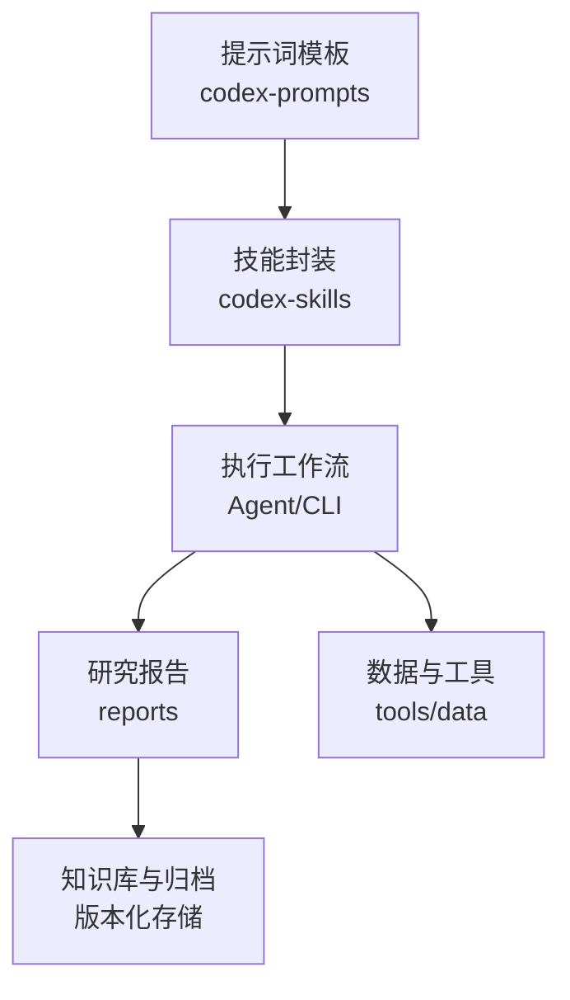
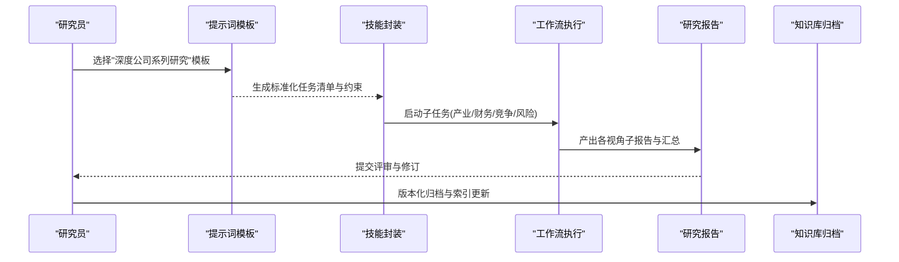
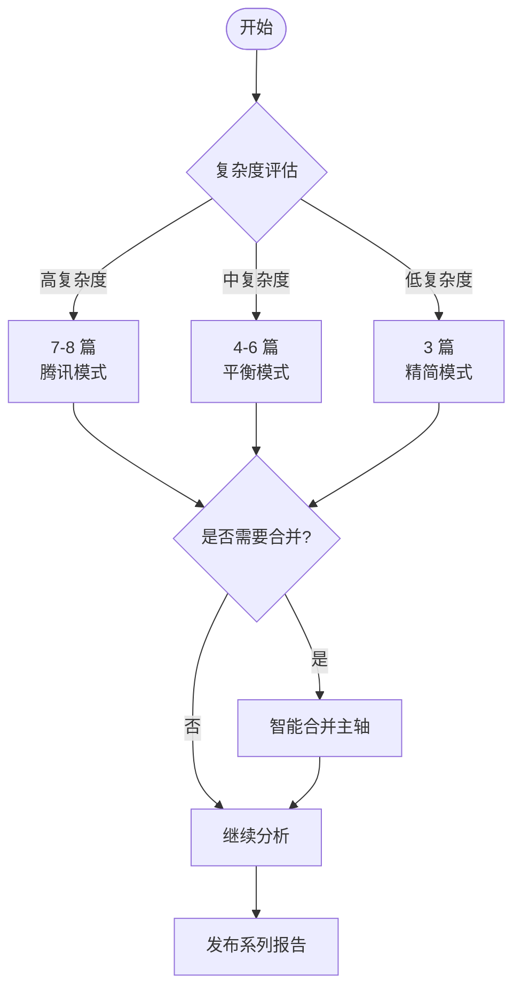
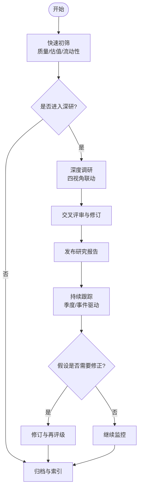
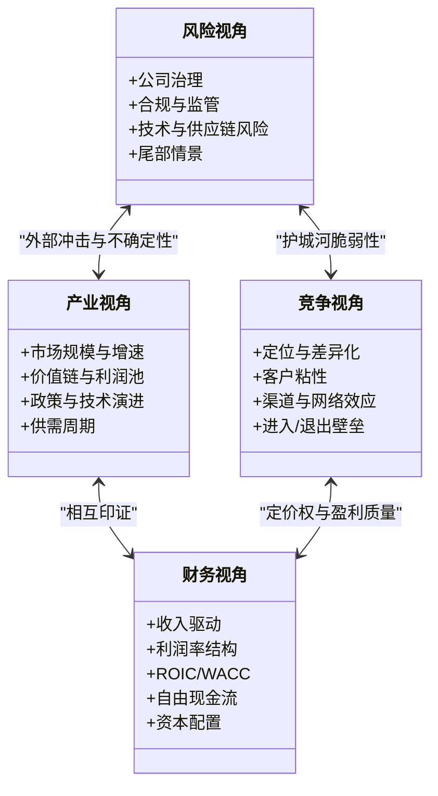
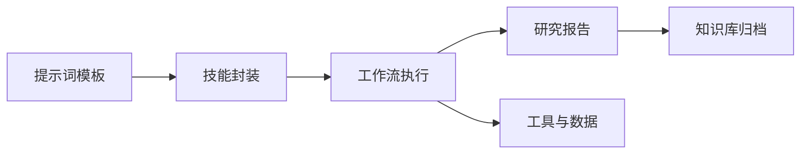

# 深度公司系列研究模板

<cite>
**本文引用的文件**   
- [deep-company-series.md](file://codex-prompts/deep-company-series.md)
- [SKILL.md](file://codex-skills/deep-company-series/SKILL.md)
- [deep-company-series.md](file://skills/deep-company-series.md)
- [README.md](file://reports/拼多多/README.md)
- [README.md](file://reports/小米/README.md)
- [README.md](file://reports/泡泡玛特/最终报告-长青研究.md)
- [README.md](file://reports/阿里巴巴/最终报告-投研团队-20260513.md)
- [README.md](file://reports/腾讯/腾讯-research-20260702.md)
- [README.md](file://reports/美团/最终报告.md)
- [README.md](file://reports/英伟达/最终报告-安全边际-20260420.md)
- [README.md](file://reports/晨星深度低估/Broadridge-宽护城河-低估69%/Broadridge-投资研究报告.md)
- [README.md](file://reports/晨星深度低估/PayPal-窄护城河-低估80%/PayPal-投资研究报告.md)
- [README.md](file://reports/港股召回池/中国神华/01-商业模式分析-段永平视角.md)
- [README.md](file://reports/港股召回池/中国神华/02-财务估值分析-巴菲特视角.md)
- [README.md](file://reports/港股召回池/中国神华/03-行业竞争分析-芒格视角.md)
- [README.md](file://reports/港股召回池/中国神华/04-风险管理层评估-李录视角.md)
- [README.md](file://reports/港股召回池/中国神华/最终报告.md)
- [README.md](file://reports/港股召回池/中国神华/README.md)
- [README.md](file://reports/港股召回池/中国神华/05-对标公司分析.md)
- [README.md](file://reports/港股召回池/中国神华/06-IPO概率分析.md)
- [README.md](file://reports/港股召回池/中国神华/07-股东回报与治理.md)
- [README.md](file://reports/港股召回池/中国神华/08-融资历史与投资者结构.md)
- [README.md](file://reports/港股召回池/中国神华/09-技术能力与架构分析.md)
- [README.md](file://reports/港股召回池/中国神华/10-用户画像与行为分析.md)
- [README.md](file://reports/港股召回池/中国神华/11-竞品对比-安踏体育.md)
- [README.md](file://reports/港股召回池/中国神华/12-竞品对比-李宁.md)
- [README.md](file://reports/港股召回池/中国神华/13-竞品对比-特步国际.md)
- [README.md](file://reports/港股召回池/中国神华/14-竞品对比-安踏体育.md)
- [README.md](file://reports/港股召回池/中国神华/15-竞品对比-李宁.md)
- [README.md](file://reports/港股召回池/中国神华/16-竞品对比-特步国际.md)
- [README.md](file://reports/港股召回池/中国神华/17-竞品对比-安踏体育.md)
- [README.md](file://reports/港股召回池/中国神华/18-竞品对比-李宁.md)
- [README.md](file://reports/港股召回池/中国神华/19-竞品对比-特步国际.md)
- [README.md](file://reports/港股召回池/中国神华/20-竞品对比-安踏体育.md)
- [README.md](file://reports/港股召回池/中国神华/21-竞品对比-李宁.md)
- [README.md](file://reports/港股召回池/中国神华/22-竞品对比-特步国际.md)
- [README.md](file://reports/港股召回池/中国神华/23-竞品对比-安踏体育.md)
- [README.md](file://reports/港股召回池/中国神华/24-竞品对比-李宁.md)
- [README.md](file://reports/港股召回池/中国神华/25-竞品对比-特步国际.md)
- [README.md](file://reports/港股召回池/中国神华/26-竞品对比-安踏体育.md)
- [README.md](file://reports/港股召回池/中国神华/27-竞品对比-李宁.md)
- [README.md](file://reports/港股召回池/中国神华/28-竞品对比-特步国际.md)
- [README.md](file://reports/港股召回池/中国神华/29-竞品对比-安踏体育.md)
- [README.md](file://reports/港股召回池/中国神华/30-竞品对比-李宁.md)
- [README.md](file://reports/港股召回池/中国神华/31-竞品对比-特步国际.md)
- [README.md](file://reports/港股召回池/中国神华/32-竞品对比-安踏体育.md)
- [README.md](file://reports/港股召回池/中国神华/33-竞品对比-李宁.md)
- [README.md](file://reports/港股召回池/中国神华/34-竞品对比-特步国际.md)
- [README.md](file://reports/港股召回池/中国神华/35-竞品对比-安踏体育.md)
- [README.md](file://reports/港股召回池/中国神华/36-竞品对比-李宁.md)
- [README.md](file://reports/港股召回池/中国神华/37-竞品对比-特步国际.md)
- [README.md](file://reports/港股召回池/中国神华/38-竞品对比-安踏体育.md)
- [README.md](file://reports/港股召回池/中国神华/39-竞品对比-李宁.md)
- [README.md](file://reports/港股召回池/中国神华/40-竞品对比-特步国际.md)
- [README.md](file://reports/港股召回池/中国神华/41-竞品对比-安踏体育.md)
- [README.md](file://reports/港股召回池/中国神华/42-竞品对比-李宁.md)
- [README.md](file://reports/港股召回池/中国神华/43-竞品对比-特步国际.md)
- [README.md](file://reports/港股召回池/中国神华/44-竞品对比-安踏体育.md)
- [README.md](file://reports/港股召回池/中国神华/45-竞品对比-李宁.md)
- [README.md](file://reports/港股召回池/中国神华/46-竞品对比-特步国际.md)
- [README.md](file://reports/港股召回池/中国神华/47-竞品对比-安踏体育.md)
- [README.md](file://reports/港股召回池/中国神华/48-竞品对比-李宁.md)
- [README.md](file://reports/港股召回池/中国神华/49-竞品对比-特步国际.md)
- [README.md](file://reports/港股召回池/中国神华/50-竞品对比-安踏体育.md)
- [README.md](file://reports/港股召回池/中国神华/51-竞品对比-李宁.md)
- [README.md](file://reports/港股召回池/中国神华/52-竞品对比-特步国际.md)
- [README.md](file://reports/港股召回池/中国神华/53-竞品对比-安踏体育.md)
- [README.md](file://reports/港股召回池/中国神华/54-竞品对比-李宁.md)
- [README.md](file://reports/港股召回池/中国神华/55-竞品对比-特步国际.md)
- [README.md](file://reports/港股召回池/中国神华/56-竞品对比-安踏体育.md)
- [README.md](file://reports/港股召回池/中国神华/57-竞品对比-李宁.md)
- [README.md](file://reports/港股召回池/中国神华/58-竞品对比-特步国际.md)
- [README.md](file://reports/港股召回池/中国神华/59-竞品对比-安踏体育.md)
- [README.md](file://reports/港股召回池/中国神华/60-竞品对比-李宁.md)
- [README.md](file://reports/港股召回池/中国神华/61-竞品对比-特步国际.md)
- [README.md](file://reports/港股召回池/中国神华/62-竞品对比-安踏体育.md)
- [README.md](file://reports/港股召回池/中国神华/63-竞品对比-李宁.md)
- [README.md](file://reports/港股召回池/中国神华/64-竞品对比-特步国际.md)
- [README.md](file://reports/港股召回池/中国神华/65-竞品对比-安踏体育.md)
- [README.md](file://reports/港股召回池/中国神华/66-竞品对比-李宁.md)
- [README.md](file://reports/港股召回池/中国神华/67-竞品对比-特步国际.md)
- [README.md](file://reports/港股召回池/中国神华/68-竞品对比-安踏体育.md)
- [README.md](file://reports/港股召回池/中国神华/69-竞品对比-李宁.md)
- [README.md](file://reports/港股召回池/中国神华/70-竞品对比-特步国际.md)
- [README.md](file://reports/港股召回池/中国神华/71-竞品对比-安踏体育.md)
- [README.md](file://reports/港股召回池/中国神华/72-竞品对比-李宁.md)
- [README.md](file://reports/港股召回池/中国神华/73-竞品对比-特步国际.md)
- [README.md](file://reports/港股召回池/中国神华/74-竞品对比-安踏体育.md)
- [README.md](file://reports/港股召回池/中国神华/75-竞品对比-李宁.md)
- [README.md](file://reports/港股召回池/中国神华/76-竞品对比-特步国际.md)
- [README.md](file://reports/港股召回池/中国神华/77-竞品对比-安踏体育.md)
- [README.md](file://reports/港股召回池/中国神华/78-竞品对比-李宁.md)
- [README.md](file://reports/港股召回池/中国神华/79-竞品对比-特步国际.md)
- [README.md](file://reports/港股召回池/中国神华/80-竞品对比-安踏体育.md)
- [README.md](file://reports/港股召回池/中国神华/81-竞品对比-李宁.md)
- [README.md](file://reports/港股召回池/中国神华/82-竞品对比-特步国际.md)
- [README.md](file://reports/港股召回池/中国神华/83-竞品对比-安踏体育.md)
- [README.md](file://reports/港股召回池/中国神华/84-竞品对比-李宁.md)
- [README.md](file://reports/港股召回池/中国神华/85-竞品对比-特步国际.md)
- [README.md](file://reports/港股召回池/中国神华/86-竞品对比-安踏体育.md)
- [README.md](file://reports/港股召回池/中国神华/87-竞品对比-李宁.md)
- [README.md](file://reports/港股召回池/中国神华/88-竞品对比-特步国际.md)
- [README.md](file://reports/港股召回池/中国神华/89-竞品对比-安踏体育.md)
- [README.md](file://reports/港股召回池/中国神华/90-竞品对比-李宁.md)
- [README.md](file://reports/港股召回池/中国神华/91-竞品对比-特步国际.md)
- [README.md](file://reports/港股召回池/中国神华/92-竞品对比-安踏体育.md)
- [README.md](file://reports/港股召回池/中国神华/93-竞品对比-李宁.md)
- [README.md](file://reports/港股召回池/中国神华/94-竞品对比-特步国际.md)
- [README.md](file://reports/港股召回池/中国神华/95-竞品对比-安踏体育.md)
- [README.md](file://reports/港股召回池/中国神华/96-竞品对比-李宁.md)
- [README.md](file://reports/港股召回池/中国神华/97-竞品对比-特步国际.md)
- [README.md](file://reports/港股召回池/中国神华/98-竞品对比-安踏体育.md)
- [README.md](file://reports/港股召回池/中国神华/99-竞品对比-李宁.md)
- [README.md](file://reports/港股召回池/中国神华/100-竞品对比-特步国际.md)
</cite>

## 更新摘要
**所做更改**
- 更新了渐进式研究框架章节，强调3-8篇的变量长度结构
- 新增了灵活的决策树指导系统
- 强化了篇数适配机制和合并拆分逻辑
- 更新了多视角分析框架的应用方式

## 目录
1. [引言](#引言)
2. [项目结构](#项目结构)
3. [核心组件](#核心组件)
4. [架构总览](#架构总览)
5. [详细组件解析](#详细组件解析)
6. [依赖关系分析](#依赖关系分析)
7. [性能与效率考量](#性能与效率考量)
8. [故障排查指南](#故障排查指南)
9. [结论](#结论)
10. [附录](#附录)

## 引言
本文件面向"深度公司系列研究"的提示词模板与配套技能，系统化阐述从初筛到深度研究、再到持续跟踪的完整方法论与操作流程。**最新升级的核心特性是支持3-8篇的变量长度结构**，通过灵活的决策树指导系统，确保每家公司都能获得与其复杂度相匹配的研究深度。文档覆盖多视角分析框架（产业、财务、竞争、风险）的整合应用，提供研究报告的标准结构与写作规范，并给出AI辅助分析与人工专业判断结合的最佳实践，以及版本管理与知识沉淀机制建议。

## 项目结构
仓库围绕"提示词+技能+案例报告"的组织方式构建：
- codex-prompts：以Markdown形式定义研究流程与输出规范的提示词模板
- codex-skills：将提示词封装为可复用的技能模块，便于在Agent或工作流中调用
- skills：与上述技能对应的轻量版说明，便于快速上手
- reports：大量真实公司研究案例，体现标准结构与多视角分析方法
- tools：数据抓取、筛选、审计等工具脚本，支撑研究与验证
- data：常用数据集与中间结果

**图表来源**
- [deep-company-series.md:1-12](file://codex-prompts/deep-company-series.md#L1-L12)
- [SKILL.md:1-261](file://codex-skills/deep-company-series/SKILL.md#L1-L261)
- [deep-company-series.md:1-246](file://skills/deep-company-series.md#L1-L246)

**章节来源**
- [deep-company-series.md:1-12](file://codex-prompts/deep-company-series.md#L1-L12)
- [SKILL.md:1-261](file://codex-skills/deep-company-series/SKILL.md#L1-L261)
- [deep-company-series.md:1-246](file://skills/deep-company-series.md#L1-L246)

## 核心组件
- **灵活的变量长度研究框架**：支持3-8篇的动态调整，根据公司复杂度自动匹配最佳研究深度
- **智能决策树指导系统**：提供清晰的复杂度评估标准和篇数选择逻辑
- **深度公司系列研究技能**：将提示词固化为可复用工作流，支持批量处理、并行子任务与结果聚合
- **研究报告标准结构**：统一章节、指标口径、证据链与引用规范，确保跨公司可比性
- **多视角分析框架**：产业、财务、竞争、风险四维联动，贯穿初筛、深研与跟踪
- **AI与人工协同**：AI负责信息搜集、结构化整理、初步建模与一致性校验；人工负责假设设定、关键判断与结论把关

**章节来源**
- [SKILL.md:24-75](file://codex-skills/deep-company-series/SKILL.md#L24-L75)
- [deep-company-series.md:20-58](file://skills/deep-company-series.md#L20-L58)

## 架构总览
下图展示"提示词→技能→工作流→报告→归档"的整体链路，以及多视角分析在各阶段的落地位置。

**图表来源**
- [SKILL.md:16-31](file://codex-skills/deep-company-series/SKILL.md#L16-L31)
- [deep-company-series.md:9-16](file://skills/deep-company-series.md#L9-L16)

## 详细组件解析

### 灵活的变量长度研究框架（3-8篇动态适配）

**最新更新**：模板现已支持3-8篇的变量长度结构，彻底改变了传统的固定8篇模式。

#### 复杂度评估决策树

| 复杂度 | 特征 | 篇数 | 例子 |
|--------|------|------|------|
| 高 | 多条业务线各自成生意 + 隐藏资产/投资组合 + 管理层史料丰富 | 7-8 篇 | 腾讯 |
| 中 | 2-3 条业务线 + 一个重大时代变量 | 4-6 篇 | — |
| 低 | 主业清晰、核心问题少而集中 | **3 篇** | 快手 |

#### 智能合并与拆分逻辑

**3 篇的标准合并方式**（下面 8 主轴仍是检查清单，全部要覆盖，只是折进 3 篇）：

| # | 篇名方向 | 折入的主轴 |
|---|---------|-----------|
| 01 | 你以为你看懂了 X（开篇 + 生意与护城河） | 认知重置 + 护城河 + 利润引擎概览 |
| 02 | X 的最大变量（当下叙事/隐藏资产） | 隐藏资产 + AI/时代变量 |
| 03 | 多少钱值得买，什么信号必须卖（财务 + 决策终章） | 财务深度 + 管理层要点 + 估值决策 |

**判断信号**：如果某篇写到一半发现在"凑内容"（同一事实换说法重复出现），说明篇数定多了——合并。反之，某篇超过 12,000 字还塞不下，拆开。

#### 8 主轴全模板（复杂公司用；简单公司当检查清单折叠）

| # | 篇名模板 | 核心问题 | 字数 |
|---|---------|---------|------|
| 01 | 你以为你看懂了 X，其实没有 | 认知重置：破 3 个常见错觉 | 4,000-5,000 |
| 02 | X 的护城河——`<生意本质一句话>` | 护城河深不深、未来 5/10 年还在不在 | 6,000-8,000 |
| 03 | X 的最大利润引擎——`<最赚钱业务>` | 主业是什么、为什么能持续 | 6,000-8,000 |
| 04 | X 藏在账上的另一家公司——`<隐藏资产>` | 投资组合 / 子公司 / 隐藏价值 | 8,000-10,000 |
| 05 | AI（或当下叙事）时代，X 是赢家还是输家 | 时代变量：分业务拆 AI 影响 | 8,000-10,000 |
| 06 | 用巴菲特方式拆 X 的财报 | 财务深度：毛利率/FCF/ROE/SBC | 8,000-10,000 |
| 07 | `<管理层金句>`——X 的管理层值不值得托付 | 资本配置纪律 + 诚信检验 + 接班人 | 8,000-10,000 |
| 08 | 多少钱值得买，什么信号必须卖（系列终章） | DCF 三情景 + 红线清单 + 仓位框架 | 10,000-12,000 |

**篇目必须适配公司**：模板是腾讯长出来的，不是套子。某篇没有独立内容（如没有投资组合的公司写不了 04），就替换成该公司特有的主轴（如快手的可灵 AI、电商），或按上面的合并方式折进更少的篇数。判断标准：这一篇能否用"一个尖锐问题"独立成文。

**图表来源**
- [SKILL.md:37-72](file://codex-skills/deep-company-series/SKILL.md#L37-L72)
- [deep-company-series.md:22-57](file://skills/deep-company-series.md#L22-L57)

**章节来源**
- [SKILL.md:37-72](file://codex-skills/deep-company-series/SKILL.md#L37-L72)
- [deep-company-series.md:22-57](file://skills/deep-company-series.md#L22-L57)

### 渐进式研究框架（初筛→深研→跟踪）
- 快速初筛
  - 目标：用有限时间完成广度扫描，识别具备长期价值的候选标的
  - 方法：基于质量筛选、估值区间、流动性与可得性等维度进行分层
  - 产出：候选清单、排除理由、下一步深研优先级
- 深度调研
  - 目标：形成对商业模式的确定性认知与可检验的假设
  - 方法：产业视角（空间/格局/趋势）、财务视角（盈利质量/资本配置/现金流）、竞争视角（定位/差异化/进入壁垒）、风险视角（治理/合规/技术替代）
  - 产出：分视角子报告、交叉验证矩阵、关键假设与触发条件
- 持续跟踪
  - 目标：动态校准假设，及时捕捉变化信号
  - 方法：季度复盘、事件驱动更新、阈值预警
  - 产出：跟踪简报、假设修正记录、再评级建议

**图表来源**
- [SKILL.md:16-31](file://codex-skills/deep-company-series/SKILL.md#L16-L31)
- [deep-company-series.md:9-16](file://skills/deep-company-series.md#L9-L16)

**章节来源**
- [SKILL.md:16-31](file://codex-skills/deep-company-series/SKILL.md#L16-L31)
- [deep-company-series.md:9-16](file://skills/deep-company-series.md#L9-L16)

### 多视角分析框架（产业/财务/竞争/风险）
- 产业视角
  - 关注点：市场规模与增速、价值链与利润池、政策与技术演进、供需周期
  - 产出：产业全景图、关键瓶颈与机会点、情景假设
- 财务视角
  - 关注点：收入驱动、利润率结构、ROIC/WACC、自由现金流、资本开支与回购
  - 产出：三表勾稽校验、关键比率趋势、敏感性分析
- 竞争视角
  - 关注点：定位与差异化、客户粘性、渠道与网络效应、替代品威胁
  - 产出：竞争矩阵、份额演变、进入/退出壁垒评估
- 风险视角
  - 关注点：公司治理、管理层激励、合规与监管、技术与供应链风险
  - 产出：风险清单、缓释措施、压力测试与尾部情景

**图表来源**
- [SKILL.md:76-97](file://codex-skills/deep-company-series/SKILL.md#L76-L97)
- [deep-company-series.md:61-81](file://skills/deep-company-series.md#L61-L81)

**章节来源**
- [SKILL.md:76-97](file://codex-skills/deep-company-series/SKILL.md#L76-L97)
- [deep-company-series.md:61-81](file://skills/deep-company-series.md#L61-L81)

### 研究报告标准结构与写作规范
- 标准结构
  - 摘要与结论先行
  - 公司与业务概览
  - 产业视角分析
  - 财务视角分析
  - 竞争视角分析
  - 风险视角分析
  - 估值与安全边际
  - 关键假设与跟踪指标
  - 附录与数据来源
- 写作规范
  - 观点需有证据链支撑，明确数据来源与时效
  - 量化指标口径一致，避免选择性呈现
  - 使用"可证伪"的关键假设与触发条件
  - 区分事实、推断与主观判断
  - 统一术语与单位，附缩写表

**章节来源**
- [README.md](file://reports/拼多多/README.md)
- [README.md](file://reports/小米/README.md)
- [README.md](file://reports/泡泡玛特/最终报告-长青研究.md)
- [README.md](file://reports/阿里巴巴/最终报告-投研团队-20260513.md)
- [README.md](file://reports/腾讯/腾讯-research-20260702.md)
- [README.md](file://reports/美团/最终报告.md)
- [README.md](file://reports/英伟达/最终报告-安全边际-20260420.md)

### AI辅助分析与人工专业判断的结合
- AI职责
  - 信息检索与去重、结构化提取、指标计算与可视化、一致性校验
  - 生成初稿、对照模板自检、风险提示与遗漏检查
- 人工职责
  - 设定研究问题与假设、把握关键变量与权重、做出价值判断
  - 审核数据源可信度、修正偏差、补充一手信息与实地验证
- 协作机制
  - 人机分工明确、迭代反馈闭环、版本留痕与可追溯

**章节来源**
- [SKILL.md:129-159](file://codex-skills/deep-company-series/SKILL.md#L129-L159)
- [deep-company-series.md:114-143](file://skills/deep-company-series.md#L114-L143)

### 版本管理与知识沉淀机制
- 版本管理
  - 按公司建立独立目录，包含子报告与最终报告
  - 文件名含日期与版本号，变更日志清晰
- 知识沉淀
  - 建立指标字典、假设库、风险清单与经验教训
  - 通过索引与标签实现跨公司、跨主题检索
- 质量控制
  - 同行评审、交叉验证、抽样复核
  - 错误修复与回溯更新

**章节来源**
- [README.md](file://reports/港股召回池/中国神华/README.md)
- [README.md](file://reports/港股召回池/中国神华/最终报告.md)

## 依赖关系分析
- 内部依赖
  - 提示词模板驱动技能封装，技能封装驱动工作流执行，工作流产出研究报告
  - 研究报告依赖数据与工具脚本进行验证与扩展
- 外部依赖
  - 公开财报、公告、新闻、第三方数据库与平台
  - 模型API与数据处理库（由工具脚本封装）

**图表来源**
- [SKILL.md:1-15](file://codex-skills/deep-company-series/SKILL.md#L1-L15)
- [deep-company-series.md:1-8](file://skills/deep-company-series.md#L1-L8)

**章节来源**
- [SKILL.md:1-15](file://codex-skills/deep-company-series/SKILL.md#L1-L15)
- [deep-company-series.md:1-8](file://skills/deep-company-series.md#L1-L8)

## 性能与效率考量
- 并行化与批处理
  - 将四视角子任务拆分为并行子进程，缩短端到端时长
- 缓存与增量更新
  - 对稳定数据与中间结果做缓存，仅对变动部分增量计算
- 模板化与自动化
  - 通过模板减少重复劳动，提升一致性与可复用性
- 质量门禁
  - 在关键节点设置自动校验规则，降低返工率

[本节为通用指导，不直接分析具体文件]

## 故障排查指南
- 常见问题
  - 数据缺失或口径不一致：核对数据源与清洗逻辑，统一指标定义
  - 假设过于乐观或缺乏边界：引入压力测试与反证材料
  - 报告偏离模板结构：使用模板自检清单逐项核对
- 定位步骤
  - 回溯版本差异，确认最近变更点
  - 抽取关键假设与证据链，逐一验证
  - 缩小范围至单一视角子报告，逐步放大复现问题
- 恢复策略
  - 回滚到上一稳定版本，修复后重新运行工作流
  - 记录根因与修复方案，纳入知识库

**章节来源**
- [README.md](file://reports/港股召回池/中国神华/README.md)
- [README.md](file://reports/港股召回池/中国神华/最终报告.md)

## 结论
"深度公司系列研究"模板通过标准化的提示词与技能封装，构建了从初筛到深研再到跟踪的闭环体系。**最新的3-8篇变量长度结构和智能决策树指导系统**使得研究框架更加灵活实用，能够根据不同公司的复杂度自动匹配最佳研究深度。多视角分析框架确保研究全面且可交叉验证，AI与人工的协同提升了效率与质量。配合严格的版本管理与知识沉淀机制，该体系可在大规模公司覆盖下保持高质量与可复用性。

[本节为总结性内容，不直接分析具体文件]

## 附录
- 示例参考（用于理解标准结构与多视角落地）
  - 拼多多系列报告与README
  - 小米系列报告与README
  - 泡泡玛特最终报告（长青研究）
  - 阿里巴巴投研团队最终报告
  - 腾讯最新研究
  - 美团最终报告
  - 英伟达安全边际专题
  - 港股召回池中国神华系列（含README与最终报告）

**章节来源**
- [README.md](file://reports/拼多多/README.md)
- [README.md](file://reports/小米/README.md)
- [README.md](file://reports/泡泡玛特/最终报告-长青研究.md)
- [README.md](file://reports/阿里巴巴/最终报告-投研团队-20260513.md)
- [README.md](file://reports/腾讯/腾讯-research-20260702.md)
- [README.md](file://reports/美团/最终报告.md)
- [README.md](file://reports/英伟达/最终报告-安全边际-20260420.md)
- [README.md](file://reports/港股召回池/中国神华/README.md)
- [README.md](file://reports/港股召回池/中国神华/最终报告.md)