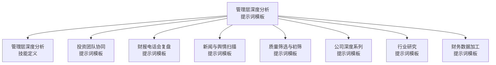
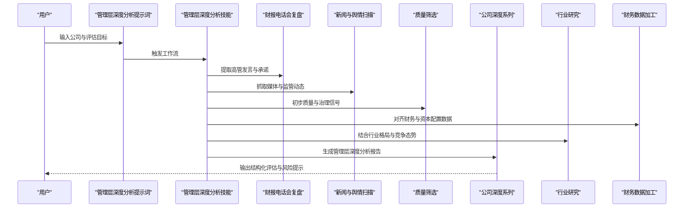
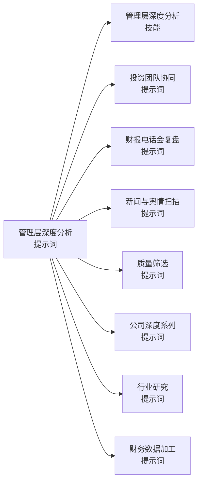

# 管理层深度分析模板

<cite>
**本文引用的文件**   
- [management-deep-dive.md](file://codex-prompts/management-deep-dive.md)
- [SKILL.md](file://codex-skills/management-deep-dive/SKILL.md)
- [investment-team.md](file://codex-prompts/investment-team.md)
- [earnings-review.md](file://codex-prompts/earnings-review.md)
- [news-pulse.md](file://codex-prompts/news-pulse.md)
- [quality-screen.md](file://codex-prompts/quality-screen.md)
- [deep-company-series.md](file://codex-prompts/deep-company-series.md)
- [industry-research.md](file://codex-prompts/industry-research.md)
- [financial-data.md](file://codex-prompts/financial-data.md)
</cite>

## 目录
1. [引言](#引言)
2. [项目结构](#项目结构)
3. [核心组件](#核心组件)
4. [架构总览](#架构总览)
5. [详细组件分析](#详细组件分析)
6. [依赖关系分析](#依赖关系分析)
7. [性能与效率考量](#性能与效率考量)
8. [故障排查指南](#故障排查指南)
9. [结论](#结论)
10. [附录](#附录)

## 引言
本文件面向管理层深度分析，提供一套可复用的“管理层评估框架”与“提示词模板”解析文档。目标包括：
- 构建覆盖诚信度、能力、激励机制、战略眼光等多维度的管理层评估体系
- 解读历史决策记录分析、薪酬结构合理性评估、股东利益一致性检验等核心方法
- 说明如何通过公开信息、财报电话会、媒体报道等多渠道收集管理层相关信息
- 给出管理层风险评估的具体指标与判断标准
- 通过优秀与糟糕管理层的典型案例对比，帮助投资者识别管理层质量与潜在风险

## 项目结构
本项目围绕“管理层深度分析”提供了两类关键资产：
- 提示词模板（Prompt）：用于驱动研究流程与输出结构化报告
- 技能定义（Skill）：将提示词封装为可执行的研究工作流

图示来源
- [management-deep-dive.md](file://codex-prompts/management-deep-dive.md)
- [SKILL.md](file://codex-skills/management-deep-dive/SKILL.md)
- [investment-team.md](file://codex-prompts/investment-team.md)
- [earnings-review.md](file://codex-prompts/earnings-review.md)
- [news-pulse.md](file://codex-prompts/news-pulse.md)
- [quality-screen.md](file://codex-prompts/quality-screen.md)
- [deep-company-series.md](file://codex-prompts/deep-company-series.md)
- [industry-research.md](file://codex-prompts/industry-research.md)
- [financial-data.md](file://codex-prompts/financial-data.md)

章节来源
- [management-deep-dive.md](file://codex-prompts/management-deep-dive.md)
- [SKILL.md](file://codex-skills/management-deep-dive/SKILL.md)

## 核心组件
- 管理层深度分析提示词模板：定义评估维度、数据来源、分析方法、输出结构与质量控制要求
- 管理层深度分析技能定义：将模板转化为可执行的步骤化工作流，明确输入、处理、输出与校验规则
- 配套提示词模板：投资团队协同、财报电话会复盘、新闻与舆情扫描、质量筛选、公司深度系列、行业研究、财务数据加工等，形成端到端的研究闭环

章节来源
- [management-deep-dive.md](file://codex-prompts/management-deep-dive.md)
- [SKILL.md](file://codex-skills/management-deep-dive/SKILL.md)
- [investment-team.md](file://codex-prompts/investment-team.md)
- [earnings-review.md](file://codex-prompts/earnings-review.md)
- [news-pulse.md](file://codex-prompts/news-pulse.md)
- [quality-screen.md](file://codex-prompts/quality-screen.md)
- [deep-company-series.md](file://codex-prompts/deep-company-series.md)
- [industry-research.md](file://codex-prompts/industry-research.md)
- [financial-data.md](file://codex-prompts/financial-data.md)

## 架构总览
管理层深度分析采用“模板+技能”的双层架构：
- 上层：提示词模板定义方法论、评估维度、证据链与输出规范
- 下层：技能定义将模板落地为可重复的工作流，串联多源数据与交叉验证

图示来源
- [management-deep-dive.md](file://codex-prompts/management-deep-dive.md)
- [SKILL.md](file://codex-skills/management-deep-dive/SKILL.md)
- [earnings-review.md](file://codex-prompts/earnings-review.md)
- [news-pulse.md](file://codex-prompts/news-pulse.md)
- [quality-screen.md](file://codex-prompts/quality-screen.md)
- [deep-company-series.md](file://codex-prompts/deep-company-series.md)
- [industry-research.md](file://codex-prompts/industry-research.md)
- [financial-data.md](file://codex-prompts/financial-data.md)

## 详细组件分析

### 管理层评估框架（多维体系）
- 诚信度
  - 关注点：信息披露透明度、承诺兑现率、审计与内控意见、关联交易与资金占用、诉讼与监管处罚
  - 证据来源：年报/中报/季报、交易所问询函与回复、监管公告、裁判文书、新闻舆情
- 能力
  - 关注点：战略制定与执行、资源配置效率、组织与人才建设、创新与技术投入、并购整合能力
  - 证据来源：管理层讨论与分析、业务里程碑、研发与专利、产能与利用率、市场份额变化
- 激励机制
  - 关注点：薪酬与长期价值挂钩、股权激励行权条件、回购与分红政策、内部人交易行为
  - 证据来源：薪酬披露、股权激励计划、董事会决议、回购与分红公告、持股变动
- 战略眼光
  - 关注点：产业趋势判断、技术路线选择、全球化布局、生态与合作伙伴策略
  - 证据来源：战略发布会、投资者日材料、高管访谈、行业研究与竞品对标

章节来源
- [management-deep-dive.md](file://codex-prompts/management-deep-dive.md)
- [investment-team.md](file://codex-prompts/investment-team.md)
- [earnings-review.md](file://codex-prompts/earnings-review.md)
- [news-pulse.md](file://codex-prompts/news-pulse.md)
- [quality-screen.md](file://codex-prompts/quality-screen.md)
- [deep-company-series.md](file://codex-prompts/deep-company-series.md)
- [industry-research.md](file://codex-prompts/industry-research.md)
- [financial-data.md](file://codex-prompts/financial-data.md)

### 历史决策记录分析
- 方法要点
  - 建立“承诺—行动—结果”的证据链：从财报电话会与公开声明中提取承诺，对照后续资本配置与经营结果
  - 时间序列比对：跨期跟踪关键指标（收入、利润、现金流、ROIC、自由现金流、负债结构）
  - 归因分析：区分宏观周期、行业拐点与公司特有因素
- 输出要求
  - 决策清单、达成度评分、偏差原因、修正措施与后续影响

章节来源
- [earnings-review.md](file://codex-prompts/earnings-review.md)
- [management-deep-dive.md](file://codex-prompts/management-deep-dive.md)

### 薪酬结构合理性评估
- 评估维度
  - 固定薪酬与浮动薪酬比例、短期激励与长期激励配比
  - 业绩考核指标与权重（EPS、ROIC、FCF、相对同业表现）
  - 股权授予与解锁条件、稀释效应与回购对冲
- 一致性检验
  - 内部人增持/减持与股价表现的关系
  - 高管持股变动与重大资本运作的时间关联
- 输出要求
  - 薪酬结构图、激励有效性评分、潜在利益冲突提示

章节来源
- [management-deep-dive.md](file://codex-prompts/management-deep-dive.md)
- [financial-data.md](file://codex-prompts/financial-data.md)

### 股东利益一致性检验
- 关键信号
  - 分红与回购的持续性、规模与定价合理性
  - 增发与配股频率、募资用途与回报实现
  - 关联交易定价公允性、资金占用与担保情况
- 量化指标
  - 股息率、回购收益率、股权稀释率、关联交易占比、净现金与有息负债结构
- 输出要求
  - 股东回报路径图、一致性评分、风险预警

章节来源
- [management-deep-dive.md](file://codex-prompts/management-deep-dive.md)
- [financial-data.md](file://codex-prompts/financial-data.md)

### 多渠道信息收集与交叉验证
- 信息来源
  - 公开信息：年报/中报/季报、招股书、公告、监管问询与回复
  - 财报电话会：高管问答、前瞻指引、口径一致性
  - 媒体报道：权威财经媒体、行业媒体、社交媒体舆情
- 交叉验证
  - 三方印证：官方披露 vs 媒体 vs 第三方数据
  - 异常检测：前后矛盾、选择性披露、口径变更
- 输出要求
  - 信息矩阵、可信度评级、待核实问题清单

章节来源
- [news-pulse.md](file://codex-prompts/news-pulse.md)
- [earnings-review.md](file://codex-prompts/earnings-review.md)
- [management-deep-dive.md](file://codex-prompts/management-deep-dive.md)

### 管理层风险评估指标与判断标准
- 指标体系
  - 治理风险：审计意见非标、内控缺陷、诉讼与处罚、关联交易异常
  - 战略风险：频繁转型、方向摇摆、过度多元化、技术路线误判
  - 财务风险：高杠杆、短债长投、盈利质量差、现金流断裂
  - 激励风险：短期主义、过度稀释、内部人套现
- 判断标准
  - 红黄绿灯分级：红灯（立即规避）、黄灯（重点监控）、绿灯（可接受）
  - 阈值设定：基于同业分位数与历史波动区间
- 输出要求
  - 风险雷达图、关键风险事件时间线、缓释措施建议

章节来源
- [management-deep-dive.md](file://codex-prompts/management-deep-dive.md)
- [quality-screen.md](file://codex-prompts/quality-screen.md)

### 优秀与糟糕管理层案例对比
- 优秀管理层特征
  - 清晰且一致的战略叙事、稳健的资本配置、透明的沟通风格、长期导向的激励设计
- 糟糕管理层特征
  - 频繁变更战略、过度包装与选择性披露、激进的财务工程、损害中小股东利益的行为
- 对比方法
  - 同赛道对标、同周期回溯、关键事件复盘
- 输出要求
  - 案例卡片、关键差异点、可迁移经验与警示

章节来源
- [management-deep-dive.md](file://codex-prompts/management-deep-dive.md)
- [deep-company-series.md](file://codex-prompts/deep-company-series.md)

### 工作流程与质量控制
- 工作流
  - 输入：公司名称、评估范围、时间窗口、重点关注领域
  - 处理：多源采集、证据链构建、指标计算、交叉验证
  - 输出：结构化报告、评分与等级、风险提示与建议
- 质量控制
  - 双人复核、证据溯源、版本管理与变更记录
  - 异常与缺失数据的替代方案与敏感性分析

章节来源
- [SKILL.md](file://codex-skills/management-deep-dive/SKILL.md)
- [management-deep-dive.md](file://codex-prompts/management-deep-dive.md)

## 依赖关系分析
管理层深度分析工作流依赖多个提示词模板与技能模块，形成相互支撑的协作网络。

图示来源
- [management-deep-dive.md](file://codex-prompts/management-deep-dive.md)
- [SKILL.md](file://codex-skills/management-deep-dive/SKILL.md)
- [investment-team.md](file://codex-prompts/investment-team.md)
- [earnings-review.md](file://codex-prompts/earnings-review.md)
- [news-pulse.md](file://codex-prompts/news-pulse.md)
- [quality-screen.md](file://codex-prompts/quality-screen.md)
- [deep-company-series.md](file://codex-prompts/deep-company-series.md)
- [industry-research.md](file://codex-prompts/industry-research.md)
- [financial-data.md](file://codex-prompts/financial-data.md)

章节来源
- [management-deep-dive.md](file://codex-prompts/management-deep-dive.md)
- [SKILL.md](file://codex-skills/management-deep-dive/SKILL.md)

## 性能与效率考量
- 并行采集：多源信息同步抓取，缩短数据准备时间
- 增量更新：仅对新增或变更信息进行二次处理，降低重复工作量
- 模板复用：标准化字段与评分表，提升报告产出效率
- 缓存与索引：对高频指标与关键事件建立索引，便于快速检索与回溯

[本节为通用指导，不直接分析具体文件]

## 故障排查指南
- 常见问题
  - 数据缺失：优先使用替代来源并标注不确定性；进行敏感性分析
  - 口径不一致：统一度量基准，必要时进行换算与注释
  - 信息冲突：以官方披露为准，辅以权威媒体与第三方数据交叉验证
- 定位方法
  - 追溯证据链：逐条核对原始公告与披露文件
  - 版本对比：检查不同期次报告的口径与假设变化
  - 异常标记：对偏离同业或历史的指标进行专项核查
- 修复建议
  - 补充数据源、调整权重与阈值、增加人工复核环节

章节来源
- [management-deep-dive.md](file://codex-prompts/management-deep-dive.md)
- [SKILL.md](file://codex-skills/management-deep-dive/SKILL.md)

## 结论
本模板将管理层评估从“主观印象”升级为“证据驱动”的系统工程。通过多维度评估体系、严谨的历史决策分析与薪酬一致性检验，结合多渠道信息收集与交叉验证，能够显著提升管理层质量识别的准确性与可操作性。配合优秀与糟糕案例的对比，有助于在复杂环境中做出更稳健的投资决策。

[本节为总结性内容，不直接分析具体文件]

## 附录
- 术语表
  - ROIC：投入资本回报率
  - FCF：自由现金流
  - 股权稀释率：新增股本对原有股东权益的影响程度
  - 关联交易占比：关联方交易金额占营业收入或总资产的比例
- 参考模板路径
  - 管理层深度分析提示词：[management-deep-dive.md](file://codex-prompts/management-deep-dive.md)
  - 管理层深度分析技能：[SKILL.md](file://codex-skills/management-deep-dive/SKILL.md)
  - 财报电话会复盘：[earnings-review.md](file://codex-prompts/earnings-review.md)
  - 新闻与舆情扫描：[news-pulse.md](file://codex-prompts/news-pulse.md)
  - 质量筛选：[quality-screen.md](file://codex-prompts/quality-screen.md)
  - 公司深度系列：[deep-company-series.md](file://codex-prompts/deep-company-series.md)
  - 行业研究：[industry-research.md](file://codex-prompts/industry-research.md)
  - 财务数据加工：[financial-data.md](file://codex-prompts/financial-data.md)
  - 投资团队协同：[investment-team.md](file://codex-prompts/investment-team.md)