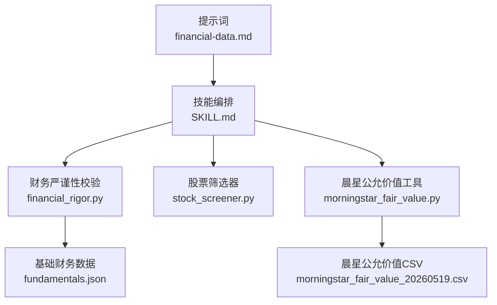
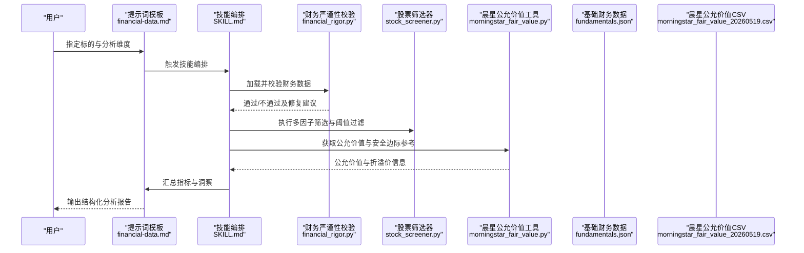
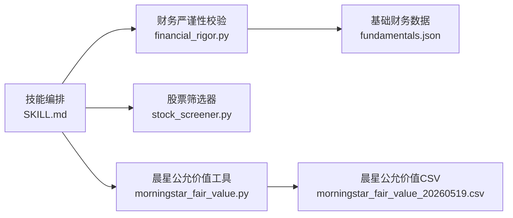

# 财务数据分析模板

<cite>
**本文引用的文件**   
- [financial-data.md](file://codex-prompts/financial-data.md)
- [SKILL.md](file://codex-skills/financial-data/SKILL.md)
- [financial_rigor.py](file://tools/financial_rigor.py)
- [stock_screener.py](file://tools/stock_screener.py)
- [morningstar_fair_value.py](file://tools/morningstar_fair_value.py)
- [fundamentals.json](file://data/fundamentals.json)
- [morningstar_fair_value_20260519.csv](file://data/morningstar_fair_value_20260519.csv)
</cite>

## 目录
1. [引言](#引言)
2. [项目结构](#项目结构)
3. [核心组件](#核心组件)
4. [架构总览](#架构总览)
5. [详细组件分析](#详细组件分析)
6. [依赖关系分析](#依赖关系分析)
7. [性能与可扩展性](#性能与可扩展性)
8. [故障排查指南](#故障排查指南)
9. [结论](#结论)
10. [附录](#附录)

## 引言
本文件面向“财务数据分析提示词模板”的使用者与二次开发者，系统化解析该模板在财务数据提取、指标计算、质量校验与报告生成方面的技术实现。内容覆盖盈利能力、偿债能力、运营效率、成长性等核心维度的分析方法与判断标准，并给出现金流分析、资产负债表健康度评估、利润质量检验等深度方法；同时提供数据源配置、阈值设置、异常检测等高级功能使用指南，并结合实际案例展示如何进行深度财务诊断与投资价值评估。

## 项目结构
围绕财务数据分析模板，仓库中相关资源主要分布在以下位置：
- 提示词与技能定义：codex-prompts/financial-data.md、codex-skills/financial-data/SKILL.md
- 工具脚本：tools/financial_rigor.py、tools/stock_screener.py、tools/morningstar_fair_value.py
- 示例数据：data/fundamentals.json、data/morningstar_fair_value_20260519.csv

图表来源
- [financial-data.md](file://codex-prompts/financial-data.md)
- [SKILL.md](file://codex-skills/financial-data/SKILL.md)
- [financial_rigor.py](file://tools/financial_rigor.py)
- [stock_screener.py](file://tools/stock_screener.py)
- [morningstar_fair_value.py](file://tools/morningstar_fair_value.py)
- [fundamentals.json](file://data/fundamentals.json)
- [morningstar_fair_value_20260519.csv](file://data/morningstar_fair_value_20260519.csv)

章节来源
- [financial-data.md](file://codex-prompts/financial-data.md)
- [SKILL.md](file://codex-skills/financial-data/SKILL.md)
- [financial_rigor.py](file://tools/financial_rigor.py)
- [stock_screener.py](file://tools/stock_screener.py)
- [morningstar_fair_value.py](file://tools/morningstar_fair_value.py)
- [fundamentals.json](file://data/fundamentals.json)
- [morningstar_fair_value_20260519.csv](file://data/morningstar_fair_value_20260519.csv)

## 核心组件
- 提示词模板（financial-data.md）：定义财务数据提取、指标识别与计算、报告结构与输出规范，指导大模型按统一框架完成分析与写作。
- 技能编排（SKILL.md）：将提示词与工具链组合为可复用的工作流，明确输入输出、执行顺序与质量控制点。
- 财务严谨性校验（financial_rigor.py）：对原始财务数据进行一致性检查、勾稽关系验证、缺失值与异常值处理，确保后续分析的可靠性。
- 股票筛选器（stock_screener.py）：基于多因子与阈值规则进行初筛，支持自定义条件与批量处理。
- 晨星公允价值工具（morningstar_fair_value.py）：读取外部公允价值数据并与内部估值逻辑对接，辅助安全边际与相对估值分析。
- 示例数据（fundamentals.json、morningstar_fair_value_20260519.csv）：用于演示与测试的数据集，便于快速上手与回归验证。

章节来源
- [financial-data.md](file://codex-prompts/financial-data.md)
- [SKILL.md](file://codex-skills/financial-data/SKILL.md)
- [financial_rigor.py](file://tools/financial_rigor.py)
- [stock_screener.py](file://tools/stock_screener.py)
- [morningstar_fair_value.py](file://tools/morningstar_fair_value.py)
- [fundamentals.json](file://data/fundamentals.json)
- [morningstar_fair_value_20260519.csv](file://data/morningstar_fair_value_20260519.csv)

## 架构总览
整体流程从数据接入开始，经清洗与校验后进入指标计算与多维分析，最终形成结构化报告与可视化结果。

图表来源
- [financial-data.md](file://codex-prompts/financial-data.md)
- [SKILL.md](file://codex-skills/financial-data/SKILL.md)
- [financial_rigor.py](file://tools/financial_rigor.py)
- [stock_screener.py](file://tools/stock_screener.py)
- [morningstar_fair_value.py](file://tools/morningstar_fair_value.py)
- [fundamentals.json](file://data/fundamentals.json)
- [morningstar_fair_value_20260519.csv](file://data/morningstar_fair_value_20260519.csv)

## 详细组件分析

### 提示词模板（financial-data.md）
- 目标与范围：定义财务数据提取的字段清单、关键指标识别规则、计算口径与报告结构。
- 指标体系：
  - 盈利能力：毛利率、净利率、ROE、ROIC、EBITDA利润率等。
  - 偿债能力：资产负债率、流动比率、速动比率、利息保障倍数、净负债/EBITDA等。
  - 运营效率：存货周转天数、应收周转天数、应付周转天数、现金转换周期等。
  - 成长性：营收CAGR、净利润CAGR、EPS增长、自由现金流增长等。
- 输出规范：要求以结构化段落呈现，包含数据来源、假设说明、敏感性分析与风险提示。

章节来源
- [financial-data.md](file://codex-prompts/financial-data.md)

### 技能编排（SKILL.md）
- 角色与职责：协调提示词与工具链，管理输入输出格式、执行顺序与错误回退策略。
- 质量控制：在关键节点插入校验步骤（如财务勾稽关系、阈值越界），失败时返回修复建议或降级方案。
- 扩展点：支持新增指标、替换数据源、调整阈值与输出模板。

章节来源
- [SKILL.md](file://codex-skills/financial-data/SKILL.md)

### 财务严谨性校验（financial_rigor.py）
- 功能要点：
  - 数据完整性：关键字段缺失检测与插补策略。
  - 勾稽关系：资产=负债+权益、现金流量表三大活动平衡、利润与现金流匹配度检查。
  - 异常检测：离群值识别、同比环比突变、负值合理性校验。
  - 标准化：单位统一、币种换算、会计政策差异标注。
- 输出：校验报告、修复建议、可信度评分。

章节来源
- [financial_rigor.py](file://tools/financial_rigor.py)

### 股票筛选器（stock_sreener.py）
- 功能要点：
  - 多因子筛选：盈利质量、估值水平、流动性、波动率等。
  - 阈值配置：支持动态阈值与行业差异化参数。
  - 批量处理：多标的并行扫描与结果排序。
- 输出：候选池、因子得分、排名与理由摘要。

章节来源
- [stock_screener.py](file://tools/stock_screener.py)

### 晨星公允价值工具（morningstar_fair_value.py）
- 功能要点：
  - 数据读取：解析公允价值CSV，对齐标的与日期。
  - 估值对比：计算折溢价率、安全边际区间。
  - 集成输出：与内部估值模型结合，生成相对估值结论。
- 输出：公允价值快照、折溢价矩阵、投资建议标签。

章节来源
- [morningstar_fair_value.py](file://tools/morningstar_fair_value.py)
- [morningstar_fair_value_20260519.csv](file://data/morningstar_fair_value_20260519.csv)

### 示例数据（fundamentals.json）
- 用途：作为本地最小可用数据集，支撑端到端流程验证与回归测试。
- 字段建议：公司标识、报告期、收入、成本、利润、资产、负债、权益、现金流等。

章节来源
- [fundamentals.json](file://data/fundamentals.json)

## 依赖关系分析
- 模块耦合：
  - 技能编排居中调度，降低提示词与工具间的直接耦合。
  - 财务严谨性校验为上游必要环节，影响后续指标计算的准确性。
  - 股票筛选器与公允价值工具为可选增强模块，按需启用。
- 外部依赖：
  - CSV/JSON数据源接口。
  - 可选第三方公允价值数据（晨星）。

图表来源
- [SKILL.md](file://codex-skills/financial-data/SKILL.md)
- [financial_rigor.py](file://tools/financial_rigor.py)
- [stock_screener.py](file://tools/stock_screener.py)
- [morningstar_fair_value.py](file://tools/morningstar_fair_value.py)
- [fundamentals.json](file://data/fundamentals.json)
- [morningstar_fair_value_20260519.csv](file://data/morningstar_fair_value_20260519.csv)

章节来源
- [SKILL.md](file://codex-skills/financial-data/SKILL.md)
- [financial_rigor.py](file://tools/financial_rigor.py)
- [stock_screener.py](file://tools/stock_screener.py)
- [morningstar_fair_value.py](file://tools/morningstar_fair_value.py)
- [fundamentals.json](file://data/fundamentals.json)
- [morningstar_fair_value_20260519.csv](file://data/morningstar_fair_value_20260519.csv)

## 性能与可扩展性
- 批处理与并行：股票筛选器支持多标的并发处理，缩短全市场扫描时间。
- 增量更新：仅对变更标的与最新报告期进行重算，减少重复计算。
- 指标缓存：对稳定指标（如历史均值、行业分位）建立缓存，提升响应速度。
- 可扩展点：新增指标与数据源时，优先在技能编排层注册，避免侵入式修改。

[本节为通用指导，无需引用具体文件]

## 故障排查指南
- 数据缺失与不一致：
  - 现象：关键字段为空、单位不统一、币种未换算。
  - 处理：运行财务严谨性校验，依据修复建议补齐或标准化。
- 勾稽关系失败：
  - 现象：资产负债表不平衡、现金流三大活动合计不为零。
  - 处理：定位报表期间与科目映射，修正会计分录或合并口径。
- 阈值误判：
  - 现象：正常公司被剔除或高风险公司未被拦截。
  - 处理：调整阈值与行业差异化参数，增加例外白名单机制。
- 外部数据不可用：
  - 现象：晨星公允价值CSV无法读取或字段缺失。
  - 处理：检查路径与编码，降级到内部估值逻辑并记录告警。

章节来源
- [financial_rigor.py](file://tools/financial_rigor.py)
- [morningstar_fair_value.py](file://tools/morningstar_fair_value.py)

## 结论
该模板以“提示词+技能编排+工具链”的方式，构建了从数据接入、严谨性校验、指标计算到报告输出的完整闭环。通过标准化的指标体系与严格的校验流程，能够显著提升财务分析的一致性与可复现性；结合股票筛选与公允价值工具，可实现从初筛到深度诊断的全链路投资研究。

[本节为总结性内容，无需引用具体文件]

## 附录

### 指标计算方法与判断标准（概览）
- 盈利能力
  - ROE：净利润/平均股东权益；长期稳健高于行业均值且波动较小为佳。
  - ROIC：税后营业利润/投入资本；持续高于WACC体现价值创造。
  - 毛利率与净利率：观察趋势与同业对比，警惕一次性收益导致的虚高。
- 偿债能力
  - 资产负债率：结合行业特性评估，过高需关注再融资风险。
  - 流动比率与速动比率：短期流动性安全垫，低于1需警惕。
  - 利息保障倍数：营业利润/利息支出；越高抗风险能力越强。
- 运营效率
  - 现金转换周期：应收天数+存货天数-应付天数；越低资金占用越少。
  - 资产周转率：营业收入/平均总资产；反映资产利用效率。
- 成长性
  - 营收与净利润CAGR：3-5年滚动，剔除并购与会计变更影响。
  - 自由现金流增长：更贴近真实回报能力。
- 现金流分析
  - 经营现金流/净利润：长期大于1表明利润含金量高。
  - 自由现金流：经营现金流-资本开支；为正且持续增长是优质信号。
- 资产负债表健康度
  - 有息负债占比、短债长投比例、商誉/净资产比；控制杠杆与减值风险。
- 利润质量检验
  - 非经常性损益占比、递延收入与预收账款变化、应收账款增速与收入增速匹配度。

[本节为方法论概述，无需引用具体文件]

### 数据源配置与阈值设置（操作指引）
- 数据源
  - 本地JSON/CSV：在工具中配置路径与字段映射。
  - 外部API：在技能编排中注册认证信息与重试策略。
- 阈值
  - 默认阈值：可在筛选器中集中维护，支持行业差异化。
  - 动态阈值：基于历史分位数或滚动窗口自适应调整。
- 异常检测
  - 离群值：采用IQR或Z-Score方法识别。
  - 突变检测：同比环比超过设定阈值的指标自动标记。

[本节为操作指引，无需引用具体文件]

### 实际案例分析（使用方法）
- 案例一：消费龙头深度诊断
  - 输入：最近三年财报与现金流数据。
  - 流程：数据校验→指标计算→同业对比→现金流与利润质量检验→估值与安全边际。
  - 输出：结构化报告与投资建议标签。
- 案例二：科技制造初筛与精选
  - 输入：全市场基本面数据。
  - 流程：多因子筛选→阈值过滤→公允价值对比→重点标的深挖。
  - 输出：候选池与优先级排序。

[本节为使用示例，无需引用具体文件]